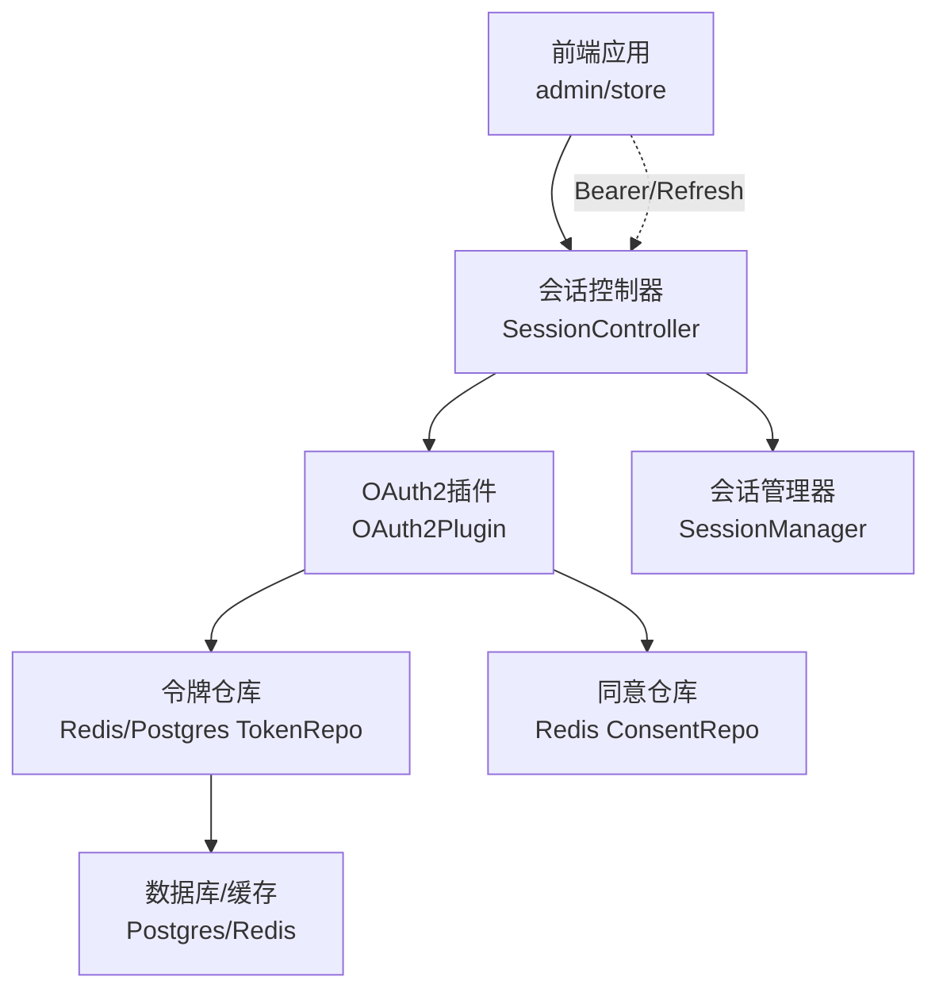
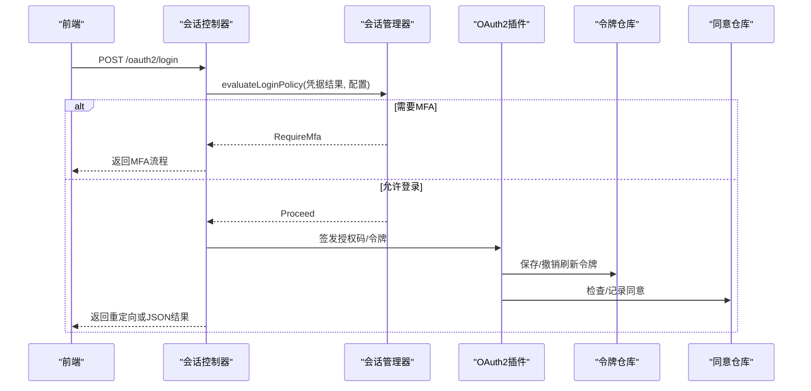
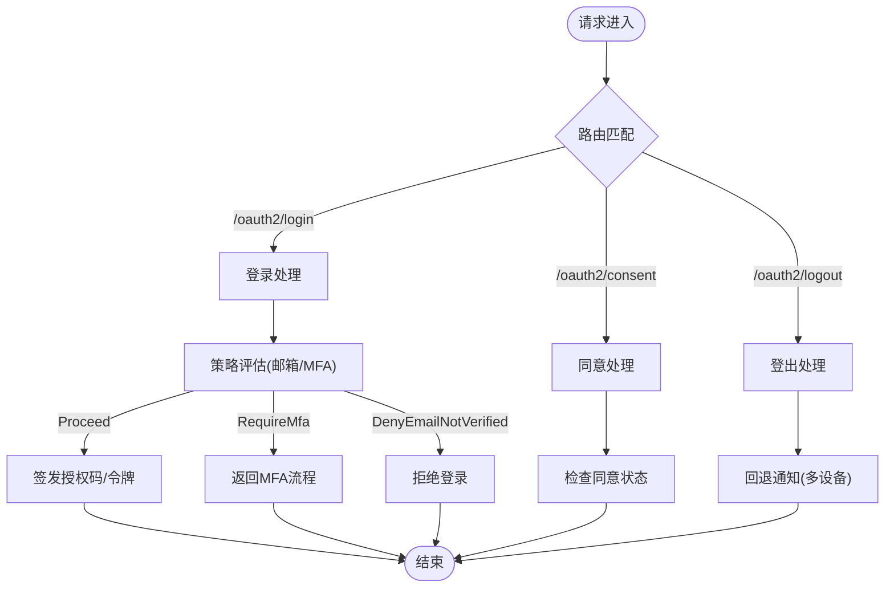
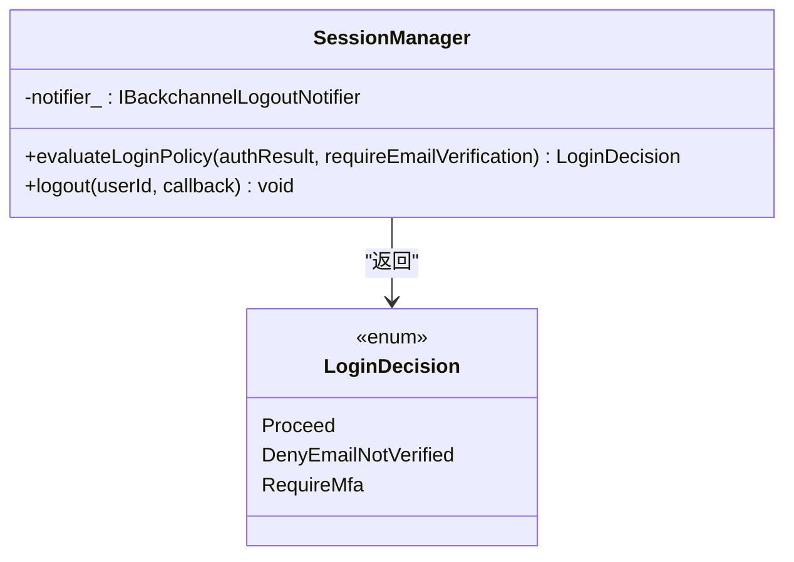
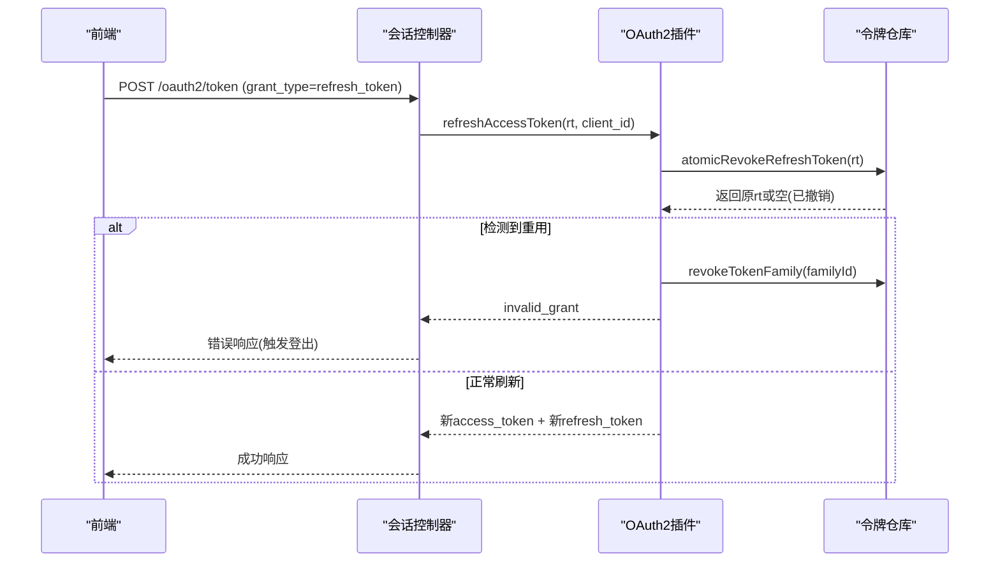
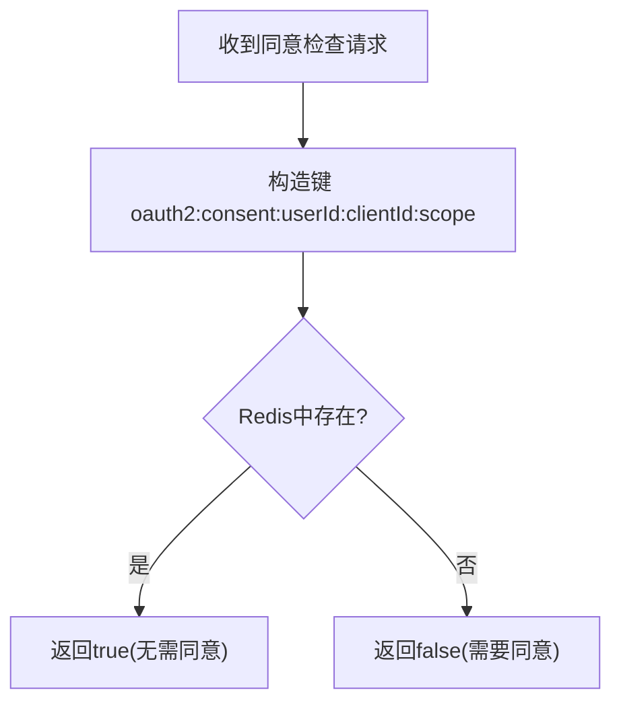
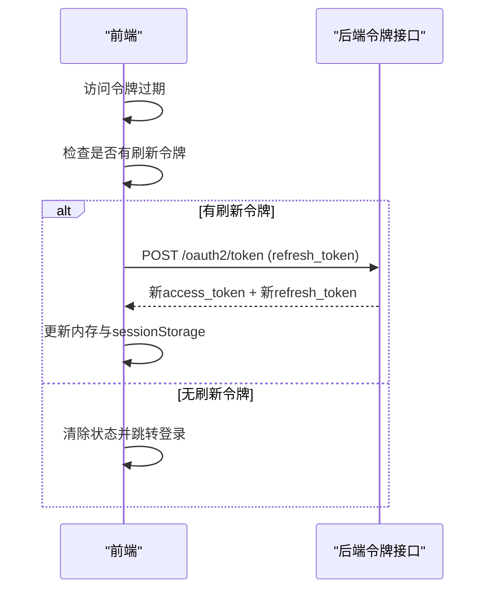
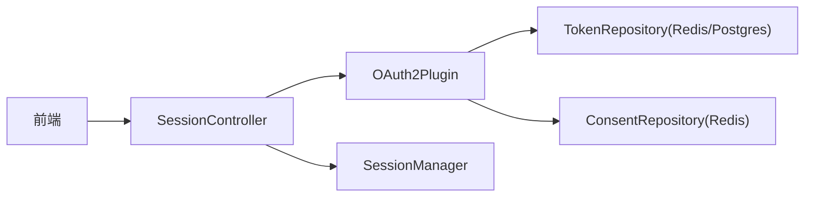

# 会话管理机制

<cite>
**本文引用的文件**
- [SessionController.h](file://libs/drogon/include/authforge/drogon/controllers/SessionController.h)
- [SessionController.cc](file://libs/drogon/src/controllers/SesssionController.cc)
- [SessionManager.h](file://libs/identity/include/authforge/identity/SessionManager.h)
- [SessionManager.cc](file://libs/identity/src/session/SessionManager.cc)
- [OAuth2Plugin.cc](file://libs/drogon/src/plugin/OAuth2Plugin.cc)
- [RedisTokenRepository.cc](file://libs/storage-redis/src/RedisTokenRepository.cc)
- [PostgresTokenRepository.cc](file://libs/storage-postgres/src/PostgresTokenRepository.cc)
- [V008__refresh_token_family.sql](file://apps/server/migrations/V008__refresh_token_family.sql)
- [auth.ts](file://frontends/admin/src/stores/auth.ts)
- [security.spec.ts](file://frontends/admin/tests/e2e/security.spec.ts)
- [_build-test.yml](file://.github/workflows/_build-test.yml)
</cite>

## 目录
1. [简介](#简介)
2. [项目结构](#项目结构)
3. [核心组件](#核心组件)
4. [架构总览](#架构总览)
5. [详细组件分析](#详细组件分析)
6. [依赖关系分析](#依赖关系分析)
7. [性能考量](#性能考量)
8. [故障排查指南](#故障排查指南)
9. [结论](#结论)
10. [附录：API参考与最佳实践](#附录api参考与最佳实践)

## 简介
本文件聚焦于认证授权系统中的“会话管理”能力，覆盖会话生命周期（创建、扩展、刷新、销毁）、存储策略（Redis持久化、内存临时存储）、安全机制（会话ID生成、防重放、防会话固定）、并发控制（单设备/多设备登录策略）以及高并发场景下的优化建议。文档以代码级事实为依据，结合前端行为与后端实现，提供可操作的实践指导。

## 项目结构
与会话管理直接相关的代码分布在以下层次：
- 控制器层：HTTP入口处理登录、同意、登出等会话相关请求
- 身份/会话层：登录策略决策与回退通知转发
- OAuth2插件与服务：令牌签发、刷新、撤销、家族化撤销
- 存储层：Redis与PostgreSQL的令牌与同意等数据持久化
- 前端：访问令牌与刷新令牌在浏览器中的存储与刷新流程

图表来源
- [SessionController.h:32-69](file://libs/drogon/include/authforge/drogon/controllers/SessionController.h#L32-L69)
- [SessionManager.h:76-120](file://libs/identity/include/authforge/identity/SessionManager.h#L76-L120)
- [OAuth2Plugin.cc:312-337](file://libs/drogon/src/plugin/OAuth2Plugin.cc#L312-L337)
- [RedisTokenRepository.cc:153-224](file://libs/storage-redis/src/RedisTokenRepository.cc#L153-L224)
- [PostgresTokenRepository.cc:437-470](file://libs/storage-postgres/src/PostgresTokenRepository.cc#L437-L470)

章节来源
- [SessionController.h:32-69](file://libs/drogon/include/authforge/drogon/controllers/SessionController.h#L32-L69)
- [SessionController.cc:1-200](file://libs/drogon/src/controllers/SesssionController.cc#L1-L200)
- [SessionManager.h:76-120](file://libs/identity/include/authforge/identity/SessionManager.h#L76-L120)
- [SessionManager.cc:12-48](file://libs/identity/src/session/SessionManager.cc#L12-L48)
- [OAuth2Plugin.cc:312-337](file://libs/drogon/src/plugin/OAuth2Plugin.cc#L312-L337)

## 核心组件
- 会话控制器（SessionController）：暴露登录、同意、登出等HTTP接口，负责参数校验、调用身份服务与OAuth2插件，并返回统一错误信封或重定向响应。
- 会话管理器（SessionManager）：封装登录策略决策（邮箱验证强制、MFA要求）与登出时的回退通知转发，不直接签发或撤销令牌。
- OAuth2插件（OAuth2Plugin）：装配存储仓库、管理服务生命周期，协调令牌签发与清理。
- 令牌仓库（Redis/Postgres）：实现令牌的保存、查询、撤销与家族化撤销；Redis模式对刷新令牌支持有限，主要依赖Postgres进行强一致族撤销。
- 同意仓库（Redis）：记录用户对客户端+范围的同意状态，用于授权流程中的同意检查。
- 前端会话管理：使用sessionStorage与内存维护刷新令牌与访问令牌，并在过期时自动刷新，避免Cookie中携带凭证。

章节来源
- [SessionController.h:32-69](file://libs/drogon/include/authforge/drogon/controllers/SessionController.h#L32-L69)
- [SessionManager.h:76-120](file://libs/identity/include/authforge/identity/SessionManager.h#L76-L120)
- [SessionManager.cc:12-48](file://libs/identity/src/session/SessionManager.cc#L12-L48)
- [OAuth2Plugin.cc:312-337](file://libs/drogon/src/plugin/OAuth2Plugin.cc#L312-L337)
- [RedisTokenRepository.cc:153-224](file://libs/storage-redis/src/RedisTokenRepository.cc#L153-L224)
- [PostgresTokenRepository.cc:437-470](file://libs/storage-postgres/src/PostgresTokenRepository.cc#L437-L470)
- [auth.ts:145-185](file://frontends/admin/src/stores/auth.ts#L145-L185)

## 架构总览
会话管理的端到端流程包括：
- 登录：控制器接收凭据，调用身份服务验证，依据策略决定是否进入MFA或放行；通过后由OAuth2插件签发授权码/令牌。
- 同意：根据用户、客户端与范围判断是否已有同意，必要时引导用户同意。
- 刷新：前端在访问令牌过期时，使用刷新令牌换取新令牌；后端执行原子撤销与家族化撤销检测。
- 登出：控制器触发回退通知，使其他设备感知会话失效。

图表来源
- [SessionController.cc:1-200](file://libs/drogon/src/controllers/SesssionController.cc#L1-L200)
- [SessionManager.cc:12-48](file://libs/identity/src/session/SessionManager.cc#L12-L48)
- [RedisTokenRepository.cc:153-224](file://libs/storage-redis/src/RedisTokenRepository.cc#L153-L224)
- [PostgresTokenRepository.cc:437-470](file://libs/storage-postgres/src/PostgresTokenRepository.cc#L437-L470)

## 详细组件分析

### 会话控制器（SessionController）
- 职责：注册路由（登录、同意、登出等），统一错误响应格式，处理授权错误重定向。
- 关键点：
  - 登录接口支持表单与JSON两种交互方式，返回错误或重定向。
  - 登出接口受认证过滤器保护，确保仅已登录用户可触发登出。
  - 通过注入的身份服务与会话管理器协作，完成策略决策与后续动作。

图表来源
- [SessionController.h:32-69](file://libs/drogon/include/authforge/drogon/controllers/SessionController.h#L32-L69)
- [SessionController.cc:1-200](file://libs/drogon/src/controllers/SesssionController.cc#L1-L200)

章节来源
- [SessionController.h:32-69](file://libs/drogon/include/authforge/drogon/controllers/SessionController.h#L32-L69)
- [SessionController.cc:1-200](file://libs/drogon/src/controllers/SesssionController.cc#L1-L200)

### 会话管理器（SessionManager）
- 职责：纯策略决策（邮箱验证优先于MFA）与登出时的回退通知转发。
- 设计边界：不签发/撤销令牌，不读写MFA状态，不直接持久化用户凭据或锁定状态。
- 关键逻辑：
  - 若配置要求邮箱验证且未验证，则拒绝登录。
  - 若启用MFA，则要求完成MFA后再签发令牌。
  - 登出时调用注入的通知器，使其他设备感知会话结束。

图表来源
- [SessionManager.h:76-120](file://libs/identity/include/authforge/identity/SessionManager.h#L76-L120)
- [SessionManager.cc:12-48](file://libs/identity/src/session/SessionManager.cc#L12-L48)

章节来源
- [SessionManager.h:76-120](file://libs/identity/include/authforge/identity/SessionManager.h#L76-L120)
- [SessionManager.cc:12-48](file://libs/identity/src/session/SessionManager.cc#L12-L48)

### 令牌与刷新流程（含家族化撤销）
- 刷新令牌重用检测：
  - 成功刷新后，原刷新令牌被原子撤销；再次使用将触发家族化撤销，审计事件记录。
  - Redis模式下刷新令牌读取为无操作，撤销标记写入哈希；家族化撤销在Redis下有限支持，生产推荐Postgres。
- 家族化撤销：
  - Postgres通过family_id批量撤销同族刷新令牌及关联访问令牌，保证一致性。
  - Redis暂不支持高效二次索引，需维护集合或降级处理。

图表来源
- [RedisTokenRepository.cc:153-224](file://libs/storage-redis/src/RedisTokenRepository.cc#L153-L224)
- [PostgresTokenRepository.cc:437-470](file://libs/storage-postgres/src/PostgresTokenRepository.cc#L437-L470)
- [V008__refresh_token_family.sql:1-7](file://apps/server/migrations/V008__refresh_token_family.sql#L1-L7)

章节来源
- [RedisTokenRepository.cc:153-224](file://libs/storage-redis/src/RedisTokenRepository.cc#L153-L224)
- [PostgresTokenRepository.cc:437-470](file://libs/storage-postgres/src/PostgresTokenRepository.cc#L437-L470)
- [V008__refresh_token_family.sql:1-7](file://apps/server/migrations/V008__refresh_token_family.sql#L1-L7)

### 同意检查（Consent）
- Redis存储同意键：基于用户内部ID、客户端ID与范围组合成键，异步检查是否存在。
- 作用：在授权流程中快速判断是否需要用户同意，减少数据库压力。

图表来源
- [RedisConsentRepository.cc:16-40](file://libs/storage-redis/src/RedisConsentRepository.cc#L16-L40)

章节来源
- [RedisConsentRepository.cc:16-40](file://libs/storage-redis/src/RedisConsentRepository.cc#L16-L40)

### 前端会话管理与刷新
- 存储策略：访问令牌保存在内存，刷新令牌保存在sessionStorage，避免Cookie带来的CSRF风险。
- 刷新去重：同一时间只允许一个刷新请求，防止并发导致刷新令牌被旋转后失败。
- 失效处理：刷新失败时清除本地状态并跳转登录。

图表来源
- [auth.ts:145-185](file://frontends/admin/src/stores/auth.ts#L145-L185)
- [security.spec.ts:120-144](file://frontends/admin/tests/e2e/security.spec.ts#L120-L144)

章节来源
- [auth.ts:145-185](file://frontends/admin/src/stores/auth.ts#L145-L185)
- [security.spec.ts:120-144](file://frontends/admin/tests/e2e/security.spec.ts#L120-L144)

## 依赖关系分析
- 控制器依赖：
  - 会话控制器依赖OAuth2插件与身份服务；可通过setter注入，便于测试与解耦。
- 插件依赖：
  - OAuth2插件装配存储仓库（Redis/Postgres/Memory），管理服务生命周期与清理顺序，确保回调完成后释放资源。
- 存储依赖：
  - Redis仓库轻量、适合同意与缓存；Postgres仓库强一致，适合令牌家族化撤销。
- 前端依赖：
  - 前端通过Bearer令牌与刷新令牌与后端交互，避免Cookie承载敏感信息。

图表来源
- [SessionController.h:32-69](file://libs/drogon/include/authforge/drogon/controllers/SessionController.h#L32-L69)
- [OAuth2Plugin.cc:312-337](file://libs/drogon/src/plugin/OAuth2Plugin.cc#L312-L337)
- [RedisTokenRepository.cc:153-224](file://libs/storage-redis/src/RedisTokenRepository.cc#L153-L224)
- [PostgresTokenRepository.cc:437-470](file://libs/storage-postgres/src/PostgresTokenRepository.cc#L437-L470)

章节来源
- [SessionController.h:32-69](file://libs/drogon/include/authforge/drogon/controllers/SessionController.h#L32-L69)
- [OAuth2Plugin.cc:312-337](file://libs/drogon/src/plugin/OAuth2Plugin.cc#L312-L337)

## 性能考量
- 存储选择：
  - 同意检查使用Redis键存在性判断，低延迟、高吞吐。
  - 令牌家族化撤销使用Postgres批量更新，保证一致性；Redis模式降级为日志警告与部分支持。
- 并发刷新：
  - 前端对刷新请求进行去重，避免并发导致的令牌旋转冲突。
- 资源清理：
  - 插件关闭时按顺序停止清理定时器、释放服务与仓库引用，确保异步回调完成后再销毁底层存储。

章节来源
- [RedisConsentRepository.cc:16-40](file://libs/storage-redis/src/RedisConsentRepository.cc#L16-L40)
- [PostgresTokenRepository.cc:437-470](file://libs/storage-postgres/src/PostgresTokenRepository.cc#L437-L470)
- [auth.ts:145-185](file://frontends/admin/src/stores/auth.ts#L145-L185)
- [OAuth2Plugin.cc:312-337](file://libs/drogon/src/plugin/OAuth2Plugin.cc#L312-L337)

## 故障排查指南
- 登录超时：
  - 授权流程中若等待会话创建超时，可能因参数缺失或后端阻塞；检查请求参数与后端日志。
- 登出失败：
  - 无会话时调用登出会返回未授权；确认当前会话状态与过滤器配置。
- Redis就绪检查：
  - CI环境中通过ping检查Redis可用性，若不可用则输出日志并终止流程。

章节来源
- [OAuth2FlowE2ETest.cc:278-319](file://tests/e2e-backend/oauth2_flows/OAuth2FlowE2ETest.cc#L278-L319)
- [_build-test.yml:248-282](file://.github/workflows/_build-test.yml#L248-L282)

## 结论
本会话管理机制通过清晰的职责分层与存储抽象，实现了安全的会话生命周期管理。策略决策与令牌签发解耦，存储层兼顾性能与一致性，前端采用无Cookie的Bearer方案提升安全性。在高并发场景下，通过前端刷新去重与后端家族化撤销保障令牌安全。生产环境建议使用Postgres进行令牌家族化管理，Redis用于同意与缓存以提升性能。

## 附录：API参考与最佳实践
- 会话相关接口
  - POST /oauth2/login：认证用户并生成授权码或返回重定向
  - POST /oauth2/consent：提交用户同意
  - POST /oauth2/logout：登出并触发回退通知
  - POST /oauth2/token：授权码兑换令牌；刷新令牌获取新令牌
- 安全最佳实践
  - 使用随机、高熵的会话标识与令牌；避免可预测ID。
  - 启用邮箱验证强制与MFA，遵循策略决策优先级。
  - 前端不将凭证存入Cookie，使用Authorization头传递Bearer令牌。
  - 刷新令牌一次一换，检测重用并触发家族化撤销。
- 并发与性能
  - 前端对刷新请求去重，避免并发竞争。
  - 同意检查走Redis，令牌家族化撤销走Postgres。
  - 插件关闭时有序释放资源，避免悬垂回调。

章节来源
- [SessionController.h:32-69](file://libs/drogon/include/authforge/drogon/controllers/SessionController.h#L32-L69)
- [SessionController.cc:1-200](file://libs/drogon/src/controllers/SesssionController.cc#L1-L200)
- [auth.ts:145-185](file://frontends/admin/src/stores/auth.ts#L145-L185)
- [security.spec.ts:120-144](file://frontends/admin/tests/e2e/security.spec.ts#L120-L144)
- [PostgresTokenRepository.cc:437-470](file://libs/storage-postgres/src/PostgresTokenRepository.cc#L437-L470)
- [RedisTokenRepository.cc:153-224](file://libs/storage-redis/src/RedisTokenRepository.cc#L153-L224)