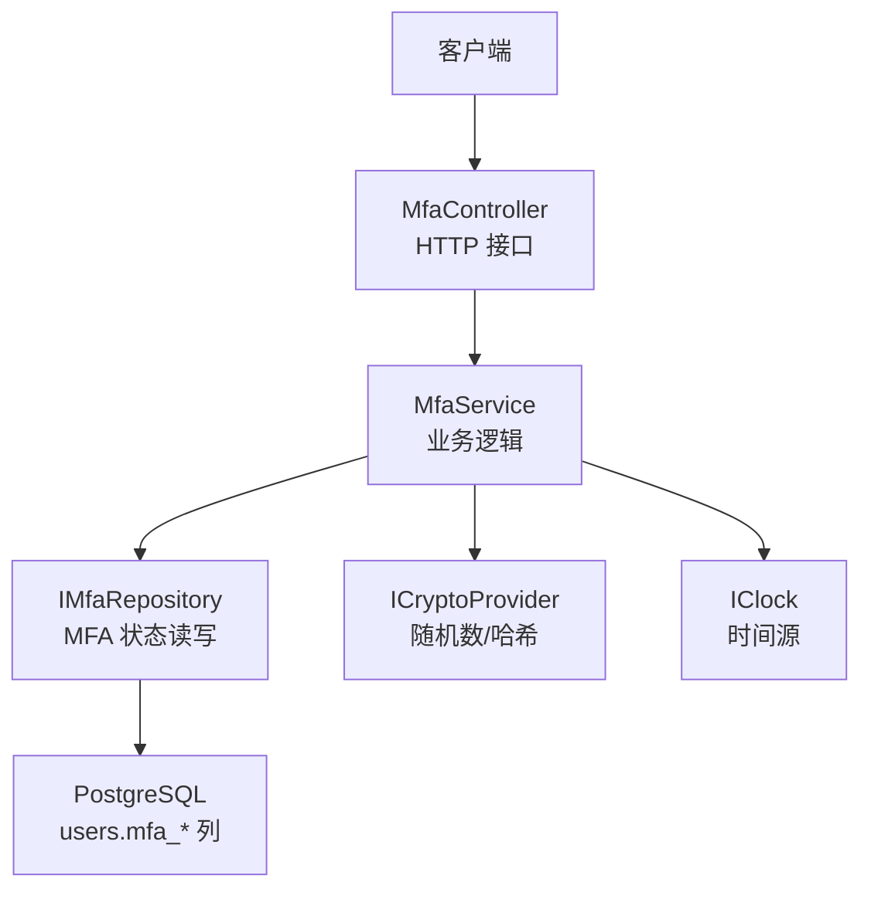
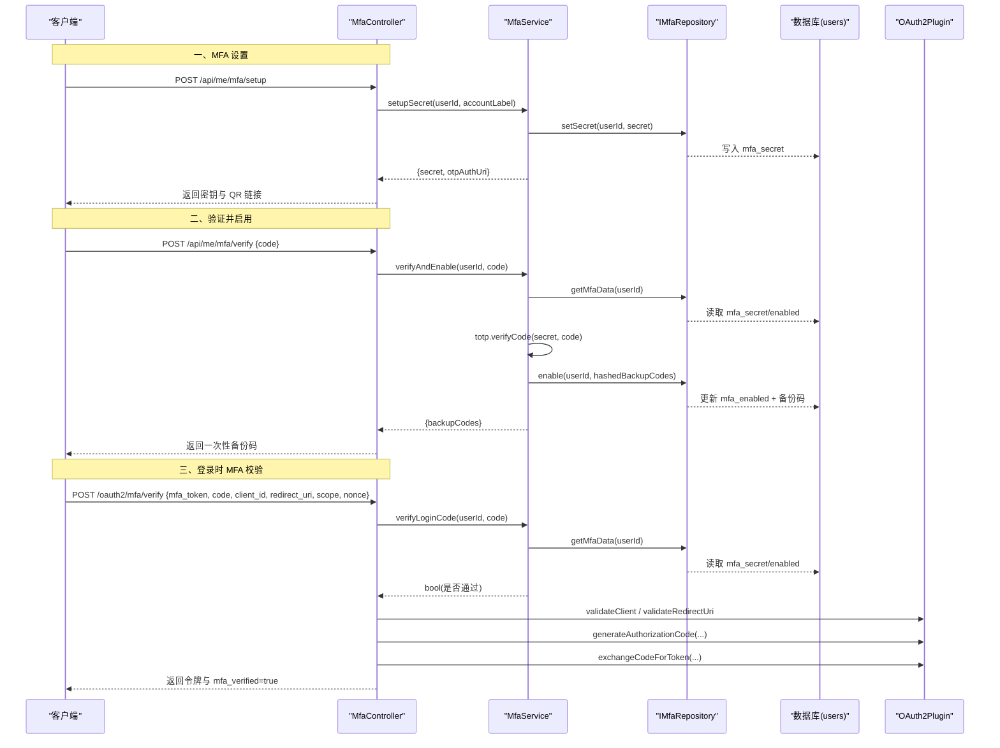
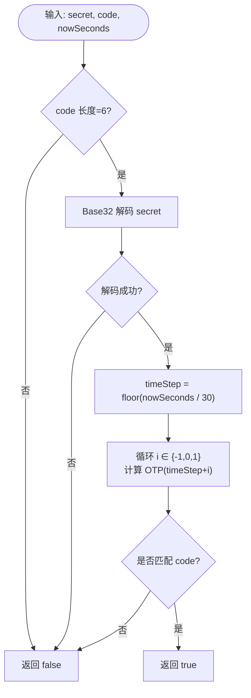
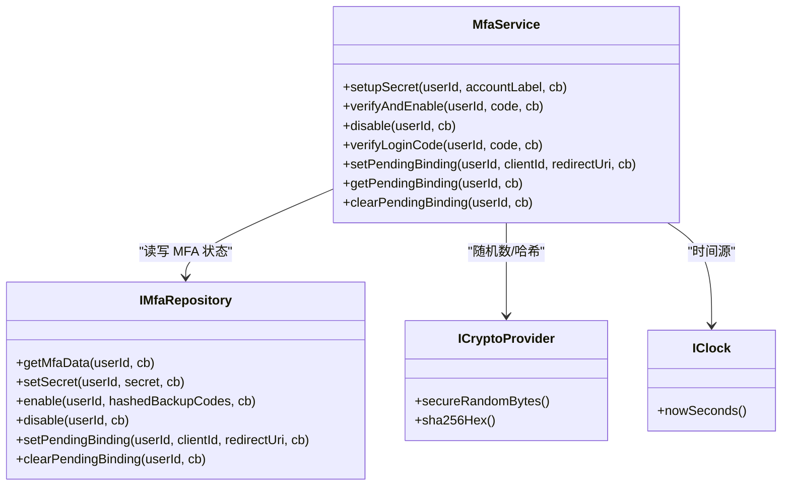
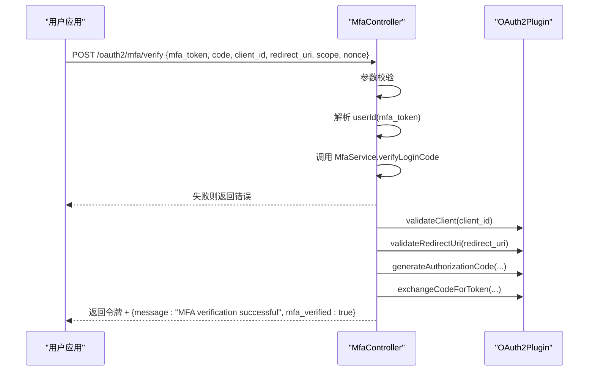
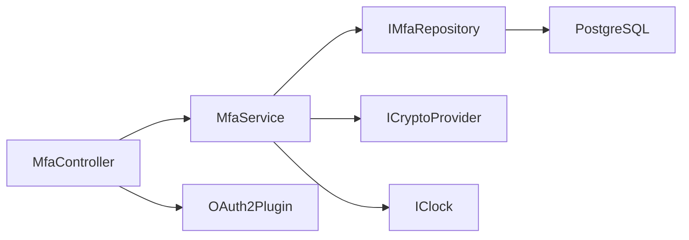

# 多因素认证 (MFA)

<cite>
**本文引用的文件**
- [MfaService.cc](file://libs/identity/src/mfa/MfaService.cc)
- [TotpUtils.cc](file://libs/identity/src/mfa/TotpUtils.cc)
- [IMfaRepository.h](file://libs/identity/include/authforge/identity/IMfaRepository.h)
- [MfaController.cc](file://libs/drogon/src/controllers/MfaController.cc)
- [MfaController.h](file://libs/drogon/include/authforge/drogon/controllers/MfaController.h)
- [V011__mfa_support.sql](file://apps/server/migrations/V011__mfa_support.sql)
- [V022__mfa_pending_client_binding.sql](file://apps/server/migrations/V022__mfa_pending_client_binding.sql)
- [IdentityAssembly.cc](file://apps/server/src/bootstrap/IdentityAssembly.cc)
- [ErrorCatalog.cc](file://libs/common/src/error/ErrorCatalog.cc)
</cite>

## 目录
1. [简介](#简介)
2. [项目结构](#项目结构)
3. [核心组件](#核心组件)
4. [架构总览](#架构总览)
5. [详细组件分析](#详细组件分析)
6. [依赖关系分析](#依赖关系分析)
7. [性能考虑](#性能考虑)
8. [故障排查指南](#故障排查指南)
9. [结论](#结论)
10. [附录](#附录)

## 简介
本文件面向实现与集成者，系统性说明 AuthForge 的多因素认证（MFA）能力，重点覆盖基于时间的一次性密码（TOTP）的密钥生成、QR 码链接生成、验证码校验、启用流程、登录验证流程、跨客户端状态绑定与一致性保障，以及常见问题的定位与解决。文档同时提供代码级流程图与时序图，帮助读者快速理解数据流与控制流。

## 项目结构
MFA 功能横跨身份层服务、控制器、工具库与数据库迁移：
- 身份层服务：MfaService 封装 TOTP 设置、启用、禁用、登录时校验与待绑定信息维护。
- 控制器：MfaController 暴露 HTTP 接口，负责请求解析、鉴权、审计日志与 OAuth2 令牌发放编排。
- 工具库：TotpUtils 实现 Base32 编解码、HMAC-SHA1 TOTP 计算、备份码生成与 otpauth URI 构造。
- 存储抽象：IMfaRepository 定义 MFA 相关用户状态的读写接口。
- 数据库迁移：新增 mfa_* 列与待绑定字段，支撑 MFA 状态持久化。
- 装配：IdentityAssembly 在启动时将 MfaService、仓库与端口注入到控制器与服务中。

图表来源
- [MfaController.cc:92-190](file://libs/drogon/src/controllers/MfaController.cc#L92-L190)
- [MfaService.cc:8-47](file://libs/identity/src/mfa/MfaService.cc#L8-L47)
- [IMfaRepository.h:22-75](file://libs/identity/include/authforge/identity/IMfaRepository.h#L22-L75)
- [V011__mfa_support.sql:1-7](file://apps/server/migrations/V011__mfa_support.sql#L1-L7)
- [V022__mfa_pending_client_binding.sql:1-9](file://apps/server/migrations/V022__mfa_pending_client_binding.sql#L1-L9)

章节来源
- [MfaController.h:52-72](file://libs/drogon/include/authforge/drogon/controllers/MfaController.h#L52-L72)
- [IdentityAssembly.cc:101-137](file://apps/server/src/bootstrap/IdentityAssembly.cc#L101-L137)

## 核心组件
- MfaService：提供设置、验证启用、禁用、登录时 TOTP 校验、待绑定信息管理等功能；通过注入式依赖解耦存储、加密与时间源。
- TotpUtils：实现 RFC 6238 兼容的 TOTP 算法（SHA1、6 位、30 秒步长），支持密钥生成、验证码生成/校验、otpauth URI 与备份码生成。
- IMfaRepository：定义 MFA 状态的最小接口集合，包括获取状态、写入密钥、启用并保存备份码、禁用、记录/读取/清理待绑定信息。
- MfaController：对外暴露 /api/me/mfa/* 与 /oauth2/mfa/verify 等端点，处理请求参数、错误响应、审计日志，并在登录流程中协调授权码与令牌交换。

章节来源
- [MfaService.h:47-161](file://libs/identity/include/authforge/identity/MfaService.h#L47-L161)
- [TotpUtils.cc:108-180](file://libs/identity/src/mfa/TotpUtils.cc#L108-L180)
- [IMfaRepository.h:22-75](file://libs/identity/include/authforge/identity/IMfaRepository.h#L22-L75)
- [MfaController.cc:92-800](file://libs/drogon/src/controllers/MfaController.cc#L92-L800)

## 架构总览
下图展示从客户端发起 MFA 设置到最终启用与登录验证的整体交互。

图表来源
- [MfaController.cc:92-190](file://libs/drogon/src/controllers/MfaController.cc#L92-L190)
- [MfaController.cc:192-376](file://libs/drogon/src/controllers/MfaController.cc#L192-L376)
- [MfaController.cc:460-681](file://libs/drogon/src/controllers/MfaController.cc#L460-L681)
- [MfaService.cc:21-138](file://libs/identity/src/mfa/MfaService.cc#L21-L138)
- [V011__mfa_support.sql:1-7](file://apps/server/migrations/V011__mfa_support.sql#L1-L7)
- [V022__mfa_pending_client_binding.sql:1-9](file://apps/server/migrations/V022__mfa_pending_client_binding.sql#L1-L9)

## 详细组件分析

### TOTP 工具库（TotpUtils）
- 密钥生成：使用安全随机数生成 20 字节密钥并以 Base32 编码输出，便于扫码器识别。
- OTP 计算：按 30 秒时间步长对计数器进行 HMAC-SHA1 计算，取偏移后 4 字节并模 10^6 得到 6 位数字。
- 容错窗口：验证时允许 ±1 个时间步长的时钟偏差，提升用户体验。
- QR 链接：构造 otpauth://totp 链接，包含 issuer、account、secret、算法、位数与周期等参数。
- 备份码：生成由无歧义字符集组成的短码，供紧急恢复使用。

图表来源
- [TotpUtils.cc:125-144](file://libs/identity/src/mfa/TotpUtils.cc#L125-L144)

章节来源
- [TotpUtils.cc:108-180](file://libs/identity/src/mfa/TotpUtils.cc#L108-L180)

### 身份服务（MfaService）
- 设置密钥：生成随机密钥与 otpauth URI，调用仓库写入临时密钥（未启用）。
- 验证并启用：读取用户密钥，校验 TOTP；通过后生成备份码并哈希存储，标记启用。
- 禁用：清除密钥与备份码，关闭 MFA。
- 登录校验：读取已启用的密钥，校验当前 TOTP。
- 待绑定管理：记录首次认证触发的 client_id 与 redirect_uri，二次校验时强制一致，防止跨客户端混淆。

图表来源
- [MfaService.h:47-161](file://libs/identity/include/authforge/identity/MfaService.h#L47-L161)
- [IMfaRepository.h:22-75](file://libs/identity/include/authforge/identity/IMfaRepository.h#L22-L75)

章节来源
- [MfaService.cc:8-186](file://libs/identity/src/mfa/MfaService.cc#L8-L186)

### 控制器（MfaController）
- 设置端点：/api/me/mfa/setup，返回密钥与 otpauth URI，用于前端生成 QR 码。
- 验证端点：/api/me/mfa/verify，校验 TOTP 并返回一次性备份码。
- 禁用端点：/api/me/mfa/disable，关闭 MFA。
- 登录校验端点：/oauth2/mfa/verify，校验 TOTP 后执行 OAuth2 授权码生成与令牌交换，返回令牌并标注 mfa_verified。

图表来源
- [MfaController.cc:460-681](file://libs/drogon/src/controllers/MfaController.cc#L460-L681)
- [MfaController.h:52-72](file://libs/drogon/include/authforge/drogon/controllers/MfaController.h#L52-L72)

章节来源
- [MfaController.cc:92-800](file://libs/drogon/src/controllers/MfaController.cc#L92-L800)

### 数据库模型与迁移
- V011：为 users 表增加 mfa_enabled、mfa_secret、mfa_backup_codes（JSON 数组，存储哈希后的备份码）。
- V022：为 users 表增加 mfa_pending_client_id、mfa_pending_redirect_uri，用于记录触发 MFA 的首次认证上下文，确保二次校验时 client_id 与 redirect_uri 一致。

章节来源
- [V011__mfa_support.sql:1-7](file://apps/server/migrations/V011__mfa_support.sql#L1-L7)
- [V022__mfa_pending_client_binding.sql:1-9](file://apps/server/migrations/V022__mfa_pending_client_binding.sql#L1-L9)

## 依赖关系分析
- 控制器依赖：MfaController 依赖 MfaService、IUserRepository（用于 public_sub 到内部 id 的转换）、OAuth2Plugin（用于授权码与令牌流程）。
- 服务依赖：MfaService 依赖 IMfaRepository、ICryptoProvider、IClock，保持框架无关的业务逻辑。
- 工具库依赖：TotpUtils 依赖 OpenSSL 的 HMAC-SHA1 与安全随机源。
- 装配：IdentityAssembly 在启动时创建 MfaService 并注入到控制器，保证单例与生命周期管理。

图表来源
- [IdentityAssembly.cc:101-137](file://apps/server/src/bootstrap/IdentityAssembly.cc#L101-L137)
- [MfaController.h:92-99](file://libs/drogon/include/authforge/drogon/controllers/MfaController.h#L92-L99)
- [MfaService.h:72-80](file://libs/identity/include/authforge/identity/MfaService.h#L72-L80)

章节来源
- [IdentityAssembly.cc:101-137](file://apps/server/src/bootstrap/IdentityAssembly.cc#L101-L137)

## 性能考虑
- TOTP 验证复杂度：每次验证最多计算 3 个时间步长的 OTP（±1 容差），时间复杂度 O(1)，空间开销极小。
- 随机性与哈希：密钥与备份码生成使用安全随机源；备份码以 SHA-256 哈希存储，避免明文泄露。
- 数据库访问：设置与启用路径各一次写操作；登录校验一次读操作。建议对 users 表的 mfa_* 列建立必要索引以提升查询性能。
- 时钟同步：服务端通过 IClock 抽象可替换为可控时间源，测试与生产均可调优；客户端设备时钟偏差在 ±1 步长内被容忍。

[本节为通用指导，不直接分析具体文件]

## 故障排查指南
- 验证码无效
  - 现象：/api/me/mfa/verify 或 /oauth2/mfa/verify 返回验证码错误。
  - 可能原因：客户端时间偏差过大、设备未正确配置 TOTP、密钥不一致。
  - 处理：检查设备时间与服务器时间同步；重新扫描 QR 码；确认 app 显示的应用名称与 issuer 一致。
  - 参考错误码：AUTH_MFA_CODE_INVALID。

- 尚未完成 MFA 设置
  - 现象：在未调用设置端点的情况下直接验证，提示未配置。
  - 处理：先调用 /api/me/mfa/setup 获取密钥与 QR 链接，再调用 /api/me/mfa/verify。
  - 参考错误码：AUTH_MFA_NOT_CONFIGURED。

- 跨客户端混淆
  - 现象：在 A 客户端触发 MFA，却在 B 客户端提交验证码导致失败。
  - 处理：系统会校验首次登录记录的 client_id 与 redirect_uri；请确保在同一会话上下文中完成 MFA 验证。
  - 相关字段：mfa_pending_client_id、mfa_pending_redirect_uri。

- 备份码丢失
  - 现象：启用 MFA 后未保存备份码，后续无法登录。
  - 处理：启用时返回一次性备份码需妥善保存；若丢失，请联系管理员重置或走回滚策略。

- 禁用失败
  - 现象：/api/me/mfa/disable 返回数据库错误。
  - 处理：检查数据库连接与权限；确认用户存在且具备相应权限。

章节来源
- [ErrorCatalog.cc:202-212](file://libs/common/src/error/ErrorCatalog.cc#L202-L212)
- [MfaController.cc:192-376](file://libs/drogon/src/controllers/MfaController.cc#L192-L376)
- [MfaController.cc:460-681](file://libs/drogon/src/controllers/MfaController.cc#L460-L681)

## 结论
AuthForge 的 MFA 模块以清晰的职责分层实现了 TOTP 的全生命周期管理：安全的密钥生成、友好的 QR 码引导、严格的验证码校验、一次性备份码机制，以及跨客户端的一致性保障。通过注入式依赖与最小接口设计，该模块具备良好的可测试性与可扩展性。建议在部署时关注时间同步、备份码管理与审计日志，以获得稳定可靠的二次认证体验。

[本节为总结性内容，不直接分析具体文件]

## 附录

### API 端点一览
- POST /api/me/mfa/setup：初始化 MFA，返回密钥与 otpauth URI。
- POST /api/me/mfa/verify：验证 TOTP 并启用 MFA，返回一次性备份码。
- POST /api/me/mfa/disable：禁用 MFA。
- POST /oauth2/mfa/verify：登录时 MFA 校验，成功后生成授权码并换取令牌，返回令牌与 mfa_verified 标志。

章节来源
- [MfaController.h:52-72](file://libs/drogon/include/authforge/drogon/controllers/MfaController.h#L52-L72)

### 关键数据结构
- MfaSetupResult：包含 secret 与 otpAuthUri。
- MfaEnableResult：包含一次性备份码列表。
- MfaData：包含 secret、enabled、hashedBackupCodes、pendingClientId、pendingRedirectUri。

章节来源
- [MfaService.h:47-62](file://libs/identity/include/authforge/identity/MfaService.h#L47-L62)
- [IMfaRepository.h:22-33](file://libs/identity/include/authforge/identity/IMfaRepository.h#L22-L33)

### 集成示例（步骤指引）
- 初始设置
  - 调用 /api/me/mfa/setup，获取密钥与 otpauth URI。
  - 在前端渲染 QR 码，引导用户使用认证器 App 扫描。
- 验证并启用
  - 用户在 App 中获取 6 位验证码，调用 /api/me/mfa/verify。
  - 成功后保存一次性备份码，并开启 MFA 保护。
- 登录验证
  - 首次认证触发 MFA，记录 client_id 与 redirect_uri。
  - 二次校验调用 /oauth2/mfa/verify，通过后进入授权码与令牌交换流程。
- 跨客户端一致性
  - 确保同一会话上下文完成 MFA 验证，避免不同客户端之间的混淆。

[本节为概念性说明，不直接分析具体文件]