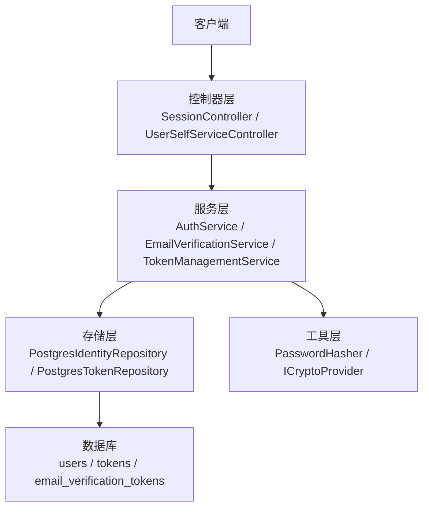
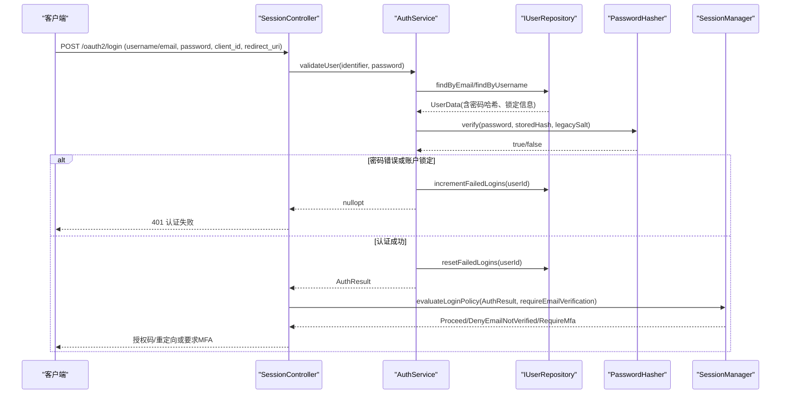
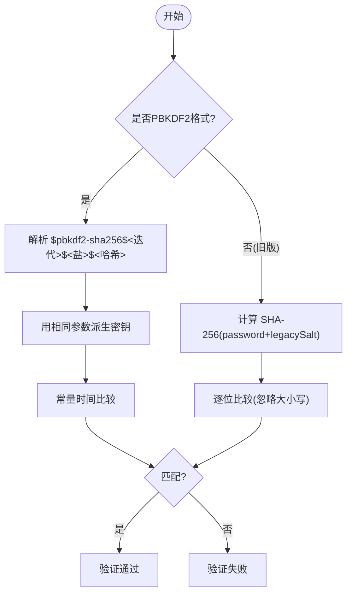
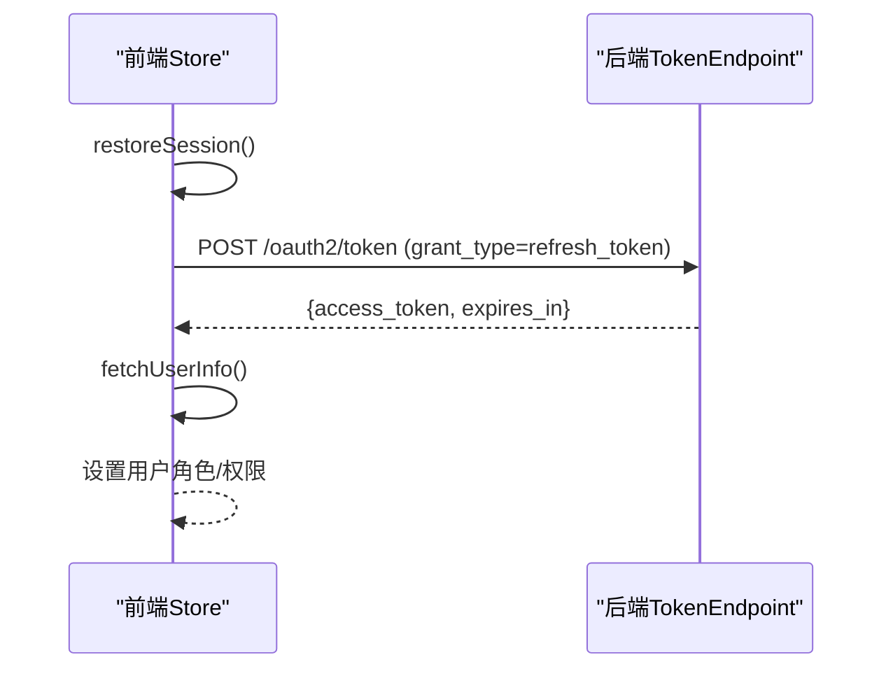
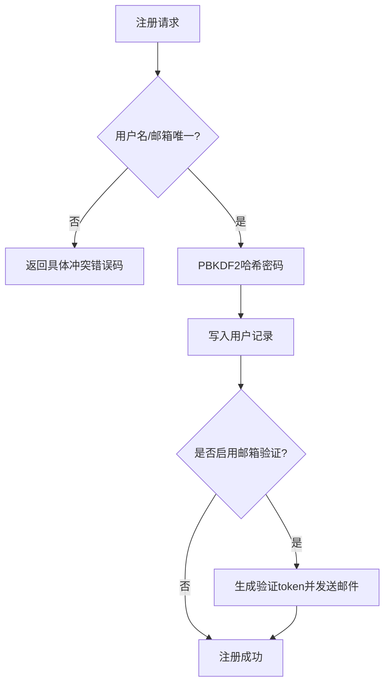
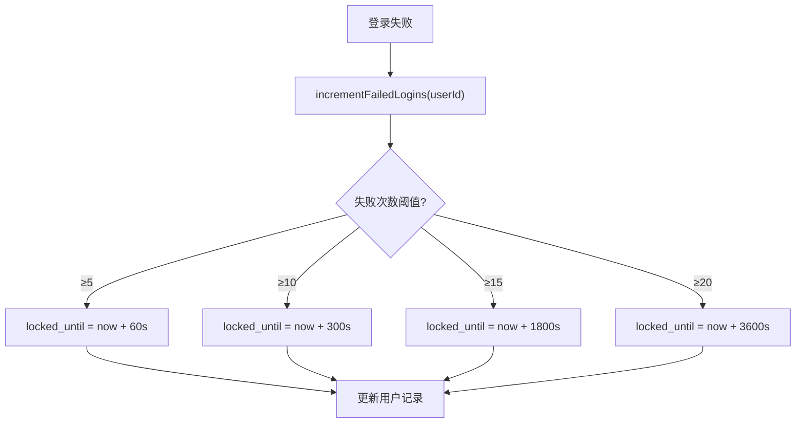
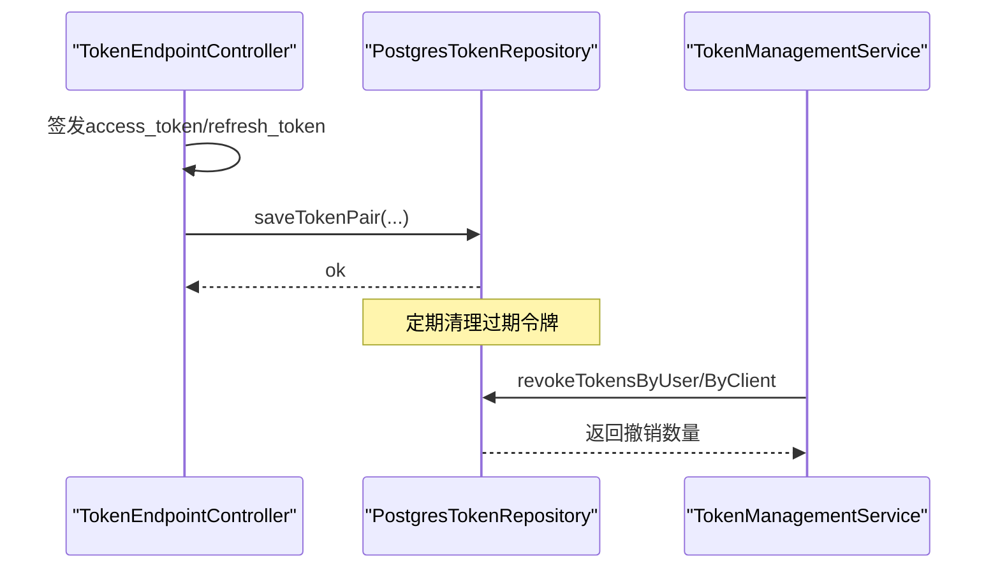
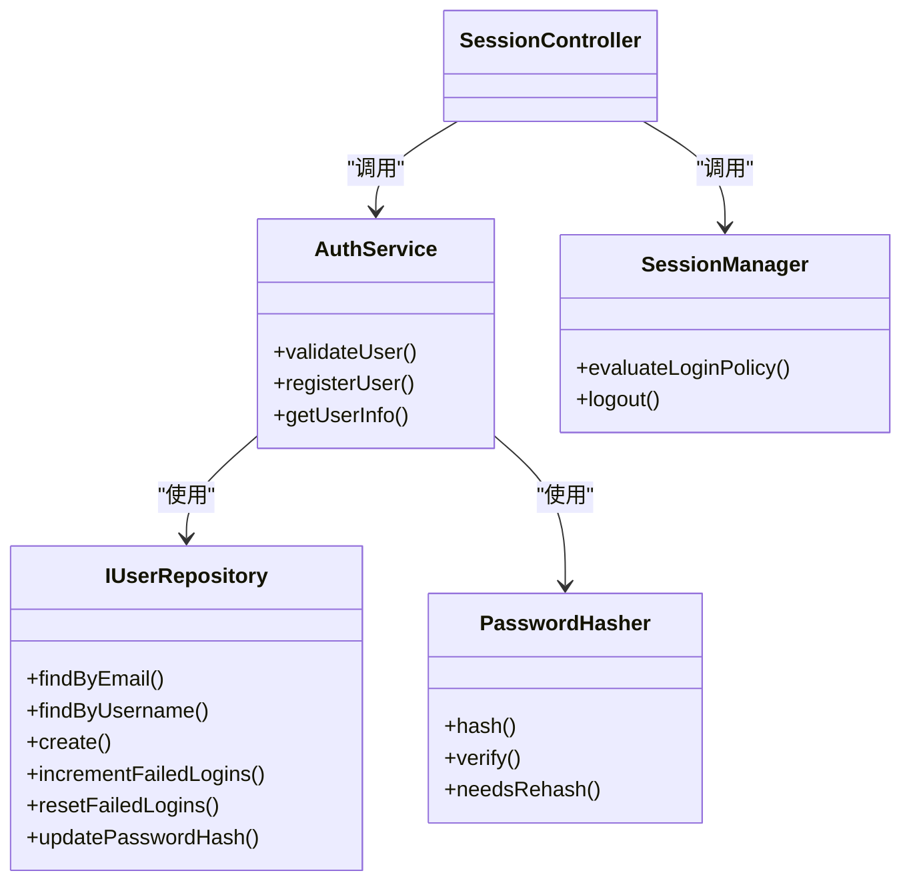

# 用户认证系统

<cite>
**本文引用的文件**
- [libs/identity/src/AuthService.cc](file://libs/identity/src/AuthService.cc)
- [libs/drogon/include/authforge/drogon/utils/PasswordHasher.h](file://libs/drogon/include/authforge/drogon/utils/PasswordHasher.h)
- [libs/drogon/src/utils/PasswordHasher.cc](file://libs/drogon/src/utils/PasswordHasher.cc)
- [libs/storage-postgres/src/PostgresIdentityRepository.cc](file://libs/storage-postgres/src/PostgresIdentityRepository.cc)
- [apps/server/migrations/V013__account_lockout.sql](file://apps/server/migrations/V013__account_lockout.sql)
- [scripts/backend/reset-account-lockout.sh](file://scripts/backend/reset-account-lockout.sh)
- [libs/drogon/src/controllers/SessionController.cc](file://libs/drogon/src/controllers/SessionController.cc)
- [apps/server/docs/api/openapi.json](file://apps/server/docs/api/openapi.json)
- [apps/server/openapi.yaml](file://apps/server/openapi.yaml)
- [libs/drogon/src/services/EmailVerificationService.cc](file://libs/drogon/src/services/EmailVerificationService.cc)
- [apps/server/migrations/V010__email_verification.sql](file://apps/server/migrations/V010__email_verification.sql)
- [apps/server/migrations/V009__password_reset_tokens.sql](file://apps/server/migrations/V009__password_reset_tokens.sql)
- [libs/drogon/src/controllers/UserSelfServiceController.cc](file://libs/drogon/src/controllers/UserSelfServiceController.cc)
- [libs/drogon/src/admin/TokenManagementService.cc](file://libs/drogon/src/admin/TokenManagementService.cc)
- [libs/storage-postgres/src/PostgresTokenRepository.cc](file://libs/storage-postgres/src/PostgresTokenRepository.cc)
- [frontends/admin/src/stores/auth.ts](file://frontends/admin/src/stores/auth.ts)
</cite>

## 目录
1. [简介](#简介)
2. [项目结构](#项目结构)
3. [核心组件](#核心组件)
4. [架构总览](#架构总览)
5. [详细组件分析](#详细组件分析)
6. [依赖关系分析](#依赖关系分析)
7. [性能考虑](#性能考虑)
8. [故障排查指南](#故障排查指南)
9. [结论](#结论)
10. [附录：API参考与使用示例](#附录api参考与使用示例)

## 简介
本文件面向用户认证系统的实现与使用，覆盖密码认证机制（PBKDF2-SHA256、盐值生成、验证流程）、会话管理（创建、验证、刷新、销毁）、用户注册（邮箱验证、用户名唯一性、密码强度）、账户锁定（失败次数限制、渐进式锁定时间、解锁策略），以及完整的认证API参考、错误处理与最佳实践。

## 项目结构
认证相关能力分布在以下层次：
- 控制器层：SessionController、UserSelfServiceController、PasswordResetController等负责HTTP路由与请求编排。
- 服务层：AuthService、EmailVerificationService、TokenManagementService等封装业务逻辑。
- 存储层：PostgresIdentityRepository、PostgresTokenRepository对接数据库。
- 工具与适配层：PasswordHasher、ICryptoProvider提供密码哈希与加密原语。
- 前端：admin store维护会话状态并自动刷新令牌。

图表来源
- [libs/drogon/src/controllers/SessionController.cc:1-200](file://libs/drogon/src/controllers/SessionController.cc#L1-L200)
- [libs/identity/src/AuthService.cc:150-237](file://libs/identity/src/AuthService.cc#L150-L237)
- [libs/storage-postgres/src/PostgresIdentityRepository.cc:360-391](file://libs/storage-postgres/src/PostgresIdentityRepository.cc#L360-L391)
- [libs/drogon/src/utils/PasswordHasher.cc:51-84](file://libs/drogon/src/utils/PasswordHasher.cc#L51-L84)

章节来源
- [libs/drogon/src/controllers/SessionController.cc:1-200](file://libs/drogon/src/controllers/SessionController.cc#L1-L200)
- [apps/server/docs/api/openapi.json:1142-1186](file://apps/server/docs/api/openapi.json#L1142-L1186)

## 核心组件
- 密码哈希与验证：采用PBKDF2-SHA256（310,000次迭代），兼容旧版SHA-256+salt格式；登录成功后对旧哈希进行迁移重哈希。
- 用户认证与会话策略：AuthService负责查找用户、校验密码、更新失败计数与重置成功计数；SessionManager决定是否需要邮箱验证或MFA。
- 注册流程：通过IUserRepository.create完成唯一性检查（用户名、邮箱）并返回结构化错误码；支持可选邮箱发送验证邮件。
- 账户锁定：基于failed_login_count与locked_until字段实现渐进式锁定（5/10/15/20次阈值对应不同锁定时长）。
- 令牌管理：访问令牌与刷新令牌持久化、过期清理、按用户/客户端撤销。

章节来源
- [libs/drogon/include/authforge/drogon/utils/PasswordHasher.h:7-53](file://libs/drogon/include/authforge/drogon/utils/PasswordHasher.h#L7-L53)
- [libs/drogon/src/utils/PasswordHasher.cc:51-84](file://libs/drogon/src/utils/PasswordHasher.cc#L51-L84)
- [libs/identity/src/AuthService.cc:63-146](file://libs/identity/src/AuthService.cc#L63-L146)
- [libs/identity/src/AuthService.cc:159-237](file://libs/identity/src/AuthService.cc#L159-L237)
- [libs/storage-postgres/src/PostgresIdentityRepository.cc:360-391](file://libs/storage-postgres/src/PostgresIdentityRepository.cc#L360-L391)
- [apps/server/migrations/V013__account_lockout.sql:1-6](file://apps/server/migrations/V013__account_lockout.sql#L1-L6)

## 架构总览
下图展示一次“用户名/邮箱 + 密码”登录的端到端流程，包括密码验证、账户锁定检查、失败计数递增/重置、以及后续会话策略决策。

图表来源
- [libs/drogon/src/controllers/SessionController.cc:103-180](file://libs/drogon/src/controllers/SessionController.cc#L103-L180)
- [libs/identity/src/AuthService.cc:159-237](file://libs/identity/src/AuthService.cc#L159-L237)
- [libs/drogon/src/utils/PasswordHasher.cc:120-156](file://libs/drogon/src/utils/PasswordHasher.cc#L120-L156)
- [libs/storage-postgres/src/PostgresIdentityRepository.cc:360-391](file://libs/storage-postgres/src/PostgresIdentityRepository.cc#L360-L391)

## 详细组件分析

### 密码认证机制（PBKDF2-SHA256）
- 哈希算法与参数：PBKDF2-HMAC-SHA256，310,000次迭代，16字节随机盐，输出32字节密钥。
- 存储格式：$pbkdf2-sha256$<iterations>$<hex-salt>$<hex-hash>。
- 兼容性：支持旧版SHA-256(password+salt)十六进制存储，并在首次成功登录后自动迁移至PBKDF2。
- 验证流程：解析存储格式→提取迭代次数与盐→重新派生密钥→常量时间比较。

图表来源
- [libs/drogon/src/utils/PasswordHasher.cc:51-84](file://libs/drogon/src/utils/PasswordHasher.cc#L51-L84)
- [libs/drogon/src/utils/PasswordHasher.cc:120-156](file://libs/drogon/src/utils/PasswordHasher.cc#L120-L156)
- [libs/identity/src/AuthService.cc:63-146](file://libs/identity/src/AuthService.cc#L63-L146)

章节来源
- [libs/drogon/include/authforge/drogon/utils/PasswordHasher.h:7-53](file://libs/drogon/include/authforge/drogon/utils/PasswordHasher.h#L7-L53)
- [libs/drogon/src/utils/PasswordHasher.cc:51-84](file://libs/drogon/src/utils/PasswordHasher.cc#L51-L84)
- [libs/drogon/src/utils/PasswordHasher.cc:120-156](file://libs/drogon/src/utils/PasswordHasher.cc#L120-L156)
- [libs/identity/src/AuthService.cc:63-146](file://libs/identity/src/AuthService.cc#L63-L146)

### 会话管理与策略
- 登录策略：SessionManager.evaluateLoginPolicy根据AuthResult与配置决定是否允许继续、拒绝未验证邮箱或要求MFA。
- 会话恢复：前端store在页面刷新时尝试使用持久化的refresh token刷新access token，若失败则视为未认证。
- 注销：SessionManager.logout转发到后端适配器以触发回退通道通知（不在此类中撤销令牌）。

图表来源
- [frontends/admin/src/stores/auth.ts:184-210](file://frontends/admin/src/stores/auth.ts#L184-L210)
- [libs/drogon/src/controllers/TokenEndpointController.cc:1202-1222](file://libs/drogon/src/controllers/TokenEndpointController.cc#L1202-L1222)

章节来源
- [libs/identity/include/authforge/identity/SessionManager.h:54-129](file://libs/identity/include/authforge/identity/SessionManager.h#L54-L129)
- [frontends/admin/src/stores/auth.ts:184-210](file://frontends/admin/src/stores/auth.ts#L184-L210)

### 用户注册流程
- 唯一性检查：IUserRepository.create在插入前检查用户名与邮箱的唯一性，并返回结构化错误码（如VALIDATION_USERNAME_TAKEN、VALIDATION_EMAIL_TAKEN）。
- 密码强度：由上层校验规则集与前端提示共同保障；服务端通过哈希保护存储。
- 邮箱验证：注册后可选发送验证邮件，包含一次性token与过期时间；验证接口校验token有效性并标记邮箱已验证。

图表来源
- [libs/identity/src/AuthService.cc:239-289](file://libs/identity/src/AuthService.cc#L239-L289)
- [libs/drogon/src/services/EmailVerificationService.cc:84-109](file://libs/drogon/src/services/EmailVerificationService.cc#L84-L109)
- [apps/server/migrations/V010__email_verification.sql:1-15](file://apps/server/migrations/V010__email_verification.sql#L1-L15)

章节来源
- [libs/identity/src/AuthService.cc:239-289](file://libs/identity/src/AuthService.cc#L239-L289)
- [libs/drogon/src/services/EmailVerificationService.cc:84-109](file://libs/drogon/src/services/EmailVerificationService.cc#L84-L109)
- [apps/server/migrations/V010__email_verification.sql:1-15](file://apps/server/migrations/V010__email_verification.sql#L1-L15)

### 账户锁定机制
- 数据模型：users表新增failed_login_count、locked_until、last_failed_login字段。
- 渐进式锁定：失败次数达到阈值时设置对应的锁定截止时间（5→1分钟，10→5分钟，15→30分钟，20+→1小时）。
- 解锁策略：成功登录后重置失败计数；管理员可通过脚本批量重置。

图表来源
- [libs/storage-postgres/src/PostgresIdentityRepository.cc:360-391](file://libs/storage-postgres/src/PostgresIdentityRepository.cc#L360-L391)
- [apps/server/migrations/V013__account_lockout.sql:1-6](file://apps/server/migrations/V013__account_lockout.sql#L1-L6)
- [scripts/backend/reset-account-lockout.sh:1-35](file://scripts/backend/reset-account-lockout.sh#L1-L35)

章节来源
- [libs/storage-postgres/src/PostgresIdentityRepository.cc:360-391](file://libs/storage-postgres/src/PostgresIdentityRepository.cc#L360-L391)
- [apps/server/migrations/V013__account_lockout.sql:1-6](file://apps/server/migrations/V013__account_lockout.sql#L1-L6)
- [scripts/backend/reset-account-lockout.sh:1-35](file://scripts/backend/reset-account-lockout.sh#L1-L35)

### 令牌生命周期与撤销
- 颁发：TokenEndpointController在授权码/设备码等流程完成后保存访问令牌与刷新令牌对。
- 清理：定时任务删除过期令牌并归档历史。
- 撤销：支持按用户或客户端撤销所有令牌，用于密码修改、安全事件响应等场景。

图表来源
- [libs/drogon/src/controllers/TokenEndpointController.cc:1202-1222](file://libs/drogon/src/controllers/TokenEndpointController.cc#L1202-L1222)
- [libs/storage-postgres/src/PostgresTokenRepository.cc:749-794](file://libs/storage-postgres/src/PostgresTokenRepository.cc#L749-L794)
- [libs/drogon/src/admin/TokenManagementService.cc:195-269](file://libs/drogon/src/admin/TokenManagementService.cc#L195-L269)

章节来源
- [libs/drogon/src/controllers/TokenEndpointController.cc:1202-1222](file://libs/drogon/src/controllers/TokenEndpointController.cc#L1202-L1222)
- [libs/storage-postgres/src/PostgresTokenRepository.cc:749-794](file://libs/storage-postgres/src/PostgresTokenRepository.cc#L749-L794)
- [libs/drogon/src/admin/TokenManagementService.cc:195-269](file://libs/drogon/src/admin/TokenManagementService.cc#L195-L269)

## 依赖关系分析
- AuthService依赖IUserRepository进行用户查询与失败计数更新，依赖ICryptoProvider进行密码哈希与验证。
- SessionController依赖AuthService与SessionManager完成登录流程与策略决策。
- PasswordHasher依赖OpenSSL提供的PBKDF2与随机数能力。
- 存储层通过Drogon ORM映射到PostgreSQL表。

图表来源
- [libs/identity/src/AuthService.cc:150-237](file://libs/identity/src/AuthService.cc#L150-L237)
- [libs/drogon/include/authforge/drogon/utils/PasswordHasher.h:7-53](file://libs/drogon/include/authforge/drogon/utils/PasswordHasher.h#L7-L53)
- [libs/identity/include/authforge/identity/SessionManager.h:54-129](file://libs/identity/include/authforge/identity/SessionManager.h#L54-L129)
- [libs/drogon/src/controllers/SessionController.cc:1-200](file://libs/drogon/src/controllers/SessionController.cc#L1-L200)

章节来源
- [libs/identity/src/AuthService.cc:150-237](file://libs/identity/src/AuthService.cc#L150-L237)
- [libs/drogon/include/authforge/drogon/utils/PasswordHasher.h:7-53](file://libs/drogon/include/authforge/drogon/utils/PasswordHasher.h#L7-L53)
- [libs/identity/include/authforge/identity/SessionManager.h:54-129](file://libs/identity/include/authforge/identity/SessionManager.h#L54-L129)
- [libs/drogon/src/controllers/SessionController.cc:1-200](file://libs/drogon/src/controllers/SessionController.cc#L1-L200)

## 性能考虑
- 密码哈希：PBKDF2迭代次数较高（310,000），应在独立线程或异步路径执行，避免阻塞请求线程。
- 数据库操作：失败计数递增/重置、令牌撤销均为轻量SQL，注意连接池与索引（如email_verification_tokens的user_id与expires_at索引）。
- 令牌清理：后台任务批量删除过期令牌，减少主路径开销。
- 前端刷新：使用refresh token刷新access token，降低频繁鉴权开销。

[本节为通用指导，无需特定文件引用]

## 故障排查指南
- 登录失败且被锁定：检查failed_login_count与locked_until；可使用脚本重置锁定计数器。
- 邮箱验证失败：确认token存在、未过期、未被使用；查看email_verification_tokens表。
- 密码修改后仍可用旧令牌：确保执行了按用户撤销令牌的流程。
- 注册重复用户名/邮箱：根据返回的错误码定位冲突类型。

章节来源
- [scripts/backend/reset-account-lockout.sh:1-35](file://scripts/backend/reset-account-lockout.sh#L1-L35)
- [apps/server/migrations/V010__email_verification.sql:1-15](file://apps/server/migrations/V010__email_verification.sql#L1-L15)
- [libs/drogon/src/controllers/UserSelfServiceController.cc:233-300](file://libs/drogon/src/controllers/UserSelfServiceController.cc#L233-L300)
- [libs/drogon/src/admin/TokenManagementService.cc:195-269](file://libs/drogon/src/admin/TokenManagementService.cc#L195-L269)

## 结论
本认证系统以PBKDF2-SHA256为核心密码学方案，结合渐进式账户锁定、严格的注册唯一性校验、完善的令牌生命周期管理以及前后端协同的会话恢复机制，提供了健壮、可扩展的用户认证能力。建议在生产环境开启强制邮箱验证与MFA，并配合审计日志与监控告警提升安全性与可观测性。

[本节为总结性内容，无需特定文件引用]

## 附录：API参考与使用示例
- 注册新用户
  - 方法：POST
  - 路径：/api/register
  - 参数：username（必填）、password（必填）、email（可选）
  - 成功：200，返回成功消息
  - 失败：400/409，返回具体错误码（如VALIDATION_USERNAME_TAKEN、VALIDATION_EMAIL_TAKEN）
  - 参考：[apps/server/docs/api/openapi.json:1142-1186](file://apps/server/docs/api/openapi.json#L1142-L1186)、[apps/server/openapi.yaml:1125-1154](file://apps/server/openapi.yaml#L1125-L1154)

- 邮箱验证
  - 方法：GET
  - 路径：/api/verify-email?token=...
  - 说明：使用一次性token验证邮箱，成功后标记用户邮箱已验证
  - 参考：[apps/server/openapi.yaml:1155-1166](file://apps/server/openapi.yaml#L1155-L1166)

- 重新发送验证邮件
  - 方法：POST
  - 路径：/api/verify-email/resend
  - 说明：重新发送验证链接
  - 参考：[apps/server/openapi.yaml:1167-1174](file://apps/server/openapi.yaml#L1167-L1174)

- 密码重置
  - 方法：POST
  - 路径：/api/password-reset/request
  - 说明：发送重置邮件
  - 方法：POST
  - 路径：/api/password-reset/confirm
  - 说明：提交新密码并确认
  - 参考：[apps/server/docs/api/openapi.json:1133-1140](file://apps/server/docs/api/openapi.json#L1133-L1140)

- 登录（OAuth2授权码流程）
  - 方法：POST
  - 路径：/oauth2/login
  - 参数：username/email、password、client_id、redirect_uri、scope（可选）、state（可选）
  - 成功：200 JSON（含redirect_uri）或302重定向
  - 失败：401
  - 参考：[libs/drogon/src/controllers/SessionController.cc:103-180](file://libs/drogon/src/controllers/SessionController.cc#L103-L180)

- 刷新访问令牌
  - 方法：POST
  - 路径：/oauth2/token
  - 参数：grant_type=refresh_token、refresh_token
  - 成功：返回新的access_token与有效期
  - 参考：[libs/drogon/src/controllers/TokenEndpointController.cc:1202-1222](file://libs/drogon/src/controllers/TokenEndpointController.cc#L1202-L1222)

- 撤销令牌（管理端）
  - 按用户撤销：POST /api/admin/tokens/revoke-by-user
  - 按客户端撤销：POST /api/admin/tokens/revoke-by-client
  - 参考：[libs/drogon/src/admin/TokenManagementService.cc:195-269](file://libs/drogon/src/admin/TokenManagementService.cc#L195-L269)

最佳实践
- 始终使用HTTPS传输凭证与令牌。
- 前端持久化refresh token并实现静默刷新；失败时引导重新登录。
- 生产环境启用邮箱验证与MFA，并配置强密码策略。
- 定期清理过期令牌与归档历史，控制数据库增长。
- 对敏感操作（密码修改、令牌撤销）记录审计日志。

章节来源
- [apps/server/docs/api/openapi.json:1133-1186](file://apps/server/docs/api/openapi.json#L1133-L1186)
- [apps/server/openapi.yaml:1125-1174](file://apps/server/openapi.yaml#L1125-L1174)
- [libs/drogon/src/controllers/SessionController.cc:103-180](file://libs/drogon/src/controllers/SessionController.cc#L103-L180)
- [libs/drogon/src/controllers/TokenEndpointController.cc:1202-1222](file://libs/drogon/src/controllers/TokenEndpointController.cc#L1202-L1222)
- [libs/drogon/src/admin/TokenManagementService.cc:195-269](file://libs/drogon/src/admin/TokenManagementService.cc#L195-L269)