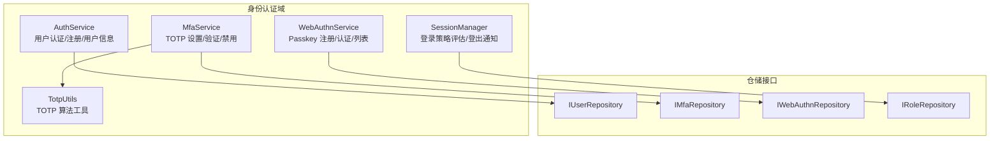
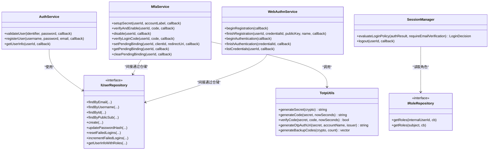
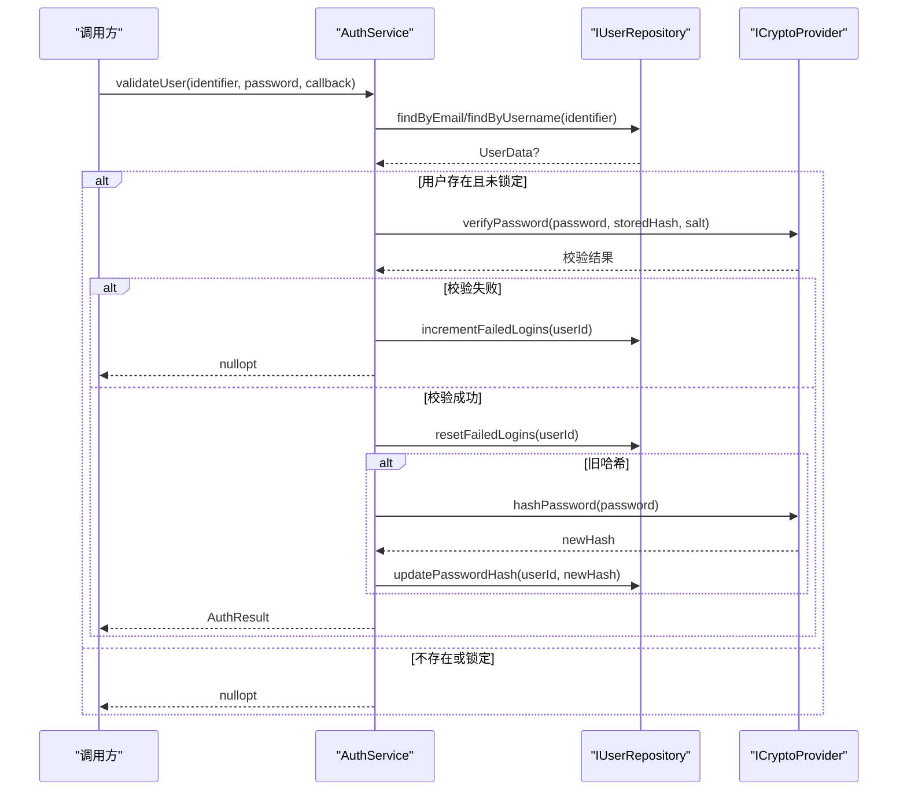
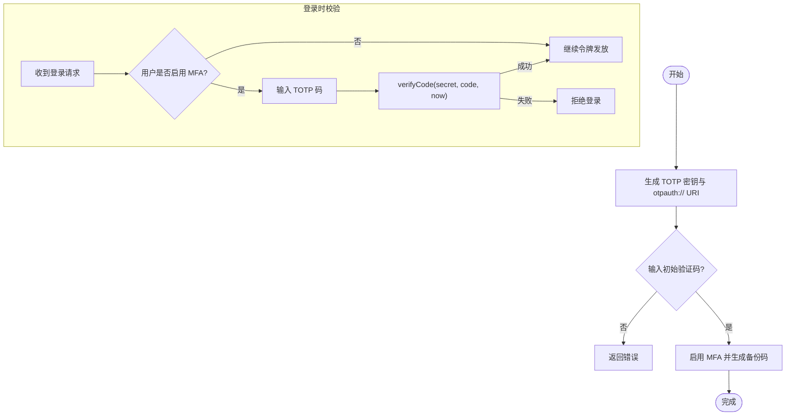
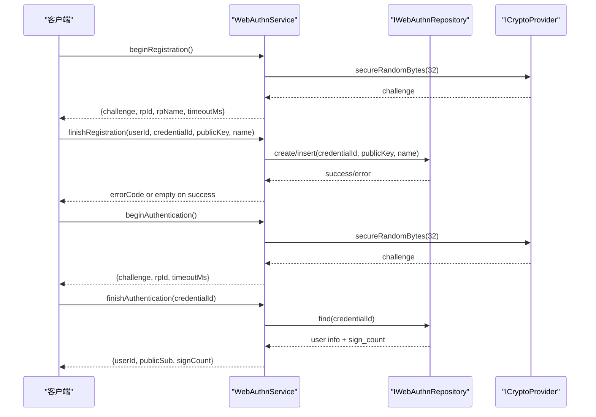
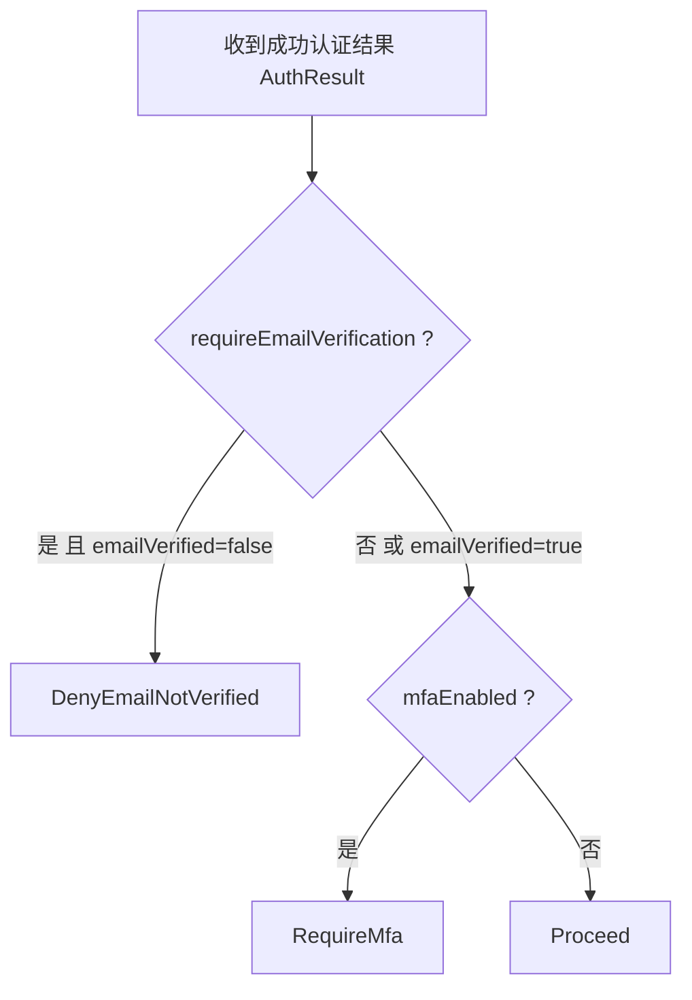
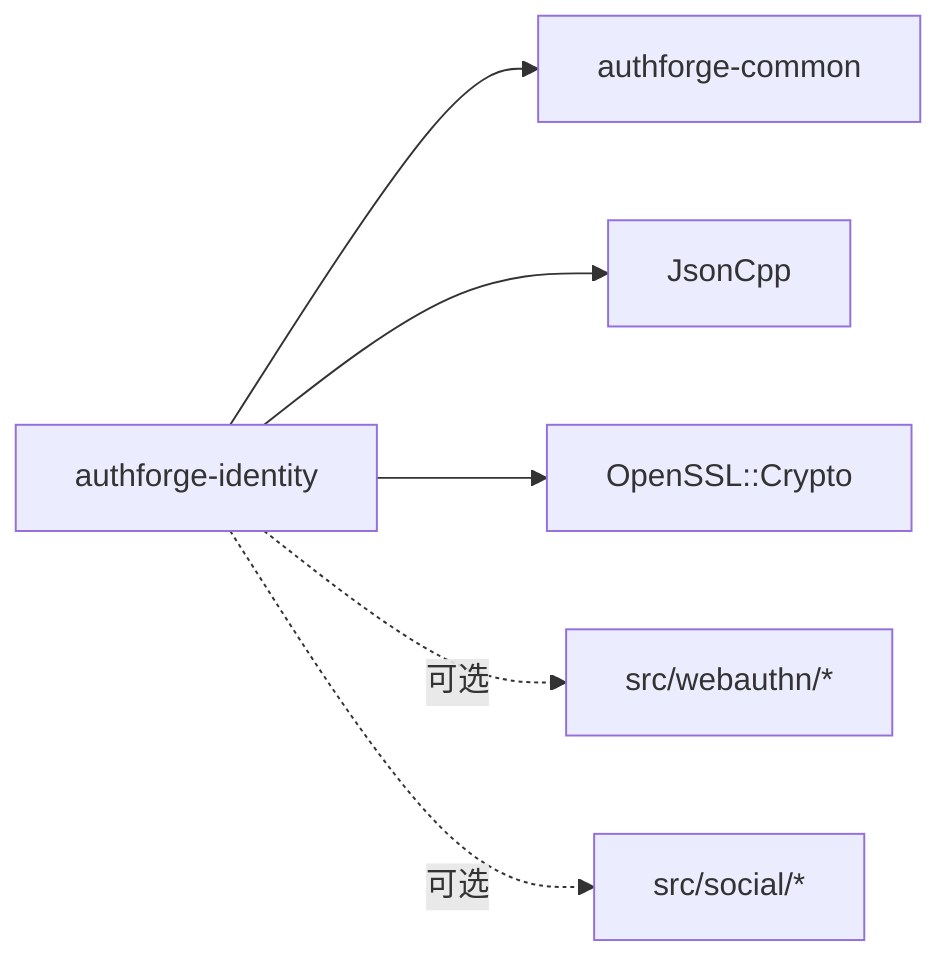

# 身份认证模块 (authforge::identity)

<cite>
**本文引用的文件**
- [CMakeLists.txt](file://libs/identity/CMakeLists.txt)
- [AuthService.h](file://libs/identity/include/authforge/identity/AuthService.h)
- [AuthService.cc](file://libs/identity/src/AuthService.cc)
- [IUserRepository.h](file://libs/identity/include/authforge/identity/IUserRepository.h)
- [MfaService.h](file://libs/identity/include/authforge/identity/MfaService.h)
- [TotpUtils.h](file://libs/identity/include/authforge/identity/TotpUtils.h)
- [WebAuthnService.h](file://libs/identity/include/authforge/identity/WebAuthnService.h)
- [IRoleRepository.h](file://libs/identity/include/authforge/identity/IRoleRepository.h)
- [SessionManager.h](file://libs/identity/include/authforge/identity/SessionManager.h)
</cite>

## 目录
1. [简介](#简介)
2. [项目结构](#项目结构)
3. [核心组件](#核心组件)
4. [架构总览](#架构总览)
5. [详细组件分析](#详细组件分析)
6. [依赖关系分析](#依赖关系分析)
7. [性能考虑](#性能考虑)
8. [故障排查指南](#故障排查指南)
9. [结论](#结论)
10. [附录：API参考与集成示例](#附录api参考与集成示例)

## 简介
本模块提供 authforge::identity 身份认证能力，覆盖用户认证、会话策略、多因素认证（TOTP）、WebAuthn 生物识别注册与认证、以及基于角色的访问控制（RBAC）数据接口。模块以领域层设计为目标，不直接依赖 Web 框架（如 Drogon），通过注入式端口（ICryptoProvider、IClock）和仓储接口（IUserRepository、IMfaRepository、IWebAuthnRepository、IRoleRepository）实现可测试、可替换的持久化与加密能力。

## 项目结构
- libs/identity
  - include/authforge/identity：对外头文件，定义服务与仓储接口
    - AuthService.h / MfaService.h / WebAuthnService.h / SessionManager.h / TotpUtils.h
    - IUserRepository.h / IMfaRepository.h / IWebAuthnRepository.h / IRoleRepository.h
  - src：领域逻辑实现
    - AuthService.cc（密码哈希、登录校验、注册、用户信息查询）
    - mfa/*（TOTP 工具与 MFA 服务）
    - webauthn/*（WebAuthn 挑战生成、凭据注册/认证流程）
    - session/*（会话策略评估与登出通知转发）
    - social/*（可选社交登录，构建时启用）
  - CMakeLists.txt：库目标、编译选项（WITH_WEBAUTHN/WITH_SOCIAL）、依赖声明（jsoncpp、OpenSSL）

图表来源
- [CMakeLists.txt:41-75](file://libs/identity/CMakeLists.txt#L41-L75)
- [AuthService.h:52-110](file://libs/identity/include/authforge/identity/AuthService.h#L52-L110)
- [MfaService.h:72-161](file://libs/identity/include/authforge/identity/MfaService.h#L72-L161)
- [WebAuthnService.h:127-223](file://libs/identity/include/authforge/identity/WebAuthnService.h#L127-L223)
- [SessionManager.h:76-129](file://libs/identity/include/authforge/identity/SessionManager.h#L76-L129)
- [TotpUtils.h:31-79](file://libs/identity/include/authforge/identity/TotpUtils.h#L31-L79)

章节来源
- [CMakeLists.txt:1-148](file://libs/identity/CMakeLists.txt#L1-L148)

## 核心组件
- 用户认证与注册
  - AuthService：异步 validateUser/registerUser/getUserInfo；支持邮箱或用户名登录、账户锁定窗口检查、失败计数递增与重置、旧版哈希渐进升级。
  - IUserRepository：用户数据的查找、创建、更新、失败登录计数、带角色信息的用户信息等。
- 多因素认证（TOTP）
  - MfaService：生成并存储 TOTP 密钥、验证并启用 MFA 并发放备份码、禁用 MFA、登录时 TOTP 校验、登录前客户端绑定记录（mfa_pending_client_id/redirect_uri）。
  - TotpUtils：RFC 6238 TOTP 算法（HMAC-SHA1，30s 时间步长，6位验证码）、备用码生成、otpauth:// URI 构造。
- WebAuthn（Passkey）
  - WebAuthnService：开始/完成注册、开始/完成认证、列出凭据；生成随机挑战、RP 标识与名称管理、sign_count 维护。
- 会话策略
  - SessionManager：evaluateLoginPolicy 决定“继续/拒绝未验证邮箱/要求 MFA”；logout 转发至 IBackchannelLogoutNotifier。
- RBAC 数据接口
  - IRoleRepository：按内部用户 ID 或 subject 字符串获取角色列表，为 RoleProvider 等上层提供角色数据源。

章节来源
- [AuthService.h:34-110](file://libs/identity/include/authforge/identity/AuthService.h#L34-L110)
- [AuthService.cc:150-303](file://libs/identity/src/AuthService.cc#L150-L303)
- [IUserRepository.h:15-126](file://libs/identity/include/authforge/identity/IUserRepository.h#L15-L126)
- [MfaService.h:47-161](file://libs/identity/include/authforge/identity/MfaService.h#L47-L161)
- [TotpUtils.h:31-79](file://libs/identity/include/authforge/identity/TotpUtils.h#L31-L79)
- [WebAuthnService.h:79-223](file://libs/identity/include/authforge/identity/WebAuthnService.h#L79-L223)
- [SessionManager.h:54-129](file://libs/identity/include/authforge/identity/SessionManager.h#L54-L129)
- [IRoleRepository.h:23-49](file://libs/identity/include/authforge/identity/IRoleRepository.h#L23-L49)

## 架构总览
身份认证模块采用“领域服务 + 仓储接口 + 端口注入”的分层设计：
- 领域服务：AuthService、MfaService、WebAuthnService、SessionManager
- 仓储接口：IUserRepository、IMfaRepository、IWebAuthnRepository、IRoleRepository
- 端口注入：ICryptoProvider（加密/随机数）、IClock（时间源）
- 边界约束：identity 不依赖 oauth2 与 Web 框架；oauth2 可通过仓储/端口反向调用 identity 的能力

图表来源
- [AuthService.h:52-110](file://libs/identity/include/authforge/identity/AuthService.h#L52-L110)
- [MfaService.h:72-161](file://libs/identity/include/authforge/identity/MfaService.h#L72-L161)
- [WebAuthnService.h:127-223](file://libs/identity/include/authforge/identity/WebAuthnService.h#L127-L223)
- [SessionManager.h:76-129](file://libs/identity/include/authforge/identity/SessionManager.h#L76-L129)
- [TotpUtils.h:31-79](file://libs/identity/include/authforge/identity/TotpUtils.h#L31-L79)
- [IUserRepository.h:32-126](file://libs/identity/include/authforge/identity/IUserRepository.h#L32-L126)
- [IRoleRepository.h:26-49](file://libs/identity/include/authforge/identity/IRoleRepository.h#L26-L49)

## 详细组件分析

### 用户认证与注册（AuthService）
- 登录流程要点
  - 根据 identifier 是否包含 '@' 路由到邮箱或用户名查找
  - 检查账户锁定窗口（lockedUntil > now）
  - 校验密码（支持 PBKDF2-SHA256 新格式与旧版 SHA-256 兼容）
  - 失败次数递增与成功时重置
  - 对旧哈希进行渐进升级（登录成功后重写为 PBKDF2 格式）
  - 返回 AuthResult（internalId、publicSub、emailVerified、mfaEnabled）
- 注册流程要点
  - 使用 ICryptoProvider 生成 PBKDF2 哈希
  - 调用 IUserRepository::create 创建用户（默认角色由仓储负责）
  - 错误码透传（如 VALIDATION_USERNAME_TAKEN/VALIDATION_EMAIL_TAKEN）
- 用户信息查询
  - getUserInfoWithRoles 返回子集字段（sub/name/email/roles）

图表来源
- [AuthService.cc:159-237](file://libs/identity/src/AuthService.cc#L159-L237)
- [AuthService.h:67-79](file://libs/identity/include/authforge/identity/AuthService.h#L67-L79)
- [IUserRepository.h:37-79](file://libs/identity/include/authforge/identity/IUserRepository.h#L37-L79)

章节来源
- [AuthService.cc:14-146](file://libs/identity/src/AuthService.cc#L14-L146)
- [AuthService.cc:159-303](file://libs/identity/src/AuthService.cc#L159-L303)
- [AuthService.h:34-110](file://libs/identity/include/authforge/identity/AuthService.h#L34-L110)
- [IUserRepository.h:15-126](file://libs/identity/include/authforge/identity/IUserRepository.h#L15-L126)

### 多因素认证（TOTP）——MfaService 与 TotpUtils
- 功能范围
  - setupSecret：生成 TOTP 密钥与 otpauth:// URI
  - verifyAndEnable：验证初始 TOTP 码，启用 MFA 并发放一次性备份码
  - disable：清除密钥与备份码
  - verifyLoginCode：登录时校验 TOTP（允许 ±1 时间步）
  - set/get/clearPendingBinding：记录登录时的客户端/回调地址绑定，用于后续 MFA 校验一致性
- 算法与工具
  - TotpUtils：RFC 6238 TOTP（HMAC-SHA1，30s 步长，6位码），备用码生成，otpauth:// URI 构造
  - 通过 IClock 注入当前时间，便于测试与确定性行为

图表来源
- [MfaService.h:72-161](file://libs/identity/include/authforge/identity/MfaService.h#L72-L161)
- [TotpUtils.h:31-79](file://libs/identity/include/authforge/identity/TotpUtils.h#L31-L79)

章节来源
- [MfaService.h:47-161](file://libs/identity/include/authforge/identity/MfaService.h#L47-L161)
- [TotpUtils.h:31-79](file://libs/identity/include/authforge/identity/TotpUtils.h#L31-L79)

### WebAuthn（Passkey）集成——WebAuthnService
- 功能范围
  - beginRegistration/beginAuthentication：生成随机 challenge、rpId/rpName、超时
  - finishRegistration：校验并存储凭据（credentialId/publicKey/name），重复凭据检测
  - finishAuthentication：根据 credentialId 查找凭据并递增 sign_count
  - listCredentials：列出用户所有凭据（最近优先）
- 说明
  - 本实现保持与现有控制器一致的简化行为：不进行实际的 FIDO2 签名验证（未来任务）
  - 通过 IWebAuthnRepository 持久化凭据状态；challenge 交由调用方（如控制器）在会话中保存

图表来源
- [WebAuthnService.h:127-223](file://libs/identity/include/authforge/identity/WebAuthnService.h#L127-L223)

章节来源
- [WebAuthnService.h:79-223](file://libs/identity/include/authforge/identity/WebAuthnService.h#L79-L223)

### 会话策略与登出——SessionManager
- evaluateLoginPolicy：纯同步决策
  - 优先级：先检查邮箱验证要求，再检查 MFA 要求
  - 返回 Proceed/DenyEmailNotVerified/RequireMfa
- logout：将登出事件转发给 IBackchannelLogoutNotifier（不撤销令牌）

图表来源
- [SessionManager.h:54-129](file://libs/identity/include/authforge/identity/SessionManager.h#L54-L129)

章节来源
- [SessionManager.h:76-129](file://libs/identity/include/authforge/identity/SessionManager.h#L76-L129)

### RBAC 权限控制——IRoleRepository
- 职责：提供角色数据查询（按内部用户 ID 或 subject 字符串）
- 典型用法：RoleProvider 等适配器通过该接口获取用户角色集合，供授权决策使用
- 注意：本模块仅提供角色数据访问，不包含策略引擎或策略定义

章节来源
- [IRoleRepository.h:23-49](file://libs/identity/include/authforge/identity/IRoleRepository.h#L23-L49)

## 依赖关系分析
- 外部依赖
  - jsoncpp：JSON 序列化（例如用户信息查询）
  - OpenSSL：密码学原语（PBKDF2、HMAC-SHA1、随机数）
- 内部依赖
  - authforge-common：端口抽象（ICryptoProvider、IClock）
- 构建开关
  - WITH_WEBAUTHN：启用 WebAuthn 相关源文件与头文件
  - WITH_SOCIAL：启用社交登录相关源文件与头文件

图表来源
- [CMakeLists.txt:90-105](file://libs/identity/CMakeLists.txt#L90-L105)
- [CMakeLists.txt:41-75](file://libs/identity/CMakeLists.txt#L41-L75)

章节来源
- [CMakeLists.txt:1-148](file://libs/identity/CMakeLists.txt#L1-L148)

## 性能考虑
- 密码哈希强度
  - PBKDF2-SHA256 迭代次数与密钥长度配置需平衡安全性与响应时间（当前实现与既有 PasswordHasher 保持一致）
- 登录失败处理
  - 失败计数递增与账户锁定窗口可有效缓解暴力破解；建议结合速率限制策略
- TOTP 校验
  - 允许 ±1 时间步（±30s）容忍时钟偏差，避免频繁重算
- WebAuthn
  - 挑战生成使用安全随机数；sign_count 递增用于检测重放攻击（配合上游策略）
- 会话策略
  - evaluateLoginPolicy 为纯函数，无 I/O，适合高频调用

[本节为通用指导，无需具体文件引用]

## 故障排查指南
- 登录失败
  - 检查账户是否处于锁定窗口（lockedUntil > now）
  - 确认密码哈希格式是否为 PBKDF2；若为旧格式，首次成功登录后会渐进升级
  - 关注失败登录计数是否持续增长（可能触发锁定）
- 注册失败
  - 常见错误码：VALIDATION_USERNAME_TAKEN、VALIDATION_EMAIL_TAKEN
  - 若仓储未分类错误，将回退为 INTERNAL_ERROR
- MFA 问题
  - 确保 TOTP 密钥已正确生成并存储；otpauth:// URI 可用于扫码
  - 验证码校验失败时检查系统时间与设备时间偏差
- WebAuthn
  - 注册完成后请确认凭据唯一性（credentialId 冲突）
  - 认证失败通常表示凭据不存在或无效
- 会话策略
  - 若被拒绝，检查 require_email_verification 配置与用户邮箱验证状态
  - 若要求 MFA，确认用户已启用 MFA 且能提交有效 TOTP

章节来源
- [AuthService.cc:159-237](file://libs/identity/src/AuthService.cc#L159-L237)
- [AuthService.cc:239-289](file://libs/identity/src/AuthService.cc#L239-L289)
- [MfaService.h:90-154](file://libs/identity/include/authforge/identity/MfaService.h#L90-L154)
- [WebAuthnService.h:152-216](file://libs/identity/include/authforge/identity/WebAuthnService.h#L152-L216)
- [SessionManager.h:85-129](file://libs/identity/include/authforge/identity/SessionManager.h#L85-L129)

## 结论
authforge::identity 提供了完整、可测试、可扩展的身份认证能力，涵盖密码认证、会话策略、TOTP 双因素认证与 WebAuthn 生物识别集成，并通过仓储接口与端口注入解耦持久化与加密实现。RBAC 角色数据接口为上层授权决策提供基础。建议在部署时合理配置密码哈希参数、账户锁定策略与速率限制，并结合前端体验优化 MFA 与 WebAuthn 流程。

[本节为总结性内容，无需具体文件引用]

## 附录：API参考与集成示例

### API 参考（摘要）
- AuthService
  - validateUser(identifier, password, callback)：异步验证用户，返回 AuthResult 或空
  - registerUser(username, password, email, callback)：注册用户，错误码透传
  - getUserInfo(userId, callback)：获取用户信息与角色
- MfaService
  - setupSecret(userId, accountLabel, callback)：生成 TOTP 密钥与 otpauth:// URI
  - verifyAndEnable(userId, code, callback)：验证初始码并启用 MFA，返回备份码
  - disable(userId, callback)：禁用 MFA
  - verifyLoginCode(userId, code, callback)：登录时 TOTP 校验
  - set/get/clearPendingBinding(...)：登录前客户端绑定记录
- WebAuthnService
  - beginRegistration()/finishRegistration(...)：Passkey 注册
  - beginAuthentication()/finishAuthentication(...)：Passkey 认证
  - listCredentials(userId, callback)：列出凭据
- SessionManager
  - evaluateLoginPolicy(authResult, requireEmailVerification)：返回 Proceed/DenyEmailNotVerified/RequireMfa
  - logout(userId, callback)：转发登出通知
- TotpUtils
  - generateSecret/generateCode/verifyCode/generateOtpAuthUri/generateBackupCodes

章节来源
- [AuthService.h:67-104](file://libs/identity/include/authforge/identity/AuthService.h#L67-L104)
- [MfaService.h:90-154](file://libs/identity/include/authforge/identity/MfaService.h#L90-L154)
- [WebAuthnService.h:152-216](file://libs/identity/include/authforge/identity/WebAuthnService.h#L152-L216)
- [SessionManager.h:85-129](file://libs/identity/include/authforge/identity/SessionManager.h#L85-L129)
- [TotpUtils.h:37-79](file://libs/identity/include/authforge/identity/TotpUtils.h#L37-L79)

### 集成示例（步骤指引）
- 初始化
  - 注入 IUserRepository、ICryptoProvider、IClock 实例到 AuthService
  - 注入 IMfaRepository、ICryptoProvider、IClock 到 MfaService
  - 注入 IWebAuthnRepository、ICryptoProvider 到 WebAuthnService
  - 注入 IBackchannelLogoutNotifier 到 SessionManager
- 登录流程
  - 调用 AuthService::validateUser
  - 使用 SessionManager::evaluateLoginPolicy 判断是否需要邮箱验证或 MFA
  - 若需要 MFA，调用 MfaService::verifyLoginCode
  - 若启用 WebAuthn，可使用 WebAuthnService 完成 Passkey 认证
- 注册流程
  - 调用 AuthService::registerUser，处理可能的错误码
- 会话管理
  - 根据 evaluateLoginPolicy 的结果决定是否颁发令牌
  - 登出时调用 SessionManager::logout 转发通知

章节来源
- [AuthService.cc:159-303](file://libs/identity/src/AuthService.cc#L159-L303)
- [SessionManager.h:85-129](file://libs/identity/include/authforge/identity/SessionManager.h#L85-L129)
- [MfaService.h:90-154](file://libs/identity/include/authforge/identity/MfaService.h#L90-L154)
- [WebAuthnService.h:152-216](file://libs/identity/include/authforge/identity/WebAuthnService.h#L152-L216)