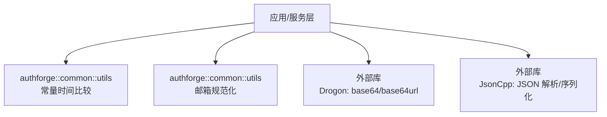
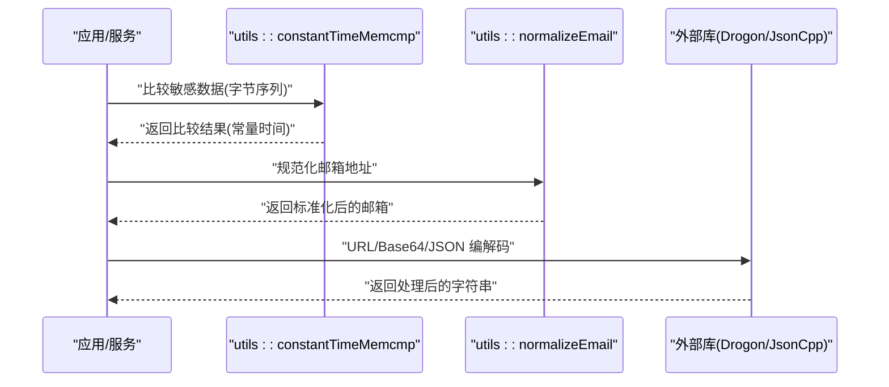
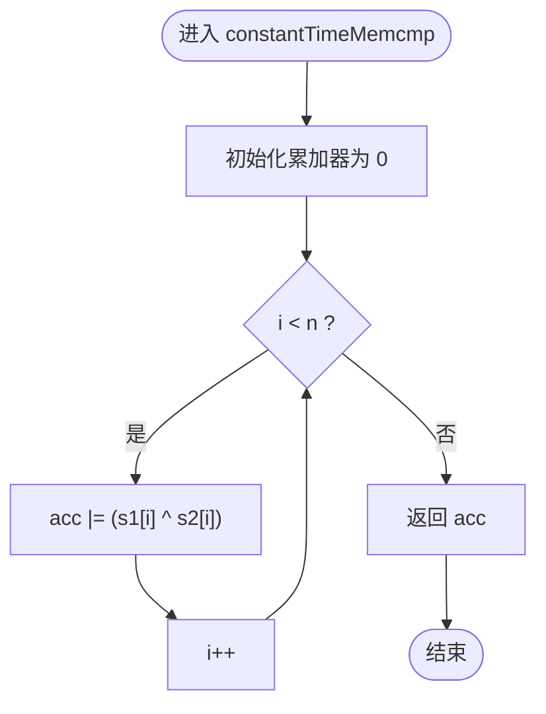
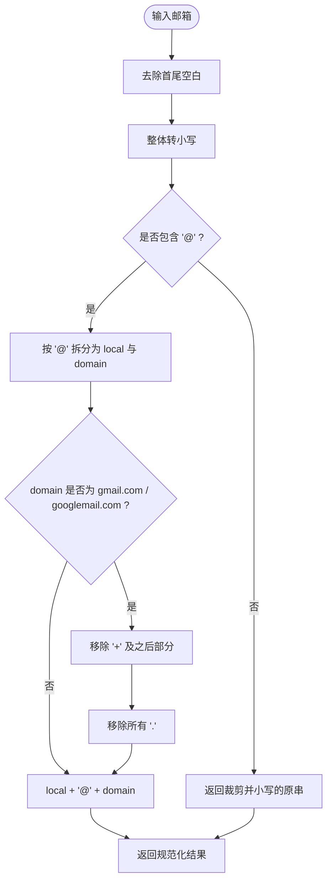
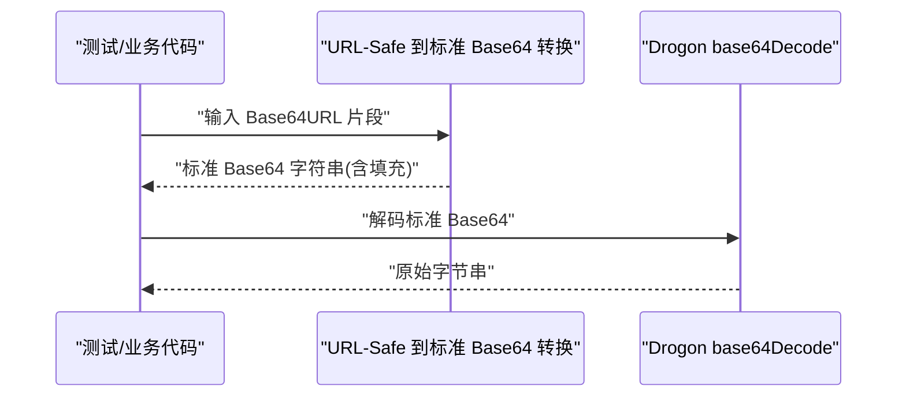
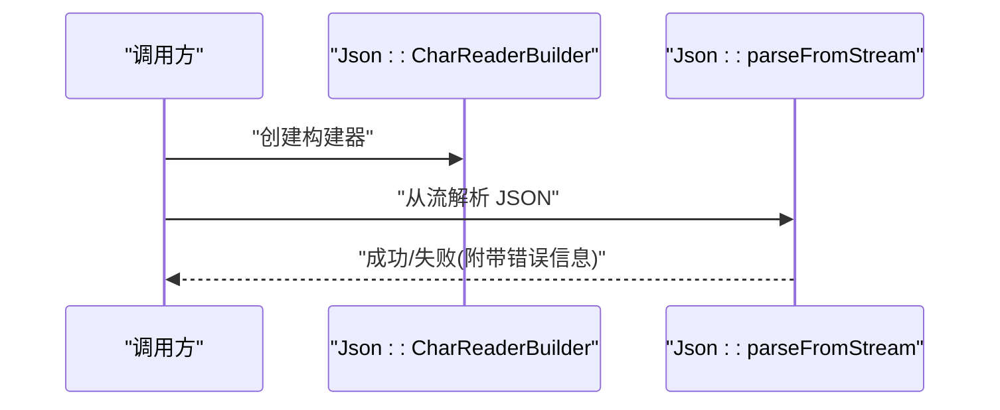
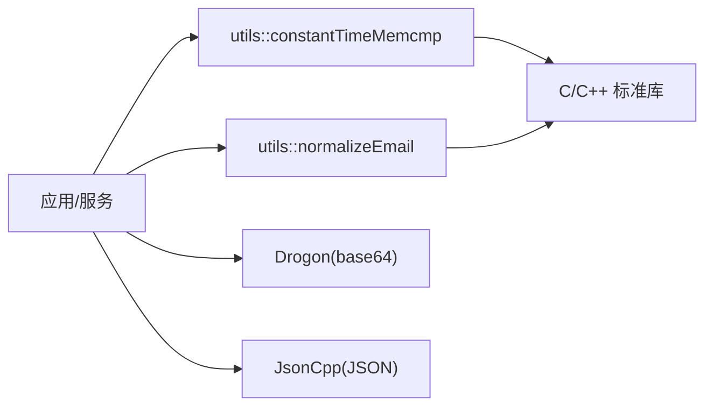

# 字符串工具

<cite>
**本文引用的文件**
- [ConstantTimeCompare.h](file://libs/common/include/authforge/common/utils/ConstantTimeCompare.h)
- [EmailNormalizer.h](file://libs/common/include/authforge/common/utils/EmailNormalizer.h)
</cite>

## 目录
1. [简介](#简介)
2. [项目结构](#项目结构)
3. [核心组件](#核心组件)
4. [架构总览](#架构总览)
5. [详细组件分析](#详细组件分析)
6. [依赖关系分析](#依赖关系分析)
7. [性能考虑](#性能考虑)
8. [故障排查指南](#故障排查指南)
9. [结论](#结论)
10. [附录](#附录)

## 简介
本文件聚焦 authforge::common 库中的字符串处理工具，围绕以下目标展开：
- 字符串编码转换、格式化、分割与合并
- UTF-8 处理、国际化支持与字符集检测
- 常用操作示例：URL 编解码、JSON 字符串处理、安全字符串比较
- 内存管理与性能优化建议

说明：
- 当前仓库中 libs/common 的 utils 子模块包含两个与字符串处理密切相关的头文件：常量时间内存比较（用于安全字符串比较）与邮箱地址规范化（涉及大小写、分隔符与别名折叠）。
- 关于 URL 编解码与 JSON 处理的实现，代码中通过调用第三方库（如 Drogon 的 base64/base64url 与 JsonCpp）完成；本节将给出使用方式与注意事项。

## 项目结构
authforge::common 的 utils 子模块提供跨领域可复用的字符串与安全工具，便于上层服务（如 OAuth2/OIDC、存储后端等）统一调用。

图示来源
- [ConstantTimeCompare.h:1-35](file://libs/common/include/authforge/common/utils/ConstantTimeCompare.h#L1-L35)
- [EmailNormalizer.h:1-65](file://libs/common/include/authforge/common/utils/EmailNormalizer.h#L1-L65)

章节来源
- [ConstantTimeCompare.h:1-35](file://libs/common/include/authforge/common/utils/ConstantTimeCompare.h#L1-L35)
- [EmailNormalizer.h:1-65](file://libs/common/include/authforge/common/utils/EmailNormalizer.h#L1-L65)

## 核心组件
- 安全字符串比较：提供常量时间内存比较，避免时序侧信道攻击，适用于密钥、令牌、哈希等敏感数据的比对。
- 邮箱地址规范化：对邮箱进行去空白、小写化、Gmail 别名折叠（去除点号与 + 标签），确保唯一性与一致性。

章节来源
- [ConstantTimeCompare.h:8-32](file://libs/common/include/authforge/common/utils/ConstantTimeCompare.h#L8-L32)
- [EmailNormalizer.h:10-62](file://libs/common/include/authforge/common/utils/EmailNormalizer.h#L10-L62)

## 架构总览
下图展示字符串工具在整体系统中的位置与交互：

图示来源
- [ConstantTimeCompare.h:22-32](file://libs/common/include/authforge/common/utils/ConstantTimeCompare.h#L22-L32)
- [EmailNormalizer.h:25-62](file://libs/common/include/authforge/common/utils/EmailNormalizer.h#L25-L62)

## 详细组件分析

### 安全字符串比较（常量时间内存比较）
- 功能要点
  - 以固定步长遍历输入，累积异或结果，避免提前退出，使执行时间与数据内容无关。
  - 接口语义与 memcmp 类似：相等返回 0，不等返回非 0。
  - 适用场景：客户端密钥、密码哈希、访问令牌等敏感数据的比较。
- 复杂度与内存
  - 时间复杂度 O(n)，空间复杂度 O(1)。
  - 无额外分配，适合高频、短缓冲比较。
- 使用建议
  - 始终用此函数替代普通 memcmp/strcmp 进行敏感数据比较。
  - 注意传入长度必须准确，避免越界。

图示来源
- [ConstantTimeCompare.h:22-32](file://libs/common/include/authforge/common/utils/ConstantTimeCompare.h#L22-L32)

章节来源
- [ConstantTimeCompare.h:8-32](file://libs/common/include/authforge/common/utils/ConstantTimeCompare.h#L8-L32)

### 邮箱地址规范化
- 规则说明
  - 去除首尾空白并整体转小写。
  - 针对 Gmail/Googlemail 域名：
    - 移除本地部分“+”之后的标签；
    - 移除本地部分的点号。
  - 其他域名仅做小写化，不改变结构，避免误判。
- 边界情况
  - 不含“@”时直接返回已裁剪并小写的原始串（由调用方负责格式校验）。
- 复杂度与内存
  - 时间复杂度 O(n)，空间复杂度 O(n) 用于构造新串。
  - 对小段文本开销极低。

图示来源
- [EmailNormalizer.h:25-62](file://libs/common/include/authforge/common/utils/EmailNormalizer.h#L25-L62)

章节来源
- [EmailNormalizer.h:10-62](file://libs/common/include/authforge/common/utils/EmailNormalizer.h#L10-L62)

### URL 编解码与 Base64/URL-Safe Base64
- 背景与用法
  - 在 JWT/JWK 等场景中，常需对 Base64 片段进行 URL-Safe 编解码（将 - 与 _ 映射回 + 与 /，并补齐填充）。
  - 仓库测试代码展示了如何先将 URL-Safe 字母表还原为标准 Base64，再调用 Drogon 的 base64Decode。
- 实践要点
  - 先替换字符集，再补齐“=”至长度为 4 的倍数，最后解码。
  - 若需要通用 URL 编码/解码（如 %XX），请结合标准库或 HTTP 框架提供的工具。

图示来源
- [tests/integration/concurrency/Property4_JwkBaselineTest.cc:73-89](file://tests/integration/concurrency/Property4_JwkBaselineTest.cc#L73-L89)

章节来源
- [tests/integration/concurrency/Property4_JwkBaselineTest.cc:73-89](file://tests/integration/concurrency/Property4_JwkBaselineTest.cc#L73-L89)

### JSON 字符串处理
- 背景与用法
  - 使用 JsonCpp 的 CharReaderBuilder 从流中解析 JSON，错误信息可通过引用参数获取。
- 实践要点
  - 推荐在解析前进行最小合法性检查（如长度、首尾字符）。
  - 对超大 JSON 应限制最大深度与节点数，防止资源耗尽。

图示来源
- [tests/integration/concurrency/Property4_JwkBaselineTest.cc:65-71](file://tests/integration/concurrency/Property4_JwkBaselineTest.cc#L65-L71)

章节来源
- [tests/integration/concurrency/Property4_JwkBaselineTest.cc:65-71](file://tests/integration/concurrency/Property4_JwkBaselineTest.cc#L65-L71)

### 常用字符串操作示例（路径指引）
- URL 编解码
  - 参考：[URL-Safe Base64 解码流程:73-89](file://tests/integration/concurrency/Property4_JwkBaselineTest.cc#L73-L89)
- JSON 解析
  - 参考：[JSON 解析流程:65-71](file://tests/integration/concurrency/Property4_JwkBaselineTest.cc#L65-L71)
- 安全字符串比较
  - 参考：[常量时间比较实现:22-32](file://libs/common/include/authforge/common/utils/ConstantTimeCompare.h#L22-L32)
- 邮箱规范化
  - 参考：[邮箱规范化算法:25-62](file://libs/common/include/authforge/common/utils/EmailNormalizer.h#L25-L62)

## 依赖关系分析
- 内部依赖
  - 常量时间比较：仅依赖标准库类型与运算符，无外部依赖。
  - 邮箱规范化：依赖标准库算法与字符处理函数。
- 外部依赖
  - URL/Base64：依赖 Drogon 的 base64Decode。
  - JSON：依赖 JsonCpp 的解析器。

图示来源
- [ConstantTimeCompare.h:22-32](file://libs/common/include/authforge/common/utils/ConstantTimeCompare.h#L22-L32)
- [EmailNormalizer.h:25-62](file://libs/common/include/authforge/common/utils/EmailNormalizer.h#L25-L62)
- [tests/integration/concurrency/Property4_JwkBaselineTest.cc:65-89](file://tests/integration/concurrency/Property4_JwkBaselineTest.cc#L65-L89)

章节来源
- [ConstantTimeCompare.h:22-32](file://libs/common/include/authforge/common/utils/ConstantTimeCompare.h#L22-L32)
- [EmailNormalizer.h:25-62](file://libs/common/include/authforge/common/utils/EmailNormalizer.h#L25-L62)
- [tests/integration/concurrency/Property4_JwkBaselineTest.cc:65-89](file://tests/integration/concurrency/Property4_JwkBaselineTest.cc#L65-L89)

## 性能考虑
- 常量时间比较
  - 时间复杂度 O(n)，无分支提前退出，避免时序侧信道；空间 O(1)。
  - 适合频繁比较短缓冲（如密钥、令牌）。
- 邮箱规范化
  - 单次线性扫描，分配一次新串；对小文本极快。
  - 批量处理时可复用缓冲区以减少分配。
- URL/Base64 与 JSON
  - Base64 解码为线性操作；JSON 解析复杂度随文档规模增长，建议限制最大尺寸与深度。
  - 大对象建议分块处理或使用流式解析。

## 故障排查指南
- 常量时间比较
  - 症状：比较结果异常或崩溃。
  - 排查：确认传入长度与实际缓冲一致；避免空指针；确保两端缓冲至少 n 字节。
  - 参考：[常量时间比较实现:22-32](file://libs/common/include/authforge/common/utils/ConstantTimeCompare.h#L22-L32)
- 邮箱规范化
  - 症状：期望的别名折叠未生效。
  - 排查：确认域名为 gmail.com/googlemail.com；检查本地部分是否包含“+”与“.”；确认输入已裁剪空白且小写化。
  - 参考：[邮箱规范化算法:25-62](file://libs/common/include/authforge/common/utils/EmailNormalizer.h#L25-L62)
- URL/Base64 解码
  - 症状：解码失败或结果错位。
  - 排查：确认已将“-”“_”替换为“+”“/”，并补齐“=”至 4 的倍数；确认输入确为 Base64URL 片段。
  - 参考：[URL-Safe Base64 解码流程:73-89](file://tests/integration/concurrency/Property4_JwkBaselineTest.cc#L73-L89)
- JSON 解析
  - 症状：解析失败或内存占用过高。
  - 排查：检查输入是否为合法 JSON；限制最大深度/节点数；捕获错误信息并记录上下文。
  - 参考：[JSON 解析流程:65-71](file://tests/integration/concurrency/Property4_JwkBaselineTest.cc#L65-L71)

章节来源
- [ConstantTimeCompare.h:22-32](file://libs/common/include/authforge/common/utils/ConstantTimeCompare.h#L22-L32)
- [EmailNormalizer.h:25-62](file://libs/common/include/authforge/common/utils/EmailNormalizer.h#L25-L62)
- [tests/integration/concurrency/Property4_JwkBaselineTest.cc:65-89](file://tests/integration/concurrency/Property4_JwkBaselineTest.cc#L65-L89)

## 结论
- authforge::common::utils 提供了安全的字符串比较与邮箱规范化能力，满足认证与身份相关场景的安全与一致性需求。
- URL 编解码与 JSON 处理通过成熟的外部库实现，建议在业务层封装统一入口，集中处理错误与资源限制。
- 在生产环境中，应关注输入校验、资源限制与日志脱敏，确保性能与安全性兼顾。

## 附录
- 术语
  - 常量时间：执行时间与输入数据无关，用于抵御时序侧信道。
  - URL-Safe Base64：使用“-”和“_”代替“+”和“/”，常用于 URL/文件名等场景。
  - 邮箱别名折叠：将不同但等效的邮箱地址归一化为同一表示。
- 扩展方向
  - 增加通用的 URL 编码/解码、UTF-8 验证与转码、国际化字符集检测等工具函数。
  - 引入统一的字符串池或内存池，减少频繁分配带来的开销。