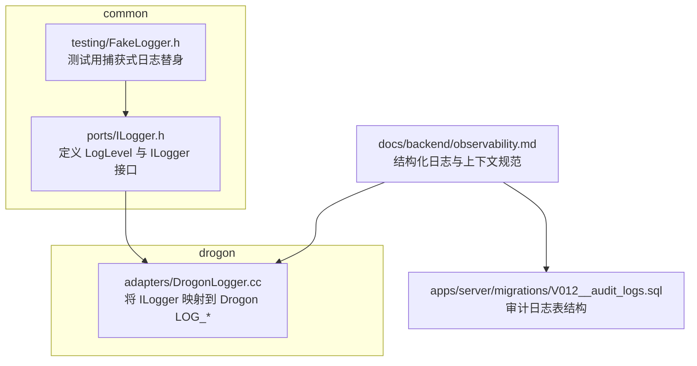
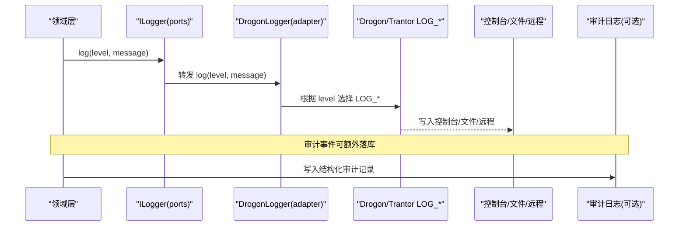
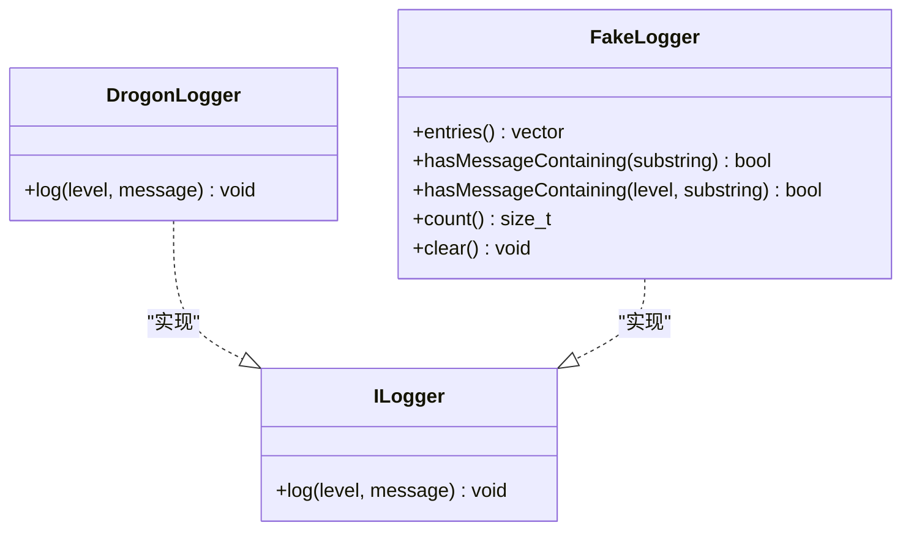

# 日志系统

<cite>
**本文引用的文件**
- [ILogger.h](file://libs/common/include/authforge/common/ports/ILogger.h)
- [DrogonLogger.cc](file://libs/drogon/src/adapters/DrogonLogger.cc)
- [FakeLogger.h](file://libs/common/testing/include/authforge/common/testing/FakeLogger.h)
- [observability.md](file://docs/backend/observability.md)
- [CONTRIBUTING.md](file://CONTRIBUTING.md)
- [V012__audit_logs.sql](file://apps/server/migrations/V012__audit_logs.sql)
</cite>

## 目录
1. [简介](#简介)
2. [项目结构](#项目结构)
3. [核心组件](#核心组件)
4. [架构总览](#架构总览)
5. [详细组件分析](#详细组件分析)
6. [依赖关系分析](#依赖关系分析)
7. [性能考虑](#性能考虑)
8. [故障排查指南](#故障排查指南)
9. [结论](#结论)
10. [附录](#附录)

## 简介
本章节面向 authforge::common 库的日志子系统，聚焦以下目标：
- 明确日志级别定义与使用规范
- 说明日志格式规范（结构化、上下文）
- 梳理日志输出目标（控制台、文件、远程）及轮转策略
- 介绍结构化日志记录、日志过滤与性能监控集成
- 提供基于 ILogger 接口的使用示例路径（含异步与线程安全实践建议）
- 给出性能优化与调试技巧

## 项目结构
日志相关代码主要分布在 common 与 drogon 两个库中：
- common 层定义日志端口接口与测试替身
- drogon 层提供生产实现，将通用日志桥接到 Drogon/Trantor 的 LOG_* 宏
- 文档与数据库迁移定义了审计日志的结构化格式与持久化

图表来源
- [ILogger.h:29-52](file://libs/common/include/authforge/common/ports/ILogger.h#L29-L52)
- [DrogonLogger.cc:9-32](file://libs/drogon/src/adapters/DrogonLogger.cc#L9-L32)
- [observability.md:32-56](file://docs/backend/observability.md#L32-L56)
- [V012__audit_logs.sql:4-22](file://apps/server/migrations/V012__audit_logs.sql#L4-L22)

章节来源
- [ILogger.h:29-52](file://libs/common/include/authforge/common/ports/ILogger.h#L29-L52)
- [DrogonLogger.cc:9-32](file://libs/drogon/src/adapters/DrogonLogger.cc#L9-L32)
- [observability.md:32-56](file://docs/backend/observability.md#L32-L56)
- [V012__audit_logs.sql:4-22](file://apps/server/migrations/V012__audit_logs.sql#L4-L22)

## 核心组件
- 日志级别与接口
  - LogLevel 枚举：Trace < Debug < Info < Warn < Error < Fatal，顺序与 Drogon/Trantor 一致
  - ILogger 抽象接口：log(level, message)，用于领域层解耦具体日志实现
- 生产适配器
  - DrogonLogger：将 ILogger::log 映射到 Drogon 的 LOG_TRACE/LOG_DEBUG/LOG_INFO/LOG_WARN/LOG_ERROR/LOG_FATAL
- 测试替身
  - FakeLogger：捕获所有 log 调用，支持按消息片段或级别断言，便于无 Drogon 依赖的单元测试

章节来源
- [ILogger.h:29-52](file://libs/common/include/authforge/common/ports/ILogger.h#L29-L52)
- [DrogonLogger.cc:9-32](file://libs/drogon/src/adapters/DrogonLogger.cc#L9-L32)
- [FakeLogger.h:20-79](file://libs/common/testing/include/authforge/common/testing/FakeLogger.h#L20-L79)

## 架构总览
下图展示了从领域层通过 ILogger 抽象到 Drogon 日志宏的完整链路，以及结构化审计日志的落地方式。

图表来源
- [ILogger.h:29-52](file://libs/common/include/authforge/common/ports/ILogger.h#L29-L52)
- [DrogonLogger.cc:9-32](file://libs/drogon/src/adapters/DrogonLogger.cc#L9-L32)
- [observability.md:32-56](file://docs/backend/observability.md#L32-L56)
- [V012__audit_logs.sql:4-22](file://apps/server/migrations/V012__audit_logs.sql#L4-L22)

## 详细组件分析

### 日志级别定义与使用规范
- 级别顺序与含义
  - Trace：函数参数/返回值、SQL 语句、逐迭代细节，仅用于深度调试
  - Debug：变量值、分支决策、内部状态快照，用于开发排障
  - Info：启动/关闭、登录、任务完成、关键流程检查点、具备审计价值的常规事件
  - Warn：可恢复失败、降级但可用路径、使用默认值、资源接近阈值
  - Error：单次操作/请求失败（如数据库错误回调、未处理异常），服务仍可用
  - Fatal：服务无法继续（如启动配置/迁移失败），必须极少出现
- 级别选择原则
  - 优先使用 Info 记录业务关键事件；仅在调试时启用 Trace/Debug
  - 错误场景使用 Error；仅在不可恢复时使用 Fatal
  - 审计类事件统一以 Info 级别并附带结构化字段

章节来源
- [CONTRIBUTING.md:63-77](file://CONTRIBUTING.md#L63-L77)
- [ILogger.h:29-37](file://libs/common/include/authforge/common/ports/ILogger.h#L29-L37)

### 日志格式规范
- 结构化审计日志
  - 标记：[AUDIT]
  - 字段：Action、User、Client、Success、IP、RequestID、Details(JSONB)
  - 示例见 observability 文档
- 上下文日志
  - 自动附加 RequestId，便于分布式追踪关联
- 存储结构
  - audit_logs 表包含时间戳、主体、动作、目标、结果、IP、User-Agent、RequestID、详情等字段，并提供常用索引

章节来源
- [observability.md:32-56](file://docs/backend/observability.md#L32-L56)
- [V012__audit_logs.sql:4-22](file://apps/server/migrations/V012__audit_logs.sql#L4-L22)

### 日志输出目标与轮转策略
- 输出目标
  - 控制台：由 Drogon/Trantor 默认输出
  - 文件：由 Drogon/Trantor 配置文件控制
  - 远程：可通过日志采集器（如 PromExporter/日志采集端）消费标准输出或文件
- 轮转策略
  - 本项目未在 common/drogon 日志适配层内实现轮转；建议使用外部日志采集与轮转方案（例如操作系统级日志轮转或集中式日志平台）

章节来源
- [DrogonLogger.cc:9-32](file://libs/drogon/src/adapters/DrogonLogger.cc#L9-L32)
- [observability.md:1-30](file://docs/backend/observability.md#L1-L30)

### 结构化日志记录
- 在请求处理链路中，所有日志自动附带 RequestId，便于跨组件追踪
- 审计日志采用固定键名与 JSONB 详情，便于检索与分析

章节来源
- [observability.md:32-56](file://docs/backend/observability.md#L32-L56)
- [V012__audit_logs.sql:4-22](file://apps/server/migrations/V012__audit_logs.sql#L4-L22)

### 日志过滤
- 级别过滤：通过 ILogger::log 的 level 参数进行粗粒度过滤；上层可根据运行环境设置最小级别
- 内容过滤：结合审计日志的 Action/Outcome 等字段进行筛选
- 测试过滤：FakeLogger 支持按级别与消息片段进行查询与断言

章节来源
- [FakeLogger.h:40-63](file://libs/common/testing/include/authforge/common/testing/FakeLogger.h#L40-L63)
- [ILogger.h:29-52](file://libs/common/include/authforge/common/ports/ILogger.h#L29-L52)

### 性能监控集成
- 指标发射：通过 LOG_INFO 的 [METRIC] 结构化日志暴露 Prometheus 指标，供采集端消费
- 延迟直方图：关键步骤耗时以直方图形式记录，便于计算 P95/P99
- 建议：在高吞吐路径避免 Trace/Debug 级别；对热点路径使用 Info/Warn/Error

章节来源
- [observability.md:1-30](file://docs/backend/observability.md#L1-L30)

### 使用示例（API 与最佳实践）
- 基本用法
  - 注入 ILogger 实例，调用 log(LogLevel::Info, "...")
  - 参考路径：[ILogger.h:29-52](file://libs/common/include/authforge/common/ports/ILogger.h#L29-L52)
- 测试断言
  - 使用 FakeLogger 捕获日志，并通过 hasMessageContaining(level, substring) 或 count() 验证
  - 参考路径：[FakeLogger.h:20-79](file://libs/common/testing/include/authforge/common/testing/FakeLogger.h#L20-L79)
- 生产实现
  - 通过 DrogonLogger 将日志映射到 Drogon LOG_* 宏
  - 参考路径：[DrogonLogger.cc:9-32](file://libs/drogon/src/adapters/DrogonLogger.cc#L9-L32)
- 异步与线程安全
  - 建议在应用启动阶段初始化日志后端，确保多线程并发安全
  - 高吞吐场景下，避免在热路径构造大对象；尽量传递轻量字符串
  - 如需异步落盘，可在上层封装缓冲队列与批量写入（本项目未内置）

章节来源
- [ILogger.h:29-52](file://libs/common/include/authforge/common/ports/ILogger.h#L29-L52)
- [DrogonLogger.cc:9-32](file://libs/drogon/src/adapters/DrogonLogger.cc#L9-L32)
- [FakeLogger.h:20-79](file://libs/common/testing/include/authforge/common/testing/FakeLogger.h#L20-L79)

## 依赖关系分析
- 耦合与内聚
  - common::ports::ILogger 是稳定接口，领域层仅依赖该接口，内聚度高
  - drogon::adapters::DrogonLogger 作为实现，耦合于 Drogon/Trantor，便于替换
- 外部依赖
  - Drogon/Trantor 的 LOG_* 宏负责实际 I/O
  - 审计日志依赖数据库层（PostgreSQL）
- 循环依赖
  - 当前设计通过接口隔离，未见循环依赖迹象

图表来源
- [ILogger.h:29-52](file://libs/common/include/authforge/common/ports/ILogger.h#L29-L52)
- [DrogonLogger.cc:9-32](file://libs/drogon/src/adapters/DrogonLogger.cc#L9-L32)
- [FakeLogger.h:20-79](file://libs/common/testing/include/authforge/common/testing/FakeLogger.h#L20-L79)

章节来源
- [ILogger.h:29-52](file://libs/common/include/authforge/common/ports/ILogger.h#L29-L52)
- [DrogonLogger.cc:9-32](file://libs/drogon/src/adapters/DrogonLogger.cc#L9-L32)
- [FakeLogger.h:20-79](file://libs/common/testing/include/authforge/common/testing/FakeLogger.h#L20-L79)

## 性能考虑
- 级别控制
  - 生产环境默认开启 Info 及以上；仅在定位问题时临时提升为 Debug/Trace
- 减少分配
  - 避免在日志中拼接大型对象；必要时序列化关键字段
- 批处理与异步
  - 若需更高吞吐，可在上层引入缓冲队列与批量写入（本项目未内置）
- 审计日志
  - 审计事件可能涉及 IO，应评估写入频率与代价，必要时异步化或采样

[本节为通用指导，不直接分析具体文件]

## 故障排查指南
- 常见问题
  - 日志缺失：确认 ILogger 已正确注入且级别不低于当前阈值
  - 审计日志缺失：检查数据库连接与 V012 迁移是否执行
  - 性能下降：排查是否在热路径使用了 Trace/Debug 或构造了大对象
- 快速定位
  - 使用 RequestId 关联同一请求的多条日志
  - 使用审计日志的 Action/Outcome 字段快速筛选失败路径
  - 借助 FakeLogger 在单元测试中精确断言日志内容与级别

章节来源
- [observability.md:32-56](file://docs/backend/observability.md#L32-L56)
- [V012__audit_logs.sql:4-22](file://apps/server/migrations/V012__audit_logs.sql#L4-L22)
- [FakeLogger.h:40-63](file://libs/common/testing/include/authforge/common/testing/FakeLogger.h#L40-L63)

## 结论
authforge::common 的日志系统通过 ILogger 接口实现了领域层与具体实现的解耦，配合 DrogonLogger 在生产环境中无缝对接 Drogon/Trantor 的日志能力。结构化审计日志与上下文信息（RequestId）提升了可观测性与排障效率。建议在生产中严格遵循级别规范，结合外部轮转与采集方案，以获得稳定、可维护、高性能的日志体系。

[本节为总结性内容，不直接分析具体文件]

## 附录
- 审计日志表结构要点
  - 主键、时间戳、主体类型/ID、动作、目标类型/ID、结果、IP、User-Agent、RequestID、详情(JSONB)
  - 常用索引：时间戳、主体、动作、结果+时间戳
- 推荐实践
  - 统一使用 ILogger 接口；测试中使用 FakeLogger 断言
  - 审计事件使用结构化字段；避免在日志中记录敏感数据
  - 结合 observability 文档中的指标与面板进行监控

章节来源
- [V012__audit_logs.sql:4-22](file://apps/server/migrations/V012__audit_logs.sql#L4-L22)
- [observability.md:1-30](file://docs/backend/observability.md#L1-L30)