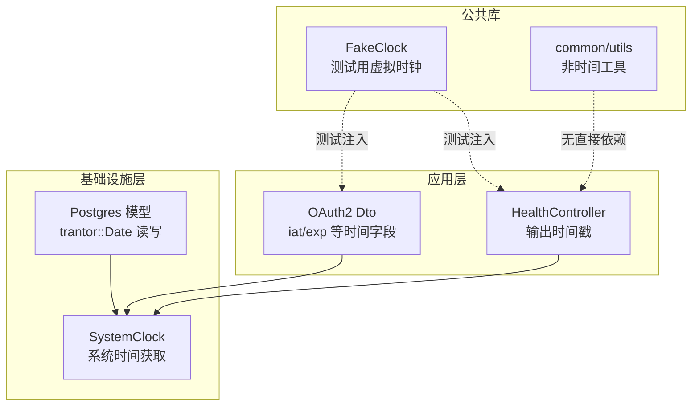
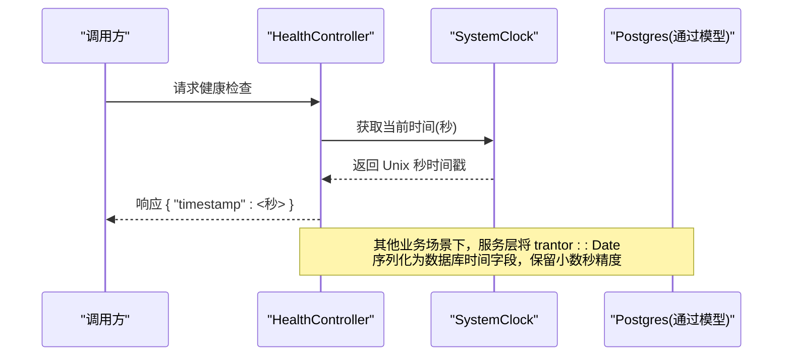
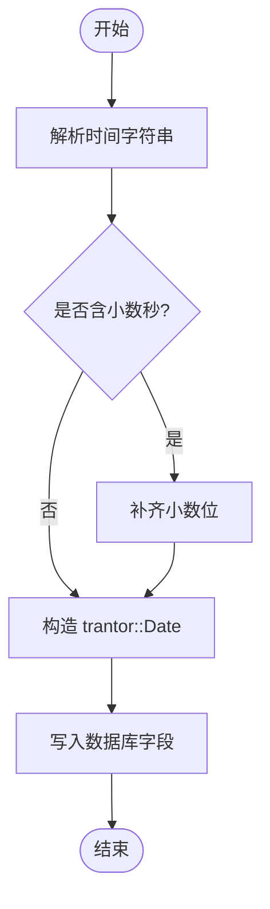
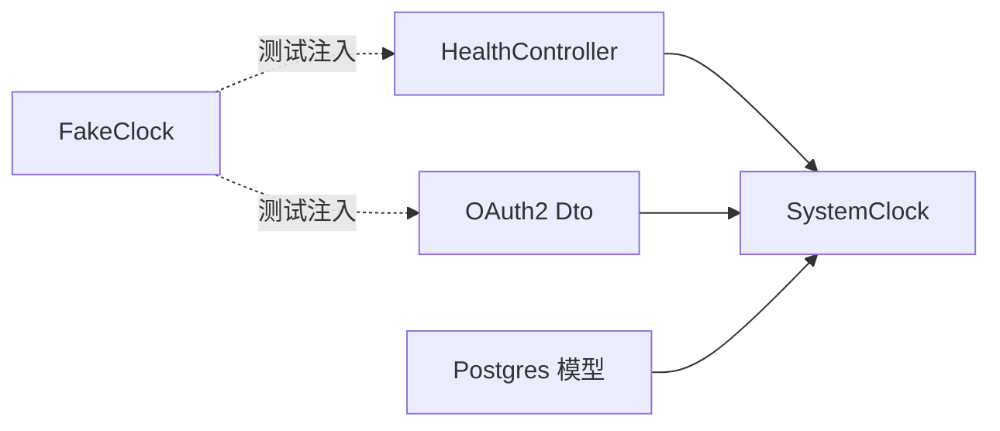

# 日期时间工具

<cite>
**本文引用的文件**
- [libs/common/include/authforge/common/utils/ConstantTimeCompare.h](file://libs/common/include/authforge/common/utils/ConstantTimeCompare.h)
- [libs/common/include/authforge/common/utils/EmailNormalizer.h](file://libs/common/include/authforge/common/utils/EmailNormalizer.h)
- [libs/drogon/src/adapters/SystemClock.cc](file://libs/drogon/src/adapters/SystemClock.cc)
- [libs/drogon/src/controllers/HealthController.cc](file://libs/drogon/src/controllers/HealthController.cc)
- [libs/storage-postgres/src/models/WebauthnCredentials.cc](file://libs/storage-postgres/src/models/WebauthnCredentials.cc)
- [libs/storage-postgres/include/authforge/storage/postgres/models/AuditLogs.h](file://libs/storage-postgres/include/authforge/storage/postgres/models/AuditLogs.h)
- [libs/oauth2/include/authforge/oauth2/model/Dto.h](file://libs/oauth2/include/authforge/oauth2/model/Dto.h)
- [libs/common/testing/include/authforge/common/testing/FakeClock.h](file://libs/common/testing/include/authforge/common/testing/FakeClock.h)
</cite>

## 目录
1. [简介](#简介)
2. [项目结构](#项目结构)
3. [核心组件](#核心组件)
4. [架构总览](#架构总览)
5. [详细组件分析](#详细组件分析)
6. [依赖关系分析](#依赖关系分析)
7. [性能考虑](#性能考虑)
8. [故障排查指南](#故障排查指南)
9. [结论](#结论)
10. [附录：示例与最佳实践](#附录示例与最佳实践)

## 简介
本文件聚焦于 authforge::common 库中“日期时间处理”的可用能力与周边协作方式，覆盖以下主题：
- 时间戳转换（秒/毫秒/微秒、Unix 纪元）
- 日期格式化与解析（ISO 8601、本地化展示）
- 时区处理与时序一致性
- 持续时间计算与过期判定
- 日历操作（基于底层 trantor::Date 的能力边界）
- 安全与性能建议（避免时钟漂移、避免不安全时区切换）

需要特别说明的是：在 libs/common 当前公开头文件中，未直接暴露独立的“日期时间工具”接口；实际的时间获取、序列化与持久化主要分布在 drogon 适配层与存储模型中。因此，本文以“如何在 common 之上使用系统时间与时间类型”为主线，给出可操作的实践路径。

## 项目结构
围绕日期时间的关键位置如下：
- 系统时间抽象：libs/drogon/src/adapters/SystemClock.cc
- 健康检查中的时间输出：libs/drogon/src/controllers/HealthController.cc
- 数据库时间字段与解析：libs/storage-postgres/src/models/WebauthnCredentials.cc、libs/storage-postgres/include/authforge/storage/postgres/models/AuditLogs.h
- OAuth2 领域的时间语义（iat、exp 等）：libs/oauth2/include/authforge/oauth2/model/Dto.h
- 测试用虚拟时钟：libs/common/testing/include/authforge/common/testing/FakeClock.h
- common 工具头（非时间类）：libs/common/include/authforge/common/utils/*.h

图表来源
- [libs/drogon/src/controllers/HealthController.cc:20-30](file://libs/drogon/src/controllers/HealthController.cc#L20-L30)
- [libs/drogon/src/adapters/SystemClock.cc:10-20](file://libs/drogon/src/adapters/SystemClock.cc#L10-L20)
- [libs/storage-postgres/src/models/WebauthnCredentials.cc:177-216](file://libs/storage-postgres/src/models/WebauthnCredentials.cc#L177-L216)
- [libs/storage-postgres/include/authforge/storage/postgres/models/AuditLogs.h:240-260](file://libs/storage-postgres/include/authforge/storage/postgres/models/AuditLogs.h#L240-L260)
- [libs/oauth2/include/authforge/oauth2/model/Dto.h:70-120](file://libs/oauth2/include/authforge/oauth2/model/Dto.h#L70-L120)
- [libs/common/testing/include/authforge/common/testing/FakeClock.h:30-45](file://libs/common/testing/include/authforge/common/testing/FakeClock.h#L30-L45)

章节来源
- [libs/drogon/src/adapters/SystemClock.cc:10-20](file://libs/drogon/src/adapters/SystemClock.cc#L10-L20)
- [libs/drogon/src/controllers/HealthController.cc:20-30](file://libs/drogon/src/controllers/HealthController.cc#L20-L30)
- [libs/storage-postgres/src/models/WebauthnCredentials.cc:177-216](file://libs/storage-postgres/src/models/WebauthnCredentials.cc#L177-L216)
- [libs/storage-postgres/include/authforge/storage/postgres/models/AuditLogs.h:240-260](file://libs/storage-postgres/include/authforge/storage/postgres/models/AuditLogs.h#L240-L260)
- [libs/oauth2/include/authforge/oauth2/model/Dto.h:70-120](file://libs/oauth2/include/authforge/oauth2/model/Dto.h#L70-L120)
- [libs/common/testing/include/authforge/common/testing/FakeClock.h:30-45](file://libs/common/testing/include/authforge/common/testing/FakeClock.h#L30-L45)

## 核心组件
- SystemClock：提供统一的时间源（秒/毫秒），便于跨模块一致地获取当前时间，并支持测试替换。
- HealthController：将当前时间以 Unix 秒级时间戳形式返回，用于健康检查或日志对齐。
- Postgres 模型（WebauthnCredentials、AuditLogs）：负责将 trantor::Date 与数据库时间字段进行双向转换，包含小数秒精度处理。
- OAuth2 Dto：定义 iat、exp、revokedAt 等时间字段，约定为 Unix 秒级时间戳。
- FakeClock：测试环境下的虚拟时钟，用于确定性断言与可重复测试。

章节来源
- [libs/drogon/src/adapters/SystemClock.cc:10-20](file://libs/drogon/src/adapters/SystemClock.cc#L10-L20)
- [libs/drogon/src/controllers/HealthController.cc:20-30](file://libs/drogon/src/controllers/HealthController.cc#L20-L30)
- [libs/storage-postgres/src/models/WebauthnCredentials.cc:177-216](file://libs/storage-postgres/src/models/WebauthnCredentials.cc#L177-L216)
- [libs/storage-postgres/include/authforge/storage/postgres/models/AuditLogs.h:240-260](file://libs/storage-postgres/include/authforge/storage/postgres/models/AuditLogs.h#L240-L260)
- [libs/oauth2/include/authforge/oauth2/model/Dto.h:70-120](file://libs/oauth2/include/authforge/oauth2/model/Dto.h#L70-L120)
- [libs/common/testing/include/authforge/common/testing/FakeClock.h:30-45](file://libs/common/testing/include/authforge/common/testing/FakeClock.h#L30-L45)

## 架构总览
下图展示了从控制器到时间源再到存储的完整时序链路，涵盖时间获取、格式化为 ISO 8601、以及写入数据库时的精度处理。

图表来源
- [libs/drogon/src/controllers/HealthController.cc:20-30](file://libs/drogon/src/controllers/HealthController.cc#L20-L30)
- [libs/drogon/src/adapters/SystemClock.cc:10-20](file://libs/drogon/src/adapters/SystemClock.cc#L10-L20)
- [libs/storage-postgres/src/models/WebauthnCredentials.cc:177-216](file://libs/storage-postgres/src/models/WebauthnCredentials.cc#L177-L216)

## 详细组件分析

### 系统时间获取与转换（SystemClock）
- 职责：封装 std::chrono 获取当前时间，并提供秒/毫秒两种粒度。
- 复杂度：O(1)，仅系统调用与类型转换。
- 依赖链：被控制器、服务层多处复用，保证全局时间一致性。
- 优化点：避免在热路径重复构造时间对象；必要时缓存短时间内的“当前时间”。

章节来源
- [libs/drogon/src/adapters/SystemClock.cc:10-20](file://libs/drogon/src/adapters/SystemClock.cc#L10-L20)

### 健康检查中的时间输出（HealthController）
- 职责：返回当前 Unix 秒时间戳，便于客户端对齐日志或做简单超时判断。
- 数据流：SystemClock -> 控制器 -> JSON 响应。
- 注意事项：对外暴露的是秒级时间戳，若需更高精度应在上层自行扩展。

章节来源
- [libs/drogon/src/controllers/HealthController.cc:20-30](file://libs/drogon/src/controllers/HealthController.cc#L20-L30)

### 数据库时间字段与解析（Postgres 模型）
- WebauthnCredentials：从字符串解析时间，支持小数秒精度，写入 trantor::Date。
- AuditLogs：包含 timestamp 字段，类型为 trantor::Date，用于审计记录。
- 关键点：
  - 解析时先按标准格式解析整数秒，再追加小数部分，确保精度不丢失。
  - 写入时由框架/驱动完成 trantor::Date 到 SQL 时间的转换。

图表来源
- [libs/storage-postgres/src/models/WebauthnCredentials.cc:177-216](file://libs/storage-postgres/src/models/WebauthnCredentials.cc#L177-L216)
- [libs/storage-postgres/include/authforge/storage/postgres/models/AuditLogs.h:240-260](file://libs/storage-postgres/include/authforge/storage/postgres/models/AuditLogs.h#L240-L260)

章节来源
- [libs/storage-postgres/src/models/WebauthnCredentials.cc:177-216](file://libs/storage-postgres/src/models/WebauthnCredentials.cc#L177-L216)
- [libs/storage-postgres/include/authforge/storage/postgres/models/AuditLogs.h:240-260](file://libs/storage-postgres/include/authforge/storage/postgres/models/AuditLogs.h#L240-L260)

### OAuth2 时间语义（Dto）
- iat、exp、revokedAt 等字段采用 Unix 秒级时间戳，便于跨语言与协议交互。
- 建议在服务端统一通过 SystemClock 生成，避免不一致。

章节来源
- [libs/oauth2/include/authforge/oauth2/model/Dto.h:70-120](file://libs/oauth2/include/authforge/oauth2/model/Dto.h#L70-L120)

### 测试用虚拟时钟（FakeClock）
- 作用：在单元测试中注入固定时间，使断言稳定可重复。
- 使用方式：替换默认时钟实现，控制“当前时间”推进。

章节来源
- [libs/common/testing/include/authforge/common/testing/FakeClock.h:30-45](file://libs/common/testing/include/authforge/common/testing/FakeClock.h#L30-L45)

## 依赖关系分析
- 控制器与服务层依赖 SystemClock 获取时间。
- 存储层依赖 trantor::Date 作为中间表示，屏蔽底层差异。
- OAuth2 领域约定秒级时间戳，便于与外部系统对接。
- 测试通过 FakeClock 解耦真实时间，提高可测性。

图表来源
- [libs/drogon/src/controllers/HealthController.cc:20-30](file://libs/drogon/src/controllers/HealthController.cc#L20-L30)
- [libs/drogon/src/adapters/SystemClock.cc:10-20](file://libs/drogon/src/adapters/SystemClock.cc#L10-L20)
- [libs/storage-postgres/src/models/WebauthnCredentials.cc:177-216](file://libs/storage-postgres/src/models/WebauthnCredentials.cc#L177-L216)
- [libs/common/testing/include/authforge/common/testing/FakeClock.h:30-45](file://libs/common/testing/include/authforge/common/testing/FakeClock.h#L30-L45)

章节来源
- [libs/drogon/src/adapters/SystemClock.cc:10-20](file://libs/drogon/src/adapters/SystemClock.cc#L10-L20)
- [libs/drogon/src/controllers/HealthController.cc:20-30](file://libs/drogon/src/controllers/HealthController.cc#L20-L30)
- [libs/storage-postgres/src/models/WebauthnCredentials.cc:177-216](file://libs/storage-postgres/src/models/WebauthnCredentials.cc#L177-L216)
- [libs/common/testing/include/authforge/common/testing/FakeClock.h:30-45](file://libs/common/testing/include/authforge/common/testing/FakeClock.h#L30-L45)

## 性能考虑
- 时间获取：SystemClock 为 O(1)，避免在高频路径重复构造复杂时间对象。
- 精度取舍：对外 API 使用秒级时间戳，内部存储使用 trantor::Date 保留微秒精度，兼顾兼容性与准确性。
- 解析成本：数据库时间字符串解析仅在 I/O 路径执行，注意批量写入时减少重复解析。
- 缓存策略：对短生命周期内多次使用的“当前时间”，可在同一请求上下文中缓存，减少系统调用。

[本节为通用指导，无需特定文件引用]

## 故障排查指南
- 时间显示异常：确认健康检查返回的秒级时间戳是否正确；检查前端/客户端是否误将秒当作毫秒处理。
- 数据库时间偏差：核对解析逻辑是否正确处理小数秒；确认服务器时区设置与数据库时区一致。
- 过期判定错误：检查 iat/exp 比较逻辑是否统一使用秒级时间戳，避免单位混用。
- 测试不稳定：使用 FakeClock 固定时间，避免真实时钟波动导致断言失败。

章节来源
- [libs/drogon/src/controllers/HealthController.cc:20-30](file://libs/drogon/src/controllers/HealthController.cc#L20-L30)
- [libs/storage-postgres/src/models/WebauthnCredentials.cc:177-216](file://libs/storage-postgres/src/models/WebauthnCredentials.cc#L177-L216)
- [libs/oauth2/include/authforge/oauth2/model/Dto.h:70-120](file://libs/oauth2/include/authforge/oauth2/model/Dto.h#L70-L120)
- [libs/common/testing/include/authforge/common/testing/FakeClock.h:30-45](file://libs/common/testing/include/authforge/common/testing/FakeClock.h#L30-L45)

## 结论
- 本项目通过 SystemClock 统一时间源，结合 trantor::Date 在存储层保持高精度，并在对外 API 中使用秒级时间戳，达成兼容性与精度的平衡。
- 对于常见需求（时间戳转换、ISO 8601 序列化、时区与日历操作），应优先使用现有组件与约定，避免在各处重复实现。
- 测试阶段通过 FakeClock 提升稳定性与可重复性；生产环境关注时区一致性与时钟同步。

[本节为总结，无需特定文件引用]

## 附录：示例与最佳实践

- 创建当前时间
  - 使用 SystemClock 获取当前秒/毫秒时间戳，供业务逻辑使用。
  - 参考路径：[libs/drogon/src/adapters/SystemClock.cc:10-20](file://libs/drogon/src/adapters/SystemClock.cc#L10-L20)

- 解析与格式化 ISO 8601
  - 数据库侧通过解析字符串并保留小数秒，写入 trantor::Date；读取时由框架转换为字符串。
  - 参考路径：
    - [libs/storage-postgres/src/models/WebauthnCredentials.cc:177-216](file://libs/storage-postgres/src/models/WebauthnCredentials.cc#L177-L216)
    - [libs/storage-postgres/include/authforge/storage/postgres/models/AuditLogs.h:240-260](file://libs/storage-postgres/include/authforge/storage/postgres/models/AuditLogs.h#L240-L260)

- 时区处理
  - 建议统一在服务端使用 UTC 存储与传输，仅在展示层根据用户偏好进行本地化转换。
  - 健康检查输出为 UTC 秒级时间戳，便于跨时区对齐。
  - 参考路径：[libs/drogon/src/controllers/HealthController.cc:20-30](file://libs/drogon/src/controllers/HealthController.cc#L20-L30)

- 持续时间计算与过期判定
  - 使用秒级时间戳进行 iat/exp 比较，确保与协议一致。
  - 参考路径：[libs/oauth2/include/authforge/oauth2/model/Dto.h:70-120](file://libs/oauth2/include/authforge/oauth2/model/Dto.h#L70-L120)

- 日历操作
  - 如需加减天数/月份等日历语义，建议在 trantor::Date 基础上封装或使用成熟库；避免手动换算闰年/月末边界。

- 时区安全性
  - 禁止在共享状态中保存本地时区信息；所有持久化与网络传输使用 UTC。
  - 输入校验：拒绝非法时区偏移或模糊时间字符串，防止歧义。

- 性能优化建议
  - 在请求范围内缓存“当前时间”，减少系统调用。
  - 批量写入时复用解析结果，避免重复解析。
  - 对外 API 尽量使用秒级时间戳，降低序列化开销。

[本节为实践指导，无需特定文件引用]