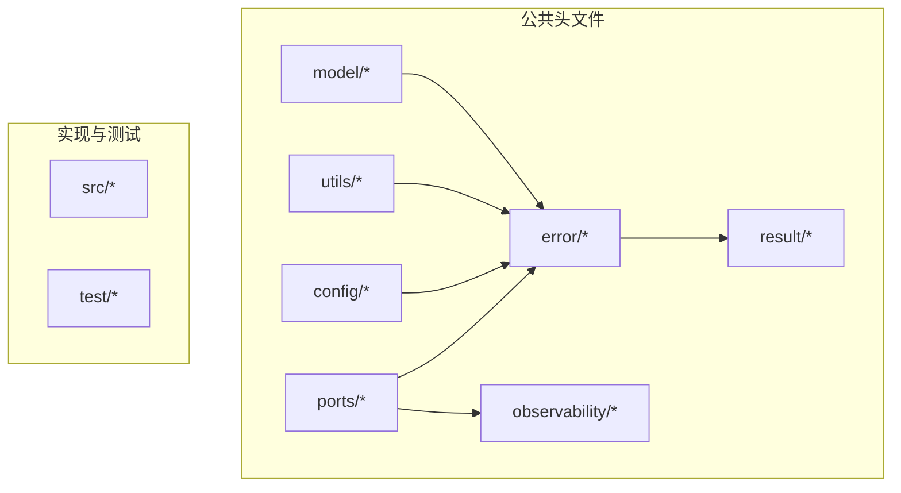
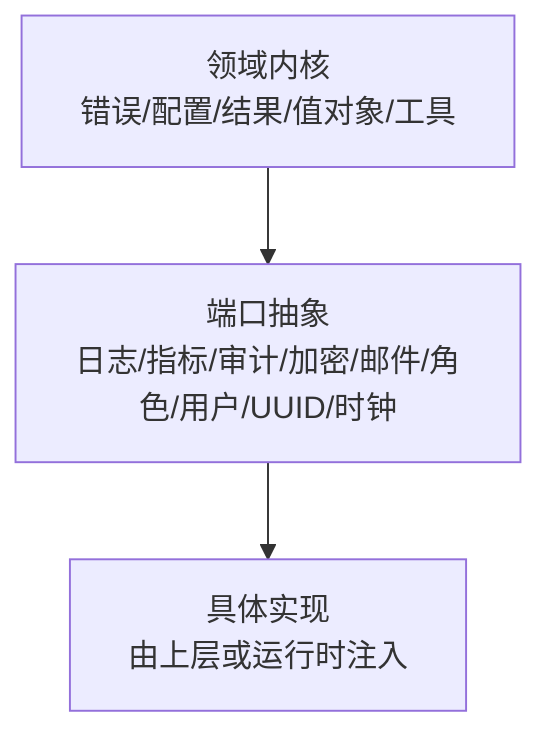
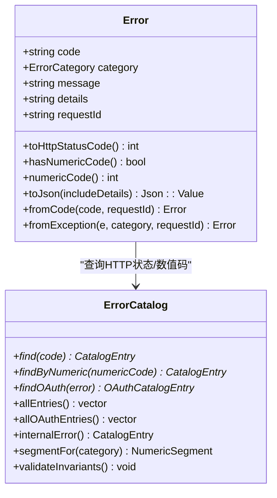
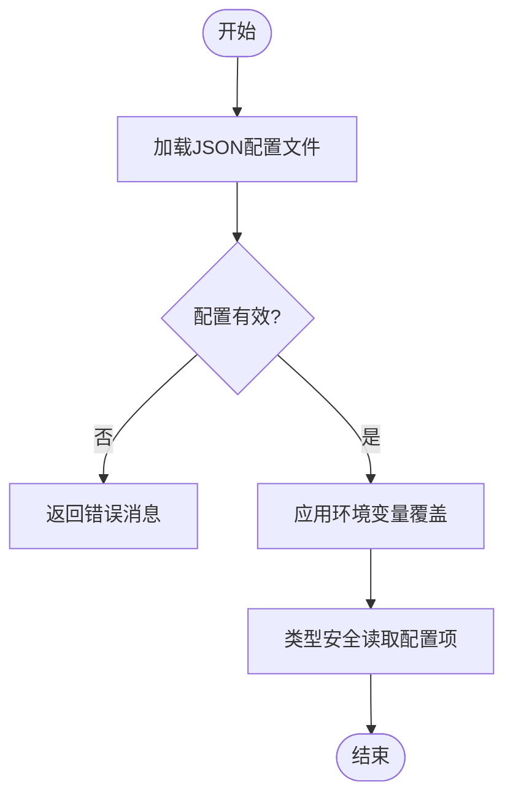
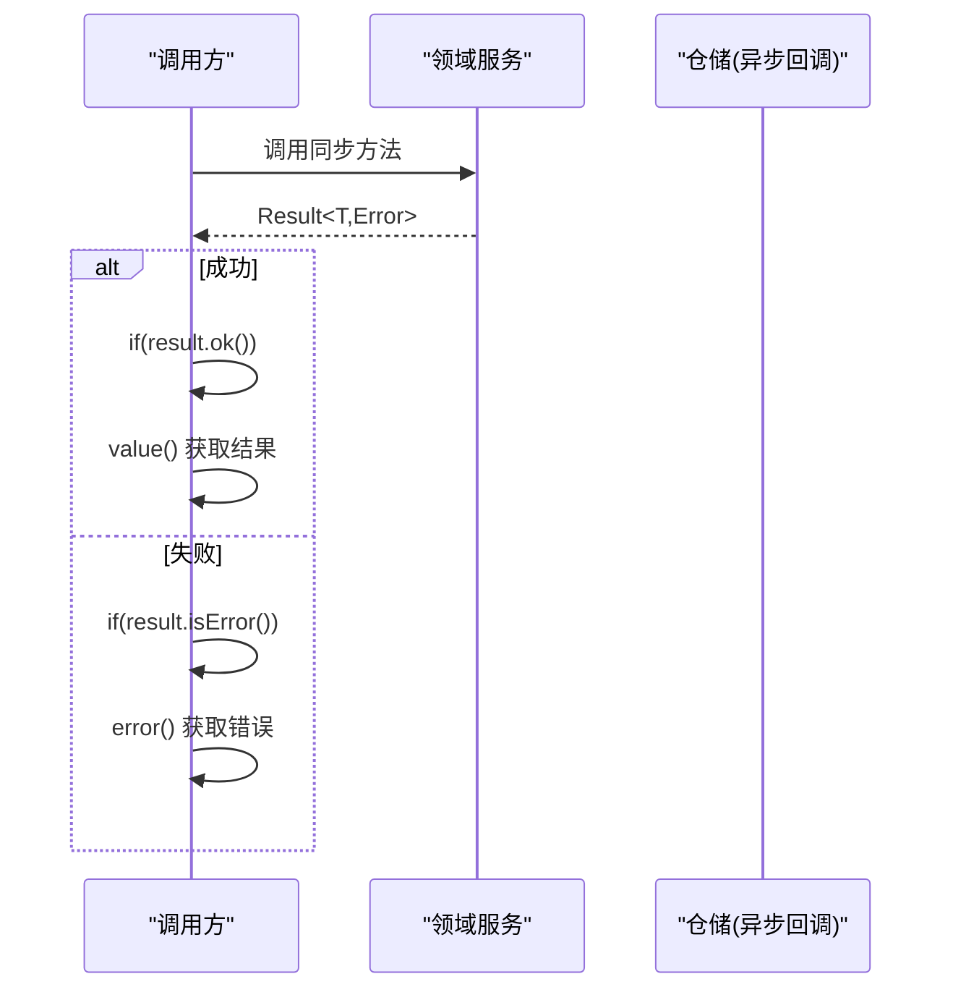
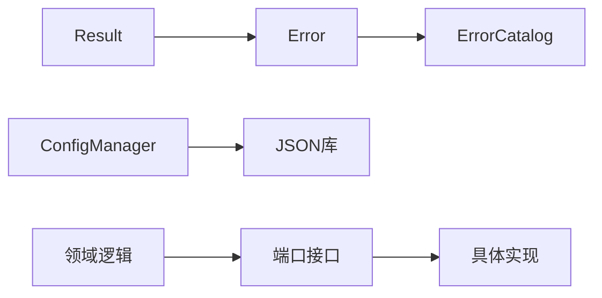

# 通用库 (authforge::common)

<cite>
**本文引用的文件**
- [libs/common/include/authforge/common/error/ErrorCatalog.h](file://libs/common/include/authforge/common/error/ErrorCatalog.h)
- [libs/common/include/authforge/common/error/ErrorTypes.h](file://libs/common/include/authforge/common/error/ErrorTypes.h)
- [libs/common/include/authforge/common/config/ConfigManager.h](file://libs/common/include/authforge/common/config/ConfigManager.h)
- [libs/common/include/authforge/common/result/Result.h](file://libs/common/include/authforge/common/result/Result.h)
- [libs/common/include/authforge/common/utils/ConstantTimeCompare.h](file://libs/common/include/authforge/common/utils/ConstantTimeCompare.h)
- [libs/common/include/authforge/common/utils/EmailNormalizer.h](file://libs/common/include/authforge/common/utils/EmailNormalizer.h)
- [libs/common/include/authforge/common/model/ClientId.h](file://libs/common/include/authforge/common/model/ClientId.h)
- [libs/common/include/authforge/common/model/PkceChallenge.h](file://libs/common/include/authforge/common/model/PkceChallenge.h)
- [libs/common/include/authforge/common/model/RedirectUri.h](file://libs/common/include/authforge/common/model/RedirectUri.h)
- [libs/common/include/authforge/common/model/Scope.h](file://libs/common/include/authforge/common/model/Scope.h)
- [libs/common/include/authforge/common/model/Subject.h](file://libs/common/include/authforge/common/model/Subject.h)
- [libs/common/include/authforge/common/model/TenantId.h](file://libs/common/include/authforge/common/model/TenantId.h)
- [libs/common/include/authforge/common/model/TokenValue.h](file://libs/common/include/authforge/common/model/TokenValue.h)
- [libs/common/include/authforge/common/observability/AuditEvent.h](file://libs/common/include/authforge/common/observability/AuditEvent.h)
- [libs/common/include/authforge/common/ports/IAuditSink.h](file://libs/common/include/authforge/common/ports/IAuditSink.h)
- [libs/common/include/authforge/common/ports/IClock.h](file://libs/common/include/authforge/common/ports/IClock.h)
- [libs/common/include/authforge/common/ports/ICryptoProvider.h](file://libs/common/include/authforge/common/ports/ICryptoProvider.h)
- [libs/common/include/authforge/common/ports/IEmailSender.h](file://libs/common/include/authforge/common/ports/IEmailSender.h)
- [libs/common/include/authforge/common/ports/ILogger.h](file://libs/common/include/authforge/common/ports/ILogger.h)
- [libs/common/include/authforge/common/ports/IMetrics.h](file://libs/common/include/authforge/common/ports/IMetrics.h)
- [libs/common/include/authforge/common/ports/IRoleProvider.h](file://libs/common/include/authforge/common/ports/IRoleProvider.h)
- [libs/common/include/authforge/common/ports/ISubjectResolver.h](file://libs/common/include/authforge/common/ports/ISubjectResolver.h)
- [libs/common/include/authforge/common/ports/IUserInfoProvider.h](file://libs/common/include/authforge/common/ports/IUserInfoProvider.h)
- [libs/common/include/authforge/common/ports/IUuidGenerator.h](file://libs/common/include/authforge/common/ports/IUuidGenerator.h)
</cite>

## 目录
1. [简介](#简介)
2. [项目结构](#项目结构)
3. [核心组件](#核心组件)
4. [架构总览](#架构总览)
5. [详细组件分析](#详细组件分析)
6. [依赖关系分析](#依赖关系分析)
7. [性能考虑](#性能考虑)
8. [故障排查指南](#故障排查指南)
9. [结论](#结论)
10. [附录](#附录)

## 简介
authforge::common 是 AuthForge 项目的领域内核与通用能力层，提供跨框架、可复用的基础工具与抽象。它聚焦于：
- 错误处理机制：统一的错误分类、错误码目录、错误信封序列化与 HTTP 状态映射
- 配置管理：JSON 配置加载、类型安全读取与环境变量覆盖
- 可观测性端口：日志、指标、审计、时钟等外部能力的抽象接口
- 值对象与模型：领域内不可变或强约束的值类型（如 ClientId、PkceChallenge、RedirectUri、Scope、Subject、TenantId、TokenValue）
- 实用工具：常量时间比较、邮箱标准化等
- 同步结果封装：Result<T,E> 用于同步返回成功或错误，避免异常滥用

该库保持“框架无关”的领域层定位，不直接耦合具体 Web 框架，仅通过端口接口与上层实现解耦。

## 项目结构
libs/common 采用分层组织方式：
- include/authforge/common：对外暴露的公共头文件
  - error：错误类型、错误目录、错误上下文
  - config：配置管理器与类型定义
  - result：同步结果类型 Result<T,E>
  - utils：通用工具函数
  - model：领域值对象
  - observability：审计事件等可观测性数据模型
  - ports：外部能力抽象接口（日志、指标、加密、邮件、角色、用户信息、UUID、时钟、审计落盘等）
- src：各模块的具体实现（本仓库中未展开）
- test/testing：单元测试与测试辅助

图表来源
- [libs/common/include/authforge/common/error/ErrorCatalog.h:1-106](file://libs/common/include/authforge/common/error/ErrorCatalog.h#L1-L106)
- [libs/common/include/authforge/common/config/ConfigManager.h:1-75](file://libs/common/include/authforge/common/config/ConfigManager.h#L1-L75)
- [libs/common/include/authforge/common/result/Result.h:1-184](file://libs/common/include/authforge/common/result/Result.h#L1-L184)

章节来源
- [libs/common/include/authforge/common/error/ErrorCatalog.h:1-106](file://libs/common/include/authforge/common/error/ErrorCatalog.h#L1-L106)
- [libs/common/include/authforge/common/config/ConfigManager.h:1-75](file://libs/common/include/authforge/common/config/ConfigManager.h#L1-L75)
- [libs/common/include/authforge/common/result/Result.h:1-184](file://libs/common/include/authforge/common/result/Result.h#L1-L184)

## 核心组件
- 错误系统
  - ErrorCategory：稳定错误分类枚举（网络、数据库、校验、认证、授权、内部、未知）
  - Error：领域级错误，包含 code、category、message、details、requestId，并提供 toHttpStatusCode()、toJson() 等方法
  - ErrorCatalog：集中维护应用错误码与 OAuth2 协议错误码，提供查找、枚举、不变量校验
- 配置系统
  - ConfigManager：加载 JSON 配置、类型安全读取、环境变量覆盖、.env 优先级读取
- 结果封装
  - Result<T,E>：最小化的成功/错误联合类型，默认错误类型为 Error，提供 ok()/isError()/value()/error()/valueOr()
- 值对象与模型
  - ClientId、PkceChallenge、RedirectUri、Scope、Subject、TenantId、TokenValue：强类型领域值对象，提升类型安全与语义表达
- 可观测性端口
  - ILogger、IMetrics、IAuditSink、IClock、IEmailSender、ICryptoProvider、IRoleProvider、ISubjectResolver、IUserInfoProvider、IUuidGenerator：将外部能力抽象为接口，便于替换与测试
- 实用工具
  - ConstantTimeCompare：常量时间字符串比较，防止时序侧信道攻击
  - EmailNormalizer：邮箱地址规范化，统一大小写与空白处理

章节来源
- [libs/common/include/authforge/common/error/ErrorTypes.h:1-98](file://libs/common/include/authforge/common/error/ErrorTypes.h#L1-L98)
- [libs/common/include/authforge/common/error/ErrorCatalog.h:1-106](file://libs/common/include/authforge/common/error/ErrorCatalog.h#L1-L106)
- [libs/common/include/authforge/common/config/ConfigManager.h:1-75](file://libs/common/include/authforge/common/config/ConfigManager.h#L1-L75)
- [libs/common/include/authforge/common/result/Result.h:1-184](file://libs/common/include/authforge/common/result/Result.h#L1-L184)
- [libs/common/include/authforge/common/utils/ConstantTimeCompare.h](file://libs/common/include/authforge/common/utils/ConstantTimeCompare.h)
- [libs/common/include/authforge/common/utils/EmailNormalizer.h](file://libs/common/include/authforge/common/utils/EmailNormalizer.h)
- [libs/common/include/authforge/common/model/ClientId.h](file://libs/common/include/authforge/common/model/ClientId.h)
- [libs/common/include/authforge/common/model/PkceChallenge.h](file://libs/common/include/authforge/common/model/PkceChallenge.h)
- [libs/common/include/authforge/common/model/RedirectUri.h](file://libs/common/include/authforge/common/model/RedirectUri.h)
- [libs/common/include/authforge/common/model/Scope.h](file://libs/common/include/authforge/common/model/Scope.h)
- [libs/common/include/authforge/common/model/Subject.h](file://libs/common/include/authforge/common/model/Subject.h)
- [libs/common/include/authforge/common/model/TenantId.h](file://libs/common/include/authforge/common/model/TenantId.h)
- [libs/common/include/authforge/common/model/TokenValue.h](file://libs/common/include/authforge/common/model/TokenValue.h)
- [libs/common/include/authforge/common/observability/AuditEvent.h](file://libs/common/include/authforge/common/observability/AuditEvent.h)
- [libs/common/include/authforge/common/ports/IAuditSink.h](file://libs/common/include/authforge/common/ports/IAuditSink.h)
- [libs/common/include/authforge/common/ports/IClock.h](file://libs/common/include/authforge/common/ports/IClock.h)
- [libs/common/include/authforge/common/ports/ICryptoProvider.h](file://libs/common/include/authforge/common/ports/ICryptoProvider.h)
- [libs/common/include/authforge/common/ports/IEmailSender.h](file://libs/common/include/authforge/common/ports/IEmailSender.h)
- [libs/common/include/authforge/common/ports/ILogger.h](file://libs/common/include/authforge/common/ports/ILogger.h)
- [libs/common/include/authforge/common/ports/IMetrics.h](file://libs/common/include/authforge/common/ports/IMetrics.h)
- [libs/common/include/authforge/common/ports/IRoleProvider.h](file://libs/common/include/authforge/common/ports/IRoleProvider.h)
- [libs/common/include/authforge/common/ports/ISubjectResolver.h](file://libs/common/include/authforge/common/ports/ISubjectResolver.h)
- [libs/common/include/authforge/common/ports/IUserInfoProvider.h](file://libs/common/include/authforge/common/ports/IUserInfoProvider.h)
- [libs/common/include/authforge/common/ports/IUuidGenerator.h](file://libs/common/include/authforge/common/ports/IUuidGenerator.h)

## 架构总览
authforge::common 以“领域内核 + 端口抽象”的方式组织：
- 领域内核：错误系统、配置、结果封装、值对象、工具函数
- 端口抽象：日志、指标、审计、加密、邮件、角色、用户信息、UUID、时钟等外部能力
- 上层业务模块（如 oauth2、identity）通过端口接口调用外部能力，从而保持领域逻辑与框架/基础设施解耦

图表来源
- [libs/common/include/authforge/common/error/ErrorTypes.h:1-98](file://libs/common/include/authforge/common/error/ErrorTypes.h#L1-L98)
- [libs/common/include/authforge/common/ports/ILogger.h](file://libs/common/include/authforge/common/ports/ILogger.h)
- [libs/common/include/authforge/common/ports/IMetrics.h](file://libs/common/include/authforge/common/ports/IMetrics.h)
- [libs/common/include/authforge/common/ports/IAuditSink.h](file://libs/common/include/authforge/common/ports/IAuditSink.h)

## 详细组件分析

### 错误系统与错误码目录
- ErrorCategory：稳定的错误分类，用于生成 HTTP 状态码与错误信封类别
- Error：携带 code、category、message、details、requestId；支持 toJson(includeDetails) 与 toHttpStatusCode()
- ErrorCatalog：集中维护应用错误码与 OAuth2 协议错误码，提供 find/findOAuth/allEntries/allOAuthEntries/internalError/segmentFor/validateInvariants
- 使用建议
  - 所有业务错误应通过 ErrorCatalog 注册并引用稳定 code
  - 生产环境输出时不包含 details，仅在调试模式开启
  - 启动阶段调用 validateInvariants 确保目录一致性

图表来源
- [libs/common/include/authforge/common/error/ErrorTypes.h:1-98](file://libs/common/include/authforge/common/error/ErrorTypes.h#L1-L98)
- [libs/common/include/authforge/common/error/ErrorCatalog.h:1-106](file://libs/common/include/authforge/common/error/ErrorCatalog.h#L1-L106)

章节来源
- [libs/common/include/authforge/common/error/ErrorTypes.h:1-98](file://libs/common/include/authforge/common/error/ErrorTypes.h#L1-L98)
- [libs/common/include/authforge/common/error/ErrorCatalog.h:1-106](file://libs/common/include/authforge/common/error/ErrorCatalog.h#L1-L106)

### 配置管理
- ConfigManager：提供 load(configPath, config)、get<T>(config, path, default)、validate(config, errorMessage)、applyEnvOverrides(config, rules)、getEnv(name)
- 设计要点
  - 类型安全的 get<T> 模板，支持 string/int/double/bool 等
  - .env 文件优先于系统环境变量
  - 支持规则化环境变量覆盖，便于多环境部署
- 使用建议
  - 在应用启动阶段加载配置并验证
  - 对关键路径使用默认值兜底，避免空指针或类型转换失败
  - 敏感配置通过环境变量注入，不在配置文件中明文存储

图表来源
- [libs/common/include/authforge/common/config/ConfigManager.h:1-75](file://libs/common/include/authforge/common/config/ConfigManager.h#L1-L75)

章节来源
- [libs/common/include/authforge/common/config/ConfigManager.h:1-75](file://libs/common/include/authforge/common/config/ConfigManager.h#L1-L75)

### 同步结果封装 Result<T,E>
- Result<T,E>：最小化的成功/错误联合类型，默认错误类型为 Error
- 主要方法：ok()/err() 构造；ok()/isError()/operator bool() 检查；value()/error() 取值；valueOr(fallback) 安全回退
- 使用建议
  - 在同步领域逻辑中使用 Result 替代异常流控制
  - 始终先检查 ok()/isError() 再取值，避免 BadResultAccess
  - 结合 ErrorCatalog 构建错误，保证错误码与 HTTP 状态一致

图表来源
- [libs/common/include/authforge/common/result/Result.h:1-184](file://libs/common/include/authforge/common/result/Result.h#L1-L184)
- [libs/common/include/authforge/common/error/ErrorTypes.h:1-98](file://libs/common/include/authforge/common/error/ErrorTypes.h#L1-L98)

章节来源
- [libs/common/include/authforge/common/result/Result.h:1-184](file://libs/common/include/authforge/common/result/Result.h#L1-L184)
- [libs/common/include/authforge/common/error/ErrorTypes.h:1-98](file://libs/common/include/authforge/common/error/ErrorTypes.h#L1-L98)

### 值对象与模型
- ClientId、PkceChallenge、RedirectUri、Scope、Subject、TenantId、TokenValue：强类型领域值对象
- 设计目的
  - 用类型表达领域约束，减少非法状态
  - 提高可读性与可维护性，避免裸字符串/数字传递
- 使用建议
  - 在 API 边界进行值对象构造与校验
  - 持久化前转换为底层表示（如字符串/整数），从持久化后恢复为值对象

章节来源
- [libs/common/include/authforge/common/model/ClientId.h](file://libs/common/include/authforge/common/model/ClientId.h)
- [libs/common/include/authforge/common/model/PkceChallenge.h](file://libs/common/include/authforge/common/model/PkceChallenge.h)
- [libs/common/include/authforge/common/model/RedirectUri.h](file://libs/common/include/authforge/common/model/RedirectUri.h)
- [libs/common/include/authforge/common/model/Scope.h](file://libs/common/include/authforge/common/model/Scope.h)
- [libs/common/include/authforge/common/model/Subject.h](file://libs/common/include/authforge/common/model/Subject.h)
- [libs/common/include/authforge/common/model/TenantId.h](file://libs/common/include/authforge/common/model/TenantId.h)
- [libs/common/include/authforge/common/model/TokenValue.h](file://libs/common/include/authforge/common/model/TokenValue.h)

### 可观测性端口
- ILogger：日志记录接口，供上层按级别记录结构化日志
- IMetrics：指标上报接口，用于性能与业务指标采集
- IAuditSink：审计事件落盘接口，记录关键操作轨迹
- IClock：时间源抽象，便于测试与可控时间
- IEmailSender：邮件发送抽象，便于替换不同邮件服务
- ICryptoProvider：加密原语抽象，屏蔽底层实现差异
- IRoleProvider、ISubjectResolver、IUserInfoProvider：身份与权限相关的外部能力
- IUuidGenerator：唯一标识生成器抽象
- 使用建议
  - 领域层只依赖端口接口，具体实现由上层装配
  - 通过注入或全局容器注册实现，便于测试时替换为 Mock

章节来源
- [libs/common/include/authforge/common/ports/ILogger.h](file://libs/common/include/authforge/common/ports/ILogger.h)
- [libs/common/include/authforge/common/ports/IMetrics.h](file://libs/common/include/authforge/common/ports/IMetrics.h)
- [libs/common/include/authforge/common/ports/IAuditSink.h](file://libs/common/include/authforge/common/ports/IAuditSink.h)
- [libs/common/include/authforge/common/ports/IClock.h](file://libs/common/include/authforge/common/ports/IClock.h)
- [libs/common/include/authforge/common/ports/IEmailSender.h](file://libs/common/include/authforge/common/ports/IEmailSender.h)
- [libs/common/include/authforge/common/ports/ICryptoProvider.h](file://libs/common/include/authforge/common/ports/ICryptoProvider.h)
- [libs/common/include/authforge/common/ports/IRoleProvider.h](file://libs/common/include/authforge/common/ports/IRoleProvider.h)
- [libs/common/include/authforge/common/ports/ISubjectResolver.h](file://libs/common/include/authforge/common/ports/ISubjectResolver.h)
- [libs/common/include/authforge/common/ports/IUserInfoProvider.h](file://libs/common/include/authforge/common/ports/IUserInfoProvider.h)
- [libs/common/include/authforge/common/ports/IUuidGenerator.h](file://libs/common/include/authforge/common/ports/IUuidGenerator.h)
- [libs/common/include/authforge/common/observability/AuditEvent.h](file://libs/common/include/authforge/common/observability/AuditEvent.h)

### 实用工具
- ConstantTimeCompare：常量时间比较，适用于敏感数据对比（如令牌、签名片段），避免时序侧信道
- EmailNormalizer：邮箱标准化，统一大小写与空白，提升匹配与去重准确性
- 使用建议
  - 对任何需要比较的敏感数据进行常量时间比较
  - 在输入边界对邮箱进行标准化，减少后续分支判断复杂度

章节来源
- [libs/common/include/authforge/common/utils/ConstantTimeCompare.h](file://libs/common/include/authforge/common/utils/ConstantTimeCompare.h)
- [libs/common/include/authforge/common/utils/EmailNormalizer.h](file://libs/common/include/authforge/common/utils/EmailNormalizer.h)

## 依赖关系分析
- 错误系统
  - Error 依赖 ErrorCatalog 以解析 HTTP 状态码与数值错误码
  - ErrorCatalog 维护应用与 OAuth2 协议错误码表，提供不变量校验
- 配置系统
  - ConfigManager 依赖 JSON 库进行解析与类型安全访问
- 结果封装
  - Result<T,E> 默认错误类型为 Error，便于与错误系统无缝集成
- 端口抽象
  - 领域层通过端口接口与外部能力解耦，降低耦合度，提升可测试性

图表来源
- [libs/common/include/authforge/common/error/ErrorTypes.h:1-98](file://libs/common/include/authforge/common/error/ErrorTypes.h#L1-L98)
- [libs/common/include/authforge/common/error/ErrorCatalog.h:1-106](file://libs/common/include/authforge/common/error/ErrorCatalog.h#L1-L106)
- [libs/common/include/authforge/common/result/Result.h:1-184](file://libs/common/include/authforge/common/result/Result.h#L1-L184)
- [libs/common/include/authforge/common/config/ConfigManager.h:1-75](file://libs/common/include/authforge/common/config/ConfigManager.h#L1-L75)

章节来源
- [libs/common/include/authforge/common/error/ErrorTypes.h:1-98](file://libs/common/include/authforge/common/error/ErrorTypes.h#L1-L98)
- [libs/common/include/authforge/common/error/ErrorCatalog.h:1-106](file://libs/common/include/authforge/common/error/ErrorCatalog.h#L1-L106)
- [libs/common/include/authforge/common/result/Result.h:1-184](file://libs/common/include/authforge/common/result/Result.h#L1-L184)
- [libs/common/include/authforge/common/config/ConfigManager.h:1-75](file://libs/common/include/authforge/common/config/ConfigManager.h#L1-L75)

## 性能考虑
- 错误系统
  - ErrorCatalog 在启动时进行不变量校验，避免运行期开销；查找为静态表查找，性能稳定
- 配置系统
  - 配置加载通常在启动阶段执行；类型安全读取避免重复解析；环境变量覆盖按需应用
- 结果封装
  - Result<T,E> 基于 std::variant，零拷贝访问；避免异常作为控制流，减少栈展开成本
- 工具函数
  - ConstantTimeCompare 使用常量时间算法，牺牲少量性能换取安全性；适用于敏感数据对比
  - EmailNormalizer 在输入边界执行一次，避免重复处理
- 线程安全性
  - 错误目录与配置读取在无写入场景下可并发访问；若存在动态修改，需在上层加锁
  - 端口实现（如日志、指标）通常具备线程安全要求，应在具体实现中保障

[本节为通用指导，不直接分析具体文件]

## 故障排查指南
- 错误码与 HTTP 状态不一致
  - 检查 ErrorCatalog 中对应条目是否完整且符合规范
  - 确认 fromCode/fromException 是否正确传入请求 ID
- 配置加载失败
  - 检查配置文件路径与权限
  - 使用 validate 捕获错误消息，定位缺失或非法字段
  - 确认环境变量覆盖规则与优先级
- Result 误用导致崩溃
  - 确保在取值前先检查 ok()/isError()
  - 对可能失败的同步逻辑使用 valueOr(fallback) 安全回退
- 日志与指标缺失
  - 确认端口实现已正确注入与启用
  - 检查日志级别与指标采样策略

章节来源
- [libs/common/include/authforge/common/error/ErrorCatalog.h:1-106](file://libs/common/include/authforge/common/error/ErrorCatalog.h#L1-L106)
- [libs/common/include/authforge/common/error/ErrorTypes.h:1-98](file://libs/common/include/authforge/common/error/ErrorTypes.h#L1-L98)
- [libs/common/include/authforge/common/config/ConfigManager.h:1-75](file://libs/common/include/authforge/common/config/ConfigManager.h#L1-L75)
- [libs/common/include/authforge/common/result/Result.h:1-184](file://libs/common/include/authforge/common/result/Result.h#L1-L184)

## 结论
authforge::common 提供了稳定、可扩展的领域内核与通用能力，通过错误系统、配置管理、结果封装、值对象、端口抽象与实用工具，帮助上层模块以清晰、可测试、高性能的方式实现业务逻辑。建议在项目中广泛复用这些组件，遵循错误码目录、配置规范与端口注入的最佳实践，以提升整体质量与可维护性。

[本节为总结，不直接分析具体文件]

## 附录
- 使用示例（以路径引用代替代码内容）
  - 错误创建与序列化：参见 [libs/common/include/authforge/common/error/ErrorTypes.h:57-95](file://libs/common/include/authforge/common/error/ErrorTypes.h#L57-L95)
  - 错误码查找与枚举：参见 [libs/common/include/authforge/common/error/ErrorCatalog.h:62-103](file://libs/common/include/authforge/common/error/ErrorCatalog.h#L62-L103)
  - 配置加载与类型安全读取：参见 [libs/common/include/authforge/common/config/ConfigManager.h:11-75](file://libs/common/include/authforge/common/config/ConfigManager.h#L11-L75)
  - 同步结果使用：参见 [libs/common/include/authforge/common/result/Result.h:60-181](file://libs/common/include/authforge/common/result/Result.h#L60-L181)
  - 常量时间比较：参见 [libs/common/include/authforge/common/utils/ConstantTimeCompare.h](file://libs/common/include/authforge/common/utils/ConstantTimeCompare.h)
  - 邮箱标准化：参见 [libs/common/include/authforge/common/utils/EmailNormalizer.h](file://libs/common/include/authforge/common/utils/EmailNormalizer.h)
  - 值对象示例：参见 [libs/common/include/authforge/common/model/ClientId.h](file://libs/common/include/authforge/common/model/ClientId.h)、[libs/common/include/authforge/common/model/PkceChallenge.h](file://libs/common/include/authforge/common/model/PkceChallenge.h)、[libs/common/include/authforge/common/model/RedirectUri.h](file://libs/common/include/authforge/common/model/RedirectUri.h)、[libs/common/include/authforge/common/model/Scope.h](file://libs/common/include/authforge/common/model/Scope.h)、[libs/common/include/authforge/common/model/Subject.h](file://libs/common/include/authforge/common/model/Subject.h)、[libs/common/include/authforge/common/model/TenantId.h](file://libs/common/include/authforge/common/model/TenantId.h)、[libs/common/include/authforge/common/model/TokenValue.h](file://libs/common/include/authforge/common/model/TokenValue.h)
  - 端口接口示例：参见 [libs/common/include/authforge/common/ports/ILogger.h](file://libs/common/include/authforge/common/ports/ILogger.h)、[libs/common/include/authforge/common/ports/IMetrics.h](file://libs/common/include/authforge/common/ports/IMetrics.h)、[libs/common/include/authforge/common/ports/IAuditSink.h](file://libs/common/include/authforge/common/ports/IAuditSink.h)、[libs/common/include/authforge/common/ports/IClock.h](file://libs/common/include/authforge/common/ports/IClock.h)、[libs/common/include/authforge/common/ports/IEmailSender.h](file://libs/common/include/authforge/common/ports/IEmailSender.h)、[libs/common/include/authforge/common/ports/ICryptoProvider.h](file://libs/common/include/authforge/common/ports/ICryptoProvider.h)、[libs/common/include/authforge/common/ports/IRoleProvider.h](file://libs/common/include/authforge/common/ports/IRoleProvider.h)、[libs/common/include/authforge/common/ports/ISubjectResolver.h](file://libs/common/include/authforge/common/ports/ISubjectResolver.h)、[libs/common/include/authforge/common/ports/IUserInfoProvider.h](file://libs/common/include/authforge/common/ports/IUserInfoProvider.h)、[libs/common/include/authforge/common/ports/IUuidGenerator.h](file://libs/common/include/authforge/common/ports/IUuidGenerator.h)

[本节为附录，不直接分析具体文件]