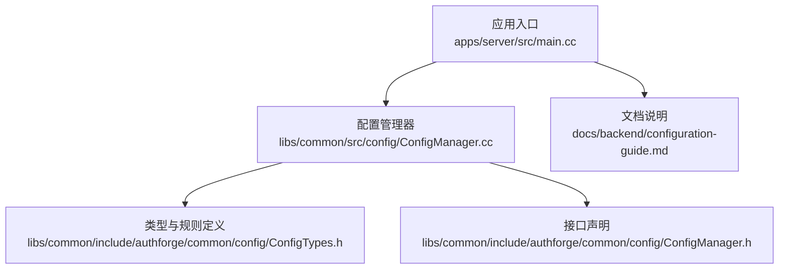
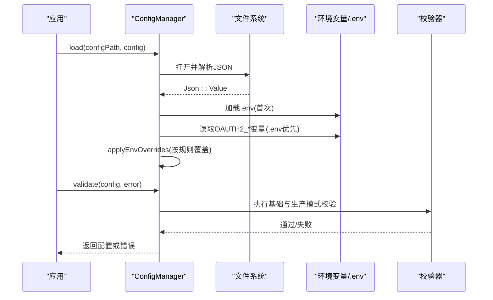
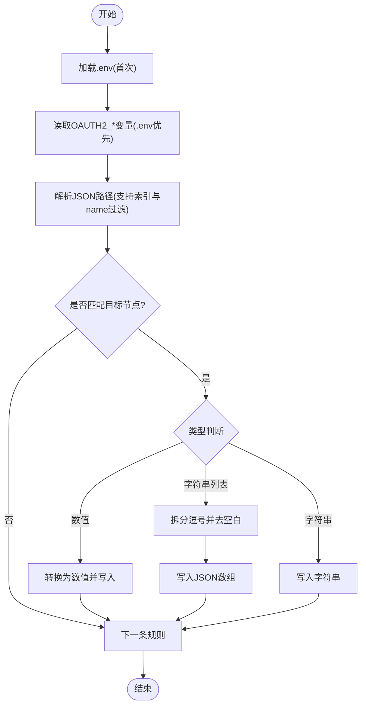
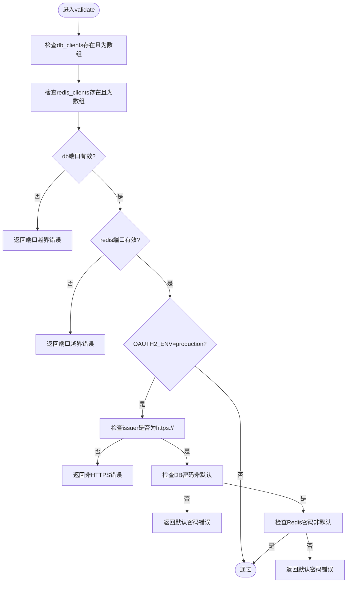
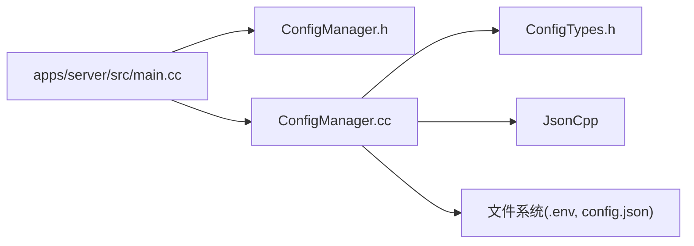

# 配置管理

<cite>
**本文引用的文件**
- [ConfigManager.h](file://libs/common/include/authforge/common/config/ConfigManager.h)
- [ConfigTypes.h](file://libs/common/include/authforge/common/config/ConfigTypes.h)
- [ConfigManager.cc](file://libs/common/src/config/ConfigManager.cc)
- [main.cc](file://apps/server/src/main.cc)
- [configuration-guide.md](file://docs/backend/configuration-guide.md)
- [EnvConfigTest.cc](file://tests/unit/config/EnvConfigTest.cc)
- [ConfigTest.cc](file://tests/unit/config/ConfigTest.cc)
</cite>

## 目录
1. [简介](#简介)
2. [项目结构](#项目结构)
3. [核心组件](#核心组件)
4. [架构总览](#架构总览)
5. [详细组件分析](#详细组件分析)
6. [依赖关系分析](#依赖关系分析)
7. [性能考虑](#性能考虑)
8. [故障排查指南](#故障排查指南)
9. [结论](#结论)
10. [附录](#附录)

## 简介
本章节面向 authforge::common 库中的配置管理能力，聚焦以下目标：
- 配置文件格式支持（当前实现为 JSON；YAML 需通过上层适配）
- 配置项验证与生产模式强校验
- 环境变量覆盖机制（含 .env 文件优先级）
- 配置热重载现状与建议
- 加载优先级、默认值处理与配置迁移策略
- 安全考虑与敏感信息保护方法
- 使用示例路径（以源码引用代替直接代码片段）

## 项目结构
配置管理相关代码集中在 libs/common 的 config 子模块中，由头文件声明接口与类型，源文件实现加载、覆盖、解析与验证逻辑。应用层在启动时调用该模块完成配置加载与校验，随后将配置注入到 Drogon 框架。

图表来源
- [main.cc:75-95](file://apps/server/src/main.cc#L75-L95)
- [ConfigManager.cc:126-150](file://libs/common/src/config/ConfigManager.cc#L126-L150)
- [ConfigTypes.h:10-46](file://libs/common/include/authforge/common/config/ConfigTypes.h#L10-L46)
- [ConfigManager.h:11-40](file://libs/common/include/authforge/common/config/ConfigManager.h#L11-L40)
- [configuration-guide.md:1-27](file://docs/backend/configuration-guide.md#L1-L27)

章节来源
- [main.cc:75-95](file://apps/server/src/main.cc#L75-L95)
- [ConfigManager.cc:126-150](file://libs/common/src/config/ConfigManager.cc#L126-L150)
- [ConfigTypes.h:10-46](file://libs/common/include/authforge/common/config/ConfigTypes.h#L10-L46)
- [ConfigManager.h:11-40](file://libs/common/include/authforge/common/config/ConfigManager.h#L11-L40)
- [configuration-guide.md:1-27](file://docs/backend/configuration-guide.md#L1-L27)

## 核心组件
- ConfigManager：提供配置加载、环境变量覆盖、JSON 路径解析、类型安全的 get 访问器以及 validate 校验能力。
- EnvOverride/OAUTH2_ENV_OVERRIDES：声明环境变量到配置路径的映射规则，支持数值、字符串与逗号分隔字符串转数组等类型转换。
- 应用集成：应用启动流程调用 ConfigManager::load 与 ConfigManager::validate，确保配置可用且符合约束。

章节来源
- [ConfigManager.h:11-40](file://libs/common/include/authforge/common/config/ConfigManager.h#L11-L40)
- [ConfigTypes.h:10-46](file://libs/common/include/authforge/common/config/ConfigTypes.h#L10-L46)
- [main.cc:75-95](file://apps/server/src/main.cc#L75-L95)

## 架构总览
配置加载与覆盖的整体流程如下：
- 读取 JSON 配置文件并解析为 Json::Value
- 首次加载 .env 文件（按固定路径搜索），缓存键值对
- 根据 OAUTH2_ENV_OVERRIDES 规则，将环境变量（优先 .env，其次系统环境）覆盖到对应 JSON 节点
- 执行 validate 校验（包含端口范围检查与生产模式强制规则）
- 返回配置对象供上层使用（如 Drogon 框架加载）

图表来源
- [ConfigManager.cc:126-150](file://libs/common/src/config/ConfigManager.cc#L126-L150)
- [ConfigManager.cc:152-190](file://libs/common/src/config/ConfigManager.cc#L152-L190)
- [ConfigManager.cc:312-401](file://libs/common/src/config/ConfigManager.cc#L312-L401)
- [ConfigTypes.h:20-44](file://libs/common/include/authforge/common/config/ConfigTypes.h#L20-L44)
- [configuration-guide.md:18-27](file://docs/backend/configuration-guide.md#L18-L27)

## 详细组件分析

### 配置加载与解析
- 支持格式：当前实现仅支持 JSON（Json::parseFromStream）。如需 YAML，应在上层进行格式转换后交由 ConfigManager 处理。
- 加载流程：打开文件 -> 解析为 Json::Value -> 加载 .env -> 应用环境变量覆盖 -> 返回结果。
- 错误处理：文件不存在或解析失败会输出错误信息并返回 false。

章节来源
- [ConfigManager.cc:126-150](file://libs/common/src/config/ConfigManager.cc#L126-L150)

### 环境变量覆盖与优先级
- 优先级：.env 文件 > 系统环境变量。getEnvValue 先查内存缓存的 .env 表，再回退到系统环境变量。
- 覆盖规则：通过 OAUTH2_ENV_OVERRIDES 指定 JSON 路径与环境变量名，支持数值、字符串、逗号分隔字符串转数组三种类型。
- 路径解析：支持点号分隔的对象/数组索引，以及基于名称过滤的数组定位（如 plugins[name=OAuth2Plugin]）。

图表来源
- [ConfigManager.cc:152-190](file://libs/common/src/config/ConfigManager.cc#L152-L190)
- [ConfigManager.cc:192-298](file://libs/common/src/config/ConfigManager.cc#L192-L298)
- [ConfigTypes.h:20-44](file://libs/common/include/authforge/common/config/ConfigTypes.h#L20-L44)

章节来源
- [ConfigManager.cc:152-190](file://libs/common/src/config/ConfigManager.cc#L152-L190)
- [ConfigManager.cc:192-298](file://libs/common/src/config/ConfigManager.cc#L192-L298)
- [ConfigTypes.h:20-44](file://libs/common/include/authforge/common/config/ConfigTypes.h#L20-L44)

### 配置项验证
- 基础校验：检查 db_clients 与 redis_clients 是否存在且为数组；校验端口范围（1-65535）。
- 生产模式校验：当 OAUTH2_ENV=production 时，强制 issuer 必须以 https:// 开头；数据库与 Redis 密码不得为默认值。
- 错误消息：通过 errorMessage 参数返回具体失败原因，便于日志记录与用户提示。

图表来源
- [ConfigManager.cc:312-401](file://libs/common/src/config/ConfigManager.cc#L312-L401)

章节来源
- [ConfigManager.cc:312-401](file://libs/common/src/config/ConfigManager.cc#L312-L401)

### 类型安全的配置读取
- 提供模板方法 get<T>(config, path, defaultValue)，支持 string、int、double、bool 等类型，缺失或空值时返回默认值。
- 内部通过 JSON 路径解析定位节点，避免手动层级访问带来的错误。

章节来源
- [ConfigManager.h:17-22](file://libs/common/include/authforge/common/config/ConfigManager.h#L17-L22)
- [ConfigManager.h:43-72](file://libs/common/include/authforge/common/config/ConfigManager.h#L43-L72)

### 配置热重载机制
- 当前实现：ConfigManager 未提供运行时热重载 API；加载发生在进程启动阶段。
- 建议方案：
  - 进程内热重载：引入信号监听（如 SIGHUP）或 HTTP 端点触发 reload，重新执行 load + validate，并原子替换全局配置指针。
  - 进程外热重载：通过配置中心或容器编排（Kubernetes ConfigMap/Secret）更新配置并重启实例。
- 注意事项：热重载需保证并发安全（读写锁）、回滚策略（失败不生效）、审计日志与指标上报。

[本节为概念性说明，无直接源码引用]

### 配置迁移策略
- 当前实现：ConfigManager 不包含配置版本化与自动迁移逻辑。
- 建议方案：
  - 在 validate 中加入最小版本字段检查，拒绝旧版配置。
  - 提供迁移脚本（CLI 或插件），将旧版配置转换为新版结构后再写入。
  - 结合 CI 静态检查，确保配置变更可追溯与可回滚。

[本节为概念性说明，无直接源码引用]

### 使用示例（以源码路径引用）
- 加载与校验：参见应用入口中对 ConfigManager 的调用方式。
  - 参考路径：[main.cc:75-95](file://apps/server/src/main.cc#L75-L95)
- 环境变量覆盖验证：测试用例验证了 OAUTH2_DB_NAME 与 OAUTH2_VUE_CLIENT_SECRET 的覆盖效果。
  - 参考路径：[EnvConfigTest.cc:41-82](file://tests/unit/config/EnvConfigTest.cc#L41-L82)
- 配置结构验证：测试用例验证了插件配置与存储类型合法性。
  - 参考路径：[ConfigTest.cc:39-63](file://tests/unit/config/ConfigTest.cc#L39-L63)

章节来源
- [main.cc:75-95](file://apps/server/src/main.cc#L75-L95)
- [EnvConfigTest.cc:41-82](file://tests/unit/config/EnvConfigTest.cc#L41-L82)
- [ConfigTest.cc:39-63](file://tests/unit/config/ConfigTest.cc#L39-L63)

## 依赖关系分析
- 应用层依赖 ConfigManager 提供的 load/validate/get 能力。
- ConfigManager 依赖 JsonCpp 进行 JSON 解析，依赖文件系统读取 .env 与配置文件。
- 环境变量覆盖规则集中定义于 ConfigTypes.h，便于统一维护与扩展。

图表来源
- [main.cc:75-95](file://apps/server/src/main.cc#L75-L95)
- [ConfigManager.h:11-40](file://libs/common/include/authforge/common/config/ConfigManager.h#L11-L40)
- [ConfigManager.cc:126-150](file://libs/common/src/config/ConfigManager.cc#L126-L150)
- [ConfigTypes.h:10-46](file://libs/common/include/authforge/common/config/ConfigTypes.h#L10-L46)

章节来源
- [main.cc:75-95](file://apps/server/src/main.cc#L75-L95)
- [ConfigManager.h:11-40](file://libs/common/include/authforge/common/config/ConfigManager.h#L11-L40)
- [ConfigManager.cc:126-150](file://libs/common/src/config/ConfigManager.cc#L126-L150)
- [ConfigTypes.h:10-46](file://libs/common/include/authforge/common/config/ConfigTypes.h#L10-L46)

## 性能考虑
- 文件 I/O：每次加载都会打开并解析配置文件，建议在长生命周期进程中复用配置对象，减少重复 I/O。
- .env 加载：仅在首次调用时扫描并缓存，后续查询为哈希查找，开销较低。
- 环境变量覆盖：遍历规则集进行覆盖，规则数量可控；若规则较多，可考虑索引优化。
- 验证成本：validate 为轻量级检查，适合在启动阶段执行；热重载时需评估并发影响。

[本节为通用指导，无直接源码引用]

## 故障排查指南
- 配置文件无法加载：
  - 检查配置文件路径是否正确、权限是否足够。
  - 参考路径：[ConfigManager.cc:126-141](file://libs/common/src/config/ConfigManager.cc#L126-L141)
- 环境变量未生效：
  - 确认 .env 文件是否被正确加载（查看日志输出）。
  - 检查环境变量名是否与 OAUTH2_ENV_OVERRIDES 中定义一致。
  - 参考路径：[ConfigManager.cc:28-124](file://libs/common/src/config/ConfigManager.cc#L28-L124)
- 验证失败：
  - 根据 errorMessage 定位问题（端口范围、生产模式要求等）。
  - 参考路径：[ConfigManager.cc:312-401](file://libs/common/src/config/ConfigManager.cc#L312-L401)
- 单元测试辅助：
  - 通过 EnvConfigTest 验证环境变量覆盖行为。
  - 参考路径：[EnvConfigTest.cc:41-82](file://tests/unit/config/EnvConfigTest.cc#L41-L82)

章节来源
- [ConfigManager.cc:28-124](file://libs/common/src/config/ConfigManager.cc#L28-L124)
- [ConfigManager.cc:126-141](file://libs/common/src/config/ConfigManager.cc#L126-L141)
- [ConfigManager.cc:312-401](file://libs/common/src/config/ConfigManager.cc#L312-L401)
- [EnvConfigTest.cc:41-82](file://tests/unit/config/EnvConfigTest.cc#L41-L82)

## 结论
authforge::common 的配置管理模块提供了稳健的 JSON 配置加载、环境变量覆盖与基础/生产模式校验能力。其设计清晰、职责单一，易于扩展与维护。对于热重载与配置迁移，当前未内置实现，但可通过进程内信号/HTTP 触发与外部工具链补齐。在生产环境中，应严格遵循环境变量覆盖与 validate 的强约束，确保敏感信息与关键配置的安全性与合规性。

[本节为总结性内容，无直接源码引用]

## 附录
- 支持的配置格式：JSON（当前实现）；YAML 需在上层转换。
- 环境变量覆盖优先级：.env 文件 > 系统环境变量。
- 生产模式强制规则：issuer 必须 HTTPS；数据库与 Redis 密码不得为默认值。
- 类型安全的配置读取：使用 get<T> 获取配置项，缺失时返回默认值。
- 使用示例路径：
  - 加载与校验：[main.cc:75-95](file://apps/server/src/main.cc#L75-L95)
  - 环境变量覆盖验证：[EnvConfigTest.cc:41-82](file://tests/unit/config/EnvConfigTest.cc#L41-L82)
  - 配置结构验证：[ConfigTest.cc:39-63](file://tests/unit/config/ConfigTest.cc#L39-L63)

章节来源
- [main.cc:75-95](file://apps/server/src/main.cc#L75-L95)
- [EnvConfigTest.cc:41-82](file://tests/unit/config/EnvConfigTest.cc#L41-L82)
- [ConfigTest.cc:39-63](file://tests/unit/config/ConfigTest.cc#L39-L63)
- [configuration-guide.md:1-27](file://docs/backend/configuration-guide.md#L1-L27)