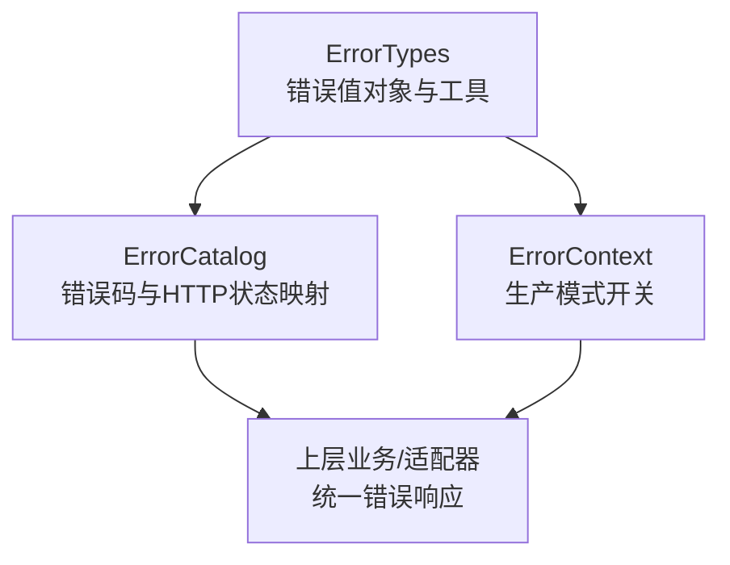
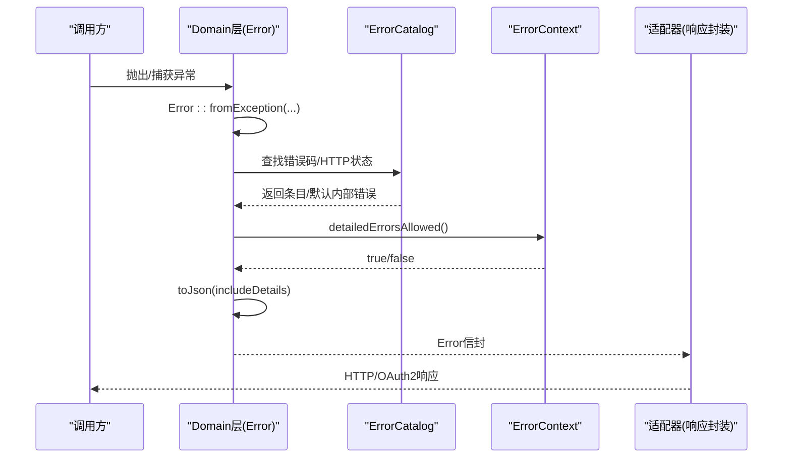
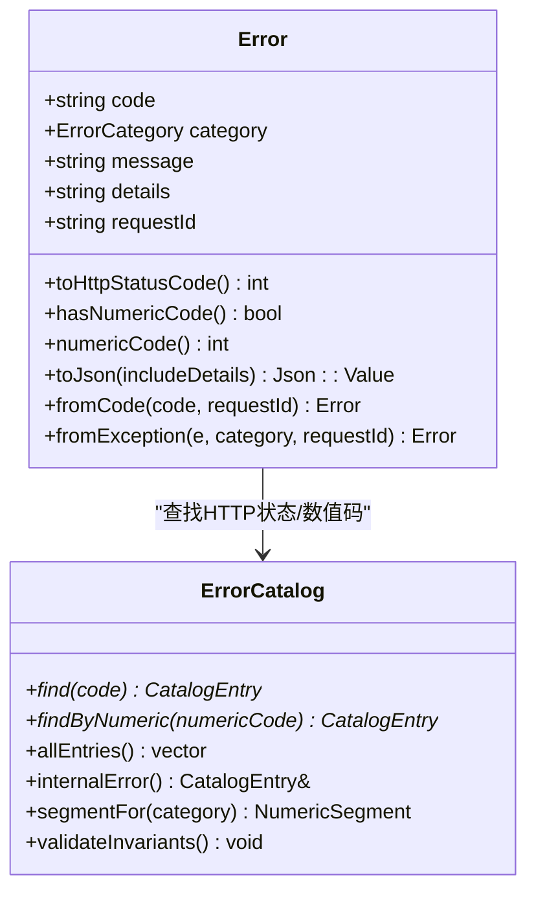
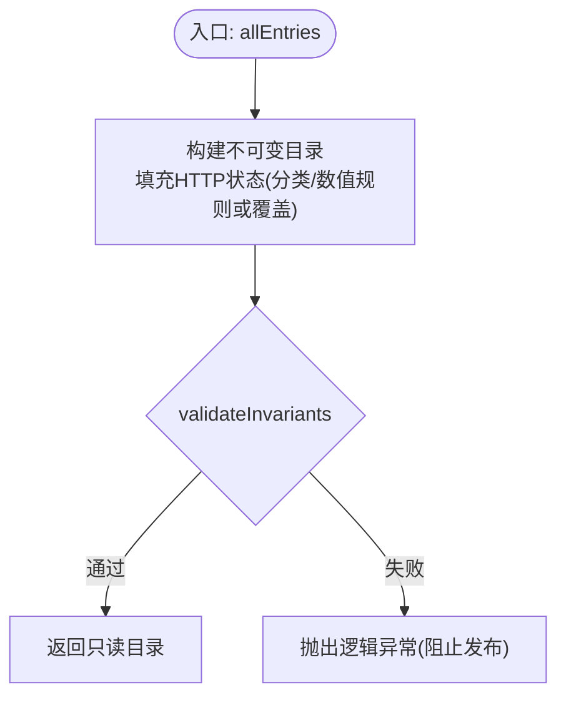
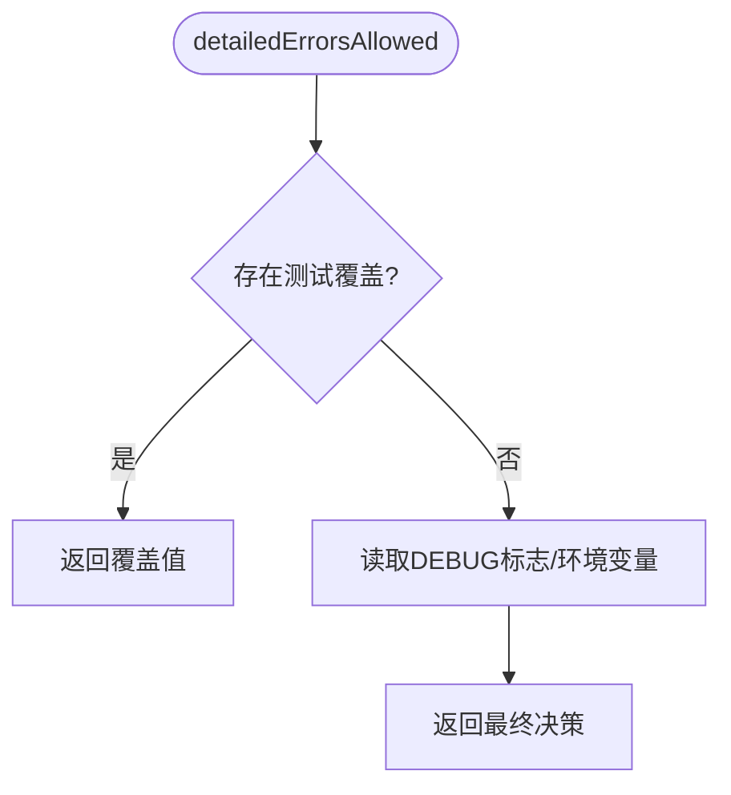
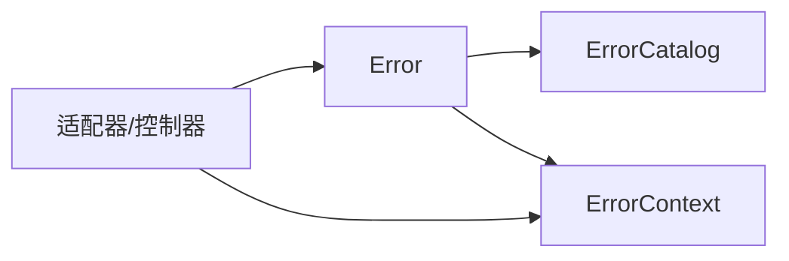

# 错误处理机制

<cite>
**本文引用的文件**
- [ErrorTypes.h](file://libs/common/include/authforge/common/error/ErrorTypes.h)
- [ErrorCatalog.h](file://libs/common/include/authforge/common/error/ErrorCatalog.h)
- [ErrorContext.h](file://libs/common/include/authforge/common/error/ErrorContext.h)
- [ErrorTypes.cc](file://libs/common/src/error/ErrorTypes.cc)
- [ErrorCatalog.cc](file://libs/common/src/error/ErrorCatalog.cc)
- [ErrorContext.cc](file://libs/common/src/error/ErrorContext.cc)
</cite>

## 目录
1. [简介](#简介)
2. [项目结构](#项目结构)
3. [核心组件](#核心组件)
4. [架构总览](#架构总览)
5. [详细组件分析](#详细组件分析)
6. [依赖关系分析](#依赖关系分析)
7. [性能与线程安全](#性能与线程安全)
8. [故障排查指南](#故障排查指南)
9. [结论](#结论)
10. [附录：使用示例与最佳实践](#附录使用示例与最佳实践)

## 简介
本文件系统性说明 authforge::common 库中的错误处理机制，覆盖错误码定义、异常类型设计、错误传播模式、错误恢复策略、统一错误处理接口、错误上下文信息收集与日志记录要点，以及线程安全性与性能优化建议。目标是帮助开发者以一致、可维护且可观测的方式在 Domain 层与 Adapter 层之间传递错误信息，并在生产环境中安全地控制诊断细节的暴露。

## 项目结构
authforge::common 的错误子系统由以下三个核心头文件与实现组成：
- ErrorTypes：定义统一的错误分类枚举、错误值对象 Error 及其序列化/构造方法。
- ErrorCatalog：集中管理应用错误码与 OAuth2 协议错误码的权威表，负责 HTTP 状态码推导与不变式校验。
- ErrorContext：统一管理“是否允许输出详细信息”的生产模式开关，支持测试注入。

图表来源
- [ErrorTypes.h:1-98](file://libs/common/include/authforge/common/error/ErrorTypes.h#L1-L98)
- [ErrorCatalog.h:1-106](file://libs/common/include/authforge/common/error/ErrorCatalog.h#L1-L106)
- [ErrorContext.h:1-46](file://libs/common/include/authforge/common/error/ErrorContext.h#L1-L46)

章节来源
- [ErrorTypes.h:1-98](file://libs/common/include/authforge/common/error/ErrorTypes.h#L1-L98)
- [ErrorCatalog.h:1-106](file://libs/common/include/authforge/common/error/ErrorCatalog.h#L1-L106)
- [ErrorContext.h:1-46](file://libs/common/include/authforge/common/error/ErrorContext.h#L1-L46)

## 核心组件
- 错误分类与值对象（Error）
  - 提供稳定的错误分类枚举 ErrorCategory，涵盖网络、数据库、校验、认证、授权、内部、未知等类别。
  - Error 是框架无关的值对象，包含稳定字符串错误码、分类、客户端安全消息、内部详情、请求ID，并提供 HTTP 状态码查询、JSON 序列化、从错误码或异常构造等方法。
- 错误码目录（ErrorCatalog）
  - 集中维护应用错误码与 OAuth2 协议错误码的权威表，保证唯一性、数值段约束、HTTP 状态范围与必填字段。
  - 根据分类与数值规则生成 HTTP 状态码，并支持显式覆盖（如资源不存在返回 404）。
  - 提供启动期不变式校验，确保目录一致性。
- 错误上下文（ErrorContext）
  - 决定是否在错误响应中包含诊断细节（details），默认在 DEBUG 构建中允许，在生产构建中需通过环境变量开启。
  - 提供测试注入能力，便于单元测试与属性测试切换生产模式。

章节来源
- [ErrorTypes.h:31-95](file://libs/common/include/authforge/common/error/ErrorTypes.h#L31-L95)
- [ErrorCatalog.h:14-102](file://libs/common/include/authforge/common/error/ErrorCatalog.h#L14-L102)
- [ErrorContext.h:8-43](file://libs/common/include/authforge/common/error/ErrorContext.h#L8-L43)

## 架构总览
错误处理在 Domain 层保持框架无关，Adapter 层负责将 Domain 错误转换为具体协议响应（如 HTTP JSON Envelope 或 OAuth2 协议错误）。Domain 层通过 ErrorCatalog 获取稳定的错误码与 HTTP 状态映射；通过 ErrorContext 控制是否输出诊断细节；通过 Error.toJson 生成统一信封格式。

图表来源
- [ErrorTypes.cc:171-190](file://libs/common/src/error/ErrorTypes.cc#L171-L190)
- [ErrorCatalog.cc:335-382](file://libs/common/src/error/ErrorCatalog.cc#L335-L382)
- [ErrorContext.cc:23-43](file://libs/common/src/error/ErrorContext.cc#L23-L43)

## 详细组件分析

### 错误分类与值对象（Error）
- 错误分类枚举 ErrorCategory
  - 明确划分错误领域，便于后续 HTTP 状态码推导与路由到合适的处理策略。
- Error 值对象
  - code：稳定的字符串错误码，作为跨层契约。
  - category：错误分类。
  - message：客户端安全消息（生产环境为目录默认消息）。
  - details：内部详情（仅在非生产模式或显式请求时输出）。
  - requestId：用于关联日志的请求ID。
  - toHttpStatusCode：优先按 catalog 查找 HTTP 状态，否则按分类回退。
  - hasNumericCode / numericCode：判断并获取注册数值错误码。
  - toJson：生成统一信封，键名包括 error.code、error.category、error.message、error.request_id、可选 numeric_code 与 details。
  - fromCode / fromException：从错误码或异常构造 Error，未注册或无法映射时回退到内部错误。

图表来源
- [ErrorTypes.h:50-95](file://libs/common/include/authforge/common/error/ErrorTypes.h#L50-L95)
- [ErrorCatalog.h:62-102](file://libs/common/include/authforge/common/error/ErrorCatalog.h#L62-L102)

章节来源
- [ErrorTypes.h:31-95](file://libs/common/include/authforge/common/error/ErrorTypes.h#L31-L95)
- [ErrorTypes.cc:79-190](file://libs/common/src/error/ErrorTypes.cc#L79-L190)

### 错误码目录（ErrorCatalog）
- 应用错误码表
  - 每个条目包含稳定字符串错误码、数值错误码、分类、HTTP 状态码、默认客户端安全消息与描述。
  - HTTP 状态码由分类与数值规则生成，部分条目支持显式覆盖（例如资源不存在 404、冲突 409、限流 429）。
- OAuth2 协议错误码表
  - 覆盖 RFC 6749 §5.2 基础集合及扩展（如设备码相关），每个条目包含协议错误码、HTTP 状态、默认描述与可选 URI。
- 数值段与不变式校验
  - 每个分类有专属数值区间，目录会校验唯一性、区间归属、HTTP 状态范围、必填字段完整性，以及 OAuth2 必需错误码的存在性与唯一性。
  - 启动期校验失败会抛出逻辑异常，阻止缺陷构建进入生产。

图表来源
- [ErrorCatalog.cc:27-64](file://libs/common/src/error/ErrorCatalog.cc#L27-L64)
- [ErrorCatalog.cc:301-333](file://libs/common/src/error/ErrorCatalog.cc#L301-L333)
- [ErrorCatalog.cc:384-512](file://libs/common/src/error/ErrorCatalog.cc#L384-L512)

章节来源
- [ErrorCatalog.h:14-102](file://libs/common/include/authforge/common/error/ErrorCatalog.h#L14-L102)
- [ErrorCatalog.cc:27-236](file://libs/common/src/error/ErrorCatalog.cc#L27-L236)
- [ErrorCatalog.cc:301-512](file://libs/common/src/error/ErrorCatalog.cc#L301-L512)

### 错误上下文（ErrorContext）
- 生产模式决策
  - DEBUG 构建默认允许详细信息；生产构建默认禁止，除非设置环境变量 DETAILED_VALIDATION_ERRORS 为 "1" 或 "true"。
- 测试注入
  - 提供 setDetailedErrorsOverride/clearDetailedErrorsOverride，便于测试在不改变构建与环境的情况下切换行为。

图表来源
- [ErrorContext.cc:15-43](file://libs/common/src/error/ErrorContext.cc#L15-L43)

章节来源
- [ErrorContext.h:8-43](file://libs/common/include/authforge/common/error/ErrorContext.h#L8-L43)
- [ErrorContext.cc:23-43](file://libs/common/src/error/ErrorContext.cc#L23-L43)

## 依赖关系分析
- Error 依赖 ErrorCatalog 进行 HTTP 状态码与数值错误码解析。
- ErrorCatalog 不依赖任何框架（无 Drogon 依赖），保持 Domain 层纯净。
- ErrorContext 独立于其他模块，仅受构建宏与环境变量影响，并提供测试钩子。
- 上层适配器依赖上述三者完成协议级错误响应封装。

图表来源
- [ErrorTypes.cc:79-190](file://libs/common/src/error/ErrorTypes.cc#L79-L190)
- [ErrorCatalog.cc:335-382](file://libs/common/src/error/ErrorCatalog.cc#L335-L382)
- [ErrorContext.cc:23-43](file://libs/common/src/error/ErrorContext.cc#L23-L43)

章节来源
- [ErrorTypes.cc:79-190](file://libs/common/src/error/ErrorTypes.cc#L79-L190)
- [ErrorCatalog.cc:335-382](file://libs/common/src/error/ErrorCatalog.cc#L335-L382)
- [ErrorContext.cc:23-43](file://libs/common/src/error/ErrorContext.cc#L23-L43)

## 性能与线程安全
- 性能特性
  - 错误目录为静态初始化与只读访问，查找为线性扫描（规模较小，开销可接受）。如需更高性能，可在上层缓存常用条目。
  - toJson 仅在 includeDetails 为真且 details 非空时写入 details 字段，避免不必要的序列化成本。
  - 数值错误码与 HTTP 状态码优先从目录查找，未命中时按分类快速回退，保证函数全定义且路径短。
- 线程安全
  - ErrorCatalog 的目录与查找均为只读，天然线程安全。
  - ErrorContext 的测试覆盖为进程内静态存储，注意在多测试并发场景下应隔离或使用 clear 清理，避免交叉污染。
- 优化建议
  - 对高频错误路径，可将常见错误码的 HTTP 状态码缓存至局部变量。
  - 在批量错误聚合场景中，复用 Error 对象以减少分配。
  - 谨慎启用详细信息输出，生产环境默认关闭以避免额外内存与 I/O 开销。

[本节为通用指导，不直接分析具体文件]

## 故障排查指南
- 启动期目录校验失败
  - 现象：程序启动抛出逻辑异常，提示目录不一致或缺失必要项。
  - 原因：重复错误码、数值不在分类区间、HTTP 状态越界、必填字段缺失、OAuth2 必需错误码缺失或重复。
  - 处置：修正错误码表，确保满足不变式；必要时调整分类或数值区间。
- 未注册错误码回退
  - 现象：使用未注册的错误码时，自动回退到内部错误（INTERNAL_ERROR）。
  - 原因：未在目录中登记该错误码。
  - 处置：将新错误码加入目录，或在上层捕获未知错误并转为已知错误码。
- 生产模式未输出详细信息
  - 现象：错误响应缺少 details 字段。
  - 原因：生产构建默认禁止详细信息；或未设置环境变量。
  - 处置：调试阶段可通过环境变量开启，或通过测试覆盖强制允许；生产环境应保持关闭。

章节来源
- [ErrorCatalog.cc:384-512](file://libs/common/src/error/ErrorCatalog.cc#L384-L512)
- [ErrorTypes.cc:150-190](file://libs/common/src/error/ErrorTypes.cc#L150-L190)
- [ErrorContext.cc:23-43](file://libs/common/src/error/ErrorContext.cc#L23-L43)

## 结论
authforge::common 的错误处理机制以“单一事实来源”的错误码目录为核心，结合框架无关的错误值对象与生产模式开关，实现了稳定、可验证、可扩展的错误体系。它既保证了 Domain 层的纯净与可移植性，又为上层适配器提供了清晰的集成点，便于在不同协议层（HTTP、OAuth2）输出一致的错误信封与状态码。

[本节为总结，不直接分析具体文件]

## 附录：使用示例与最佳实践
- 从异常创建错误并生成响应
  - 步骤：捕获异常 -> 调用 Error::fromException -> 查询 ErrorContext -> 调用 toJson -> 由适配器封装为 HTTP/OAuth2 响应。
  - 参考路径：[ErrorTypes.cc:171-190](file://libs/common/src/error/ErrorTypes.cc#L171-L190)、[ErrorContext.cc:23-43](file://libs/common/src/error/ErrorContext.cc#L23-L43)
- 从错误码创建错误
  - 步骤：调用 Error::fromCode -> 获取 HTTP 状态码 -> 序列化 -> 返回响应。
  - 参考路径：[ErrorTypes.cc:150-169](file://libs/common/src/error/ErrorTypes.cc#L150-L169)
- 自定义错误类型
  - 建议在 Domain 层定义业务语义明确的错误码，并通过 ErrorCatalog 登记；若需要更丰富的业务上下文，可在 details 中携带结构化数据（注意生产模式限制）。
  - 参考路径：[ErrorCatalog.cc:68-236](file://libs/common/src/error/ErrorCatalog.cc#L68-L236)
- 错误传播与恢复策略
  - 传播：在 Domain 层尽量向上抛出 Error 或标准异常，由上层统一转换；避免在底层过早格式化用户可见消息。
  - 恢复：对可重试的网络/数据库错误，结合分类与 HTTP 状态码实施重试与降级；对校验类错误直接返回 4xx。
  - 参考路径：[ErrorTypes.cc:79-108](file://libs/common/src/error/ErrorTypes.cc#L79-L108)
- 日志记录与追踪
  - 使用 requestId 关联请求链路；在适配器层记录错误信封与上下文；生产环境避免记录敏感 details。
  - 参考路径：[ErrorTypes.cc:121-148](file://libs/common/src/error/ErrorTypes.cc#L121-L148)
- 线程安全注意事项
  - 避免在多线程间共享可变错误上下文；ErrorContext 的测试覆盖需在测试结束后清理。
  - 参考路径：[ErrorContext.cc:15-43](file://libs/common/src/error/ErrorContext.cc#L15-L43)

章节来源
- [ErrorTypes.cc:79-190](file://libs/common/src/error/ErrorTypes.cc#L79-L190)
- [ErrorCatalog.cc:68-236](file://libs/common/src/error/ErrorCatalog.cc#L68-L236)
- [ErrorContext.cc:15-43](file://libs/common/src/error/ErrorContext.cc#L15-L43)