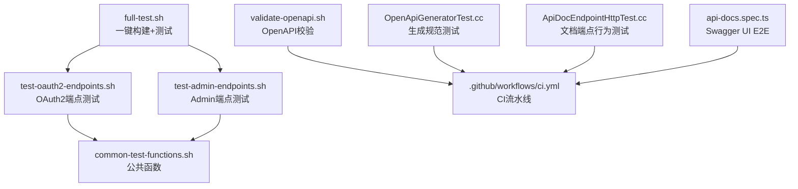
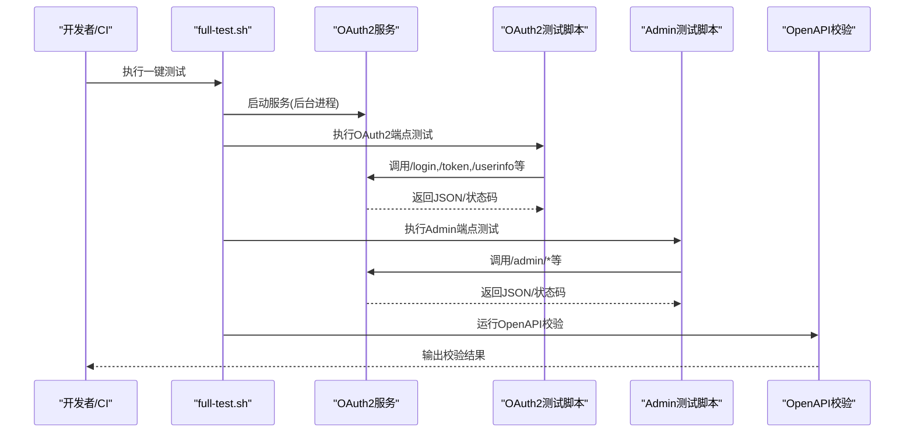
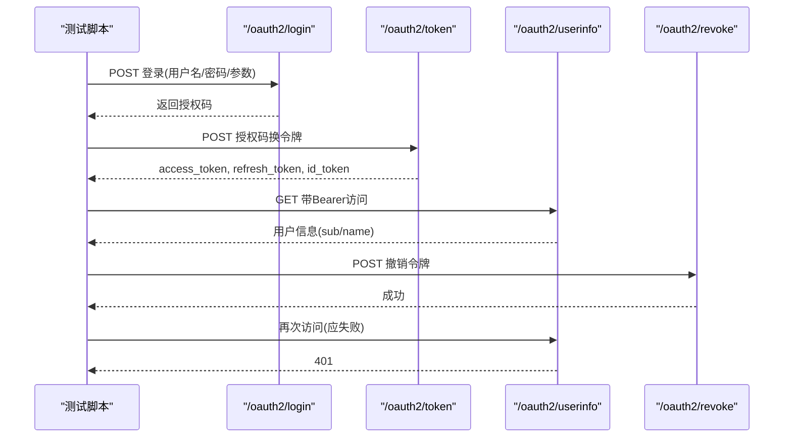
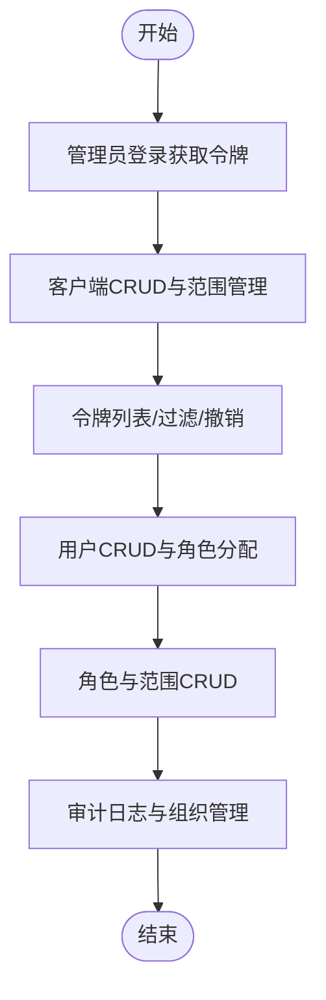
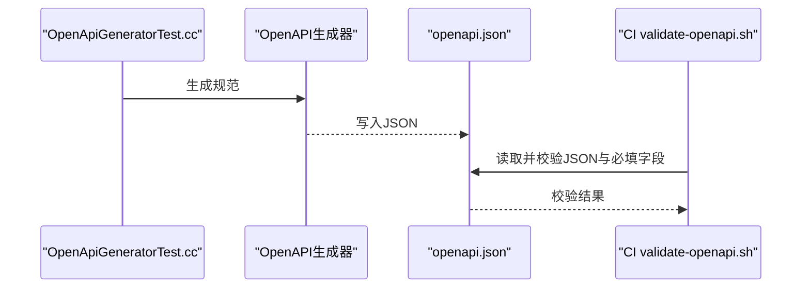
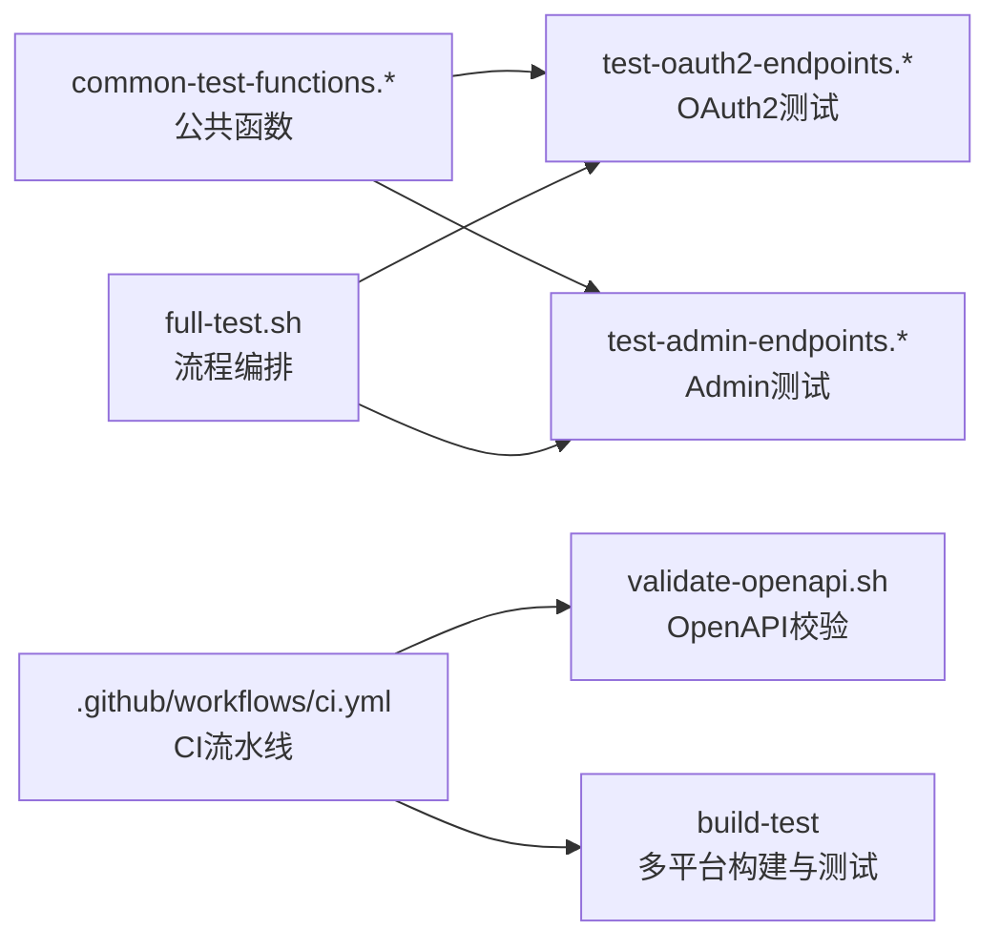

# API测试

<cite>
**本文引用的文件**
- [scripts/backend/test-oauth2-endpoints.sh](file://scripts/backend/test-oauth2-endpoints.sh)
- [scripts/backend/test-admin-endpoints.sh](file://scripts/backend/test-admin-endpoints.sh)
- [scripts/backend/full-test.sh](file://scripts/backend/full-test.sh)
- [scripts/backend/common-test-functions.sh](file://scripts/backend/common-test-functions.sh)
- [scripts/backend/test-oauth2-endpoints.ps1](file://scripts/backend/test-oauth2-endpoints.ps1)
- [scripts/backend/test-admin-endpoints.ps1](file://scripts/backend/test-admin-endpoints.ps1)
- [scripts/backend/common-test-functions.ps1](file://scripts/backend/common-test-functions.ps1)
- [scripts/backend/validate-openapi.sh](file://scripts/backend/validate-openapi.sh)
- [apps/server/docs/api/openapi.json](file://apps/server/docs/api/openapi.json)
- [docs/backend/testing-guide.md](file://docs/backend/testing-guide.md)
- [.github/workflows/ci.yml](file://.github/workflows/ci.yml)
- [tests/integration/controllers/ApiDocEndpointHttpTest.cc](file://tests/integration/controllers/ApiDocEndpointHttpTest.cc)
- [tests/common/OpenApiGeneratorTest.cc](file://tests/common/OpenApiGeneratorTest.cc)
- [tools/refactor-baseline/playwright/admin.txt](file://tools/refactor-baseline/playwright/admin.txt)
- [frontends/admin/tests/e2e/api-docs.spec.ts](file://frontends/admin/tests/e2e/api-docs.spec.ts)
</cite>

## 目录
1. [简介](#简介)
2. [项目结构](#项目结构)
3. [核心组件](#核心组件)
4. [架构总览](#架构总览)
5. [详细组件分析](#详细组件分析)
6. [依赖关系分析](#依赖关系分析)
7. [性能考虑](#性能考虑)
8. [故障排查指南](#故障排查指南)
9. [结论](#结论)
10. [附录](#附录)

## 简介
本文件面向AuthForge的API测试，聚焦以下目标：
- 使用脚本自动化OAuth2核心端点测试（授权码流程、客户端凭证流程、刷新令牌流程）。
- 覆盖Admin API的应用程序管理、用户管理、权限管理等接口。
- 说明PowerShell与Shell脚本的差异及适用场景。
- 提供OpenAPI规范的校验方法，并集成到持续集成。
- 包含认证测试、错误处理测试与性能测试建议。
- 给出测试数据准备与环境配置指南，以及CI中的执行与质量门禁配置。

## 项目结构
测试体系由“端到端HTTP脚本 + C++集成/单元测试 + CI流水线”组成：
- 端到端HTTP脚本：分别提供Linux/macOS（bash）和Windows（PowerShell）两套实现，覆盖OAuth2与Admin API。
- 通用函数库：封装数据库重置、Token获取、HTTP请求断言等能力。
- 全量流程编排：一键构建、启动服务、运行全部测试。
- OpenAPI校验：在CI中验证规范文件合法性与完整性。
- 前端E2E：通过Playwright对Swagger UI进行可用性验证。

**图表来源**
- [scripts/backend/full-test.sh:1-157](file://scripts/backend/full-test.sh#L1-L157)
- [scripts/backend/test-oauth2-endpoints.sh:1-796](file://scripts/backend/test-oauth2-endpoints.sh#L1-L796)
- [scripts/backend/test-admin-endpoints.sh:1-674](file://scripts/backend/test-admin-endpoints.sh#L1-L674)
- [scripts/backend/validate-openapi.sh:1-123](file://scripts/backend/validate-openapi.sh#L1-L123)
- [.github/workflows/ci.yml:1-151](file://.github/workflows/ci.yml#L1-L151)
- [tests/common/OpenApiGeneratorTest.cc:272-310](file://tests/common/OpenApiGeneratorTest.cc#L272-L310)
- [tests/integration/controllers/ApiDocEndpointHttpTest.cc:33-56](file://tests/integration/controllers/ApiDocEndpointHttpTest.cc#L33-L56)
- [frontends/admin/tests/e2e/api-docs.spec.ts:1-35](file://frontends/admin/tests/e2e/api-docs.spec.ts#L1-L35)

**章节来源**
- [scripts/backend/full-test.sh:1-157](file://scripts/backend/full-test.sh#L1-L157)
- [docs/backend/testing-guide.md:1-352](file://docs/backend/testing-guide.md#L1-L352)

## 核心组件
- OAuth2端点测试脚本（Shell/PowerShell）
  - 健康检查、OIDC发现、JWKS、登录换码、令牌交换、UserInfo、刷新令牌、客户端凭证、令牌反查、撤销、动态注册、MFA、WebAuthn、设备授权、社交登录错误路径等。
- Admin端点测试脚本（Shell/PowerShell）
  - 仪表盘统计、客户端CRUD与范围管理、令牌列表与批量撤销、用户CRUD与角色分配、角色与范围CRUD、组织管理、审计日志、未授权访问防护。
- 公共函数库
  - 数据库连接与查询、管理员账户重置、用户/管理员Token获取、HTTP请求封装与状态断言、测试结果汇总。
- 全量流程编排
  - 初始化数据库、生成ORM模型、构建、运行测试、启动服务、执行OAuth2与Admin API测试、停止服务。
- OpenAPI校验
  - 构建后运行测试、查找生成的openapi.json、JSON语法与必填字段校验。

**章节来源**
- [scripts/backend/test-oauth2-endpoints.sh:1-796](file://scripts/backend/test-oauth2-endpoints.sh#L1-L796)
- [scripts/backend/test-admin-endpoints.sh:1-674](file://scripts/backend/test-admin-endpoints.sh#L1-L674)
- [scripts/backend/common-test-functions.sh:1-228](file://scripts/backend/common-test-functions.sh#L1-L228)
- [scripts/backend/full-test.sh:1-157](file://scripts/backend/full-test.sh#L1-L157)
- [scripts/backend/validate-openapi.sh:1-123](file://scripts/backend/validate-openapi.sh#L1-L123)

## 架构总览
端到端测试的执行链路如下：
- 本地或CI触发full-test.sh，完成环境准备与服务启动。
- 依次执行OAuth2与Admin API测试脚本，调用服务端端点并断言响应。
- 通过validate-openapi.sh在CI中校验OpenAPI规范。
- 前端E2E用例验证Swagger UI可加载并可交互。

**图表来源**
- [scripts/backend/full-test.sh:51-135](file://scripts/backend/full-test.sh#L51-L135)
- [scripts/backend/test-oauth2-endpoints.sh:30-120](file://scripts/backend/test-oauth2-endpoints.sh#L30-L120)
- [scripts/backend/test-admin-endpoints.sh:31-80](file://scripts/backend/test-admin-endpoints.sh#L31-L80)
- [scripts/backend/validate-openapi.sh:42-112](file://scripts/backend/validate-openapi.sh#L42-L112)

## 详细组件分析

### OAuth2核心端点测试（授权码流程、客户端凭证流程、刷新令牌流程）
- 授权码流程
  - 通过/oauth2/login获取授权码，再用/oauth2/token以grant_type=authorization_code换取access_token、refresh_token与id_token。
  - 使用Bearer token访问/oauth2/userinfo，校验sub/name等字段。
- 刷新令牌流程
  - 使用refresh_token再次调用/oauth2/token，断言返回新的access_token与refresh_token（令牌旋转）。
  - 缺失client_secret时，应返回401与invalid_client错误。
- 客户端凭证流程
  - 使用grant_type=client_credentials直接换取access_token，且不应返回refresh_token。
- 其他关键端点
  - /.well-known/openid-configuration与/.well-known/jwks.json用于发现与公钥。
  - /oauth2/introspect按RFC 7662要求使用客户端凭据认证。
  - /oauth2/revoke按RFC 7009撤销令牌，随后用被撤销令牌访问userinfo应返回401。
  - 动态客户端注册、MFA、WebAuthn、设备授权、社交登录错误路径等均有覆盖。

**图表来源**
- [scripts/backend/test-oauth2-endpoints.sh:80-120](file://scripts/backend/test-oauth2-endpoints.sh#L80-L120)
- [scripts/backend/test-oauth2-endpoints.sh:131-165](file://scripts/backend/test-oauth2-endpoints.sh#L131-L165)
- [scripts/backend/test-oauth2-endpoints.sh:167-218](file://scripts/backend/test-oauth2-endpoints.sh#L167-L218)
- [scripts/backend/test-oauth2-endpoints.ps1:98-137](file://scripts/backend/test-oauth2-endpoints.ps1#L98-L137)
- [scripts/backend/test-oauth2-endpoints.ps1:166-210](file://scripts/backend/test-oauth2-endpoints.ps1#L166-L210)
- [scripts/backend/test-oauth2-endpoints.ps1:215-277](file://scripts/backend/test-oauth2-endpoints.ps1#L215-L277)

**章节来源**
- [scripts/backend/test-oauth2-endpoints.sh:30-218](file://scripts/backend/test-oauth2-endpoints.sh#L30-L218)
- [scripts/backend/test-oauth2-endpoints.ps1:49-277](file://scripts/backend/test-oauth2-endpoints.ps1#L49-L277)

### Admin API测试（应用程序管理、用户管理、权限管理）
- 应用程序管理
  - 列出、创建、更新、删除客户端；查看客户端详情与范围；重置客户端密钥；非存在资源返回404。
- 用户管理
  - 列出、详情、更新用户；禁用/启用用户；为用户分配角色；非存在用户返回404。
- 权限管理
  - 列出、创建、更新、删除角色与范围；内置角色/范围不可删除；重复创建返回409。
- 安全与审计
  - 未授权访问返回401/403；令牌列表与过滤；按客户端/用户撤销令牌；审计日志查询；组织管理。

**图表来源**
- [scripts/backend/test-admin-endpoints.sh:31-80](file://scripts/backend/test-admin-endpoints.sh#L31-L80)
- [scripts/backend/test-admin-endpoints.sh:82-243](file://scripts/backend/test-admin-endpoints.sh#L82-L243)
- [scripts/backend/test-admin-endpoints.sh:245-329](file://scripts/backend/test-admin-endpoints.sh#L245-L329)
- [scripts/backend/test-admin-endpoints.sh:330-533](file://scripts/backend/test-admin-endpoints.sh#L330-L533)
- [scripts/backend/test-admin-endpoints.sh:548-750](file://scripts/backend/test-admin-endpoints.sh#L548-L750)

**章节来源**
- [scripts/backend/test-admin-endpoints.sh:1-750](file://scripts/backend/test-admin-endpoints.sh#L1-L750)
- [scripts/backend/test-admin-endpoints.ps1:44-750](file://scripts/backend/test-admin-endpoints.ps1#L44-L750)

### PowerShell与Shell脚本的区别和使用场景
- 平台差异
  - Shell脚本适用于Linux/macOS，使用curl、jq、psql等工具链。
  - PowerShell脚本适用于Windows，使用Invoke-RestMethod、Invoke-WebRequest、psql（若安装）等。
- 功能等价性
  - 两者均覆盖相同的OAuth2与Admin API测试集，断言逻辑一致。
- 选择建议
  - 在Windows开发机优先使用PowerShell脚本；在Linux/macOS或CI中使用Shell脚本。
  - 若需跨平台统一入口，可通过manage脚本或CI矩阵同时执行两套。

**章节来源**
- [scripts/backend/test-oauth2-endpoints.sh:1-796](file://scripts/backend/test-oauth2-endpoints.sh#L1-L796)
- [scripts/backend/test-oauth2-endpoints.ps1:1-800](file://scripts/backend/test-oauth2-endpoints.ps1#L1-L800)
- [scripts/backend/test-admin-endpoints.sh:1-674](file://scripts/backend/test-admin-endpoints.sh#L1-L674)
- [scripts/backend/test-admin-endpoints.ps1:1-772](file://scripts/backend/test-admin-endpoints.ps1#L1-L772)

### OpenAPI规范的测试验证方法
- 运行时生成与静态文件
  - 服务提供/docs/api路由与/openapi.json端点；测试确保处理器不返回500，并在缺失静态文件时返回合理状态码。
- 规范内容校验
  - 通过OpenAPI生成器测试验证components/schemas（如Error）结构与字段完整性。
  - 通过validate-openapi.sh在CI中查找生成的openapi.json并进行JSON语法与必填字段校验。
- 前端E2E验证
  - Playwright用例验证Swagger UI页面加载与基本交互。

**图表来源**
- [tests/common/OpenApiGeneratorTest.cc:272-310](file://tests/common/OpenApiGeneratorTest.cc#L272-L310)
- [scripts/backend/validate-openapi.sh:60-112](file://scripts/backend/validate-openapi.sh#L60-L112)
- [tests/integration/controllers/ApiDocEndpointHttpTest.cc:33-56](file://tests/integration/controllers/ApiDocEndpointHttpTest.cc#L33-L56)
- [frontends/admin/tests/e2e/api-docs.spec.ts:1-35](file://frontends/admin/tests/e2e/api-docs.spec.ts#L1-L35)

**章节来源**
- [tests/common/OpenApiGeneratorTest.cc:272-310](file://tests/common/OpenApiGeneratorTest.cc#L272-L310)
- [scripts/backend/validate-openapi.sh:1-123](file://scripts/backend/validate-openapi.sh#L1-L123)
- [tests/integration/controllers/ApiDocEndpointHttpTest.cc:33-56](file://tests/integration/controllers/ApiDocEndpointHttpTest.cc#L33-L56)
- [frontends/admin/tests/e2e/api-docs.spec.ts:1-35](file://frontends/admin/tests/e2e/api-docs.spec.ts#L1-L35)

### 认证测试、错误处理测试与性能测试
- 认证测试
  - 未授权访问Admin端点应返回401/403；刷新令牌缺失client_secret返回401；令牌撤销后访问受限端点返回401。
- 错误处理测试
  - 无效授权码、无效MFA代码、无效邮箱验证令牌、空请求体等场景返回400/401/404；错误信封格式符合规范。
- 性能测试
  - 建议使用wrk对核心端点进行阶梯式加压，记录QPS、P50/P95/P99、错误率与稳态内存；预热缓存与数据库连接池；隔离driver与target；多档测量取中位数。

**章节来源**
- [scripts/backend/test-admin-endpoints.sh:482-503](file://scripts/backend/test-admin-endpoints.sh#L482-L503)
- [scripts/backend/test-oauth2-endpoints.sh:148-165](file://scripts/backend/test-oauth2-endpoints.sh#L148-L165)
- [scripts/backend/test-oauth2-endpoints.sh:726-750](file://scripts/backend/test-oauth2-endpoints.sh#L726-L750)
- [docs/productization-evolution/benchmark-facility-design.md:213-267](file://docs/productization-evolution/benchmark-facility-design.md#L213-L267)

## 依赖关系分析
- 测试脚本依赖
  - 公共函数库提供数据库操作、Token获取、HTTP断言等能力。
  - full-test.sh串联构建、测试、服务生命周期管理。
- CI依赖
  - static-checks阶段校验OpenAPI规范与架构分层。
  - build-test阶段在多平台矩阵执行构建与测试。
  - SDK smoke阶段进行端到端冒烟。

**图表来源**
- [scripts/backend/common-test-functions.sh:1-228](file://scripts/backend/common-test-functions.sh#L1-L228)
- [scripts/backend/full-test.sh:1-157](file://scripts/backend/full-test.sh#L1-L157)
- [.github/workflows/ci.yml:1-151](file://.github/workflows/ci.yml#L1-L151)
- [scripts/backend/validate-openapi.sh:1-123](file://scripts/backend/validate-openapi.sh#L1-L123)

**章节来源**
- [scripts/backend/common-test-functions.sh:1-228](file://scripts/backend/common-test-functions.sh#L1-L228)
- [scripts/backend/full-test.sh:1-157](file://scripts/backend/full-test.sh#L1-L157)
- [.github/workflows/ci.yml:1-151](file://.github/workflows/ci.yml#L1-L151)

## 性能考虑
- 压测工具与指标
  - 使用wrk进行并发压力测试，关注QPS、延迟分位、错误率与内存占用。
  - 每档前warmup，避免冷启动影响；多次运行取中位数降低抖动。
- 环境与隔离
  - target与driver物理隔离；记录环境元数据（Git SHA、镜像版本、PG/Redis版本、规格）。
- 风险与缓解
  - 防止账户锁定（预seed独立用户）、防止刷新令牌家族作废（每VU独立RT）、避免introspect快路径导致虚高。

**章节来源**
- [docs/productization-evolution/benchmark-facility-design.md:213-267](file://docs/productization-evolution/benchmark-facility-design.md#L213-L267)
- [docs/productization-evolution/benchmark-facility-design.md:383-397](file://docs/productization-evolution/benchmark-facility-design.md#L383-L397)

## 故障排查指南
- 常见问题
  - 服务器无法启动：检查端口占用与配置文件路径。
  - 登录失败：确认用户名密码与redirect_uri匹配。
  - Token交换失败：检查授权码有效期与客户端凭据。
  - 脚本执行策略限制：Windows需使用ExecutionPolicy Bypass。
- 调试技巧
  - 临时提升日志级别至DEBUG/TRACE；实时查看日志文件。
  - 使用公共函数重置管理员账户与锁状态，确保测试环境稳定。

**章节来源**
- [docs/backend/testing-guide.md:302-352](file://docs/backend/testing-guide.md#L302-L352)
- [scripts/backend/common-test-functions.sh:150-161](file://scripts/backend/common-test-functions.sh#L150-L161)
- [scripts/backend/common-test-functions.ps1:28-72](file://scripts/backend/common-test-functions.ps1#L28-L72)

## 结论
AuthForge的API测试体系通过跨平台的OAuth2与Admin端点脚本、统一的公共函数库、完整的全量流程编排与CI质量门禁，提供了从功能到安全的全面覆盖。结合OpenAPI校验与前端E2E，确保了接口契约与用户体验的一致性。建议在CI中持续运行这些测试，并结合性能基准设施对核心端点进行容量与稳定性验证。

## 附录
- 环境配置与数据准备
  - 前置服务：PostgreSQL与Redis需启动并配置一致密码。
  - 数据库初始化：通过setup-database.sh或自动迁移初始化Schema。
  - ORM模型生成：generate-models.sh确保模型与Schema同步。
- CI执行与质量门禁
  - static-checks：架构分层、迁移规范、SDK表面、命名约定、OpenAPI校验。
  - build-test：多平台矩阵构建与测试，收集日志与产物。
  - sdk-smoke：全栈冒烟验证。

**章节来源**
- [docs/backend/testing-guide.md:7-46](file://docs/backend/testing-guide.md#L7-L46)
- [scripts/backend/full-test.sh:51-80](file://scripts/backend/full-test.sh#L51-L80)
- [.github/workflows/ci.yml:32-72](file://.github/workflows/ci.yml#L32-L72)
- [.github/workflows/ci.yml:77-151](file://.github/workflows/ci.yml#L77-L151)