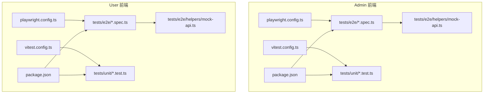
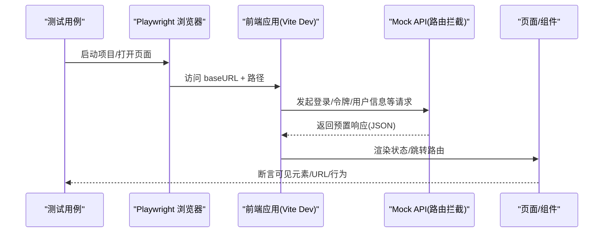
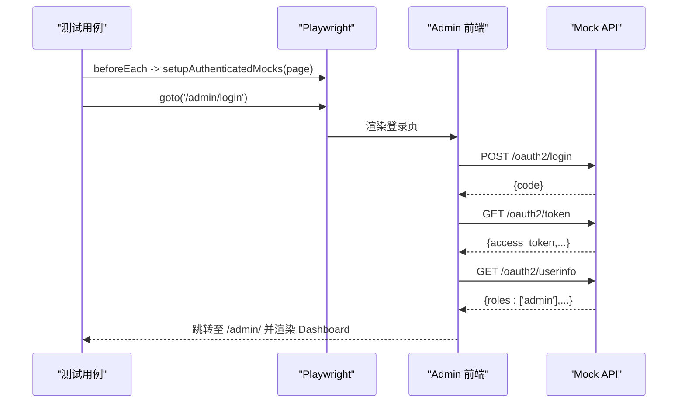
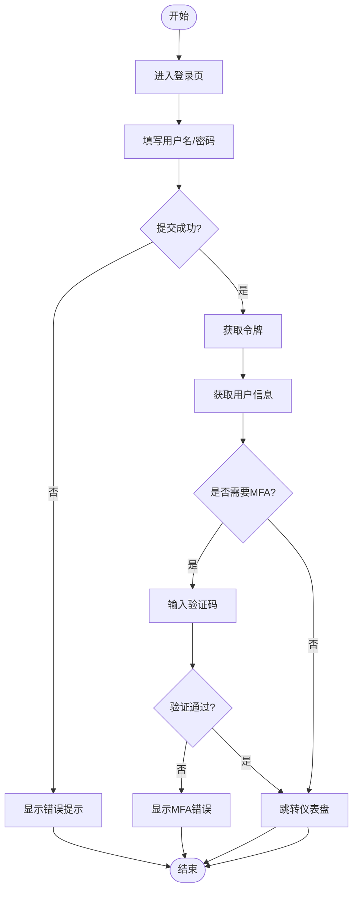
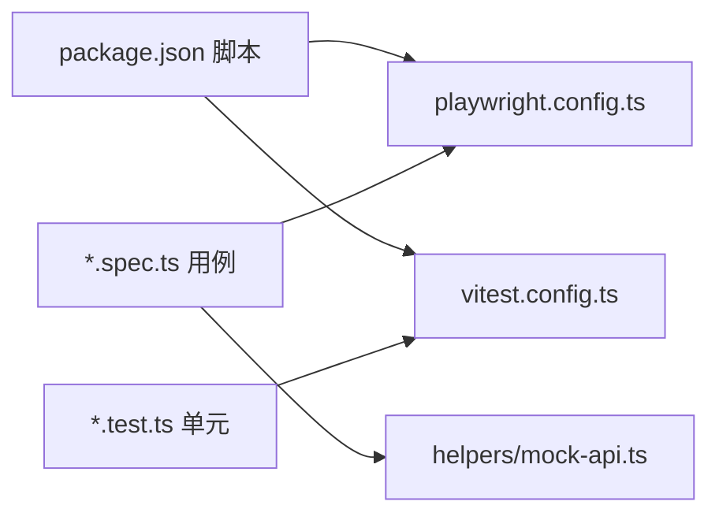

# 前端测试

<cite>
**本文引用的文件**
- [frontends/admin/playwright.config.ts](file://frontends/admin/playwright.config.ts)
- [frontends/user/playwright.config.ts](file://frontends/user/playwright.config.ts)
- [frontends/admin/vitest.config.ts](file://frontends/admin/vitest.config.ts)
- [frontends/user/vitest.config.ts](file://frontends/user/vitest.config.ts)
- [frontends/admin/package.json](file://frontends/admin/package.json)
- [frontends/user/package.json](file://frontends/user/package.json)
- [frontends/admin/tests/e2e/auth.spec.ts](file://frontends/admin/tests/e2e/auth.spec.ts)
- [frontends/user/tests/e2e/auth.spec.ts](file://frontends/user/tests/e2e/auth.spec.ts)
- [frontends/admin/tests/e2e/dashboard.spec.ts](file://frontends/admin/tests/e2e/dashboard.spec.ts)
- [frontends/user/tests/e2e/account.spec.ts](file://frontends/user/tests/e2e/account.spec.ts)
- [frontends/admin/tests/e2e/helpers/mock-api.ts](file://frontends/admin/tests/e2e/helpers/mock-api.ts)
- [frontends/user/tests/e2e/helpers/mock-api.ts](file://frontends/user/tests/e2e/helpers/mock-api.ts)
- [frontends/admin/tests/unit/smoke.test.ts](file://frontends/admin/tests/unit/smoke.test.ts)
- [frontends/user/tests/unit/smoke.test.ts](file://frontends/user/tests/unit/smoke.test.ts)
</cite>

## 目录
1. [简介](#简介)
2. [项目结构](#项目结构)
3. [核心组件](#核心组件)
4. [架构总览](#架构总览)
5. [详细组件分析](#详细组件分析)
6. [依赖关系分析](#依赖关系分析)
7. [性能考虑](#性能考虑)
8. [故障排查指南](#故障排查指南)
9. [结论](#结论)
10. [附录](#附录)

## 简介
本文件为 AuthForge 前端测试的全面文档，覆盖管理控制台（admin）与用户界面（user）两个前端应用的端到端（E2E）与单元测试。内容包含：
- Playwright E2E 框架配置与使用：浏览器自动化、页面交互、截图/追踪、跨浏览器与移动端扩展方法
- Vitest 单元测试框架：组件/服务层/工具函数测试策略与执行方式
- 测试数据管理与 Mock 策略：基于路由拦截的无后端稳定测试
- 管理控制台与用户界面的用例设计要点
- 测试执行命令与报告生成
- 跨浏览器兼容性测试与移动端测试配置建议
- 调试技巧与常见问题解决方案

## 项目结构
两个前端应用各自拥有独立的测试目录与配置：
- admin（管理控制台）
  - E2E：tests/e2e（含 auth、dashboard、导航、安全等场景）
  - 单元：tests/unit（smoke 测试验证 Vitest + fast-check 基础设施）
  - 配置：playwright.config.ts、vitest.config.ts、package.json
- user（用户界面）
  - E2E：tests/e2e（登录、注册、密码重置、MFA、账户与安全、授权应用等）
  - 单元：tests/unit（smoke 测试）
  - 配置：playwright.config.ts、vitest.config.ts、package.json

图表来源
- [frontends/admin/playwright.config.ts:1-27](file://frontends/admin/playwright.config.ts#L1-L27)
- [frontends/user/playwright.config.ts:1-24](file://frontends/user/playwright.config.ts#L1-L24)
- [frontends/admin/vitest.config.ts:1-18](file://frontends/admin/vitest.config.ts#L1-L18)
- [frontends/user/vitest.config.ts:1-24](file://frontends/user/vitest.config.ts#L1-L24)
- [frontends/admin/package.json:1-35](file://frontends/admin/package.json#L1-L35)
- [frontends/user/package.json:1-33](file://frontends/user/package.json#L1-L33)

章节来源
- [frontends/admin/playwright.config.ts:1-27](file://frontends/admin/playwright.config.ts#L1-L27)
- [frontends/user/playwright.config.ts:1-24](file://frontends/user/playwright.config.ts#L1-L24)
- [frontends/admin/vitest.config.ts:1-18](file://frontends/admin/vitest.config.ts#L1-L18)
- [frontends/user/vitest.config.ts:1-24](file://frontends/user/vitest.config.ts#L1-L24)
- [frontends/admin/package.json:1-35](file://frontends/admin/package.json#L1-L35)
- [frontends/user/package.json:1-33](file://frontends/user/package.json#L1-L33)

## 核心组件
- Playwright 配置
  - 统一启用并行执行、重试、HTML 报告、追踪（首次重试时）
  - webServer 自动启动 Vite dev 服务器并等待就绪
  - base URL 分别指向 admin(5174) 与 user(5173)
- Vitest 配置
  - 使用 node 环境运行纯函数/属性测试，避免 jsdom 开销
  - 通过 include/exclude 将 e2e 与 unit 隔离，避免冲突
  - 支持 Vue 插件以在需要时渲染组件上下文
- 脚本命令
  - test:e2e / test:e2e:ui / test:e2e:headed / test:unit

章节来源
- [frontends/admin/playwright.config.ts:1-27](file://frontends/admin/playwright.config.ts#L1-L27)
- [frontends/user/playwright.config.ts:1-24](file://frontends/user/playwright.config.ts#L1-L24)
- [frontends/admin/vitest.config.ts:1-18](file://frontends/admin/vitest.config.ts#L1-L18)
- [frontends/user/vitest.config.ts:1-24](file://frontends/user/vitest.config.ts#L1-L24)
- [frontends/admin/package.json:1-35](file://frontends/admin/package.json#L1-L35)
- [frontends/user/package.json:1-33](file://frontends/user/package.json#L1-L33)

## 架构总览
Playwright E2E 测试通过拦截网络请求，构造稳定的“虚拟后端”，在不启动真实 OAuth2 服务的情况下完成认证、鉴权、业务流验证；Vitest 负责单元与属性测试，保障工具函数与错误适配器的正确性。

图表来源
- [frontends/admin/playwright.config.ts:1-27](file://frontends/admin/playwright.config.ts#L1-L27)
- [frontends/user/playwright.config.ts:1-24](file://frontends/user/playwright.config.ts#L1-L24)
- [frontends/admin/tests/e2e/helpers/mock-api.ts:1-497](file://frontends/admin/tests/e2e/helpers/mock-api.ts#L1-L497)
- [frontends/user/tests/e2e/helpers/mock-api.ts:1-200](file://frontends/user/tests/e2e/helpers/mock-api.ts#L1-L200)

## 详细组件分析

### Playwright E2E 配置与执行
- 并行与重试：CI 环境下限制 worker 数并启用重试，提升稳定性
- 追踪与报告：首次重试开启 trace，默认 HTML reporter 便于定位问题
- Web Server：自动启动 Vite dev 并等待指定 URL 就绪，避免手动管理进程
- 多浏览器/移动端：当前仅声明 Chromium 桌面设备，可通过 projects 扩展至 Firefox/WebKit 与移动设备

章节来源
- [frontends/admin/playwright.config.ts:1-27](file://frontends/admin/playwright.config.ts#L1-L27)
- [frontends/user/playwright.config.ts:1-24](file://frontends/user/playwright.config.ts#L1-L24)

### 管理控制台（Admin）E2E 用例设计
- 认证流程
  - 未登录重定向到登录页
  - 登录表单元素校验（用户名/密码/提交按钮）
  - 成功登录后跳转到仪表盘
  - 失败时展示错误提示（统一错误信封映射为本地化消息）
  - 非管理员角色拒绝访问
  - MFA 需求时的停留与后续处理
  - 空字段的前端校验
  - 登录加载态（按钮禁用与文案变化）
- 仪表盘
  - 统计卡片数值来自 mock 数据
  - 系统健康状态、数据库/Redis 连接状态
  - 快捷操作链接与跳转
  - 后端异常时显示友好错误横幅（不暴露原始后端消息）

图表来源
- [frontends/admin/tests/e2e/auth.spec.ts:1-157](file://frontends/admin/tests/e2e/auth.spec.ts#L1-L157)
- [frontends/admin/tests/e2e/helpers/mock-api.ts:120-163](file://frontends/admin/tests/e2e/helpers/mock-api.ts#L120-L163)
- [frontends/admin/tests/e2e/dashboard.spec.ts:1-101](file://frontends/admin/tests/e2e/dashboard.spec.ts#L1-L101)

章节来源
- [frontends/admin/tests/e2e/auth.spec.ts:1-157](file://frontends/admin/tests/e2e/auth.spec.ts#L1-L157)
- [frontends/admin/tests/e2e/dashboard.spec.ts:1-101](file://frontends/admin/tests/e2e/dashboard.spec.ts#L1-L101)
- [frontends/admin/tests/e2e/helpers/mock-api.ts:1-497](file://frontends/admin/tests/e2e/helpers/mock-api.ts#L1-L497)

### 用户界面（User）E2E 用例设计
- 登录
  - 表单可见性与基本交互
  - 成功登录跳转
  - 无效凭据的错误提示
  - MFA 挑战与验证流程
- 注册/忘记密码/邮箱验证
  - 注册成功与自动跳转
  - 忘记密码提交成功提示
  - 邮箱验证 token 有效/缺失分支
- GitHub 第三方登录入口
- 账户与安全
  - 个人资料页信息、邮箱验证状态、重发验证邮件
  - 修改密码（匹配/长度/旧密码错误）
  - MFA 设置与验证
  - 删除账户（危险区）
  - WebAuthn/Passkeys 支持检测
- 已授权应用
  - 列表展示、撤销授权、空列表、撤销失败、成功消息自动消失

图表来源
- [frontends/user/tests/e2e/auth.spec.ts:1-246](file://frontends/user/tests/e2e/auth.spec.ts#L1-L246)
- [frontends/user/tests/e2e/helpers/mock-api.ts:23-121](file://frontends/user/tests/e2e/helpers/mock-api.ts#L23-L121)
- [frontends/user/tests/e2e/account.spec.ts:1-347](file://frontends/user/tests/e2e/account.spec.ts#L1-L347)

章节来源
- [frontends/user/tests/e2e/auth.spec.ts:1-246](file://frontends/user/tests/e2e/auth.spec.ts#L1-L246)
- [frontends/user/tests/e2e/account.spec.ts:1-347](file://frontends/user/tests/e2e/account.spec.ts#L1-L347)
- [frontends/user/tests/e2e/helpers/mock-api.ts:1-200](file://frontends/user/tests/e2e/helpers/mock-api.ts#L1-L200)

### 单元测试（Vitest）
- 目标：验证纯函数、错误适配器、消息目录等
- 环境：node 环境，轻量快速
- 范围：src/**/*.{test,spec}.ts 与 tests/unit/**/*.{test,spec}.ts
- 排除：node_modules、dist、tests/e2e
- 示例：smoke 测试确认 Vitest + fast-check 基础设施可用

章节来源
- [frontends/admin/vitest.config.ts:1-18](file://frontends/admin/vitest.config.ts#L1-L18)
- [frontends/user/vitest.config.ts:1-24](file://frontends/user/vitest.config.ts#L1-L24)
- [frontends/admin/tests/unit/smoke.test.ts:1-20](file://frontends/admin/tests/unit/smoke.test.ts#L1-L20)
- [frontends/user/tests/unit/smoke.test.ts:1-20](file://frontends/user/tests/unit/smoke.test.ts#L1-L20)

### 测试数据管理与 Mock 策略
- 集中式 Mock 数据：用户、客户端、角色、作用域、日志、令牌、仪表盘统计、OIDC 密钥等
- 路由拦截：通过 page.route 对关键接口进行精确或通配拦截，按 HTTP 方法返回不同响应
- 错误模拟：提供 mockApiError、mockNetworkError 等工具，统一注入错误信封或网络失败
- 登录辅助：loginAsAdmin、loginViaForm、loginUser 等封装常用登录流程
- 覆盖范围：admin 与 user 两套 helpers 分别对应各自 API 边界

章节来源
- [frontends/admin/tests/e2e/helpers/mock-api.ts:1-497](file://frontends/admin/tests/e2e/helpers/mock-api.ts#L1-L497)
- [frontends/user/tests/e2e/helpers/mock-api.ts:1-200](file://frontends/user/tests/e2e/helpers/mock-api.ts#L1-L200)

### 截图对比与视觉回归
- 当前配置未显式启用截图/视频录制；可结合 Playwright 的 screenshot/video 选项在失败时捕获
- 建议在 CI 中开启 on-first-failure 的截图/视频，配合 HTML 报告与 Trace 进行视觉回归定位
- 如需像素级对比，可在断言前调用截图并与基线比对

[本节为通用实践说明，不直接引用具体文件]

## 依赖关系分析
- 测试与配置
  - Playwright 测试依赖 playwright.config.ts 中的 webServer、baseURL、projects、reporter、trace 等
  - Vitest 测试依赖 vitest.config.ts 的 environment、include/exclude、plugins
- 测试与实现
  - E2E 用例依赖 helpers/mock-api.ts 提供的路由拦截与数据
  - 用例通过 Page 对象与前端页面交互，断言 DOM/URL/行为
- 包脚本
  - package.json 暴露 test:e2e、test:e2e:ui、test:e2e:headed、test:unit 等便捷命令

图表来源
- [frontends/admin/package.json:1-35](file://frontends/admin/package.json#L1-L35)
- [frontends/user/package.json:1-33](file://frontends/user/package.json#L1-L33)
- [frontends/admin/playwright.config.ts:1-27](file://frontends/admin/playwright.config.ts#L1-L27)
- [frontends/user/playwright.config.ts:1-24](file://frontends/user/playwright.config.ts#L1-L24)
- [frontends/admin/vitest.config.ts:1-18](file://frontends/admin/vitest.config.ts#L1-L18)
- [frontends/user/vitest.config.ts:1-24](file://frontends/user/vitest.config.ts#L1-L24)
- [frontends/admin/tests/e2e/helpers/mock-api.ts:1-497](file://frontends/admin/tests/e2e/helpers/mock-api.ts#L1-L497)
- [frontends/user/tests/e2e/helpers/mock-api.ts:1-200](file://frontends/user/tests/e2e/helpers/mock-api.ts#L1-L200)

章节来源
- [frontends/admin/package.json:1-35](file://frontends/admin/package.json#L1-L35)
- [frontends/user/package.json:1-33](file://frontends/user/package.json#L1-L33)
- [frontends/admin/playwright.config.ts:1-27](file://frontends/admin/playwright.config.ts#L1-L27)
- [frontends/user/playwright.config.ts:1-24](file://frontends/user/playwright.config.ts#L1-L24)
- [frontends/admin/vitest.config.ts:1-18](file://frontends/admin/vitest.config.ts#L1-L18)
- [frontends/user/vitest.config.ts:1-24](file://frontends/user/vitest.config.ts#L1-L24)

## 性能考虑
- 并行执行：fullyParallel=true 加速用例执行；CI 下限制 workers 提高稳定性
- 轻量单元环境：Vitest 使用 node 环境，避免 jsdom 开销
- 最小化网络：通过路由拦截减少外部依赖，缩短用例执行时间
- 追踪与报告：仅在首次重试开启 trace，降低常规运行开销

[本节为通用实践说明，不直接引用具体文件]

## 故障排查指南
- 常见症状与对策
  - 页面未就绪：检查 webServer 的 url 与 timeout，确保 Vite dev 服务端口一致
  - 路由拦截未生效：确认 page.route 的模式与顺序，必要时使用更具体的模式覆盖通配符
  - 登录失败：检查 /oauth2/login、/oauth2/token、/oauth2/userinfo 的 mock 是否返回预期结构
  - 错误未展示：确认前端对统一错误信封的映射逻辑，断言本地化消息而非原始后端消息
  - 并发干扰：CI 下限制 workers，必要时增加重试次数
- 调试技巧
  - headed 模式：使用 test:e2e:headed 可视化观察
  - UI 模式：使用 test:e2e:ui 交互式调试
  - 追踪：利用 on-first-retry 的 trace 回放
  - 截图/视频：在失败时捕获，便于视觉回归定位
  - 断点：在测试中使用 await page.pause() 或 UI 模式逐步执行

章节来源
- [frontends/admin/playwright.config.ts:1-27](file://frontends/admin/playwright.config.ts#L1-L27)
- [frontends/user/playwright.config.ts:1-24](file://frontends/user/playwright.config.ts#L1-L24)
- [frontends/admin/package.json:1-35](file://frontends/admin/package.json#L1-L35)
- [frontends/user/package.json:1-33](file://frontends/user/package.json#L1-L33)

## 结论
本项目通过 Playwright 与 Vitest 构建了完整的前端测试体系：
- E2E 通过路由拦截实现无后端稳定测试，覆盖认证、鉴权、业务主流程与异常分支
- 单元与属性测试保障工具函数与错误适配器的正确性
- 配置简洁清晰，易于扩展到多浏览器与移动端
- 借助 HTML 报告、追踪与 headed/UI 模式，调试与回归效率显著提升

[本节为总结性内容，不直接引用具体文件]

## 附录

### 测试执行命令
- Admin
  - 运行 E2E：npm run test:e2e
  - 打开 E2E UI：npm run test:e2e:ui
  - 有头模式运行：npm run test:e2e:headed
  - 运行单元：npm run test:unit
- User
  - 运行 E2E：npm run test:e2e
  - 打开 E2E UI：npm run test:e2e:ui
  - 有头模式运行：npm run test:e2e:headed
  - 运行单元：npm run test:unit

章节来源
- [frontends/admin/package.json:1-35](file://frontends/admin/package.json#L1-L35)
- [frontends/user/package.json:1-33](file://frontends/user/package.json#L1-L33)

### 跨浏览器与移动端测试配置建议
- 当前仅配置 Chromium 桌面设备
- 可扩展 projects 添加 Firefox、WebKit 与移动设备（如 Mobile Chrome/iOS Safari）
- 在 CI 中按平台矩阵执行，确保关键流程在多引擎下稳定

[本节为通用实践说明，不直接引用具体文件]

### 报告生成
- 默认 HTML 报告：playwright 会生成 HTML 报告，便于查看用例结果与详情
- 追踪：on-first-retry 自动记录 trace，便于失败回放
- 截图/视频：可在失败时启用，辅助视觉回归与问题定位

章节来源
- [frontends/admin/playwright.config.ts:1-27](file://frontends/admin/playwright.config.ts#L1-L27)
- [frontends/user/playwright.config.ts:1-24](file://frontends/user/playwright.config.ts#L1-L24)