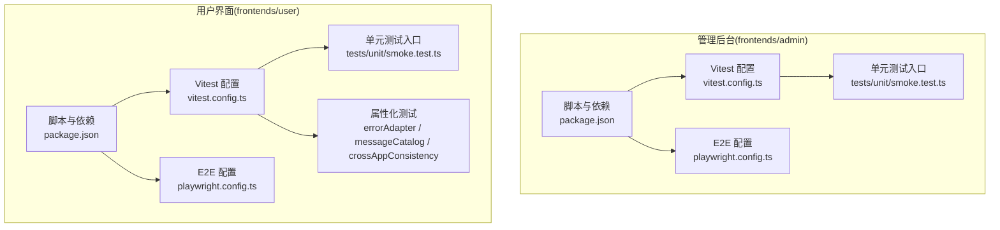
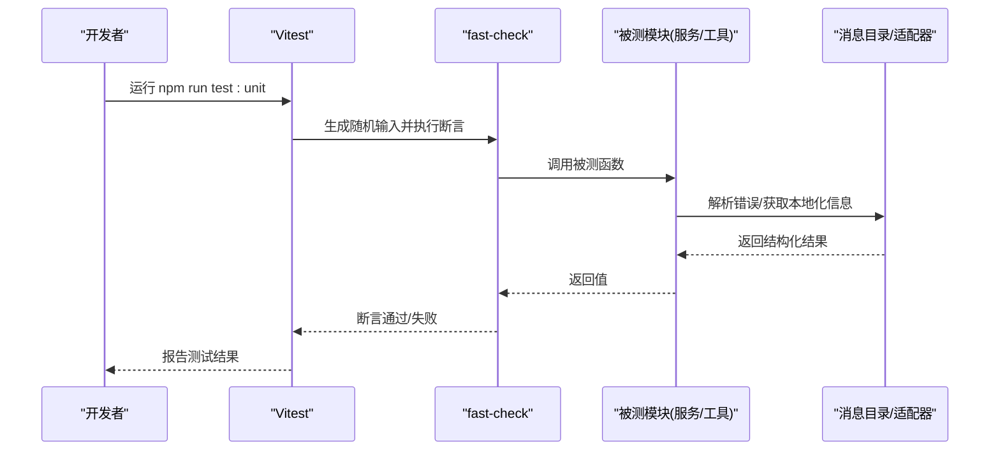
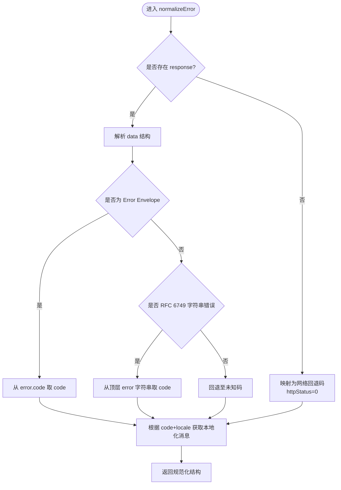
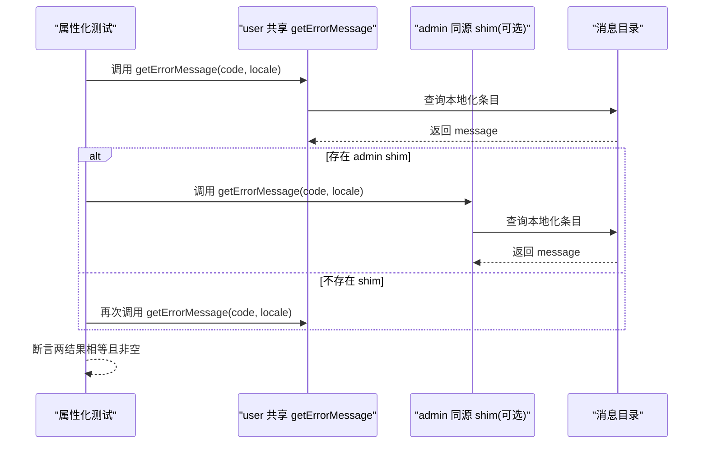
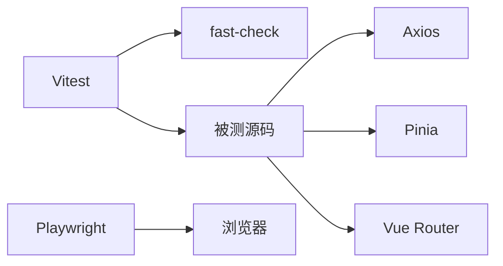

# 单元测试

<cite>
**本文引用的文件**
- [frontends/admin/vitest.config.ts](file://frontends/admin/vitest.config.ts)
- [frontends/user/vitest.config.ts](file://frontends/user/vitest.config.ts)
- [frontends/admin/package.json](file://frontends/admin/package.json)
- [frontends/user/package.json](file://frontends/user/package.json)
- [frontends/admin/tests/unit/smoke.test.ts](file://frontends/admin/tests/unit/smoke.test.ts)
- [frontends/user/tests/unit/smoke.test.ts](file://frontends/user/tests/unit/smoke.test.ts)
- [frontends/user/src/services/errorAdapter.property.test.ts](file://frontends/user/src/services/errorAdapter.property.test.ts)
- [frontends/user/src/services/messageCatalog.property.test.ts](file://frontends/user/src/services/messageCatalog.property.test.ts)
- [frontends/user/src/services/crossAppConsistency.property.test.ts](file://frontends/user/src/services/crossAppConsistency.property.test.ts)
- [frontends/admin/playwright.config.ts](file://frontends/admin/playwright.config.ts)
- [frontends/user/playwright.config.ts](file://frontends/user/playwright.config.ts)
</cite>

## 目录
1. [简介](#简介)
2. [项目结构](#项目结构)
3. [核心组件](#核心组件)
4. [架构总览](#架构总览)
5. [详细组件分析](#详细组件分析)
6. [依赖关系分析](#依赖关系分析)
7. [性能与可维护性](#性能与可维护性)
8. [故障排查指南](#故障排查指南)
9. [结论](#结论)
10. [附录](#附录)

## 简介
本文件面向前端测试，聚焦于 Vitest 在管理控制台（admin）与用户界面（user）两个应用中的配置与实践。文档覆盖：
- 组件测试、服务层测试与工具函数测试的最佳实践
- Vue 组件渲染、事件处理、状态管理的单测策略
- Mock 策略：API 接口、第三方库、服务依赖
- 覆盖率收集与分析、质量评估
- 编写规范、命名约定与文件组织
- 异步测试、错误处理与边界条件技巧
- 属性化测试（fast-check）在前端纯函数与跨应用一致性上的应用

## 项目结构
两个前端应用各自拥有独立的测试基础设施：
- 单元测试：Vitest + fast-check，运行在 node 环境，专注纯函数与服务层逻辑
- 端到端测试：Playwright，启动本地开发服务器进行浏览器级验证
- 测试目录：tests/e2e 与 tests/unit；同时支持 src 下的 .test.ts/.spec.ts 就近测试

图表来源
- [frontends/admin/vitest.config.ts:1-18](file://frontends/admin/vitest.config.ts#L1-L18)
- [frontends/user/vitest.config.ts:1-24](file://frontends/user/vitest.config.ts#L1-L24)
- [frontends/admin/package.json:1-35](file://frontends/admin/package.json#L1-L35)
- [frontends/user/package.json:1-33](file://frontends/user/package.json#L1-L33)
- [frontends/admin/tests/unit/smoke.test.ts:1-20](file://frontends/admin/tests/unit/smoke.test.ts#L1-L20)
- [frontends/user/tests/unit/smoke.test.ts:1-20](file://frontends/user/tests/unit/smoke.test.ts#L1-L20)
- [frontends/user/src/services/errorAdapter.property.test.ts:1-329](file://frontends/user/src/services/errorAdapter.property.test.ts#L1-L329)
- [frontends/user/src/services/messageCatalog.property.test.ts:1-213](file://frontends/user/src/services/messageCatalog.property.test.ts#L1-L213)
- [frontends/user/src/services/crossAppConsistency.property.test.ts:1-171](file://frontends/user/src/services/crossAppConsistency.property.test.ts#L1-L171)
- [frontends/admin/playwright.config.ts:1-27](file://frontends/admin/playwright.config.ts#L1-L27)
- [frontends/user/playwright.config.ts:1-24](file://frontends/user/playwright.config.ts#L1-L24)

章节来源
- [frontends/admin/vitest.config.ts:1-18](file://frontends/admin/vitest.config.ts#L1-L18)
- [frontends/user/vitest.config.ts:1-24](file://frontends/user/vitest.config.ts#L1-L24)
- [frontends/admin/package.json:1-35](file://frontends/admin/package.json#L1-L35)
- [frontends/user/package.json:1-33](file://frontends/user/package.json#L1-L33)

## 核心组件
- Vitest 配置
  - 启用全局 API（describe/it/expect），使用轻量 node 环境，避免 jsdom 依赖
  - 包含规则：src 与 tests/unit 下 .test.ts/.spec.ts
  - 排除：node_modules、dist、tests/e2e（避免与 Playwright 冲突）
  - user 应用额外配置了 @ 路径别名，便于 import 源码
- 包脚本与依赖
  - test:unit 统一通过 vitest run 执行
  - 引入 fast-check 用于属性化测试，提升对输入域的覆盖
- 示例测试
  - smoke 测试确认 Vitest + fast-check 基础能力可用
  - 属性化测试覆盖错误规范化、消息目录与跨应用一致性等关键不变量

章节来源
- [frontends/admin/vitest.config.ts:1-18](file://frontends/admin/vitest.config.ts#L1-L18)
- [frontends/user/vitest.config.ts:1-24](file://frontends/user/vitest.config.ts#L1-L24)
- [frontends/admin/package.json:1-35](file://frontends/admin/package.json#L1-L35)
- [frontends/user/package.json:1-33](file://frontends/user/package.json#L1-L33)
- [frontends/admin/tests/unit/smoke.test.ts:1-20](file://frontends/admin/tests/unit/smoke.test.ts#L1-L20)
- [frontends/user/tests/unit/smoke.test.ts:1-20](file://frontends/user/tests/unit/smoke.test.ts#L1-L20)

## 架构总览
前端测试采用分层策略：
- 单元层：Vitest + fast-check，针对纯函数、适配器、消息目录等进行快速、确定性验证
- E2E 层：Playwright，驱动浏览器验证页面流程、导航、交互与错误提示
- 属性化测试：以“不变量”为中心，覆盖任意输入域，确保健壮性与一致性

图表来源
- [frontends/user/src/services/errorAdapter.property.test.ts:1-329](file://frontends/user/src/services/errorAdapter.property.test.ts#L1-L329)
- [frontends/user/src/services/messageCatalog.property.test.ts:1-213](file://frontends/user/src/services/messageCatalog.property.test.ts#L1-L213)
- [frontends/user/src/services/crossAppConsistency.property.test.ts:1-171](file://frontends/user/src/services/crossAppConsistency.property.test.ts#L1-L171)

## 详细组件分析

### 组件A：错误规范化与本地化（errorAdapter + messages）
- 目标：对任意输入（含畸形响应、网络错误、无响应）保证不抛异常，输出稳定结构
- 关键不变量
  - code 为字符串，message 为非空字符串，httpStatus 为数字，request_id 为字符串
  - 无 HTTP 响应时映射到网络回退码且 httpStatus=0
  - Error Envelope 或 RFC 6749 字符串错误体均能正确提取 code 与 request_id
  - 本地化映射在 zh-CN 下对所有已知码与非注册 locale 均返回非空信息
- 测试方法
  - 使用 fast-check 生成任意输入，断言字段类型与业务约束
  - 覆盖网络错误、缺失 response、data 非对象、error 为字符串等多种分支
  - 校验消息目录覆盖性与清洁性（无未替换占位符、无内部细节泄露）

图表来源
- [frontends/user/src/services/errorAdapter.property.test.ts:1-329](file://frontends/user/src/services/errorAdapter.property.test.ts#L1-L329)
- [frontends/user/src/services/messageCatalog.property.test.ts:1-213](file://frontends/user/src/services/messageCatalog.property.test.ts#L1-L213)

章节来源
- [frontends/user/src/services/errorAdapter.property.test.ts:1-329](file://frontends/user/src/services/errorAdapter.property.test.ts#L1-L329)
- [frontends/user/src/services/messageCatalog.property.test.ts:1-213](file://frontends/user/src/services/messageCatalog.property.test.ts#L1-L213)

### 组件B：跨应用一致性（admin 与 user 共享来源）
- 目标：在相同语言条件下，两应用经共享 errorAdapter 与消息目录得到一致的用户信息
- 测试方法
  - 动态尝试加载 admin 的同源 shim/getErrorMessage，若不存在则回退到对共享来源的多次求值
  - 对任意 (code, locale) 断言两应用返回相同 message，且 message 非空
  - 验证共享来源对同一输入的幂等性

图表来源
- [frontends/user/src/services/crossAppConsistency.property.test.ts:1-171](file://frontends/user/src/services/crossAppConsistency.property.test.ts#L1-L171)

章节来源
- [frontends/user/src/services/crossAppConsistency.property.test.ts:1-171](file://frontends/user/src/services/crossAppConsistency.property.test.ts#L1-L171)

### 组件C：Vitest 与 fast-check 集成
- 配置要点
  - globals: true，无需显式导入 describe/it/expect
  - environment: node，避免 jsdom 开销
  - include/exclude 精确控制测试范围，避免与 e2e 冲突
  - user 应用增加 @ 路径别名，简化源码引用
- 测试组织
  - tests/unit 放置冒烟测试与回归用例
  - src 同级 property.test.ts 将属性化测试贴近被测模块，便于维护

章节来源
- [frontends/admin/vitest.config.ts:1-18](file://frontends/admin/vitest.config.ts#L1-L18)
- [frontends/user/vitest.config.ts:1-24](file://frontends/user/vitest.config.ts#L1-L24)
- [frontends/admin/tests/unit/smoke.test.ts:1-20](file://frontends/admin/tests/unit/smoke.test.ts#L1-L20)
- [frontends/user/tests/unit/smoke.test.ts:1-20](file://frontends/user/tests/unit/smoke.test.ts#L1-L20)

### 组件D：E2E 与单元层的协同
- Playwright 负责真实浏览器场景，Vitest 负责快速、确定性的单元验证
- 两者通过不同的 runner 与目录隔离，避免互相干扰
- 建议：复杂 UI 行为先以 E2E 捕获，再下沉为单元/属性化测试验证不变量

章节来源
- [frontends/admin/playwright.config.ts:1-27](file://frontends/admin/playwright.config.ts#L1-L27)
- [frontends/user/playwright.config.ts:1-24](file://frontends/user/playwright.config.ts#L1-L24)

## 依赖关系分析
- 测试框架依赖
  - Vitest：测试运行器与断言
  - fast-check：属性化测试，生成大量随机输入验证不变量
  - Playwright：端到端测试，驱动浏览器
- 应用依赖
  - Vue、Pinia、Vue Router、Axios 等运行时依赖
  - 测试中通过 mock/spy 隔离外部依赖（如 console.warn、网络请求）

图表来源
- [frontends/admin/package.json:1-35](file://frontends/admin/package.json#L1-L35)
- [frontends/user/package.json:1-33](file://frontends/user/package.json#L1-L33)

章节来源
- [frontends/admin/package.json:1-35](file://frontends/admin/package.json#L1-L35)
- [frontends/user/package.json:1-33](file://frontends/user/package.json#L1-L33)

## 性能与可维护性
- 性能
  - 使用 node 环境运行单元测试，减少 DOM 相关开销
  - fast-check 默认运行次数适中（如 100），可按需调整以平衡速度与覆盖
  - 并行执行：E2E 支持 fullyParallel，单元层可通过 Vitest 并发加速
- 可维护性
  - 就近测试：property.test.ts 与被测模块同目录，便于理解与维护
  - 明确 exclude/include：避免无关文件被纳入测试
  - 属性化测试优先：用不变量描述行为，降低用例碎片化

[本节为通用指导，不直接分析具体文件]

## 故障排查指南
- 常见问题
  - 测试环境与 DOM：若需要 DOM 相关能力，可在特定测试中切换环境或使用 Vite 插件提供的测试工具
  - 控制台噪音：属性化测试中常见 console.warn，可使用 spy/mock 静默以保持输出整洁
  - 路径别名：确保 vite.config 或 tsconfig 中配置的别名在测试环境中生效（user 应用已配置 @）
- 调试技巧
  - 逐步缩小 fast-check 的 numRuns，定位失败输入
  - 打印最小化失败用例，复现问题后补充回归用例
  - 结合 E2E 截图/追踪（Playwright trace on first retry）定位 UI 问题

章节来源
- [frontends/user/src/services/errorAdapter.property.test.ts:1-329](file://frontends/user/src/services/errorAdapter.property.test.ts#L1-L329)
- [frontends/user/src/services/messageCatalog.property.test.ts:1-213](file://frontends/user/src/services/messageCatalog.property.test.ts#L1-L213)
- [frontends/user/src/services/crossAppConsistency.property.test.ts:1-171](file://frontends/user/src/services/crossAppConsistency.property.test.ts#L1-L171)

## 结论
本项目的前端测试体系以 Vitest 为核心，结合 fast-check 的属性化测试，围绕错误规范化、消息目录与跨应用一致性等关键不变量构建高置信度保障。E2E 层通过 Playwright 覆盖真实用户流程，形成从单元到端到端的完整质量闭环。建议在后续迭代中持续扩展属性化测试覆盖面，完善组件级单测与 Mock 策略，并引入覆盖率度量以量化质量趋势。

[本节为总结性内容，不直接分析具体文件]

## 附录

### 最佳实践清单
- 组件测试
  - 渲染测试：验证初始状态与不同 props/state 下的渲染结果
  - 事件处理：模拟用户交互，断言副作用（路由跳转、状态更新、API 调用）
  - 状态管理：Mock Pinia store，验证 actions/mutations 对状态的影响
- 服务层测试
  - 使用 fast-check 生成边界与异常输入，验证健壮性
  - Mock Axios/Pinia/Router，隔离外部依赖
- 工具函数测试
  - 纯函数优先属性化测试，覆盖所有分支与边界
- Mock 策略
  - API 接口：拦截 fetch/axios，返回固定或参数化响应
  - 第三方库：spyOn/mock 全局对象或模块导出
  - 服务依赖：注入测试替身，验证契约而非实现
- 覆盖率与质量
  - 指标：语句、分支、函数、行覆盖率
  - 阈值：设置最低覆盖率门槛，CI 中阻断低质量提交
  - 分析：关注热点模块与回归用例，定期清理无效测试
- 编写规范
  - 命名：*.test.ts/*.spec.ts，按功能/模块分组
  - 组织：tests/unit 放冒烟与回归，src 同级放属性化测试
  - 风格：每个用例一个断言主题，清晰描述预期行为
- 异步与错误
  - 异步：await 所有 Promise，合理设置超时
  - 错误：主动触发并断言错误路径，确保用户可见信息正确
  - 边界：空值、超长输入、非法格式、网络异常、超时等

[本节为通用指导，不直接分析具体文件]