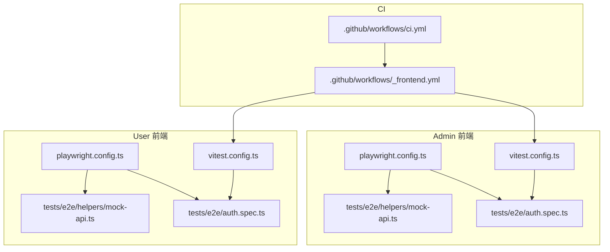
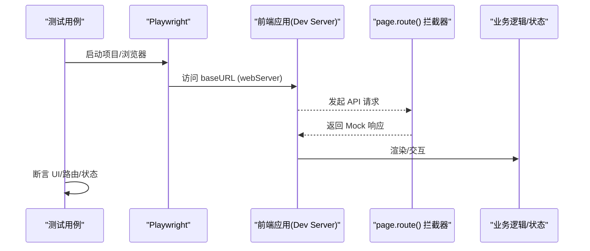
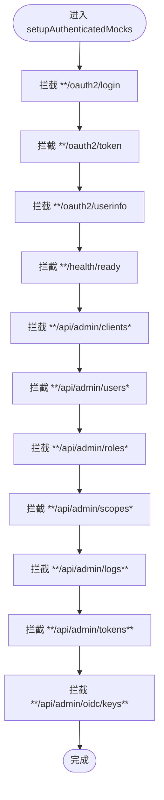
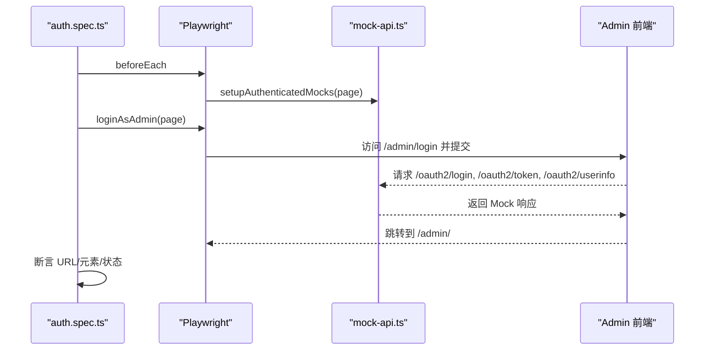
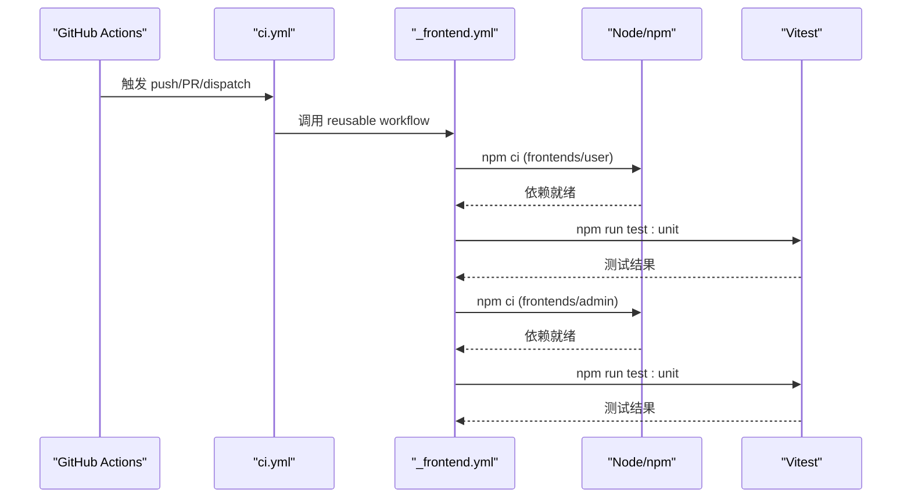
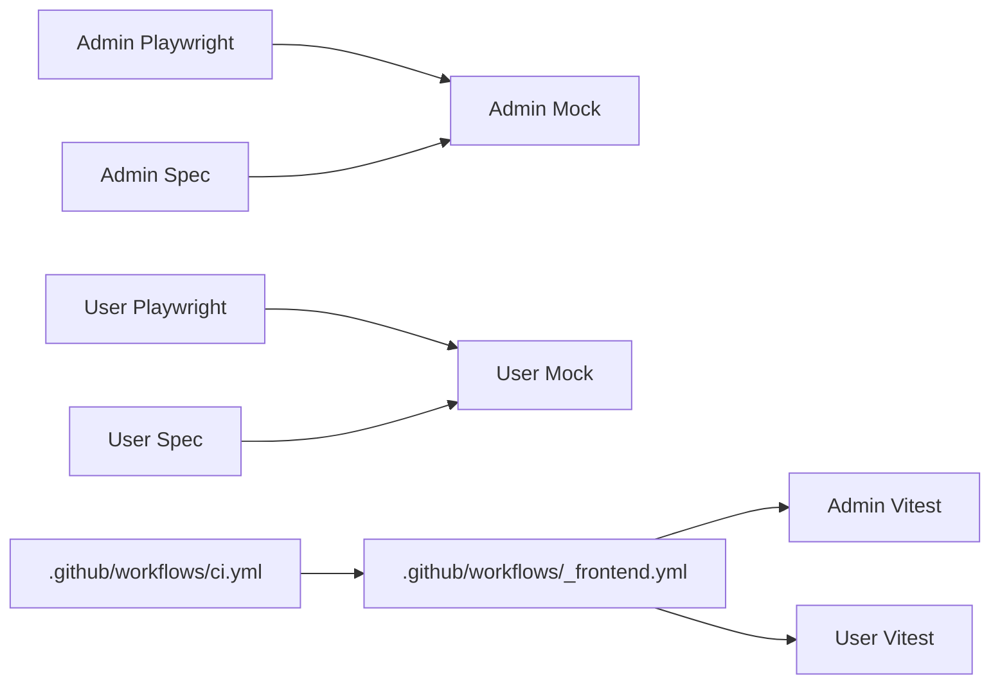

# 测试配置与工具

<cite>
**本文引用的文件**
- [frontends/admin/playwright.config.ts](file://frontends/admin/playwright.config.ts)
- [frontends/user/playwright.config.ts](file://frontends/user/playwright.config.ts)
- [frontends/admin/vitest.config.ts](file://frontends/admin/vitest.config.ts)
- [frontends/user/vitest.config.ts](file://frontends/user/vitest.config.ts)
- [frontends/admin/tests/e2e/helpers/mock-api.ts](file://frontends/admin/tests/e2e/helpers/mock-api.ts)
- [frontends/user/tests/e2e/helpers/mock-api.ts](file://frontends/user/tests/e2e/helpers/mock-api.ts)
- [frontends/admin/tests/e2e/auth.spec.ts](file://frontends/admin/tests/e2e/auth.spec.ts)
- [frontends/user/tests/e2e/auth.spec.ts](file://frontends/user/tests/e2e/auth.spec.ts)
- [.github/workflows/_frontend.yml](file://.github/workflows/_frontend.yml)
- [.github/workflows/ci.yml](file://.github/workflows/ci.yml)
- [docs/frontend/test-cases.md](file://docs/frontend/test-cases.md)
- [docs/admin/e2e-testing-guide.md](file://docs/admin/e2e-testing-guide.md)
</cite>

## 目录
1. [简介](#简介)
2. [项目结构](#项目结构)
3. [核心组件](#核心组件)
4. [架构总览](#架构总览)
5. [详细组件分析](#详细组件分析)
6. [依赖关系分析](#依赖关系分析)
7. [性能考虑](#性能考虑)
8. [故障排查指南](#故障排查指南)
9. [结论](#结论)
10. [附录](#附录)

## 简介
本文件面向前端测试基础设施，系统性梳理 Playwright 与 Vitest 的配置、测试数据与 Mock 策略、CI/CD 集成与并行执行、以及常见问题的诊断与优化建议。仓库包含两个前端应用（admin、user），各自拥有独立的 E2E 与单元测试配置与用例，并通过 GitHub Actions 在 CI 中运行。

## 项目结构
- 前端应用位于 frontends/admin 与 frontends/user，均使用 Vite + Vue 3。
- 每个前端包含：
  - Playwright E2E 配置与 tests/e2e 用例集
  - Vitest 单元测试配置与 tests/unit 用例集
- CI 通过 .github/workflows 编排，复用工作流执行前端属性测试与构建测试矩阵。

图表来源
- [frontends/admin/playwright.config.ts:1-27](file://frontends/admin/playwright.config.ts#L1-L27)
- [frontends/user/playwright.config.ts:1-24](file://frontends/user/playwright.config.ts#L1-L24)
- [frontends/admin/vitest.config.ts:1-18](file://frontends/admin/vitest.config.ts#L1-L18)
- [frontends/user/vitest.config.ts:1-24](file://frontends/user/vitest.config.ts#L1-L24)
- [.github/workflows/ci.yml:73-76](file://.github/workflows/ci.yml#L73-L76)
- [.github/workflows/_frontend.yml:1-36](file://.github/workflows/_frontend.yml#L1-L36)

章节来源
- [frontends/admin/playwright.config.ts:1-27](file://frontends/admin/playwright.config.ts#L1-L27)
- [frontends/user/playwright.config.ts:1-24](file://frontends/user/playwright.config.ts#L1-L24)
- [frontends/admin/vitest.config.ts:1-18](file://frontends/admin/vitest.config.ts#L1-L18)
- [frontends/user/vitest.config.ts:1-24](file://frontends/user/vitest.config.ts#L1-L24)
- [.github/workflows/ci.yml:1-151](file://.github/workflows/ci.yml#L1-L151)
- [.github/workflows/_frontend.yml:1-36](file://.github/workflows/_frontend.yml#L1-L36)

## 核心组件
- Playwright 配置
  - 管理测试目录、并行度、重试、报告、浏览器设备、baseURL、trace、webServer 启动与复用策略。
- Vitest 配置
  - 启用 Vue 插件、全局 API、node 环境、包含/排除规则，避免与 E2E 冲突。
- Mock 层
  - 基于 page.route() 的拦截器，集中定义后端响应与辅助函数（登录、覆盖路由、错误模拟等）。
- 测试用例
  - 按页面/功能组织 spec，结合 beforeEach 统一 setup，断言 UI 行为与导航。
- CI/CD
  - 通过 reusable workflow 执行前端属性测试；主流水线串联静态检查、构建测试与 SDK 冒烟。

章节来源
- [frontends/admin/playwright.config.ts:1-27](file://frontends/admin/playwright.config.ts#L1-L27)
- [frontends/user/playwright.config.ts:1-24](file://frontends/user/playwright.config.ts#L1-L24)
- [frontends/admin/vitest.config.ts:1-18](file://frontends/admin/vitest.config.ts#L1-L18)
- [frontends/user/vitest.config.ts:1-24](file://frontends/user/vitest.config.ts#L1-L24)
- [frontends/admin/tests/e2e/helpers/mock-api.ts:1-497](file://frontends/admin/tests/e2e/helpers/mock-api.ts#L1-L497)
- [frontends/user/tests/e2e/helpers/mock-api.ts:1-200](file://frontends/user/tests/e2e/helpers/mock-api.ts#L1-L200)
- [frontends/admin/tests/e2e/auth.spec.ts:1-157](file://frontends/admin/tests/e2e/auth.spec.ts#L1-L157)
- [frontends/user/tests/e2e/auth.spec.ts:1-246](file://frontends/user/tests/e2e/auth.spec.ts#L1-L246)
- [.github/workflows/_frontend.yml:1-36](file://.github/workflows/_frontend.yml#L1-L36)
- [.github/workflows/ci.yml:1-151](file://.github/workflows/ci.yml#L1-L151)

## 架构总览
前端测试采用“请求拦截 Mock”的 E2E 方案，配合 Playwright 自动启动 dev server，无需真实后端即可稳定运行。Vitest 负责纯函数与跨应用一致性的属性测试，快速反馈。

图表来源
- [frontends/admin/playwright.config.ts:10-25](file://frontends/admin/playwright.config.ts#L10-L25)
- [frontends/user/playwright.config.ts:10-22](file://frontends/user/playwright.config.ts#L10-L22)
- [frontends/admin/tests/e2e/helpers/mock-api.ts:120-455](file://frontends/admin/tests/e2e/helpers/mock-api.ts#L120-L455)
- [frontends/user/tests/e2e/helpers/mock-api.ts:23-121](file://frontends/user/tests/e2e/helpers/mock-api.ts#L23-L121)

## 详细组件分析

### Playwright 配置（Admin 与 User）
- 共同要点
  - testDir 指向 tests/e2e
  - fullyParallel 开启以提升吞吐
  - CI 下限制 workers=1、retries=2、forbidOnly=true，增强稳定性
  - reporter 输出 HTML 报告
  - use.baseURL 指定开发服务器地址
  - trace on-first-retry 便于失败定位
  - webServer 自动启动并复用本地服务（非 CI）
- 差异点
  - Admin 的 baseURL 为 http://localhost:5174，期望路径 /admin/
  - User 的 baseURL 为 http://localhost:5173，期望路径 /

章节来源
- [frontends/admin/playwright.config.ts:1-27](file://frontends/admin/playwright.config.ts#L1-L27)
- [frontends/user/playwright.config.ts:1-24](file://frontends/user/playwright.config.ts#L1-L24)

### Vitest 配置（Admin 与 User）
- 共同要点
  - 启用 @vitejs/plugin-vue
  - globals: true，environment: node
  - include 仅包含 src 与 tests/unit，exclude 排除 e2e，避免 runner 冲突
- 差异点
  - User 额外配置 resolve.alias 以支持 @ 路径别名

章节来源
- [frontends/admin/vitest.config.ts:1-18](file://frontends/admin/vitest.config.ts#L1-L18)
- [frontends/user/vitest.config.ts:1-24](file://frontends/user/vitest.config.ts#L1-L24)

### Mock API 层设计（Admin）
- 职责
  - 集中定义所有受测 API 的 Mock 数据与响应
  - 提供 setupAuthenticatedMocks(page) 注册全局路由拦截
  - 提供 loginAsAdmin、overrideRoute、mockApiError、mockNetworkError 等辅助函数
- 关键模式
  - 精确匹配 URL 模式并按方法分流（GET/POST/PUT/DELETE）
  - 子资源优先于通配符（如 /clients/*/reset-secret 先于 /clients/*）
  - 允许在单个测试内覆盖全局 Mock，实现异常场景注入

图表来源
- [frontends/admin/tests/e2e/helpers/mock-api.ts:120-455](file://frontends/admin/tests/e2e/helpers/mock-api.ts#L120-L455)

章节来源
- [frontends/admin/tests/e2e/helpers/mock-api.ts:1-497](file://frontends/admin/tests/e2e/helpers/mock-api.ts#L1-L497)

### Mock API 层设计（User）
- 职责
  - 覆盖认证、注册、密码重置、邮箱验证、MFA、授权应用、WebAuthn 等接口
  - 提供 loginUser（通过 localStorage 注入 token）、loginViaForm、overrideRoute、mockApiError、mockNetworkError 等
- 特点
  - 对特定请求体进行分支处理（如登录时根据 password 字段返回不同结果）
  - 提供统一的错误信封格式模拟，便于前端错误映射测试

章节来源
- [frontends/user/tests/e2e/helpers/mock-api.ts:1-200](file://frontends/user/tests/e2e/helpers/mock-api.ts#L1-L200)

### 测试用例组织与模式（Admin）
- 典型流程
  - beforeEach 中调用 setupAuthenticatedMocks 注册全局 Mock
  - 通过 UI 操作完成登录（loginAsAdmin），等待跳转至仪表板
  - 针对具体页面/功能编写用例，断言可见性、URL、表单行为
- 覆盖场景
  - 未认证重定向、登录成功/失败、权限校验、MFA 流程、加载态、浏览器后退等

图表来源
- [frontends/admin/tests/e2e/auth.spec.ts:1-157](file://frontends/admin/tests/e2e/auth.spec.ts#L1-L157)
- [frontends/admin/tests/e2e/helpers/mock-api.ts:120-467](file://frontends/admin/tests/e2e/helpers/mock-api.ts#L120-L467)

章节来源
- [frontends/admin/tests/e2e/auth.spec.ts:1-157](file://frontends/admin/tests/e2e/auth.spec.ts#L1-L157)
- [frontends/admin/tests/e2e/helpers/mock-api.ts:120-467](file://frontends/admin/tests/e2e/helpers/mock-api.ts#L120-L467)

### 测试用例组织与模式（User）
- 典型流程
  - beforeEach 中调用 setupMocks 注册全局 Mock
  - 支持两种登录方式：localStorage 注入令牌直接访问首页，或通过表单提交
  - 覆盖登录、注册、忘记密码、邮箱验证、GitHub 登录、MFA 校验等
- 特性
  - 利用 route 覆盖能力注入 MFA 流程与错误场景
  - 断言表单控件、提示消息与跳转行为

章节来源
- [frontends/user/tests/e2e/auth.spec.ts:1-246](file://frontends/user/tests/e2e/auth.spec.ts#L1-L246)
- [frontends/user/tests/e2e/helpers/mock-api.ts:23-169](file://frontends/user/tests/e2e/helpers/mock-api.ts#L23-L169)

### CI/CD 集成
- 前端属性测试
  - 通过 _frontend.yml 在 Ubuntu 22.04 上安装 Node 20，分别进入 frontends/user 与 frontends/admin 执行 npm ci 与 npm run test:unit
- 主流水线
  - ci.yml 将静态检查、前端属性测试、构建测试（多平台矩阵）、SDK 冒烟串联
  - 前端属性测试作为 FAST gate 提前失败，减少无效构建

图表来源
- [.github/workflows/ci.yml:73-76](file://.github/workflows/ci.yml#L73-L76)
- [.github/workflows/_frontend.yml:11-36](file://.github/workflows/_frontend.yml#L11-L36)

章节来源
- [.github/workflows/_frontend.yml:1-36](file://.github/workflows/_frontend.yml#L1-L36)
- [.github/workflows/ci.yml:1-151](file://.github/workflows/ci.yml#L1-L151)

## 依赖关系分析
- Playwright 与 Vitest 解耦：E2E 与单元用例互不干扰，runner 隔离
- Mock 层与用例强耦合：用例依赖 helpers/mock-api.ts 提供的拦截与辅助函数
- CI 与工作流：ci.yml 聚合多个任务，_frontend.yml 专注前端属性测试

图表来源
- [frontends/admin/playwright.config.ts:1-27](file://frontends/admin/playwright.config.ts#L1-L27)
- [frontends/user/playwright.config.ts:1-24](file://frontends/user/playwright.config.ts#L1-L24)
- [frontends/admin/tests/e2e/helpers/mock-api.ts:1-497](file://frontends/admin/tests/e2e/helpers/mock-api.ts#L1-L497)
- [frontends/user/tests/e2e/helpers/mock-api.ts:1-200](file://frontends/user/tests/e2e/helpers/mock-api.ts#L1-L200)
- [.github/workflows/ci.yml:73-76](file://.github/workflows/ci.yml#L73-L76)
- [.github/workflows/_frontend.yml:11-36](file://.github/workflows/_frontend.yml#L11-L36)

章节来源
- [frontends/admin/playwright.config.ts:1-27](file://frontends/admin/playwright.config.ts#L1-L27)
- [frontends/user/playwright.config.ts:1-24](file://frontends/user/playwright.config.ts#L1-L24)
- [frontends/admin/tests/e2e/helpers/mock-api.ts:1-497](file://frontends/admin/tests/e2e/helpers/mock-api.ts#L1-L497)
- [frontends/user/tests/e2e/helpers/mock-api.ts:1-200](file://frontends/user/tests/e2e/helpers/mock-api.ts#L1-L200)
- [.github/workflows/ci.yml:1-151](file://.github/workflows/ci.yml#L1-L151)
- [.github/workflows/_frontend.yml:1-36](file://.github/workflows/_frontend.yml#L1-L36)

## 性能考虑
- 并行与重试
  - 本地 fullyParallel=true 提升吞吐；CI 设置 workers=1 与 retries=2 降低竞争与 flaky
- Trace 调试
  - trace on-first-retry 仅在重试时生成，平衡体积与可观测性
- Dev Server 复用
  - 本地 reuseExistingServer=true 减少启动开销；CI 强制新建实例保证隔离
- Mock 层效率
  - 请求拦截发生在网络层之前，零网络往返，测试确定性高
- 缓存与预加载
  - 通过 vite 构建产物与浏览器缓存加速首屏；E2E 中避免不必要的重复导航
- 内存管理
  - 控制并发 worker 数，避免过多浏览器实例导致内存压力
- 参考实践
  - 参见文档中的 E2E 接入指南与测试用例清单，了解最佳实践与边界场景

章节来源
- [frontends/admin/playwright.config.ts:5-25](file://frontends/admin/playwright.config.ts#L5-L25)
- [frontends/user/playwright.config.ts:5-22](file://frontends/user/playwright.config.ts#L5-L22)
- [docs/admin/e2e-testing-guide.md:87-132](file://docs/admin/e2e-testing-guide.md#L87-L132)
- [docs/frontend/test-cases.md:251-286](file://docs/frontend/test-cases.md#L251-L286)

## 故障排查指南
- 常见问题
  - 偶发失败（flaky）：避免使用固定等待，改用 waitForSelector/waitForURL/expect；开启 trace 分析
  - 请求未被拦截：核对 URL 模式与 HTTP 方法；在 handler 内打印实际 URL 调试
  - 子资源优先级：更具体的路由需先注册或在 handler 内 continue 让位
  - 环境变量与端口：确认 baseURL 与 webServer.url 与实际 dev server 一致
- 推荐步骤
  - 使用 overrideRoute 在单测中覆盖全局 Mock，构造异常场景
  - 使用 mockApiError/mockNetworkError 模拟错误与网络失败
  - 通过 HTML 报告与 trace 快速定位失败点

章节来源
- [docs/admin/e2e-testing-guide.md:785-800](file://docs/admin/e2e-testing-guide.md#L785-L800)
- [frontends/admin/tests/e2e/helpers/mock-api.ts:470-497](file://frontends/admin/tests/e2e/helpers/mock-api.ts#L470-L497)
- [frontends/user/tests/e2e/helpers/mock-api.ts:142-200](file://frontends/user/tests/e2e/helpers/mock-api.ts#L142-L200)

## 结论
本项目的前端测试体系以 Playwright 的请求拦截 Mock 为核心，结合 Vitest 的属性测试，形成快速、稳定、可维护的闭环。通过清晰的配置分层、集中的 Mock 层与规范的用例组织，能够在无后端依赖的情况下高效验证前端行为。CI 将前端属性测试纳入快速门禁，保障代码质量与交付节奏。

## 附录
- 测试用例清单与优先级
  - 用户前端测试用例详见 docs/frontend/test-cases.md，涵盖认证、OAuth2 流程、账户页、导航、错误处理、安全、会话、性能、无障碍与边界场景
- E2E 接入指南
  - 参见 docs/admin/e2e-testing-guide.md，了解初始化、Mock 层设计、测试组织、进阶技巧与 CI 集成

章节来源
- [docs/frontend/test-cases.md:1-286](file://docs/frontend/test-cases.md#L1-L286)
- [docs/admin/e2e-testing-guide.md:1-800](file://docs/admin/e2e-testing-guide.md#L1-L800)