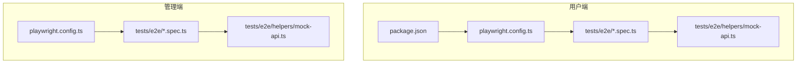
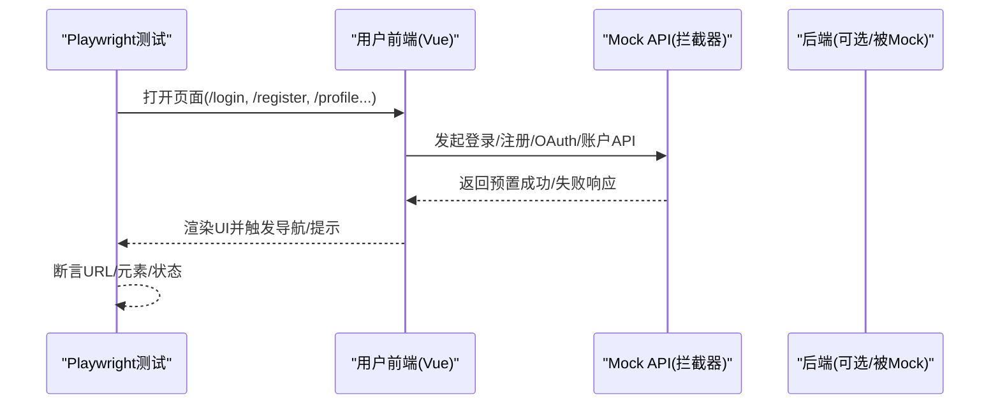
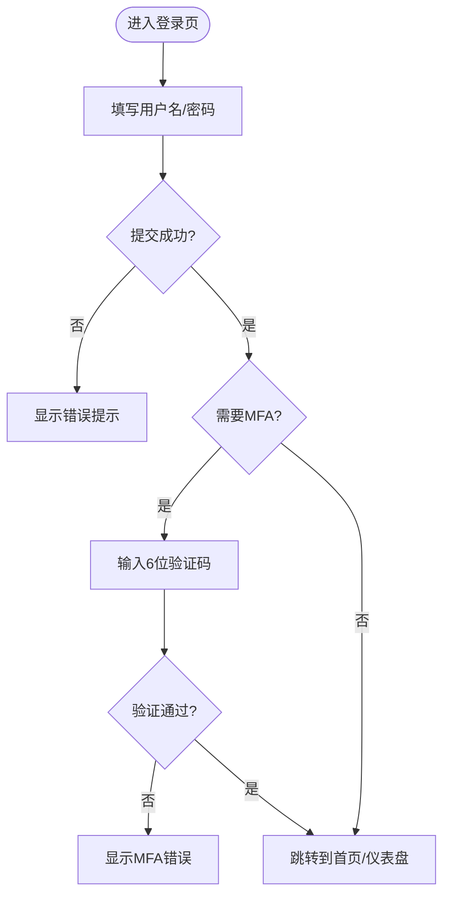
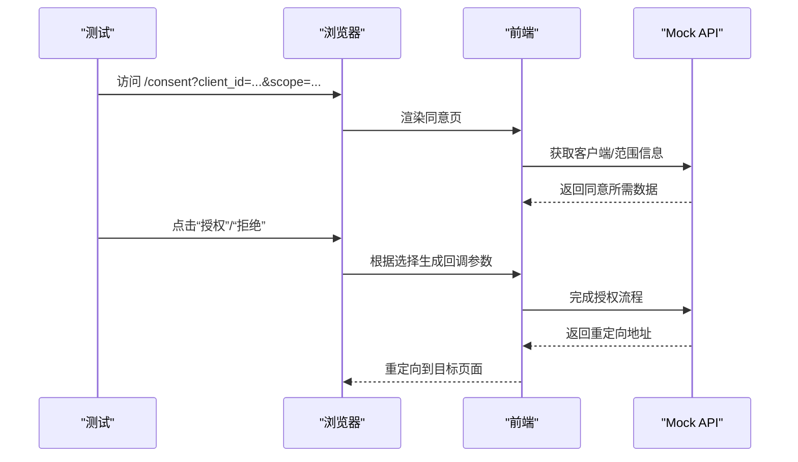
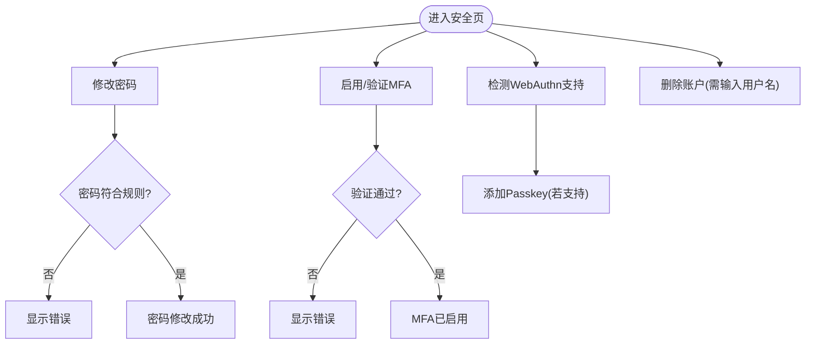
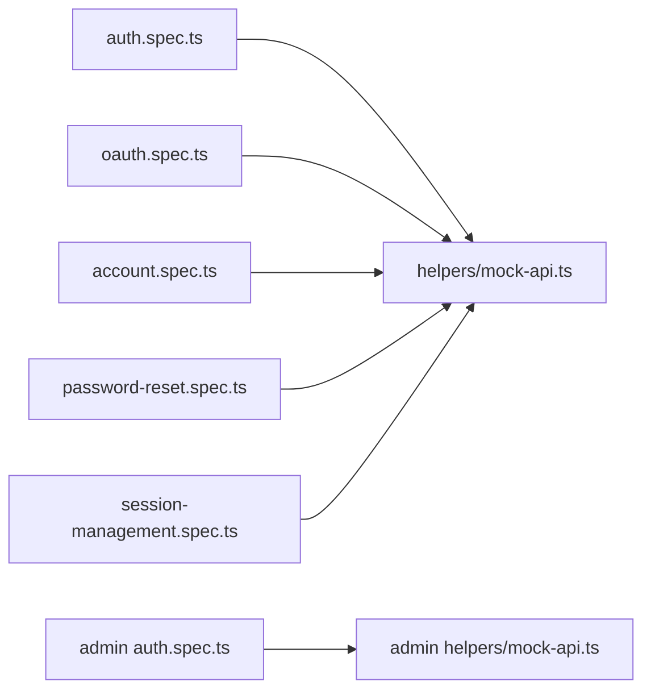

# 用户界面E2E测试

<cite>
**本文引用的文件**
- [frontends/user/playwright.config.ts](file://frontends/user/playwright.config.ts)
- [frontends/admin/playwright.config.ts](file://frontends/admin/playwright.config.ts)
- [frontends/user/tests/e2e/auth.spec.ts](file://frontends/user/tests/e2e/auth.spec.ts)
- [frontends/user/tests/e2e/oauth.spec.ts](file://frontends/user/tests/e2e/oauth.spec.ts)
- [frontends/user/tests/e2e/account.spec.ts](file://frontends/user/tests/e2e/account.spec.ts)
- [frontends/user/tests/e2e/password-reset.spec.ts](file://frontends/user/tests/e2e/password-reset.spec.ts)
- [frontends/user/tests/e2e/session-management.spec.ts](file://frontends/user/tests/e2e/session-management.spec.ts)
- [frontends/user/tests/e2e/helpers/mock-api.ts](file://frontends/user/tests/e2e/helpers/mock-api.ts)
- [frontends/admin/tests/e2e/auth.spec.ts](file://frontends/admin/tests/e2e/auth.spec.ts)
- [frontends/admin/tests/e2e/helpers/mock-api.ts](file://frontends/admin/tests/e2e/helpers/mock-api.ts)
- [frontends/user/package.json](file://frontends/user/package.json)
- [docs/frontend/test-cases.md](file://docs/frontend/test-cases.md)
</cite>

## 目录
1. [简介](#简介)
2. [项目结构](#项目结构)
3. [核心组件](#核心组件)
4. [架构总览](#架构总览)
5. [详细组件分析](#详细组件分析)
6. [依赖关系分析](#依赖关系分析)
7. [性能与并发](#性能与并发)
8. [故障排查指南](#故障排查指南)
9. [结论](#结论)
10. [附录](#附录)

## 简介
本文件面向AuthForge项目的用户端与管理端前端，系统化梳理基于Playwright的端到端（E2E）测试实现。内容覆盖：
- Playwright在用户应用中的配置与执行策略
- 认证流程、OAuth授权流程、账户管理、密码重置、MFA验证、社交登录等核心场景的E2E用例设计
- Mock API服务与测试数据管理
- 并发执行、重试、追踪与报告
- 响应式与跨设备兼容性测试方法
- 调试工具与性能优化技巧

## 项目结构
两个前端应用各自维护独立的Playwright配置与E2E测试套件：
- 用户端（User Frontend）：位于 frontends/user，提供登录注册、OAuth回调、账户管理等页面
- 管理端（Admin Frontend）：位于 frontends/admin，提供管理员控制台相关功能

图表来源
- [frontends/user/playwright.config.ts:1-24](file://frontends/user/playwright.config.ts#L1-L24)
- [frontends/admin/playwright.config.ts:1-27](file://frontends/admin/playwright.config.ts#L1-L27)
- [frontends/user/package.json:1-33](file://frontends/user/package.json#L1-L33)

章节来源
- [frontends/user/playwright.config.ts:1-24](file://frontends/user/playwright.config.ts#L1-L24)
- [frontends/admin/playwright.config.ts:1-27](file://frontends/admin/playwright.config.ts#L1-L27)
- [frontends/user/package.json:1-33](file://frontends/user/package.json#L1-L33)

## 核心组件
- Playwright配置
  - 用户端：指定测试目录、并行执行、CI重试、HTML报告、baseURL、trace策略、浏览器设备、webServer启动命令与端口
  - 管理端：类似配置，但baseURL指向管理端路径
- E2E测试套件
  - 用户端：auth.spec.ts、oauth.spec.ts、account.spec.ts、password-reset.spec.ts、session-management.spec.ts
  - 管理端：auth.spec.ts（含管理员登录、权限校验、MFA处理等）
- Mock API服务
  - 统一拦截后端接口，返回稳定数据或错误，支撑无后端运行下的E2E
- 测试脚本入口
  - package.json中定义 test:e2e、test:e2e:ui、test:e2e:headed 等命令

章节来源
- [frontends/user/playwright.config.ts:1-24](file://frontends/user/playwright.config.ts#L1-L24)
- [frontends/admin/playwright.config.ts:1-27](file://frontends/admin/playwright.config.ts#L1-L27)
- [frontends/user/tests/e2e/auth.spec.ts:1-246](file://frontends/user/tests/e2e/auth.spec.ts#L1-L246)
- [frontends/user/tests/e2e/oauth.spec.ts:1-94](file://frontends/user/tests/e2e/oauth.spec.ts#L1-L94)
- [frontends/user/tests/e2e/account.spec.ts:1-347](file://frontends/user/tests/e2e/account.spec.ts#L1-L347)
- [frontends/user/tests/e2e/password-reset.spec.ts:1-115](file://frontends/user/tests/e2e/password-reset.spec.ts#L1-L115)
- [frontends/user/tests/e2e/session-management.spec.ts:1-221](file://frontends/user/tests/e2e/session-management.spec.ts#L1-L221)
- [frontends/user/tests/e2e/helpers/mock-api.ts:1-200](file://frontends/user/tests/e2e/helpers/mock-api.ts#L1-L200)
- [frontends/admin/tests/e2e/auth.spec.ts:1-157](file://frontends/admin/tests/e2e/auth.spec.ts#L1-L157)
- [frontends/admin/tests/e2e/helpers/mock-api.ts:1-497](file://frontends/admin/tests/e2e/helpers/mock-api.ts#L1-L497)
- [frontends/user/package.json:1-33](file://frontends/user/package.json#L1-L33)

## 架构总览
下图展示E2E测试在用户端的整体交互：测试驱动浏览器访问前端，通过Mock API拦截所有后端调用，模拟认证、授权、账户操作等流程。

图表来源
- [frontends/user/tests/e2e/auth.spec.ts:1-246](file://frontends/user/tests/e2e/auth.spec.ts#L1-L246)
- [frontends/user/tests/e2e/helpers/mock-api.ts:1-200](file://frontends/user/tests/e2e/helpers/mock-api.ts#L1-L200)

## 详细组件分析

### 认证流程测试（登录/注册/MFA/社交登录）
- 登录表单显示与提交、错误提示、MFA挑战与验证、忘记密码与邮箱验证、GitHub社交登录链接
- 使用page.route拦截登录与MFA相关接口，构造mfa_required、mfa_token等响应，验证前端分支逻辑
- 注册流程包含成功消息与自动跳转；忘记密码与邮箱验证页面断言提示信息

图表来源
- [frontends/user/tests/e2e/auth.spec.ts:17-60](file://frontends/user/tests/e2e/auth.spec.ts#L17-L60)
- [frontends/user/tests/e2e/auth.spec.ts:164-245](file://frontends/user/tests/e2e/auth.spec.ts#L164-L245)
- [frontends/user/tests/e2e/helpers/mock-api.ts:23-121](file://frontends/user/tests/e2e/helpers/mock-api.ts#L23-L121)

章节来源
- [frontends/user/tests/e2e/auth.spec.ts:1-246](file://frontends/user/tests/e2e/auth.spec.ts#L1-L246)
- [frontends/user/tests/e2e/helpers/mock-api.ts:1-200](file://frontends/user/tests/e2e/helpers/mock-api.ts#L1-L200)

### OAuth授权流程测试（同意页/设备码/回调）
- 同意页：展示客户端信息与请求范围，支持批准与拒绝
- 设备验证：输入设备码并完成授权
- 回调页：交换授权码为令牌并重定向；加载态与错误处理

图表来源
- [frontends/user/tests/e2e/oauth.spec.ts:4-93](file://frontends/user/tests/e2e/oauth.spec.ts#L4-L93)
- [frontends/user/tests/e2e/helpers/mock-api.ts:106-121](file://frontends/user/tests/e2e/helpers/mock-api.ts#L106-L121)

章节来源
- [frontends/user/tests/e2e/oauth.spec.ts:1-94](file://frontends/user/tests/e2e/oauth.spec.ts#L1-L94)

### 账户管理测试（仪表盘/个人资料/安全设置/已授权应用）
- 仪表盘：欢迎信息、快捷链接、角色展示（空/多角色）
- 个人资料：用户信息、邮箱验证状态、重发验证邮件、加载与错误态
- 安全设置：修改密码、MFA启用/验证、WebAuthn支持检测、删除账户
- 已授权应用：列表展示、撤销授权、空状态、错误与成功消息自动消失

图表来源
- [frontends/user/tests/e2e/account.spec.ts:56-265](file://frontends/user/tests/e2e/account.spec.ts#L56-L265)
- [frontends/user/tests/e2e/account.spec.ts:267-347](file://frontends/user/tests/e2e/account.spec.ts#L267-L347)
- [frontends/user/tests/e2e/helpers/mock-api.ts:67-116](file://frontends/user/tests/e2e/helpers/mock-api.ts#L67-L116)

章节来源
- [frontends/user/tests/e2e/account.spec.ts:1-347](file://frontends/user/tests/e2e/account.spec.ts#L1-L347)

### 密码重置测试
- 有效重置令牌：填写新密码并提交，成功跳转或提示
- 过期/无效令牌：显示相应错误
- 无令牌：页面正常渲染不崩溃

章节来源
- [frontends/user/tests/e2e/password-reset.spec.ts:1-115](file://frontends/user/tests/e2e/password-reset.spec.ts#L1-L115)

### 会话管理测试
- 会话恢复：通过localStorage恢复访问令牌与刷新令牌
- 令牌过期：模拟userinfo返回401，验证重定向或错误处理
- 多标签页：同一上下文下共享localStorage，单标签退出影响其他标签
- localStorage卫生：登录后写入、登出后清理、不在sessionStorage暴露

章节来源
- [frontends/user/tests/e2e/session-management.spec.ts:1-221](file://frontends/user/tests/e2e/session-management.spec.ts#L1-L221)

### 管理端认证测试
- 未认证重定向至登录页
- 登录表单元素与加载态
- 非管理员用户拒绝访问
- MFA required响应处理
- 空字段校验与浏览器原生验证
- 登录失败错误提示

章节来源
- [frontends/admin/tests/e2e/auth.spec.ts:1-157](file://frontends/admin/tests/e2e/auth.spec.ts#L1-L157)
- [frontends/admin/tests/e2e/helpers/mock-api.ts:123-154](file://frontends/admin/tests/e2e/helpers/mock-api.ts#L123-L154)

## 依赖关系分析
- 测试用例依赖Mock API以屏蔽真实后端，确保可重复性与稳定性
- 用户端与管理端各自维护独立Mock，避免耦合
- Playwright配置通过webServer启动开发服务器，无需手动启动
- 测试脚本通过package.json统一管理执行入口

图表来源
- [frontends/user/tests/e2e/auth.spec.ts:1-246](file://frontends/user/tests/e2e/auth.spec.ts#L1-L246)
- [frontends/user/tests/e2e/oauth.spec.ts:1-94](file://frontends/user/tests/e2e/oauth.spec.ts#L1-L94)
- [frontends/user/tests/e2e/account.spec.ts:1-347](file://frontends/user/tests/e2e/account.spec.ts#L1-L347)
- [frontends/user/tests/e2e/password-reset.spec.ts:1-115](file://frontends/user/tests/e2e/password-reset.spec.ts#L1-L115)
- [frontends/user/tests/e2e/session-management.spec.ts:1-221](file://frontends/user/tests/e2e/session-management.spec.ts#L1-L221)
- [frontends/admin/tests/e2e/auth.spec.ts:1-157](file://frontends/admin/tests/e2e/auth.spec.ts#L1-L157)

章节来源
- [frontends/user/tests/e2e/helpers/mock-api.ts:1-200](file://frontends/user/tests/e2e/helpers/mock-api.ts#L1-L200)
- [frontends/admin/tests/e2e/helpers/mock-api.ts:1-497](file://frontends/admin/tests/e2e/helpers/mock-api.ts#L1-L497)

## 性能与并发
- 并行执行：默认开启fullyParallel，提升吞吐
- CI环境：限制workers为1，retries为2，保障稳定性
- 追踪与报告：启用HTML报告，首次重试时记录trace便于定位问题
- webServer：自动启动Vite开发服务器，复用进程减少开销
- 建议
  - 在本地开发使用headed模式进行可视化调试
  - 将耗时较长的用例拆分到不同项目或分片执行
  - 合理设置超时与等待策略，避免过度sleep

章节来源
- [frontends/user/playwright.config.ts:1-24](file://frontends/user/playwright.config.ts#L1-L24)
- [frontends/admin/playwright.config.ts:1-27](file://frontends/admin/playwright.config.ts#L1-L27)
- [frontends/user/package.json:1-33](file://frontends/user/package.json#L1-L33)

## 故障排查指南
- 常见问题
  - 登录失败：检查Mock是否返回正确错误信封，前端是否正确映射错误消息
  - MFA流程异常：确认路由拦截返回了mfa_required与mfa_token，且验证接口返回预期结果
  - 回调页卡住：检查token交换Mock是否延迟或失败，观察加载态与重定向
  - 会话丢失：确认localStorage写入/清理逻辑，以及refresh_token刷新流程
- 调试技巧
  - 使用--headed模式逐步观察页面行为
  - 利用HTML报告与trace回放定位失败步骤
  - 通过page.route自定义响应，复现边界条件（网络错误、超时、401/500）
  - 在测试中打印URL与DOM片段辅助定位

章节来源
- [frontends/user/tests/e2e/auth.spec.ts:26-60](file://frontends/user/tests/e2e/auth.spec.ts#L26-L60)
- [frontends/user/tests/e2e/oauth.spec.ts:59-93](file://frontends/user/tests/e2e/oauth.spec.ts#L59-L93)
- [frontends/user/tests/e2e/session-management.spec.ts:27-101](file://frontends/user/tests/e2e/session-management.spec.ts#L27-L101)

## 结论
本项目为用户端与管理端提供了完善的Playwright E2E测试体系，覆盖认证、授权、账户管理、密码重置、MFA、社交登录与会话管理等关键路径。通过统一的Mock API与合理的配置策略，测试具备高稳定性与可维护性。建议在持续集成中结合HTML报告与trace，配合headed调试与分片执行，进一步提升反馈效率与覆盖率。

## 附录

### 测试执行策略与命令
- 用户端
  - 普通执行：npm run test:e2e
  - UI模式：npm run test:e2e:ui
  - 有头模式：npm run test:e2e:headed
- 管理端
  - 同用户端，使用各自package.json中的脚本

章节来源
- [frontends/user/package.json:1-33](file://frontends/user/package.json#L1-L33)

### 响应式设计与跨设备兼容性
- 当前配置仅使用Desktop Chrome设备集，可通过扩展projects增加移动/平板设备
- 建议新增设备配置（如Mobile Chrome、iPad），并在CI中按设备矩阵执行
- 针对移动端交互（触摸、视口变化）补充用例，验证布局与可用性

章节来源
- [frontends/user/playwright.config.ts:14-16](file://frontends/user/playwright.config.ts#L14-L16)
- [frontends/admin/playwright.config.ts:14-18](file://frontends/admin/playwright.config.ts#L14-L18)

### 测试数据管理与Mock API最佳实践
- 集中化Mock：将常用响应封装为常量与函数，便于复用与维护
- 错误注入：提供mockApiError、mockNetworkError等工具快速构造异常场景
- 路由覆盖：使用overrideRoute替换已有Mock，实现用例级定制
- 隔离性：每个测试通过setupMocks初始化，避免状态污染

章节来源
- [frontends/user/tests/e2e/helpers/mock-api.ts:1-200](file://frontends/user/tests/e2e/helpers/mock-api.ts#L1-L200)
- [frontends/admin/tests/e2e/helpers/mock-api.ts:1-497](file://frontends/admin/tests/e2e/helpers/mock-api.ts#L1-L497)

### 用例设计模式参考
- 登录注册、密码重置、MFA、OAuth回调、账户管理等场景的详细用例清单与优先级，可参考文档中的测试用例表，用于指导新增或完善用例

章节来源
- [docs/frontend/test-cases.md:1-286](file://docs/frontend/test-cases.md#L1-L286)