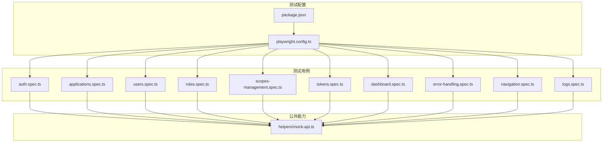
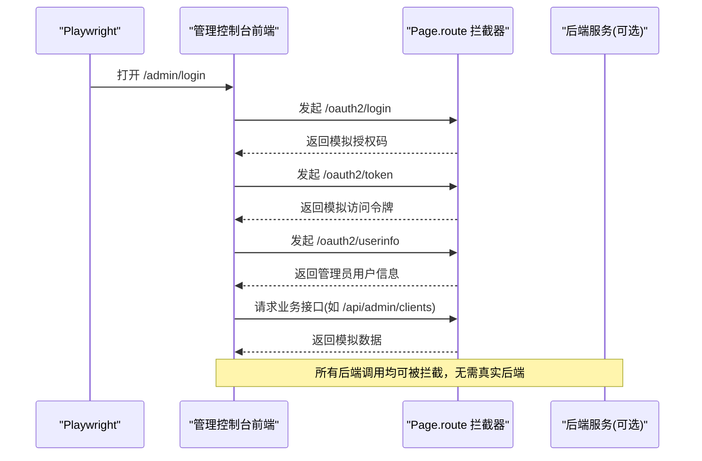
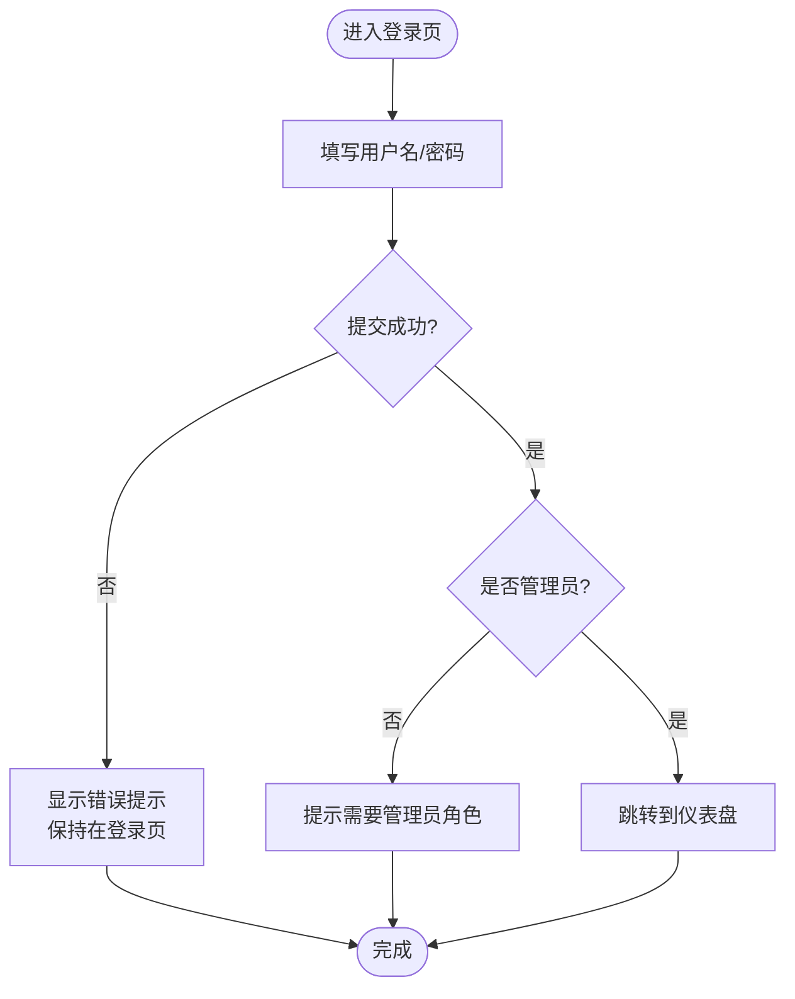
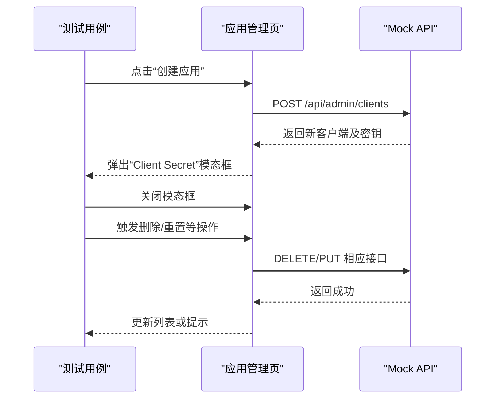
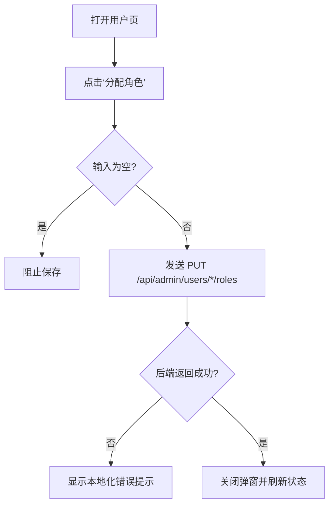
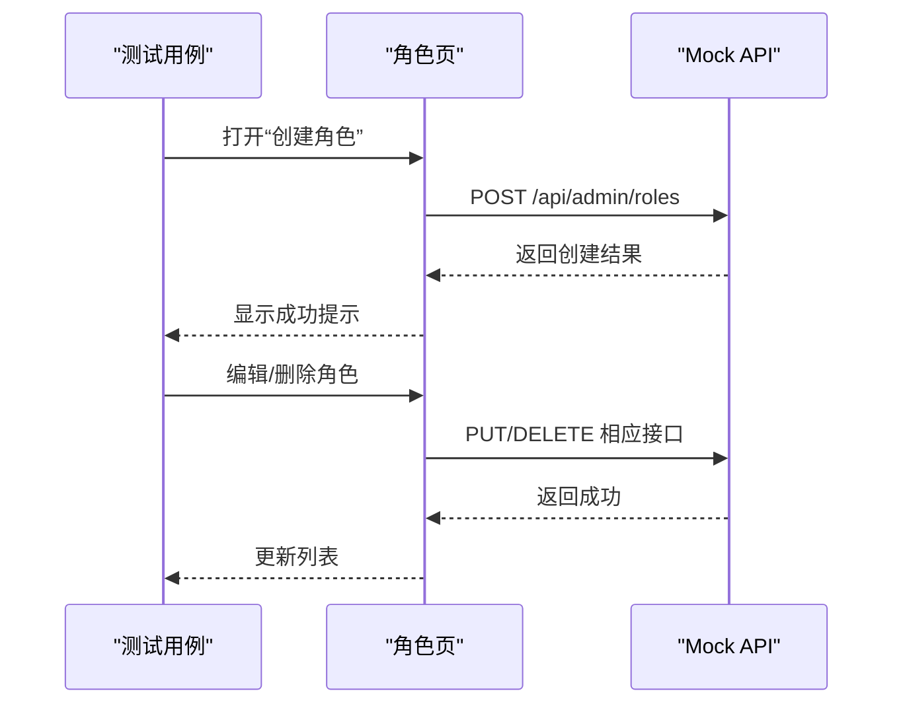
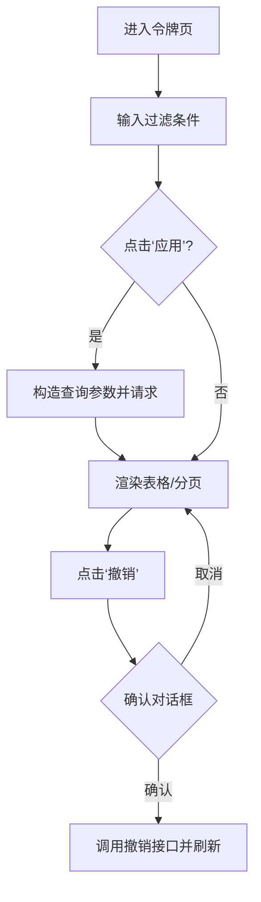
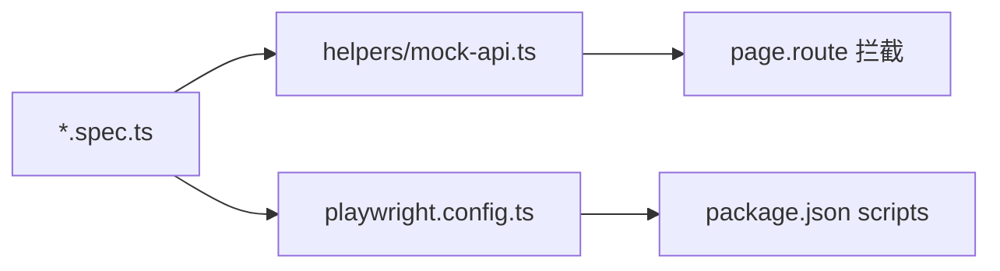

# 管理控制台E2E测试

<cite>
**本文引用的文件**
- [frontends/admin/playwright.config.ts](file://frontends/admin/playwright.config.ts)
- [frontends/admin/package.json](file://frontends/admin/package.json)
- [frontends/admin/tests/e2e/helpers/mock-api.ts](file://frontends/admin/tests/e2e/helpers/mock-api.ts)
- [frontends/admin/tests/e2e/auth.spec.ts](file://frontends/admin/tests/e2e/auth.spec.ts)
- [frontends/admin/tests/e2e/applications.spec.ts](file://frontends/admin/tests/e2e/applications.spec.ts)
- [frontends/admin/tests/e2e/users.spec.ts](file://frontends/admin/tests/e2e/users.spec.ts)
- [frontends/admin/tests/e2e/roles.spec.ts](file://frontends/admin/tests/e2e/roles.spec.ts)
- [frontends/admin/tests/e2e/scopes-management.spec.ts](file://frontends/admin/tests/e2e/scopes-management.spec.ts)
- [frontends/admin/tests/e2e/tokens.spec.ts](file://frontends/admin/tests/e2e/tokens.spec.ts)
- [frontends/admin/tests/e2e/dashboard.spec.ts](file://frontends/admin/tests/e2e/dashboard.spec.ts)
- [frontends/admin/tests/e2e/error-handling.spec.ts](file://frontends/admin/tests/e2e/error-handling.spec.ts)
- [frontends/admin/tests/e2e/navigation.spec.ts](file://frontends/admin/tests/e2e/navigation.spec.ts)
- [frontends/admin/tests/e2e/logs.spec.ts](file://frontends/admin/tests/e2e/logs.spec.ts)
</cite>

## 目录
1. [简介](#简介)
2. [项目结构](#项目结构)
3. [核心组件](#核心组件)
4. [架构总览](#架构总览)
5. [详细组件分析](#详细组件分析)
6. [依赖关系分析](#依赖关系分析)
7. [性能与稳定性](#性能与稳定性)
8. [故障排查指南](#故障排查指南)
9. [结论](#结论)
10. [附录](#附录)

## 简介
本文件面向“管理控制台”的端到端（E2E）测试，基于 Playwright 框架实现浏览器自动化、页面交互与 API Mock。文档覆盖：
- Playwright 配置与执行方式（并行、重试、报告、WebServer 启动）
- 认证流程、应用管理、用户管理、角色权限、范围（Scope）、令牌（Token）、审计日志、设置等模块的测试实现
- 测试数据准备、页面元素定位策略与断言方法
- 跨浏览器兼容性与移动端适配的配置建议
- 调试技巧与常见问题解决方案

## 项目结构
管理控制台的 E2E 测试位于 frontends/admin/tests/e2e 目录下，采用按功能模块划分的 spec 文件组织；统一的 API Mock 与登录辅助逻辑集中在 helpers/mock-api.ts；Playwright 配置文件位于 playwright.config.ts；脚本入口在 package.json。

图表来源
- [frontends/admin/playwright.config.ts:1-27](file://frontends/admin/playwright.config.ts#L1-L27)
- [frontends/admin/package.json:1-35](file://frontends/admin/package.json#L1-L35)

章节来源
- [frontends/admin/playwright.config.ts:1-27](file://frontends/admin/playwright.config.ts#L1-L27)
- [frontends/admin/package.json:1-35](file://frontends/admin/package.json#L1-L35)

## 核心组件
- Playwright 配置
  - 测试目录：tests/e2e
  - 并行与重试：CI 环境启用并行与重试，本地默认单进程
  - 报告：HTML 报告
  - 浏览器：默认 Chromium（可扩展多设备）
  - WebServer：自动启动前端开发服务器并等待就绪
- 统一 Mock 与登录辅助
  - 拦截 OAuth2 登录、令牌交换、用户信息、健康检查
  - 拦截管理后台各资源接口（客户端、用户、角色、范围、令牌、日志、OIDC 密钥等）
  - 提供 loginAsAdmin 快捷登录流程
  - 提供 overrideRoute、mockApiError、mockNetworkError 等工具
- 测试套件
  - 认证、导航、仪表盘、应用管理、用户管理、角色管理、范围管理、令牌管理、审计日志、错误处理、设置页等

章节来源
- [frontends/admin/playwright.config.ts:1-27](file://frontends/admin/playwright.config.ts#L1-L27)
- [frontends/admin/tests/e2e/helpers/mock-api.ts:1-497](file://frontends/admin/tests/e2e/helpers/mock-api.ts#L1-L497)

## 架构总览
下图展示了 E2E 测试从浏览器到后端接口的完整调用链，以及通过 Page Route 进行 API Mock 的机制。

图表来源
- [frontends/admin/tests/e2e/helpers/mock-api.ts:120-455](file://frontends/admin/tests/e2e/helpers/mock-api.ts#L120-L455)
- [frontends/admin/playwright.config.ts:20-25](file://frontends/admin/playwright.config.ts#L20-L25)

## 详细组件分析

### 认证流程测试
- 未登录重定向到登录页
- 登录表单元素可见性校验
- 成功登录后跳转至仪表盘
- 失败时展示统一错误提示（遵循 Error Envelope）
- 非管理员用户拒绝访问
- MFA 响应处理（当前 UI 未完全实现）
- 空用户名/密码的前端校验
- 登录加载态（按钮禁用与文案变化）
- 浏览器后退保持仪表板

图表来源
- [frontends/admin/tests/e2e/auth.spec.ts:9-155](file://frontends/admin/tests/e2e/auth.spec.ts#L9-L155)
- [frontends/admin/tests/e2e/helpers/mock-api.ts:120-163](file://frontends/admin/tests/e2e/helpers/mock-api.ts#L120-L163)

章节来源
- [frontends/admin/tests/e2e/auth.spec.ts:1-157](file://frontends/admin/tests/e2e/auth.spec.ts#L1-L157)
- [frontends/admin/tests/e2e/helpers/mock-api.ts:120-163](file://frontends/admin/tests/e2e/helpers/mock-api.ts#L120-L163)

### 应用程序管理测试
- 列表列头与数据行校验
- 客户端类型徽章显示
- 创建应用弹窗与授权类型多选
- 创建成功后显示 Client Secret
- 删除确认与取消
- 重置密钥后显示新密钥
- 空列表空态展示
- 无授权类型选择时的错误提示

图表来源
- [frontends/admin/tests/e2e/applications.spec.ts:32-97](file://frontends/admin/tests/e2e/applications.spec.ts#L32-L97)
- [frontends/admin/tests/e2e/helpers/mock-api.ts:165-223](file://frontends/admin/tests/e2e/helpers/mock-api.ts#L165-L223)

章节来源
- [frontends/admin/tests/e2e/applications.spec.ts:1-163](file://frontends/admin/tests/e2e/applications.spec.ts#L1-L163)
- [frontends/admin/tests/e2e/helpers/mock-api.ts:165-223](file://frontends/admin/tests/e2e/helpers/mock-api.ts#L165-L223)

### 用户管理测试
- 用户列表列头与数据行校验
- 邮箱验证状态与 MFA 状态徽章
- 分配角色弹窗与保存
- 支持逗号分隔的多角色输入
- 空输入阻止保存
- 不存在角色的错误映射为本地化消息
- 列表 API 错误时展示错误横幅

图表来源
- [frontends/admin/tests/e2e/users.spec.ts:38-142](file://frontends/admin/tests/e2e/users.spec.ts#L38-L142)
- [frontends/admin/tests/e2e/helpers/mock-api.ts:225-286](file://frontends/admin/tests/e2e/helpers/mock-api.ts#L225-L286)

章节来源
- [frontends/admin/tests/e2e/users.spec.ts:1-160](file://frontends/admin/tests/e2e/users.spec.ts#L1-L160)
- [frontends/admin/tests/e2e/helpers/mock-api.ts:225-286](file://frontends/admin/tests/e2e/helpers/mock-api.ts#L225-L286)

### 角色管理测试
- 内置角色与自定义角色区分
- 创建/编辑/删除角色
- 重复名称冲突处理
- 内置角色不可删除
- 自定义角色可删除并带确认

图表来源
- [frontends/admin/tests/e2e/roles.spec.ts:39-76](file://frontends/admin/tests/e2e/roles.spec.ts#L39-L76)
- [frontends/admin/tests/e2e/roles.spec.ts:107-148](file://frontends/admin/tests/e2e/roles.spec.ts#L107-L148)
- [frontends/admin/tests/e2e/helpers/mock-api.ts:288-323](file://frontends/admin/tests/e2e/helpers/mock-api.ts#L288-L323)

章节来源
- [frontends/admin/tests/e2e/roles.spec.ts:1-150](file://frontends/admin/tests/e2e/roles.spec.ts#L1-L150)
- [frontends/admin/tests/e2e/helpers/mock-api.ts:288-323](file://frontends/admin/tests/e2e/helpers/mock-api.ts#L288-L323)

### 范围（Scope）管理测试
- 内置 Scope 与自定义 Scope 区分
- 创建/编辑/删除 Scope
- 默认与管理员专属标记
- 自定义 Scope 可删除并带确认

章节来源
- [frontends/admin/tests/e2e/scopes-management.spec.ts:1-126](file://frontends/admin/tests/e2e/scopes-management.spec.ts#L1-L126)
- [frontends/admin/tests/e2e/helpers/mock-api.ts:339-375](file://frontends/admin/tests/e2e/helpers/mock-api.ts#L339-L375)

### 令牌（Token）管理测试
- 列表列头与数据行校验
- 过滤条件（client_id、user_id）参数传递
- 撤销单个令牌与批量撤销
- 分页控件与空态展示
- 时间戳本地化格式校验

图表来源
- [frontends/admin/tests/e2e/tokens.spec.ts:113-179](file://frontends/admin/tests/e2e/tokens.spec.ts#L113-L179)
- [frontends/admin/tests/e2e/helpers/mock-api.ts:406-445](file://frontends/admin/tests/e2e/helpers/mock-api.ts#L406-L445)

章节来源
- [frontends/admin/tests/e2e/tokens.spec.ts:1-192](file://frontends/admin/tests/e2e/tokens.spec.ts#L1-L192)
- [frontends/admin/tests/e2e/helpers/mock-api.ts:406-445](file://frontends/admin/tests/e2e/helpers/mock-api.ts#L406-L445)

### 仪表盘测试
- 统计卡片数值校验
- 系统健康状态展示
- 数据库与 Redis 连接状态
- 快捷操作链接与跳转
- 后端异常时展示描述性错误横幅

章节来源
- [frontends/admin/tests/e2e/dashboard.spec.ts:1-101](file://frontends/admin/tests/e2e/dashboard.spec.ts#L1-L101)
- [frontends/admin/tests/e2e/helpers/mock-api.ts:156-163](file://frontends/admin/tests/e2e/helpers/mock-api.ts#L156-L163)

### 错误处理测试
- 401/500 等错误在页面以横幅形式展示
- 网络失败时健康状态降级
- 403 权限不足时展示错误

章节来源
- [frontends/admin/tests/e2e/error-handling.spec.ts:1-68](file://frontends/admin/tests/e2e/error-handling.spec.ts#L1-L68)

### 导航与布局测试
- 侧边栏菜单完整性与高亮
- 各页面路由跳转正确性
- 顶部栏用户信息显示
- 登出后重定向到登录页
- 移动端宽度下的布局可用性

章节来源
- [frontends/admin/tests/e2e/navigation.spec.ts:1-93](file://frontends/admin/tests/e2e/navigation.spec.ts#L1-L93)

### 审计日志测试
- 日志列头与条目展示
- 成功/失败徽章颜色
- IP 地址展示
- 分页控件行为
- 空态展示

章节来源
- [frontends/admin/tests/e2e/logs.spec.ts:1-115](file://frontends/admin/tests/e2e/logs.spec.ts#L1-L115)
- [frontends/admin/tests/e2e/helpers/mock-api.ts:377-384](file://frontends/admin/tests/e2e/helpers/mock-api.ts#L377-L384)

## 依赖关系分析
- 测试用例依赖 Playwright 提供的 test/expect API
- 所有用例通过 helpers/mock-api.ts 注入 Mock，避免对真实后端依赖
- playwright.config.ts 负责启动 WebServer、配置并行、重试、报告与浏览器设备
- package.json 暴露测试脚本，便于一键运行

图表来源
- [frontends/admin/playwright.config.ts:1-27](file://frontends/admin/playwright.config.ts#L1-L27)
- [frontends/admin/package.json:6-13](file://frontends/admin/package.json#L6-L13)
- [frontends/admin/tests/e2e/helpers/mock-api.ts:120-455](file://frontends/admin/tests/e2e/helpers/mock-api.ts#L120-L455)

章节来源
- [frontends/admin/playwright.config.ts:1-27](file://frontends/admin/playwright.config.ts#L1-L27)
- [frontends/admin/package.json:1-35](file://frontends/admin/package.json#L1-L35)
- [frontends/admin/tests/e2e/helpers/mock-api.ts:120-455](file://frontends/admin/tests/e2e/helpers/mock-api.ts#L120-L455)

## 性能与稳定性
- 并行执行：CI 环境下 workers=1，retries=2，避免并发干扰；本地默认并行
- 重试策略：首次失败自动生成 trace，便于定位
- 报告：HTML 报告便于查看截图、视频与步骤详情
- 稳定性：通过 Mock 隔离后端不确定性，减少偶发失败
- 建议：
  - 使用固定端口与 baseURL，确保 WebServer 就绪后再运行
  - 合理拆分大 spec，提高并行效率
  - 谨慎使用 sleep，优先使用 waitFor* 系列方法

[本节为通用指导，不直接分析具体文件]

## 故障排查指南
- 登录失败
  - 检查 /oauth2/login 与 /oauth2/token 的 Mock 是否生效
  - 确认 userinfo 返回包含 roles 字段且包含 admin
- 页面空白或报错
  - 检查 WebServer 是否启动成功（baseURL 与 webServer.url）
  - 查看 HTML 报告中的截图与 trace
- 列表数据不更新
  - 确认对应 API 的 route 已注册且未被后续覆盖
  - 必要时重新导航触发刷新
- 权限相关错误
  - 检查 401/403 场景的 Mock 与前端错误横幅展示
- 移动端布局问题
  - 使用 setViewportSize 调整视口，验证布局与交互

章节来源
- [frontends/admin/tests/e2e/helpers/mock-api.ts:120-163](file://frontends/admin/tests/e2e/helpers/mock-api.ts#L120-L163)
- [frontends/admin/playwright.config.ts:10-25](file://frontends/admin/playwright.config.ts#L10-L25)
- [frontends/admin/tests/e2e/error-handling.spec.ts:1-68](file://frontends/admin/tests/e2e/error-handling.spec.ts#L1-L68)

## 结论
该 E2E 测试体系通过集中式 Mock 与模块化 spec，覆盖了管理控制台的核心业务流程，具备高内聚、低耦合、易维护的特点。借助 Playwright 的并行、重试与报告能力，可在 CI 中稳定执行，并为前端质量提供可靠保障。

[本节为总结性内容，不直接分析具体文件]

## 附录

### 测试执行命令
- 运行 E2E 测试：npm run test:e2e
- 打开 UI 模式：npm run test:e2e:ui
- 有头模式运行：npm run test:e2e:headed

章节来源
- [frontends/admin/package.json:6-13](file://frontends/admin/package.json#L6-L13)

### 并行与报告配置
- 并行：fullyParallel=true；CI 下 workers=1
- 重试：CI 下 retries=2
- 报告：reporter='html'
- Trace：on-first-retry

章节来源
- [frontends/admin/playwright.config.ts:5-13](file://frontends/admin/playwright.config.ts#L5-L13)

### 跨浏览器兼容性测试
- 当前仅配置 Chromium 项目
- 可扩展 devices 添加 Firefox/WebKit，或在 projects 中新增多个设备项目以实现跨浏览器执行

章节来源
- [frontends/admin/playwright.config.ts:14-19](file://frontends/admin/playwright.config.ts#L14-L19)

### 移动端适配测试
- 可通过 setViewportSize 在测试中切换移动端尺寸
- 示例：在导航测试中验证 375x667 下的布局

章节来源
- [frontends/admin/tests/e2e/navigation.spec.ts:83-91](file://frontends/admin/tests/e2e/navigation.spec.ts#L83-L91)

### 页面元素定位策略
- 文本定位：has-text('...')
- 角色定位：getByRole(...)
- 属性定位：input[type="..."], input[placeholder="..."]
- 组合定位：nav a:has-text('...'), tbody tr.filter({ hasText: '...' })

章节来源
- [frontends/admin/tests/e2e/applications.spec.ts:12-42](file://frontends/admin/tests/e2e/applications.spec.ts#L12-L42)
- [frontends/admin/tests/e2e/users.spec.ts:12-48](file://frontends/admin/tests/e2e/users.spec.ts#L12-L48)
- [frontends/admin/tests/e2e/tokens.spec.ts:16-42](file://frontends/admin/tests/e2e/tokens.spec.ts#L16-L42)

### 断言方法
- URL 断言：toHaveURL(/.../)
- 可见性：toBeVisible()
- 文本：toContainText('...')
- 属性：toHaveAttribute('required', '')
- 禁用态：toBeDisabled()
- 类名：toHaveClass(/bg-sky-50/)

章节来源
- [frontends/admin/tests/e2e/auth.spec.ts:9-129](file://frontends/admin/tests/e2e/auth.spec.ts#L9-L129)
- [frontends/admin/tests/e2e/navigation.spec.ts:75-81](file://frontends/admin/tests/e2e/navigation.spec.ts#L75-L81)

### API Mock 策略
- 统一拦截：setupAuthenticatedMocks 一次性注册所有接口
- 精准匹配：先精确路径再通配符，避免误拦截子资源
- 错误模拟：mockApiError 与 mockNetworkError 用于异常分支
- 动态覆盖：overrideRoute 可在用例中临时替换某接口行为

章节来源
- [frontends/admin/tests/e2e/helpers/mock-api.ts:120-497](file://frontends/admin/tests/e2e/helpers/mock-api.ts#L120-L497)

### 调试技巧
- 使用 --headed 观察浏览器行为
- 使用 --ui 交互式回放
- 利用 HTML 报告中的截图与 trace 定位问题
- 在关键步骤前后打印 URL 或 DOM 片段辅助判断

章节来源
- [frontends/admin/package.json:10-13](file://frontends/admin/package.json#L10-L13)
- [frontends/admin/playwright.config.ts:10-13](file://frontends/admin/playwright.config.ts#L10-L13)