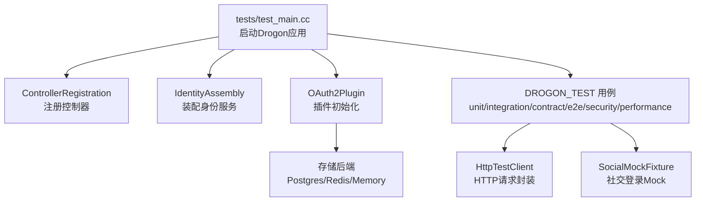
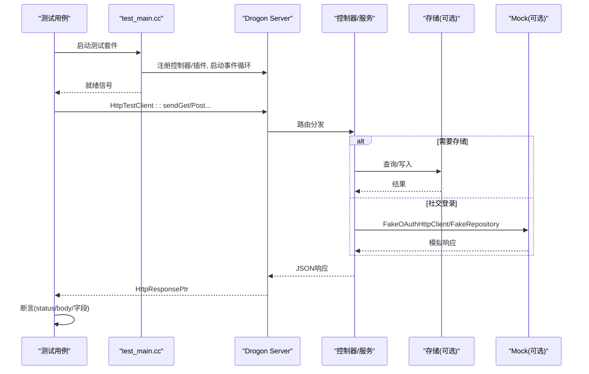
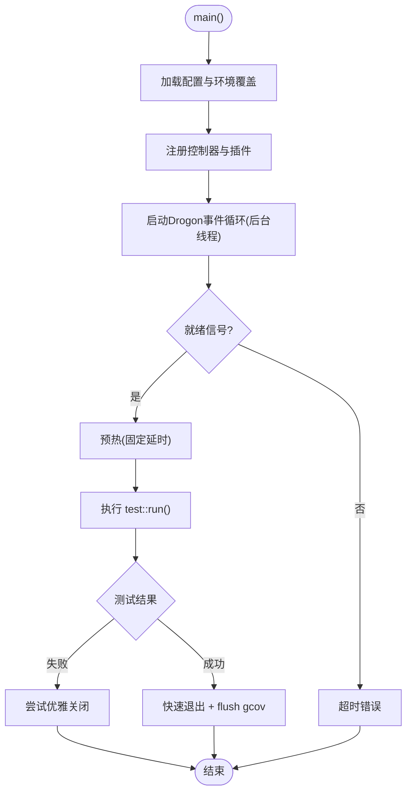
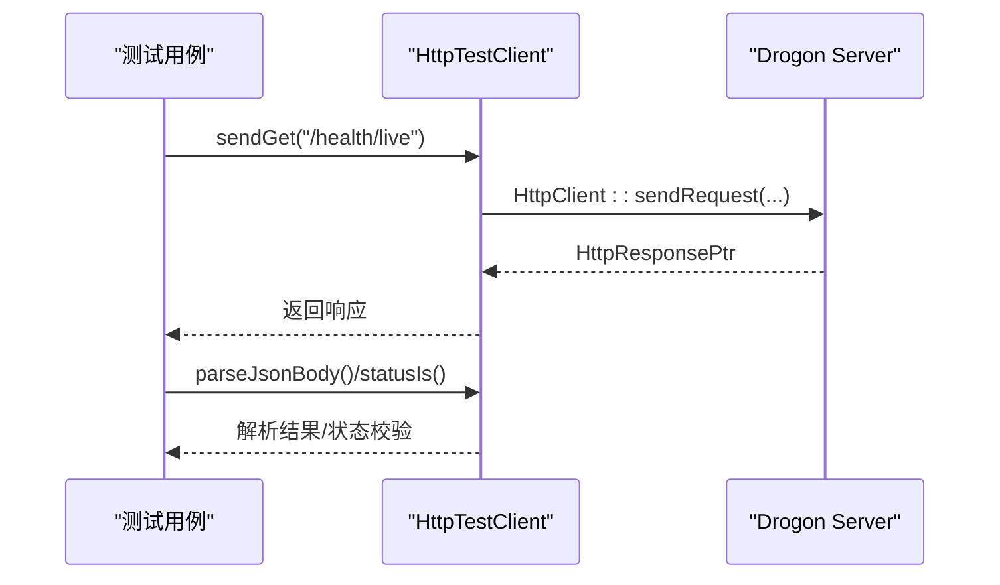
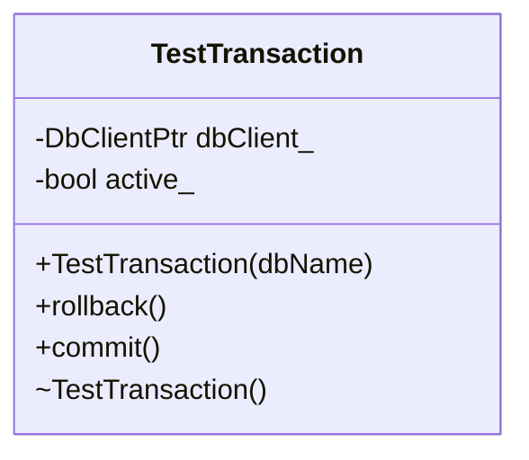
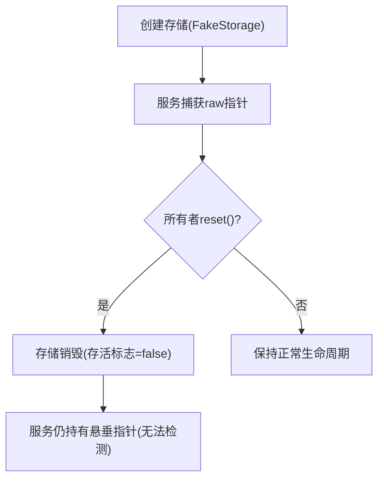
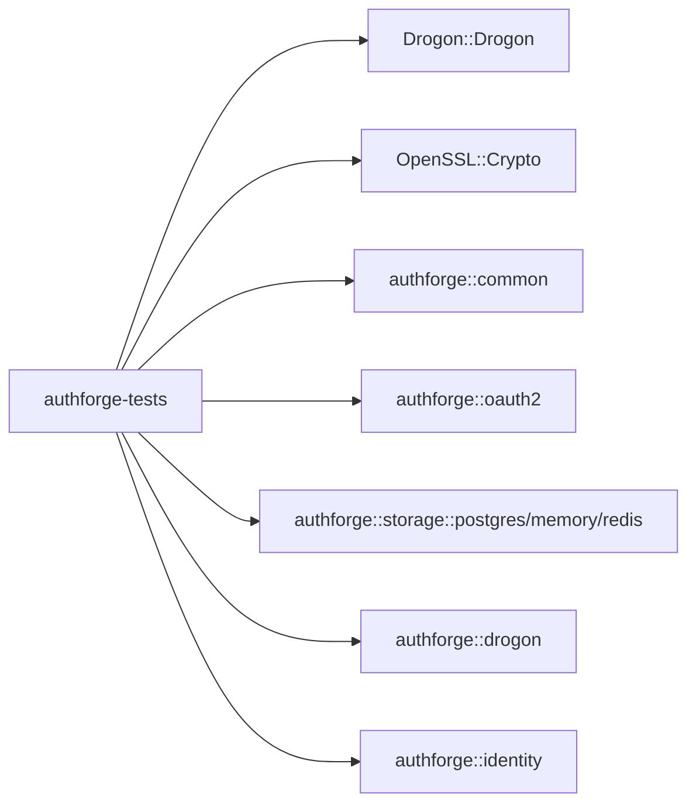

# 单元测试

<cite>
**本文引用的文件**
- [tests/test_main.cc](file://tests/test_main.cc)
- [tests/CMakeLists.txt](file://tests/CMakeLists.txt)
- [cmake/Coverage.cmake](file://cmake/Coverage.cmake)
- [tests/common/TestBase.h](file://tests/common/TestBase.h)
- [tests/common/test_categories.h](file://tests/common/test_categories.h)
- [tests/common/HttpTestClient.h](file://tests/common/HttpTestClient.h)
- [tests/common/SocialMockFixture.h](file://tests/common/SocialMockFixture.h)
- [tests/unit/config/ConfigManagerTest.cc](file://tests/unit/config/ConfigManagerTest.cc)
- [tests/integration/controllers/HealthEndpointHttpTest.cc](file://tests/integration/controllers/HealthEndpointHttpTest.cc)
- [tests/integration/concurrency/CategoryA_StorageLifetimeContractTest.cc](file://tests/integration/concurrency/CategoryA_StorageLifetimeContractTest.cc)
- [libs/oauth2/test/CMakeLists.txt](file://libs/oauth2/test/CMakeLists.txt)
</cite>

## 目录
1. [简介](#简介)
2. [项目结构](#项目结构)
3. [核心组件](#核心组件)
4. [架构总览](#架构总览)
5. [详细组件分析](#详细组件分析)
6. [依赖关系分析](#依赖关系分析)
7. [性能与覆盖率](#性能与覆盖率)
8. [故障排查指南](#故障排查指南)
9. [结论](#结论)
10. [附录](#附录)

## 简介
本文件面向AuthForge后端测试体系，系统性说明基于Drogon测试框架（DROGON_TEST）的单元测试、集成测试、契约测试、并发安全测试以及性能基准的组织方式；覆盖GTest在领域层的使用、测试分类与标签系统、断言与数据管理、Mock与第三方服务模拟、覆盖率收集与分析、以及性能基准实践。文档同时提供可操作的本地环境搭建步骤与CI集成建议。

## 项目结构
后端测试位于顶层 tests/ 目录，采用分层组织：
- unit：纯函数/工具/配置等无外部依赖或沙箱化单元
- integration：HTTP集成、控制器、存储、并发等
- contract：跨存储后端的接口契约测试（Postgres/Redis/Memory）
- e2e-backend：端到端流程
- security：注入与安全性验证
- performance：性能基准

单二进制执行入口为 tests/test_main.cc，通过CMake构建并注册所有控制器与服务，启动内嵌Drogon事件循环，再运行 DROGON_TEST 用例。

图表来源
- [tests/test_main.cc:270-455](file://tests/test_main.cc#L270-L455)
- [tests/CMakeLists.txt:100-125](file://tests/CMakeLists.txt#L100-L125)

章节来源
- [tests/test_main.cc:270-455](file://tests/test_main.cc#L270-L455)
- [tests/CMakeLists.txt:100-125](file://tests/CMakeLists.txt#L100-L125)

## 核心组件
- 测试主程序与生命周期管理：负责加载配置、注册控制器、启动事件循环、等待就绪、预热、执行测试、清理与退出策略。
- HTTP测试客户端：统一封装GET/POST/PUT/DELETE、JSON解析、状态码检查、管理员登录流程、服务器可达性探测。
- 事务与数据库回滚：RAII式事务守卫，确保测试间数据隔离。
- 测试分类与优先级：枚举定义UNIT/INTEGRATION/E2E/PERFORMANCE/SECURITY/API/DATABASE/ACCEPTANCE及P0-P3优先级。
- Mock与第三方服务模拟：社交登录控制器通过注入Fake服务避免真实网络调用。
- 覆盖率与Sanitizer：通过CMake模块启用gcov覆盖与TSan/ASan。

章节来源
- [tests/test_main.cc:270-455](file://tests/test_main.cc#L270-L455)
- [tests/common/HttpTestClient.h:61-121](file://tests/common/HttpTestClient.h#L61-L121)
- [tests/common/TestBase.h:15-78](file://tests/common/TestBase.h#L15-L78)
- [tests/common/test_categories.h:12-33](file://tests/common/test_categories.h#L12-L33)
- [tests/common/SocialMockFixture.h:1-39](file://tests/common/SocialMockFixture.h#L1-L39)
- [cmake/Coverage.cmake:34-111](file://cmake/Coverage.cmake#L34-L111)

## 架构总览
下图展示测试运行时关键交互：test_main启动Drogon应用，注册控制器与插件，启动事件循环；测试通过HttpTestClient发送HTTP请求到同一进程内的服务器；集成测试可能访问真实或内存存储；社交登录测试通过Mock替换外部服务。

图表来源
- [tests/test_main.cc:384-455](file://tests/test_main.cc#L384-L455)
- [tests/common/HttpTestClient.h:134-249](file://tests/common/HttpTestClient.h#L134-L249)
- [tests/common/SocialMockFixture.h:1-39](file://tests/common/SocialMockFixture.h#L1-L39)

## 详细组件分析

### 测试主程序与生命周期（test_main.cc）
- 配置加载与环境变量覆盖：支持从相对路径查找config.json，按存储类型决定是否应用DB/Redis环境变量覆盖，生成运行时配置并写入临时文件。
- 控制器注册：显式注册健康、OAuth2、Admin、Discovery等控制器，确保OpenAPI文档初始化。
- 事件循环与就绪握手：使用promise/future等待Drogon准备就绪，设置预热线程延迟以稳定启动。
- 测试执行与退出：成功时快速退出以避免框架析构问题，失败时尝试优雅关闭以便诊断。
- 覆盖率支持：在启用gcov时，于退出前手动flush gcov计数器。

图表来源
- [tests/test_main.cc:270-455](file://tests/test_main.cc#L270-L455)
- [cmake/Coverage.cmake:82-111](file://cmake/Coverage.cmake#L82-L111)

章节来源
- [tests/test_main.cc:270-455](file://tests/test_main.cc#L270-L455)

### HTTP集成测试客户端（HttpTestClient.h）
- 服务器可达性探测：轮询 /health/live，容忍慢启动。
- 存储可用性判断：根据插件存储类型跳过需DB的路径。
- 请求构造器：GET/DELETE/POST表单/POST JSON/PUT JSON，统一超时与异常处理。
- 响应解析与断言辅助：JSON解析、状态码检查。
- 管理员登录流程：两步授权码换取access_token，便于鉴权测试。

图表来源
- [tests/common/HttpTestClient.h:84-121](file://tests/common/HttpTestClient.h#L84-L121)
- [tests/common/HttpTestClient.h:134-249](file://tests/common/HttpTestClient.h#L134-L249)

章节来源
- [tests/common/HttpTestClient.h:61-121](file://tests/common/HttpTestClient.h#L61-L121)
- [tests/common/HttpTestClient.h:134-249](file://tests/common/HttpTestClient.h#L134-L249)

### 事务与数据隔离（TestBase.h）
- TestTransaction：RAII事务守卫，构造BEGIN，析构ROLLBACK，支持显式COMMIT。
- 适用场景：集成测试中保证每次测试的数据变更不污染其他用例。

图表来源
- [tests/common/TestBase.h:15-78](file://tests/common/TestBase.h#L15-L78)

章节来源
- [tests/common/TestBase.h:15-78](file://tests/common/TestBase.h#L15-L78)

### 测试分类与标签（test_categories.h）
- 类别：UNIT/INTEGRATION/E2E/PERFORMANCE/SECURITY/API/DATABASE/ACCEPTANCE
- 优先级：P0/P1/P2/P3
- 用途：用于测试命名约定、选择性执行、报告分组与CI矩阵筛选。

章节来源
- [tests/common/test_categories.h:12-33](file://tests/common/test_categories.h#L12-L33)

### 配置管理测试（ConfigManagerTest.cc）
- 覆盖点：
  - 读取有效配置文件并校验结构
  - 类型安全访问与默认值
  - 必填字段缺失校验
  - 端口范围校验
  - 环境变量覆盖（DB主机、CORS数组、Google重定向、Vue重定向按名称查找）
- 存储模式感知：在memory模式下跳过依赖DB的用例。

章节来源
- [tests/unit/config/ConfigManagerTest.cc:16-177](file://tests/unit/config/ConfigManagerTest.cc#L16-L177)

### 健康端点集成测试（HealthEndpointHttpTest.cc）
- 覆盖点：
  - /health/live 始终200
  - /health 返回存储类型与健康信息
  - /health/ready 在不同存储模式下返回合理状态
- 使用HttpTestClient进行请求与解析。

章节来源
- [tests/integration/controllers/HealthEndpointHttpTest.cc:31-94](file://tests/integration/controllers/HealthEndpointHttpTest.cc#L31-L94)

### 并发与生命周期契约测试（CategoryA_StorageLifetimeContractTest.cc）
- 目标：文档化原始代码中unique_ptr存储与持有者raw指针之间的生命周期脆弱性，并通过shared_ptr模型对比修复后的不变量。
- 方法：构造最小模型，观察重置所有者后持有者的悬垂指针窗口，但不实际解引用，避免未定义行为。

图表来源
- [tests/integration/concurrency/CategoryA_StorageLifetimeContractTest.cc:47-128](file://tests/integration/concurrency/CategoryA_StorageLifetimeContractTest.cc#L47-L128)

章节来源
- [tests/integration/concurrency/CategoryA_StorageLifetimeContractTest.cc:1-157](file://tests/integration/concurrency/CategoryA_StorageLifetimeContractTest.cc#L1-L157)

### Mock对象与第三方服务模拟（SocialMockFixture.h）
- 机制：通过控制器单例的setXxxService注入真实服务实例，但服务内部使用FakeOAuthHttpClient/FakeSocialAccountRepository，避免真实网络。
- 生命周期：静态共享指针保证服务在整个测试期间有效，避免use-after-free。
- 线程安全：注意在主线程设置服务指针，可能与事件循环线程读指针存在竞争，不适合ThreadSanitizer运行。

章节来源
- [tests/common/SocialMockFixture.h:1-39](file://tests/common/SocialMockFixture.h#L1-L39)

### 领域层GTest测试（libs/oauth2/test/CMakeLists.txt）
- 目的：对Domain层（authforge::oauth2）使用GTest进行纯单元测试，不依赖Drogon。
- 构建：find_package(GTest)，链接GTest::gtest与GTest::Main，启用gcov与兼容性宏。

章节来源
- [libs/oauth2/test/CMakeLists.txt:1-30](file://libs/oauth2/test/CMakeLists.txt#L1-L30)

## 依赖关系分析
- 测试二进制依赖：
  - Drogon::Drogon（框架）
  - OpenSSL::Crypto（加密）
  - authforge::*（common/oauth2/storage-*/drogon/identity）
- 测试源组织：
  - 根测试源 + SchemaManager + Bootstrap + Organization 源码编译进测试目标
  - 各层级测试通过GLOB收集
- 契约测试：
  - 通过CTest add_test逐个注册，打上“Contract”标签，支持ctest -L Contract选择执行

图表来源
- [tests/CMakeLists.txt:118-125](file://tests/CMakeLists.txt#L118-L125)
- [tests/CMakeLists.txt:66-98](file://tests/CMakeLists.txt#L66-L98)
- [tests/CMakeLists.txt:188-321](file://tests/CMakeLists.txt#L188-L321)

章节来源
- [tests/CMakeLists.txt:66-125](file://tests/CMakeLists.txt#L66-L125)
- [tests/CMakeLists.txt:188-321](file://tests/CMakeLists.txt#L188-L321)

## 性能与覆盖率

### 覆盖率收集与分析
- 启用方式：
  - 顶层选项 OAUTH2_TEST_COVERAGE=ON
  - 每个目标调用 oauth2_apply_gcov(target) 将 -fprofile-arcs -ftest-coverage 应用于编译与链接
  - 仅在GCC/Clang生效，MSVC忽略并警告
  - 为测试目标定义 AUTHFORGE_GCOV_INSTRUMENTED，配合测试主程序中的__gcov_dump/flush
- 注意事项：
  - 建议在Debug构建下运行以获得更准确的行号映射
  - 覆盖率统计包含被测库与测试自身编译的代码

章节来源
- [cmake/Coverage.cmake:34-111](file://cmake/Coverage.cmake#L34-L111)
- [tests/test_main.cc:25-46](file://tests/test_main.cc#L25-L46)
- [tests/CMakeLists.txt:177-184](file://tests/CMakeLists.txt#L177-L184)

### 性能基准测试
- 位置：tests/performance/benchmark/PerformanceBenchmark.cc
- 目标：对关键路径进行基准测量，结合负载与吞吐指标评估优化效果
- 建议：
  - 使用独立构建与预热阶段减少噪声
  - 记录基线并在PR中对比差异
  - 与覆盖率/ASAN/TSAN分开运行，避免干扰

[本节为通用指导，不直接分析具体文件]

## 故障排查指南
- 启动超时：
  - 检查配置路径与环境变量覆盖是否正确
  - 确认/health/live可达
- 存储不可用：
  - postgresAvailable()返回false时跳过需DB的用例
  - 检查Postgres/Redis容器是否启动
- 社交登录测试失败：
  - 确认已注入Fake服务且队列中有预期响应
  - 注意GitHub happy-path在memory模式下会崩溃，应跳过或仅发送错误路径
- 覆盖率缺失：
  - 确认OAUTH2_TEST_COVERAGE=ON且目标调用了oauth2_apply_gcov
  - 检查__gcov_dump/flush是否被调用
- 并发问题：
  - 使用TSan/ASan定位数据竞争与内存错误
  - CategoryB测试用于复现竞态条件

章节来源
- [tests/common/HttpTestClient.h:84-121](file://tests/common/HttpTestClient.h#L84-L121)
- [tests/common/SocialMockFixture.h:1-39](file://tests/common/SocialMockFixture.h#L1-L39)
- [cmake/Coverage.cmake:34-111](file://cmake/Coverage.cmake#L34-L111)

## 结论
AuthForge后端测试体系以DROGON_TEST为核心，结合GTest覆盖领域层，形成完整的单元、集成、契约、并发与安全测试矩阵。通过统一的HTTP客户端、事务隔离、Mock注入与CMake驱动的覆盖率/ sanitizer，实现了高可靠、可维护、可扩展的测试基础设施。建议在开发中遵循分类与优先级约定，持续补充契约与并发测试，利用覆盖率与基准驱动质量提升。

## 附录

### 测试环境搭建指南
- 依赖安装：
  - CMake >= 3.21
  - GCC/Clang（Linux/macOS），MSVC（Windows）
  - Drogon框架与OpenSSL
  - Postgres/Redis（集成测试需要）
- 构建与运行：
  - 配置OAUTH2_TEST_COVERAGE=ON以启用覆盖率
  - 构建测试目标并执行 ctest
  - 使用scripts/backend下的脚本启动数据库与运行API测试

[本节为通用指导，不直接分析具体文件]

### 测试分类与标签使用
- 类别：UNIT/INTEGRATION/E2E/PERFORMANCE/SECURITY/API/DATABASE/ACCEPTANCE
- 优先级：P0/P1/P2/P3
- 标签：Contract标签用于契约测试集合，可通过ctest -L Contract选择执行

章节来源
- [tests/common/test_categories.h:12-33](file://tests/common/test_categories.h#L12-L33)
- [tests/CMakeLists.txt:188-321](file://tests/CMakeLists.txt#L188-L321)

### Mock与第三方服务模拟技术
- 社交登录：通过SocialMockFixture注入Fake服务，避免真实网络
- 存储后端：Memory模式用于无需DB的快速测试；Postgres/Redis用于真实集成
- 契约测试：跨存储实现一致性验证

章节来源
- [tests/common/SocialMockFixture.h:1-39](file://tests/common/SocialMockFixture.h#L1-L39)
- [tests/common/HttpTestClient.h:117-121](file://tests/common/HttpTestClient.h#L117-L121)