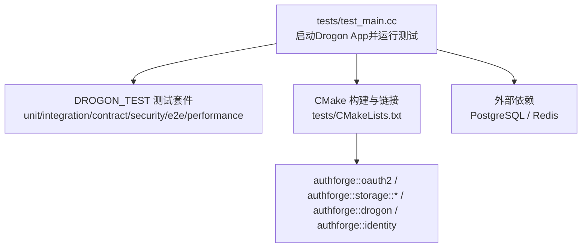
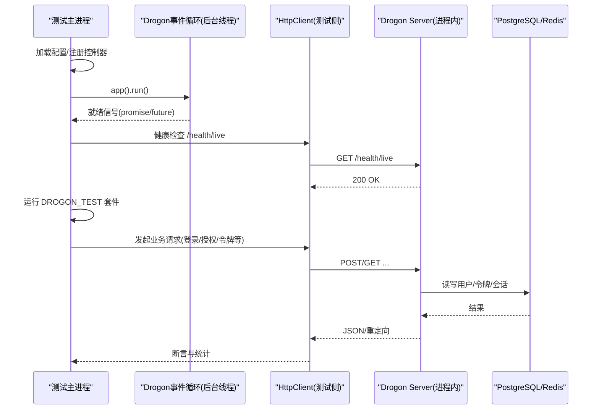
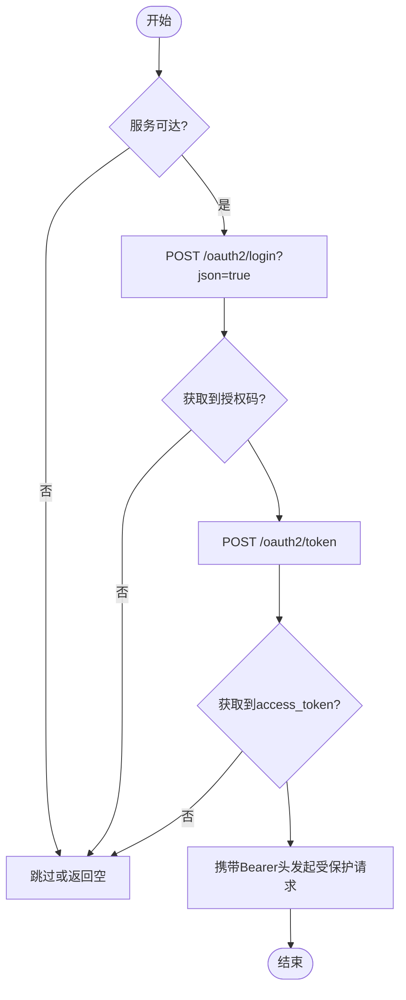
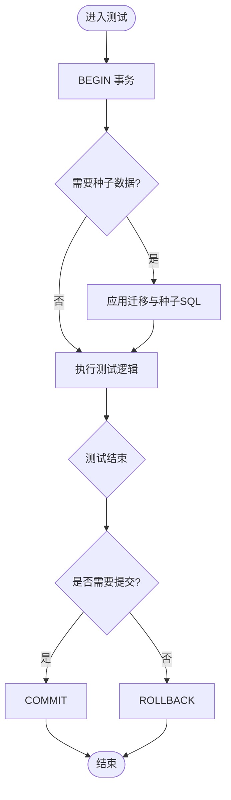
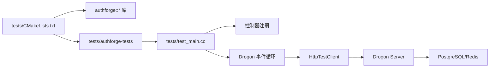

# 后端测试

<cite>
**本文引用的文件**
- [tests/test_main.cc](file://tests/test_main.cc)
- [tests/CMakeLists.txt](file://tests/CMakeLists.txt)
- [tests/common/TestBase.h](file://tests/common/TestBase.h)
- [tests/common/HttpTestClient.h](file://tests/common/HttpTestClient.h)
- [tests/common/StorageSeed.h](file://tests/common/StorageSeed.h)
- [tests/contract/ContractFixtures.h](file://tests/contract/ContractFixtures.h)
- [scripts/backend/full-test.sh](file://scripts/backend/full-test.sh)
- [scripts/backend/test.sh](file://scripts/backend/test.sh)
- [scripts/backend/setup-database.sh](file://scripts/backend/setup-database.sh)
- [cmake/Coverage.cmake](file://cmake/Coverage.cmake)
- [docs/backend/testing-guide.md](file://docs/backend/testing-guide.md)
- [tests/e2e-backend/oauth2_flows/OAuth2FlowE2ETest.cc](file://tests/e2e-backend/oauth2_flows/OAuth2FlowE2ETest.cc)
- [tests/performance/benchmark/PerformanceBenchmark.cc](file://tests/performance/benchmark/PerformanceBenchmark.cc)
</cite>

## 目录
1. [简介](#简介)
2. [项目结构](#项目结构)
3. [核心组件](#核心组件)
4. [架构总览](#架构总览)
5. [详细组件分析](#详细组件分析)
6. [依赖关系分析](#依赖关系分析)
7. [性能与覆盖率](#性能与覆盖率)
8. [故障排查指南](#故障排查指南)
9. [结论](#结论)
10. [附录](#附录)

## 简介
本文件面向 AuthForge 后端的测试体系，系统性说明：
- C++ 单元测试框架（GTest）与 DROGON_TEST 的使用方式、配置与组织
- 集成测试执行方式（HTTP 端点、数据库集成、第三方服务模拟）
- 契约测试实现（跨存储后端一致性）
- E2E 后端测试（OAuth2 端到端流程验证）
- 测试环境搭建（PostgreSQL、Redis）
- 覆盖率收集与分析方法
- 调试技巧与性能基准测试使用方法

## 项目结构
后端测试以“单可执行文件 + 分层用例”的方式组织：
- 主测试二进制 tests/authforge-tests：基于 DROGON_TEST，包含单元、契约、集成、安全、E2E、性能等全部层级
- 按库的 GTest 二进制：libs/* 下的 Domain 层纯单元测试（无 Drogon/DB），通过各自 test/CMakeLists.txt 注册为独立 ctest 条目
- 统一入口与启动：tests/test_main.cc 在进程内启动 Drogon App，等待就绪后运行测试套件
- 构建与脚本：tests/CMakeLists.txt 聚合所有测试源；scripts/backend/* 提供一键构建+测试+API 校验流程

图表来源
- [tests/test_main.cc:270-455](file://tests/test_main.cc#L270-L455)
- [tests/CMakeLists.txt:66-125](file://tests/CMakeLists.txt#L66-L125)

章节来源
- [tests/test_main.cc:270-455](file://tests/test_main.cc#L270-L455)
- [tests/CMakeLists.txt:66-125](file://tests/CMakeLists.txt#L66-L125)

## 核心组件
- 测试主程序与生命周期管理
  - 加载配置、覆盖环境变量、注册控制器、启动事件循环、预热、运行测试、清理
- HTTP 测试客户端
  - 统一的请求构造、发送、响应解析、管理员登录流程封装
- 数据库种子与事务保护
  - 迁移与种子数据注入、RAII 事务回滚保证测试隔离
- 契约测试夹具
  - 后端可用性探测、异步回调等待、唯一标识生成
- 构建与运行脚本
  - 一键全量测试、双配置运行、数据库初始化

章节来源
- [tests/test_main.cc:270-455](file://tests/test_main.cc#L270-L455)
- [tests/common/HttpTestClient.h:61-121](file://tests/common/HttpTestClient.h#L61-L121)
- [tests/common/StorageSeed.h:104-191](file://tests/common/StorageSeed.h#L104-L191)
- [tests/contract/ContractFixtures.h:96-144](file://tests/contract/ContractFixtures.h#L96-L144)
- [scripts/backend/full-test.sh:51-144](file://scripts/backend/full-test.sh#L51-L144)

## 架构总览
测试运行时，主进程启动一个后台线程运行 Drogon 事件循环，并在主线程调用测试运行器。测试通过 HttpClient 向同一进程内的服务器发起请求，访问 OAuth2 端点、管理端点等。

图表来源
- [tests/test_main.cc:384-455](file://tests/test_main.cc#L384-L455)
- [tests/common/HttpTestClient.h:84-105](file://tests/common/HttpTestClient.h#L84-L105)

## 详细组件分析

### 测试主程序与生命周期
- 配置加载与环境变量覆盖
  - 支持 OAUTH2_DB_*、OAUTH2_REDIS_*、OAUTH2_VUE_CLIENT_SECRET 等环境变量动态覆盖
  - 将运行时配置写入临时文件供 Drogon 加载
- 控制器注册与 API 文档初始化
  - 显式注册各控制器，确保 OpenAPI 文档可用
- 事件循环启动与就绪同步
  - 使用 promise/future 等待 app().run() 就绪，超时退出
- 测试执行与快速退出
  - 成功时 fast-exit 避免框架销毁阶段崩溃；失败时尝试优雅关闭
- 覆盖率 flush
  - 在 _Exit 前手动调用 __gcov_dump/__gcov_flush，确保 .gcda 计数正确

章节来源
- [tests/test_main.cc:147-268](file://tests/test_main.cc#L147-L268)
- [tests/test_main.cc:270-455](file://tests/test_main.cc#L270-L455)
- [tests/test_main.cc:459-535](file://tests/test_main.cc#L459-L535)

### HTTP 集成测试客户端
- 基础 URL 与可达性检测
  - 固定 kTestBaseUrl，轮询 /health/live 确认服务就绪
- 存储类型守卫
  - postgresAvailable() 判断是否启用真实存储（非 memory）
- 请求构造与发送
  - sendGet/sendDelete/sendPostForm/sendPostJson/sendPutJson
  - 自动附加 Authorization: Bearer 头
- 响应解析与状态断言
  - parseJsonBody、statusIs
- 管理员登录流程
  - loginAsAdmin() 两步法：/oauth2/login -> /oauth2/token，返回 access_token
- 便捷认证包装
  - authedGet/authedPostJson/authedPutJson/authedDelete

图表来源
- [tests/common/HttpTestClient.h:84-121](file://tests/common/HttpTestClient.h#L84-L121)
- [tests/common/HttpTestClient.h:134-279](file://tests/common/HttpTestClient.h#L134-L279)
- [tests/common/HttpTestClient.h:331-377](file://tests/common/HttpTestClient.h#L331-L377)

章节来源
- [tests/common/HttpTestClient.h:61-424](file://tests/common/HttpTestClient.h#L61-L424)

### 数据库种子与事务保护
- 事务保护 TestTransaction
  - RAII 风格，析构时 ROLLBACK，支持显式 COMMIT
- 进程内种子注入 StorageSeed
  - 应用 migrations 与 seed SQL（dev_admin_user、dev_*.sql）
  - 重置 admin 账户锁定状态，保证后续测试稳定
  - Memory 模式直接跳过，Memory 侧由插件自行初始化

图表来源
- [tests/common/TestBase.h:15-78](file://tests/common/TestBase.h#L15-L78)
- [tests/common/StorageSeed.h:104-191](file://tests/common/StorageSeed.h#L104-L191)

章节来源
- [tests/common/TestBase.h:15-78](file://tests/common/TestBase.h#L15-L78)
- [tests/common/StorageSeed.h:104-191](file://tests/common/StorageSeed.h#L104-L191)

### 契约测试夹具与跨后端一致性
- 后端可用性探测
  - getPostgresClientOrNull()/getRedisClientOrNull() 在 memory-only 下返回 nullptr，测试安全跳过
- 异步回调等待
  - waitForValue/waitForVoid 封装 promise/future 等待，统一超时策略
- 唯一标识与时间戳
  - uniqueSuffix()/nowSeconds() 避免重复运行冲突
- 命名约定与标签
  - 每个后端 x 每种仓储行为生成独立 DROGON_TEST 名称，便于 ctest -L Contract 筛选

章节来源
- [tests/contract/ContractFixtures.h:96-144](file://tests/contract/ContractFixtures.h#L96-L144)
- [tests/contract/ContractFixtures.h:166-194](file://tests/contract/ContractFixtures.h#L166-L194)
- [tests/contract/ContractFixtures.h:211-224](file://tests/contract/ContractFixtures.h#L211-L224)
- [tests/CMakeLists.txt:188-321](file://tests/CMakeLists.txt#L188-L321)

### E2E 后端测试（OAuth2 端到端）
- 完整授权码流程
  - 注册用户 -> 授权请求 -> 令牌交换 -> UserInfo 验证
  - 内存模式自动跳过，需真实 Postgres/Redis
- 错误路径与边界条件
  - 无效授权码、缺失参数、MFA 场景等
- 清理与幂等
  - 测试结束后删除测试用户，避免污染

章节来源
- [tests/e2e-backend/oauth2_flows/OAuth2FlowE2ETest.cc:17-200](file://tests/e2e-backend/oauth2_flows/OAuth2FlowE2ETest.cc#L17-L200)

### 性能基准测试
- Subject 生成与解析压力测试
  - 统计平均延迟、P95 延迟，设定阈值断言
- 用于回归与优化基线对比

章节来源
- [tests/performance/benchmark/PerformanceBenchmark.cc:11-77](file://tests/performance/benchmark/PerformanceBenchmark.cc#L11-L77)

## 依赖关系分析
- 构建期
  - tests/CMakeLists.txt 聚合 unit/integration/e2e/security/performance/contract 源码
  - 链接 authforge::common、authforge::oauth2、authforge::storage::postgres、authforge::storage::memory、authforge::drogon、authforge::identity
  - 复制配置文件至测试工作目录
- 运行期
  - test_main.cc 启动 Drogon App，注册控制器，等待就绪
  - HttpTestClient 通过 HttpClient 与进程内服务器通信
  - StorageSeed 通过 SchemaManager 应用迁移与种子数据
  - ContractFixtures 根据存储类型选择后端或跳过

图表来源
- [tests/CMakeLists.txt:66-125](file://tests/CMakeLists.txt#L66-L125)
- [tests/test_main.cc:305-382](file://tests/test_main.cc#L305-L382)
- [tests/common/HttpTestClient.h:134-279](file://tests/common/HttpTestClient.h#L134-L279)

章节来源
- [tests/CMakeLists.txt:66-125](file://tests/CMakeLists.txt#L66-L125)
- [tests/test_main.cc:305-382](file://tests/test_main.cc#L305-L382)
- [tests/common/HttpTestClient.h:134-279](file://tests/common/HttpTestClient.h#L134-L279)

## 性能与覆盖率

### 覆盖率收集与分析
- 编译期启用
  - cmake/Coverage.cmake 提供 oauth2_apply_gcov(target)，为每个目标添加 -fprofile-arcs -ftest-coverage 并链接 libgcov（GCC）
- 运行期 flush
  - tests/test_main.cc 在 std::_Exit 前调用 __gcov_dump/__gcov_flush，确保计数器写入 .gcda
- 聚合与报告
  - 推荐使用 scripts/measure_coverage.py 聚合 gcov JSON，绕过 gcovr 路径匹配问题
  - 需依次运行全部 5 个测试二进制后再聚合

章节来源
- [cmake/Coverage.cmake:34-111](file://cmake/Coverage.cmake#L34-L111)
- [tests/test_main.cc:25-46](file://tests/test_main.cc#L25-L46)
- [docs/backend/testing-guide.md:246-296](file://docs/backend/testing-guide.md#L246-L296)

### 性能基准测试使用
- 运行位置：tests/performance/benchmark/PerformanceBenchmark.cc
- 指标：平均延迟、P95 延迟、总耗时
- 用途：回归检测、优化前后对比

章节来源
- [tests/performance/benchmark/PerformanceBenchmark.cc:11-77](file://tests/performance/benchmark/PerformanceBenchmark.cc#L11-L77)

## 故障排查指南
- 服务不可用
  - 检查 PostgreSQL/Redis 是否启动且端口可达
  - 使用 serverReachable() 探测 /health/live
- 登录失败
  - 确认用户名密码、client_id、redirect_uri 一致
  - 检查 admin 账户是否被锁定（StorageSeed 会重置）
- 令牌交换失败
  - 授权码一次性有效，注意时效与顺序
- 内存模式跳过
  - memory-only 下部分测试会 skip，属预期行为
- 日志与调试
  - 调整 config.json 中 log_level 为 DEBUG/TRACE
  - 实时查看 drogon.log

章节来源
- [tests/common/HttpTestClient.h:84-121](file://tests/common/HttpTestClient.h#L84-L121)
- [tests/common/StorageSeed.h:169-189](file://tests/common/StorageSeed.h#L169-L189)
- [docs/backend/testing-guide.md:332-343](file://docs/backend/testing-guide.md#L332-L343)

## 结论
AuthForge 后端测试采用“单可执行 + 分层用例”的统一架构，结合 DROGON_TEST 与 GTest，覆盖从单元到 E2E 的全链路质量保障。通过契约测试确保存储接口一致性，借助进程内启动与 HTTP 客户端简化集成测试复杂度，配合完善的脚本与覆盖率工具链，形成可维护、可扩展的测试体系。

## 附录

### 测试环境搭建（PostgreSQL 与 Redis）
- 前置要求
  - PostgreSQL：localhost:5432，数据库 oauth2_db，用户 oauth2_user，密码 123456
  - Redis：localhost:6379，密码 123456
- 快速启动（Docker）
  - 分别启动 postgres:15-alpine 与 redis:7-alpine 容器
- 数据库初始化
  - 使用 scripts/backend/setup-database.sh 创建数据库、应用迁移与种子数据
- 环境变量覆盖
  - 通过 OAUTH2_DB_*、OAUTH2_REDIS_* 等环境变量动态覆盖配置

章节来源
- [docs/backend/testing-guide.md:7-20](file://docs/backend/testing-guide.md#L7-L20)
- [scripts/backend/setup-database.sh:1-66](file://scripts/backend/setup-database.sh#L1-L66)

### 测试执行方式
- CTest（推荐）
  - 在构建目录下执行 ctest，默认仅输出失败用例与汇总
- 直接运行测试可执行文件
  - 无需手动启动后端服务，测试主程序会自动启动 Drogon App
- manage 脚本
  - 封装构建+测试+API 校验的一键流程

章节来源
- [docs/backend/testing-guide.md:90-125](file://docs/backend/testing-guide.md#L90-L125)
- [scripts/backend/test.sh:43-81](file://scripts/backend/test.sh#L43-L81)
- [scripts/backend/full-test.sh:51-144](file://scripts/backend/full-test.sh#L51-L144)