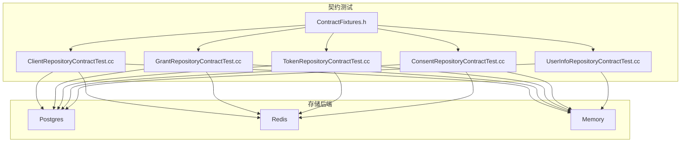
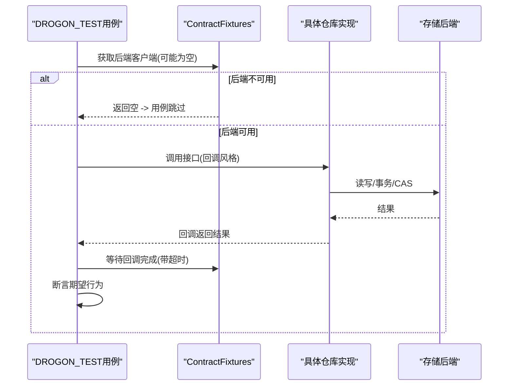
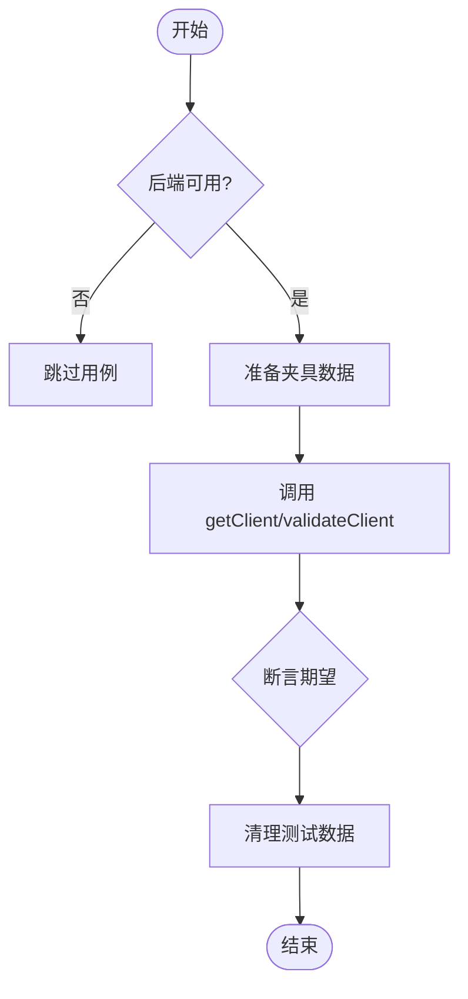
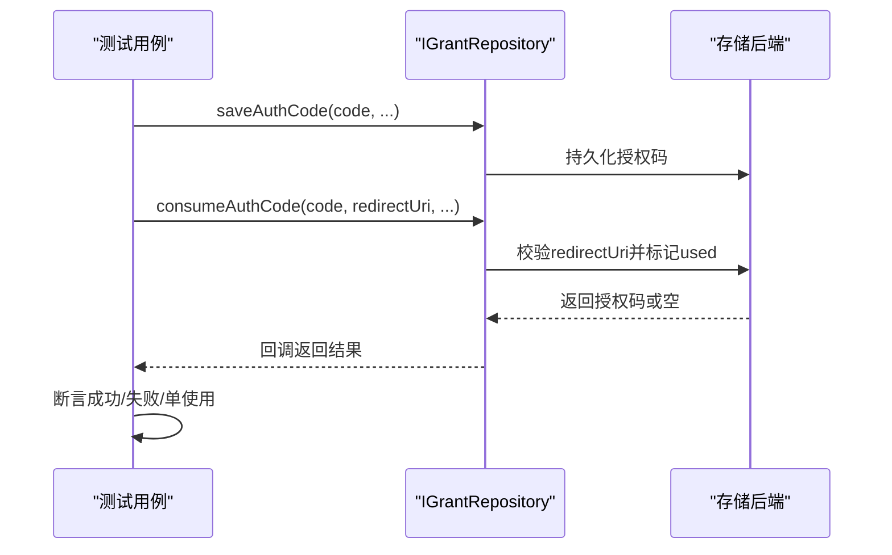
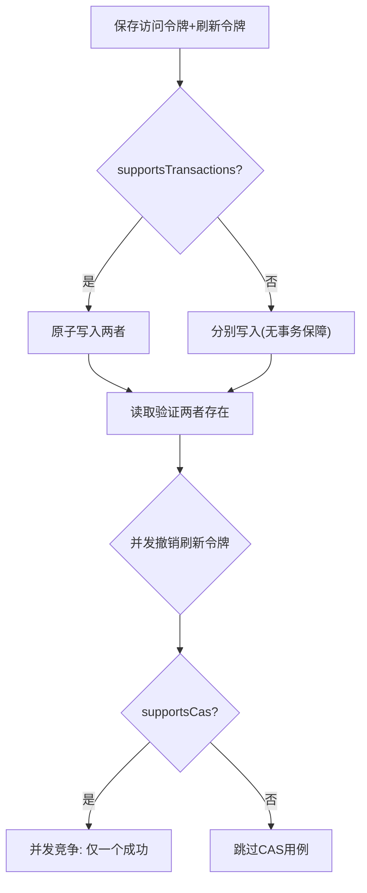
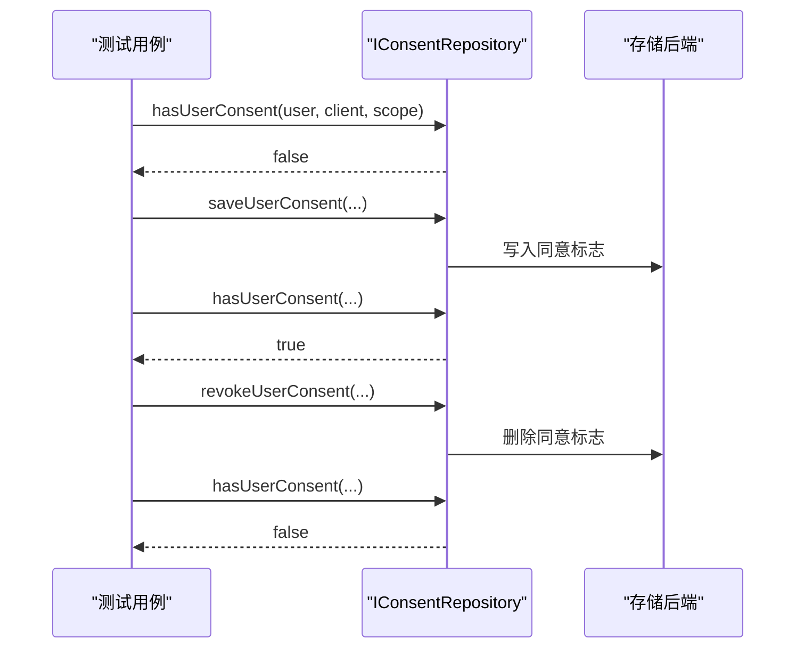
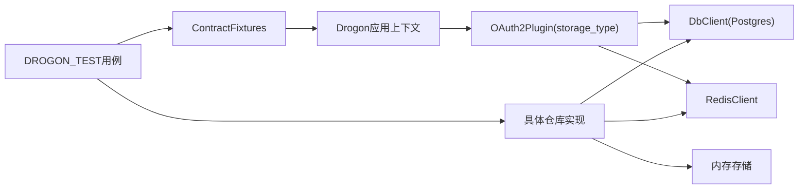

# 契约测试

<cite>
**本文引用的文件**
- [ContractFixtures.h](file://tests/contract/ContractFixtures.h)
- [ClientRepositoryContractTest.cc](file://tests/contract/ClientRepositoryContractTest.cc)
- [ConsentRepositoryContractTest.cc](file://tests/contract/ConsentRepositoryContractTest.cc)
- [GrantRepositoryContractTest.cc](file://tests/contract/GrantRepositoryContractTest.cc)
- [TokenRepositoryContractTest.cc](file://tests/contract/TokenRepositoryContractTest.cc)
- [UserInfoRepositoryContractTest.cc](file://tests/contract/UserInfoRepositoryContractTest.cc)
- [config.ci.json](file://apps/server/config/config.ci.json)
- [full-test.sh](file://scripts/backend/full-test.sh)
- [docker-compose.debug.yml](file://deploy/docker/docker-compose.debug.yml)
- [CMakeLists.txt](file://tests/CMakeLists.txt)
</cite>

## 目录
1. [简介](#简介)
2. [项目结构](#项目结构)
3. [核心组件](#核心组件)
4. [架构总览](#架构总览)
5. [详细组件分析](#详细组件分析)
6. [依赖关系分析](#依赖关系分析)
7. [性能与并发特性](#性能与并发特性)
8. [故障排查指南](#故障排查指南)
9. [结论](#结论)
10. [附录：执行环境与CI集成](#附录执行环境ci集成)

## 简介
本文件系统化说明 AuthForge 后端存储接口契约测试的设计与实现，覆盖客户端仓库、同意仓库、授权码仓库、令牌仓库和用户信息仓库的跨后端一致性验证。重点包括：
- 统一夹具与异步回调等待机制，确保对 Postgres、Redis、Memory 三种存储后端的一致性断言
- 针对各仓库接口的“真实行为”契约断言，诚实记录并隔离后端差异（如 Redis 刷新令牌无持久化、Postgres 读取不过期过滤等）
- 原子性/事务能力门控测试（supportsCas / supportsTransactions），避免“能力谎报”
- 测试数据夹具准备与清理策略，保证重复运行不冲突
- 在持续集成中的可插拔执行方式与配置方法

## 项目结构
契约测试位于 tests/contract 目录，采用“共享断言函数 + 每后端独立 DROGON_TEST 用例”的模式，形成 N 后端 × M 行为的矩阵式覆盖。关键组织方式：
- ContractFixtures.h：提供后端可用性探测、异步回调等待、唯一后缀生成等通用能力
- 每个仓库一个契约测试文件：封装共享断言函数，并在 Postgres/Redis/Memory 三段分别注册用例
- CMake 层集中声明契约测试名称集合，便于按标签筛选执行

图表来源
- [ContractFixtures.h:58-227](file://tests/contract/ContractFixtures.h#L58-L227)
- [ClientRepositoryContractTest.cc:1-410](file://tests/contract/ClientRepositoryContractTest.cc#L1-L410)
- [GrantRepositoryContractTest.cc:1-509](file://tests/contract/GrantRepositoryContractTest.cc#L1-L509)
- [TokenRepositoryContractTest.cc:1-936](file://tests/contract/TokenRepositoryContractTest.cc#L1-L936)
- [ConsentRepositoryContractTest.cc:1-217](file://tests/contract/ConsentRepositoryContractTest.cc#L1-L217)
- [UserInfoRepositoryContractTest.cc:1-427](file://tests/contract/UserInfoRepositoryContractTest.cc#L1-L427)

章节来源
- [ContractFixtures.h:58-227](file://tests/contract/ContractFixtures.h#L58-L227)
- [CMakeLists.txt:201-218](file://tests/CMakeLists.txt#L201-L218)

## 核心组件
- 后端可用性探测
  - getPostgresClientOrNull()：当 storage_type=memory 或未配置 db_clients 时返回空指针，用例直接跳过而非崩溃
  - getRedisClientOrNull()：同理保护 Redis 客户端获取，避免内存模式下的进程级 assert 崩溃
- 异步回调等待器
  - waitForValue<T>() / waitForVoid()：将回调风格 API 包装为阻塞等待，超时抛出异常，匹配现有存储测试约定
- 唯一标识与时间工具
  - uniqueSuffix()：基于高精度时间与线程ID生成唯一后缀，避免跨运行数据碰撞
  - nowSeconds()：统一时间戳来源，用于 TTL/过期判断

章节来源
- [ContractFixtures.h:72-144](file://tests/contract/ContractFixtures.h#L72-L144)
- [ContractFixtures.h:158-194](file://tests/contract/ContractFixtures.h#L158-L194)
- [ContractFixtures.h:211-224](file://tests/contract/ContractFixtures.h#L211-L224)

## 架构总览
契约测试通过统一的夹具与断言函数，对 IClientRepository、IGrantRepository、ITokenRepository、IConsentRepository、IUserRepository 的行为进行跨后端验证。不同后端以“能力门控 + 真实行为断言”的方式呈现：
- 能力门控：如 supportsCas()/supportsTransactions() 决定是否执行 CAS/事务相关用例
- 真实行为：如实记录并断言各后端当前实现差异（例如 Redis 刷新令牌保存为空操作、Postgres 读取不过期过滤）

图表来源
- [ContractFixtures.h:72-144](file://tests/contract/ContractFixtures.h#L72-L144)
- [ContractFixtures.h:158-194](file://tests/contract/ContractFixtures.h#L158-L194)
- [ClientRepositoryContractTest.cc:189-229](file://tests/contract/ClientRepositoryContractTest.cc#L189-L229)
- [GrantRepositoryContractTest.cc:192-251](file://tests/contract/GrantRepositoryContractTest.cc#L192-L251)
- [TokenRepositoryContractTest.cc:128-176](file://tests/contract/TokenRepositoryContractTest.cc#L128-L176)

## 详细组件分析

### 客户端仓库契约测试（IClientRepository）
- 目标行为
  - 未注册客户端：getClient 返回空；validateClient 返回 false
  - PUBLIC 客户端：接受任意 secret（含空串）
  - CONFIDENTIAL 客户端：正确 secret 通过，错误/空 secret 失败
  - Redis 特例：validateClient 无 client_type 分支，空 secret 走 EXISTS 检查，非空 secret 走哈希比较
- 夹具策略
  - Postgres：依赖已播种数据（vue-client、backend-svc），不插入新行
  - Redis：通过原始 RedisClient 写入 HSET 键值，测试后 DEL 清理
  - Memory：通过 initFromConfig 构造客户端配置
- 关键用例路径
  - NotFound、PublicAnySecret、ConfidentialSecretValidation、RedisKnownHashValidation

图表来源
- [ClientRepositoryContractTest.cc:58-181](file://tests/contract/ClientRepositoryContractTest.cc#L58-L181)
- [ClientRepositoryContractTest.cc:189-323](file://tests/contract/ClientRepositoryContractTest.cc#L189-L323)
- [ClientRepositoryContractTest.cc:245-285](file://tests/contract/ClientRepositoryContractTest.cc#L245-L285)

章节来源
- [ClientRepositoryContractTest.cc:58-181](file://tests/contract/ClientRepositoryContractTest.cc#L58-L181)
- [ClientRepositoryContractTest.cc:189-323](file://tests/contract/ClientRepositoryContractTest.cc#L189-L323)
- [ClientRepositoryContractTest.cc:245-285](file://tests/contract/ClientRepositoryContractTest.cc#L245-L285)

### 授权码仓库契约测试（IGrantRepository）
- 目标行为
  - save/get 往返：字段一致可读
  - consumeAuthCode：正确 redirect_uri 成功一次；错误 redirect_uri 拒绝；单使用语义
  - Memory 扩展：AuthorizationTransaction CRUD、markAuthCodeUsed 缺失无异常、过期数据驱逐、purgeExpired
- 安全关注点
  - 严格校验 redirect_uri，防止攻击者重定向劫持
  - 单使用保障，防止授权码重用
- 关键用例路径
  - SaveGetRoundTrip、NotFound、ConsumeCorrectRedirect、ConsumeWrongRedirect、SingleUse、Memory 专属覆盖

图表来源
- [GrantRepositoryContractTest.cc:77-184](file://tests/contract/GrantRepositoryContractTest.cc#L77-L184)
- [GrantRepositoryContractTest.cc:192-351](file://tests/contract/GrantRepositoryContractTest.cc#L192-L351)
- [GrantRepositoryContractTest.cc:362-509](file://tests/contract/GrantRepositoryContractTest.cc#L362-L509)

章节来源
- [GrantRepositoryContractTest.cc:77-184](file://tests/contract/GrantRepositoryContractTest.cc#L77-L184)
- [GrantRepositoryContractTest.cc:192-351](file://tests/contract/GrantRepositoryContractTest.cc#L192-L351)
- [GrantRepositoryContractTest.cc:362-509](file://tests/contract/GrantRepositoryContractTest.cc#L362-L509)

### 令牌仓库契约测试（ITokenRepository）
- 功能层级
  - Access Token：save/get 往返、not-found 语义
  - Refresh Token：Postgres/Memory 支持往返；Redis 当前为 no-op（get 始终为空）
  - 过期处理：Memory 读取时过滤过期；Postgres 读取不过滤（依赖后续清理服务）
- 原子性/事务层级
  - supportsCas()：并发撤销刷新令牌，仅一个成功（Postgres/Memory）
  - supportsTransactions()：saveTokenPair 原子写入访问令牌+刷新令牌（Postgres/Memory）
  - Redis：明确不支持 CAS/事务，用例跳过
- 关键用例路径
  - AccessTokenSaveGet、RefreshTokenDivergence、ExpiredReadFiltering、AtomicRevoke、SaveTokenPairHappyPath、ConflictRollbackEvidence

图表来源
- [TokenRepositoryContractTest.cc:86-121](file://tests/contract/TokenRepositoryContractTest.cc#L86-L121)
- [TokenRepositoryContractTest.cc:178-256](file://tests/contract/TokenRepositoryContractTest.cc#L178-L256)
- [TokenRepositoryContractTest.cc:315-381](file://tests/contract/TokenRepositoryContractTest.cc#L315-L381)
- [TokenRepositoryContractTest.cc:387-552](file://tests/contract/TokenRepositoryContractTest.cc#L387-L552)
- [TokenRepositoryContractTest.cc:554-669](file://tests/contract/TokenRepositoryContractTest.cc#L554-L669)

章节来源
- [TokenRepositoryContractTest.cc:86-121](file://tests/contract/TokenRepositoryContractTest.cc#L86-L121)
- [TokenRepositoryContractTest.cc:178-256](file://tests/contract/TokenRepositoryContractTest.cc#L178-L256)
- [TokenRepositoryContractTest.cc:315-381](file://tests/contract/TokenRepositoryContractTest.cc#L315-L381)
- [TokenRepositoryContractTest.cc:387-552](file://tests/contract/TokenRepositoryContractTest.cc#L387-L552)
- [TokenRepositoryContractTest.cc:554-669](file://tests/contract/TokenRepositoryContractTest.cc#L554-L669)

### 同意仓库契约测试（IConsentRepository）
- 目标行为
  - saveUserConsent -> hasUserConsent(true) -> revokeUserConsent -> hasUserConsent(false) 完整往返
- 夹具策略
  - Postgres：临时插入 users 行以满足外键约束，测试后显式删除 consent 与用户
  - Redis/Memory：UserRef::internalUserId 作为不透明整数，无需额外用户数据
- 关键用例路径
  - SaveHasRevokeRoundTrip、RevokeNonexistentNoOp、PerScopeIndependence

图表来源
- [ConsentRepositoryContractTest.cc:40-76](file://tests/contract/ConsentRepositoryContractTest.cc#L40-L76)
- [ConsentRepositoryContractTest.cc:84-166](file://tests/contract/ConsentRepositoryContractTest.cc#L84-L166)
- [ConsentRepositoryContractTest.cc:175-217](file://tests/contract/ConsentRepositoryContractTest.cc#L175-L217)

章节来源
- [ConsentRepositoryContractTest.cc:40-76](file://tests/contract/ConsentRepositoryContractTest.cc#L40-L76)
- [ConsentRepositoryContractTest.cc:84-166](file://tests/contract/ConsentRepositoryContractTest.cc#L84-L166)
- [ConsentRepositoryContractTest.cc:175-217](file://tests/contract/ConsentRepositoryContractTest.cc#L175-L217)

### 用户信息仓库契约测试（IUserRepository）
- 目标行为
  - Postgres：getUserInfoWithRoles 返回 claims 与 roles；name 回退到 email；未知用户返回 nullopt
  - Memory：synthetic claims；未映射用户默认角色 {"user"}；永不返回 nullopt
- 夹具策略
  - Postgres：动态插入 users/roles/user_roles，测试后清理
  - Memory：initAdminRoles 配置角色映射，解析字符串/数组两种形式
- 关键用例路径
  - UserWithRoles、NoRolesFallback、UnknownUserNullopt、Memory SyntheticClaims、InitAdminRolesParsing、PlaceholderMethods

章节来源
- [UserInfoRepositoryContractTest.cc:47-159](file://tests/contract/UserInfoRepositoryContractTest.cc#L47-L159)
- [UserInfoRepositoryContractTest.cc:167-246](file://tests/contract/UserInfoRepositoryContractTest.cc#L167-L246)
- [UserInfoRepositoryContractTest.cc:252-427](file://tests/contract/UserInfoRepositoryContractTest.cc#L252-L427)

## 依赖关系分析
- 测试框架：DROGON_TEST 宏 + <drogon/drogon_test.h>，所有用例均为扁平命名，便于 CTest 按名称筛选
- 后端探测：通过 OAuth2Plugin 的 storage_type 与 Drogon 应用上下文获取 DbClient/RedisClient
- 异步模型：所有仓库接口为回调风格，测试侧通过 promise/future 同步等待
- 数据隔离：uniqueSuffix 保证跨运行不冲突；Postgres/Redis 测试显式清理；Memory 随进程生命周期隔离

图表来源
- [ContractFixtures.h:72-144](file://tests/contract/ContractFixtures.h#L72-L144)
- [config.ci.json:102-139](file://apps/server/config/config.ci.json#L102-L139)

章节来源
- [ContractFixtures.h:72-144](file://tests/contract/ContractFixtures.h#L72-L144)
- [config.ci.json:102-139](file://apps/server/config/config.ci.json#L102-L139)

## 性能与并发特性
- 超时控制：异步回调等待统一 30 秒超时，避免挂起导致 CI 卡死
- 并发 CAS 测试：使用真实 std::thread 并发调用 atomicRevokeRefreshToken，检测“能力谎报”
- 过期驱逐：Memory 读取时主动过滤过期；Postgres 依赖后续清理服务；Redis 使用 TTL 自然淘汰
- 资源占用：Redis/Postgres 用例仅在可用时执行，内存模式跳过外部依赖，降低 CI 成本

[本节为通用指导，不直接分析具体文件]

## 故障排查指南
- 后端不可用导致用例跳过
  - 现象：用例无断言记录，视为跳过
  - 原因：storage_type=memory 或未配置 db_clients/redis_clients
  - 处理：检查 config.ci.json 或本地环境变量，确保数据库/Redis 可用
- 异步回调未触发导致超时
  - 现象：抛出“等待异步回调超时”异常
  - 原因：仓库实现未调用回调或连接问题
  - 处理：检查仓库实现与后端连接状态，确认回调路径可达
- 数据冲突导致断言失败
  - 现象：主键冲突或键已存在
  - 原因：uniqueSuffix 未生效或清理失败
  - 处理：确认测试夹具生成唯一标识，并确保清理逻辑执行
- Redis 刷新令牌行为差异
  - 现象：getRefreshToken 始终为空
  - 原因：Redis 实现当前为 no-op
  - 处理：按当前真实行为断言，勿假设统一往返

章节来源
- [ContractFixtures.h:72-144](file://tests/contract/ContractFixtures.h#L72-L144)
- [ContractFixtures.h:158-194](file://tests/contract/ContractFixtures.h#L158-L194)
- [TokenRepositoryContractTest.cc:178-256](file://tests/contract/TokenRepositoryContractTest.cc#L178-L256)

## 结论
AuthForge 的存储接口契约测试通过统一的夹具与断言函数，对 Postgres、Redis、Memory 三种后端进行了严谨的一致性验证。测试设计坚持“如实记录现状”，对能力门控与真实行为差异进行显式断言，既保证了跨后端兼容性，又避免了掩盖实现差异的风险。结合 CI 可插拔执行与容器化依赖，该套件可在多环境中稳定运行，并为后续迁移与增强提供可靠基线。

[本节为总结性内容，不直接分析具体文件]

## 附录：执行环境与CI集成
- 执行环境
  - 容器化依赖：PostgreSQL 与 Redis 可通过 docker-compose 启动，健康检查确保就绪
  - 配置文件：config.ci.json 中设置 storage_type=memory，db_clients/redis_clients 为空，适配内存模式
- 一键脚本
  - full-test.sh：初始化数据库、生成 ORM 模型、构建项目、运行测试、启动服务器、执行端点测试、停止服务器
- CI 集成
  - 通过 CMake 集中声明契约测试名称集合，支持 ctest -L Contract 筛选
  - 可按后端标签排除特定后端（如 -E Postgres），灵活组合执行

章节来源
- [docker-compose.debug.yml:1-53](file://deploy/docker/docker-compose.debug.yml#L1-L53)
- [config.ci.json:1-181](file://apps/server/config/config.ci.json#L1-L181)
- [full-test.sh:1-157](file://scripts/backend/full-test.sh#L1-L157)
- [CMakeLists.txt:201-218](file://tests/CMakeLists.txt#L201-L218)