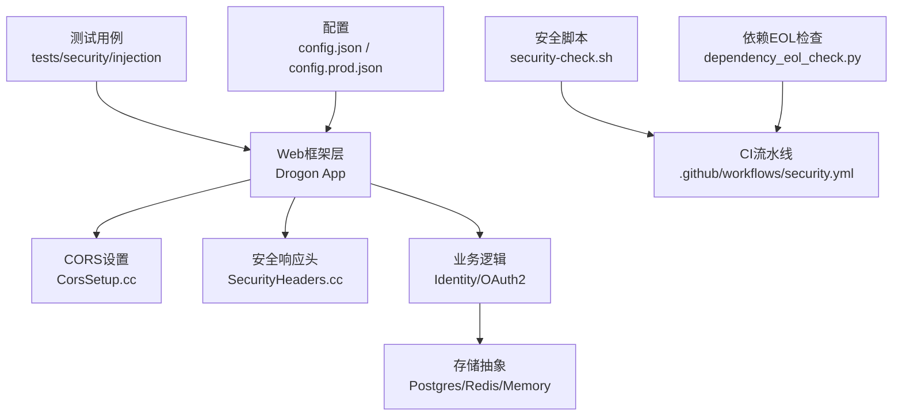
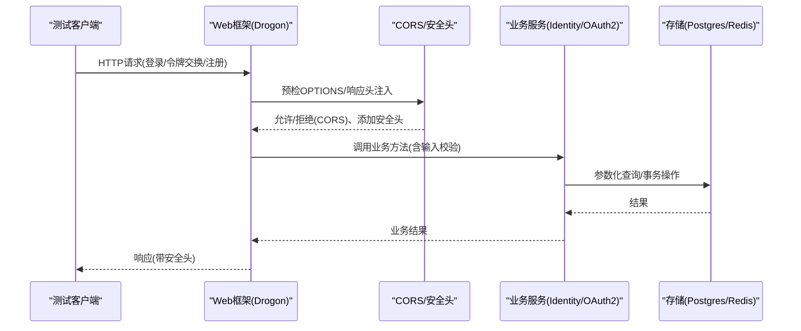
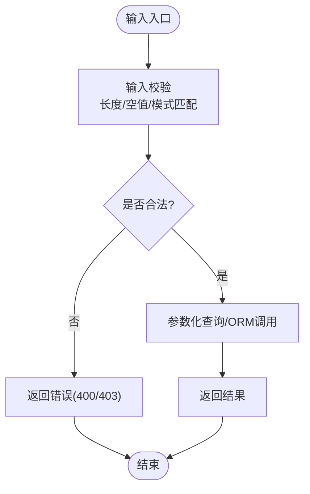
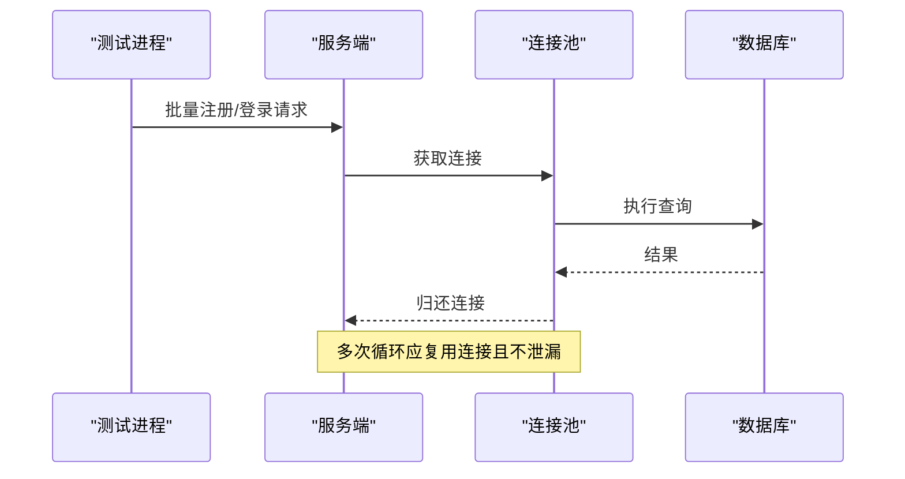
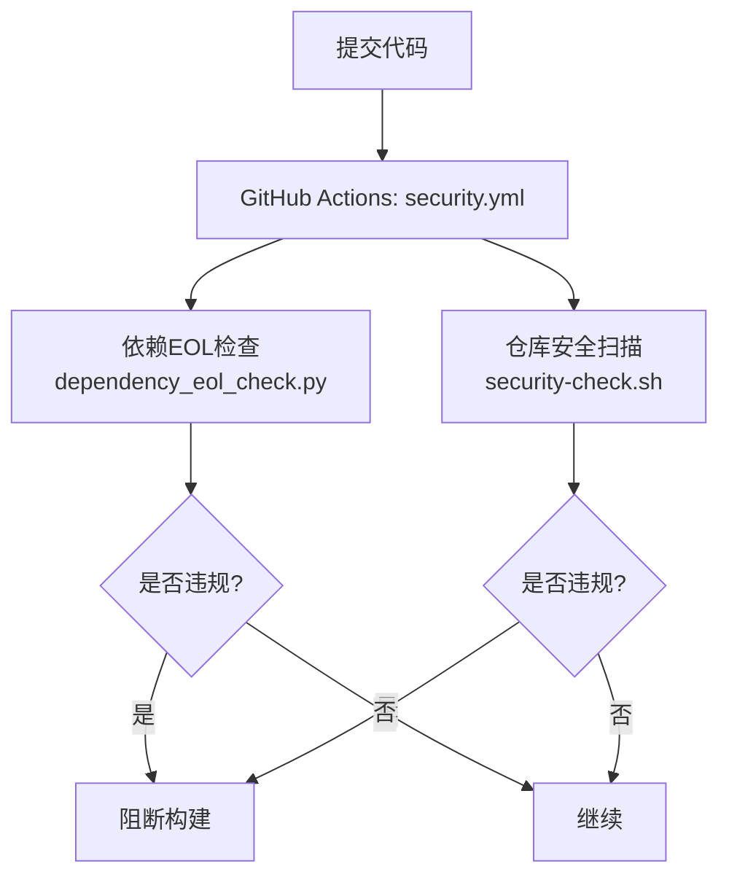
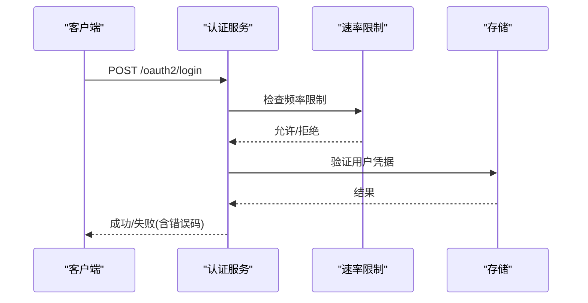
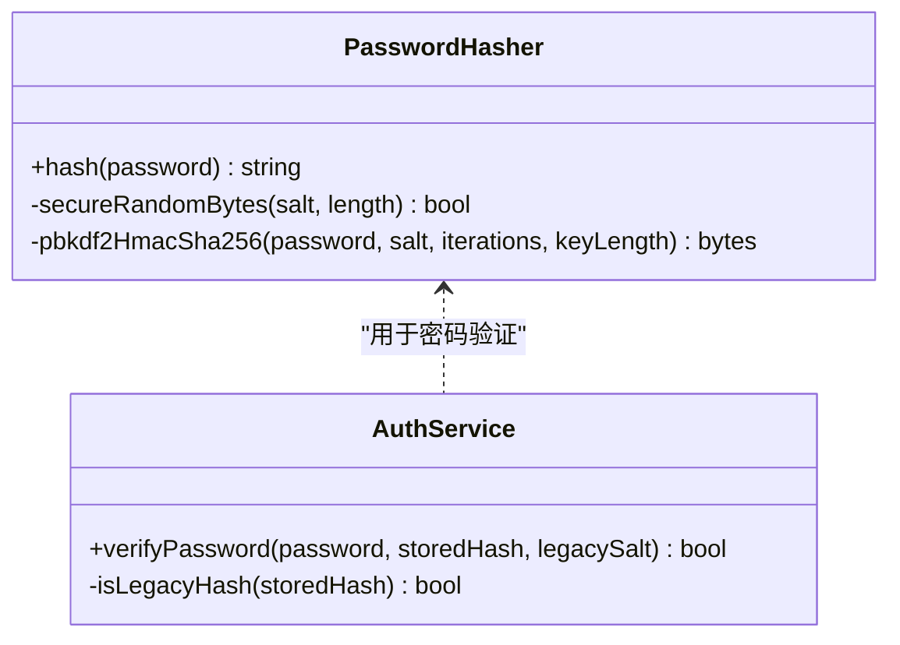
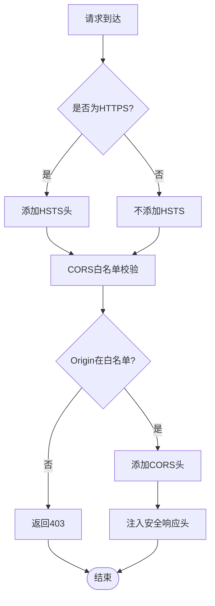
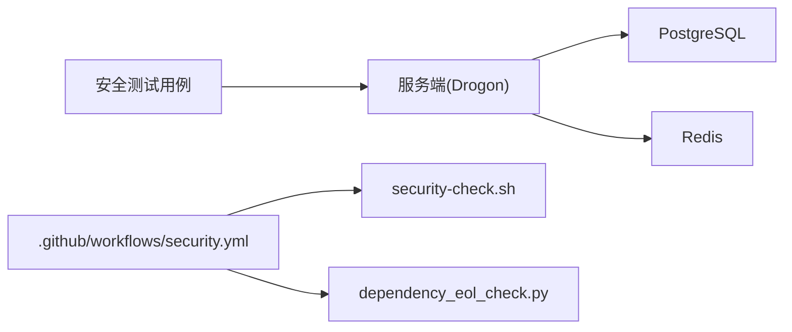

# 安全测试

<cite>
**本文引用的文件**
- [SecurityTest.cc](file://tests/security/injection/SecurityTest.cc)
- [DbLeakVerificationTest.cc](file://tests/security/injection/DbLeakVerificationTest.cc)
- [security-check.sh](file://scripts/security-check.sh)
- [security.yml](file://.github/workflows/security.yml)
- [CorsSetup.cc](file://apps/server/src/bootstrap/CorsSetup.cc)
- [SecurityHeaders.cc](file://apps/server/src/bootstrap/SecurityHeaders.cc)
- [config.json](file://apps/server/config/config.json)
- [config.prod.json](file://apps/server/config/config.prod.json)
- [dependency_eol_check.py](file://tools/security/dependency_eol_check.py)
- [testing-guide.md](file://docs/backend/testing-guide.md)
- [PasswordHasher.cc](file://libs/drogon/src/utils/PasswordHasher.cc)
- [AuthService.cc](file://libs/identity/src/AuthService.cc)
</cite>

## 目录
1. [简介](#简介)
2. [项目结构](#项目结构)
3. [核心组件](#核心组件)
4. [架构总览](#架构总览)
5. [详细组件分析](#详细组件分析)
6. [依赖关系分析](#依赖关系分析)
7. [性能与稳定性考量](#性能与稳定性考量)
8. [故障排查指南](#故障排查指南)
9. [结论](#结论)
10. [附录](#附录)

## 简介
本文件面向AuthForge后端的安全测试，聚焦以下目标：
- SQL注入防护测试：验证参数化查询与输入校验的有效性。
- 数据库连接泄漏检测与预防测试：验证连接池在异步回调中的正确回收。
- 安全漏洞扫描工具集成：静态检查、依赖项EOL策略检查。
- 认证与授权安全测试：权限绕过、会话劫持等攻击场景的防护验证。
- 密码安全与加密算法安全性测试：哈希强度、随机数来源、迁移兼容。
- 安全配置验证：HTTPS强制、CORS白名单、安全响应头。
- 安全测试在开发流程中的集成与自动化执行方式。

## 项目结构
安全相关能力分布在如下位置：
- 安全测试用例：tests/security/injection（SQL注入、XSS、命令注入、CORS、Token安全、速率限制、健康端点信息泄露）。
- 安全基础设施：apps/server/src/bootstrap（CORS与安全头注入）。
- 安全脚本与CI：scripts/security-check.sh、.github/workflows/security.yml、tools/security/dependency_eol_check.py。
- 配置与环境：apps/server/config（数据库连接池、Redis、监听器、会话等）。
- 密码与加密：libs/drogon/src/utils/PasswordHasher.cc、libs/identity/src/AuthService.cc。
- 测试指南：docs/backend/testing-guide.md（分层测试、执行方式、覆盖率说明）。

图表来源
- [SecurityTest.cc:64-343](file://tests/security/injection/SecurityTest.cc#L64-L343)
- [CorsSetup.cc:8-80](file://apps/server/src/bootstrap/CorsSetup.cc#L8-L80)
- [SecurityHeaders.cc:8-60](file://apps/server/src/bootstrap/SecurityHeaders.cc#L8-L60)
- [security.yml:24-46](file://.github/workflows/security.yml#L24-L46)
- [dependency_eol_check.py:40-133](file://tools/security/dependency_eol_check.py#L40-L133)
- [config.json:1-50](file://apps/server/config/config.json#L1-L50)
- [config.prod.json:1-49](file://apps/server/config/config.prod.json#L1-L49)

章节来源
- [testing-guide.md:24-47](file://docs/backend/testing-guide.md#L24-L47)

## 核心组件
- 安全测试套件：覆盖输入校验（SQL注入/XSS/命令注入）、CORS策略、Token安全、安全头、速率限制与健康端点信息泄露。
- CORS与安全头：严格白名单CORS、仅在HTTPS下启用HSTS、全局注入X-Content-Type-Options、X-Frame-Options、CSP。
- 依赖项安全检查：基于conan.lock的策略检查，阻断EOL或已知不安全版本。
- 密码安全：PBKDF2-SHA256加盐哈希，使用安全随机源；支持旧格式迁移兼容。
- 数据库连接管理：通过框架连接池与RAII语义确保异步回调中连接正确归还。

章节来源
- [SecurityTest.cc:64-343](file://tests/security/injection/SecurityTest.cc#L64-L343)
- [CorsSetup.cc:8-80](file://apps/server/src/bootstrap/CorsSetup.cc#L8-L80)
- [SecurityHeaders.cc:8-60](file://apps/server/src/bootstrap/SecurityHeaders.cc#L8-L60)
- [dependency_eol_check.py:40-133](file://tools/security/dependency_eol_check.py#L40-L133)
- [PasswordHasher.cc:51-81](file://libs/drogon/src/utils/PasswordHasher.cc#L51-L81)
- [AuthService.cc:58-89](file://libs/identity/src/AuthService.cc#L58-L89)

## 架构总览
安全测试贯穿“请求进入—中间件处理—业务逻辑—存储访问—响应返回”的全链路：
- 请求进入后，先经CORS预检与响应头注入，再进入控制器与服务层。
- 输入在进入服务前进行严格校验，防止SQL注入、XSS、命令注入。
- 存储访问通过ORM/仓储抽象，避免拼接SQL，降低注入风险。
- 响应统一附加安全头，并在HTTPS下启用HSTS。
- CI阶段运行依赖EOL检查与仓库敏感信息扫描。

图表来源
- [CorsSetup.cc:32-79](file://apps/server/src/bootstrap/CorsSetup.cc#L32-L79)
- [SecurityHeaders.cc:10-59](file://apps/server/src/bootstrap/SecurityHeaders.cc#L10-L59)
- [SecurityTest.cc:22-58](file://tests/security/injection/SecurityTest.cc#L22-L58)

## 详细组件分析

### SQL注入防护测试
- 输入校验：对用户名、密码等字段进行长度、空值、特殊字符校验，阻止SQL注入、XSS、命令注入。
- 参数化查询：通过ORM/仓储抽象执行查询，避免字符串拼接。
- 测试覆盖：包含SQL注入尝试、XSS尝试、命令注入尝试、超长输入、空凭据等场景。

图表来源
- [SecurityTest.cc:64-133](file://tests/security/injection/SecurityTest.cc#L64-L133)

章节来源
- [SecurityTest.cc:64-133](file://tests/security/injection/SecurityTest.cc#L64-L133)

### 数据库连接泄漏检测与预防测试
- 目的：验证在异步回调中使用数据库连接时不会发生泄漏。
- 方法：高频触发涉及DB的请求，观察是否出现连接耗尽或异常；在内存模式下跳过。
- 预期：连接池自动回收连接，无崩溃或连接耗尽错误。

图表来源
- [DbLeakVerificationTest.cc:21-91](file://tests/security/injection/DbLeakVerificationTest.cc#L21-L91)
- [DbLeakVerificationTest.cc:93-141](file://tests/security/injection/DbLeakVerificationTest.cc#L93-L141)

章节来源
- [DbLeakVerificationTest.cc:21-141](file://tests/security/injection/DbLeakVerificationTest.cc#L21-L141)

### 安全漏洞扫描工具集成
- 仓库安全扫描：检查.git跟踪的敏感文件、硬编码密钥、示例文件是否包含真实凭证、.gitignore规则完整性、配置文件权限。
- 依赖EOL检查：解析conan.lock，校验关键依赖版本不低于安全基线（如OpenSSL、zlib、libcurl），失败则阻断CI。
- CI集成：push/PR/定时任务触发，独立于常规CI，便于发现时间相关的EOL问题。

图表来源
- [security.yml:24-46](file://.github/workflows/security.yml#L24-L46)
- [dependency_eol_check.py:40-133](file://tools/security/dependency_eol_check.py#L40-L133)
- [security-check.sh:26-148](file://scripts/security-check.sh#L26-L148)

章节来源
- [security.yml:24-46](file://.github/workflows/security.yml#L24-L46)
- [dependency_eol_check.py:40-133](file://tools/security/dependency_eol_check.py#L40-L133)
- [security-check.sh:26-148](file://scripts/security-check.sh#L26-L148)

### 认证与授权安全测试
- 认证：无效凭据、错误密码、缺失授权码、无效刷新令牌均被拒绝。
- 授权：CORS严格白名单，未授权来源返回403；健康端点不泄露敏感信息。
- 速率限制：对登录、令牌交换、注册等接口实施多层级限制，超过阈值返回429。

图表来源
- [SecurityTest.cc:139-243](file://tests/security/injection/SecurityTest.cc#L139-L243)
- [SecurityTest.cc:287-315](file://tests/security/injection/SecurityTest.cc#L287-L315)

章节来源
- [SecurityTest.cc:139-243](file://tests/security/injection/SecurityTest.cc#L139-L243)
- [SecurityTest.cc:287-315](file://tests/security/injection/SecurityTest.cc#L287-L315)

### 密码安全与加密算法安全性测试
- 哈希算法：PBKDF2-SHA256，随机盐，足够迭代次数，避免弱哈希。
- 随机数来源：优先使用安全随机源，具备回退机制。
- 迁移兼容：支持旧格式哈希的验证路径，保证平滑升级。

图表来源
- [PasswordHasher.cc:51-81](file://libs/drogon/src/utils/PasswordHasher.cc#L51-L81)
- [AuthService.cc:58-89](file://libs/identity/src/AuthService.cc#L58-L89)

章节来源
- [PasswordHasher.cc:51-81](file://libs/drogon/src/utils/PasswordHasher.cc#L51-L81)
- [AuthService.cc:58-89](file://libs/identity/src/AuthService.cc#L58-L89)

### 安全配置验证测试
- HTTPS强制：HSTS仅在HTTPS连接上设置，HTTP连接不携带该头。
- CORS配置：严格白名单，禁止通配符；预检OPTIONS与响应头注入一致。
- 安全响应头：全局注入X-Content-Type-Options、X-Frame-Options、CSP（HTML页面）。

图表来源
- [SecurityHeaders.cc:10-59](file://apps/server/src/bootstrap/SecurityHeaders.cc#L10-L59)
- [CorsSetup.cc:8-80](file://apps/server/src/bootstrap/CorsSetup.cc#L8-L80)
- [SecurityTest.cc:249-281](file://tests/security/injection/SecurityTest.cc#L249-L281)

章节来源
- [SecurityHeaders.cc:10-59](file://apps/server/src/bootstrap/SecurityHeaders.cc#L10-L59)
- [CorsSetup.cc:8-80](file://apps/server/src/bootstrap/CorsSetup.cc#L8-L80)
- [SecurityTest.cc:249-281](file://tests/security/injection/SecurityTest.cc#L249-L281)

## 依赖关系分析
- 测试与实现耦合：安全测试直接调用服务端端点，验证端到端行为；CORS与安全头由框架中间件提供。
- 外部依赖：PostgreSQL与Redis为集成测试必需；内存模式可跳过DB/Redis以支持Windows CI。
- 安全脚本与CI：依赖Python环境与Git仓库状态；依赖EOL检查读取conan.lock。

图表来源
- [testing-guide.md:24-47](file://docs/backend/testing-guide.md#L24-L47)
- [security.yml:24-46](file://.github/workflows/security.yml#L24-L46)

章节来源
- [testing-guide.md:24-47](file://docs/backend/testing-guide.md#L24-L47)
- [security.yml:24-46](file://.github/workflows/security.yml#L24-L46)

## 性能与稳定性考量
- 连接池大小与超时：生产配置建议合理设置number_of_connections与timeout，避免连接耗尽。
- 速率限制：针对登录、令牌交换、注册等高敏接口实施更严格的限制，防止暴力破解与DoS。
- 安全头与CORS：仅对HTML页面应用严格CSP，避免影响API；HSTS仅在HTTPS启用，避免降级攻击。
- 测试负载：数据库连接泄漏测试采用并发请求模拟高负载，验证连接池稳定性。

章节来源
- [config.json:9-26](file://apps/server/config/config.json#L9-L26)
- [config.prod.json:9-26](file://apps/server/config/config.prod.json#L9-L26)
- [SecurityTest.cc:287-315](file://tests/security/injection/SecurityTest.cc#L287-L315)

## 故障排查指南
- 测试环境准备：确保PostgreSQL与Redis服务可用且密码与配置一致；必要时使用Docker快速启动。
- 常见失败原因：
  - 数据库未初始化：执行迁移脚本或在开启自动迁移时等待完成。
  - Redis密码不匹配：核对config.json中的passwd字段。
  - 端口占用：确认5555端口未被占用。
- 调试技巧：
  - 临时提升日志级别至DEBUG/TRACE，观察请求与错误详情。
  - 监控服务器日志文件，定位异常堆栈与慢查询。

章节来源
- [testing-guide.md:8-21](file://docs/backend/testing-guide.md#L8-L21)
- [testing-guide.md:142-146](file://docs/backend/testing-guide.md#L142-L146)
- [testing-guide.md:332-343](file://docs/backend/testing-guide.md#L332-L343)

## 结论
AuthForge后端安全测试覆盖了从输入校验到存储访问、从CORS与安全头到依赖项EOL检查的关键安全面。通过分层测试与CI集成，能够在开发与发布阶段持续发现并阻断安全风险。建议在后续迭代中：
- 补充更多边界条件与异常分支的安全测试。
- 引入更全面的静态分析与依赖漏洞扫描（如SCA）以增强供应链安全。
- 定期审查安全配置与策略，确保与最新威胁模型对齐。

## 附录
- 测试执行方式：可通过CTest或直接运行测试二进制；manage脚本封装了构建与测试流程。
- 覆盖率统计：需执行全部测试二进制并聚合gcov数据，建议使用提供的测量脚本。
- 安全加固文档：参考安全加固指南了解速率限制与安全头的具体实现与配置。

章节来源
- [testing-guide.md:90-127](file://docs/backend/testing-guide.md#L90-L127)
- [testing-guide.md:233-297](file://docs/backend/testing-guide.md#L233-L297)
- [docs/backend/security-hardening.md:1-42](file://docs/backend/security-hardening.md#L1-L42)