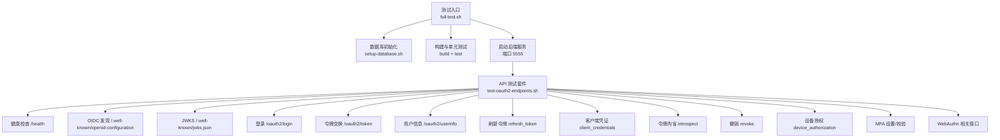
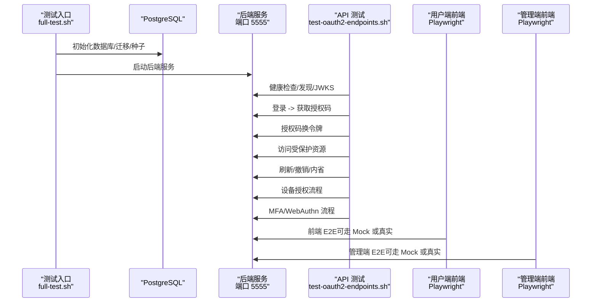
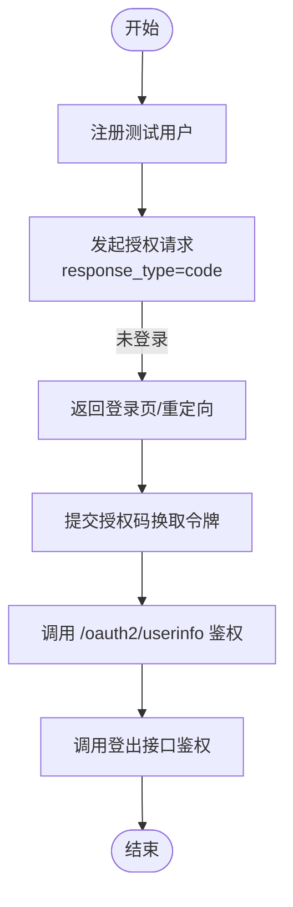
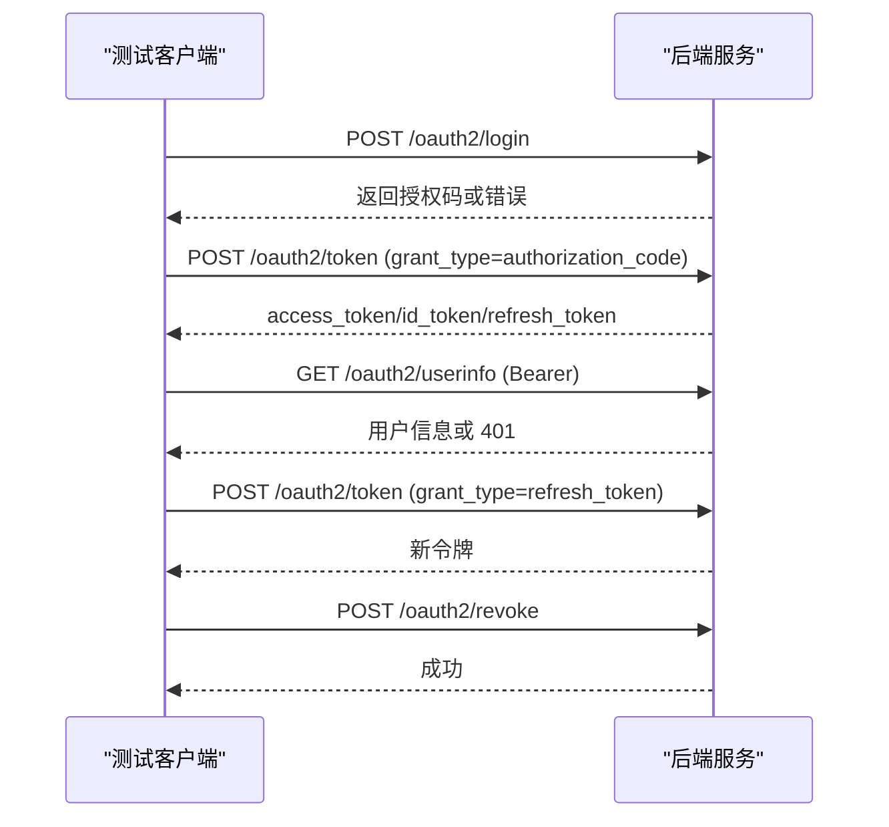
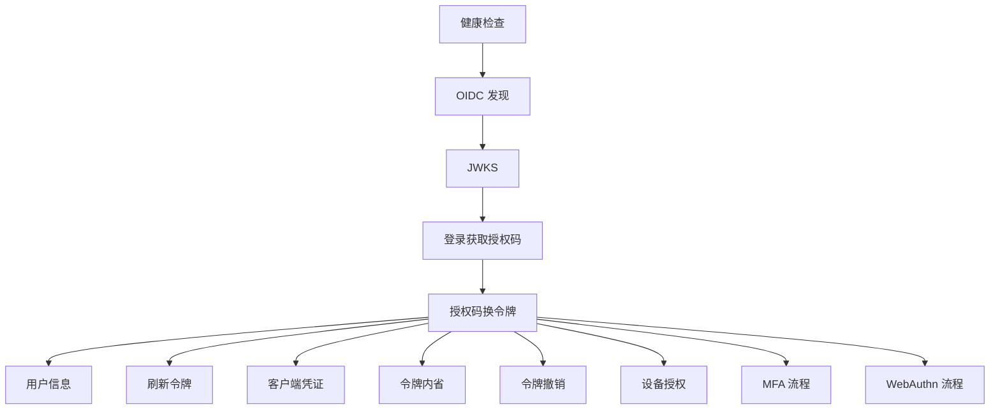
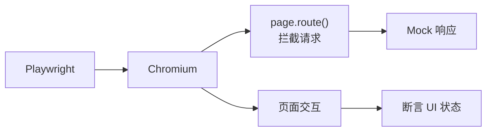
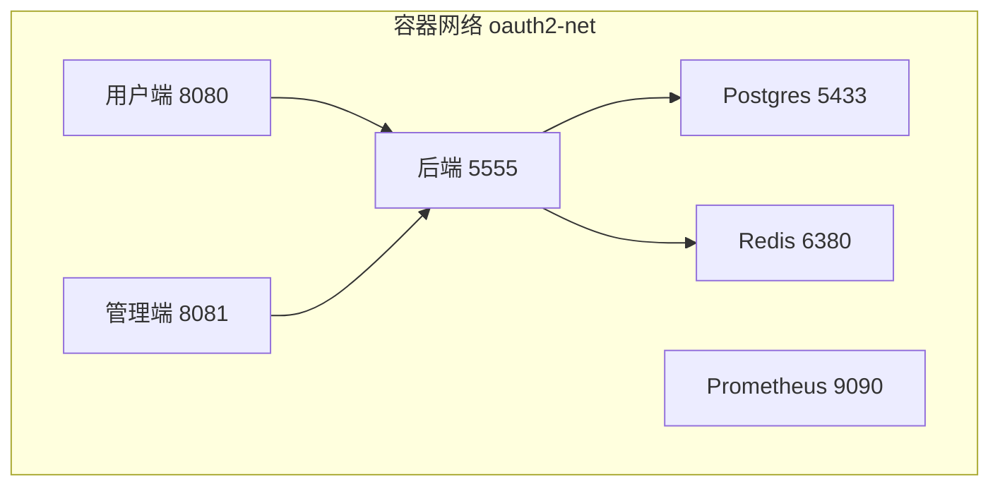
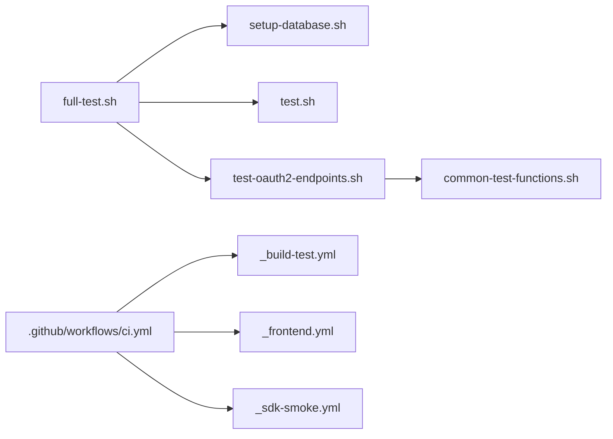

# 端到端测试

<cite>
**本文引用的文件**
- [OAuth2FlowE2ETest.cc](file://tests/e2e-backend/oauth2_flows/OAuth2FlowE2ETest.cc)
- [IntegrationE2ETest.cc](file://tests/e2e-backend/oauth2_flows/IntegrationE2ETest.cc)
- [FunctionalTest.cc](file://tests/e2e-backend/oauth2_flows/FunctionalTest.cc)
- [test-oauth2-endpoints.sh](file://scripts/backend/test-oauth2-endpoints.sh)
- [setup-database.sh](file://scripts/backend/setup-database.sh)
- [full-test.sh](file://scripts/backend/full-test.sh)
- [common-test-functions.sh](file://scripts/backend/common-test-functions.sh)
- [PerformanceBenchmark.cc](file://tests/performance/benchmark/PerformanceBenchmark.cc)
- [docker-compose.yml](file://deploy/docker/docker-compose.yml)
- [ci.yml](file://.github/workflows/ci.yml)
- [playwright.config.ts（管理端）](file://frontends/admin/playwright.config.ts)
- [playwright.config.ts（用户端）](file://frontends/user/playwright.config.ts)
- [e2e-testing-guide.md](file://docs/admin/e2e-testing-guide.md)
</cite>

## 目录
1. [简介](#简介)
2. [项目结构](#项目结构)
3. [核心组件](#核心组件)
4. [架构总览](#架构总览)
5. [详细组件分析](#详细组件分析)
6. [依赖关系分析](#依赖关系分析)
7. [性能考量](#性能考量)
8. [故障排查指南](#故障排查指南)
9. [结论](#结论)
10. [附录](#附录)

## 简介
本文件面向 AuthForge 后端的端到端（E2E）测试体系，覆盖 OAuth2 授权码流程、PKCE 扩展、设备授权流程的验证；说明 E2E 环境搭建（服务器启动、数据库初始化、前端应用部署）；介绍功能测试实现（注册、登录、MFA 等业务流程自动化）；给出集成执行方法、报告生成与结果分析；并包含性能基准测试的实现与 CI/CD 流水线集成方式。

## 项目结构
后端 E2E 测试由三类组成：
- C++ Drogon 测试用例：直接调用控制器或 HTTP 客户端进行协议级验证
- Shell 脚本驱动的 API 测试：通过 curl 对运行中的服务发起请求，覆盖完整 OAuth2/OIDC 流程
- 前端 Playwright E2E：基于浏览器拦截 Mock 的前端交互测试（配合后端服务或纯 Mock）

图表来源
- [full-test.sh:51-157](file://scripts/backend/full-test.sh#L51-L157)
- [test-oauth2-endpoints.sh:30-796](file://scripts/backend/test-oauth2-endpoints.sh#L30-L796)

章节来源
- [full-test.sh:51-157](file://scripts/backend/full-test.sh#L51-L157)
- [test-oauth2-endpoints.sh:30-796](file://scripts/backend/test-oauth2-endpoints.sh#L30-L796)

## 核心组件
- 后端 E2E 测试用例（C++）
  - 授权码流程、会话管理、客户端认证、重定向 URI 校验等场景
- API 测试脚本（Shell）
  - 覆盖健康检查、OIDC 发现、JWKS、登录、令牌交换、刷新、客户端凭证、内省、撤销、MFA、WebAuthn、设备授权等
- 前端 E2E（Playwright）
  - 使用 page.route() 拦截 API，无需真实后端即可稳定执行 UI 流程测试
- 环境与编排
  - Docker Compose 提供 Postgres、Redis、后端、前端、Prometheus 的一键启动
  - CI 工作流串联静态检查、多平台构建测试、SDK 冒烟

章节来源
- [OAuth2FlowE2ETest.cc:17-511](file://tests/e2e-backend/oauth2_flows/OAuth2FlowE2ETest.cc#L17-L511)
- [IntegrationE2ETest.cc:15-143](file://tests/e2e-backend/oauth2_flows/IntegrationE2ETest.cc#L15-L143)
- [FunctionalTest.cc:70-452](file://tests/e2e-backend/oauth2_flows/FunctionalTest.cc#L70-L452)
- [test-oauth2-endpoints.sh:30-796](file://scripts/backend/test-oauth2-endpoints.sh#L30-L796)
- [docker-compose.yml:1-127](file://deploy/docker/docker-compose.yml#L1-L127)
- [ci.yml:1-151](file://.github/workflows/ci.yml#L1-L151)

## 架构总览
下图展示了从测试入口到各层服务的调用链路与数据流。

图表来源
- [full-test.sh:51-157](file://scripts/backend/full-test.sh#L51-L157)
- [test-oauth2-endpoints.sh:30-796](file://scripts/backend/test-oauth2-endpoints.sh#L30-L796)
- [docker-compose.yml:1-127](file://deploy/docker/docker-compose.yml#L1-L127)

## 详细组件分析

### 后端 C++ E2E 测试（授权码流程、会话、客户端认证）
- 授权码流程
  - 注册用户、发起授权请求、尝试令牌交换、校验用户信息接口鉴权、登出安全校验
- 会话管理
  - 无参数授权请求返回错误、未登录登出返回未授权
- 客户端认证
  - 公共客户端、机密客户端、HTTP Basic 认证路径
- 重定向 URI 校验
  - 合法与非法 redirect_uri 的响应断言

图表来源
- [OAuth2FlowE2ETest.cc:17-258](file://tests/e2e-backend/oauth2_flows/OAuth2FlowE2ETest.cc#L17-L258)
- [OAuth2FlowE2ETest.cc:260-321](file://tests/e2e-backend/oauth2_flows/OAuth2FlowE2ETest.cc#L260-L321)
- [OAuth2FlowE2ETest.cc:323-430](file://tests/e2e-backend/oauth2_flows/OAuth2FlowE2ETest.cc#L323-L430)
- [OAuth2FlowE2ETest.cc:432-511](file://tests/e2e-backend/oauth2_flows/OAuth2FlowE2ETest.cc#L432-L511)

章节来源
- [OAuth2FlowE2ETest.cc:17-511](file://tests/e2e-backend/oauth2_flows/OAuth2FlowE2ETest.cc#L17-L511)

### 后端 C++ 集成测试（直连控制器）
- 绕过 HTTP 路由直接调用控制器，验证注册、清理等基础能力
- 适用于快速定位控制器逻辑问题

章节来源
- [IntegrationE2ETest.cc:15-143](file://tests/e2e-backend/oauth2_flows/IntegrationE2ETest.cc#L15-L143)

### 后端功能测试（HTTP 客户端驱动）
- 完整授权码流程、错误处理（无效 grant_type、缺失参数、无效 client_id、空凭据、错误凭据）
- UTF-8/Emoji 支持、健康检查字段、RBAC 权限控制、令牌生命周期（过期/重用）、输入长度限制、速率限制检测、端点可用性

图表来源
- [FunctionalTest.cc:70-452](file://tests/e2e-backend/oauth2_flows/FunctionalTest.cc#L70-L452)

章节来源
- [FunctionalTest.cc:70-452](file://tests/e2e-backend/oauth2_flows/FunctionalTest.cc#L70-L452)

### Shell API 测试套件（OAuth2/OIDC/MFA/WebAuthn/设备授权）
- 健康检查、OIDC 发现、JWKS
- 登录、令牌交换、用户信息、刷新、客户端凭证、内省、撤销
- 用户注册、个人资料、密码重置、邮箱验证
- MFA 设置/校验/禁用、WebAuthn 注册/认证
- 设备授权流程（device_authorization、approve）
- 社交登录错误路径（GitHub/Google/WeChat）
- 幂等性与合规性断言（如刷新需客户端认证、内省/撤销的 WWW-Authenticate 行为）

图表来源
- [test-oauth2-endpoints.sh:30-796](file://scripts/backend/test-oauth2-endpoints.sh#L30-L796)

章节来源
- [test-oauth2-endpoints.sh:30-796](file://scripts/backend/test-oauth2-endpoints.sh#L30-L796)
- [common-test-functions.sh:1-228](file://scripts/backend/common-test-functions.sh#L1-L228)

### 前端 E2E（Playwright）
- 管理端与用户端均配置了 Playwright，启用 webServer 自动启动前端开发服务器
- 采用 page.route() 拦截 API，无需真实后端，保证稳定与快速
- 支持 HTML 报告、失败重试、trace 记录

图表来源
- [playwright.config.ts（管理端）:1-27](file://frontends/admin/playwright.config.ts#L1-L27)
- [playwright.config.ts（用户端）:1-23](file://frontends/user/playwright.config.ts#L1-L23)
- [e2e-testing-guide.md:20-74](file://docs/admin/e2e-testing-guide.md#L20-L74)

章节来源
- [playwright.config.ts（管理端）:1-27](file://frontends/admin/playwright.config.ts#L1-L27)
- [playwright.config.ts（用户端）:1-23](file://frontends/user/playwright.config.ts#L1-L23)
- [e2e-testing-guide.md:20-74](file://docs/admin/e2e-testing-guide.md#L20-L74)

### 环境搭建与部署（Docker Compose）
- 一键启动后端、管理端、用户端、Postgres、Redis、Prometheus
- 环境变量注入数据库、Redis、Vue 客户端密钥、自动迁移、前端 URL、SMTP 等
- 健康检查确保依赖就绪

图表来源
- [docker-compose.yml:1-127](file://deploy/docker/docker-compose.yml#L1-L127)

章节来源
- [docker-compose.yml:1-127](file://deploy/docker/docker-compose.yml#L1-L127)

## 依赖关系分析
- full-test.sh 依赖 setup-database.sh、build.sh、test.sh、test-oauth2-endpoints.sh、test-admin-endpoints.sh
- test-oauth2-endpoints.sh 依赖 common-test-functions.sh 提供的断言与工具函数
- CI 工作流串联静态检查、前端属性测试、多平台构建测试、SDK 冒烟
- 前端 E2E 依赖 Playwright 与各自项目的 webServer 配置

图表来源
- [full-test.sh:51-157](file://scripts/backend/full-test.sh#L51-L157)
- [test-oauth2-endpoints.sh:1-20](file://scripts/backend/test-oauth2-endpoints.sh#L1-L20)
- [common-test-functions.sh:1-228](file://scripts/backend/common-test-functions.sh#L1-L228)
- [ci.yml:1-151](file://.github/workflows/ci.yml#L1-L151)

章节来源
- [full-test.sh:51-157](file://scripts/backend/full-test.sh#L51-L157)
- [test-oauth2-endpoints.sh:1-20](file://scripts/backend/test-oauth2-endpoints.sh#L1-L20)
- [common-test-functions.sh:1-228](file://scripts/backend/common-test-functions.sh#L1-L228)
- [ci.yml:1-151](file://.github/workflows/ci.yml#L1-L151)

## 性能考量
- 基准测试位于 PerformanceBenchmark.cc，针对主题生成与解析进行压力测试，统计平均延迟与 P95 延迟，并设置阈值断言
- 建议在生产前结合压测工具对关键端点（登录、令牌交换、用户信息）进行负载评估

章节来源
- [PerformanceBenchmark.cc:11-78](file://tests/performance/benchmark/PerformanceBenchmark.cc#L11-L78)

## 故障排查指南
- 数据库连接失败
  - 检查 PostgreSQL 是否可用、账号密码与环境变量是否正确
  - 使用 setup-database.sh 重新初始化数据库与迁移
- 服务启动失败
  - 确认端口占用、配置文件挂载、环境变量注入
  - 查看日志输出与进程存活状态
- API 测试失败
  - 使用 common-test-functions.sh 的断言函数定位具体失败点
  - 检查 JWT、客户端密钥、重定向 URI 配置
- 前端 E2E 不稳定
  - 开启 trace 与重试，检查 page.route() 是否覆盖所有请求
  - 确认 webServer 启动成功且 baseURL 正确

章节来源
- [setup-database.sh:1-66](file://scripts/backend/setup-database.sh#L1-L66)
- [common-test-functions.sh:1-228](file://scripts/backend/common-test-functions.sh#L1-L228)
- [e2e-testing-guide.md:785-800](file://docs/admin/e2e-testing-guide.md#L785-L800)

## 结论
本项目提供了完整的后端 E2E 测试矩阵：C++ 用例验证协议细节，Shell 脚本覆盖 OAuth2/OIDC 全链路，前端 Playwright 保障 UI 交互稳定性。借助 Docker Compose 与 CI 工作流，可实现一键环境搭建与持续集成。性能基准测试为系统在不同负载下的表现提供量化依据。整体方案兼顾可靠性、可维护性与可扩展性。

## 附录

### E2E 环境搭建步骤
- 本地一键流程
  - 初始化数据库、生成 ORM 模型、构建项目、运行测试、启动后端、执行 API 测试、停止服务
- Docker 一键流程
  - 使用 docker-compose 启动后端、数据库、缓存、前端与管理端，便于联调与演示

章节来源
- [full-test.sh:51-157](file://scripts/backend/full-test.sh#L51-L157)
- [docker-compose.yml:1-127](file://deploy/docker/docker-compose.yml#L1-L127)

### 功能测试清单（示例）
- 用户注册、登录、MFA 设置与校验、密码重置、邮箱验证、WebAuthn、设备授权、令牌刷新与撤销、RBAC 权限控制、健康检查、OIDC 发现与 JWKS

章节来源
- [test-oauth2-endpoints.sh:30-796](file://scripts/backend/test-oauth2-endpoints.sh#L30-L796)

### 集成执行方法
- 本地执行
  - 使用 full-test.sh 完成构建、测试与服务启动后的 API 测试
- CI 执行
  - 通过 .github/workflows/ci.yml 触发静态检查、前端属性测试、多平台构建测试与 SDK 冒烟

章节来源
- [full-test.sh:51-157](file://scripts/backend/full-test.sh#L51-L157)
- [ci.yml:1-151](file://.github/workflows/ci.yml#L1-L151)

### 测试报告与结果分析
- 后端 API 测试
  - 控制台输出 PASS/FAIL 汇总，可通过脚本输出定位失败用例
- 前端 E2E
  - Playwright 生成 HTML 报告，支持失败重试时记录 trace，便于回放与分析

章节来源
- [common-test-functions.sh:214-228](file://scripts/backend/common-test-functions.sh#L214-L228)
- [playwright.config.ts（管理端）:1-27](file://frontends/admin/playwright.config.ts#L1-L27)
- [playwright.config.ts（用户端）:1-23](file://frontends/user/playwright.config.ts#L1-L23)

### 性能基准测试
- 主题生成与解析的压力测试，统计平均与 P95 延迟，设置阈值断言
- 建议在上线前结合外部压测工具对关键端点进行负载评估

章节来源
- [PerformanceBenchmark.cc:11-78](file://tests/performance/benchmark/PerformanceBenchmark.cc#L11-L78)