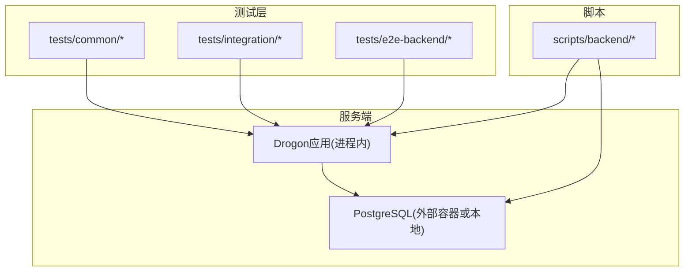
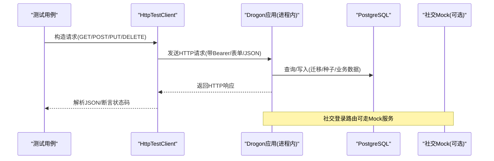
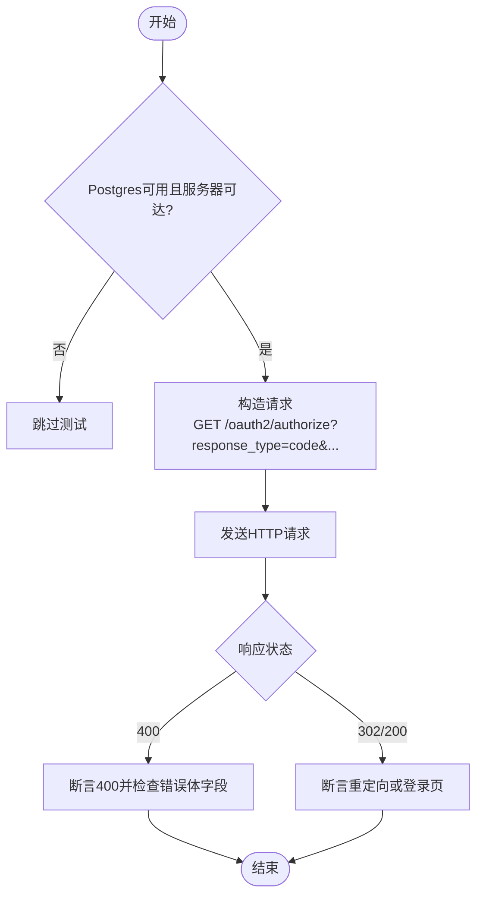
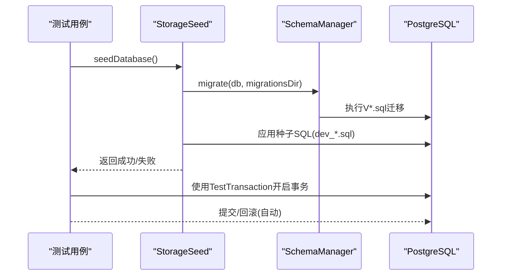
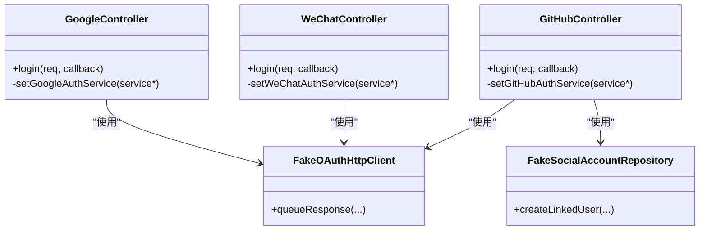
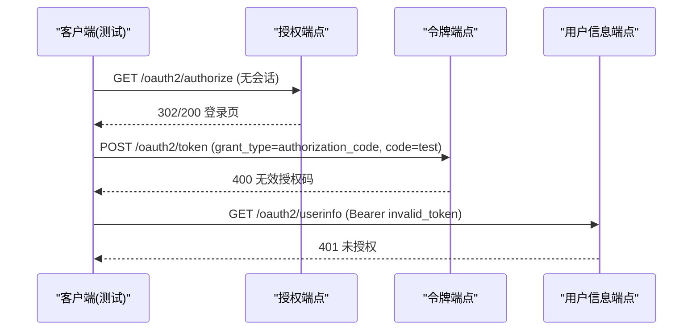
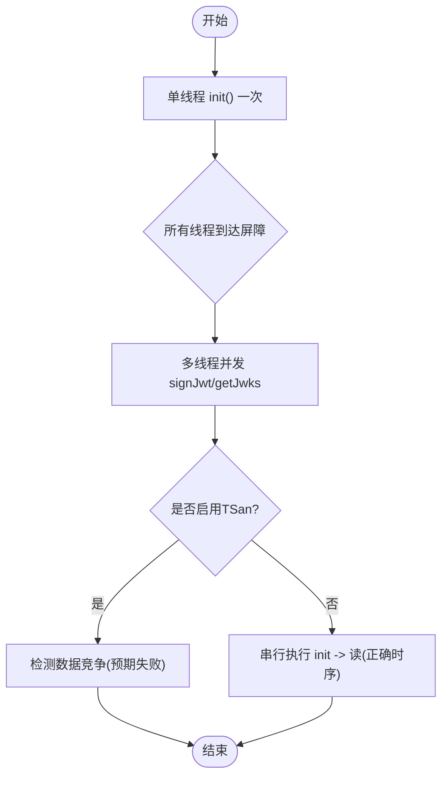
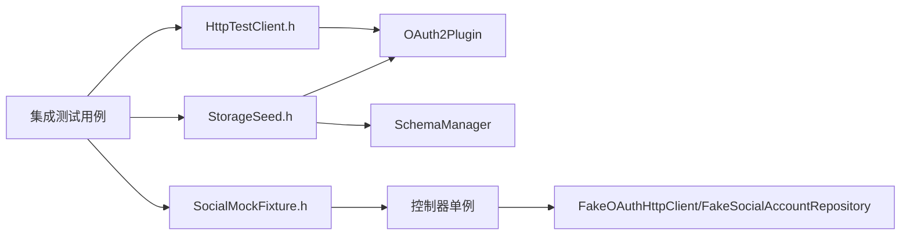

# 集成测试

<cite>
**本文引用的文件**
- [AuthorizeEndpointHttpTest.cc](file://tests/integration/controllers/AuthorizeEndpointHttpTest.cc)
- [OAuth2FlowE2ETest.cc](file://tests/e2e-backend/oauth2_flows/OAuth2FlowE2ETest.cc)
- [PluginTest.cc](file://tests/integration/plugin/PluginTest.cc)
- [JwkManagerRaceTest.cc](file://tests/integration/concurrency/CategoryB_JwkManagerRaceTest.cc)
- [HttpTestClient.h](file://tests/common/HttpTestClient.h)
- [StorageSeed.h](file://tests/common/StorageSeed.h)
- [SocialMockFixture.h](file://tests/common/SocialMockFixture.h)
- [test-oauth2-endpoints.sh](file://scripts/backend/test-oauth2-endpoints.sh)
- [common-test-functions.sh](file://scripts/backend/common-test-functions.sh)
- [setup-database.sh](file://scripts/backend/setup-database.sh)
- [dev_admin_user.sql](file://apps/server/seed/dev_admin_user.sql)
</cite>

## 目录
1. [简介](#简介)
2. [项目结构](#项目结构)
3. [核心组件](#核心组件)
4. [架构总览](#架构总览)
5. [详细组件分析](#详细组件分析)
6. [依赖关系分析](#依赖关系分析)
7. [性能与并发考量](#性能与并发考量)
8. [故障排查指南](#故障排查指南)
9. [结论](#结论)
10. [附录](#附录)

## 简介
本文件面向AuthForge后端集成测试，系统性说明以下能力：
- HTTP端点测试实现：RESTful API的测试方法与请求响应验证策略。
- 数据库集成测试配置：PostgreSQL测试环境搭建、迁移与数据准备。
- 第三方服务模拟：社交登录提供商（Google/WeChat/GitHub）的Mock测试方法。
- OAuth2流程端到端验证：授权码流程、客户端凭证模式等。
- 并发性与竞态条件测试：存储生命周期与JWK管理的并发测试。
- 测试数据种子管理与清理策略。
- 异步操作与插件系统的集成测试方法。

## 项目结构
测试代码按层次组织：
- tests/common：通用HTTP客户端、事务回滚、存储种子、社交Mock夹具等。
- tests/integration：控制器级HTTP集成测试、并发测试、插件测试等。
- tests/e2e-backend：跨控制器的端到端流程测试。
- scripts/backend：Shell脚本驱动的外部API测试、数据库初始化与公共函数。
- apps/server/seed：开发/测试用种子SQL（管理员用户、客户端等）。

图表来源
- [HttpTestClient.h:61-121](file://tests/common/HttpTestClient.h#L61-L121)
- [setup-database.sh:1-66](file://scripts/backend/setup-database.sh#L1-L66)

章节来源
- [HttpTestClient.h:61-121](file://tests/common/HttpTestClient.h#L61-L121)
- [setup-database.sh:1-66](file://scripts/backend/setup-database.sh#L1-L66)

## 核心组件
- HTTP测试客户端与断言工具：统一构建请求、发送同步请求、解析JSON、状态码断言、服务器可达性探测、内存/真实存储模式切换。
- 数据库事务守卫：RAII式事务开启与自动回滚，保证测试隔离。
- 存储种子：在测试进程中执行迁移与种子SQL，确保管理员用户与客户端存在。
- 社交登录Mock：通过注入FakeOAuthHttpClient/FakeSocialAccountRepository到控制器单例，避免真实网络调用。
- 插件测试：直接对OAuth2Plugin进行功能验证（生成授权码、兑换令牌、刷新令牌、防重放等）。
- 并发测试：针对JWK管理器的读写竞争场景，使用TSan检测数据竞争；正常构建下串行执行以覆盖生产路径。
- 外部API测试脚本：基于curl的端到端用例集合，覆盖健康检查、发现、JWKS、登录、令牌交换、撤销、MFA、设备授权、WebAuthn、社交登录错误分支等。

章节来源
- [HttpTestClient.h:84-121](file://tests/common/HttpTestClient.h#L84-L121)
- [StorageSeed.h:104-192](file://tests/common/StorageSeed.h#L104-L192)
- [SocialMockFixture.h:69-141](file://tests/common/SocialMockFixture.h#L69-L141)
- [PluginTest.cc:7-204](file://tests/integration/plugin/PluginTest.cc#L7-L204)
- [JwkManagerRaceTest.cc:106-193](file://tests/integration/concurrency/CategoryB_JwkManagerRaceTest.cc#L106-L193)
- [test-oauth2-endpoints.sh:30-796](file://scripts/backend/test-oauth2-endpoints.sh#L30-L796)

## 架构总览
集成测试采用“进程内Drogon应用 + 外部PostgreSQL”的模式：
- 测试进程启动Drogon应用并监听固定端口（默认5555），通过内置HttpClient向自身发起HTTP请求。
- 数据库由外部PostgreSQL提供，测试前通过脚本或进程内种子完成迁移与数据准备。
- 社交登录通过Mock夹具替换真实HTTP客户端，避免对外部服务的依赖。
- 插件系统通过OAuth2Plugin暴露的接口进行端到端验证。

图表来源
- [HttpTestClient.h:134-249](file://tests/common/HttpTestClient.h#L134-L249)
- [setup-database.sh:41-62](file://scripts/backend/setup-database.sh#L41-L62)
- [SocialMockFixture.h:69-141](file://tests/common/SocialMockFixture.h#L69-L141)

## 详细组件分析

### HTTP端点测试实现
- 目标：覆盖授权端点的早期拒绝分支（缺少state、state长度不足、未知client_id）、未登录重定向、以及各类错误分支。
- 方法：
  - 使用sendGet/sendPostForm/sendPostJson等统一客户端构建请求。
  - 使用statusIs和parseJsonBody进行响应断言。
  - 通过postgresAvailable()与serverReachable()做环境与可用性门控。
- 示例覆盖：
  - 缺失state参数返回400。
  - state过短返回400。
  - 未知client_id返回400。
  - 无会话时重定向到登录页（302或200）。

图表来源
- [AuthorizeEndpointHttpTest.cc:43-122](file://tests/integration/controllers/AuthorizeEndpointHttpTest.cc#L43-L122)
- [HttpTestClient.h:84-121](file://tests/common/HttpTestClient.h#L84-L121)

章节来源
- [AuthorizeEndpointHttpTest.cc:43-122](file://tests/integration/controllers/AuthorizeEndpointHttpTest.cc#L43-L122)
- [HttpTestClient.h:84-121](file://tests/common/HttpTestClient.h#L84-L121)

### 数据库集成测试配置
- 环境搭建：
  - 使用setup-database.sh创建数据库、执行V*.sql迁移、应用种子SQL。
  - 环境变量OAUTH2_DB_*决定连接信息；支持本地或Docker中的PostgreSQL。
- 进程内种子：
  - StorageSeed::seedDatabase()在测试进程中调用SchemaManager::migrate与splitSqlStatements，依次执行迁移与种子文件，确保admin用户与客户端存在。
  - 幂等设计：迁移通过schema_migrations表跟踪；种子SQL使用ON CONFLICT DO NOTHING。
- 清理策略：
  - TestTransaction RAII在测试结束时ROLLBACK，避免污染后续用例。
  - 外部脚本reset_admin_account重置管理员密码与锁定计数。

图表来源
- [setup-database.sh:22-62](file://scripts/backend/setup-database.sh#L22-L62)
- [StorageSeed.h:104-192](file://tests/common/StorageSeed.h#L104-L192)
- [TestBase.h:15-78](file://tests/common/TestBase.h#L15-L78)

章节来源
- [setup-database.sh:22-62](file://scripts/backend/setup-database.sh#L22-L62)
- [StorageSeed.h:104-192](file://tests/common/StorageSeed.h#L104-L192)
- [TestBase.h:15-78](file://tests/common/TestBase.h#L15-L78)

### 第三方服务模拟（社交登录）
- 机制：
  - 通过SocialMockFixture注入FakeOAuthHttpClient与FakeSocialAccountRepository到各社交控制器单例。
  - 控制器优先检查service_是否为空，若注入则走Mock路径，不产生真实网络请求。
- 覆盖范围：
  - Google/WeChat/GitHub登录的错误分支（缺少code、传输失败）。
  - GitHub新账户创建路径（通过FakeSocialAccountRepository预置或失败）。
- 线程安全注意：
  - 注入发生在主线程，服务器事件循环在另一线程读取；在TSan下会触发警告，建议排除此类测试于线程检测运行。

图表来源
- [SocialMockFixture.h:69-141](file://tests/common/SocialMockFixture.h#L69-L141)

章节来源
- [SocialMockFixture.h:69-141](file://tests/common/SocialMockFixture.h#L69-L141)

### OAuth2流程集成测试
- 授权码流程：
  - 注册用户 -> 访问授权端点（无会话返回登录页/重定向）-> 尝试令牌交换（无效code返回400）-> 校验用户信息端点鉴权（401）。
- 客户端凭证模式：
  - 公开客户端与机密客户端分别测试；支持Basic认证头。
- 重定向URI校验：
  - 合法URI允许交换；非法URI返回400。
- 外部脚本覆盖：
  - test-oauth2-endpoints.sh包含大量用例：健康检查、OIDC发现、JWKS、登录、令牌交换、刷新、撤销、MFA、设备授权、WebAuthn、社交登录错误分支等。

图表来源
- [OAuth2FlowE2ETest.cc:17-258](file://tests/e2e-backend/oauth2_flows/OAuth2FlowE2ETest.cc#L17-L258)
- [test-oauth2-endpoints.sh:80-120](file://scripts/backend/test-oauth2-endpoints.sh#L80-L120)

章节来源
- [OAuth2FlowE2ETest.cc:17-258](file://tests/e2e-backend/oauth2_flows/OAuth2FlowE2ETest.cc#L17-L258)
- [test-oauth2-endpoints.sh:80-120](file://scripts/backend/test-oauth2-endpoints.sh#L80-L120)

### 并发性与竞态条件测试
- JWK管理器竞争：
  - 单写多读场景：一个线程调用init()，多个线程并发调用signJwt()/getJwks()读取成员变量。
  - TSan构建下检测initialized_/kid_/rsaKey_的数据竞争；正常构建下串行执行以保证覆盖且不触发未定义行为。
- 存储生命周期：
  - 通过ConcurrencyRaceSupport中的屏障与随机线程数生成器，构造多种交错顺序，提高覆盖率。

图表来源
- [JwkManagerRaceTest.cc:106-193](file://tests/integration/concurrency/CategoryB_JwkManagerRaceTest.cc#L106-L193)

章节来源
- [JwkManagerRaceTest.cc:106-193](file://tests/integration/concurrency/CategoryB_JwkManagerRaceTest.cc#L106-L193)

### 测试数据种子管理与清理策略
- 种子管理：
  - dev_admin_user.sql创建管理员用户、角色映射与subject映射，幂等插入。
  - StorageSeed在测试进程中应用迁移与种子，确保admin用户与客户端存在。
- 清理策略：
  - TestTransaction在测试结束时自动回滚，避免数据残留。
  - 外部脚本reset_admin_account重置管理员密码与锁定计数，防止因失败登录导致账户锁定。

章节来源
- [dev_admin_user.sql:1-21](file://apps/server/seed/dev_admin_user.sql#L1-L21)
- [StorageSeed.h:104-192](file://tests/common/StorageSeed.h#L104-L192)
- [common-test-functions.sh:150-161](file://scripts/backend/common-test-functions.sh#L150-L161)

### 异步操作与插件系统集成测试
- 插件测试：
  - 直接实例化OAuth2Plugin，配置内存存储，验证validateClient、generateAuthorizationCode、exchangeCodeForToken、refreshAccessToken、防重放（重复code返回invalid_grant）。
- 异步回调：
  - 使用std::promise/future等待异步回调完成，设置超时保护，避免阻塞测试执行。

章节来源
- [PluginTest.cc:7-204](file://tests/integration/plugin/PluginTest.cc#L7-L204)

## 依赖关系分析
- 测试层依赖：
  - HttpTestClient依赖Drogon框架与OAuth2Plugin以判断存储类型。
  - StorageSeed依赖SchemaManager与OAuth2Plugin以获取DbClient与存储类型。
  - SocialMockFixture依赖控制器单例与Fake服务以注入Mock。
- 外部依赖：
  - PostgreSQL用于持久化；Redis可选（部分测试可能涉及）。
  - Shell脚本依赖psql与jq。

图表来源
- [HttpTestClient.h:117-121](file://tests/common/HttpTestClient.h#L117-L121)
- [StorageSeed.h:104-192](file://tests/common/StorageSeed.h#L104-L192)
- [SocialMockFixture.h:69-141](file://tests/common/SocialMockFixture.h#L69-L141)

章节来源
- [HttpTestClient.h:117-121](file://tests/common/HttpTestClient.h#L117-L121)
- [StorageSeed.h:104-192](file://tests/common/StorageSeed.h#L104-L192)
- [SocialMockFixture.h:69-141](file://tests/common/SocialMockFixture.h#L69-L141)

## 性能与并发考量
- 进程内HTTP测试避免进程间通信开销，但需注意事件循环线程与主线程的调用约束（同步sendRequest在主线程安全）。
- 并发测试仅在TSan构建下真正并发，正常构建串行执行以避免未定义行为。
- 数据库连接池与事务粒度影响吞吐；测试中尽量使用最小必要事务范围。

[本节为通用指导，无需具体文件引用]

## 故障排查指南
- 服务器不可达：
  - 检查serverReachable()轮询逻辑与端口配置；确认Drogon应用已启动并监听5555。
- 数据库不可用：
  - 检查setup-database.sh执行结果与OAUTH2_DB_*环境变量；确认PostgreSQL可连接。
- 管理员账户被锁定：
  - 使用reset_admin_account重置密码与锁定计数。
- 社交登录Mock未生效：
  - 确认注入发生在测试用例setup阶段；检查控制器service_是否为空。
- 插件异步回调超时：
  - 增加future.wait_for超时时间；检查回调是否被正确触发。

章节来源
- [HttpTestClient.h:84-121](file://tests/common/HttpTestClient.h#L84-L121)
- [setup-database.sh:22-62](file://scripts/backend/setup-database.sh#L22-L62)
- [common-test-functions.sh:150-161](file://scripts/backend/common-test-functions.sh#L150-L161)
- [SocialMockFixture.h:69-141](file://tests/common/SocialMockFixture.h#L69-L141)
- [PluginTest.cc:7-204](file://tests/integration/plugin/PluginTest.cc#L7-L204)

## 结论
AuthForge后端集成测试体系通过进程内HTTP客户端、数据库种子与事务管理、社交登录Mock、插件直接验证与外部脚本覆盖，形成了从单元到端到端的完整测试闭环。并发测试借助TSan定位潜在数据竞争，确保关键组件在生产环境下的稳定性。建议在CI中同时运行内存模式与PostgreSQL模式，以最大化覆盖不同部署场景。

[本节为总结性内容，无需具体文件引用]

## 附录
- 常用命令：
  - 数据库初始化：bash scripts/backend/setup-database.sh
  - 外部API测试：bash scripts/backend/test-oauth2-endpoints.sh http://127.0.0.1:5555
  - 重置管理员账户：bash scripts/backend/common-test-functions.sh中的reset_admin_account
- 关键常量：
  - 测试服务器地址：http://127.0.0.1:5555
  - 管理员客户端ID：admin-console
  - 管理员重定向URI：http://localhost:5174/admin/callback

章节来源
- [setup-database.sh:1-66](file://scripts/backend/setup-database.sh#L1-L66)
- [test-oauth2-endpoints.sh:1-796](file://scripts/backend/test-oauth2-endpoints.sh#L1-L796)
- [HttpTestClient.h:61-73](file://tests/common/HttpTestClient.h#L61-L73)