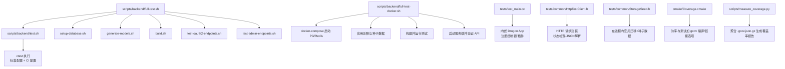
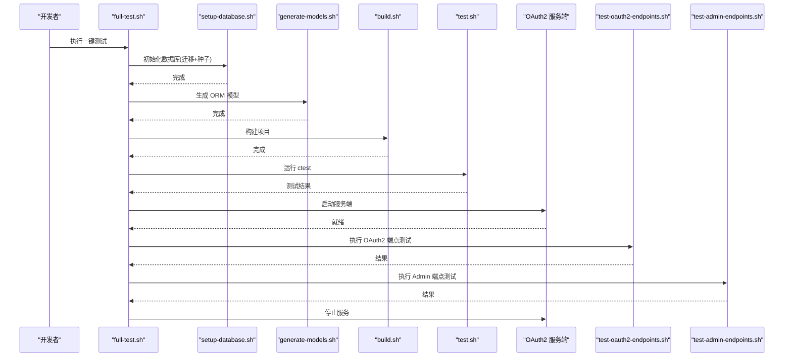
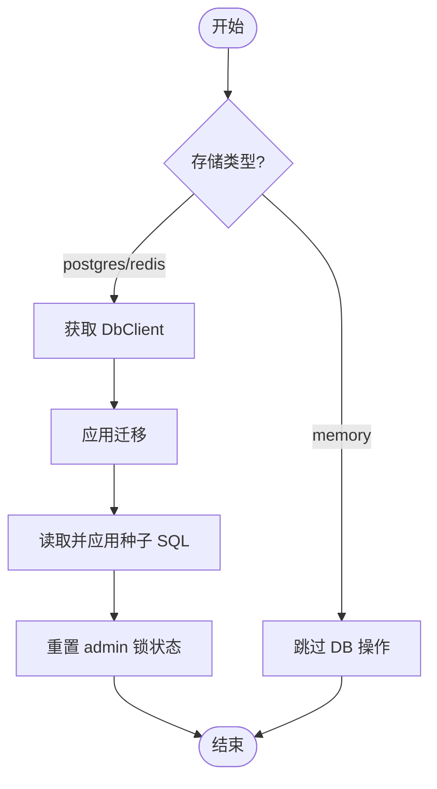
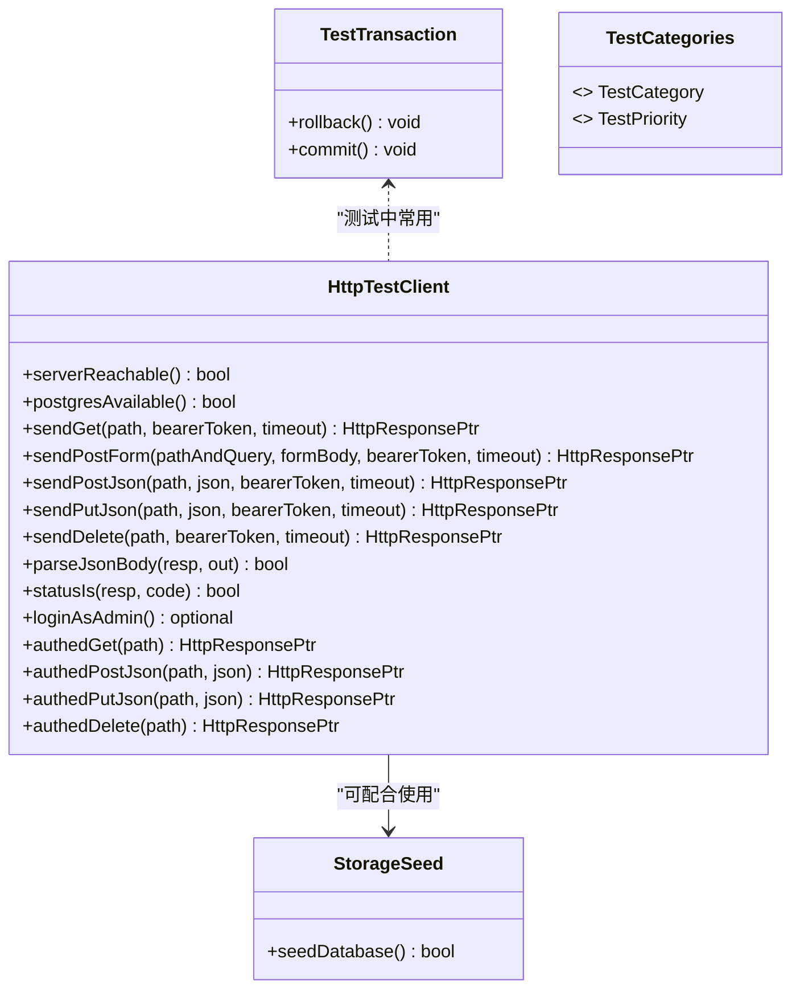
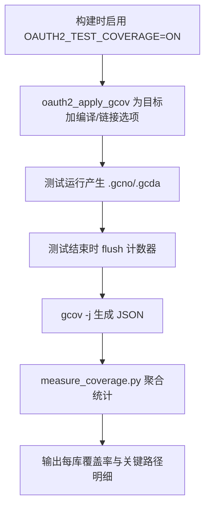
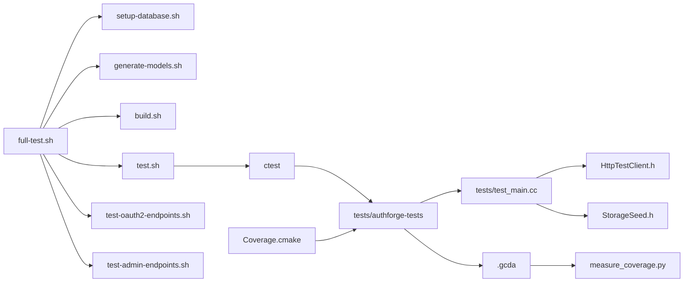

# 测试工具和基础设施

<cite>
**本文引用的文件**
- [scripts/backend/test.sh](file://scripts/backend/test.sh)
- [scripts/backend/full-test.sh](file://scripts/backend/full-test.sh)
- [scripts/backend/full-test-docker.sh](file://scripts/backend/full-test-docker.sh)
- [scripts/backend/setup-database.sh](file://scripts/backend/setup-database.sh)
- [scripts/backend/common-test-functions.sh](file://scripts/backend/common-test-functions.sh)
- [cmake/Coverage.cmake](file://cmake/Coverage.cmake)
- [tests/test_main.cc](file://tests/test_main.cc)
- [tests/common/HttpTestClient.h](file://tests/common/HttpTestClient.h)
- [tests/common/StorageSeed.h](file://tests/common/StorageSeed.h)
- [tests/common/TestBase.h](file://tests/common/TestBase.h)
- [tests/common/test_categories.h](file://tests/common/test_categories.h)
- [tests/performance/benchmark/PerformanceBenchmark.cc](file://tests/performance/benchmark/PerformanceBenchmark.cc)
- [scripts/measure_coverage.py](file://scripts/measure_coverage.py)
- [docs/backend/testing-guide.md](file://docs/backend/testing-guide.md)
</cite>

## 目录
1. [简介](#简介)
2. [项目结构](#项目结构)
3. [核心组件](#核心组件)
4. [架构总览](#架构总览)
5. [详细组件分析](#详细组件分析)
6. [依赖关系分析](#依赖关系分析)
7. [性能考虑](#性能考虑)
8. [故障排查指南](#故障排查指南)
9. [结论](#结论)
10. [附录](#附录)

## 简介
本文件面向 AuthForge 后端测试工具与基础设施，覆盖以下目标：
- 测试执行脚本使用方法：完整测试套件、快速测试、Docker 环境测试
- 测试数据库初始化与清理工具
- 测试辅助类与 Mock 框架：HttpTestClient、StorageSeed 等公共测试工具
- 测试分类与选择性执行方法
- 测试覆盖率收集与报告分析
- 测试性能基准与回归测试
- 测试环境故障排查与常见问题解决方案

## 项目结构
测试相关的关键位置与职责概览：
- scripts/backend：测试编排与运行脚本（构建、启动服务、执行 ctest、API 端点测试）
- tests：测试源码与主入口（Drogon 测试框架、HTTP 集成测试、契约测试、安全测试、性能基准）
- cmake/Coverage.cmake：gcov 覆盖率开关与注入逻辑
- docs/backend/testing-guide.md：测试策略、分层、执行方式与覆盖率说明

图表来源
- [scripts/backend/test.sh:1-87](file://scripts/backend/test.sh#L1-L87)
- [scripts/backend/full-test.sh:1-157](file://scripts/backend/full-test.sh#L1-L157)
- [scripts/backend/full-test-docker.sh:1-188](file://scripts/backend/full-test-docker.sh#L1-L188)
- [tests/test_main.cc:270-537](file://tests/test_main.cc#L270-L537)
- [tests/common/HttpTestClient.h:1-424](file://tests/common/HttpTestClient.h#L1-L424)
- [tests/common/StorageSeed.h:1-195](file://tests/common/StorageSeed.h#L1-L195)
- [cmake/Coverage.cmake:1-112](file://cmake/Coverage.cmake#L1-L112)
- [scripts/measure_coverage.py:1-68](file://scripts/measure_coverage.py#L1-L68)

章节来源
- [docs/backend/testing-guide.md:1-352](file://docs/backend/testing-guide.md#L1-L352)

## 核心组件
- 测试执行脚本
  - test.sh：按预设构建类型运行 ctest，先以标准配置运行，再以 CI 配置运行（若存在）
  - full-test.sh：一键流程：初始化数据库 → 生成 ORM 模型 → 构建 → 运行测试 → 启动服务端 → 调用 OAuth2/Admin 端点测试脚本 → 停止服务
  - full-test-docker.sh：使用 Docker Compose 拉起 PG/Redis，应用迁移和种子数据，构建并运行测试，启动服务端并验证 API，最后清理容器
- 数据库初始化工具
  - setup-database.sh：创建数据库、应用迁移、应用种子数据；支持本地或 Docker 环境
  - StorageSeed.h：在测试进程内通过 SchemaManager 应用迁移与种子数据，保证 admin 用户与客户端存在，且幂等
- HTTP 测试辅助
  - HttpTestClient.h：提供 serverReachable/post/get/put/delete/json/form 发送、响应解析、admin 登录获取 token 的便捷方法，屏蔽端口与连接细节
- 测试基类与分类
  - TestBase.h：事务保护 TestTransaction，便于测试后回滚
  - test_categories.h：测试类别与优先级枚举，用于组织与筛选
- 覆盖率与报告
  - Coverage.cmake：为每个目标启用 gcov 编译/链接选项，定义宏控制 gcov 特定代码
  - measure_coverage.py：聚合 gcov JSON 输出，统计各库行覆盖率
- 性能基准
  - PerformanceBenchmark.cc：对 Subject 生成/解析进行压力测试，输出平均耗时与 P95

章节来源
- [scripts/backend/test.sh:1-87](file://scripts/backend/test.sh#L1-L87)
- [scripts/backend/full-test.sh:1-157](file://scripts/backend/full-test.sh#L1-L157)
- [scripts/backend/full-test-docker.sh:1-188](file://scripts/backend/full-test-docker.sh#L1-L188)
- [scripts/backend/setup-database.sh:1-66](file://scripts/backend/setup-database.sh#L1-L66)
- [tests/common/StorageSeed.h:1-195](file://tests/common/StorageSeed.h#L1-L195)
- [tests/common/HttpTestClient.h:1-424](file://tests/common/HttpTestClient.h#L1-L424)
- [tests/common/TestBase.h:1-98](file://tests/common/TestBase.h#L1-L98)
- [tests/common/test_categories.h:1-84](file://tests/common/test_categories.h#L1-L84)
- [cmake/Coverage.cmake:1-112](file://cmake/Coverage.cmake#L1-L112)
- [scripts/measure_coverage.py:1-68](file://scripts/measure_coverage.py#L1-L68)
- [tests/performance/benchmark/PerformanceBenchmark.cc:1-78](file://tests/performance/benchmark/PerformanceBenchmark.cc#L1-L78)

## 架构总览
测试执行的整体时序如下：

图表来源
- [scripts/backend/full-test.sh:1-157](file://scripts/backend/full-test.sh#L1-L157)
- [scripts/backend/setup-database.sh:1-66](file://scripts/backend/setup-database.sh#L1-L66)
- [scripts/backend/test.sh:1-87](file://scripts/backend/test.sh#L1-L87)

## 详细组件分析

### 测试执行脚本
- test.sh
  - 解析参数选择 Debug/Release，确定 CMake preset，进入对应构建目录
  - 两次 ctest：标准配置与 CI 配置（若存在），失败时恢复备份配置并退出
- full-test.sh
  - 顺序步骤：初始化数据库 → 生成 ORM 模型 → 构建 → 运行测试 → 启动服务端 → 调用 OAuth2/Admin 端点测试脚本 → 停止服务
  - 捕获服务器进程 PID，确保退出时清理
- full-test-docker.sh
  - 检查 docker/docker-compose 可用性
  - 启动 PG/Redis，等待 PG 就绪
  - 删除并重建数据库，应用迁移与种子数据
  - 生成 ORM 模型、构建、运行测试
  - 设置环境变量指向 Docker 暴露的端口，启动服务端并验证 API
  - 停止服务与容器

章节来源
- [scripts/backend/test.sh:1-87](file://scripts/backend/test.sh#L1-L87)
- [scripts/backend/full-test.sh:1-157](file://scripts/backend/full-test.sh#L1-L157)
- [scripts/backend/full-test-docker.sh:1-188](file://scripts/backend/full-test-docker.sh#L1-L188)

### 测试数据库初始化与清理
- setup-database.sh
  - 读取环境变量配置 DB 用户/密码/主机/端口
  - 使用 psql 删除并创建数据库，应用迁移与种子 SQL
  - 错误信息明确，便于定位连接或权限问题
- StorageSeed.h
  - 在测试进程内通过 SchemaManager::migrate 与应用种子 SQL
  - 幂等设计：迁移跟踪表 + 种子 ON CONFLICT DO NOTHING
  - 重置 admin 账户锁状态，避免历史失败导致后续测试被锁定
  - 内存模式跳过 DB 操作，保持跨平台一致性

图表来源
- [tests/common/StorageSeed.h:104-192](file://tests/common/StorageSeed.h#L104-L192)
- [scripts/backend/setup-database.sh:1-66](file://scripts/backend/setup-database.sh#L1-L66)

章节来源
- [scripts/backend/setup-database.sh:1-66](file://scripts/backend/setup-database.sh#L1-L66)
- [tests/common/StorageSeed.h:1-195](file://tests/common/StorageSeed.h#L1-L195)

### 测试辅助类与 Mock 框架
- HttpTestClient.h
  - serverReachable：轮询健康端点，确认服务已监听
  - postgresAvailable：判断是否非 memory 存储，决定能否执行需要 DB 的路径
  - sendGet/sendPostForm/sendPostJson/sendPutJson/sendDelete：统一构造请求、设置 Content-Type、Bearer Token、超时
  - parseJsonBody/statusIs：统一解析响应与状态码检查
  - loginAsAdmin：两步授权码流程获取访问令牌，供认证测试复用
  - authedGet/authedPostJson/authedPutJson/authedDelete：便捷封装，自动附加令牌
- StorageSeed.h：见上节
- TestBase.h
  - TestTransaction：RAII 事务保护，析构时回滚，避免污染后续用例
  - TestBase：占位基类，可扩展全局 setup/teardown
- test_categories.h
  - TestCategory/TestPriority：单元、集成、E2E、性能、安全、API、数据库、验收；P0-P3 优先级
  - 字符串转换函数，便于日志与筛选

图表来源
- [tests/common/HttpTestClient.h:1-424](file://tests/common/HttpTestClient.h#L1-L424)
- [tests/common/StorageSeed.h:1-195](file://tests/common/StorageSeed.h#L1-L195)
- [tests/common/TestBase.h:1-98](file://tests/common/TestBase.h#L1-L98)
- [tests/common/test_categories.h:1-84](file://tests/common/test_categories.h#L1-L84)

章节来源
- [tests/common/HttpTestClient.h:1-424](file://tests/common/HttpTestClient.h#L1-L424)
- [tests/common/StorageSeed.h:1-195](file://tests/common/StorageSeed.h#L1-L195)
- [tests/common/TestBase.h:1-98](file://tests/common/TestBase.h#L1-L98)
- [tests/common/test_categories.h:1-84](file://tests/common/test_categories.h#L1-L84)

### 测试分类与选择性执行
- 分类维度
  - 层级：单元、契约、集成、安全、E2E/功能、性能
  - 优先级：P0/P1/P2/P3
- 选择性执行
  - 通过 ctest 标签（如 Contract）与测试名称过滤
  - 结合 manage.sh/manage.ps1 的快捷命令（如 test-backend、full-test、test-admin-endpoints、test-oauth2-endpoints）
  - 内存模式开关可在无外部 DB 环境下运行子集

章节来源
- [docs/backend/testing-guide.md:24-46](file://docs/backend/testing-guide.md#L24-L46)
- [docs/backend/testing-guide.md:90-125](file://docs/backend/testing-guide.md#L90-L125)
- [tests/common/test_categories.h:1-84](file://tests/common/test_categories.h#L1-L84)

### 覆盖率收集与报告分析
- 启用覆盖率
  - 通过 cmake/Coverage.cmake 的 oauth2_apply_gcov(target) 为目标添加 -fprofile-arcs -ftest-coverage 与 -g，并在 GCC 下显式链接 libgcov
  - 仅在 GCC/Clang 生效，MSVC 忽略并提示
  - 建议在 Debug 构建下使用，避免 Release 内联影响行号归属
- 运行时 flush
  - tests/test_main.cc 在 fast-exit 前调用 __gcov_dump/__gcov_flush，确保计数器写入 .gcda
- 聚合报告
  - 使用 scripts/measure_coverage.py 聚合 gcov JSON 输出，统计 libs/*/src/*.cc 的行覆盖率，排除 models/
  - 输出按库汇总与关键目录（如 admin/controllers）逐文件统计

图表来源
- [cmake/Coverage.cmake:1-112](file://cmake/Coverage.cmake#L1-L112)
- [tests/test_main.cc:25-46](file://tests/test_main.cc#L25-L46)
- [scripts/measure_coverage.py:1-68](file://scripts/measure_coverage.py#L1-L68)

章节来源
- [cmake/Coverage.cmake:1-112](file://cmake/Coverage.cmake#L1-L112)
- [tests/test_main.cc:25-46](file://tests/test_main.cc#L25-L46)
- [scripts/measure_coverage.py:1-68](file://scripts/measure_coverage.py#L1-L68)
- [docs/backend/testing-guide.md:233-297](file://docs/backend/testing-guide.md#L233-L297)

### 性能基准与回归测试
- PerformanceBenchmark.cc
  - 对 Subject 生成与解析进行大规模循环，记录平均延迟与 P95
  - 断言阈值，作为回归门槛
- 建议
  - 将关键路径加入基准测试，定期运行并对比基线
  - 结合 CI 自动化，防止性能退化

章节来源
- [tests/performance/benchmark/PerformanceBenchmark.cc:1-78](file://tests/performance/benchmark/PerformanceBenchmark.cc#L1-L78)

## 依赖关系分析
- 脚本依赖
  - full-test.sh 依赖 setup-database.sh、generate-models.sh、build.sh、test.sh、test-oauth2-endpoints.sh、test-admin-endpoints.sh
  - full-test-docker.sh 依赖 docker-compose 与 PG/Redis 容器
- 测试二进制依赖
  - tests/test_main.cc 注册所有控制器与插件，启动 Drogon 事件循环，再执行测试
  - HttpTestClient.h 依赖 Drogon HttpClient/HttpRequest/HttpResponse 与 OAuth2Plugin
  - StorageSeed.h 依赖 SchemaManager 与 DbClient
- 覆盖率依赖
  - Coverage.cmake 为库与测试目标注入编译/链接选项
  - test_main.cc 在退出前 flush gcov 计数器
  - measure_coverage.py 解析 gcov JSON 输出

图表来源
- [scripts/backend/full-test.sh:1-157](file://scripts/backend/full-test.sh#L1-L157)
- [scripts/backend/test.sh:1-87](file://scripts/backend/test.sh#L1-L87)
- [tests/test_main.cc:270-537](file://tests/test_main.cc#L270-L537)
- [tests/common/HttpTestClient.h:1-424](file://tests/common/HttpTestClient.h#L1-L424)
- [tests/common/StorageSeed.h:1-195](file://tests/common/StorageSeed.h#L1-L195)
- [cmake/Coverage.cmake:1-112](file://cmake/Coverage.cmake#L1-L112)
- [scripts/measure_coverage.py:1-68](file://scripts/measure_coverage.py#L1-L68)

章节来源
- [scripts/backend/full-test.sh:1-157](file://scripts/backend/full-test.sh#L1-L157)
- [scripts/backend/test.sh:1-87](file://scripts/backend/test.sh#L1-L87)
- [tests/test_main.cc:270-537](file://tests/test_main.cc#L270-L537)
- [tests/common/HttpTestClient.h:1-424](file://tests/common/HttpTestClient.h#L1-L424)
- [tests/common/StorageSeed.h:1-195](file://tests/common/StorageSeed.h#L1-L195)
- [cmake/Coverage.cmake:1-112](file://cmake/Coverage.cmake#L1-L112)
- [scripts/measure_coverage.py:1-68](file://scripts/measure_coverage.py#L1-L68)

## 性能考虑
- 测试启动预热：test_main.cc 在 Drogon 就绪后预留预热时间，减少首次请求抖动
- 并发与线程安全：HttpTestClient 使用同步 sendRequest，确保不在事件循环线程调用以避免死锁
- 覆盖率开销：gcov 会增加编译与运行开销，建议在 Debug 构建下使用，并按需聚合
- 基准测试：PerformanceBenchmark.cc 提供稳定回归指标，建议纳入 CI 周期

[本节提供通用指导，不直接分析具体文件]

## 故障排查指南
- 数据库连接失败
  - 检查环境变量 OAUTH2_DB_HOST/OAUTH2_DB_PORT/OAUTH2_DB_USER/OAUTH2_DB_PASSWORD
  - 使用 setup-database.sh 重新初始化数据库，查看 psql 错误输出
- 服务无法启动
  - 检查端口占用与 config.json 路径
  - 使用 full-test.sh/full-test-docker.sh 的一键流程，观察启动日志
- 登录/令牌交换失败
  - 确认用户名密码、client_id、redirect_uri 与配置一致
  - 使用 HttpTestClient.loginAsAdmin 或 common-test-functions.sh 中的 get_admin_token 获取令牌
- 覆盖率报告为零
  - 确认已启用 OAUTH2_TEST_COVERAGE=ON，并为所有目标调用 oauth2_apply_gcov
  - 确保测试结束后 flush 计数器（test_main.cc 已处理）
  - 使用 measure_coverage.py 聚合 JSON 输出，避免 gcovr 路径匹配问题
- 常见脚本错误
  - 缺少 psql/docker 命令：安装并加入 PATH
  - Docker 未运行：启动 Docker 引擎后再执行 full-test-docker.sh

章节来源
- [scripts/backend/setup-database.sh:1-66](file://scripts/backend/setup-database.sh#L1-L66)
- [scripts/backend/common-test-functions.sh:1-228](file://scripts/backend/common-test-functions.sh#L1-L228)
- [tests/common/HttpTestClient.h:1-424](file://tests/common/HttpTestClient.h#L1-L424)
- [cmake/Coverage.cmake:1-112](file://cmake/Coverage.cmake#L1-L112)
- [scripts/measure_coverage.py:1-68](file://scripts/measure_coverage.py#L1-L68)
- [docs/backend/testing-guide.md:302-352](file://docs/backend/testing-guide.md#L302-L352)

## 结论
AuthForge 的测试基础设施提供了从单元到集成、从端到端到性能基准的全链路能力。通过脚本化的一键流程、健壮的数据库初始化与种子机制、完善的 HTTP 测试辅助与事务保护、以及可量化的覆盖率与基准测试，团队可以高效地维护质量与性能。建议在日常开发中：
- 使用 full-test.sh 或 full-test-docker.sh 进行全量验证
- 利用 HttpTestClient 与 StorageSeed 编写稳定的集成测试
- 按需启用覆盖率并聚合报告，关注关键路径回归
- 将性能基准纳入 CI，持续监控回归

[本节总结性内容，不直接分析具体文件]

## 附录
- 快速参考
  - 运行单元测试与集成测试：scripts/backend/test.sh
  - 一键全流程：scripts/backend/full-test.sh
  - Docker 环境全流程：scripts/backend/full-test-docker.sh
  - 数据库初始化：scripts/backend/setup-database.sh
  - 覆盖率聚合：scripts/measure_coverage.py
  - 性能基准：tests/performance/benchmark/PerformanceBenchmark.cc

[本节为补充信息，不直接分析具体文件]