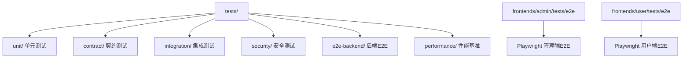
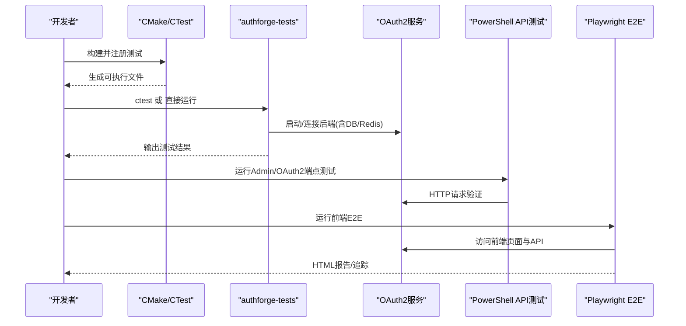
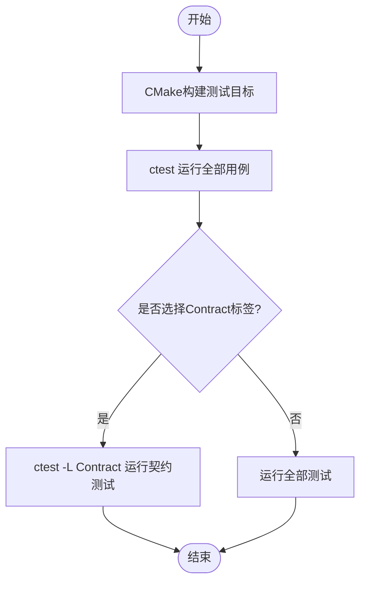
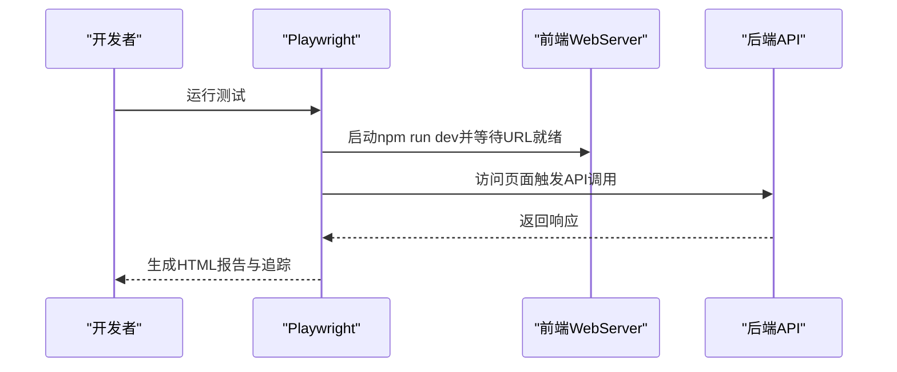
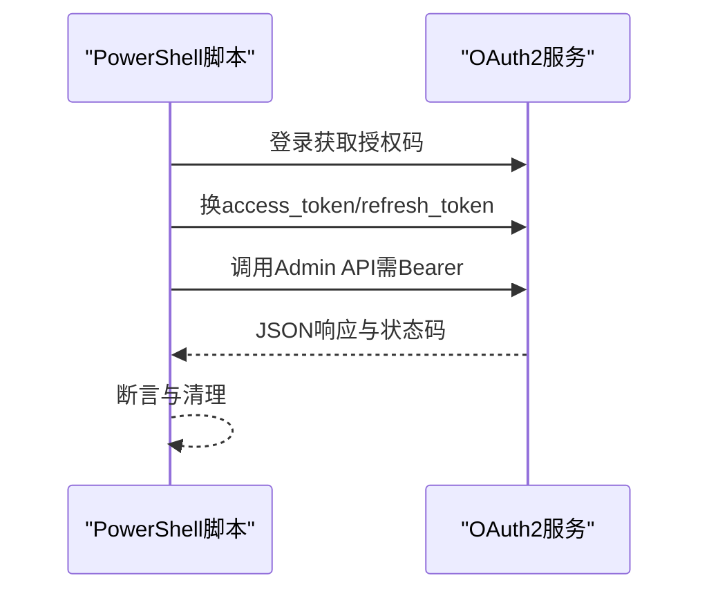
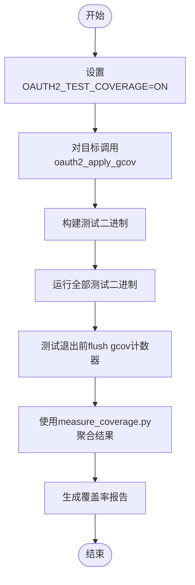
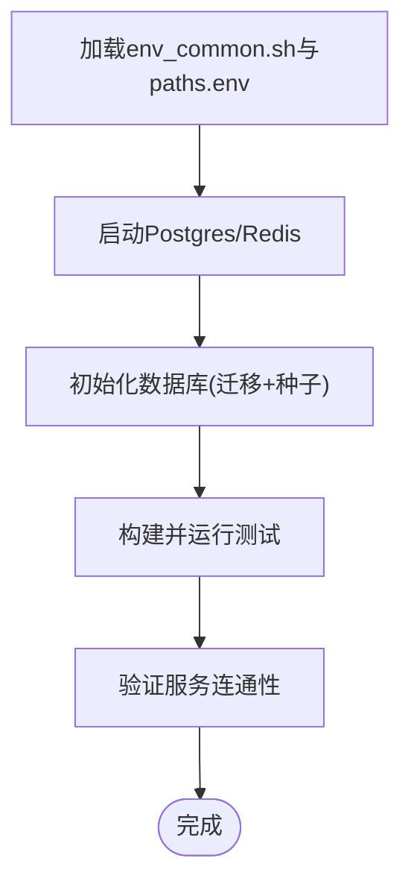
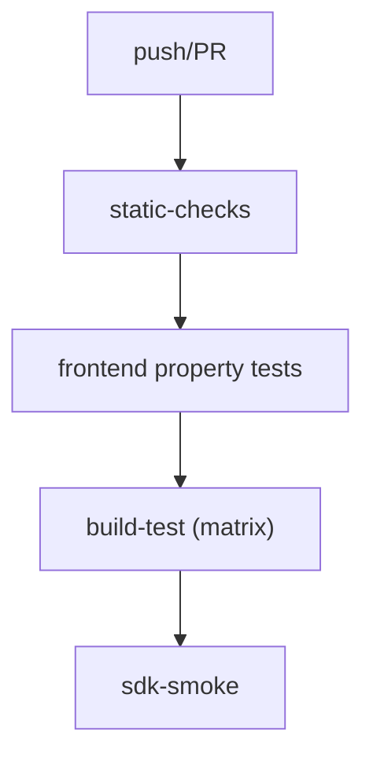
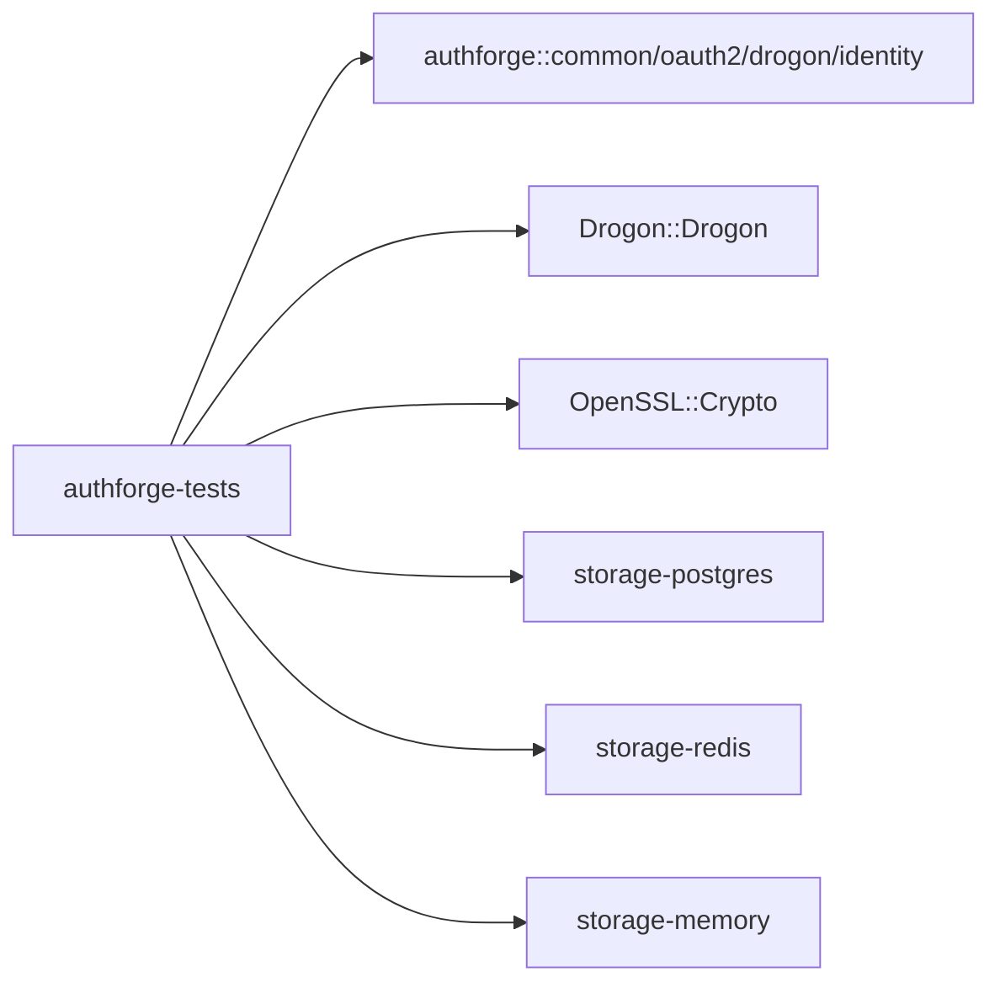

# 测试策略

<cite>
**本文引用的文件**
- [tests/CMakeLists.txt](file://tests/CMakeLists.txt)
- [scripts/backend/test.sh](file://scripts/backend/test.sh)
- [scripts/backend/full-test.sh](file://scripts/backend/full-test.sh)
- [frontends/admin/playwright.config.ts](file://frontends/admin/playwright.config.ts)
- [frontends/user/playwright.config.ts](file://frontends/user/playwright.config.ts)
- [cmake/Coverage.cmake](file://cmake/Coverage.cmake)
- [.github/workflows/ci.yml](file://.github/workflows/ci.yml)
- [docs/backend/testing-guide.md](file://docs/backend/testing-guide.md)
- [scripts/backend/test-admin-endpoints.ps1](file://scripts/backend/test-admin-endpoints.ps1)
- [scripts/backend/test-oauth2-endpoints.ps1](file://scripts/backend/test-oauth2-endpoints.ps1)
- [scripts/backend/env_common.sh](file://scripts/backend/env_common.sh)
- [deploy/docker/docker-compose.debug.yml](file://deploy/docker/docker-compose.debug.yml)
- [docs/history/design/http-integration-test-coverage-plan.md](file://docs/history/design/http-integration-test-coverage-plan.md)
</cite>

## 目录
1. [简介](#简介)
2. [项目结构](#项目结构)
3. [核心组件](#核心组件)
4. [架构总览](#架构总览)
5. [详细组件分析](#详细组件分析)
6. [依赖关系分析](#依赖关系分析)
7. [性能考虑](#性能考虑)
8. [故障排查指南](#故障排查指南)
9. [结论](#结论)
10. [附录](#附录)

## 简介
本测试策略文档面向AuthForge项目的后端与前端测试体系，覆盖C++单元测试、集成测试、契约测试的组织与执行；前端E2E（Playwright）自动化测试与报告；API测试（Admin API与OAuth2核心流程的PowerShell脚本）；覆盖率收集与分析；测试环境搭建与数据准备；持续集成中的质量门禁；以及调试技巧与常见问题解决方案。目标是让不同背景的读者都能理解并高效执行全链路测试。

## 项目结构
测试代码按分层组织在顶层tests目录中，并通过CMake统一编译为单一可执行文件，便于使用ctest集中管理。前端E2E测试位于各自应用的tests/e2e目录，使用Playwright配置驱动浏览器自动化。

图表来源
- [tests/CMakeLists.txt:67-76](file://tests/CMakeLists.txt#L67-L76)

章节来源
- [tests/CMakeLists.txt:1-105](file://tests/CMakeLists.txt#L1-L105)

## 核心组件
- 后端测试入口与构建：通过tests/CMakeLists.txt将所有层级测试源合并为一个可执行目标，并使用Drogon测试框架注册用例；支持可选内存模式开关和覆盖率开关。
- 测试运行器：scripts/backend/test.sh封装ctest执行，分别以默认配置和CI配置运行两次，确保多配置兼容性。
- 一键全量测试：scripts/backend/full-test.sh串联数据库初始化、ORM模型生成、构建、运行C++测试、启动服务、执行API测试、停止服务。
- 前端E2E：frontends/*/playwright.config.ts定义浏览器、重试、追踪、WebServer启动等策略。
- 覆盖率：cmake/Coverage.cmake提供gcov注入函数，对每个目标启用编译与链接期覆盖率标志，并在测试退出前显式flush计数器。
- CI：.github/workflows/ci.yml定义三阶段门禁（静态检查、构建测试、SDK冒烟），矩阵化Linux/Windows/macOS，按需启用数据库与CI配置。

章节来源
- [tests/CMakeLists.txt:100-186](file://tests/CMakeLists.txt#L100-L186)
- [scripts/backend/test.sh:21-87](file://scripts/backend/test.sh#L21-L87)
- [scripts/backend/full-test.sh:45-157](file://scripts/backend/full-test.sh#L45-L157)
- [frontends/admin/playwright.config.ts:1-27](file://frontends/admin/playwright.config.ts#L1-L27)
- [frontends/user/playwright.config.ts:1-24](file://frontends/user/playwright.config.ts#L1-L24)
- [cmake/Coverage.cmake:34-111](file://cmake/Coverage.cmake#L34-L111)
- [.github/workflows/ci.yml:31-151](file://.github/workflows/ci.yml#L31-L151)

## 架构总览
下图展示了从源码到测试执行的端到端路径：CMake将各层测试源编译为单一二进制；test.sh调用ctest；full-test.sh在需要时拉起服务并执行PowerShell API测试；Playwright在前端应用内启动开发服务器并执行E2E；CI矩阵化执行并产出日志。

图表来源
- [tests/CMakeLists.txt:186-186](file://tests/CMakeLists.txt#L186-L186)
- [scripts/backend/test.sh:43-81](file://scripts/backend/test.sh#L43-L81)
- [scripts/backend/full-test.sh:83-135](file://scripts/backend/full-test.sh#L83-L135)
- [frontends/admin/playwright.config.ts:20-25](file://frontends/admin/playwright.config.ts#L20-L25)
- [frontends/user/playwright.config.ts:17-22](file://frontends/user/playwright.config.ts#L17-L22)

## 详细组件分析

### 后端测试套件（C++）
- 组织结构
  - unit：纯逻辑单元（配置、错误、工具、校验、插件、Schema、Subject、初始化顺序）。
  - contract：跨存储后端的仓储契约一致性（Postgres/Redis/Memory），通过标签“Contract”可按ctest筛选。
  - integration：完整业务流程、并发竞态、错误信封、插件组装。
  - security：SQL注入、XSS、命令注入、CORS、Token安全、速率限制。
  - e2e-backend/performance：完整OAuth2流程、性能基准。
- 构建与执行
  - 所有测试源被合并到一个可执行目标，使用DROGON_TEST框架；可通过-OAUTH2_MEMORY_TESTS_ONLY=ON在无外部DB下运行Memory子集。
  - 使用ctest运行，支持--output-on-failure与超时控制；也可直接运行测试二进制，内部自动启动Drogon App实例。
- 契约测试标签
  - 通过add_test逐个注册契约测试名称，并打上LABELS "Contract"，支持ctest -L Contract单独执行。

图表来源
- [tests/CMakeLists.txt:188-321](file://tests/CMakeLists.txt#L188-L321)

章节来源
- [docs/backend/testing-guide.md:24-46](file://docs/backend/testing-guide.md#L24-L46)
- [tests/CMakeLists.txt:67-105](file://tests/CMakeLists.txt#L67-L105)
- [tests/CMakeLists.txt:186-321](file://tests/CMakeLists.txt#L186-L321)

### 集成测试与E2E（后端）
- 集成测试覆盖认证、令牌、存储、并发、错误、插件等场景；部分测试依赖Postgres/Redis，内存模式下自动跳过。
- E2E测试模拟完整OAuth2授权码流程，要求运行中的Drogon App与后端服务可用。

章节来源
- [docs/backend/testing-guide.md:65-86](file://docs/backend/testing-guide.md#L65-L86)

### 契约测试（跨存储后端）
- 针对IClientRepository/IGrantRepository/ITokenRepository/IConsentRepository/IUserRepository在不同后端的一致性进行断言。
- 通过命名约定与ctest标签组合，实现细粒度筛选与并行执行。

章节来源
- [tests/CMakeLists.txt:188-321](file://tests/CMakeLists.txt#L188-L321)

### 前端E2E测试（Playwright）
- 管理端与用户端均使用Playwright，配置包含：
  - testDir指向tests/e2e
  - fullyParallel开启并行
  - CI环境下retries与workers调整
  - reporter输出HTML报告
  - webServer自动启动前端开发服务器并等待就绪
- 追踪策略：首次重试时生成trace，便于定位问题。

图表来源
- [frontends/admin/playwright.config.ts:3-25](file://frontends/admin/playwright.config.ts#L3-L25)
- [frontends/user/playwright.config.ts:3-22](file://frontends/user/playwright.config.ts#L3-L22)

章节来源
- [frontends/admin/playwright.config.ts:1-27](file://frontends/admin/playwright.config.ts#L1-L27)
- [frontends/user/playwright.config.ts:1-24](file://frontends/user/playwright.config.ts#L1-L24)

### API测试（PowerShell）
- Admin API测试脚本覆盖仪表盘、客户端、令牌、用户、角色、范围、审计日志、组织管理等端点，包含成功路径与错误分支（400/401/403/404/409）。
- OAuth2端点测试脚本覆盖健康检查、OIDC发现、JWKS、登录换码、令牌交换、UserInfo、刷新、客户端凭证、令牌探查、撤销、注册、MFA、WebAuthn、设备授权流等。
- 公共函数与辅助方法集中在common-test-functions.*中，用于获取令牌、重置管理员账户等。

图表来源
- [scripts/backend/test-admin-endpoints.ps1:44-66](file://scripts/backend/test-admin-endpoints.ps1#L44-L66)
- [scripts/backend/test-oauth2-endpoints.ps1:98-137](file://scripts/backend/test-oauth2-endpoints.ps1#L98-L137)

章节来源
- [scripts/backend/test-admin-endpoints.ps1:1-772](file://scripts/backend/test-admin-endpoints.ps1#L1-L772)
- [scripts/backend/test-oauth2-endpoints.ps1:1-800](file://scripts/backend/test-oauth2-endpoints.ps1#L1-L800)

### 覆盖率收集与报告分析
- 启用方式：设置OAUTH2_TEST_COVERAGE=ON，调用oauth2_apply_gcov(target)为目标添加编译与链接期覆盖率标志，并显式链接libgcov（GCC）。
- 注意事项：
  - 仅GCC/Clang有效，MSVC忽略并警告。
  - 建议在Debug构建下运行以获得更准确的行号映射。
  - 测试main在fast-exit前显式flush gcov计数器，避免计数丢失。
- 聚合工具：推荐使用scripts/measure_coverage.py基于gcov JSON格式聚合，绕过gcovr路径匹配问题。

图表来源
- [cmake/Coverage.cmake:34-111](file://cmake/Coverage.cmake#L34-L111)
- [docs/backend/testing-guide.md:263-296](file://docs/backend/testing-guide.md#L263-L296)

章节来源
- [cmake/Coverage.cmake:1-112](file://cmake/Coverage.cmake#L1-L112)
- [docs/backend/testing-guide.md:233-296](file://docs/backend/testing-guide.md#L233-L296)

### 测试环境搭建与数据准备
- 前置服务：PostgreSQL与Redis需启动并可连接；可使用Docker快速启动。
- 数据库初始化：通过setup-database.*脚本创建数据库、应用迁移与种子数据；CI中通过工作流步骤依次应用migrations/V*.sql与seed/*.sql。
- 环境变量：env_common.sh加载paths.env并导出绝对路径，解析CMake预设名，确保脚本可移植。
- Docker调试：docker-compose.debug.yml提供Postgres/Redis与服务容器网络，便于本地调试。

图表来源
- [scripts/backend/env_common.sh:1-83](file://scripts/backend/env_common.sh#L1-L83)
- [deploy/docker/docker-compose.debug.yml:1-84](file://deploy/docker/docker-compose.debug.yml#L1-L84)
- [.github/workflows/_build-test.yml:261-282](file://.github/workflows/_build-test.yml#L261-L282)

章节来源
- [docs/backend/testing-guide.md:7-21](file://docs/backend/testing-guide.md#L7-L21)
- [scripts/backend/setup_database.bat:1-36](file://scripts/backend/setup_database.bat#L1-L36)
- [deploy/docker/docker-compose.debug.yml:1-84](file://deploy/docker/docker-compose.debug.yml#L1-L84)

### 持续集成中的测试执行与质量门禁
- 三阶段门禁：
  - 静态检查：架构分层、迁移规范、API差异、命名约定、manage脚本一致性、OpenAPI校验。
  - 构建测试：矩阵化Linux/Windows/macOS，按需启用数据库与CI配置，运行ctest。
  - SDK冒烟：全栈find_package冒烟测试。
- 平台差异：
  - Linux：启用数据库，运行完整测试。
  - Windows：无数据库，使用CI配置（内存存储）。
  - macOS：内存模式，跳过数据库相关测试。
- 产物与日志：各平台输出测试日志工件，便于失败分析。

图表来源
- [.github/workflows/ci.yml:31-151](file://.github/workflows/ci.yml#L31-L151)

章节来源
- [.github/workflows/ci.yml:1-151](file://.github/workflows/ci.yml#L1-L151)

## 依赖关系分析
- 测试二进制依赖：Drogon::Drogon、OpenSSL、authforge::*库（common/oauth2/storage-*/drogon/identity）。
- 运行时依赖：Postgres/Redis（取决于测试类型与配置），前端E2E依赖Node开发与Playwright浏览器。
- 工具链：Conan包管理、CMake预设、ctest、gcov/gcovr、PowerShell。

图表来源
- [tests/CMakeLists.txt:118-125](file://tests/CMakeLists.txt#L118-L125)

章节来源
- [tests/CMakeLists.txt:118-125](file://tests/CMakeLists.txt#L118-L125)

## 性能考虑
- 并行执行：Playwright启用fullyParallel，CI中根据环境调整workers数量。
- 资源隔离：CI中使用独立容器与预设目录，避免共享状态干扰。
- 覆盖率开销：gcov会增加编译与运行开销，建议在Debug构建与必要时使用。

[本节为通用指导，不直接分析具体文件]

## 故障排查指南
- 常见失败原因
  - 数据库未启动或密码不匹配：检查Postgres/Redis服务与config.json配置。
  - 数据库未初始化：执行迁移与种子脚本或在CI中确保应用顺序正确。
  - PowerShell执行策略限制：使用ExecutionPolicy Bypass。
  - 端口占用：检查5555端口是否被占用。
- 调试技巧
  - 调整日志级别至DEBUG/TRACE，实时查看drogon.log。
  - Playwright首次重试生成trace，结合HTML报告定位UI问题。
  - 使用ctest -V查看详细输出，或使用-Q仅看汇总。
- 覆盖率问题
  - 确认已运行全部5个测试二进制，否则覆盖率低估。
  - 使用measure_coverage.py聚合JSON结果，避免gcovr路径匹配问题。

章节来源
- [docs/backend/testing-guide.md:142-146](file://docs/backend/testing-guide.md#L142-L146)
- [docs/backend/testing-guide.md:302-343](file://docs/backend/testing-guide.md#L302-L343)
- [docs/backend/testing-guide.md:263-296](file://docs/backend/testing-guide.md#L263-L296)

## 结论
AuthForge的测试体系采用分层设计，覆盖单元、契约、集成、安全、E2E与性能，并通过CMake与ctest统一管理。PowerShell脚本保障API契约与核心流程，Playwright覆盖前端交互体验。CI矩阵化执行与质量门禁确保跨平台稳定性。覆盖率工具链与详尽的故障排查指南帮助团队持续提升质量与效率。

[本节为总结，不直接分析具体文件]

## 附录
- 参考计划与分析报告
  - HTTP集成测试覆盖率推进计划：明确分阶段目标与修复项。
  - 端点测试覆盖率分析：统计现有测试与缺口，指导后续补充。

章节来源
- [docs/history/design/http-integration-test-coverage-plan.md:1-74](file://docs/history/design/http-integration-test-coverage-plan.md#L1-L74)