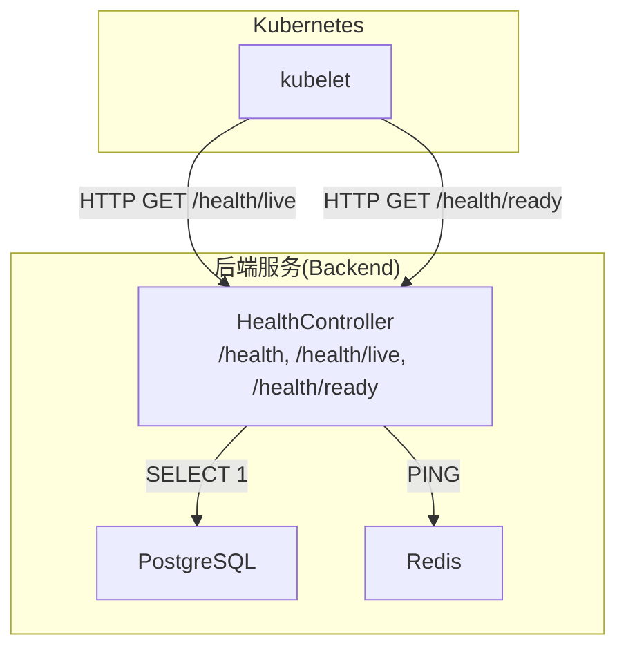
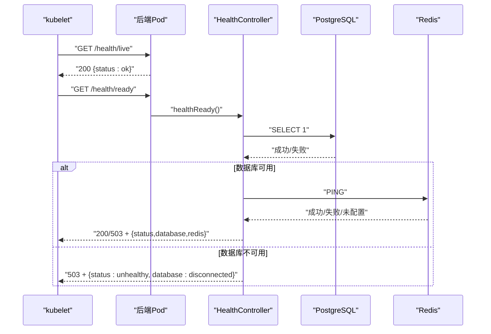
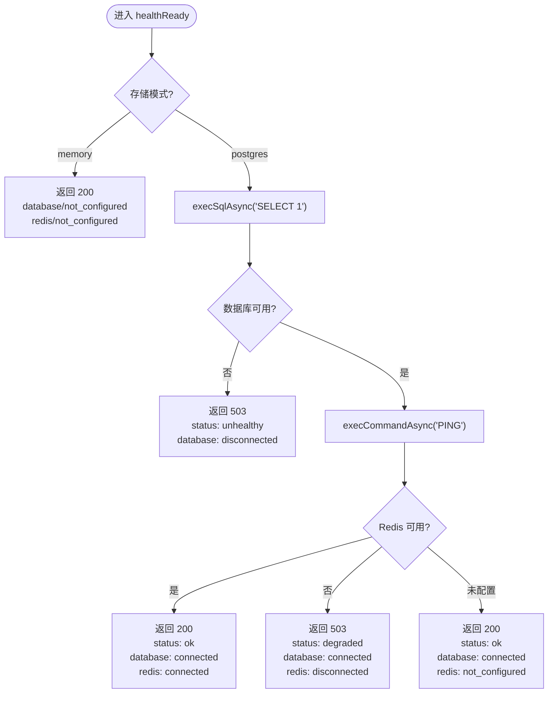
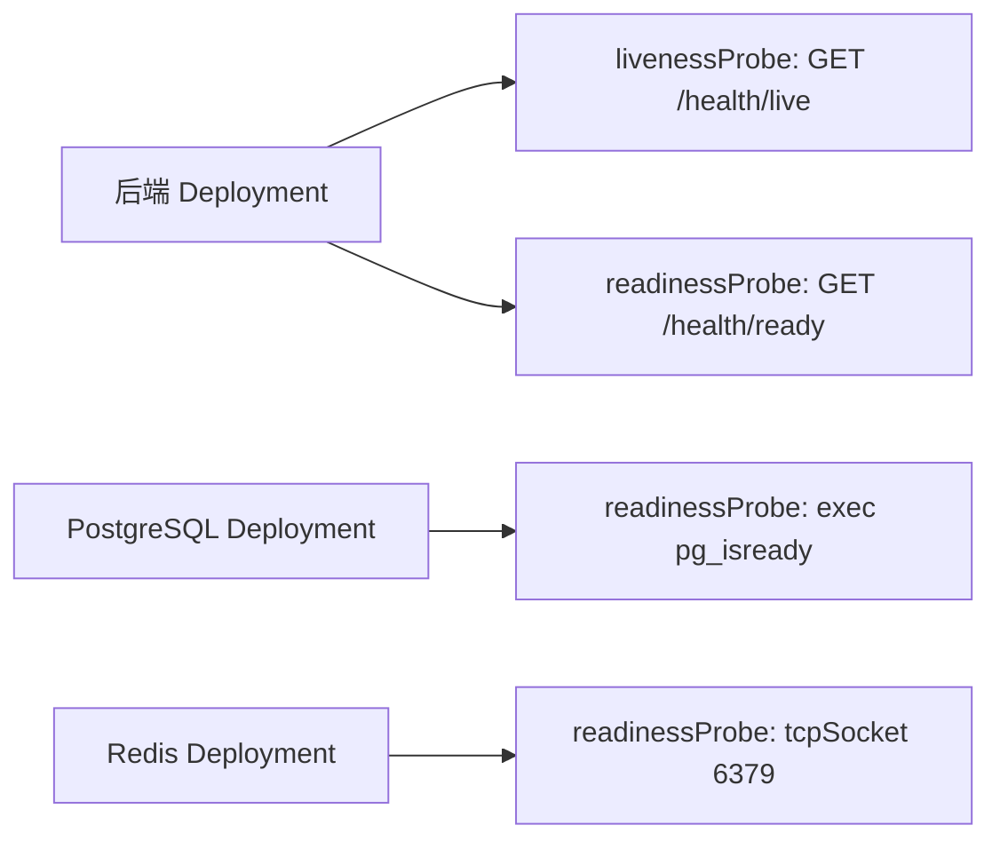
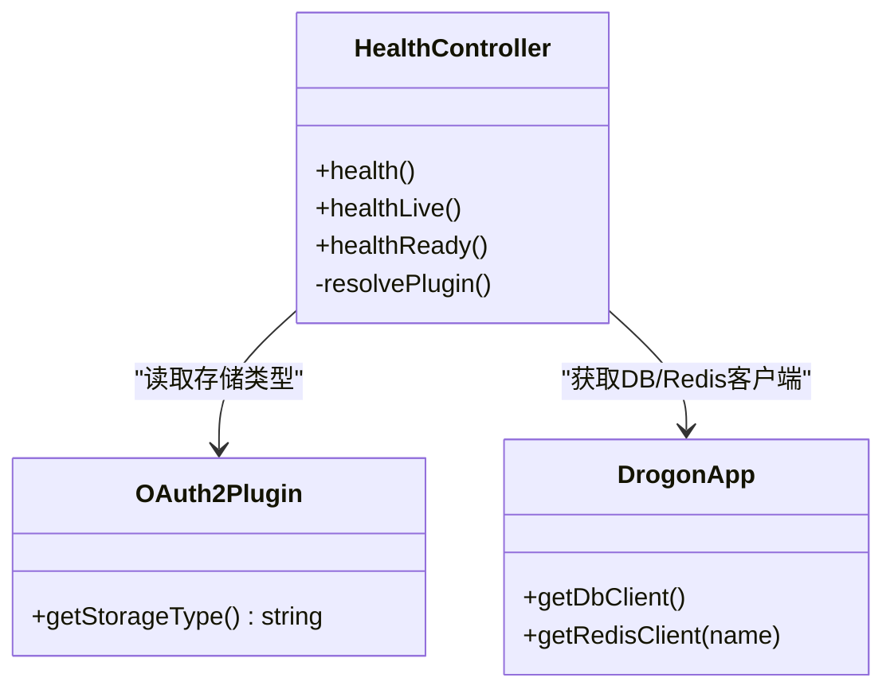

# 健康检查

<cite>
**本文引用的文件**
- [HealthController.h](file://libs/drogon/include/authforge/drogon/controllers/HealthController.h)
- [HealthController.cc](file://libs/drogon/src/controllers/HealthController.cc)
- [ControllerRegistration.cc](file://apps/server/src/bootstrap/ControllerRegistration.cc)
- [backend.yaml](file://deploy/helm/authforge/templates/backend.yaml)
- [redis.yaml](file://deploy/helm/authforge/templates/redis.yaml)
- [postgresql.yaml](file://deploy/helm/authforge/templates/postgresql.yaml)
- [HealthEndpointHttpTest.cc](file://tests/integration/controllers/HealthEndpointHttpTest.cc)
</cite>

## 目录
1. [简介](#简介)
2. [项目结构](#项目结构)
3. [核心组件](#核心组件)
4. [架构总览](#架构总览)
5. [详细组件分析](#详细组件分析)
6. [依赖关系分析](#依赖关系分析)
7. [性能考虑](#性能考虑)
8. [故障排查指南](#故障排查指南)
9. [结论](#结论)
10. [附录](#附录)

## 简介
本文件系统性说明 AuthForge 的健康检查机制，覆盖端点实现、服务状态检测、依赖连接性验证（数据库与 Redis）、就绪探针与存活探针的分类与使用场景、容器编排平台（Kubernetes）配置示例，以及失败时的自动恢复策略与告警建议。文档面向运维与开发读者，既提供高层概览，也给出代码级映射与流程图示。

## 项目结构
AuthForge 的健康检查由控制器层暴露 HTTP 端点，并通过 Drogon 应用框架访问数据库与 Redis 客户端进行依赖探测；Kubernetes 通过 Helm Chart 为后端服务配置存活与就绪探针，分别调用不同的健康端点。

图表来源
- [backend.yaml:42-57](file://deploy/helm/authforge/templates/backend.yaml#L42-L57)
- [HealthController.cc:58-169](file://libs/drogon/src/controllers/HealthController.cc#L58-L169)

章节来源
- [backend.yaml:42-57](file://deploy/helm/authforge/templates/backend.yaml#L42-L57)
- [HealthController.h:32-39](file://libs/drogon/include/authforge/drogon/controllers/HealthController.h#L32-L39)
- [HealthController.cc:14-169](file://libs/drogon/src/controllers/HealthController.cc#L14-L169)

## 核心组件
- 健康控制器 HealthController：提供三个端点
  - GET /health：基础健康信息（包含服务名、时间戳、存储类型等），不执行重 IO 操作
  - GET /health/live：存活探针，始终返回 200，仅用于进程可达性判断
  - GET /health/ready：就绪探针，检查数据库与 Redis 连通性，按结果返回 200/503 并附带详细状态字段
- 路由注册：在启动时显式注册控制器到 Drogon 应用
- Kubernetes 探针：后端 Deployment 中配置 livenessProbe 与 readinessProbe，分别指向 /health/live 与 /health/ready

章节来源
- [HealthController.h:32-39](file://libs/drogon/include/authforge/drogon/controllers/HealthController.h#L32-L39)
- [ControllerRegistration.cc:7-51](file://apps/server/src/bootstrap/ControllerRegistration.cc#L7-L51)
- [backend.yaml:42-57](file://deploy/helm/authforge/templates/backend.yaml#L42-L57)

## 架构总览
健康检查的端到端流程如下：
- kubelet 周期性发起 HTTP 请求
- 存活探针调用 /health/live，快速确认进程是否存活
- 就绪探针调用 /health/ready，依次探测数据库与 Redis 可用性
- 根据探测结果返回不同 HTTP 状态码与 JSON 体，供编排系统决策是否将 Pod 加入/移出服务流量

图表来源
- [HealthController.cc:70-169](file://libs/drogon/src/controllers/HealthController.cc#L70-L169)
- [backend.yaml:42-57](file://deploy/helm/authforge/templates/backend.yaml#L42-L57)

## 详细组件分析

### 健康控制器 HealthController
- 职责
  - 暴露 /health、/health/live、/health/ready 三个端点
  - 读取插件以获取存储类型（memory/postgres 等）
  - 对数据库与 Redis 进行轻量探测，避免业务副作用
- 关键行为
  - /health：返回服务元数据与存储类型；若无法获取插件则标记为不可用并返回 503
  - /health/live：纯元数据，始终 200
  - /health/ready：
    - 内存模式：直接返回 200，标注 database/redis 为 not_configured
    - 持久化模式：先探测数据库，再探测 Redis；任一不可用返回 503 并标注具体状态
- 错误处理
  - 数据库异常：记录错误日志，返回 503 与健康体，不泄露内部细节
  - Redis 未配置：视为正常，返回 200 并标注 not_configured
  - Redis 不可用：返回 503，标注 degraded

图表来源
- [HealthController.cc:70-169](file://libs/drogon/src/controllers/HealthController.cc#L70-L169)

章节来源
- [HealthController.cc:14-169](file://libs/drogon/src/controllers/HealthController.cc#L14-L169)
- [HealthController.h:32-73](file://libs/drogon/include/authforge/drogon/controllers/HealthController.h#L32-L73)

### 路由注册与启动装配
- 控制器在启动阶段被显式构造并注册到 Drogon 应用，确保路由生效
- 支持注入 OAuth2Plugin 指针，便于健康检查读取存储类型

章节来源
- [ControllerRegistration.cc:7-51](file://apps/server/src/bootstrap/ControllerRegistration.cc#L7-L51)

### Kubernetes 探针配置
- 后端服务
  - livenessProbe：HTTP GET /health/live，用于进程存活判定
  - readinessProbe：HTTP GET /health/ready，用于服务就绪判定
- 依赖服务
  - PostgreSQL：使用 exec 命令 pg_isready 进行就绪探测
  - Redis：使用 tcpSocket 探测端口连通性

图表来源
- [backend.yaml:42-57](file://deploy/helm/authforge/templates/backend.yaml#L42-L57)
- [postgresql.yaml:44-51](file://deploy/helm/authforge/templates/postgresql.yaml#L44-L51)
- [redis.yaml:40-44](file://deploy/helm/authforge/templates/redis.yaml#L40-L44)

章节来源
- [backend.yaml:42-57](file://deploy/helm/authforge/templates/backend.yaml#L42-L57)
- [postgresql.yaml:44-51](file://deploy/helm/authforge/templates/postgresql.yaml#L44-L51)
- [redis.yaml:40-44](file://deploy/helm/authforge/templates/redis.yaml#L40-L44)

### 集成测试与契约校验
- 针对 /health/live、/health、/health/ready 的集成测试覆盖了不同存储模式下的响应结构与状态码
- 验证要点
  - /health/live 始终 200
  - /health 包含 storage_type 且数据库状态为 connected
  - /health/ready 在内存模式下返回 not_configured，在 Postgres 模式下根据依赖可用性返回 200 或 503

章节来源
- [HealthEndpointHttpTest.cc:31-93](file://tests/integration/controllers/HealthEndpointHttpTest.cc#L31-L93)

## 依赖关系分析
- 控制器与插件：HealthController 通过注入或全局查找获取 OAuth2Plugin，用于读取存储类型
- 控制器与基础设施：
  - 数据库：Drogon ORM 客户端异步执行 SELECT 1
  - 缓存：Drogon Redis 客户端异步执行 PING
- 编排层：Kubernetes 通过 HTTP 探针与 exec/tcpSocket 探针监控服务与依赖

图表来源
- [HealthController.h:32-73](file://libs/drogon/include/authforge/drogon/controllers/HealthController.h#L32-L73)
- [HealthController.cc:9-12](file://libs/drogon/src/controllers/HealthController.cc#L9-L12)
- [HealthController.cc:101-131](file://libs/drogon/src/controllers/HealthController.cc#L101-L131)

章节来源
- [HealthController.h:32-73](file://libs/drogon/include/authforge/drogon/controllers/HealthController.h#L32-L73)
- [HealthController.cc:9-12](file://libs/drogon/src/controllers/HealthController.cc#L9-L12)
- [HealthController.cc:101-131](file://libs/drogon/src/controllers/HealthController.cc#L101-L131)

## 性能考虑
- 存活探针 /health/live：无外部 IO，开销极低，适合作为高频存活检查
- 就绪探针 /health/ready：
  - 数据库探测使用最小查询 SELECT 1，避免业务负载
  - Redis 探测使用 PING，开销极小
  - 内存模式下跳过 DB/Redis 探测，避免误判
- 建议
  - 合理设置 initialDelaySeconds、periodSeconds、timeoutSeconds、failureThreshold，避免频繁重启或误剔除
  - 在高并发环境下，确保探针间隔不会造成额外拥塞

[本节为通用指导，无需特定文件引用]

## 故障排查指南
- 常见症状与定位
  - /health/ready 持续返回 503：检查数据库连接配置与网络连通性，查看服务端错误日志
  - /health/ready 返回 degraded：数据库可用但 Redis 不可用或未配置，需检查 Redis 服务与认证配置
  - /health/live 返回非 200：通常表示进程异常或路由未注册，检查控制器注册与服务监听端口
- 日志与可观测性
  - 数据库探测失败会记录错误日志，便于定位根因
  - 结合 Prometheus/Grafana 采集探针指标，建立告警规则
- 自动恢复策略
  - 存活探针失败：kubelet 自动重启容器
  - 就绪探针失败：Pod 从 Service 端点摘除，停止接收流量，直至恢复
- 告警通知建议
  - 基于探针失败次数与持续时间触发告警（如连续 3 次失败）
  - 区分存活与就绪告警级别，优先处理存活问题
  - 结合事件与日志聚合，形成闭环排障

章节来源
- [HealthController.cc:143-157](file://libs/drogon/src/controllers/HealthController.cc#L143-L157)
- [backend.yaml:42-57](file://deploy/helm/authforge/templates/backend.yaml#L42-L57)

## 结论
AuthForge 的健康检查通过清晰的端点分层与严格的依赖探测，实现了可靠的存活与就绪判定。配合 Kubernetes 探针，可在编排层面实现自动化的故障隔离与恢复。建议在部署中合理配置探针参数，并结合日志与监控系统建立完善的告警体系，以提升整体稳定性与可观测性。

[本节为总结性内容，无需特定文件引用]

## 附录
- 健康检查端点参考
  - GET /health：基础健康信息
  - GET /health/live：存活探针
  - GET /health/ready：就绪探针
- Kubernetes 探针配置位置
  - 后端：backend.yaml
  - 数据库：postgresql.yaml
  - 缓存：redis.yaml

章节来源
- [HealthController.h:32-39](file://libs/drogon/include/authforge/drogon/controllers/HealthController.h#L32-L39)
- [backend.yaml:42-57](file://deploy/helm/authforge/templates/backend.yaml#L42-L57)
- [postgresql.yaml:44-51](file://deploy/helm/authforge/templates/postgresql.yaml#L44-L51)
- [redis.yaml:40-44](file://deploy/helm/authforge/templates/redis.yaml#L40-L44)