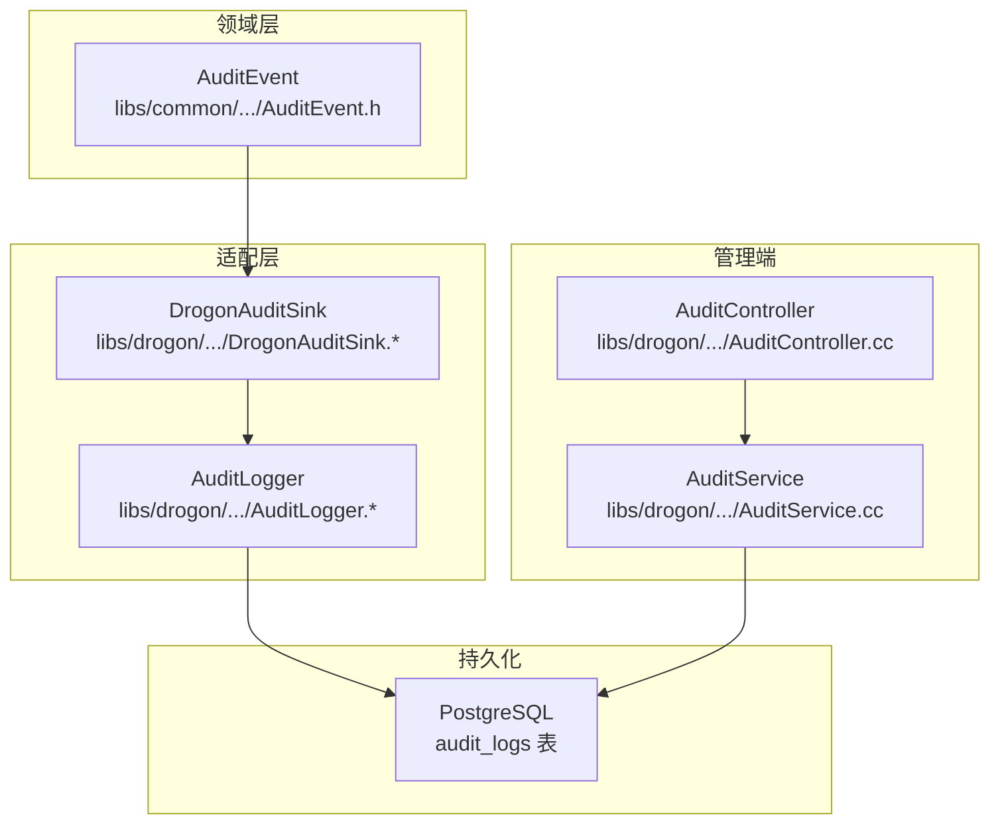
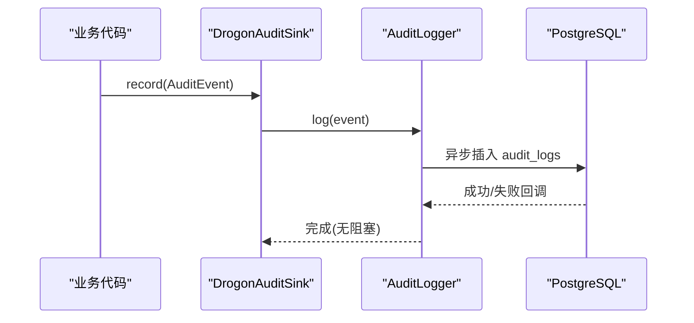
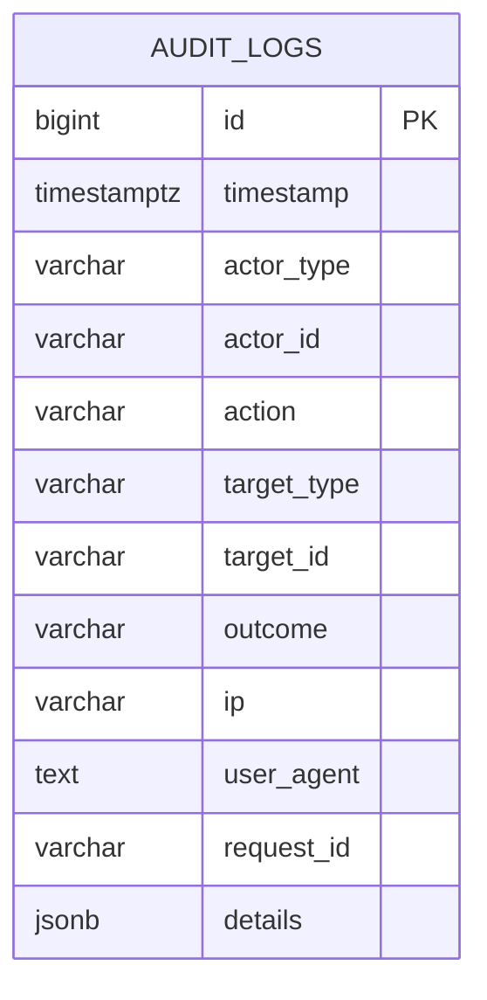
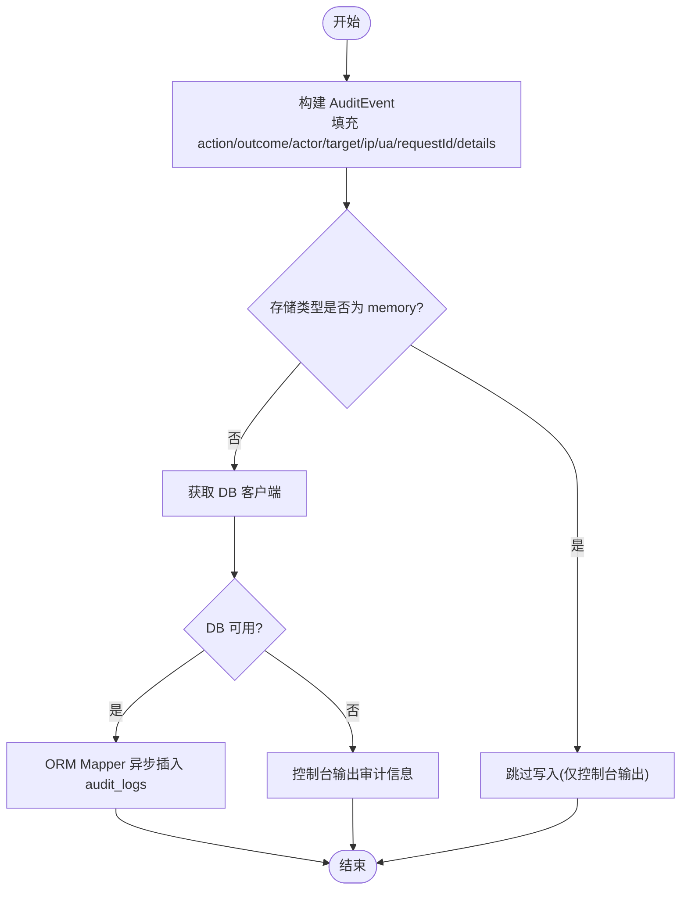
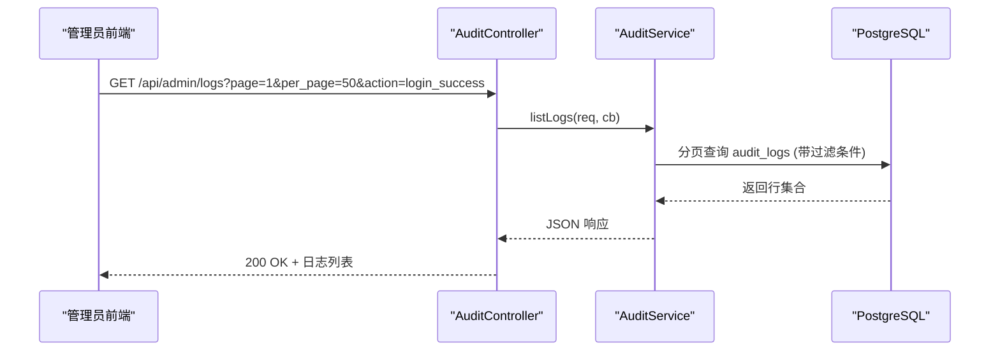
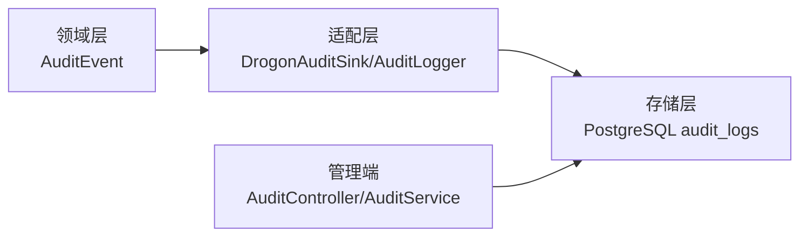
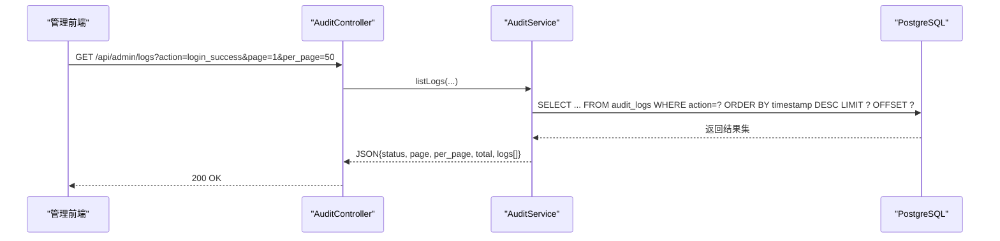

# 审计日志

<cite>
**本文引用的文件**
- [V012__audit_logs.sql](file://apps/server/migrations/V012__audit_logs.sql)
- [AuditEvent.h](file://libs/common/include/authforge/common/observability/AuditEvent.h)
- [DrogonAuditSink.h](file://libs/drogon/include/authforge/drogon/adapters/DrogonAuditSink.h)
- [DrogonAuditSink.cc](file://libs/drogon/src/adapters/DrogonAuditSink.cc)
- [AuditLogger.h](file://libs/drogon/include/authforge/drogon/observability/AuditLogger.h)
- [AuditLogger.cc](file://libs/drogon/src/observability/AuditLogger.cc)
- [AuditController.cc](file://libs/drogon/src/controllers/AuditController.cc)
- [AuditService.cc](file://libs/drogon/src/admin/AuditService.cc)
- [TokenService.cc](file://libs/oauth2/src/protocol/TokenService.cc)
- [UserSelfServiceController.cc](file://libs/drogon/src/controllers/UserSelfServiceController.cc)
- [PasswordResetService.cc](file://libs/drogon/src/services/PasswordResetService.cc)
- [ClientRegistrationService.cc](file://libs/drogon/src/services/ClientRegistrationService.cc)
- [openapi.json](file://apps/server/docs/api/openapi.json)
- [logs.spec.ts](file://frontends/admin/tests/e2e/logs.spec.ts)
</cite>

## 目录
1. [简介](#简介)
2. [项目结构](#项目结构)
3. [核心组件](#核心组件)
4. [架构总览](#架构总览)
5. [详细组件分析](#详细组件分析)
6. [依赖关系分析](#依赖关系分析)
7. [性能与存储策略](#性能与存储策略)
8. [查询与分析方法](#查询与分析方法)
9. [安全保护措施](#安全保护措施)
10. [故障排查指南](#故障排查指南)
11. [结论](#结论)

## 简介
本文件为 AuthForge 审计日志系统的技术文档，聚焦数据模型、关键操作埋点、存储与索引设计、查询与分析能力以及安全保护机制。审计日志用于记录与安全相关的关键事件，支持合规性报告生成与安全事件追踪。

## 项目结构
审计日志在系统中由“领域事件模型 + 适配器写入 + 管理端查询”三部分构成：
- 领域层：统一的事件数据结构（框架无关）
- 适配层：从 HTTP 请求提取上下文并异步落库
- 管理端：提供分页查询与仪表盘统计接口

**图表来源**
- [AuditEvent.h:26-44](file://libs/common/include/authforge/common/observability/AuditEvent.h#L26-L44)
- [DrogonAuditSink.cc:15-70](file://libs/drogon/src/adapters/DrogonAuditSink.cc#L15-L70)
- [AuditLogger.cc:19-91](file://libs/drogon/src/observability/AuditLogger.cc#L19-L91)
- [AuditController.cc:49-67](file://libs/drogon/src/controllers/AuditController.cc#L49-L67)
- [AuditService.cc:69-151](file://libs/drogon/src/admin/AuditService.cc#L69-L151)
- [V012__audit_logs.sql:4-22](file://apps/server/migrations/V012__audit_logs.sql#L4-L22)

**章节来源**
- [AuditEvent.h:26-44](file://libs/common/include/authforge/common/observability/AuditEvent.h#L26-L44)
- [DrogonAuditSink.cc:15-70](file://libs/drogon/src/adapters/DrogonAuditSink.cc#L15-L70)
- [AuditLogger.cc:19-91](file://libs/drogon/src/observability/AuditLogger.cc#L19-L91)
- [AuditController.cc:49-67](file://libs/drogon/src/controllers/AuditController.cc#L49-L67)
- [AuditService.cc:69-151](file://libs/drogon/src/admin/AuditService.cc#L69-L151)
- [V012__audit_logs.sql:4-22](file://apps/server/migrations/V012__audit_logs.sql#L4-L22)

## 核心组件
- 审计事件模型：定义 actorType、actorId、action、targetType、targetId、outcome、ip、userAgent、requestId、details 等字段，作为跨层传递的标准化事件载体。
- 适配器写入：从 HTTP 请求中提取 IP、User-Agent、Request-ID，推断 actorType，并通过异步方式写入数据库，不阻塞主流程。
- 管理端查询：提供分页列表与仪表盘统计，支持按 action、outcome、actor_id 过滤，按时间倒序展示。

**章节来源**
- [AuditEvent.h:26-44](file://libs/common/include/authforge/common/observability/AuditEvent.h#L26-L44)
- [DrogonAuditSink.cc:15-70](file://libs/drogon/src/adapters/DrogonAuditSink.cc#L15-L70)
- [AuditLogger.cc:19-91](file://libs/drogon/src/observability/AuditLogger.cc#L19-L91)
- [AuditService.cc:69-151](file://libs/drogon/src/admin/AuditService.cc#L69-L151)

## 架构总览
审计日志采用“领域事件 + 适配器 + 存储”的分层架构：
- 业务侧通过统一的审计事件构造并调用 sink.record()
- 适配层负责从请求上下文填充元数据并异步落库
- 管理端通过控制器与服务层暴露查询接口

**图表来源**
- [DrogonAuditSink.cc:8-13](file://libs/drogon/src/adapters/DrogonAuditSink.cc#L8-L13)
- [AuditLogger.cc:19-91](file://libs/drogon/src/observability/AuditLogger.cc#L19-L91)

## 详细组件分析

### 数据模型与存储
- 表名：audit_logs
- 关键字段：id、timestamp、actor_type、actor_id、action、target_type、target_id、outcome、ip、user_agent、request_id、details(JSONB)
- 索引：按 timestamp、actor_type+actor_id、action、outcome+timestamp 建立索引，优化常见查询路径

**图表来源**
- [V012__audit_logs.sql:4-22](file://apps/server/migrations/V012__audit_logs.sql#L4-L22)

**章节来源**
- [V012__audit_logs.sql:4-22](file://apps/server/migrations/V012__audit_logs.sql#L4-L22)

### 写入链路（适配器与落库）
- DrogonAuditSink::logFromRequest：从请求头获取 IP、User-Agent、Request-ID；根据 actorId 推断 actorType；组装 AuditEvent 后调用 sink.record()
- AuditLogger::log：若存储类型为 memory 则跳过；否则使用 ORM Mapper 异步插入 audit_logs；异常时记录警告日志

**图表来源**
- [DrogonAuditSink.cc:15-70](file://libs/drogon/src/adapters/DrogonAuditSink.cc#L15-L70)
- [AuditLogger.cc:19-91](file://libs/drogon/src/observability/AuditLogger.cc#L19-L91)

**章节来源**
- [DrogonAuditSink.cc:15-70](file://libs/drogon/src/adapters/DrogonAuditSink.cc#L15-L70)
- [AuditLogger.cc:19-91](file://libs/drogon/src/observability/AuditLogger.cc#L19-L91)

### 管理端查询与仪表盘
- 列表接口：GET /api/admin/logs，支持 action、outcome、actor_id、page、per_page 参数，返回分页结果并按 timestamp 降序
- 仪表盘统计：GET /api/admin/dashboard/stats，聚合用户数、客户端数、活跃令牌数、当日日志数、当日失败数

**图表来源**
- [AuditController.cc:49-67](file://libs/drogon/src/controllers/AuditController.cc#L49-L67)
- [AuditService.cc:69-151](file://libs/drogon/src/admin/AuditService.cc#L69-L151)
- [openapi.json:328-348](file://apps/server/docs/api/openapi.json#L328-L348)

**章节来源**
- [AuditController.cc:49-67](file://libs/drogon/src/controllers/AuditController.cc#L49-L67)
- [AuditService.cc:69-151](file://libs/drogon/src/admin/AuditService.cc#L69-L151)
- [openapi.json:328-348](file://apps/server/docs/api/openapi.json#L328-L348)

### 关键安全操作的审计埋点
以下操作会在成功或失败路径上记录审计事件（示例动作名来自实现与计划文档）：
- 登录成功/失败：login_success、login_failure
- 令牌颁发/刷新/撤销：token_issued、token_refreshed、token_revoked
- 密码修改/重置：password_changed、password_reset
- 多因素认证启用：mfa_enabled
- 客户端注册：client_registered
- 授权同意：consent_granted、consent_revoked

这些埋点通过 DrogonAuditSink::logFromRequest 或 TokenService::audit 调用，将结构化事件写入 audit_logs。

**章节来源**
- [TokenService.cc:103-122](file://libs/oauth2/src/protocol/TokenService.cc#L103-L122)
- [UserSelfServiceController.cc:255-277](file://libs/drogon/src/controllers/UserSelfServiceController.cc#L255-L277)
- [PasswordResetService.cc:267-287](file://libs/drogon/src/services/PasswordResetService.cc#L267-L287)
- [ClientRegistrationService.cc:194-215](file://libs/drogon/src/services/ClientRegistrationService.cc#L194-L215)
- [production_hardening_p1_tasks.md:398-413](file://docs/history/PRD/production_hardening_p1_tasks.md#L398-L413)

## 依赖关系分析
- 领域层（common）仅提供事件模型，不包含任何框架耦合
- 适配层（drogon）负责从 HTTP 上下文提取信息并异步落库
- 管理端（controllers/services）通过 ORM 查询审计日志，对外暴露 API
- 数据库（PostgreSQL）承载审计日志表及索引

**图表来源**
- [AuditEvent.h:26-44](file://libs/common/include/authforge/common/observability/AuditEvent.h#L26-L44)
- [DrogonAuditSink.cc:15-70](file://libs/drogon/src/adapters/DrogonAuditSink.cc#L15-L70)
- [AuditLogger.cc:19-91](file://libs/drogon/src/observability/AuditLogger.cc#L19-L91)
- [AuditService.cc:69-151](file://libs/drogon/src/admin/AuditService.cc#L69-L151)

**章节来源**
- [AuditEvent.h:26-44](file://libs/common/include/authforge/common/observability/AuditEvent.h#L26-L44)
- [DrogonAuditSink.cc:15-70](file://libs/drogon/src/adapters/DrogonAuditSink.cc#L15-L70)
- [AuditLogger.cc:19-91](file://libs/drogon/src/observability/AuditLogger.cc#L19-L91)
- [AuditService.cc:69-151](file://libs/drogon/src/admin/AuditService.cc#L69-L151)

## 性能与存储策略
- 异步写入：审计日志采用 fire-and-forget 模式，避免阻塞主业务流程
- 内存模式降级：当存储类型为 memory 时，跳过数据库写入，仅输出到控制台，便于开发调试
- 索引优化：针对 timestamp、actor_type+actor_id、action、outcome+timestamp 建立索引，提升分页与筛选效率
- 归档建议：可基于 timestamp 定期清理过期数据（例如保留 90 天），降低表膨胀

**章节来源**
- [AuditLogger.cc:21-43](file://libs/drogon/src/observability/AuditLogger.cc#L21-L43)
- [V012__audit_logs.sql:19-22](file://apps/server/migrations/V012__audit_logs.sql#L19-L22)
- [production_hardening_p1_tasks.md:414-420](file://docs/history/PRD/production_hardening_p1_tasks.md#L414-L420)

## 查询与分析方法
- 列表查询：通过 GET /api/admin/logs 进行分页查询，支持按 action、outcome、actor_id 过滤，按 timestamp 降序排序
- 仪表盘统计：通过 GET /api/admin/dashboard/stats 获取关键指标，包括当日日志量与失败量
- 前端验证：E2E 测试覆盖审计日志页面的列显示、动作展示与结果徽章颜色

**图表来源**
- [AuditController.cc:49-67](file://libs/drogon/src/controllers/AuditController.cc#L49-L67)
- [AuditService.cc:69-151](file://libs/drogon/src/admin/AuditService.cc#L69-L151)
- [openapi.json:328-348](file://apps/server/docs/api/openapi.json#L328-L348)
- [logs.spec.ts:12-28](file://frontends/admin/tests/e2e/logs.spec.ts#L12-L28)

**章节来源**
- [AuditController.cc:49-67](file://libs/drogon/src/controllers/AuditController.cc#L49-L67)
- [AuditService.cc:69-151](file://libs/drogon/src/admin/AuditService.cc#L69-L151)
- [openapi.json:328-348](file://apps/server/docs/api/openapi.json#L328-L348)
- [logs.spec.ts:12-28](file://frontends/admin/tests/e2e/logs.spec.ts#L12-L28)

## 安全保护措施
- 访问控制：审计日志管理端点要求 bearer 认证，防止未授权访问
- 防篡改建议：生产环境应将 audit_logs 表设置为只写（应用写入、外部系统读取），限制直接 DML 操作；结合数据库角色与网络白名单强化访问控制
- 敏感信息处理：details 字段为 JSONB，应避免写入敏感明文；如需记录敏感上下文，应脱敏或哈希后再写入
- 降级与容错：当数据库不可用时，审计写入会降级为控制台输出，确保主流程不受影响

**章节来源**
- [openapi.json:328-348](file://apps/server/docs/api/openapi.json#L328-L348)
- [AuditLogger.cc:21-43](file://libs/drogon/src/observability/AuditLogger.cc#L21-L43)

## 故障排查指南
- 数据库连接错误：当无法获取 DB 客户端时，服务会返回 DB_CONNECTION_ERROR；检查数据库配置与连接池状态
- 查询失败：DB_QUERY_ERROR 表示 ORM 查询异常；检查 SQL 条件、索引与权限
- 写入失败：Mapper insert 失败会记录警告日志；检查数据库可用性、事务与锁竞争情况
- 内存模式：当存储类型为 memory 时不会写入数据库；确认部署配置是否误设为 memory

**章节来源**
- [AuditService.cc:37-51](file://libs/drogon/src/admin/AuditService.cc#L37-L51)
- [AuditService.cc:143-151](file://libs/drogon/src/admin/AuditService.cc#L143-L151)
- [AuditLogger.cc:62-91](file://libs/drogon/src/observability/AuditLogger.cc#L62-L91)

## 结论
AuthForge 的审计日志系统以领域事件为核心，通过适配器异步落库，并提供管理端查询与仪表盘统计。其数据模型清晰、索引合理、写入非阻塞，满足合规性与安全事件追踪需求。生产环境中建议加强访问控制与数据归档策略，确保审计数据的完整性与可追溯性。