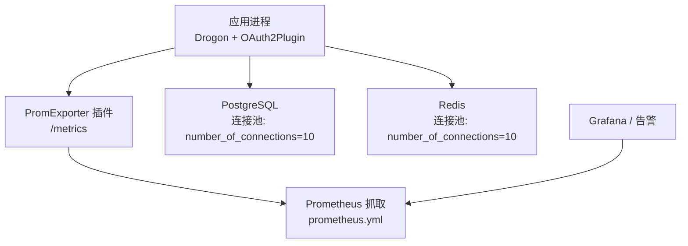
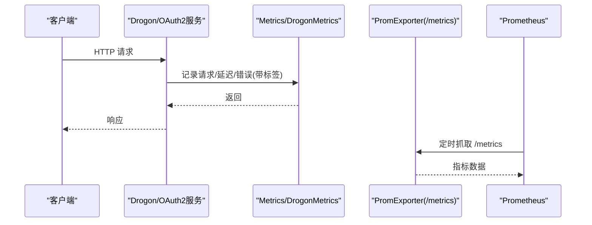
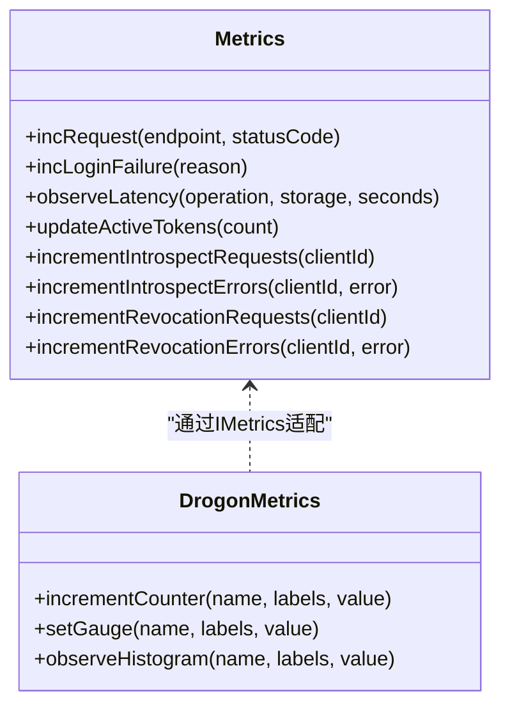
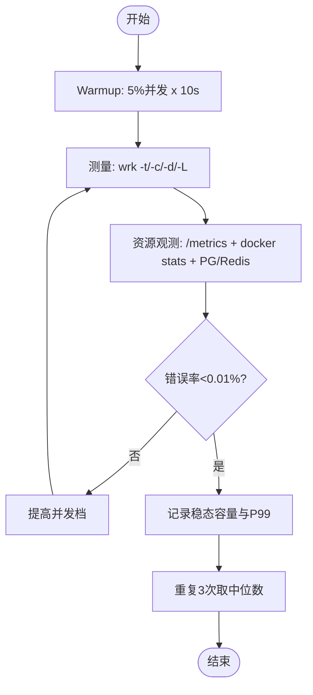
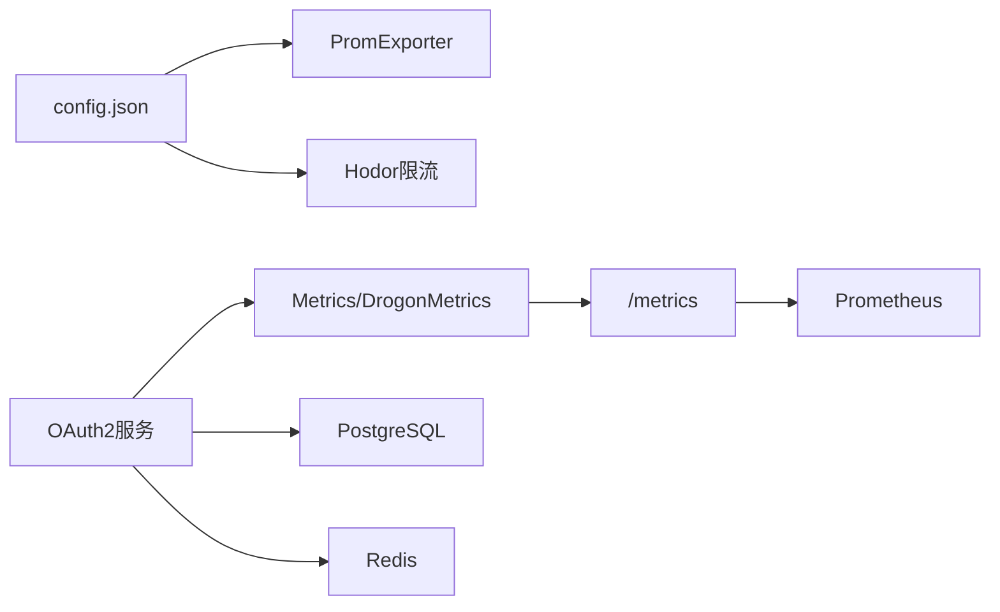

# 性能监控

<cite>
**本文引用的文件**
- [apps/server/config/config.json](file://apps/server/config/config.json)
- [apps/server/config/config.prod.json](file://apps/server/config/config.prod.json)
- [deploy/observability/prometheus.yml](file://deploy/observability/prometheus.yml)
- [libs/drogon/include/authforge/drogon/observability/Metrics.h](file://libs/drogon/include/authforge/drogon/observability/Metrics.h)
- [libs/drogon/src/observability/Metrics.cc](file://libs/drogon/src/observability/Metrics.cc)
- [libs/drogon/include/authforge/drogon/adapters/DrogonMetrics.h](file://libs/drogon/include/authforge/drogon/adapters/DrogonMetrics.h)
- [docs/backend/observability.md](file://docs/backend/observability.md)
- [docs/productization-evolution/benchmark-facility-design.md](file://docs/productization-evolution/benchmark-facility-design.md)
- [tests/performance/benchmark/PerformanceBenchmark.cc](file://tests/performance/benchmark/PerformanceBenchmark.cc)
- [tests/security/injection/DbLeakVerificationTest.cc](file://tests/security/injection/DbLeakVerificationTest.cc)
- [docs/history/design/superpowers/specs/2026-05-11-p1-P1_TECHNICAL_DESIGN.md](file://docs/history/design/superpowers/specs/2026-05-11-p1-P1_TECHNICAL_DESIGN.md)
</cite>

## 目录
1. [简介](#简介)
2. [项目结构](#项目结构)
3. [核心组件](#核心组件)
4. [架构总览](#架构总览)
5. [详细组件分析](#详细组件分析)
6. [依赖关系分析](#依赖关系分析)
7. [性能考量](#性能考量)
8. [故障排查指南](#故障排查指南)
9. [结论](#结论)
10. [附录](#附录)

## 简介
本文件面向AuthForge的性能监控与基准能力，覆盖关键指标采集、基准测试工具使用、瓶颈分析方法、调优建议以及监控仪表板与告警配置。内容基于仓库中可观测性实现、Prometheus集成、基准设施设计与现有测试用例进行系统化整理，帮助读者在生产环境中建立稳定、可复现且可回归的性能保障体系。

## 项目结构
与性能监控相关的关键位置：
- 应用配置与插件：Drogon监听端口、数据库/Redis连接池、PromExporter与限流插件等均在配置文件内启用。
- 可观测性实现：Metrics接口与实现位于drogon层，统一输出结构化日志供Prometheus消费。
- 监控采集：Prometheus抓取目标为后端服务的/metrics端点。
- 基准设施设计：文档定义了wrk驱动的阶梯式压测、资源观测、冷启动与稳态判定等流程。
- 性能测试用例：包含CPU/内存/吞吐的轻量基准与并发安全验证。

图表来源
- [apps/server/config/config.json:133-140](file://apps/server/config/config.json#L133-L140)
- [deploy/observability/prometheus.yml:1-8](file://deploy/observability/prometheus.yml#L1-L8)

章节来源
- [apps/server/config/config.json:1-212](file://apps/server/config/config.json#L1-L212)
- [deploy/observability/prometheus.yml:1-8](file://deploy/observability/prometheus.yml#L1-L8)

## 核心组件
- 指标发射器（Metrics）：提供请求计数、登录失败计数、延迟直方图、活跃Token估算、Introspection/Revocation计数等能力，当前以结构化日志形式输出，便于Prometheus日志采集或后续替换为原生Counter/Gauge/Histogram。
- Drogon适配器（DrogonMetrics）：通过IMetrics接口暴露incrementCounter/setGauge/observeHistogram，用于上层业务按标签发射指标。
- Prometheus Exporter：在配置中启用，暴露/metrics端点；Prometheus按job采集。
- 限流与保护：Hodor插件提供令牌桶限流，避免突发流量导致系统过载。
- 基准设施：基于wrk对OAuth2核心端点进行多场景压测，结合容器资源采样与后端指标观测，形成QPS/P50/P95/P99/错误率/稳态内存等结果。

章节来源
- [libs/drogon/include/authforge/drogon/observability/Metrics.h:25-59](file://libs/drogon/include/authforge/drogon/observability/Metrics.h#L25-L59)
- [libs/drogon/src/observability/Metrics.cc:19-86](file://libs/drogon/src/observability/Metrics.cc#L19-L86)
- [libs/drogon/include/authforge/drogon/adapters/DrogonMetrics.h:29-50](file://libs/drogon/include/authforge/drogon/adapters/DrogonMetrics.h#L29-L50)
- [apps/server/config/config.json:133-171](file://apps/server/config/config.json#L133-L171)
- [apps/server/config/config.prod.json:133-171](file://apps/server/config/config.prod.json#L133-L171)
- [docs/productization-evolution/benchmark-facility-design.md:93-126](file://docs/productization-evolution/benchmark-facility-design.md#L93-L126)

## 架构总览
下图展示从请求进入、指标采集到Prometheus拉取的全链路。

图表来源
- [libs/drogon/src/observability/Metrics.cc:19-86](file://libs/drogon/src/observability/Metrics.cc#L19-L86)
- [apps/server/config/config.json:133-140](file://apps/server/config/config.json#L133-L140)
- [deploy/observability/prometheus.yml:1-8](file://deploy/observability/prometheus.yml#L1-L8)

## 详细组件分析

### 指标采集与导出
- 指标类型与标签
  - 请求总量：oauth2_requests_total{endpoint,status}
  - 登录失败：oauth2_login_failures_total{reason}
  - Introspection：oauth2_introspect_requests_total{client_id}，错误：oauth2_introspect_errors_total{client_id,error}
  - Revocation：oauth2_revocation_requests_total{client_id}，错误：oauth2_revocation_errors_total{client_id,error}
  - 延迟分布：oauth2_latency_seconds{operation,storage}
  - 活跃Token：oauth2_active_tokens（Gauge）
- 采集方式
  - 当前实现通过结构化日志输出[ METRIC ]前缀，Prometheus可通过日志采集或未来迁移至PromExporter原生Counter/Gauge/Histogram。
  - 线程安全：并发IO线程调用需保证原子性或借助PromExporter提供的线程安全能力。
- 配置要点
  - 启用PromExporter插件并暴露/metrics路径。
  - Prometheus抓取间隔与目标由prometheus.yml定义。

图表来源
- [libs/drogon/include/authforge/drogon/observability/Metrics.h:25-59](file://libs/drogon/include/authforge/drogon/observability/Metrics.h#L25-L59)
- [libs/drogon/include/authforge/drogon/adapters/DrogonMetrics.h:29-50](file://libs/drogon/include/authforge/drogon/adapters/DrogonMetrics.h#L29-L50)

章节来源
- [docs/backend/observability.md:1-30](file://docs/backend/observability.md#L1-L30)
- [libs/drogon/include/authforge/drogon/observability/Metrics.h:25-59](file://libs/drogon/include/authforge/drogon/observability/Metrics.h#L25-L59)
- [libs/drogon/src/observability/Metrics.cc:19-86](file://libs/drogon/src/observability/Metrics.cc#L19-L86)
- [apps/server/config/config.json:133-140](file://apps/server/config/config.json#L133-L140)
- [deploy/observability/prometheus.yml:1-8](file://deploy/observability/prometheus.yml#L1-L8)

### 关键性能指标采集方法
- CPU使用率
  - 服务端：通过容器运行时统计（如docker stats）或主机top/mpstat采集驱动与目标进程的CPU%。
  - 基准阶段：确保driver CPU<80%，否则视为驱动受限，数字为下限。
- 内存占用
  - 容器RSS均值作为稳态内存；冷启动峰值单独记录。
  - 关注JWK缓存、连接池预热后的内存曲线。
- 数据库连接池状态
  - PostgreSQL：number_of_connections=10；观察pg_stat_activity中的活跃连接数与慢查询。
  - Redis：number_of_connections=10；观察INFO命中率与命令耗时。
- 请求处理时间与吞吐量
  - 通过oauth2_latency_seconds直方图计算P50/P95/P99。
  - QPS通过rate(oauth2_requests_total[1m])计算。
- 阈值参考
  - 设计目标：持续1000 req/s（p95<50ms），峰值5000 req/s（p95<100ms），突发10000 req/s（p95<200ms）。
  - 数据库查询目标：token查找/校验<5ms，撤销更新<10ms，元数据查询<8ms。
  - 缓存命中率：正常负载下≥95%；Redis操作<2ms。

章节来源
- [docs/history/design/superpowers/specs/2026-05-11-p1-P1_TECHNICAL_DESIGN.md:616-630](file://docs/history/design/superpowers/specs/2026-05-11-p1-P1_TECHNICAL_DESIGN.md#L616-L630)
- [docs/productization-evolution/benchmark-facility-design.md:238-248](file://docs/productization-evolution/benchmark-facility-design.md#L238-L248)
- [apps/server/config/config.json:9-26](file://apps/server/config/config.json#L9-L26)
- [apps/server/config/config.json:28-39](file://apps/server/config/config.json#L28-L39)

### 性能基准测试工具与流程
- 工具选择
  - wrk：C实现、事件驱动、低开销，适合打满高性能C++服务器；Lua脚本支持多步流与动态参数。
- 场景与步骤
  - 阶梯加压：逐步增加并发，连续两档QPS增幅<5%且P99陡升即拐点；错误率<0.01%的最高档为稳态容量。
  - Warmup：每档前以约5%并发预热10s，丢弃结果，避免冷效应。
  - 资源观测：并行采集/metrics、容器RSS/CPU/网络、PG/Redis状态、driver CPU。
  - 冷启动：独立测量，含/不含预跑迁移两种模式分别报告。
  - 重复性与误差：每场景连跑3次取中位数，离散度>10%需排查环境抖动。
- 典型命令约定
  - 线程数= min(CPU核数, 并发/16)上取整；连接数=档位；-d稳态时长；-L/--latency输出分位与直方图。

图表来源
- [docs/productization-evolution/benchmark-facility-design.md:213-248](file://docs/productization-evolution/benchmark-facility-design.md#L213-L248)
- [docs/productization-evolution/benchmark-facility-design.md:258-267](file://docs/productization-evolution/benchmark-facility-design.md#L258-L267)

章节来源
- [docs/productization-evolution/benchmark-facility-design.md:93-126](file://docs/productization-evolution/benchmark-facility-design.md#L93-L126)
- [docs/productization-evolution/benchmark-facility-design.md:213-267](file://docs/productization-evolution/benchmark-facility-design.md#L213-L267)

### 性能回归检测
- 基线入仓：将每次稳态档的结果JSON入仓，生成摘要报告，便于对比历史趋势。
- 回归门控：CI中引入wrk脚本与Prometheus抓取，若P99/QPS/错误率偏离基线超过阈值则失败。
- 场景覆盖：S1–S6（discovery、token、introspection、userinfo、refresh、设备码等）均需有稳态记录。
- 约束检查：driver CPU<80%、PG/Redis非持续>90%、错误率门槛达标。

章节来源
- [docs/productization-evolution/benchmark-facility-design.md:271-325](file://docs/productization-evolution/benchmark-facility-design.md#L271-L325)
- [docs/productization-evolution/benchmark-facility-design.md:383-397](file://docs/productization-evolution/benchmark-facility-design.md#L383-L397)

### 性能瓶颈分析方法
- 慢查询分析
  - 使用PG慢查询日志与pg_stat_statements定位热点SQL；核对索引命中与执行计划。
  - 结合oauth2_latency_seconds直方图，识别存储后端耗时异常。
- 内存泄漏检测
  - 通过容器RSS曲线与Prometheus Gauge观察增长趋势；配合ASan/TSan在测试中验证无泄漏。
  - 针对连接池：验证连接复用与释放，避免“connection exhausted”。
- 线程阻塞诊断
  - 使用perf/火焰图定位热点函数；检查锁竞争与长事务。
  - 通过并发测试用例验证原子操作与线程安全。

章节来源
- [tests/security/injection/DbLeakVerificationTest.cc:79-118](file://tests/security/injection/DbLeakVerificationTest.cc#L79-L118)
- [tests/integration/concurrency/ScaffoldSanityTest.cc:33-63](file://tests/integration/concurrency/ScaffoldSanityTest.cc#L33-L63)
- [docs/backend/observability.md:24-30](file://docs/backend/observability.md#L24-L30)

### 性能调优建议
- 数据库查询优化
  - 确保token查找/校验/撤销等关键路径命中索引；减少回表与全表扫描。
  - 批量写入：将多次INSERT合并为单次批量插入，降低往返开销。
- 缓存策略调整
  - 读多写少的仓储（如客户端信息、只读用户信息）采用per-repository缓存装饰器，强一致数据不缓存或仅缓存否定结果。
  - 合理设置TTL与失效策略，避免雪崩与脏读。
- 资源配置优化
  - 连接池：根据负载调整number_of_connections；监控PG/Redis连接使用率与等待时间。
  - 限流：按URL粒度配置Hodor令牌桶，保护敏感端点（如/login、/token）。
  - 压缩与静态资源：启用gzip/brotli，提升静态资源传输效率。

章节来源
- [docs/history/design/superpowers/specs/2026-05-11-p1-P1_TECHNICAL_DESIGN.md:616-630](file://docs/history/design/superpowers/specs/2026-05-11-p1-P1_TECHNICAL_DESIGN.md#L616-L630)
- [apps/server/config/config.json:102-131](file://apps/server/config/config.json#L102-L131)
- [apps/server/config/config.prod.json:133-171](file://apps/server/config/config.prod.json#L133-L171)

### 监控仪表板与告警设置
- 仪表板面板建议
  - QPS与错误率：rate(oauth2_requests_total[1m]) vs rate(oauth2_login_failures_total[1m])
  - P99延迟：histogram_quantile(0.99, rate(oauth2_latency_seconds_bucket[1m]))
  - 业务指标：oauth2_active_tokens趋势
- 告警规则示例
  - 错误率突增：rate(oauth2_login_failures_total[5m]) > 阈值
  - 延迟超标：histogram_quantile(0.99, rate(oauth2_latency_seconds_bucket[5m])) > 阈值
  - 连接池耗尽：PG/Redis活跃连接接近上限
  - 资源告警：容器CPU/RSS超阈值
- 采集配置
  - Prometheus抓取间隔与目标已在prometheus.yml中配置；确保/metrics可达。

章节来源
- [docs/backend/observability.md:24-30](file://docs/backend/observability.md#L24-L30)
- [deploy/observability/prometheus.yml:1-8](file://deploy/observability/prometheus.yml#L1-L8)

## 依赖关系分析
- 组件耦合
  - Metrics与DrogonMetrics通过IMetrics解耦，便于替换底层实现。
  - 配置驱动：PromExporter与Hodor插件通过config.json启用，影响运行时行为。
- 外部依赖
  - PostgreSQL与Redis：连接池大小与超时直接影响吞吐与延迟。
  - Prometheus：负责指标聚合与可视化。
- 潜在风险
  - 驱动受限：wrk自身成为瓶颈，需监控driver CPU。
  - DB/Redis瓶颈：需固定连接池并观测后端资源，避免测到DB而非server。

图表来源
- [apps/server/config/config.json:9-39](file://apps/server/config/config.json#L9-L39)
- [apps/server/config/config.json:133-171](file://apps/server/config/config.json#L133-L171)
- [deploy/observability/prometheus.yml:1-8](file://deploy/observability/prometheus.yml#L1-L8)

章节来源
- [apps/server/config/config.json:9-39](file://apps/server/config/config.json#L9-L39)
- [apps/server/config/config.json:133-171](file://apps/server/config/config.json#L133-L171)
- [deploy/observability/prometheus.yml:1-8](file://deploy/observability/prometheus.yml#L1-L8)

## 性能考量
- 吞吐与延迟目标
  - 持续1000 req/s（p95<50ms）、峰值5000 req/s（p95<100ms）、突发10000 req/s（p95<200ms）。
- 缓存与数据库
  - 缓存命中率≥95%；Redis操作<2ms；关键查询<5-10ms。
- 资源与稳定性
  - driver CPU<80%；PG/Redis非持续>90%；错误率<0.01%。
- 测试与回归
  - 使用PerformanceBenchmark.cc进行轻量基准；结合wrk进行端到端压测与回归检测。

章节来源
- [docs/history/design/superpowers/specs/2026-05-11-p1-P1_TECHNICAL_DESIGN.md:616-630](file://docs/history/design/superpowers/specs/2026-05-11-p1-P1_TECHNICAL_DESIGN.md#L616-L630)
- [tests/performance/benchmark/PerformanceBenchmark.cc:41-77](file://tests/performance/benchmark/PerformanceBenchmark.cc#L41-L77)
- [docs/productization-evolution/benchmark-facility-design.md:238-248](file://docs/productization-evolution/benchmark-facility-design.md#L238-L248)

## 故障排查指南
- 连接池问题
  - 现象：连接耗尽、查询超时。
  - 排查：查看pg_stat_activity与Redis INFO；确认连接池大小与超时配置；验证连接复用。
- 慢查询与高延迟
  - 现象：P99升高、错误率上升。
  - 排查：分析慢查询日志与执行计划；核对索引；结合oauth2_latency_seconds定位热点操作。
- 内存泄漏与高内存
  - 现象：RSS持续增长。
  - 排查：容器RSS曲线；ASan/TSan运行；检查缓存与连接生命周期。
- 线程阻塞与竞态
  - 现象：吞吐下降、延迟抖动。
  - 排查：perf/火焰图；并发测试用例验证原子操作与锁竞争。

章节来源
- [tests/security/injection/DbLeakVerificationTest.cc:79-118](file://tests/security/injection/DbLeakVerificationTest.cc#L79-L118)
- [docs/backend/observability.md:24-30](file://docs/backend/observability.md#L24-L30)

## 结论
AuthForge已具备完善的可观测性与基准设施基础：通过Metrics与PromExporter暴露标准指标，结合Prometheus实现监控与告警；基于wrk的基准设施提供可复现的吞吐与延迟评估；配套的连接池、限流与缓存策略为生产稳定性提供保障。建议在CI中固化基准回归，持续跟踪P99/QPS/错误率与资源使用，确保性能承诺可量化、可验证、可演进。

## 附录
- 常用PromQL示例
  - QPS：rate(oauth2_requests_total[1m])
  - 错误率：rate(oauth2_login_failures_total[1m])
  - P99延迟：histogram_quantile(0.99, rate(oauth2_latency_seconds_bucket[1m]))
  - 活跃Token：oauth2_active_tokens
- 配置要点速查
  - 启用PromExporter：path=/metrics
  - 连接池：number_of_connections=10（PG/Redis）
  - 限流：Hodor令牌桶，按URL粒度配置

章节来源
- [docs/backend/observability.md:24-30](file://docs/backend/observability.md#L24-L30)
- [apps/server/config/config.json:9-39](file://apps/server/config/config.json#L9-L39)
- [apps/server/config/config.json:133-171](file://apps/server/config/config.json#L133-L171)