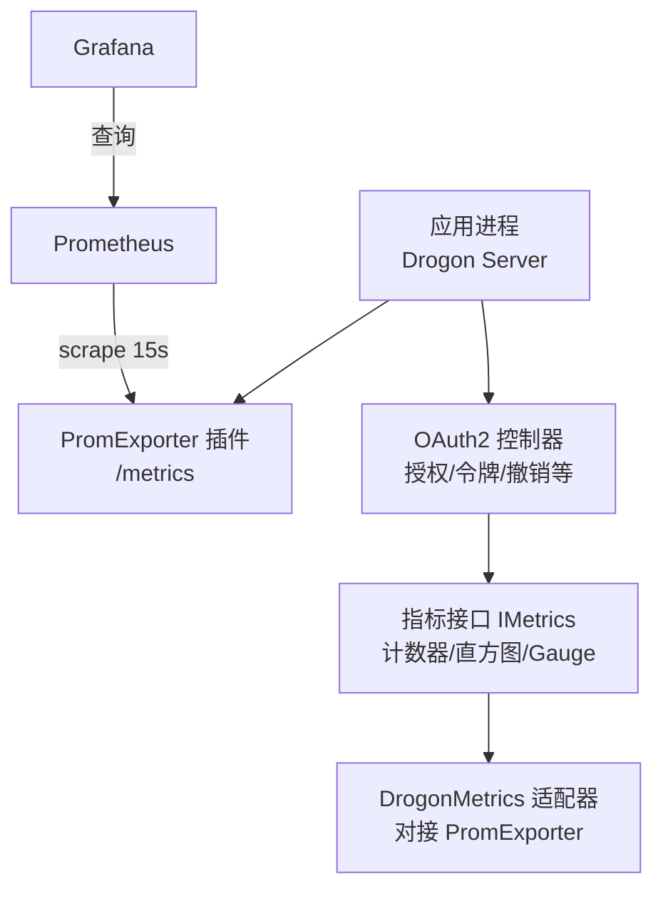
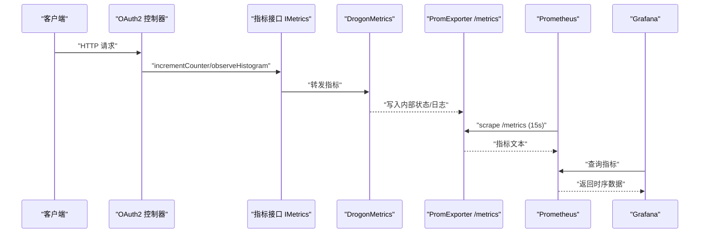
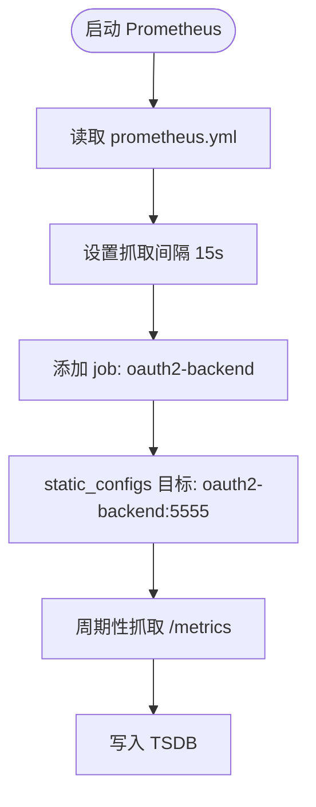
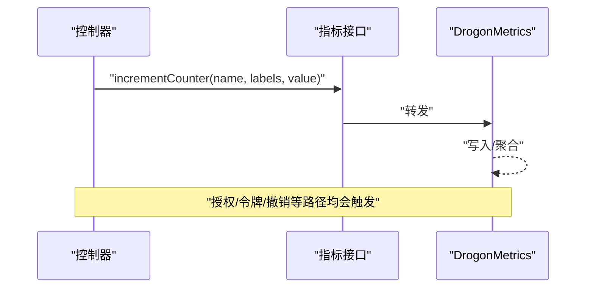
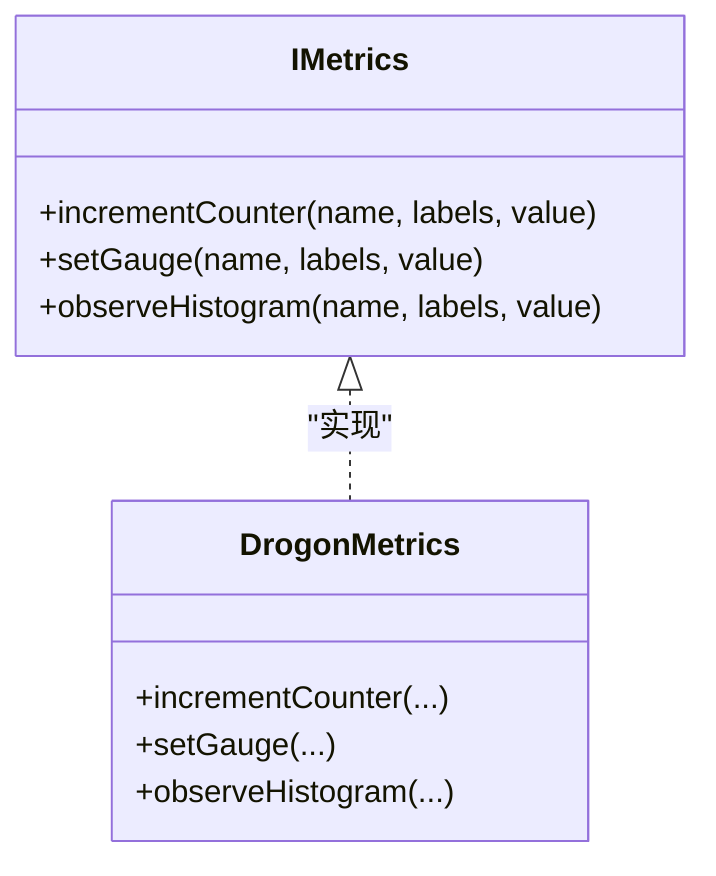
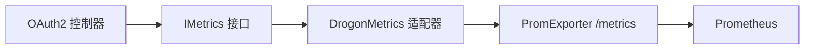

# 指标收集与监控

<cite>
**本文引用的文件**
- [prometheus.yml](file://deploy/observability/prometheus.yml)
- [config.json](file://apps/server/config/config.json)
- [config.dev.json](file://apps/server/config/config.dev.json)
- [config.prod.json](file://apps/server/config/config.prod.json)
- [observability.md](file://docs/backend/observability.md)
- [Metrics.h](file://libs/drogon/include/authforge/drogon/observability/Metrics.h)
- [Metrics.cc](file://libs/drogon/src/observability/Metrics.cc)
- [DrogonMetrics.h](file://libs/drogon/include/authforge/drogon/adapters/DrogonMetrics.h)
- [IMetrics.h](file://libs/common/include/authforge/common/ports/IMetrics.h)
- [AuthorizationEndpointController.cc](file://libs/drogon/src/controllers/AuthorizationEndpointController.cc)
- [TokenEndpointController.cc](file://libs/drogon/src/controllers/TokenEndpointController.cc)
- [data-persistence.md](file://docs/backend/data-persistence.md)
</cite>

## 目录
1. [简介](#简介)
2. [项目结构](#项目结构)
3. [核心组件](#核心组件)
4. [架构总览](#架构总览)
5. [详细组件分析](#详细组件分析)
6. [依赖关系分析](#依赖关系分析)
7. [性能考虑](#性能考虑)
8. [故障排查指南](#故障排查指南)
9. [结论](#结论)
10. [附录](#附录)

## 简介
本章节面向生产运维与平台工程团队，系统化说明 AuthForge 的指标收集与监控方案。内容涵盖 Prometheus 集成配置（抓取目标、服务发现、抓取间隔）、内置监控指标（OAuth2 授权流程、令牌颁发统计、认证成功率、API 响应时间等）、自定义指标在 C++ 中的定义与暴露方式、Grafana 可视化示例、以及指标数据的存储策略、保留周期与查询优化建议。

## 项目结构
AuthForge 的可观测性由以下部分构成：
- 服务端通过 Drogon 插件暴露 /metrics 端点，供 Prometheus 抓取。
- OAuth2 控制器在关键路径埋点，发射请求计数、错误计数、延迟直方图等指标。
- 可观测性文档定义了指标清单与 Grafana 面板建议。
- 持久化层提供数据生命周期管理，为指标与审计日志提供支撑。

图表来源
- [prometheus.yml:1-8](file://deploy/observability/prometheus.yml#L1-L8)
- [config.json:133-140](file://apps/server/config/config.json#L133-L140)
- [IMetrics.h:51-66](file://libs/common/include/authforge/common/ports/IMetrics.h#L51-L66)
- [DrogonMetrics.h:29-52](file://libs/drogon/include/authforge/drogon/adapters/DrogonMetrics.h#L29-L52)

章节来源
- [prometheus.yml:1-8](file://deploy/observability/prometheus.yml#L1-L8)
- [config.json:133-140](file://apps/server/config/config.json#L133-L140)
- [observability.md:1-30](file://docs/backend/observability.md#L1-L30)

## 核心组件
- Prometheus 抓取配置：全局抓取间隔与静态目标列表。
- 指标导出器：Drogon 内置 PromExporter 插件，暴露 /metrics。
- 指标接口与实现：统一通过 IMetrics 抽象，DrogonMetrics 适配到 PromExporter；当前 Metrics 模块以结构化日志形式输出指标，便于外部采集。
- 业务埋点：授权、令牌、撤销等控制器在关键路径调用指标接口。

章节来源
- [prometheus.yml:1-8](file://deploy/observability/prometheus.yml#L1-L8)
- [config.json:133-140](file://apps/server/config/config.json#L133-L140)
- [config.dev.json:133-140](file://apps/server/config/config.dev.json#L133-L140)
- [config.prod.json:133-140](file://apps/server/config/config.prod.json#L133-L140)
- [IMetrics.h:51-66](file://libs/common/include/authforge/common/ports/IMetrics.h#L51-L66)
- [DrogonMetrics.h:29-52](file://libs/drogon/include/authforge/drogon/adapters/DrogonMetrics.h#L29-L52)
- [Metrics.h:25-59](file://libs/drogon/include/authforge/drogon/observability/Metrics.h#L25-L59)
- [Metrics.cc:19-35](file://libs/drogon/src/observability/Metrics.cc#L19-L35)

## 架构总览
下图展示了从请求进入、业务处理、指标发射到 Prometheus 抓取、Grafana 可视化的完整链路。

图表来源
- [AuthorizationEndpointController.cc:472-477](file://libs/drogon/src/controllers/AuthorizationEndpointController.cc#L472-L477)
- [TokenEndpointController.cc:548-552](file://libs/drogon/src/controllers/TokenEndpointController.cc#L548-L552)
- [prometheus.yml:1-8](file://deploy/observability/prometheus.yml#L1-L8)
- [config.json:133-140](file://apps/server/config/config.json#L133-L140)

## 详细组件分析

### Prometheus 集成配置
- 抓取间隔：全局 scrape_interval 设置为 15 秒。
- 目标服务发现：使用 static_configs 指定 oauth2-backend:5555。
- 指标端点：Drogon 通过 PromExporter 插件暴露 /metrics，路径在配置中声明。

图表来源
- [prometheus.yml:1-8](file://deploy/observability/prometheus.yml#L1-L8)
- [config.json:133-140](file://apps/server/config/config.json#L133-L140)

章节来源
- [prometheus.yml:1-8](file://deploy/observability/prometheus.yml#L1-L8)
- [config.json:133-140](file://apps/server/config/config.json#L133-L140)
- [config.dev.json:133-140](file://apps/server/config/config.dev.json#L133-L140)
- [config.prod.json:133-140](file://apps/server/config/config.prod.json#L133-L140)

### 内置监控指标
系统已定义的指标包括：
- 请求总量：oauth2_requests_total（标签：endpoint, status）
- 登录失败次数：oauth2_login_failures_total（标签：reason）
- Token Introspection 请求与错误：oauth2_introspect_requests_total、oauth2_introspect_errors_total（标签：client_id, error）
- Token Revocation 请求与错误：oauth2_revocation_requests_total、oauth2_revocation_errors_total（标签：client_id, error）
- 关键步骤耗时分布：oauth2_latency_seconds（标签：operation, storage）
- 活跃令牌估算：oauth2_active_tokens（Gauge）

这些指标用于衡量 OAuth2 授权流程、令牌颁发与撤销、认证成功率与 API 响应时间等关键性能。

章节来源
- [observability.md:9-30](file://docs/backend/observability.md#L9-L30)
- [Metrics.h:25-59](file://libs/drogon/include/authforge/drogon/observability/Metrics.h#L25-L59)

### 指标埋点位置与调用链
- 授权端点：在授权流程成功或失败时记录请求计数与状态码。
- 令牌端点：在令牌颁发、撤销等路径记录请求计数与错误计数。
- 延迟直方图：在关键操作处记录耗时，便于计算 P95/P99。

图表来源
- [AuthorizationEndpointController.cc:472-477](file://libs/drogon/src/controllers/AuthorizationEndpointController.cc#L472-L477)
- [TokenEndpointController.cc:548-552](file://libs/drogon/src/controllers/TokenEndpointController.cc#L548-L552)
- [DrogonMetrics.h:29-52](file://libs/drogon/include/authforge/drogon/adapters/DrogonMetrics.h#L29-L52)

章节来源
- [AuthorizationEndpointController.cc:472-477](file://libs/drogon/src/controllers/AuthorizationEndpointController.cc#L472-L477)
- [TokenEndpointController.cc:548-552](file://libs/drogon/src/controllers/TokenEndpointController.cc#L548-L552)

### 自定义指标的添加方法
- 定义指标名称与标签：在业务代码中通过 IMetrics 接口调用 incrementCounter、setGauge、observeHistogram。
- 暴露接口：DrogonMetrics 将指标写入底层存储（PromExporter），或通过结构化日志输出供采集端消费。
- 线程安全：指标必须线程安全，避免引入非原子共享状态。

图表来源
- [IMetrics.h:51-66](file://libs/common/include/authforge/common/ports/IMetrics.h#L51-L66)
- [DrogonMetrics.h:29-52](file://libs/drogon/include/authforge/drogon/adapters/DrogonMetrics.h#L29-L52)

章节来源
- [IMetrics.h:51-66](file://libs/common/include/authforge/common/ports/IMetrics.h#L51-L66)
- [DrogonMetrics.h:29-52](file://libs/drogon/include/authforge/drogon/adapters/DrogonMetrics.h#L29-L52)
- [Metrics.h:8-24](file://libs/drogon/include/authforge/drogon/observability/Metrics.h#L8-L24)

### Grafana 仪表板配置示例
建议面板：
- QPS 与错误率：rate(oauth2_requests_total[1m]) vs rate(oauth2_login_failures_total[1m])
- P99 延迟：histogram_quantile(0.99, rate(oauth2_latency_seconds_bucket[1m]))
- 业务趋势：oauth2_active_tokens 的趋势图

章节来源
- [observability.md:24-30](file://docs/backend/observability.md#L24-L30)

### 指标数据的存储策略、保留周期与查询优化
- 存储策略：Prometheus 作为时序数据库，按时间序列存储指标；可通过配置调整存储大小与压缩策略。
- 保留周期：仓库未包含 Prometheus 的 retention 配置；建议在部署层根据容量与合规要求设置长期/短期保留策略。
- 查询优化：
  - 合理选择时间窗口（如 1m、5m）以减少查询负载。
  - 对高频标签进行采样或降采样（downsample）。
  - 使用 histogram_quantile 计算分位数时注意桶数量与精度。
  - 结合业务维度（endpoint、status、client_id）做聚合，减少高基数标签带来的开销。

章节来源
- [prometheus.yml:1-8](file://deploy/observability/prometheus.yml#L1-L8)
- [data-persistence.md:162-172](file://docs/backend/data-persistence.md#L162-L172)

## 依赖关系分析
- 控制器依赖指标接口，通过 IMetrics 抽象解耦具体实现。
- DrogonMetrics 作为适配器，将指标写入底层存储或日志。
- PromExporter 插件负责暴露 /metrics 端点，供 Prometheus 抓取。
- 配置文件集中管理插件与端口，确保环境一致性。

图表来源
- [AuthorizationEndpointController.cc:472-477](file://libs/drogon/src/controllers/AuthorizationEndpointController.cc#L472-L477)
- [TokenEndpointController.cc:548-552](file://libs/drogon/src/controllers/TokenEndpointController.cc#L548-L552)
- [config.json:133-140](file://apps/server/config/config.json#L133-L140)

章节来源
- [AuthorizationEndpointController.cc:472-477](file://libs/drogon/src/controllers/AuthorizationEndpointController.cc#L472-L477)
- [TokenEndpointController.cc:548-552](file://libs/drogon/src/controllers/TokenEndpointController.cc#L548-L552)
- [config.json:133-140](file://apps/server/config/config.json#L133-L140)

## 性能考虑
- 抓取间隔：15 秒适合大多数场景；在高吞吐环境下可适当延长以降低 Prometheus 压力。
- 指标粒度：避免过多高基数标签（如用户 ID），优先使用 client_id、endpoint、status 等业务维度。
- 直方图桶：合理设置 bucket 边界，平衡精度与存储成本。
- 缓存与降级：对于高频查询（如 introspection）可结合缓存策略降低后端压力。

## 故障排查指南
- 无法抓取指标：
  - 检查 /metrics 是否启用且可达（Drogon 插件配置）。
  - 确认 Prometheus 目标地址与端口正确。
- 指标缺失或异常：
  - 核对控制器埋点路径是否正确调用指标接口。
  - 检查标签值是否符合预期，避免空值或非法字符。
- 延迟偏高：
  - 通过 oauth2_latency_seconds 直方图定位慢操作。
  - 结合数据库与缓存性能进行分析。

章节来源
- [config.json:133-140](file://apps/server/config/config.json#L133-L140)
- [prometheus.yml:1-8](file://deploy/observability/prometheus.yml#L1-L8)
- [observability.md:9-30](file://docs/backend/observability.md#L9-L30)

## 结论
AuthForge 通过 Drogon PromExporter 暴露标准 Prometheus 指标，并在 OAuth2 关键路径完成埋点。配合 Prometheus 抓取与 Grafana 可视化，可实现对授权流程、令牌颁发、认证成功率与 API 响应时间的全面监控。建议在生产环境中完善 Prometheus 保留策略与查询优化，确保可观测性的可持续性与稳定性。

## 附录
- 指标清单与含义详见可观测性文档。
- 数据生命周期与清理策略参考持久化文档。