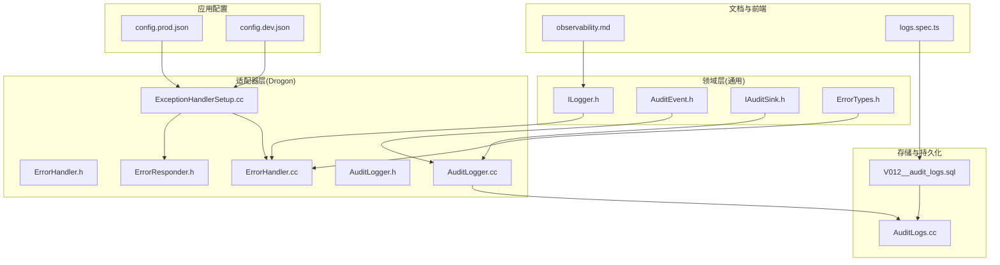
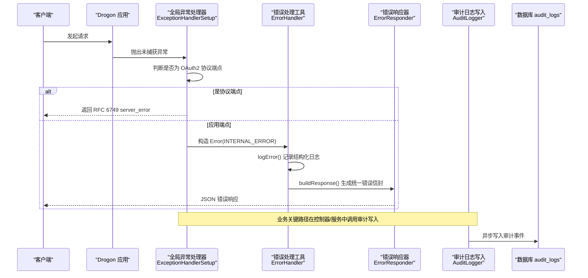
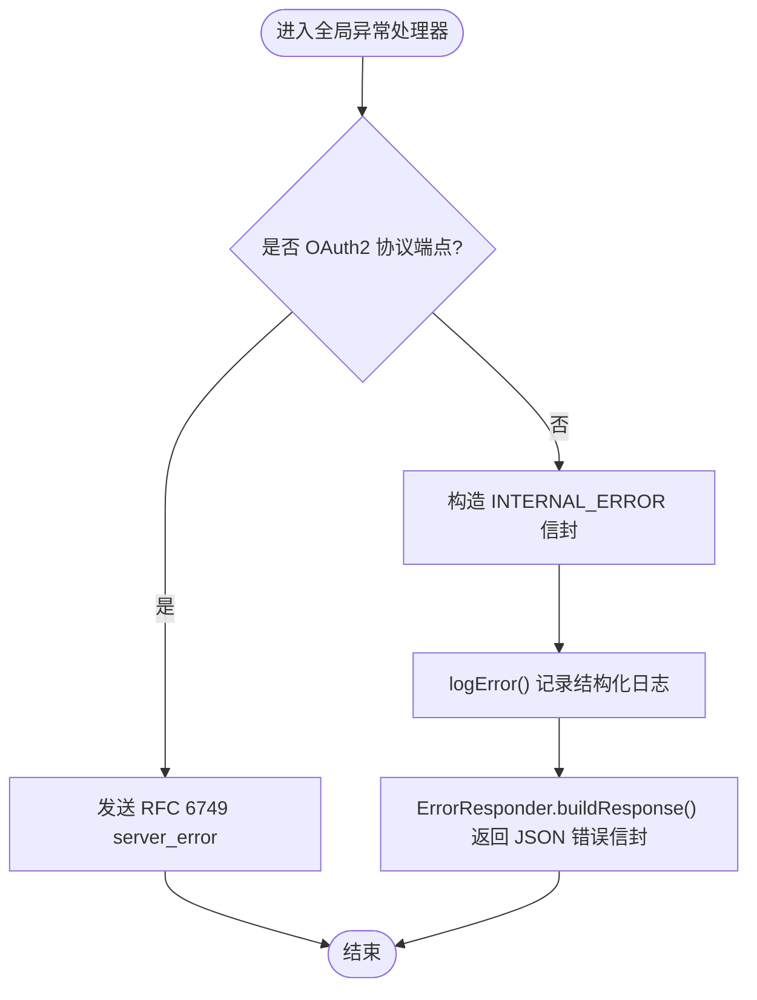
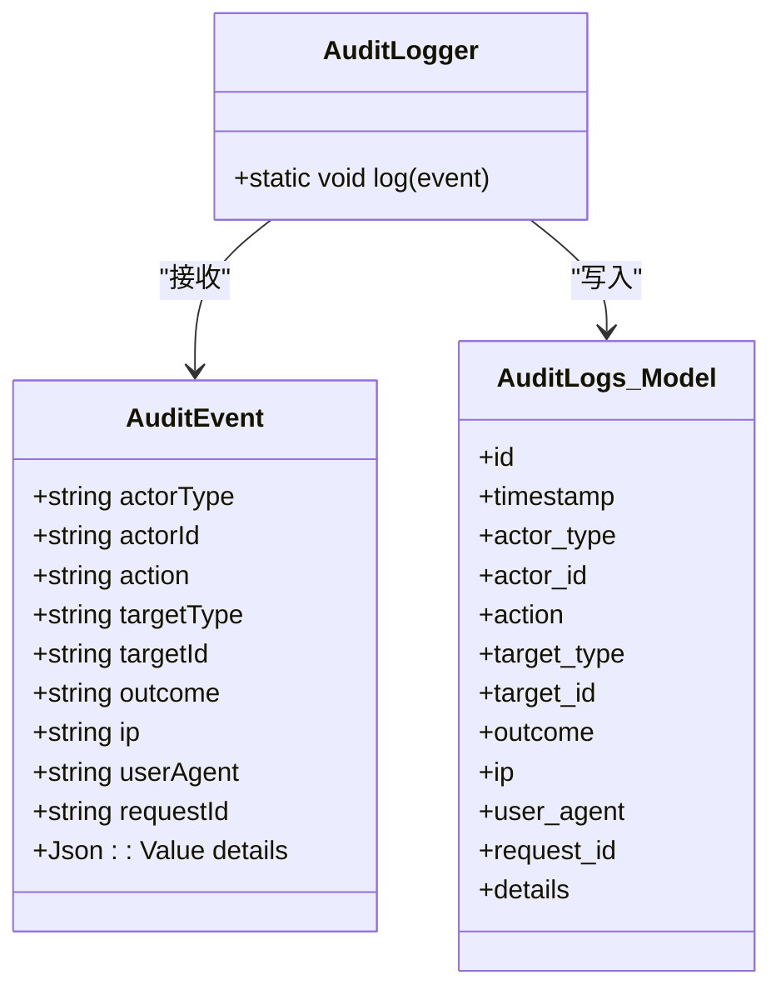
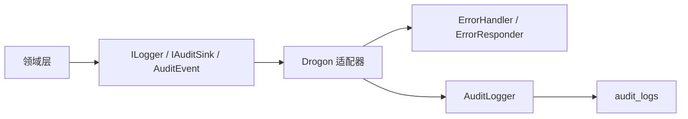

# 日志系统

<cite>
**本文引用的文件**
- [apps/server/config/config.prod.json](file://apps/server/config/config.prod.json)
- [apps/server/config/config.dev.json](file://apps/server/config/config.dev.json)
- [libs/common/include/authforge/common/ports/ILogger.h](file://libs/common/include/authforge/common/ports/ILogger.h)
- [docs/backend/observability.md](file://docs/backend/observability.md)
- [apps/server/src/bootstrap/ExceptionHandlerSetup.cc](file://apps/server/src/bootstrap/ExceptionHandlerSetup.cc)
- [libs/drogon/src/error/ErrorHandler.cc](file://libs/drogon/src/error/ErrorHandler.cc)
- [libs/common/include/authforge/common/error/ErrorTypes.h](file://libs/common/include/authforge/common/error/ErrorTypes.h)
- [libs/drogon/include/authforge/drogon/error/ErrorHandler.h](file://libs/drogon/include/authforge/drogon/error/ErrorHandler.h)
- [libs/drogon/include/authforge/drogon/error/ErrorResponder.h](file://libs/drogon/include/authforge/drogon/error/ErrorResponder.h)
- [apps/server/migrations/V012__audit_logs.sql](file://apps/server/migrations/V012__audit_logs.sql)
- [libs/storage-postgres/src/models/AuditLogs.cc](file://libs/storage-postgres/src/models/AuditLogs.cc)
- [libs/drogon/include/authforge/drogon/observability/AuditLogger.h](file://libs/drogon/include/authforge/drogon/observability/AuditLogger.h)
- [libs/drogon/src/observability/AuditLogger.cc](file://libs/drogon/src/observability/AuditLogger.cc)
- [libs/common/include/authforge/common/observability/AuditEvent.h](file://libs/common/include/authforge/common/observability/AuditEvent.h)
- [libs/common/include/authforge/common/ports/IAuditSink.h](file://libs/common/include/authforge/common/ports/IAuditSink.h)
- [frontends/admin/tests/e2e/logs.spec.ts](file://frontends/admin/tests/e2e/logs.spec.ts)
</cite>

## 目录
1. [简介](#简介)
2. [项目结构](#项目结构)
3. [核心组件](#核心组件)
4. [架构总览](#架构总览)
5. [详细组件分析](#详细组件分析)
6. [依赖关系分析](#依赖关系分析)
7. [性能考虑](#性能考虑)
8. [故障排查指南](#故障排查指南)
9. [结论](#结论)
10. [附录](#附录)

## 简介
本文件面向 AuthForge 的日志与可观测性体系，覆盖结构化日志配置、日志级别、输出格式、审计日志、异常处理机制（全局异常捕获、错误堆栈与格式化）、日志聚合方案（ELK/Loki）以及生产环境安全实践。文档同时提供查询与分析最佳实践，帮助快速定位关键错误模式与性能瓶颈。

## 项目结构
AuthForge 将“领域层”与“适配器层”解耦：领域层通过端口接口记录日志与审计事件，适配器层负责具体实现（如 Drogon 日志宏、数据库写入）。配置文件集中管理日志级别、轮转策略等运行时参数；迁移脚本定义审计日志表结构；前端提供审计日志查看能力。

图表来源
- [apps/server/config/config.prod.json:101-109](file://apps/server/config/config.prod.json#L101-L109)
- [apps/server/config/config.dev.json:101-109](file://apps/server/config/config.dev.json#L101-L109)
- [libs/common/include/authforge/common/ports/ILogger.h:29-52](file://libs/common/include/authforge/common/ports/ILogger.h#L29-L52)
- [libs/common/include/authforge/common/observability/AuditEvent.h:31-44](file://libs/common/include/authforge/common/observability/AuditEvent.h#L31-L44)
- [libs/common/include/authforge/common/ports/IAuditSink.h:39-48](file://libs/common/include/authforge/common/ports/IAuditSink.h#L39-L48)
- [libs/common/include/authforge/common/error/ErrorTypes.h:35-95](file://libs/common/include/authforge/common/error/ErrorTypes.h#L35-L95)
- [apps/server/src/bootstrap/ExceptionHandlerSetup.cc:13-63](file://apps/server/src/bootstrap/ExceptionHandlerSetup.cc#L13-L63)
- [libs/drogon/include/authforge/drogon/error/ErrorHandler.h:12-30](file://libs/drogon/include/authforge/drogon/error/ErrorHandler.h#L12-L30)
- [libs/drogon/src/error/ErrorHandler.cc:16-96](file://libs/drogon/src/error/ErrorHandler.cc#L16-L96)
- [libs/drogon/include/authforge/drogon/error/ErrorResponder.h:99-109](file://libs/drogon/include/authforge/drogon/error/ErrorResponder.h#L99-L109)
- [libs/drogon/include/authforge/drogon/observability/AuditLogger.h:20-34](file://libs/drogon/include/authforge/drogon/observability/AuditLogger.h#L20-L34)
- [libs/drogon/src/observability/AuditLogger.cc:70-93](file://libs/drogon/src/observability/AuditLogger.cc#L70-L93)
- [apps/server/migrations/V012__audit_logs.sql:4-22](file://apps/server/migrations/V012__audit_logs.sql#L4-L22)
- [libs/storage-postgres/src/models/AuditLogs.cc:16-44](file://libs/storage-postgres/src/models/AuditLogs.cc#L16-L44)
- [docs/backend/observability.md:32-99](file://docs/backend/observability.md#L32-L99)
- [frontends/admin/tests/e2e/logs.spec.ts:1-32](file://frontends/admin/tests/e2e/logs.spec.ts#L1-L32)

章节来源
- [apps/server/config/config.prod.json:101-109](file://apps/server/config/config.prod.json#L101-L109)
- [apps/server/config/config.dev.json:101-109](file://apps/server/config/config.dev.json#L101-L109)
- [docs/backend/observability.md:32-99](file://docs/backend/observability.md#L32-L99)

## 核心组件
- 结构化日志端口 ILogger：为领域层提供与框架无关的日志抽象，支持 Trace/Debug/Info/Warn/Error/Fatal 六级。
- 审计事件模型 AuditEvent 与审计落库：以结构化字段记录关键安全操作，异步写入数据库。
- 统一错误处理：全局异常处理器按请求路径区分 OAuth2 协议端点与应用端点，返回标准错误信封或协议错误体。
- 错误工具类 ErrorHandler：封装数据库异常、校验异常的转换与日志记录，并基于错误类别选择合适日志级别。
- 配置项：app.log.* 控制日志后端、路径、轮转、级别与本地时间显示。

章节来源
- [libs/common/include/authforge/common/ports/ILogger.h:29-52](file://libs/common/include/authforge/common/ports/ILogger.h#L29-L52)
- [libs/common/include/authforge/common/observability/AuditEvent.h:31-44](file://libs/common/include/authforge/common/observability/AuditEvent.h#L31-L44)
- [libs/drogon/include/authforge/drogon/observability/AuditLogger.h:20-34](file://libs/drogon/include/authforge/drogon/observability/AuditLogger.h#L20-L34)
- [libs/drogon/src/observability/AuditLogger.cc:70-93](file://libs/drogon/src/observability/AuditLogger.cc#L70-L93)
- [apps/server/src/bootstrap/ExceptionHandlerSetup.cc:13-63](file://apps/server/src/bootstrap/ExceptionHandlerSetup.cc#L13-L63)
- [libs/drogon/src/error/ErrorHandler.cc:16-96](file://libs/drogon/src/error/ErrorHandler.cc#L16-L96)
- [apps/server/config/config.prod.json:101-109](file://apps/server/config/config.prod.json#L101-L109)
- [apps/server/config/config.dev.json:101-109](file://apps/server/config/config.dev.json#L101-L109)

## 架构总览
下图展示从请求进入、异常捕获、错误响应到审计落库的整体流程，体现结构化日志、上下文追踪与持久化审计的结合。

图表来源
- [apps/server/src/bootstrap/ExceptionHandlerSetup.cc:13-63](file://apps/server/src/bootstrap/ExceptionHandlerSetup.cc#L13-L63)
- [libs/drogon/src/error/ErrorHandler.cc:16-96](file://libs/drogon/src/error/ErrorHandler.cc#L16-L96)
- [libs/drogon/include/authforge/drogon/error/ErrorResponder.h:99-109](file://libs/drogon/include/authforge/drogon/error/ErrorResponder.h#L99-L109)
- [libs/drogon/src/observability/AuditLogger.cc:70-93](file://libs/drogon/src/observability/AuditLogger.cc#L70-L93)
- [apps/server/migrations/V012__audit_logs.sql:4-22](file://apps/server/migrations/V012__audit_logs.sql#L4-L22)

## 详细组件分析

### 结构化日志配置与级别
- 日志级别：Trace < Debug < Info < Warn < Error < Fatal，与 Drogon/Trantor 一致。
- 默认级别：生产 config.prod.json 使用 INFO；开发 config.dev.json 使用 DEBUG。
- 动态调整：修改 app.log.log_level 即可生效（大小写不敏感）。
- 其他选项：use_spdlog、log_path、logfile_base_name、log_size_limit、max_files、display_local_time。

章节来源
- [docs/backend/observability.md:64-99](file://docs/backend/observability.md#L64-L99)
- [apps/server/config/config.prod.json:101-109](file://apps/server/config/config.prod.json#L101-L109)
- [apps/server/config/config.dev.json:101-109](file://apps/server/config/config.dev.json#L101-L109)

### 输出格式规范
- 审计日志：带 [AUDIT] 标记，包含 Action、User、Client、Success、IP 等键值对，便于 ELK/Loki 解析。
- 上下文日志：所有日志自动附带 RequestId，用于跨链路关联。
- 错误日志：由 ErrorHandler::logError 统一拼装 [RequestId] + context + [Code] Message | Details，并按错误类别选择 WARN/ERROR。

章节来源
- [docs/backend/observability.md:32-56](file://docs/backend/observability.md#L32-L56)
- [libs/drogon/src/error/ErrorHandler.cc:16-43](file://libs/drogon/src/error/ErrorHandler.cc#L16-L43)

### 日志文件轮转策略
- 轮转开关与阈值：log_size_limit 控制单文件大小上限；max_files 控制保留文件数量。
- 基名与路径：logfile_base_name 与 log_path 决定输出位置与命名前缀。
- 生产建议：开启轮转并限制最大文件数，避免磁盘占满；结合外部采集器（Filebeat/Fluent Bit）转发至 ELK/Loki。

章节来源
- [apps/server/config/config.prod.json:101-109](file://apps/server/config/config.prod.json#L101-L109)
- [apps/server/config/config.dev.json:101-109](file://apps/server/config/config.dev.json#L101-L109)

### 异常处理机制
- 全局异常捕获：通过 setExceptionHandler 注册，记录未处理异常并分支处理。
- 协议端点 vs 应用端点：
  - OAuth2 协议端点：返回 RFC 6749 server_error 响应体。
  - 应用端点：返回统一 Error Envelope（INTERNAL_ERROR），并携带 RequestId。
- 错误分类与日志级别：根据 ErrorCategory 选择 WARN/ERROR 输出。
- 数据库异常映射：连接/约束/查询错误分别映射为不同错误码，原始信息放入 details。
- 校验异常：VALIDATION_INVALID_INPUT，message 为原因，details 包含 field。

图表来源
- [apps/server/src/bootstrap/ExceptionHandlerSetup.cc:13-63](file://apps/server/src/bootstrap/ExceptionHandlerSetup.cc#L13-L63)
- [libs/drogon/src/error/ErrorHandler.cc:16-96](file://libs/drogon/src/error/ErrorHandler.cc#L16-L96)
- [libs/drogon/include/authforge/drogon/error/ErrorResponder.h:99-109](file://libs/drogon/include/authforge/drogon/error/ErrorResponder.h#L99-L109)

章节来源
- [apps/server/src/bootstrap/ExceptionHandlerSetup.cc:13-63](file://apps/server/src/bootstrap/ExceptionHandlerSetup.cc#L13-L63)
- [libs/drogon/src/error/ErrorHandler.cc:16-96](file://libs/drogon/src/error/ErrorHandler.cc#L16-L96)
- [libs/common/include/authforge/common/error/ErrorTypes.h:35-95](file://libs/common/include/authforge/common/error/ErrorTypes.h#L35-L95)

### 审计日志与持久化
- 表结构：audit_logs 包含时间戳、行为者、动作、目标、结果、IP、UA、RequestID、JSONB 详情等字段，并提供常用索引。
- 写入方式：AuditLogger 异步写入，不阻塞主流程；失败时降级为警告日志。
- 前端展示：管理员页面提供审计日志列表，支持按列筛选与状态徽章展示。

图表来源
- [libs/common/include/authforge/common/observability/AuditEvent.h:31-44](file://libs/common/include/authforge/common/observability/AuditEvent.h#L31-L44)
- [libs/drogon/include/authforge/drogon/observability/AuditLogger.h:20-34](file://libs/drogon/include/authforge/drogon/observability/AuditLogger.h#L20-L34)
- [libs/drogon/src/observability/AuditLogger.cc:70-93](file://libs/drogon/src/observability/AuditLogger.cc#L70-L93)
- [apps/server/migrations/V012__audit_logs.sql:4-22](file://apps/server/migrations/V012__audit_logs.sql#L4-L22)
- [libs/storage-postgres/src/models/AuditLogs.cc:16-44](file://libs/storage-postgres/src/models/AuditLogs.cc#L16-L44)

章节来源
- [apps/server/migrations/V012__audit_logs.sql:4-22](file://apps/server/migrations/V012__audit_logs.sql#L4-L22)
- [libs/drogon/src/observability/AuditLogger.cc:70-93](file://libs/drogon/src/observability/AuditLogger.cc#L70-L93)
- [frontends/admin/tests/e2e/logs.spec.ts:1-32](file://frontends/admin/tests/e2e/logs.spec.ts#L1-L32)

### 日志聚合方案（ELK/Loki）
- 采集器：建议使用 Filebeat/Fluent Bit 收集应用日志与访问日志，按环境分片。
- 索引策略：
  - ELK：按日期滚动索引，设置生命周期（ILM）与冷热分层。
  - Loki：按 label（service、env、level）组织流，设置 retention。
- 结构化解析：
  - 审计日志：以 [AUDIT] 为标识，提取 key=value 字段。
  - 错误日志：解析 [RequestId]、[Code]、Message、Details。
- 指标联动：Prometheus Exporter 暴露 /metrics，结合 Grafana 面板观察 QPS、错误率、延迟分布。

章节来源
- [docs/backend/observability.md:5-31](file://docs/backend/observability.md#L5-L31)
- [docs/backend/observability.md:32-56](file://docs/backend/observability.md#L32-L56)

### 日志查询与分析最佳实践
- 关键错误模式识别：
  - 认证失败：AUTHENTICATION 类别，关注登录失败、令牌交换失败。
  - 数据库异常：DATABASE 类别，关注连接超时、约束冲突、查询错误。
  - 校验失败：VALIDATION 类别，关注输入非法、字段缺失。
- 性能瓶颈定位：
  - 使用 RequestId 串联一次请求的全链路日志。
  - 结合 Prometheus 指标（oauth2_latency_seconds）与审计日志中的耗时上下文。
- 审计分析：
  - 按 action 统计成功/失败比例，监控异常峰值。
  - 按 actor_type/actor_id 追踪高风险用户或客户端行为。

章节来源
- [libs/drogon/src/error/ErrorHandler.cc:16-96](file://libs/drogon/src/error/ErrorHandler.cc#L16-L96)
- [docs/backend/observability.md:5-31](file://docs/backend/observability.md#L5-L31)
- [apps/server/migrations/V012__audit_logs.sql:4-22](file://apps/server/migrations/V012__audit_logs.sql#L4-L22)

### 生产环境日志安全
- 敏感信息脱敏：
  - 不在 message/details 中记录密码、密钥、完整令牌。
  - 审计日志 details 仅保留必要上下文，避免 PII。
- 访问控制：
  - 审计日志 API 需鉴权（Bearer Token），仅管理员可访问。
  - 日志文件与索引按环境隔离，限制读取权限。
- 合规与留存：
  - 设定保留策略（ILM/retention），满足审计要求。
  - 对高敏感操作启用额外告警与审批流程。

章节来源
- [apps/server/docs/api/openapi.json:328-348](file://apps/server/docs/api/openapi.json#L328-L348)
- [apps/server/migrations/V012__audit_logs.sql:4-22](file://apps/server/migrations/V012__audit_logs.sql#L4-L22)

## 依赖关系分析
- 领域层通过 ILogger、IAuditSink、AuditEvent 与适配器层解耦，确保测试可替换实现。
- 适配器层（Drogon）承担具体日志宏调用、HTTP 响应构建、数据库写入。
- 错误处理链：ExceptionHandlerSetup → ErrorHandler → ErrorResponder，保证统一输出与日志级别。
- 审计写入链：业务代码 → IAuditSink → AuditLogger → 数据库 audit_logs。

图表来源
- [libs/common/include/authforge/common/ports/ILogger.h:29-52](file://libs/common/include/authforge/common/ports/ILogger.h#L29-L52)
- [libs/common/include/authforge/common/ports/IAuditSink.h:39-48](file://libs/common/include/authforge/common/ports/IAuditSink.h#L39-L48)
- [libs/common/include/authforge/common/observability/AuditEvent.h:31-44](file://libs/common/include/authforge/common/observability/AuditEvent.h#L31-L44)
- [libs/drogon/src/error/ErrorHandler.cc:16-96](file://libs/drogon/src/error/ErrorHandler.cc#L16-L96)
- [libs/drogon/include/authforge/drogon/error/ErrorResponder.h:99-109](file://libs/drogon/include/authforge/drogon/error/ErrorResponder.h#L99-L109)
- [libs/drogon/src/observability/AuditLogger.cc:70-93](file://libs/drogon/src/observability/AuditLogger.cc#L70-L93)
- [apps/server/migrations/V012__audit_logs.sql:4-22](file://apps/server/migrations/V012__audit_logs.sql#L4-L22)

章节来源
- [libs/common/include/authforge/common/ports/ILogger.h:29-52](file://libs/common/include/authforge/common/ports/ILogger.h#L29-L52)
- [libs/drogon/src/error/ErrorHandler.cc:16-96](file://libs/drogon/src/error/ErrorHandler.cc#L16-L96)
- [libs/drogon/src/observability/AuditLogger.cc:70-93](file://libs/drogon/src/observability/AuditLogger.cc#L70-L93)

## 性能考虑
- 日志级别：生产默认 INFO，避免过多 trace/debug 影响吞吐。
- 异步审计：AuditLogger 采用 fire-and-forget 写入，降低主流程延迟。
- 轮转策略：合理设置 log_size_limit 与 max_files，防止 I/O 抖动。
- 指标联动：利用 Prometheus 指标与日志 RequestId 进行端到端性能分析。

章节来源
- [docs/backend/observability.md:64-99](file://docs/backend/observability.md#L64-L99)
- [libs/drogon/src/observability/AuditLogger.cc:70-93](file://libs/drogon/src/observability/AuditLogger.cc#L70-L93)
- [apps/server/config/config.prod.json:101-109](file://apps/server/config/config.prod.json#L101-L109)

## 故障排查指南
- 未捕获异常：检查全局异常处理器日志，确认是否落入协议端点或应用端点分支。
- 数据库异常：查看 DATABASE 类别错误日志，定位连接/约束/查询问题。
- 校验失败：关注 VALIDATION 类别，核对输入字段与规则。
- 审计缺失：验证 AuditLogger 写入是否成功，必要时临时提升日志级别。

章节来源
- [apps/server/src/bootstrap/ExceptionHandlerSetup.cc:13-63](file://apps/server/src/bootstrap/ExceptionHandlerSetup.cc#L13-L63)
- [libs/drogon/src/error/ErrorHandler.cc:16-96](file://libs/drogon/src/error/ErrorHandler.cc#L16-L96)
- [libs/drogon/src/observability/AuditLogger.cc:70-93](file://libs/drogon/src/observability/AuditLogger.cc#L70-L93)

## 结论
AuthForge 的日志系统通过领域与适配器的清晰分层、统一的错误处理与结构化审计，提供了可观测、可追溯、可扩展的运维基础。配合 ELK/Loki 与 Prometheus，可实现从日志到指标的闭环监控，支撑生产环境的稳定运行与快速排障。

## 附录
- 配置参考：
  - 生产：app.log.log_level=INFO，启用轮转与本地时间显示。
  - 开发：app.log.log_level=DEBUG，便于调试。
- 审计字段说明：
  - actor_type/actor_id：行为主体类型与标识。
  - action/target_type/target_id：动作与目标对象。
  - outcome：success/failure。
  - ip/user_agent/request_id：网络与追踪信息。
  - details：扩展上下文（JSONB）。

章节来源
- [apps/server/config/config.prod.json:101-109](file://apps/server/config/config.prod.json#L101-L109)
- [apps/server/config/config.dev.json:101-109](file://apps/server/config/config.dev.json#L101-L109)
- [apps/server/migrations/V012__audit_logs.sql:4-22](file://apps/server/migrations/V012__audit_logs.sql#L4-L22)