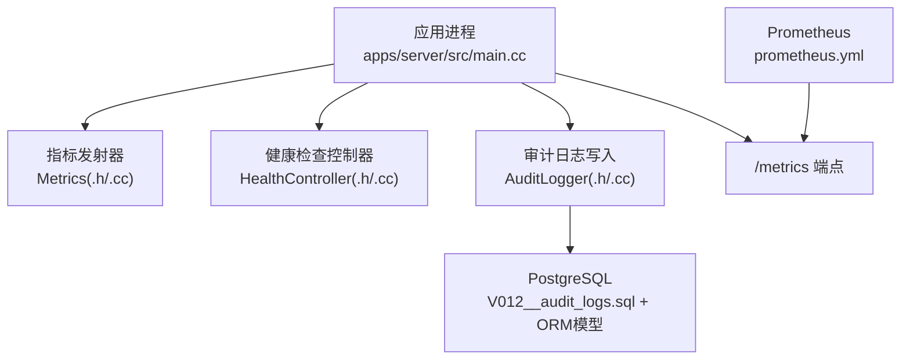
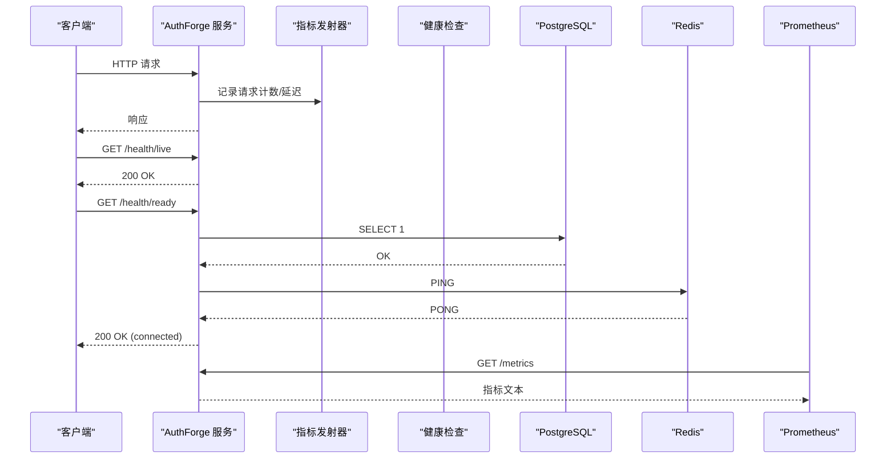
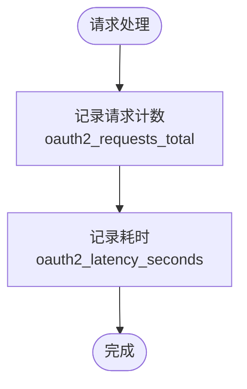
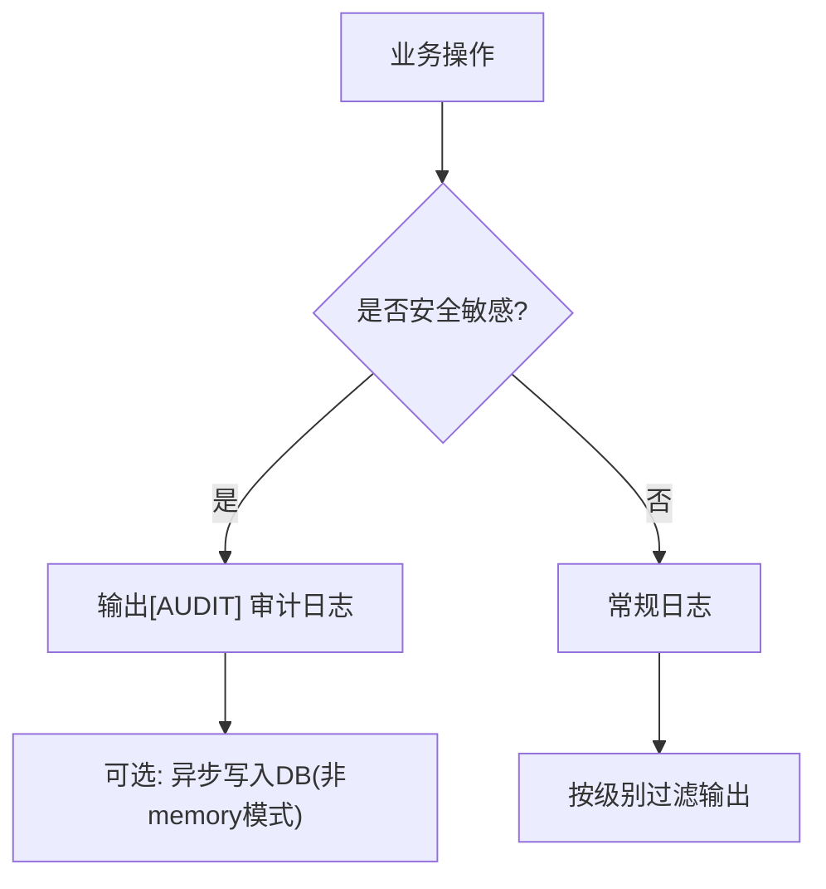
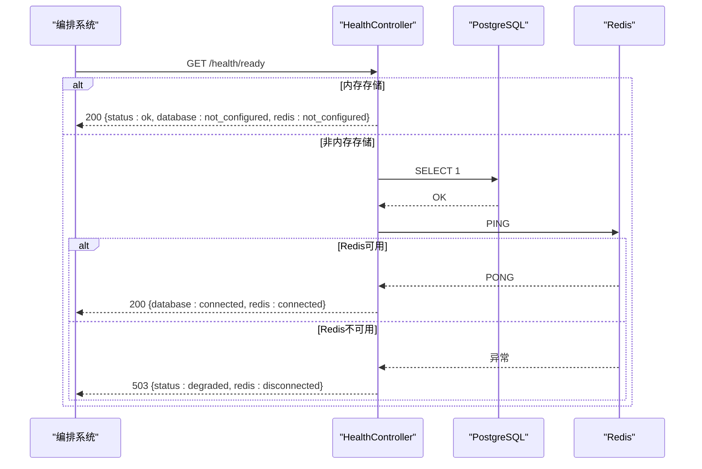
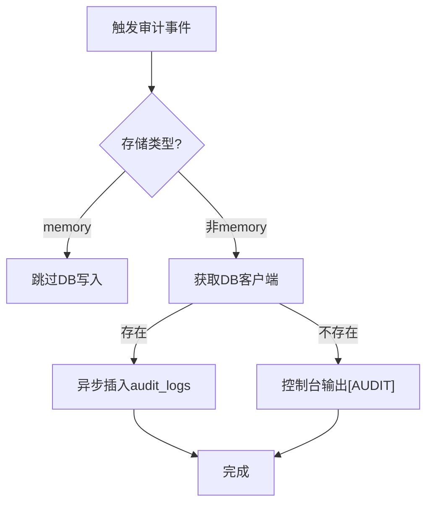
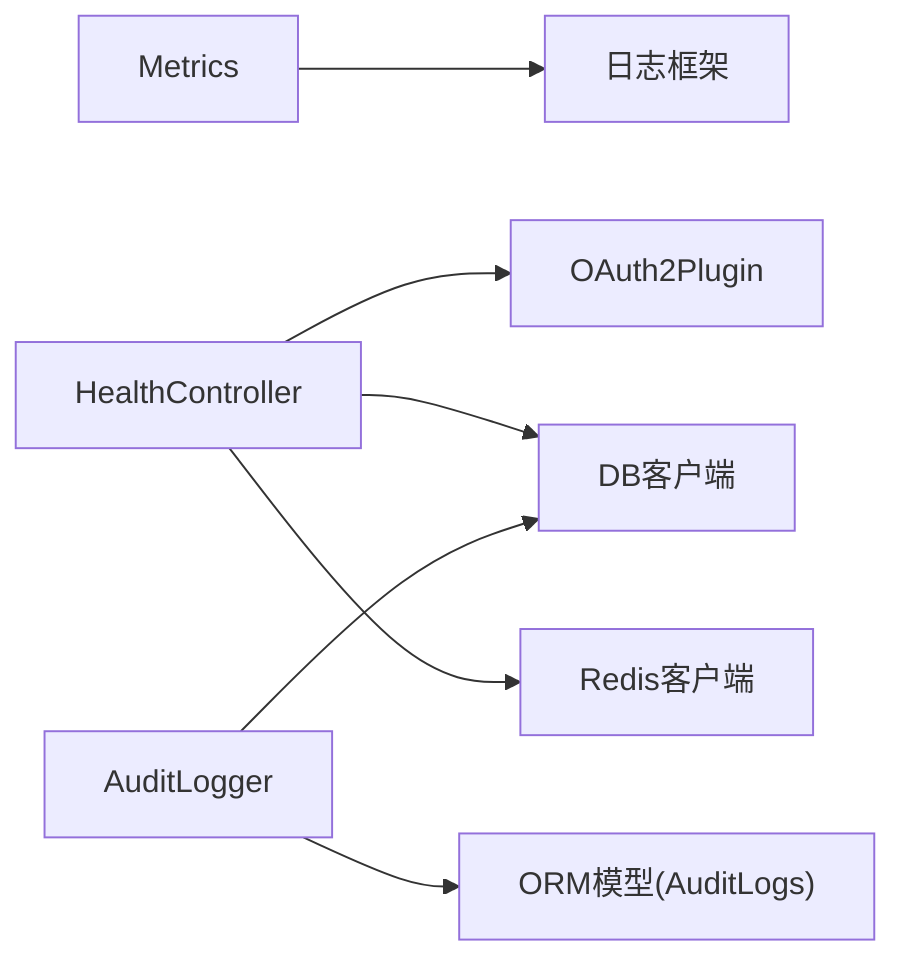

# 监控与可观测性

<cite>
**本文引用的文件**
- [apps/server/src/main.cc](file://apps/server/src/main.cc)
- [libs/drogon/include/authforge/drogon/observability/Metrics.h](file://libs/drogon/include/authforge/drogon/observability/Metrics.h)
- [libs/drogon/src/observability/Metrics.cc](file://libs/drogon/src/observability/Metrics.cc)
- [deploy/observability/prometheus.yml](file://deploy/observability/prometheus.yml)
- [docs/backend/observability.md](file://docs/backend/observability.md)
- [docs/backend/docker-deployment.md](file://docs/backend/docker-deployment.md)
- [libs/drogon/include/authforge/drogon/controllers/HealthController.h](file://libs/drogon/include/authforge/drogon/controllers/HealthController.h)
- [libs/drogon/src/controllers/HealthController.cc](file://libs/drogon/src/controllers/HealthController.cc)
- [tests/integration/controllers/HealthEndpointHttpTest.cc](file://tests/integration/controllers/HealthEndpointHttpTest.cc)
- [libs/drogon/include/authforge/drogon/observability/AuditLogger.h](file://libs/drogon/include/authforge/drogon/observability/AuditLogger.h)
- [libs/drogon/src/observability/AuditLogger.cc](file://libs/drogon/src/observability/AuditLogger.cc)
- [apps/server/migrations/V012__audit_logs.sql](file://apps/server/migrations/V012__audit_logs.sql)
- [libs/storage-postgres/include/authforge/storage/postgres/models/AuditLogs.h](file://libs/storage-postgres/include/authforge/storage/postgres/models/AuditLogs.h)
- [libs/common/include/authforge/common/ports/IAuditSink.h](file://libs/common/include/authforge/common/ports/IAuditSink.h)
- [libs/drogon/src/controllers/AuditController.cc](file://libs/drogon/src/controllers/AuditController.cc)
- [tests/integration/admin/AdminAuditApiHttpTest.cc](file://tests/integration/admin/AdminAuditApiHttpTest.cc)
</cite>

## 目录
1. [简介](#简介)
2. [项目结构](#项目结构)
3. [核心组件](#核心组件)
4. [架构总览](#架构总览)
5. [详细组件分析](#详细组件分析)
6. [依赖关系分析](#依赖关系分析)
7. [性能考量](#性能考量)
8. [故障排查指南](#故障排查指南)
9. [结论](#结论)
10. [附录](#附录)

## 简介
本文件面向生产运维与平台工程团队，系统化说明 AuthForge 的监控与可观测性能力：Prometheus 指标采集、结构化日志体系、健康检查端点、审计日志记录、告警与通知建议、性能监控与瓶颈分析方法，以及故障排查与调试工具使用。文档同时给出架构图、数据流图与关键流程时序图，帮助读者快速定位问题并制定优化策略。

## 项目结构
与监控和可观测性直接相关的代码与配置分布在以下位置：
- 指标发射与定义：libs/drogon 下的 observability 模块（Metrics.h/.cc）
- Prometheus 抓取配置：deploy/observability/prometheus.yml
- 健康检查：libs/drogon 下的 HealthController（.h/.cc），并在测试中覆盖
- 审计日志：libs/drogon 下的 AuditLogger（.h/.cc）、数据库迁移 V012__audit_logs.sql、ORM 模型 AuditLogs.h、管理端控制器 AuditController.cc
- 启动装配与日志目录创建：apps/server/src/main.cc
- 后端可观测性设计文档：docs/backend/observability.md
- 部署与 /metrics 暴露建议：docs/backend/docker-deployment.md

图表来源
- [apps/server/src/main.cc:97-238](file://apps/server/src/main.cc#L97-L238)
- [libs/drogon/src/observability/Metrics.cc:19-86](file://libs/drogon/src/observability/Metrics.cc#L19-L86)
- [libs/drogon/src/controllers/HealthController.cc:14-170](file://libs/drogon/src/controllers/HealthController.cc#L14-L170)
- [libs/drogon/src/observability/AuditLogger.cc:19-91](file://libs/drogon/src/observability/AuditLogger.cc#L19-L91)
- [apps/server/migrations/V012__audit_logs.sql:1-22](file://apps/server/migrations/V012__audit_logs.sql#L1-L22)
- [deploy/observability/prometheus.yml:1-8](file://deploy/observability/prometheus.yml#L1-L8)

章节来源
- [apps/server/src/main.cc:97-238](file://apps/server/src/main.cc#L97-L238)
- [docs/backend/observability.md:1-100](file://docs/backend/observability.md#L1-L100)
- [docs/backend/docker-deployment.md:139-202](file://docs/backend/docker-deployment.md#L139-L202)

## 核心组件
- 指标系统（Metrics）
  - 提供请求计数、登录失败计数、延迟直方图、活跃令牌估算、Introspection/Revocation 请求与错误计数等指标发射接口。
  - 当前实现通过带 [METRIC] 标记的结构化日志输出，供 PromExporter 或日志采集端消费；未来可扩展为原生计数器。
- 健康检查（HealthController）
  - /health/live：进程存活探针，始终返回 200。
  - /health/ready：就绪探针，探测数据库与 Redis 连通性；内存存储模式时报告 not_configured 且返回 200。
  - /health：基础健康，包含服务名、时间戳与存储类型信息。
- 审计日志（AuditLogger + 迁移 + ORM）
  - 异步写入 audit_logs 表，支持 actor/target/outcome/IP/UserAgent/RequestId/Details 等字段。
  - 在 memory 存储模式下跳过 DB 写入，避免阻塞主流程。
- Prometheus 集成
  - prometheus.yml 配置抓取 oauth2-backend 的 /metrics 端点。
  - 生产部署建议屏蔽公网暴露 /metrics，仅内网访问。

章节来源
- [libs/drogon/include/authforge/drogon/observability/Metrics.h:25-59](file://libs/drogon/include/authforge/drogon/observability/Metrics.h#L25-L59)
- [libs/drogon/src/observability/Metrics.cc:19-86](file://libs/drogon/src/observability/Metrics.cc#L19-L86)
- [libs/drogon/include/authforge/drogon/controllers/HealthController.h:32-73](file://libs/drogon/include/authforge/drogon/controllers/HealthController.h#L32-L73)
- [libs/drogon/src/controllers/HealthController.cc:14-170](file://libs/drogon/src/controllers/HealthController.cc#L14-L170)
- [libs/drogon/include/authforge/drogon/observability/AuditLogger.h:20-34](file://libs/drogon/include/authforge/drogon/observability/AuditLogger.h#L20-L34)
- [libs/drogon/src/observability/AuditLogger.cc:19-91](file://libs/drogon/src/observability/AuditLogger.cc#L19-L91)
- [apps/server/migrations/V012__audit_logs.sql:1-22](file://apps/server/migrations/V012__audit_logs.sql#L1-L22)
- [deploy/observability/prometheus.yml:1-8](file://deploy/observability/prometheus.yml#L1-L8)

## 架构总览
下图展示从请求进入、指标发射、健康检查到审计日志落库的整体链路。

图表来源
- [libs/drogon/src/observability/Metrics.cc:19-86](file://libs/drogon/src/observability/Metrics.cc#L19-L86)
- [libs/drogon/src/controllers/HealthController.cc:58-170](file://libs/drogon/src/controllers/HealthController.cc#L58-L170)
- [deploy/observability/prometheus.yml:1-8](file://deploy/observability/prometheus.yml#L1-L8)

## 详细组件分析

### Prometheus 指标集成
- 内置指标
  - 请求总数：oauth2_requests_total{endpoint,status}
  - 登录失败：oauth2_login_failures_total{reason}
  - Introspection：oauth2_introspect_requests_total{client_id}、oauth2_introspect_errors_total{client_id,error}
  - Revocation：oauth2_revocation_requests_total{client_id}、oauth2_revocation_errors_total{client_id,error}
  - 延迟分布：oauth2_latency_seconds{operation,storage}
  - 活跃令牌估算：oauth2_active_tokens
- 采集方式
  - 当前通过 LOG_INFO 输出带 [METRIC] 的结构化日志，由 PromExporter 或日志采集端解析。
  - 可通过 Drogon PromExporter 插件进行原生指标暴露（需在配置中启用）。
- 配置与抓取
  - prometheus.yml 指定 job_name 与目标地址，抓取 /metrics。
  - 生产环境建议将 /metrics 限制在内网访问，避免公网暴露。

图表来源
- [libs/drogon/src/observability/Metrics.cc:19-86](file://libs/drogon/src/observability/Metrics.cc#L19-L86)
- [deploy/observability/prometheus.yml:1-8](file://deploy/observability/prometheus.yml#L1-L8)

章节来源
- [docs/backend/observability.md:1-100](file://docs/backend/observability.md#L1-L100)
- [libs/drogon/include/authforge/drogon/observability/Metrics.h:25-59](file://libs/drogon/include/authforge/drogon/observability/Metrics.h#L25-L59)
- [libs/drogon/src/observability/Metrics.cc:19-86](file://libs/drogon/src/observability/Metrics.cc#L19-L86)
- [docs/backend/docker-deployment.md:139-202](file://docs/backend/docker-deployment.md#L139-L202)

### 结构化日志系统
- 日志级别
  - 六级：trace < debug < info < warn < error < fatal。
  - 生产默认 INFO，开发默认 DEBUG；可通过 app.log.log_level 动态调整。
- 格式规范
  - 审计日志：[AUDIT] Action=... User=... Client=... Success=... IP=...
  - 上下文日志：自动附带 RequestId，便于分布式追踪关联。
  - 指标日志：[METRIC] 前缀，键值对形式，供采集端解析。
- 轮转策略
  - 启动阶段根据配置创建日志目录；具体轮转策略由底层日志框架与运行环境决定。
- 代码约定
  - Domain 层通过 ILogger 端口输出，Adapter/基础设施层可直接使用 LOG_* 宏。

图表来源
- [docs/backend/observability.md:32-99](file://docs/backend/observability.md#L32-L99)
- [apps/server/src/main.cc:42-73](file://apps/server/src/main.cc#L42-L73)
- [libs/drogon/src/observability/AuditLogger.cc:19-91](file://libs/drogon/src/observability/AuditLogger.cc#L19-L91)

章节来源
- [docs/backend/observability.md:32-99](file://docs/backend/observability.md#L32-L99)
- [apps/server/src/main.cc:42-73](file://apps/server/src/main.cc#L42-L73)

### 健康检查端点
- /health/live：进程存活，无副作用，始终 200。
- /health/ready：就绪检查
  - 内存存储模式：返回 database/redis = not_configured，状态 ok。
  - 非内存模式：执行 SELECT 1 检测数据库，再 PING Redis；任一失败返回 503 并标注 disconnected/unavailable。
- /health：基础健康，包含服务名、时间戳与存储类型。

图表来源
- [libs/drogon/src/controllers/HealthController.cc:58-170](file://libs/drogon/src/controllers/HealthController.cc#L58-L170)
- [tests/integration/controllers/HealthEndpointHttpTest.cc:1-32](file://tests/integration/controllers/HealthEndpointHttpTest.cc#L1-L32)

章节来源
- [libs/drogon/include/authforge/drogon/controllers/HealthController.h:32-73](file://libs/drogon/include/authforge/drogon/controllers/HealthController.h#L32-L73)
- [libs/drogon/src/controllers/HealthController.cc:14-170](file://libs/drogon/src/controllers/HealthController.cc#L14-L170)
- [tests/integration/controllers/HealthEndpointHttpTest.cc:1-32](file://tests/integration/controllers/HealthEndpointHttpTest.cc#L1-L32)

### 审计日志记录
- 数据结构
  - 表：audit_logs，包含 timestamp、actor_type、actor_id、action、target_type、target_id、outcome、ip、user_agent、request_id、details(JSONB)。
  - 索引：timestamp、actor、action、outcome+timestamp。
- 写入流程
  - 非 memory 存储模式：异步写入数据库；若无可用的 DB 客户端，回退到控制台输出。
  - memory 存储模式：跳过 DB 写入，避免阻塞。
- 管理端查询
  - 提供 /api/admin/logs 分页列表与仪表盘统计接口，用于审计查看与分析。

图表来源
- [libs/drogon/src/observability/AuditLogger.cc:19-91](file://libs/drogon/src/observability/AuditLogger.cc#L19-L91)
- [apps/server/migrations/V012__audit_logs.sql:1-22](file://apps/server/migrations/V012__audit_logs.sql#L1-L22)
- [libs/storage-postgres/include/authforge/storage/postgres/models/AuditLogs.h:42-60](file://libs/storage-postgres/include/authforge/storage/postgres/models/AuditLogs.h#L42-L60)
- [libs/drogon/src/controllers/AuditController.cc:1-33](file://libs/drogon/src/controllers/AuditController.cc#L1-L33)

章节来源
- [libs/drogon/include/authforge/drogon/observability/AuditLogger.h:20-34](file://libs/drogon/include/authforge/drogon/observability/AuditLogger.h#L20-L34)
- [libs/drogon/src/observability/AuditLogger.cc:19-91](file://libs/drogon/src/observability/AuditLogger.cc#L19-L91)
- [apps/server/migrations/V012__audit_logs.sql:1-22](file://apps/server/migrations/V012__audit_logs.sql#L1-L22)
- [libs/storage-postgres/include/authforge/storage/postgres/models/AuditLogs.h:42-60](file://libs/storage-postgres/include/authforge/storage/postgres/models/AuditLogs.h#L42-L60)
- [libs/drogon/src/controllers/AuditController.cc:1-33](file://libs/drogon/src/controllers/AuditController.cc#L1-L33)
- [tests/integration/admin/AdminAuditApiHttpTest.cc:1-33](file://tests/integration/admin/AdminAuditApiHttpTest.cc#L1-L33)

### 告警配置与通知机制
- 指标告警建议
  - 登录失败率突增：rate(oauth2_login_failures_total[1m]) 超过阈值。
  - 高延迟：histogram_quantile(0.99, rate(oauth2_latency_seconds_bucket[1m])) 超过 SLA。
  - 活跃令牌异常波动：oauth2_active_tokens 偏离基线。
- 健康检查告警
  - /health/ready 持续返回 503 或 status 为 unhealthy/degraded。
- 审计告警
  - 高频失败审计事件（如大量 revoke/error）。
- 通知渠道
  - 结合 Prometheus Alertmanager 对接邮件、企业微信、钉钉等通道。

[本节为通用指导，不直接分析具体文件]

### 性能监控与瓶颈分析方法
- 指标维度
  - 请求量与错误率：rate(oauth2_requests_total)、rate(oauth2_login_failures_total)。
  - 延迟分布：P95/P99 分位，关注 operation/storage 标签。
  - 业务指标：活跃令牌趋势。
- 诊断步骤
  - 观察 QPS 与错误率曲线，定位异常时段。
  - 通过延迟直方图定位慢操作（如 token introspection/revocation）。
  - 结合审计日志与 RequestId 关联调用链。
  - 检查数据库与 Redis 健康状态与连接池配置。
- 压测与基准
  - 参考项目中的基准设计与脚本，评估不同场景下的吞吐与延迟。

章节来源
- [docs/backend/observability.md:24-30](file://docs/backend/observability.md#L24-L30)
- [libs/drogon/src/observability/Metrics.cc:42-55](file://libs/drogon/src/observability/Metrics.cc#L42-L55)

### 故障排查与调试工具
- 健康检查
  - 使用 /health/live 确认进程存活。
  - 使用 /health/ready 检查数据库与 Redis 连通性。
- 指标与日志
  - 抓取 /metrics 查看实时指标。
  - 搜索 [AUDIT] 与 [METRIC] 关键字定位问题。
- 审计日志查询
  - 通过 /api/admin/logs 分页查看审计事件，筛选 action/outcome 等条件。
- 集成测试辅助
  - 健康端点集成测试验证路由行为与状态码。

章节来源
- [libs/drogon/src/controllers/HealthController.cc:58-170](file://libs/drogon/src/controllers/HealthController.cc#L58-L170)
- [libs/drogon/src/controllers/AuditController.cc:1-33](file://libs/drogon/src/controllers/AuditController.cc#L1-L33)
- [tests/integration/controllers/HealthEndpointHttpTest.cc:1-32](file://tests/integration/controllers/HealthEndpointHttpTest.cc#L1-L32)

## 依赖关系分析
- 组件耦合
  - Metrics 与 Drogon PromExporter 解耦，通过结构化日志输出，降低运行时依赖。
  - HealthController 依赖 OAuth2Plugin 以获取存储类型，并间接依赖 DB/Redis 客户端。
  - AuditLogger 依赖 DB 客户端与 ORM 模型，memory 模式时短路。
- 外部依赖
  - PostgreSQL、Redis、Prometheus。
- 潜在风险
  - 健康检查在 memory 模式需特殊处理，避免误报。
  - 审计日志写入失败应降级为控制台输出，避免阻塞主流程。

图表来源
- [libs/drogon/src/observability/Metrics.cc:19-86](file://libs/drogon/src/observability/Metrics.cc#L19-L86)
- [libs/drogon/src/controllers/HealthController.cc:14-170](file://libs/drogon/src/controllers/HealthController.cc#L14-L170)
- [libs/drogon/src/observability/AuditLogger.cc:19-91](file://libs/drogon/src/observability/AuditLogger.cc#L19-L91)
- [libs/storage-postgres/include/authforge/storage/postgres/models/AuditLogs.h:42-60](file://libs/storage-postgres/include/authforge/storage/postgres/models/AuditLogs.h#L42-L60)

章节来源
- [libs/drogon/src/observability/Metrics.cc:19-86](file://libs/drogon/src/observability/Metrics.cc#L19-L86)
- [libs/drogon/src/controllers/HealthController.cc:14-170](file://libs/drogon/src/controllers/HealthController.cc#L14-L170)
- [libs/drogon/src/observability/AuditLogger.cc:19-91](file://libs/drogon/src/observability/AuditLogger.cc#L19-L91)

## 性能考量
- 指标开销
  - 当前基于日志输出，开销较低；若引入原生计数器，需确保线程安全与低锁竞争。
- 健康检查成本
  - /health/ready 包含 DB/Redis 探测，应避免过高频率调用导致资源压力。
- 审计日志写入
  - 异步写入，避免阻塞主流程；memory 模式短路以减少不必要 I/O。
- 连接池与超时
  - 生产环境建议调优数据库连接池大小与超时参数，结合负载测试确定。

[本节为通用指导，不直接分析具体文件]

## 故障排查指南
- 常见问题
  - /health/ready 返回 503：检查数据库与 Redis 连通性与配置。
  - 指标缺失：确认 /metrics 端点可达且被 Prometheus 抓取。
  - 审计日志未落库：检查存储类型是否为 memory，或 DB 客户端是否可用。
- 定位方法
  - 使用 RequestId 关联日志与指标。
  - 通过审计日志筛选失败事件，结合错误码与详情定位根因。
  - 使用集成测试用例验证健康端点行为。

章节来源
- [libs/drogon/src/controllers/HealthController.cc:58-170](file://libs/drogon/src/controllers/HealthController.cc#L58-L170)
- [libs/drogon/src/observability/AuditLogger.cc:19-91](file://libs/drogon/src/observability/AuditLogger.cc#L19-L91)
- [tests/integration/controllers/HealthEndpointHttpTest.cc:1-32](file://tests/integration/controllers/HealthEndpointHttpTest.cc#L1-L32)

## 结论
AuthForge 提供了完整的监控与可观测性能力：基于结构化日志的指标发射、健壮的健康检查端点、异步审计日志记录与 Prometheus 集成。通过合理的告警与性能监控策略，可有效保障生产环境的稳定性与可维护性。建议在部署中严格限制 /metrics 暴露范围，并结合 Grafana 构建可视化面板，持续提升运维效率。

## 附录
- 常用查询示例
  - QPS 与错误率：rate(oauth2_requests_total[1m]) vs rate(oauth2_login_failures_total[1m])
  - P99 延迟：histogram_quantile(0.99, rate(oauth2_latency_seconds_bucket[1m]))
  - 活跃令牌趋势：oauth2_active_tokens
- 部署建议
  - 在 Nginx 前屏蔽 /metrics 公网暴露。
  - 合理设置数据库连接池大小与超时。

章节来源
- [docs/backend/observability.md:24-30](file://docs/backend/observability.md#L24-L30)
- [docs/backend/docker-deployment.md:139-202](file://docs/backend/docker-deployment.md#L139-L202)