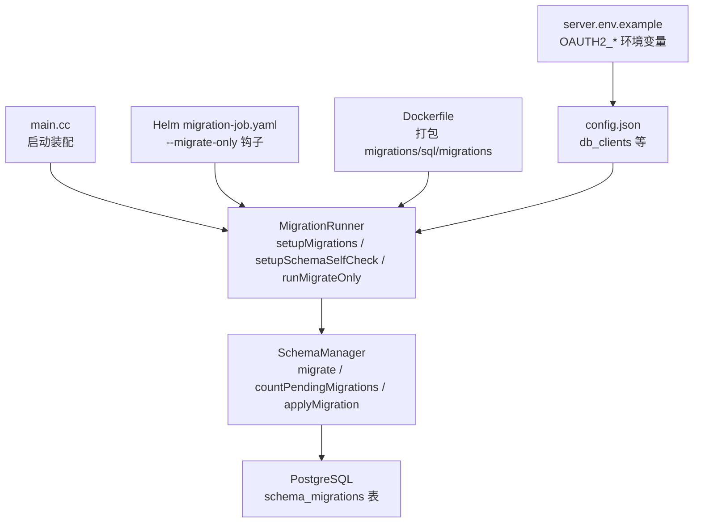
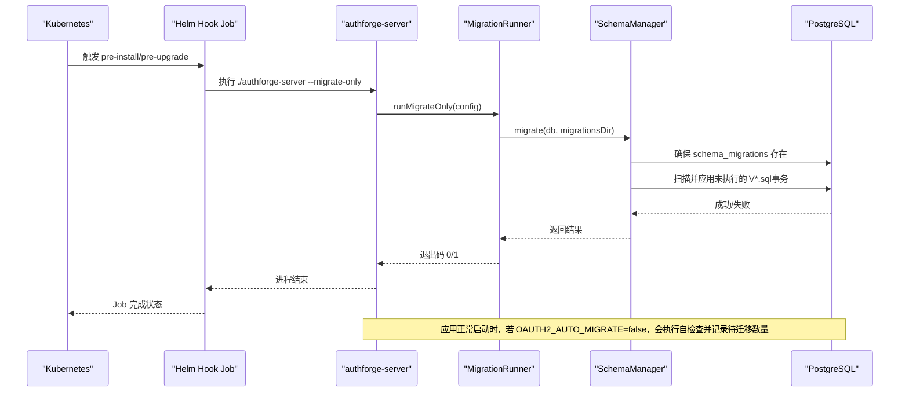
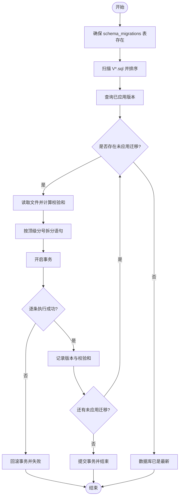
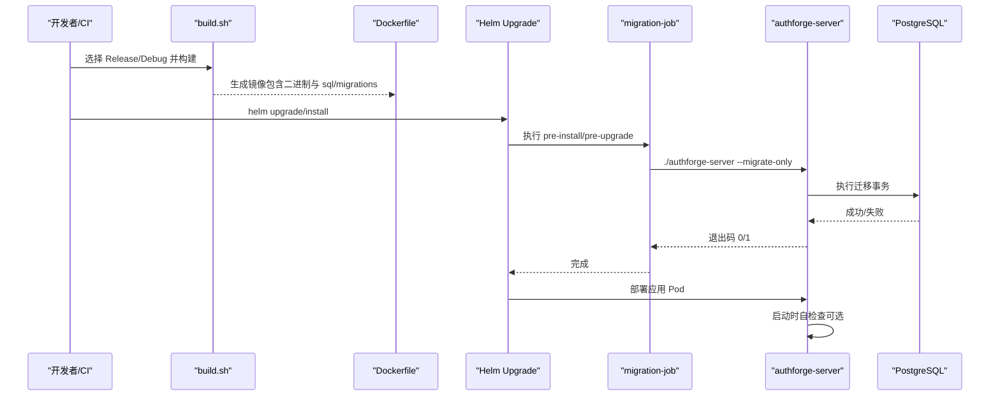
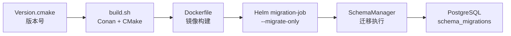

# 升级与迁移

<cite>
**本文引用的文件**
- [apps/server/src/main.cc](file://apps/server/src/main.cc)
- [apps/server/src/bootstrap/MigrationRunner.h](file://apps/server/src/bootstrap/MigrationRunner.h)
- [apps/server/src/bootstrap/MigrationRunner.cc](file://apps/server/src/bootstrap/MigrationRunner.cc)
- [apps/server/src/SchemaManager.h](file://apps/server/src/SchemaManager.h)
- [apps/server/src/SchemaManager.cc](file://apps/server/src/SchemaManager.cc)
- [apps/server/config/config.json](file://apps/server/config/config.json)
- [deploy/env/server.env.example](file://deploy/env/server.env.example)
- [deploy/helm/authforge/templates/migration-job.yaml](file://deploy/helm/authforge/templates/migration-job.yaml)
- [scripts/backend/setup-database.sh](file://scripts/backend/setup-database.sh)
- [scripts/backend/build.sh](file://scripts/backend/build.sh)
- [deploy/docker/Dockerfile](file://deploy/docker/Dockerfile)
- [cmake/Version.cmake](file://cmake/Version.cmake)
- [tools/migration-check/baseline.json](file://tools/migration-check/baseline.json)
</cite>

## 目录
1. [简介](#简介)
2. [项目结构](#项目结构)
3. [核心组件](#核心组件)
4. [架构总览](#架构总览)
5. [详细组件分析](#详细组件分析)
6. [依赖关系分析](#依赖关系分析)
7. [性能考虑](#性能考虑)
8. [故障排查指南](#故障排查指南)
9. [结论](#结论)
10. [附录](#附录)

## 简介
本指南面向生产环境的 AuthForge 升级与迁移，覆盖版本升级流程（依赖更新、编译、数据库迁移、服务重启）、数据库迁移管理（编写、执行、回滚策略）、配置文件升级与环境变量更新、平滑升级策略（蓝绿部署、滚动更新、灰度发布）、数据迁移工具与脚本使用、升级前准备与风险评估、以及升级后验证与性能基准对比。文档严格基于仓库现有实现与配置进行说明，确保可操作且可追溯。

## 项目结构
- 后端二进制入口与启动装配：apps/server/src/main.cc
- 迁移运行器与自检查：apps/server/src/bootstrap/MigrationRunner.*
- 迁移管理器（SQL解析、事务执行、校验和）：apps/server/src/SchemaManager.*
- 默认配置与插件配置：apps/server/config/config.json
- 环境变量模板（覆盖优先级高于配置文件）：deploy/env/server.env.example
- Helm Hook 迁移任务（Kubernetes 预安装/升级钩子）：deploy/helm/authforge/templates/migration-job.yaml
- 本地数据库初始化与种子脚本：scripts/backend/setup-database.sh
- 构建脚本（Conan + CMake Preset）：scripts/backend/build.sh
- 容器镜像构建（后端/前端）：deploy/docker/Dockerfile
- 版本号来源（单一事实源）：cmake/Version.cmake
- 迁移一致性基线（SHA-256）：tools/migration-check/baseline.json

图表来源
- [apps/server/src/main.cc:97-238](file://apps/server/src/main.cc#L97-L238)
- [apps/server/src/bootstrap/MigrationRunner.cc:53-165](file://apps/server/src/bootstrap/MigrationRunner.cc#L53-L165)
- [apps/server/src/SchemaManager.cc:164-233](file://apps/server/src/SchemaManager.cc#L164-L233)
- [deploy/helm/authforge/templates/migration-job.yaml:42-85](file://deploy/helm/authforge/templates/migration-job.yaml#L42-L85)
- [deploy/docker/Dockerfile:64-68](file://deploy/docker/Dockerfile#L64-L68)
- [apps/server/config/config.json:9-27](file://apps/server/config/config.json#L9-L27)
- [deploy/env/server.env.example:22-47](file://deploy/env/server.env.example#L22-L47)

章节来源
- [apps/server/src/main.cc:97-238](file://apps/server/src/main.cc#L97-L238)
- [apps/server/src/bootstrap/MigrationRunner.cc:53-165](file://apps/server/src/bootstrap/MigrationRunner.cc#L53-L165)
- [apps/server/src/SchemaManager.cc:164-233](file://apps/server/src/SchemaManager.cc#L164-L233)
- [deploy/helm/authforge/templates/migration-job.yaml:42-85](file://deploy/helm/authforge/templates/migration-job.yaml#L42-L85)
- [deploy/docker/Dockerfile:64-68](file://deploy/docker/Dockerfile#L64-L68)
- [apps/server/config/config.json:9-27](file://apps/server/config/config.json#L9-L27)
- [deploy/env/server.env.example:22-47](file://deploy/env/server.env.example#L22-L47)

## 核心组件
- 启动装配与参数处理：main.cc 支持 --migrate-only 模式，用于独立执行迁移并退出；正常模式加载配置、注册控制器、设置横切关注点、启动服务。
- 迁移运行器：MigrationRunner 提供三种能力
  - setupMigrations：根据 OAUTH2_AUTO_MIGRATE 决定是否在应用启动时自动迁移（线程内延迟执行），失败则终止进程以避免半迁移状态对外提供服务。
  - setupSchemaSelfCheck：当自动迁移关闭时，启动后自检未应用的迁移数量并记录日志，不终止进程以支持滚动升级窗口。
  - runMigrateOnly：使用独立 DbClient 同步执行所有待迁移，返回进程退出码供编排系统判断。
- 迁移管理器：SchemaManager 负责
  - 扫描 V{NNN}__*.sql 文件并按版本号排序
  - 创建 schema_migrations 跟踪表
  - 读取已应用版本，过滤未应用迁移
  - 将每个迁移 SQL 按顶级分号拆分并在事务中逐条执行，成功后记录版本与校验和
  - 提供 pending 计数接口用于自检查
- Helm 迁移 Job：通过 pre-install/pre-upgrade 钩子执行 authforge-server --migrate-only，具备独立的 ConfigMap/Secret 副本与删除策略，便于审计与回滚。
- 构建与打包：build.sh 统一通过 Conan + CMake Preset 构建；Dockerfile 将二进制、配置文件、views、migrations、seed 打包进镜像。

章节来源
- [apps/server/src/main.cc:97-238](file://apps/server/src/main.cc#L97-L238)
- [apps/server/src/bootstrap/MigrationRunner.h:23-43](file://apps/server/src/bootstrap/MigrationRunner.h#L23-L43)
- [apps/server/src/bootstrap/MigrationRunner.cc:53-165](file://apps/server/src/bootstrap/MigrationRunner.cc#L53-L165)
- [apps/server/src/SchemaManager.h:10-62](file://apps/server/src/SchemaManager.h#L10-L62)
- [apps/server/src/SchemaManager.cc:164-233](file://apps/server/src/SchemaManager.cc#L164-L233)
- [deploy/helm/authforge/templates/migration-job.yaml:1-12](file://deploy/helm/authforge/templates/migration-job.yaml#L1-L12)
- [scripts/backend/build.sh:1-168](file://scripts/backend/build.sh#L1-L168)
- [deploy/docker/Dockerfile:48-71](file://deploy/docker/Dockerfile#L48-L71)

## 架构总览
下图展示从 Helm 钩子到数据库迁移的完整调用链，以及应用启动时的自检查机制。

图表来源
- [deploy/helm/authforge/templates/migration-job.yaml:42-85](file://deploy/helm/authforge/templates/migration-job.yaml#L42-L85)
- [apps/server/src/main.cc:97-135](file://apps/server/src/main.cc#L97-L135)
- [apps/server/src/bootstrap/MigrationRunner.cc:130-165](file://apps/server/src/bootstrap/MigrationRunner.cc#L130-L165)
- [apps/server/src/SchemaManager.cc:164-233](file://apps/server/src/SchemaManager.cc#L164-L233)

## 详细组件分析

### 数据库迁移管理
- 迁移文件命名规范：V{NNN}__description.sql，按版本号升序执行。
- 执行流程要点
  - 确保 schema_migrations 表存在
  - 扫描磁盘迁移文件并去重已应用版本
  - 对每个迁移文件：读取内容、计算 SHA-256 校验和、按顶级分号拆分语句、在事务中逐条执行、成功后写入版本与校验和
  - 任一语句失败则整个迁移回滚且不记录版本
- 自检查与自动迁移
  - 自动迁移：OAUTH2_AUTO_MIGRATE=true 时，应用启动后在独立线程延迟执行迁移，失败则终止进程
  - 自检查：OAUTH2_AUTO_MIGRATE=false 时，启动后统计待迁移数量并记录 ERROR/WARN/INFO，不终止进程以支持滚动升级窗口
- 回滚策略
  - 设计为“仅向前”迁移（forward-only），不在 SchemaManager 中实现 DOWN 逻辑
  - Helm 注释明确：主版本内迁移保持向前兼容，helm rollback 仅回滚应用版本，无需降级 schema
  - 如需回滚业务数据，应通过额外脚本或工具在迁移之外单独处理

图表来源
- [apps/server/src/SchemaManager.cc:164-233](file://apps/server/src/SchemaManager.cc#L164-L233)
- [apps/server/src/SchemaManager.cc:274-293](file://apps/server/src/SchemaManager.cc#L274-L293)
- [apps/server/src/SchemaManager.cc:295-333](file://apps/server/src/SchemaManager.cc#L295-L333)
- [apps/server/src/SchemaManager.cc:335-351](file://apps/server/src/SchemaManager.cc#L335-L351)
- [apps/server/src/SchemaManager.cc:353-411](file://apps/server/src/SchemaManager.cc#L353-L411)

章节来源
- [apps/server/src/SchemaManager.cc:164-233](file://apps/server/src/SchemaManager.cc#L164-L233)
- [apps/server/src/SchemaManager.cc:274-293](file://apps/server/src/SchemaManager.cc#L274-L293)
- [apps/server/src/SchemaManager.cc:295-333](file://apps/server/src/SchemaManager.cc#L295-L333)
- [apps/server/src/SchemaManager.cc:335-351](file://apps/server/src/SchemaManager.cc#L335-L351)
- [apps/server/src/SchemaManager.cc:353-411](file://apps/server/src/SchemaManager.cc#L353-L411)
- [deploy/helm/authforge/templates/migration-job.yaml:1-12](file://deploy/helm/authforge/templates/migration-job.yaml#L1-L12)

### 版本升级流程（依赖更新、编译、迁移、重启）
- 依赖更新
  - 后端依赖由 Conan 管理，构建脚本会检测并安装缺失依赖；CMake 通过 Preset 管理构建配置
  - 容器构建复用 build.sh 流程，确保与 CI/主机一致
- 编译
  - 使用 scripts/backend/build.sh 指定构建类型（Release/Debug）与可选 Sanitizer
  - 产物位于 build/<preset>/apps/server/authforge-server
- 数据库迁移
  - Kubernetes：Helm pre-install/pre-upgrade 钩子 Job 执行 --migrate-only
  - 本地开发：scripts/backend/setup-database.sh 可创建库并顺序执行 V*.sql 与 seed
  - 应用内自动迁移：设置 OAUTH2_AUTO_MIGRATE=true 可在启动时执行（生产建议关闭）
- 服务重启
  - 迁移完成后，Helm 继续部署应用 Pod；应用启动时若 OAUTH2_AUTO_MIGRATE=false，将执行自检查并报告待迁移数量

图表来源
- [scripts/backend/build.sh:1-168](file://scripts/backend/build.sh#L1-L168)
- [deploy/docker/Dockerfile:48-71](file://deploy/docker/Dockerfile#L48-L71)
- [deploy/helm/authforge/templates/migration-job.yaml:42-85](file://deploy/helm/authforge/templates/migration-job.yaml#L42-L85)
- [apps/server/src/bootstrap/MigrationRunner.cc:130-165](file://apps/server/src/bootstrap/MigrationRunner.cc#L130-L165)

章节来源
- [scripts/backend/build.sh:1-168](file://scripts/backend/build.sh#L1-L168)
- [deploy/docker/Dockerfile:48-71](file://deploy/docker/Dockerfile#L48-L71)
- [deploy/helm/authforge/templates/migration-job.yaml:42-85](file://deploy/helm/authforge/templates/migration-job.yaml#L42-L85)
- [apps/server/src/bootstrap/MigrationRunner.cc:130-165](file://apps/server/src/bootstrap/MigrationRunner.cc#L130-L165)

### 配置文件升级与环境变量更新
- 配置文件位置与覆盖规则
  - 默认 config.json 路径在主程序启动时探测多个相对路径
  - 环境变量优先级高于配置文件：server.env.example 中的 OAUTH2_* 变量会覆盖对应配置项
- 关键配置项
  - db_clients：数据库连接信息（host/port/dbname/user/passwd）
  - redis_clients：Redis 连接信息
  - app.log.log_path：日志目录，启动时会尝试创建
  - plugins.OAuth2Plugin：存储类型、客户端、令牌 TTL 等
- 环境变量示例
  - OAUTH2_DB_HOST/OAUTH2_DB_PORT/OAUTH2_DB_NAME/OAUTH2_DB_USER/OAUTH2_DB_PASSWORD
  - OAUTH2_REDIS_HOST/OAUTH2_REDIS_PORT/OAUTH2_REDIS_PASSWORD
  - OAUTH2_LISTEN_PORT、OAUTH2_FRONTEND_URL、OAUTH2_CORS_ALLOW_ORIGINS
  - OAUTH2_AUTO_MIGRATE：控制是否自动迁移（生产建议 false）
- 向后兼容性
  - 迁移为仅向前，主版本内向前兼容；新增配置项需保证旧版本仍可启动（通过默认值或条件分支）

章节来源
- [apps/server/config/config.json:9-27](file://apps/server/config/config.json#L9-L27)
- [apps/server/config/config.json:102-132](file://apps/server/config/config.json#L102-L132)
- [apps/server/config/config.json:133-171](file://apps/server/config/config.json#L133-L171)
- [deploy/env/server.env.example:22-47](file://deploy/env/server.env.example#L22-L47)
- [apps/server/src/main.cc:118-132](file://apps/server/src/main.cc#L118-L132)

### 平滑升级策略
- 滚动更新
  - 推荐在生产环境关闭 OAUTH2_AUTO_MIGRATE，使用 Helm pre-install/pre-upgrade Job 先行执行迁移
  - 应用启动时执行自检查，若发现待迁移，记录 ERROR 提示运维执行迁移 Job
- 蓝绿部署
  - 部署新版本前，先通过 Job 在新环境执行迁移；确认通过后切换流量至新环境
  - 由于迁移仅向前，旧版本 Pod 可安全观察新 schema 状态
- 灰度发布
  - 逐步放量新 Pod，配合健康检查与错误日志监控；若出现 schema 不一致告警，立即暂停放量并回滚
- Helm 钩子与资源隔离
  - migration-job 拥有独立的 ConfigMap/Secret 副本，hook-delete-policy=before-hook-creation 保留最近一次运行以便审计

章节来源
- [apps/server/src/bootstrap/MigrationRunner.cc:65-92](file://apps/server/src/bootstrap/MigrationRunner.cc#L65-L92)
- [apps/server/src/bootstrap/MigrationRunner.cc:95-127](file://apps/server/src/bootstrap/MigrationRunner.cc#L95-L127)
- [deploy/helm/authforge/templates/migration-job.yaml:1-12](file://deploy/helm/authforge/templates/migration-job.yaml#L1-L12)
- [deploy/helm/authforge/templates/migration-job.yaml:42-85](file://deploy/helm/authforge/templates/migration-job.yaml#L42-L85)

### 数据迁移工具与脚本
- Helm Job（推荐生产）
  - 命令：./authforge-server --migrate-only
  - 行为：同步执行所有待迁移，返回退出码 0/1，供编排系统判定
- 本地脚本
  - scripts/backend/setup-database.sh：创建数据库、顺序执行 V*.sql 与 seed 数据
  - 注意：该脚本直接 psql 执行，不包含事务包装；生产建议使用迁移管理器或 Job
- 迁移一致性检查
  - tools/migration-check/baseline.json：维护各迁移文件的 SHA-256 基线，用于离线校验迁移一致性

章节来源
- [deploy/helm/authforge/templates/migration-job.yaml:42-85](file://deploy/helm/authforge/templates/migration-job.yaml#L42-L85)
- [scripts/backend/setup-database.sh:1-66](file://scripts/backend/setup-database.sh#L1-L66)
- [tools/migration-check/baseline.json:1-15](file://tools/migration-check/baseline.json#L1-L15)

### 升级前准备、风险评估与回滚预案
- 升级前准备
  - 备份数据库与密钥（如 JWT 私钥）
  - 确认 Helm Chart 版本与 values 变更
  - 在预发环境执行完整迁移与冒烟测试
- 风险评估
  - 迁移失败：Job 返回非零退出码，Pod 不会启动；检查日志定位失败语句
  - 滚动升级期间 schema 不一致：自检查会记录 ERROR，但不终止进程
  - 性能退化：结合 Prometheus 指标与健康检查评估
- 回滚预案
  - 应用回滚：helm rollback 仅回滚应用版本，不需要 schema 降级（主版本内向前兼容）
  - 数据回滚：需通过额外脚本或工具单独处理（迁移管理器不支持 DOWN）

章节来源
- [deploy/helm/authforge/templates/migration-job.yaml:1-12](file://deploy/helm/authforge/templates/migration-job.yaml#L1-L12)
- [apps/server/src/bootstrap/MigrationRunner.cc:95-127](file://apps/server/src/bootstrap/MigrationRunner.cc#L95-L127)
- [apps/server/src/bootstrap/MigrationRunner.cc:130-165](file://apps/server/src/bootstrap/MigrationRunner.cc#L130-L165)

### 升级后验证测试与性能基准对比
- 健康检查
  - 访问 /health 与 /health/ready，确认服务就绪
  - 检查响应字段不包含敏感信息
- 功能验证
  - 授权流程、令牌获取、用户管理等关键端点
- 性能基准
  - 使用内置或外部压测工具对比升级前后 P95/P99 延迟与吞吐
  - 关注数据库与 Redis 指标，避免成为瓶颈
  - 冷启动场景可分别测量含/不含 --migrate-only 预跑的情况

章节来源
- [tests/e2e-backend/oauth2_flows/FunctionalTest.cc:223-255](file://tests/e2e-backend/oauth2_flows/FunctionalTest.cc#L223-L255)
- [docs/productization-evolution/benchmark-facility-design.md:383-397](file://docs/productization-evolution/benchmark-facility-design.md#L383-L397)

## 依赖关系分析
- 构建依赖
  - Conan：管理 C/C++ 依赖（Drogon、OpenSSL、libpq、hiredis 等）
  - CMake Preset：统一构建配置与输出目录
- 运行时依赖
  - PostgreSQL：存储与迁移
  - Redis：缓存与会话（可选）
  - TLS 根证书：出站 HTTPS（SMTP、社交登录）
- 版本管理
  - cmake/Version.cmake：单一事实源的主次补丁版本

图表来源
- [cmake/Version.cmake:1-14](file://cmake/Version.cmake#L1-L14)
- [scripts/backend/build.sh:1-168](file://scripts/backend/build.sh#L1-L168)
- [deploy/docker/Dockerfile:48-71](file://deploy/docker/Dockerfile#L48-L71)
- [deploy/helm/authforge/templates/migration-job.yaml:42-85](file://deploy/helm/authforge/templates/migration-job.yaml#L42-L85)
- [apps/server/src/SchemaManager.cc:164-233](file://apps/server/src/SchemaManager.cc#L164-L233)

章节来源
- [cmake/Version.cmake:1-14](file://cmake/Version.cmake#L1-L14)
- [scripts/backend/build.sh:1-168](file://scripts/backend/build.sh#L1-L168)
- [deploy/docker/Dockerfile:48-71](file://deploy/docker/Dockerfile#L48-L71)
- [deploy/helm/authforge/templates/migration-job.yaml:42-85](file://deploy/helm/authforge/templates/migration-job.yaml#L42-L85)
- [apps/server/src/SchemaManager.cc:164-233](file://apps/server/src/SchemaManager.cc#L164-L233)

## 性能考虑
- 迁移执行
  - 迁移在事务中执行，单迁移失败即回滚，避免部分应用导致的不一致
  - 大迁移建议分批拆分 SQL，减少锁持有时间
- 启动自检查
  - 自检查在独立线程延迟执行，避免阻塞事件循环
- 资源限制
  - Helm Job 可通过 activeDeadlineSeconds 与 backoffLimit 控制超时与重试
- 监控与指标
  - 启用 Prometheus 导出器，监控健康检查与错误率
  - 关注数据库连接池与慢查询

[本节为通用指导，不直接分析具体文件]

## 故障排查指南
- 迁移失败
  - 检查 Helm Job 日志，定位失败的迁移文件与语句
  - 确认数据库连接信息与权限正确
- 自检查告警
  - 若 OAUTH2_AUTO_MIGRATE=false 且存在待迁移，应用会记录 ERROR；请执行迁移 Job
- 自动迁移失败
  - 若 OAUTH2_AUTO_MIGRATE=true 且迁移失败，进程会终止；检查日志并修复后重新部署
- 配置问题
  - 确认 config.json 与 server.env.example 的环境变量一致
  - 检查日志目录是否存在与可写

章节来源
- [apps/server/src/bootstrap/MigrationRunner.cc:65-92](file://apps/server/src/bootstrap/MigrationRunner.cc#L65-L92)
- [apps/server/src/bootstrap/MigrationRunner.cc:95-127](file://apps/server/src/bootstrap/MigrationRunner.cc#L95-L127)
- [apps/server/src/bootstrap/MigrationRunner.cc:130-165](file://apps/server/src/bootstrap/MigrationRunner.cc#L130-L165)
- [apps/server/config/config.json:102-132](file://apps/server/config/config.json#L102-L132)

## 结论
AuthForge 的升级与迁移体系围绕“仅向前迁移”与“前置迁移 Job”展开，确保生产环境的安全性与可观测性。通过 Helm 钩子、应用自检查与完善的日志/指标，可实现滚动、蓝绿与灰度等多种平滑升级策略。建议在生产环境关闭自动迁移，使用 Job 执行迁移并配合健康检查与性能基准验证，保障升级过程稳定可控。

[本节为总结，不直接分析具体文件]

## 附录
- 常用命令参考
  - 本地数据库初始化：scripts/backend/setup-database.sh
  - 构建后端：scripts/backend/build.sh
  - 执行迁移（Kubernetes）：Helm pre-install/pre-upgrade Job
  - 应用启动参数：--migrate-only（仅迁移并退出）
- 版本与变更
  - 版本号来源：cmake/Version.cmake
  - 变更日志生成：cliff.toml（用于 release 流程）

章节来源
- [scripts/backend/setup-database.sh:1-66](file://scripts/backend/setup-database.sh#L1-L66)
- [scripts/backend/build.sh:1-168](file://scripts/backend/build.sh#L1-L168)
- [cmake/Version.cmake:1-14](file://cmake/Version.cmake#L1-L14)