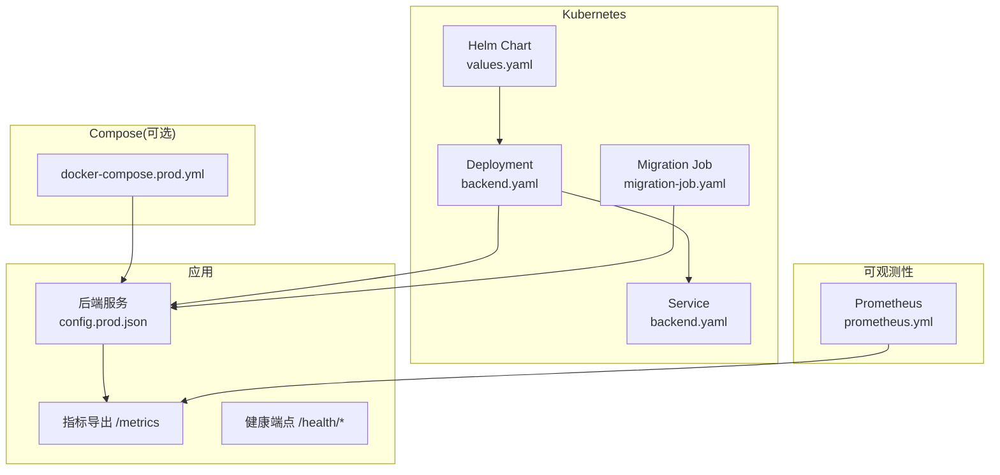
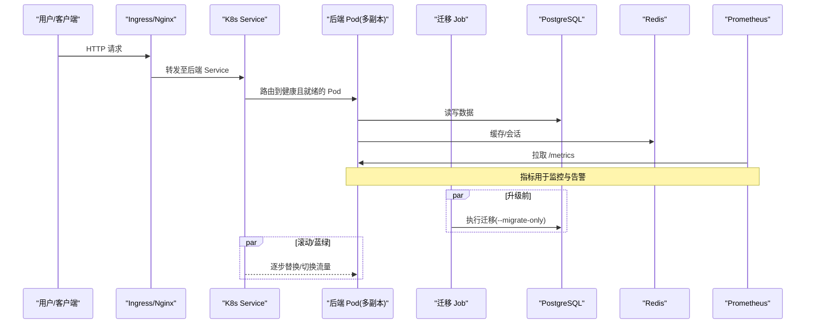
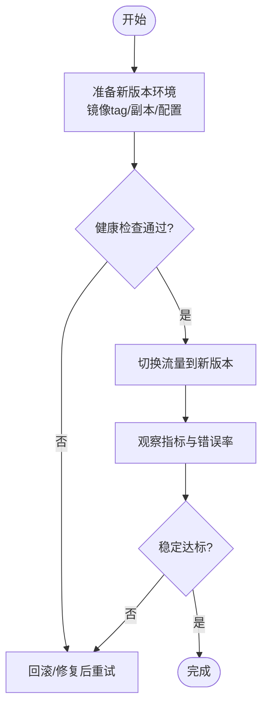
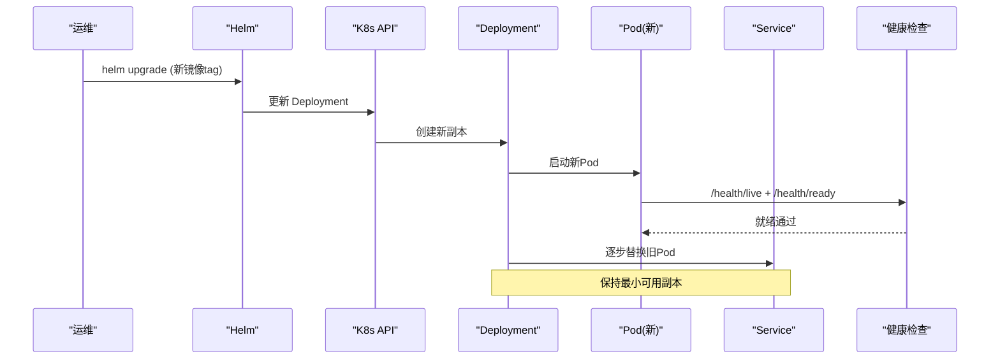
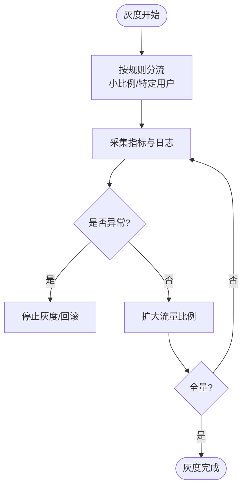
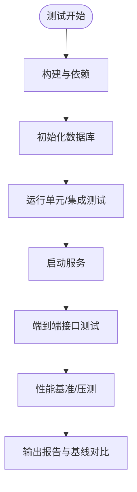
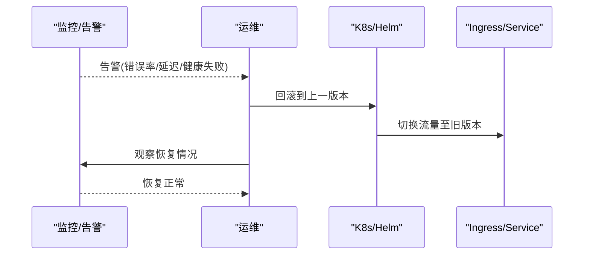
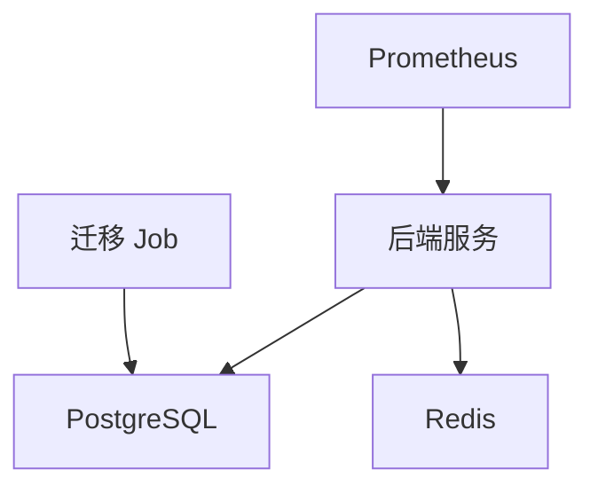

# 平滑升级策略

<cite>
**本文引用的文件**
- [backend.yaml](file://deploy/helm/authforge/templates/backend.yaml)
- [values.yaml](file://deploy/helm/authforge/values.yaml)
- [migration-job.yaml](file://deploy/helm/authforge/templates/migration-job.yaml)
- [docker-compose.prod.yml](file://deploy/docker/docker-compose.prod.yml)
- [config.prod.json](file://apps/server/config/config.prod.json)
- [prometheus.yml](file://deploy/observability/prometheus.yml)
- [HealthEndpointHttpTest.cc](file://tests/integration/controllers/HealthEndpointHttpTest.cc)
- [SessionController.cc](file://libs/drogon/src/controllers/SessionController.cc)
- [observability.md](file://docs/backend/observability.md)
- [DrogonMetrics.h](file://libs/drogon/include/authforge/drogon/adapters/DrogonMetrics.h)
- [full-test.sh](file://scripts/backend/full-test.sh)
</cite>

## 目录
1. [简介](#简介)
2. [项目结构](#项目结构)
3. [核心组件](#核心组件)
4. [架构总览](#架构总览)
5. [详细组件分析](#详细组件分析)
6. [依赖关系分析](#依赖关系分析)
7. [性能考量](#性能考量)
8. [故障排查指南](#故障排查指南)
9. [结论](#结论)
10. [附录](#附录)

## 简介
本指南面向生产环境，提供针对 AuthForge 的平滑升级策略与最佳实践，覆盖蓝绿部署、滚动更新、灰度发布、监控告警、验证测试与回滚流程。内容基于仓库中的 Helm Chart、Docker Compose、服务端配置、健康检查与可观测性实现，确保在不中断服务的前提下完成版本迭代与风险可控的回滚。

## 项目结构
与平滑升级直接相关的工程要素包括：
- 容器编排与发布：Helm Chart（Deployment、Service、Job）与 Docker Compose 生产编排
- 应用健康探针：/health/live、/health/ready 端点及集成测试
- 数据库迁移：Helm Hook Job 执行一次性迁移，支持前向兼容
- 可观测性：Prometheus Exporter、指标定义与抓取配置
- 配置与环境：生产配置、环境变量注入、密钥管理

图表来源
- [backend.yaml:1-114](file://deploy/helm/authforge/templates/backend.yaml#L1-L114)
- [values.yaml:1-145](file://deploy/helm/authforge/values.yaml#L1-L145)
- [migration-job.yaml:1-85](file://deploy/helm/authforge/templates/migration-job.yaml#L1-L85)
- [docker-compose.prod.yml:1-221](file://deploy/docker/docker-compose.prod.yml#L1-L221)
- [config.prod.json:1-265](file://apps/server/config/config.prod.json#L1-L265)
- [prometheus.yml:1-8](file://deploy/observability/prometheus.yml#L1-L8)

章节来源
- [backend.yaml:1-114](file://deploy/helm/authforge/templates/backend.yaml#L1-L114)
- [values.yaml:1-145](file://deploy/helm/authforge/values.yaml#L1-L145)
- [docker-compose.prod.yml:1-221](file://deploy/docker/docker-compose.prod.yml#L1-L221)
- [config.prod.json:1-265](file://apps/server/config/config.prod.json#L1-L265)
- [prometheus.yml:1-8](file://deploy/observability/prometheus.yml#L1-L8)

## 核心组件
- 健康检查与就绪探针
  - livenessProbe 指向 /health/live，readinessProbe 指向 /health/ready，用于滚动/蓝绿切换时的流量控制与自动恢复。
  - 集成测试覆盖了 /health 与 /health/ready 的行为分支（内存模式/数据库可用或不可用）。
- 数据库迁移
  - 通过 Helm Hook Job 在升级前执行一次迁移，使用 --migrate-only 参数；迁移为前向兼容，无需降级。
- 可观测性
  - 启用 Prometheus Exporter，暴露 /metrics；Prometheus 抓取目标为后端服务端口。
- 配置与密钥
  - 生产配置集中管理，敏感信息通过 Secret 注入；镜像标签与副本数由 values 控制。

章节来源
- [backend.yaml:42-59](file://deploy/helm/authforge/templates/backend.yaml#L42-L59)
- [HealthEndpointHttpTest.cc:1-93](file://tests/integration/controllers/HealthEndpointHttpTest.cc#L1-L93)
- [migration-job.yaml:1-85](file://deploy/helm/authforge/templates/migration-job.yaml#L1-L85)
- [config.prod.json:133-140](file://apps/server/config/config.prod.json#L133-L140)
- [prometheus.yml:1-8](file://deploy/observability/prometheus.yml#L1-L8)

## 架构总览
下图展示了从入口到后端、迁移任务与监控的整体交互，支撑滚动/蓝绿/灰度等升级策略。

图表来源
- [backend.yaml:1-114](file://deploy/helm/authforge/templates/backend.yaml#L1-L114)
- [migration-job.yaml:1-85](file://deploy/helm/authforge/templates/migration-job.yaml#L1-L85)
- [docker-compose.prod.yml:13-139](file://deploy/docker/docker-compose.prod.yml#L13-L139)
- [prometheus.yml:1-8](file://deploy/observability/prometheus.yml#L1-L8)

## 详细组件分析

### 蓝绿部署方案
- 环境准备
  - 使用 Helm values 控制镜像 tag、副本数、资源限制；通过 ConfigMap/Secret 注入配置与密钥。
  - 若使用 Ingress，可通过域名或路径将流量分别导向两个并行的 Release（新旧两套 Service）。
- 流量切换
  - 蓝绿切换通过修改 Ingress 或 Service 选择器，将流量从旧版本切到新版本的 Service。
  - 切换前确认新环境健康：/health/live 返回 200，/health/ready 返回 200 且数据库/Redis 连通。
- 回滚策略
  - 立即切回旧版本 Service 或 Ingress 规则；由于迁移前向兼容，无需回滚数据库。
  - 若使用 Helm，可直接回滚到上一个 Release 版本。

图表来源
- [backend.yaml:42-59](file://deploy/helm/authforge/templates/backend.yaml#L42-L59)
- [values.yaml:18-54](file://deploy/helm/authforge/values.yaml#L18-L54)
- [HealthEndpointHttpTest.cc:60-93](file://tests/integration/controllers/HealthEndpointHttpTest.cc#L60-L93)

章节来源
- [backend.yaml:1-114](file://deploy/helm/authforge/templates/backend.yaml#L1-L114)
- [values.yaml:1-145](file://deploy/helm/authforge/values.yaml#L1-L145)
- [HealthEndpointHttpTest.cc:1-93](file://tests/integration/controllers/HealthEndpointHttpTest.cc#L1-L93)

### 滚动更新实现
- 容器编排
  - Deployment 中设置 replicas 与探针；K8s 默认按策略逐步替换 Pod，保证最小可用实例数。
  - 通过 checksum 注解在配置变更时触发滚动重启。
- 健康检查
  - livenessProbe 检测进程存活；readinessProbe 检测业务就绪（含 DB/Redis 连通性）。
- 版本管理
  - 通过镜像 tag 区分版本；Helm values 集中管理；迁移在升级前以 Job 形式执行。

图表来源
- [backend.yaml:1-114](file://deploy/helm/authforge/templates/backend.yaml#L1-L114)
- [migration-job.yaml:42-85](file://deploy/helm/authforge/templates/migration-job.yaml#L42-L85)

章节来源
- [backend.yaml:1-114](file://deploy/helm/authforge/templates/backend.yaml#L1-L114)
- [migration-job.yaml:1-85](file://deploy/helm/authforge/templates/migration-job.yaml#L1-L85)

### 灰度发布方法
- 流量比例控制
  - 通过 Ingress 权重或多 Service 分流，将少量流量导入新版本；或使用 Service 权重（如 Istio/网关能力）。
- 用户分片
  - 基于用户 ID、租户或地域进行分片，使特定群体访问新版本。
- 效果监控
  - 利用 /metrics 指标与日志，对比新旧版本 QPS、错误率、延迟分布；结合告警阈值快速决策。

图表来源
- [prometheus.yml:1-8](file://deploy/observability/prometheus.yml#L1-L8)
- [config.prod.json:133-140](file://apps/server/config/config.prod.json#L133-L140)

章节来源
- [prometheus.yml:1-8](file://deploy/observability/prometheus.yml#L1-L8)
- [config.prod.json:133-140](file://apps/server/config/config.prod.json#L133-L140)

### 升级过程中的监控指标与告警配置
- 关键指标
  - 请求总量、登录失败次数、Token 操作计数、延迟直方图、活跃 Token 数量等。
  - 指标通过 Exporter 暴露于 /metrics，Prometheus 定期抓取。
- 告警建议
  - 错误率突增、P99 延迟升高、健康端点失败、迁移失败、数据库连接失败等。
  - 结合 Grafana 面板与 Alertmanager 规则进行通知。

图表来源
- [config.prod.json:133-140](file://apps/server/config/config.prod.json#L133-L140)
- [prometheus.yml:1-8](file://deploy/observability/prometheus.yml#L1-L8)
- [observability.md:1-100](file://docs/backend/observability.md#L1-L100)

章节来源
- [observability.md:1-100](file://docs/backend/observability.md#L1-L100)
- [prometheus.yml:1-8](file://deploy/observability/prometheus.yml#L1-L8)
- [config.prod.json:133-140](file://apps/server/config/config.prod.json#L133-L140)

### 升级验证测试方法与性能基准对比
- 功能验证
  - 运行完整测试脚本：构建、初始化数据库、生成模型、运行单元测试、启动服务、调用 OAuth2 与管理端点测试。
  - 健康端点集成测试覆盖 /health 与 /health/ready 的多分支行为。
- 性能基准
  - 使用内置基准工具与压测场景，关注吞吐、延迟、缓存命中率与数据库操作耗时。
  - 记录环境元数据（Git SHA、镜像 tag、PG/Redis 版本、规格），多次运行取中位数评估稳定性。

图表来源
- [full-test.sh:1-157](file://scripts/backend/full-test.sh#L1-L157)
- [HealthEndpointHttpTest.cc:1-93](file://tests/integration/controllers/HealthEndpointHttpTest.cc#L1-L93)

章节来源
- [full-test.sh:1-157](file://scripts/backend/full-test.sh#L1-L157)
- [HealthEndpointHttpTest.cc:1-93](file://tests/integration/controllers/HealthEndpointHttpTest.cc#L1-L93)

### 故障恢复与紧急回滚流程
- 故障识别
  - 健康端点失败、指标异常（错误率/延迟飙升）、迁移失败、数据库/Redis 不可用。
- 恢复步骤
  - 暂停滚动/灰度，回滚到上一稳定版本（Helm rollback 或 Ingress/Service 切回旧版）。
  - 检查迁移 Job 日志与数据库状态；必要时重新执行迁移。
  - 根据告警定位根因，修复后再次灰度。
- 预防与加固
  - 迁移前向兼容；升级前执行预检（健康检查、依赖连通性）；保留最近若干版本以便快速回滚。

图表来源
- [migration-job.yaml:1-85](file://deploy/helm/authforge/templates/migration-job.yaml#L1-L85)
- [backend.yaml:1-114](file://deploy/helm/authforge/templates/backend.yaml#L1-L114)
- [prometheus.yml:1-8](file://deploy/observability/prometheus.yml#L1-L8)

章节来源
- [migration-job.yaml:1-85](file://deploy/helm/authforge/templates/migration-job.yaml#L1-L85)
- [backend.yaml:1-114](file://deploy/helm/authforge/templates/backend.yaml#L1-L114)
- [prometheus.yml:1-8](file://deploy/observability/prometheus.yml#L1-L8)

## 依赖关系分析
- 组件耦合
  - 后端服务依赖 PostgreSQL 与 Redis；健康端点会探测这些依赖。
  - 迁移 Job 依赖数据库；应用启动仅做自检查，不自动迁移。
  - Prometheus 依赖后端 /metrics 端点。
- 外部依赖
  - 镜像仓库、密钥管理、Ingress/Gateway。
- 潜在循环依赖
  - 无直接代码级循环；编排层面通过 depends_on 与探针解耦。

图表来源
- [docker-compose.prod.yml:74-139](file://deploy/docker/docker-compose.prod.yml#L74-L139)
- [migration-job.yaml:42-85](file://deploy/helm/authforge/templates/migration-job.yaml#L42-L85)
- [prometheus.yml:1-8](file://deploy/observability/prometheus.yml#L1-L8)

章节来源
- [docker-compose.prod.yml:74-139](file://deploy/docker/docker-compose.prod.yml#L74-L139)
- [migration-job.yaml:1-85](file://deploy/helm/authforge/templates/migration-job.yaml#L1-L85)
- [prometheus.yml:1-8](file://deploy/observability/prometheus.yml#L1-L8)

## 性能考量
- 容量规划
  - 根据 values 中的资源 requests/limits 调整副本与资源配额，避免资源争用。
- 缓存与限流
  - 合理配置 Redis 缓存与限流插件，保护热点接口。
- 延迟与吞吐
  - 通过 /metrics 的延迟直方图与 QPS 指标评估瓶颈；优化慢查询与缓存命中率。
- 冷/热启动
  - 预热缓存与连接池；迁移前置以减少冷启动影响。

[本节为通用指导，不直接分析具体文件]

## 故障排查指南
- 健康端点
  - /health/live 应始终 200；/health/ready 在依赖不可用时返回非 200 或包含 not_configured 状态。
- 指标与日志
  - 查看 /metrics 的错误计数与延迟分布；结合结构化日志定位问题。
- 迁移失败
  - 检查迁移 Job 日志；确认数据库连通性与权限；必要时重新执行迁移。
- 常见问题
  - 数据库/Redis 不可用、密钥缺失、镜像拉取失败、Ingress 路由错误。

章节来源
- [HealthEndpointHttpTest.cc:1-93](file://tests/integration/controllers/HealthEndpointHttpTest.cc#L1-L93)
- [observability.md:1-100](file://docs/backend/observability.md#L1-L100)
- [migration-job.yaml:1-85](file://deploy/helm/authforge/templates/migration-job.yaml#L1-L85)

## 结论
AuthForge 提供了完善的平滑升级基础能力：基于健康探针的滚动/蓝绿切换、前向兼容的迁移机制、完整的可观测性与验证测试。遵循本指南可在生产环境中安全、可控地完成版本迭代，并在异常情况下快速回滚，保障服务连续性与用户体验。

## 附录
- 常用命令参考
  - Helm 升级与回滚：helm upgrade / helm rollback
  - Compose 迁移：docker compose --profile migrate run --rm migrate
  - 健康检查：curl http://host:port/health/live 与 /health/ready
- 相关实现位置
  - 健康端点注册与示例：见 SessionController.cc 中对 /health 的文档化
  - 指标适配器：见 DrogonMetrics.h 定义的指标接口

章节来源
- [SessionController.cc:102-120](file://libs/drogon/src/controllers/SessionController.cc#L102-L120)
- [DrogonMetrics.h:29-52](file://libs/drogon/include/authforge/drogon/adapters/DrogonMetrics.h#L29-L52)