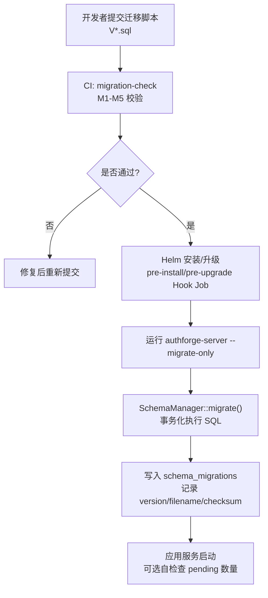
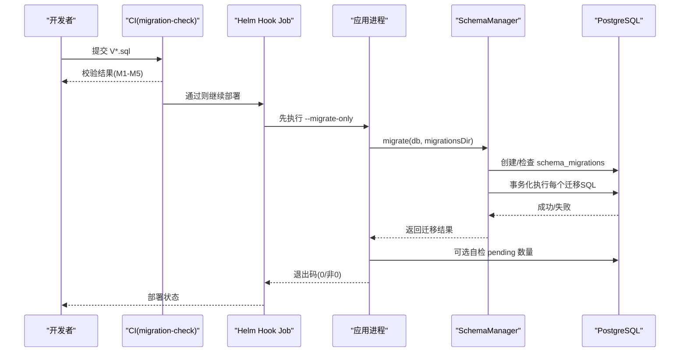
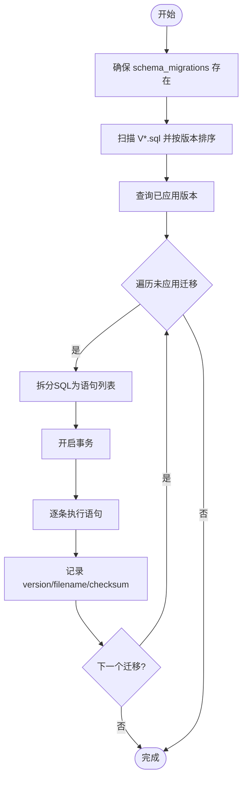
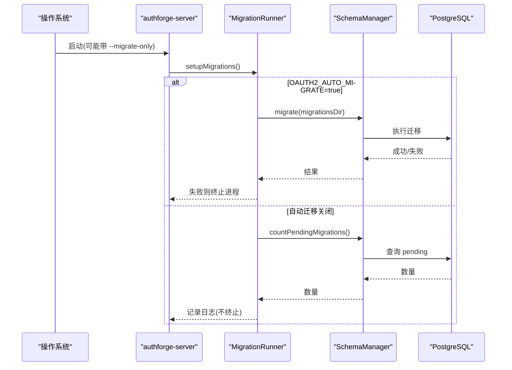
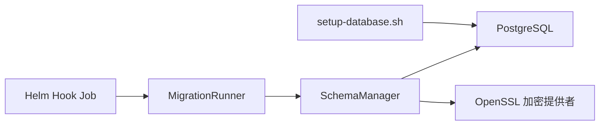

# 数据库迁移管理

<cite>
**本文引用的文件**
- [apps/server/src/bootstrap/MigrationRunner.cc](file://apps/server/src/bootstrap/MigrationRunner.cc)
- [apps/server/src/bootstrap/MigrationRunner.h](file://apps/server/src/bootstrap/MigrationRunner.h)
- [apps/server/src/SchemaManager.cc](file://apps/server/src/SchemaManager.cc)
- [apps/server/src/SchemaManager.h](file://apps/server/src/SchemaManager.h)
- [apps/server/migrations/V001__schema_migrations.sql](file://apps/server/migrations/V001__schema_migrations.sql)
- [apps/server/migrations/V002__oauth2_core.sql](file://apps/server/migrations/V002__oauth2_core.sql)
- [tools/migration-check/migration_check.py](file://tools/migration-check/migration_check.py)
- [deploy/helm/authforge/templates/migration-job.yaml](file://deploy/helm/authforge/templates/migration-job.yaml)
- [scripts/backend/setup-database.sh](file://scripts/backend/setup-database.sh)
- [apps/server/config/config.json](file://apps/server/config/config.json)
</cite>

## 目录
1. [简介](#简介)
2. [项目结构](#项目结构)
3. [核心组件](#核心组件)
4. [架构总览](#架构总览)
5. [详细组件分析](#详细组件分析)
6. [依赖关系分析](#依赖关系分析)
7. [性能考虑](#性能考虑)
8. [故障排查指南](#故障排查指南)
9. [结论](#结论)
10. [附录](#附录)

## 简介
本指南面向 AuthForge 项目的数据库迁移管理，覆盖迁移脚本编写规范、执行机制（自动迁移、手动执行、版本控制）、开发流程（测试、验证、部署）、回滚策略（数据备份、撤销与恢复）、错误处理与故障恢复，以及性能优化与最佳实践。内容基于仓库中实际的迁移执行器、静态检查工具、Helm Hook Job 与本地初始化脚本进行说明。

## 项目结构
- 迁移脚本位于 apps/server/migrations，采用 V{NNN}__描述.sql 命名约定，按版本号顺序执行。
- 运行时由 SchemaManager 扫描并应用未执行的迁移，记录到 schema_migrations 表。
- 启动时可通过环境变量 OAUTH2_AUTO_MIGRATE=true 启用自动迁移；生产环境默认关闭，改用 Helm pre-install/pre-upgrade Hook Job 执行 --migrate-only。
- 本地开发可使用 scripts/backend/setup-database.sh 通过 psql 顺序执行迁移与种子数据。
- tools/migration-check/migration_check.py 提供 CI 阶段的静态校验，确保命名、序列、幂等性、不可破坏性与基线一致性。

图表来源
- [tools/migration-check/migration_check.py:1-52](file://tools/migration-check/migration_check.py#L1-L52)
- [deploy/helm/authforge/templates/migration-job.yaml:1-85](file://deploy/helm/authforge/templates/migration-job.yaml#L1-L85)
- [apps/server/src/bootstrap/MigrationRunner.cc:53-93](file://apps/server/src/bootstrap/MigrationRunner.cc#L53-L93)
- [apps/server/src/SchemaManager.cc:175-233](file://apps/server/src/SchemaManager.cc#L175-L233)

章节来源
- [apps/server/src/bootstrap/MigrationRunner.cc:53-128](file://apps/server/src/bootstrap/MigrationRunner.cc#L53-L128)
- [apps/server/src/SchemaManager.cc:175-233](file://apps/server/src/SchemaManager.cc#L175-L233)
- [tools/migration-check/migration_check.py:1-52](file://tools/migration-check/migration_check.py#L1-L52)
- [deploy/helm/authforge/templates/migration-job.yaml:1-85](file://deploy/helm/authforge/templates/migration-job.yaml#L1-L85)

## 核心组件
- SchemaManager：负责发现、解析、分片、事务化执行迁移脚本，并持久化已应用版本与校验和。
- MigrationRunner：定位迁移目录、根据环境变量决定是否在应用启动时自动迁移，或仅做“待迁移数”自检；提供 --migrate-only 独立进程模式。
- migration-check：CI 静态检查，强制命名、序列、幂等性、不可破坏性与基线一致性。
- Helm migration-job：以 Hook Job 形式在部署前同步执行迁移，避免应用进程阻塞。
- setup-database.sh：本地开发一键建库、执行迁移与种子数据。

章节来源
- [apps/server/src/SchemaManager.h:10-62](file://apps/server/src/SchemaManager.h#L10-L62)
- [apps/server/src/bootstrap/MigrationRunner.h:3-16](file://apps/server/src/bootstrap/MigrationRunner.h#L3-L16)
- [tools/migration-check/migration_check.py:17-52](file://tools/migration-check/migration_check.py#L17-L52)
- [deploy/helm/authforge/templates/migration-job.yaml:1-12](file://deploy/helm/authforge/templates/migration-job.yaml#L1-L12)
- [scripts/backend/setup-database.sh:1-66](file://scripts/backend/setup-database.sh#L1-L66)

## 架构总览
下图展示从代码提交到生产部署的迁移流水线，包括静态检查、Helm Hook 执行与应用自检查。

图表来源
- [deploy/helm/authforge/templates/migration-job.yaml:42-85](file://deploy/helm/authforge/templates/migration-job.yaml#L42-L85)
- [apps/server/src/bootstrap/MigrationRunner.cc:130-165](file://apps/server/src/bootstrap/MigrationRunner.cc#L130-L165)
- [apps/server/src/SchemaManager.cc:175-233](file://apps/server/src/SchemaManager.cc#L175-L233)

## 详细组件分析

### SchemaManager：迁移执行引擎
- 功能要点
  - 确保 tracking 表存在（schema_migrations）。
  - 扫描目录匹配 V{NNN}__*.sql，按版本号排序。
  - 读取已应用版本，过滤未应用的迁移。
  - 将每个迁移文件拆分为语句级单元，在单个事务内逐条执行，成功后记录 version/filename/checksum。
  - 提供 countPendingMigrations 用于启动自检。
- 关键实现点
  - SQL 分词器支持注释、字符串、美元引用体，避免误拆分。
  - 使用 SHA-256 计算内容校验和，跨平台一致。
  - 任一语句失败即回滚整个迁移，不记录版本。

图表来源
- [apps/server/src/SchemaManager.cc:175-233](file://apps/server/src/SchemaManager.cc#L175-L233)
- [apps/server/src/SchemaManager.cc:274-293](file://apps/server/src/SchemaManager.cc#L274-L293)
- [apps/server/src/SchemaManager.cc:295-333](file://apps/server/src/SchemaManager.cc#L295-L333)
- [apps/server/src/SchemaManager.cc:335-351](file://apps/server/src/SchemaManager.cc#L335-L351)
- [apps/server/src/SchemaManager.cc:353-411](file://apps/server/src/SchemaManager.cc#L353-L411)
- [apps/server/src/SchemaManager.cc:413-423](file://apps/server/src/SchemaManager.cc#L413-L423)

章节来源
- [apps/server/src/SchemaManager.cc:14-162](file://apps/server/src/SchemaManager.cc#L14-L162)
- [apps/server/src/SchemaManager.cc:175-233](file://apps/server/src/SchemaManager.cc#L175-L233)
- [apps/server/src/SchemaManager.cc:235-272](file://apps/server/src/SchemaManager.cc#L235-L272)
- [apps/server/src/SchemaManager.cc:274-423](file://apps/server/src/SchemaManager.cc#L274-L423)
- [apps/server/src/SchemaManager.h:10-95](file://apps/server/src/SchemaManager.h#L10-L95)

### MigrationRunner：启动与 CLI 入口
- 自动迁移
  - 当环境变量 OAUTH2_AUTO_MIGRATE=true 时，应用启动后在后台线程执行迁移；若失败则终止进程，避免半迁移状态对外提供服务。
- 自检查
  - 当自动迁移关闭时，启动后统计磁盘上未应用的迁移数量，输出日志提示。
- 独立迁移模式
  - --migrate-only 模式使用独立 DbClient 同步执行迁移，适合 Helm Hook Job 调用；返回进程退出码供编排系统判断。

图表来源
- [apps/server/src/bootstrap/MigrationRunner.cc:53-93](file://apps/server/src/bootstrap/MigrationRunner.cc#L53-L93)
- [apps/server/src/bootstrap/MigrationRunner.cc:95-128](file://apps/server/src/bootstrap/MigrationRunner.cc#L95-L128)
- [apps/server/src/bootstrap/MigrationRunner.cc:130-165](file://apps/server/src/bootstrap/MigrationRunner.cc#L130-L165)

章节来源
- [apps/server/src/bootstrap/MigrationRunner.cc:17-49](file://apps/server/src/bootstrap/MigrationRunner.cc#L17-L49)
- [apps/server/src/bootstrap/MigrationRunner.cc:53-165](file://apps/server/src/bootstrap/MigrationRunner.cc#L53-L165)
- [apps/server/src/bootstrap/MigrationRunner.h:23-43](file://apps/server/src/bootstrap/MigrationRunner.h#L23-L43)

### 迁移脚本编写规范
- 命名约定
  - 文件名必须匹配 V{三位数字}__snake_case.sql，例如 V001__schema_migrations.sql。
  - 版本号必须唯一且从 V001 连续递增，禁止跳号或重复。
- SQL 语法要求
  - 幂等性：CREATE TABLE/INDEX 需 IF NOT EXISTS；ADD COLUMN 需 IF NOT EXISTS；INSERT 需 ON CONFLICT；函数定义需 CREATE OR REPLACE；新增约束需先 DROP CONSTRAINT IF EXISTS 同名约束。
  - 不可破坏性：禁止 DROP TABLE/COLUMN/TRUNCATE/DROP SCHEMA/DROP DATABASE 及顶层 DELETE FROM；允许删除约束与非空约束调整。
  - 多语句支持：迁移文件可包含多条语句，执行器会按顶级分号拆分并在单事务内执行。
- 版本控制与基线
  - 已应用的迁移视为不可变；任何修改应通过新的 V{NNN} 迁移引入。
  - 使用 tools/migration-check/migration_check.py 维护 baseline.json，确保迁移内容稳定可追踪。

章节来源
- [tools/migration-check/migration_check.py:17-52](file://tools/migration-check/migration_check.py#L17-L52)
- [tools/migration-check/migration_check.py:64-80](file://tools/migration-check/migration_check.py#L64-L80)
- [tools/migration-check/migration_check.py:134-200](file://tools/migration-check/migration_check.py#L134-L200)
- [tools/migration-check/migration_check.py:203-234](file://tools/migration-check/migration_check.py#L203-L234)
- [apps/server/src/SchemaManager.cc:14-162](file://apps/server/src/SchemaManager.cc#L14-L162)
- [apps/server/migrations/V001__schema_migrations.sql:1-10](file://apps/server/migrations/V001__schema_migrations.sql#L1-L10)
- [apps/server/migrations/V002__oauth2_core.sql:1-57](file://apps/server/migrations/V002__oauth2_core.sql#L1-L57)

### 迁移执行机制
- 自动迁移
  - 设置 OAUTH2_AUTO_MIGRATE=true，应用启动后在后台线程执行迁移；失败立即终止进程，防止半迁移状态上线。
- 手动执行
  - 使用 --migrate-only 模式，构建独立 DbClient 同步执行迁移，适合在 CI/Hook Job 中调用。
  - 本地开发可使用 scripts/backend/setup-database.sh 通过 psql 顺序执行迁移与种子数据。
- 版本控制
  - 通过 schema_migrations 表记录已应用版本、文件名与校验和；执行器按版本顺序应用未记录的迁移。

章节来源
- [apps/server/src/bootstrap/MigrationRunner.cc:53-93](file://apps/server/src/bootstrap/MigrationRunner.cc#L53-L93)
- [apps/server/src/bootstrap/MigrationRunner.cc:130-165](file://apps/server/src/bootstrap/MigrationRunner.cc#L130-L165)
- [scripts/backend/setup-database.sh:41-62](file://scripts/backend/setup-database.sh#L41-L62)
- [apps/server/src/SchemaManager.cc:175-233](file://apps/server/src/SchemaManager.cc#L175-L233)

### 开发流程：测试、验证与部署
- 本地测试
  - 使用 scripts/backend/setup-database.sh 重建数据库、执行迁移与种子数据，快速验证变更。
  - 结合单元测试与集成测试用例，确保业务逻辑与迁移兼容。
- 静态验证
  - 运行 tools/migration-check/migration_check.py 进行 M1-M5 规则校验；必要时更新 baseline.json 并提交。
- 部署步骤
  - 生产环境建议关闭自动迁移，使用 Helm pre-install/pre-upgrade Hook Job 执行 --migrate-only；应用启动后进行 pending 自检并记录日志。
  - 配置数据库连接信息于 config.json 或通过环境变量注入；注意 statement_timeout 等参数对长事务的影响。

章节来源
- [scripts/backend/setup-database.sh:1-66](file://scripts/backend/setup-database.sh#L1-L66)
- [tools/migration-check/migration_check.py:237-281](file://tools/migration-check/migration_check.py#L237-L281)
- [deploy/helm/authforge/templates/migration-job.yaml:42-85](file://deploy/helm/authforge/templates/migration-job.yaml#L42-L85)
- [apps/server/config/config.json:9-27](file://apps/server/config/config.json#L9-L27)

### 回滚策略
- 设计原则
  - 迁移为正向兼容、不可破坏；通过 M4 规则限制破坏性操作，保证 helm rollback 仅需回滚应用版本，无需降级 schema。
- 数据备份
  - 在执行高风险变更前，建议对目标数据库进行快照或逻辑备份；Hook Job 执行前可触发备份任务。
- 迁移撤销
  - 由于禁止破坏性语句，无法直接“down-migrate”；如需撤销，应通过新迁移逐步修正数据结构与数据。
- 数据恢复
  - 若出现异常，优先回滚应用版本并恢复备份；随后评估是否需要新增修复迁移。

章节来源
- [deploy/helm/authforge/templates/migration-job.yaml:1-12](file://deploy/helm/authforge/templates/migration-job.yaml#L1-L12)
- [tools/migration-check/migration_check.py:31-38](file://tools/migration-check/migration_check.py#L31-L38)

### 错误处理与故障恢复
- 迁移失败
  - 自动迁移模式下失败会终止进程，避免半迁移状态对外服务；--migrate-only 模式返回非零退出码，便于编排系统重试或告警。
- 自检与告警
  - 自动迁移关闭时，应用启动后会统计 pending 数量并输出 ERROR/WARN/INFO 日志，提示需要执行迁移 Hook。
- 常见问题
  - 找不到迁移目录：检查容器镜像或工作目录挂载路径。
  - 数据库客户端不可用：检查连接信息与网络连通性。
  - 权限不足：确认数据库角色与对象权限。

章节来源
- [apps/server/src/bootstrap/MigrationRunner.cc:53-93](file://apps/server/src/bootstrap/MigrationRunner.cc#L53-L93)
- [apps/server/src/bootstrap/MigrationRunner.cc:95-128](file://apps/server/src/bootstrap/MigrationRunner.cc#L95-L128)
- [apps/server/src/bootstrap/MigrationRunner.cc:130-165](file://apps/server/src/bootstrap/MigrationRunner.cc#L130-L165)
- [apps/server/src/SchemaManager.cc:175-233](file://apps/server/src/SchemaManager.cc#L175-L233)

### 性能优化与最佳实践
- 事务粒度
  - 每个迁移文件在一个事务内执行，减少中间状态风险；但大事务会增加锁持有时间，建议拆分大型变更到多个小迁移。
- 语句拆分
  - 执行器按顶级分号拆分语句，避免 PostgreSQL 预处理语句单语句限制；保持迁移脚本清晰、可审计。
- 超时与连接池
  - 合理设置 statement_timeout 与连接池大小，避免长事务阻塞；监控慢查询与锁等待。
- 幂等与不可破坏
  - 严格遵循幂等与不可破坏规则，降低重入与回滚成本；利用 IF NOT EXISTS、ON CONFLICT 等特性。
- 基线与稳定性
  - 使用 baseline.json 锁定迁移内容，避免已应用迁移被意外修改；新增变更通过新版本迁移引入。

章节来源
- [apps/server/src/SchemaManager.cc:353-411](file://apps/server/src/SchemaManager.cc#L353-L411)
- [apps/server/config/config.json:9-27](file://apps/server/config/config.json#L9-L27)
- [tools/migration-check/migration_check.py:203-234](file://tools/migration-check/migration_check.py#L203-L234)

## 依赖关系分析
- 组件耦合
  - MigrationRunner 依赖 SchemaManager 执行迁移；SchemaManager 依赖 Drogon ORM 与 OpenSSL 加密提供者。
  - Helm Hook Job 通过命令行参数驱动 --migrate-only 模式，与 SchemaManager 形成松耦合。
- 外部依赖
  - PostgreSQL 作为存储后端；Docker/Kubernetes 作为部署环境；psql 用于本地初始化。
- 潜在循环依赖
  - 无直接循环依赖；迁移脚本与执行器解耦，通过版本与 checksum 建立单向依赖。

图表来源
- [apps/server/src/bootstrap/MigrationRunner.cc:53-93](file://apps/server/src/bootstrap/MigrationRunner.cc#L53-L93)
- [apps/server/src/SchemaManager.cc:413-423](file://apps/server/src/SchemaManager.cc#L413-L423)
- [deploy/helm/authforge/templates/migration-job.yaml:42-85](file://deploy/helm/authforge/templates/migration-job.yaml#L42-L85)
- [scripts/backend/setup-database.sh:41-62](file://scripts/backend/setup-database.sh#L41-L62)

章节来源
- [apps/server/src/bootstrap/MigrationRunner.cc:53-165](file://apps/server/src/bootstrap/MigrationRunner.cc#L53-L165)
- [apps/server/src/SchemaManager.cc:175-423](file://apps/server/src/SchemaManager.cc#L175-L423)
- [deploy/helm/authforge/templates/migration-job.yaml:1-85](file://deploy/helm/authforge/templates/migration-job.yaml#L1-L85)
- [scripts/backend/setup-database.sh:1-66](file://scripts/backend/setup-database.sh#L1-L66)

## 性能考虑
- 事务与锁
  - 大事务可能导致锁竞争；建议将大型 DDL/DML 拆分为多个小迁移，缩短事务时长。
- 语句拆分与执行
  - 执行器按顶级分号拆分语句，避免预处理限制；保持脚本可读性与可维护性。
- 连接与超时
  - 合理配置 statement_timeout 与连接池；监控慢查询与锁等待，及时调优。
- 幂等与不可破坏
  - 幂等与不可破坏规则降低重入与回滚成本，提升整体稳定性。
- 基线管理
  - 通过 baseline.json 锁定迁移内容，避免已应用迁移被修改，确保可追溯与可复现。

[本节为通用指导，不直接分析具体文件]

## 故障排查指南
- 迁移目录未找到
  - 检查容器镜像或工作目录挂载路径；确认 locateMigrationsDir 能定位到 migrations 目录。
- 数据库客户端不可用
  - 检查连接信息、网络连通性与权限；确认 db_clients 配置正确。
- 权限不足
  - 确认数据库角色具备所需权限；必要时授予对象所有权。
- 迁移失败
  - 查看日志中的错误信息；检查 SQL 语法与约束冲突；必要时回滚应用并恢复备份。
- 自检提示 pending
  - 自动迁移关闭时，应用启动会检测 pending 数量；请执行 Helm Hook Job 或本地脚本完成迁移。

章节来源
- [apps/server/src/bootstrap/MigrationRunner.cc:53-93](file://apps/server/src/bootstrap/MigrationRunner.cc#L53-L93)
- [apps/server/src/bootstrap/MigrationRunner.cc:95-128](file://apps/server/src/bootstrap/MigrationRunner.cc#L95-L128)
- [apps/server/src/bootstrap/MigrationRunner.cc:130-165](file://apps/server/src/bootstrap/MigrationRunner.cc#L130-L165)
- [apps/server/src/SchemaManager.cc:175-233](file://apps/server/src/SchemaManager.cc#L175-L233)

## 结论
AuthForge 的数据库迁移体系通过 SchemaManager 与 MigrationRunner 实现了安全、可控的版本化管理；配合 migration-check 的静态校验与 Helm Hook Job 的生产部署，形成了从开发到上线的完整闭环。遵循幂等与不可破坏原则、合理使用事务与超时配置、维护基线一致性，可有效降低迁移风险并提升系统稳定性。

## 附录
- 常用命令
  - 本地建库与迁移：scripts/backend/setup-database.sh
  - 静态检查：tools/migration-check/migration_check.py
  - 生产迁移：Helm pre-install/pre-upgrade Hook Job 执行 --migrate-only
- 参考文件
  - 迁移脚本示例：apps/server/migrations/V001__schema_migrations.sql、apps/server/migrations/V002__oauth2_core.sql
  - 配置文件：apps/server/config/config.json

[本节为补充信息，不直接分析具体文件]