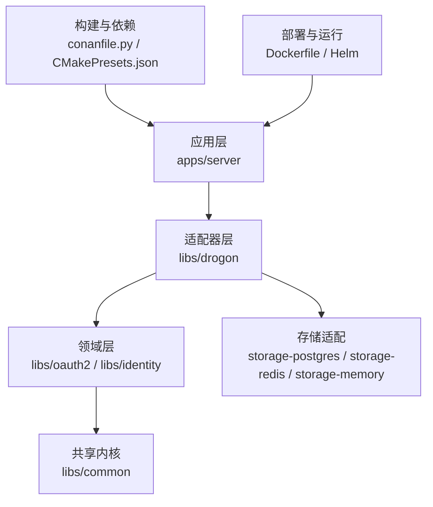
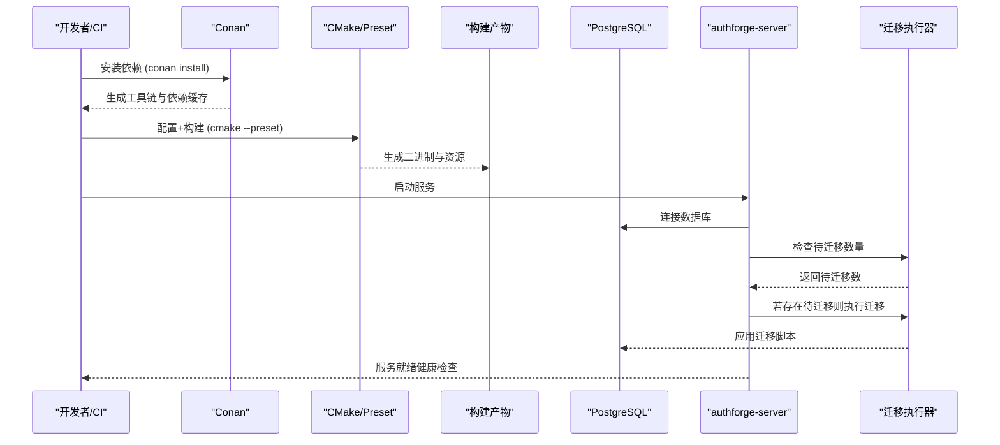
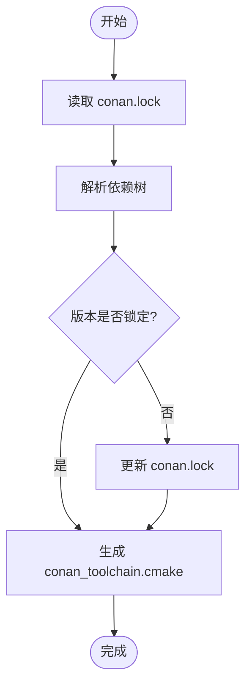
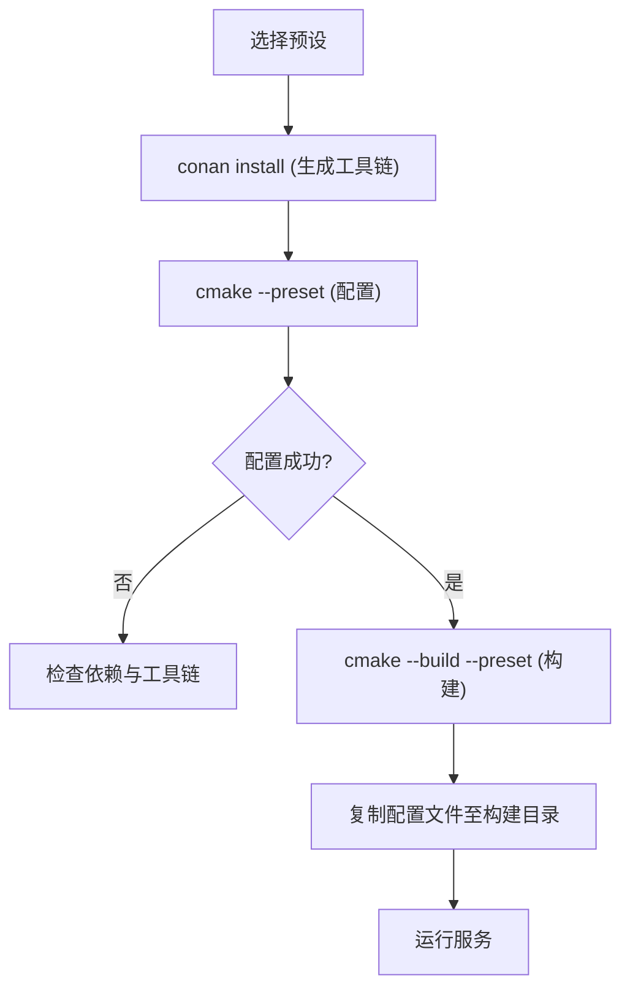
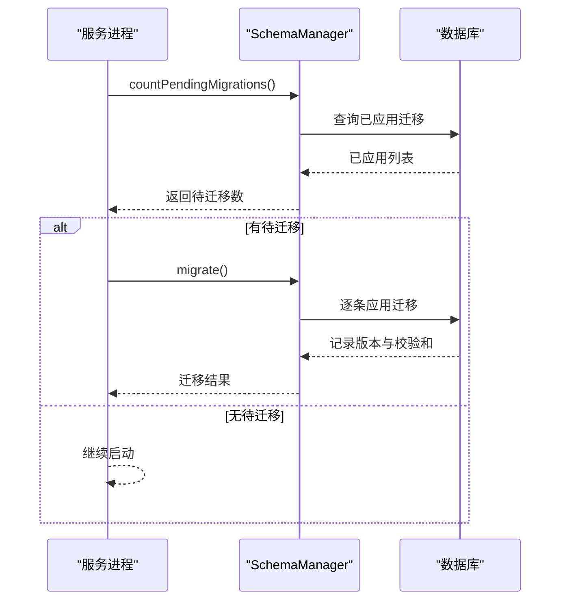
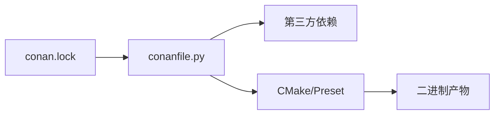

# 版本升级流程

<cite>
**本文引用的文件**
- [conanfile.py](file://conanfile.py)
- [conan.lock](file://conan.lock)
- [CMakeLists.txt](file://CMakeLists.txt)
- [cmake/Version.cmake](file://cmake/Version.cmake)
- [CMakePresets.json](file://CMakePresets.json)
- [scripts/backend/build.sh](file://scripts/backend/build.sh)
- [scripts/backend/run-server.sh](file://scripts/backend/run-server.sh)
- [scripts/backend/env_common.sh](file://scripts/backend/env_common.sh)
- [deploy/docker/Dockerfile](file://deploy/docker/Dockerfile)
- [apps/server/config/config.json](file://apps/server/config/config.json)
- [paths.env](file://paths.env)
- [README.md](file://README.md)
- [apps/server/src/bootstrap/MigrationRunner.cc](file://apps/server/src/bootstrap/MigrationRunner.cc)
- [apps/server/src/bootstrap/MigrationRunner.h](file://apps/server/src/bootstrap/MigrationRunner.h)
- [apps/server/src/SchemaManager.cc](file://apps/server/src/SchemaManager.cc)
- [deploy/helm/authforge/templates/migration-job.yaml](file://deploy/helm/authforge/templates/migration-job.yaml)
- [tools/api-diff/api_diff.py](file://tools/api-diff/api_diff.py)
</cite>

## 目录
1. [简介](#简介)
2. [项目结构](#项目结构)
3. [核心组件](#核心组件)
4. [架构总览](#架构总览)
5. [详细组件分析](#详细组件分析)
6. [依赖分析](#依赖分析)
7. [性能考虑](#性能考虑)
8. [故障排查指南](#故障排查指南)
9. [结论](#结论)
10. [附录](#附录)

## 简介
本指南面向生产与预生产环境的运维与研发人员，提供 AuthForge 的版本升级完整操作手册。内容涵盖：升级前准备、依赖更新（Conan）、代码编译、数据库迁移、服务重启、监控要点、常见问题处理、回滚策略与故障恢复。所有步骤均基于仓库内脚本、构建配置与部署模板，确保可重复、可验证、可回滚。

## 项目结构
AuthForge 采用多包分层架构，后端以 Drogon 为框架，通过 Conan 管理 C/C++ 依赖，使用 CMake Preset 统一构建入口；前端包含管理控制台与用户界面；部署支持 Docker Compose 与 Helm。

图表来源
- [CMakeLists.txt:33-118](file://CMakeLists.txt#L33-L118)
- [conanfile.py:27-83](file://conanfile.py#L27-L83)
- [CMakePresets.json:17-177](file://CMakePresets.json#L17-L177)

章节来源
- [README.md:16-65](file://README.md#L16-L65)
- [CMakeLists.txt:1-171](file://CMakeLists.txt#L1-L171)
- [conanfile.py:1-83](file://conanfile.py#L1-L83)
- [CMakePresets.json:1-234](file://CMakePresets.json#L1-L234)

## 核心组件
- 依赖与版本锁定：Conan 描述与锁文件集中管理第三方库版本，确保跨平台一致性。
- 构建系统：CMake + Preset 提供一致的配置与构建入口，屏蔽平台差异。
- 数据库迁移：运行时自动扫描并执行未应用的迁移脚本，支持只迁移模式。
- 配置管理：集中路径与环境变量，配置文件按环境区分。
- 部署编排：Docker 多阶段构建与 Helm Chart 提供一键部署与迁移钩子。

章节来源
- [conanfile.py:27-83](file://conanfile.py#L27-L83)
- [conan.lock:1-52](file://conan.lock#L1-L52)
- [CMakePresets.json:17-177](file://CMakePresets.json#L17-L177)
- [apps/server/src/bootstrap/MigrationRunner.cc:105-167](file://apps/server/src/bootstrap/MigrationRunner.cc#L105-L167)
- [apps/server/config/config.json:1-212](file://apps/server/config/config.json#L1-L212)
- [deploy/docker/Dockerfile:9-71](file://deploy/docker/Dockerfile#L9-L71)
- [deploy/helm/authforge/templates/migration-job.yaml:1-36](file://deploy/helm/authforge/templates/migration-job.yaml#L1-L36)

## 架构总览
下图展示从依赖解析到服务启动的端到端流程，包括迁移执行与服务健康检查。

图表来源
- [scripts/backend/build.sh:119-156](file://scripts/backend/build.sh#L119-L156)
- [CMakePresets.json:17-177](file://CMakePresets.json#L17-L177)
- [apps/server/src/bootstrap/MigrationRunner.cc:105-167](file://apps/server/src/bootstrap/MigrationRunner.cc#L105-L167)
- [apps/server/src/SchemaManager.cc:207-294](file://apps/server/src/SchemaManager.cc#L207-L294)

## 详细组件分析

### 依赖管理与版本控制（Conan）
- 依赖声明：在 conanfile.py 中固定关键依赖版本（如 drogon、openssl、jsoncpp 等），并通过 options 控制可选特性开关。
- 版本锁定：conan.lock 锁定具体包的哈希与时间戳，保证构建可重现。
- 版本一致性校验：api-diff 工具会交叉检查 cmake/Version.cmake、根 CMakeLists 与 conanfile.py 的版本字段是否一致。

图表来源
- [conanfile.py:27-83](file://conanfile.py#L27-L83)
- [conan.lock:1-52](file://conan.lock#L1-L52)
- [tools/api-diff/api_diff.py:284-304](file://tools/api-diff/api_diff.py#L284-L304)

章节来源
- [conanfile.py:1-83](file://conanfile.py#L1-L83)
- [conan.lock:1-52](file://conan.lock#L1-L52)
- [tools/api-diff/api_diff.py:24-49](file://tools/api-diff/api_diff.py#L24-L49)

### 构建系统与预设（CMake Preset）
- 预设覆盖 Linux/Windows/macOS 及 Debug/Release/Sanitizers 多种组合，统一输出目录与工具链。
- 构建脚本 build.sh 封装了依赖安装、配置与构建流程，确保与 CI 一致。
- 运行脚本 run-server.sh 根据预设定位二进制并启动。

图表来源
- [scripts/backend/build.sh:119-167](file://scripts/backend/build.sh#L119-L167)
- [CMakePresets.json:17-177](file://CMakePresets.json#L17-L177)
- [scripts/backend/run-server.sh:16-44](file://scripts/backend/run-server.sh#L16-L44)

章节来源
- [scripts/backend/build.sh:1-168](file://scripts/backend/build.sh#L1-L168)
- [scripts/backend/run-server.sh:1-45](file://scripts/backend/run-server.sh#L1-L45)
- [CMakePresets.json:1-234](file://CMakePresets.json#L1-L234)

### 数据库迁移与自检查
- 迁移脚本位于 apps/server/migrations，命名遵循 V{NNN}__name.sql。
- 服务启动时检查待迁移数量，若存在则提示或执行迁移；支持 --migrate-only 模式独立执行迁移。
- Helm 部署通过 Job 在升级前执行迁移，滚动升级期间旧副本可能观察到新 schema，迁移具备向前兼容性。

图表来源
- [apps/server/src/SchemaManager.cc:207-294](file://apps/server/src/SchemaManager.cc#L207-L294)
- [apps/server/src/bootstrap/MigrationRunner.cc:105-167](file://apps/server/src/bootstrap/MigrationRunner.cc#L105-L167)
- [deploy/helm/authforge/templates/migration-job.yaml:1-36](file://deploy/helm/authforge/templates/migration-job.yaml#L1-L36)

章节来源
- [apps/server/src/SchemaManager.cc:207-294](file://apps/server/src/SchemaManager.cc#L207-L294)
- [apps/server/src/bootstrap/MigrationRunner.cc:105-167](file://apps/server/src/bootstrap/MigrationRunner.cc#L105-L167)
- [apps/server/src/bootstrap/MigrationRunner.h:31-45](file://apps/server/src/bootstrap/MigrationRunner.h#L31-L45)
- [deploy/helm/authforge/templates/migration-job.yaml:1-36](file://deploy/helm/authforge/templates/migration-job.yaml#L1-L36)

### 配置与环境
- 路径集中管理于 paths.env，供脚本与 CMake 引用，避免硬编码。
- 配置文件按环境区分（dev/ci/prod），默认监听端口与插件配置位于 config.json。
- Docker 镜像将二进制、视图、迁移与种子数据复制到容器工作目录，暴露 5555 端口。

章节来源
- [paths.env:1-75](file://paths.env#L1-L75)
- [apps/server/config/config.json:1-212](file://apps/server/config/config.json#L1-L212)
- [deploy/docker/Dockerfile:48-71](file://deploy/docker/Dockerfile#L48-L71)

### 版本与发布契约
- 版本号集中在 cmake/Version.cmake，并在根 CMakeLists 与 conanfile.py 同步。
- API 变更通过 api-diff 工具强制校验，破坏性变更需提升主版本。
- 发布产物包含 SDK tarball 与签名镜像，支持完整性与签名校验。

章节来源
- [cmake/Version.cmake:1-14](file://cmake/Version.cmake#L1-L14)
- [CMakeLists.txt:1-10](file://CMakeLists.txt#L1-L10)
- [conanfile.py:27-30](file://conanfile.py#L27-L30)
- [tools/api-diff/api_diff.py:284-304](file://tools/api-diff/api_diff.py#L284-L304)
- [README.md:224-243](file://README.md#L224-L243)

## 依赖分析
- 直接依赖：drogon、openssl、jsoncpp、hiredis、libcurl、brotli、zlib 等由 conanfile.py 声明。
- 锁定依赖：conan.lock 精确锁定各包版本与哈希，确保可重现构建。
- 构建期依赖：gtest 用于测试，ninja、cmake 等为构建工具链。

图表来源
- [conanfile.py:54-68](file://conanfile.py#L54-L68)
- [conan.lock:1-52](file://conan.lock#L1-L52)
- [CMakePresets.json:17-177](file://CMakePresets.json#L17-L177)

章节来源
- [conanfile.py:54-68](file://conanfile.py#L54-L68)
- [conan.lock:1-52](file://conan.lock#L1-L52)

## 性能考虑
- 构建并行：使用 -j 参数利用多核加速编译。
- 依赖缓存：Conan 缓存与 Docker BuildKit 缓存减少重复下载与编译时间。
- 运行时优化：启用 gzip/brotli 压缩、静态资源缓存、连接池大小与超时调优。

[本节为通用指导，不直接分析具体文件]

## 故障排查指南
- 构建失败
  - 现象：CMake 配置失败或找不到 drogon_ctl。
  - 处理：确认 conan install 成功，PATH 中包含 drogon 的 bin 目录；清理 CMakeUserPresets.json 后重试。
  - 参考路径：[scripts/backend/build.sh:113-156](file://scripts/backend/build.sh#L113-L156)

- 依赖冲突或版本漂移
  - 现象：api-diff 报告版本不一致或破坏性变更。
  - 处理：对齐 cmake/Version.cmake、CMakeLists 与 conanfile.py 的版本；必要时更新基线并评审。
  - 参考路径：[tools/api-diff/api_diff.py:284-304](file://tools/api-diff/api_diff.py#L284-L304)

- 数据库迁移失败
  - 现象：服务日志提示 pending migrations 或迁移失败。
  - 处理：使用 --migrate-only 单独执行迁移；检查迁移脚本幂等性与校验和；回滚应用版本但不回滚 schema。
  - 参考路径：[apps/server/src/bootstrap/MigrationRunner.cc:105-167](file://apps/server/src/bootstrap/MigrationRunner.cc#L105-L167)

- 服务无法启动
  - 现象：二进制未找到或端口占用。
  - 处理：确认构建输出路径与预设匹配；检查端口 5555 占用；查看日志目录 logs。
  - 参考路径：[scripts/backend/run-server.sh:25-44](file://scripts/backend/run-server.sh#L25-L44)

- Docker 构建缓慢
  - 现象：重复下载与编译耗时。
  - 处理：启用 BuildKit 缓存挂载 /root/.conan2；复用镜像层。
  - 参考路径：[deploy/docker/Dockerfile:33-46](file://deploy/docker/Dockerfile#L33-L46)

章节来源
- [scripts/backend/build.sh:113-156](file://scripts/backend/build.sh#L113-L156)
- [tools/api-diff/api_diff.py:284-304](file://tools/api-diff/api_diff.py#L284-L304)
- [apps/server/src/bootstrap/MigrationRunner.cc:105-167](file://apps/server/src/bootstrap/MigrationRunner.cc#L105-L167)
- [scripts/backend/run-server.sh:25-44](file://scripts/backend/run-server.sh#L25-L44)
- [deploy/docker/Dockerfile:33-46](file://deploy/docker/Dockerfile#L33-L46)

## 结论
AuthForge 的版本升级以 Conan 锁定依赖、CMake Preset 统一构建、运行时迁移与 Helm 钩子为核心，形成“先迁移、后滚动”的安全升级路径。配合 api-diff 与签名校验，可在保障兼容性的同时快速交付新版本。建议在生产环境严格遵循本指南的流程，并在变更前进行充分测试与备份。

[本节为总结，不直接分析具体文件]

## 附录

### 升级前准备工作清单
- 数据备份
  - 对 PostgreSQL 进行全量或增量备份，确保可回滚。
  - 备份 Redis 数据（如使用）。
- 环境检查
  - 确认操作系统、编译器、CMake、Conan 版本满足要求。
  - 检查磁盘空间、网络连通性与端口占用情况。
- 依赖验证
  - 运行 conan install 并核对 conan.lock 是否最新。
  - 运行 api-diff 校验版本一致性与 API 变更。
- 配置审查
  - 对比新旧版本的 config.json 差异，评估破坏性变更。
  - 确认数据库连接、Redis 客户端、插件配置项有效。

章节来源
- [conan.lock:1-52](file://conan.lock#L1-L52)
- [tools/api-diff/api_diff.py:284-304](file://tools/api-diff/api_diff.py#L284-L304)
- [apps/server/config/config.json:1-212](file://apps/server/config/config.json#L1-L212)

### 完整升级流程（本地与容器）
- 本地升级
  - 安装依赖：执行 scripts/backend/build.sh 中的 conan install 流程。
  - 配置与构建：使用 cmake --preset 指定目标平台与构建类型。
  - 数据库迁移：运行 --migrate-only 或依赖 Helm Hook 执行迁移。
  - 启动服务：使用 scripts/backend/run-server.sh 启动二进制。
  - 验证健康：访问 /health 与 /metrics，确认服务就绪。
- 容器升级
  - 重新构建镜像：docker compose up -d --build 或 helm upgrade。
  - 迁移执行：Helm 会在 pre-install/pre-upgrade 钩子中执行迁移。
  - 滚动更新：逐步替换 Pod，观察迁移状态与健康检查。

章节来源
- [scripts/backend/build.sh:119-167](file://scripts/backend/build.sh#L119-L167)
- [scripts/backend/run-server.sh:16-44](file://scripts/backend/run-server.sh#L16-L44)
- [deploy/docker/Dockerfile:33-71](file://deploy/docker/Dockerfile#L33-L71)
- [deploy/helm/authforge/templates/migration-job.yaml:1-36](file://deploy/helm/authforge/templates/migration-job.yaml#L1-L36)

### 不同版本升级注意事项
- 破坏性变更
  - API 头文件变更：通过 api-diff 检测并记录；破坏性变更需提升主版本。
  - 配置项变更：对比 config.json 的差异，评估兼容性与迁移方案。
- API 兼容性处理
  - 保持向后兼容至少一个 minor 周期；弃用标记并逐步移除。
  - 客户端侧需适配新的请求格式或端点。
- 配置项变更
  - 新增必填项：提前通知并设置合理默认值。
  - 废弃项：保留过渡期并提供迁移脚本或文档。

章节来源
- [tools/api-diff/api_diff.py:24-49](file://tools/api-diff/api_diff.py#L24-L49)
- [apps/server/config/config.json:1-212](file://apps/server/config/config.json#L1-L212)

### 升级过程中的监控要点
- 构建与依赖
  - 监控 Conan 下载与编译日志，关注失败与重试。
  - 检查 CMake 配置与构建输出目录是否正确。
- 迁移与数据库
  - 观察迁移执行日志与错误信息，确认 schema_migrations 表更新。
  - 监控数据库连接池与慢查询。
- 服务健康
  - 定期轮询 /health/live 与 /health/ready。
  - 采集 Prometheus 指标，关注错误率与延迟。

章节来源
- [apps/server/src/SchemaManager.cc:207-294](file://apps/server/src/SchemaManager.cc#L207-L294)
- [apps/server/config/config.json:133-170](file://apps/server/config/config.json#L133-L170)

### 回滚策略与故障恢复
- 应用回滚
  - 使用 Helm rollback 或 docker compose 回退到上一版本镜像。
  - 仅回滚应用版本，不回滚数据库 schema（迁移向前兼容）。
- 数据恢复
  - 若迁移失败导致数据不一致，使用备份恢复数据库。
  - 清理异常会话与锁状态（如需要）。
- 服务恢复
  - 重启服务并验证健康检查。
  - 检查日志与指标，确认业务恢复正常。

章节来源
- [deploy/helm/authforge/templates/migration-job.yaml:1-36](file://deploy/helm/authforge/templates/migration-job.yaml#L1-L36)
- [apps/server/src/bootstrap/MigrationRunner.cc:105-167](file://apps/server/src/bootstrap/MigrationRunner.cc#L105-L167)