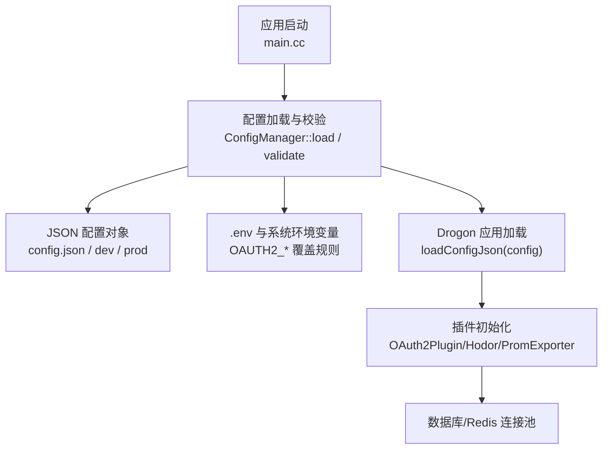
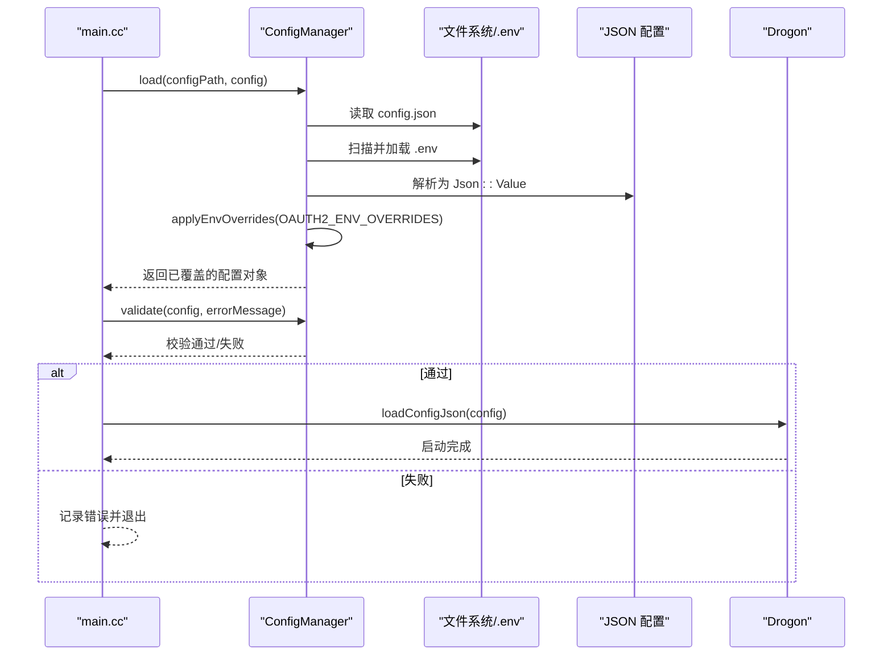
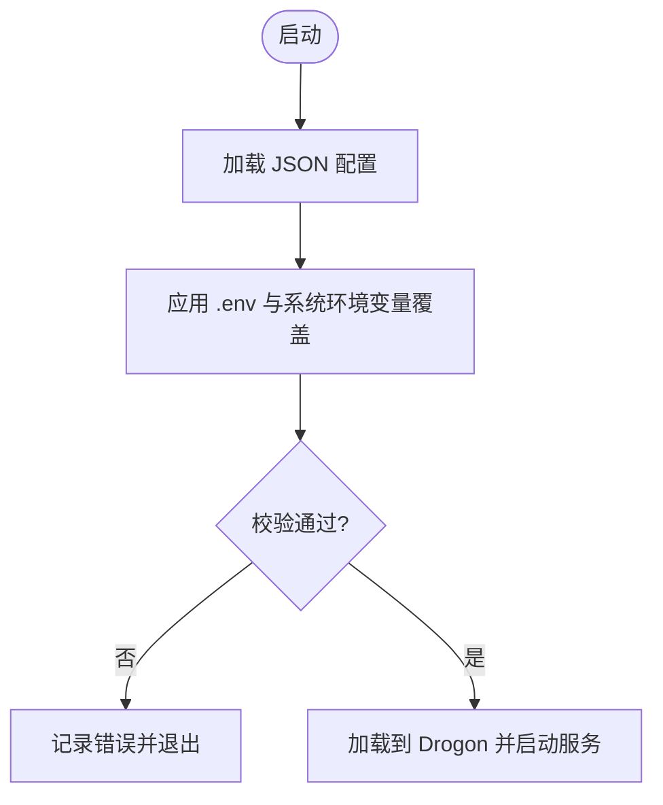
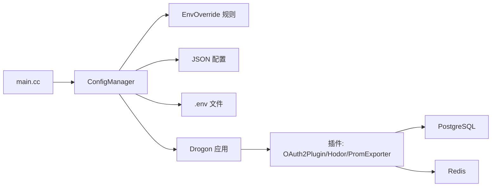

# 配置更新指南

<cite>
**本文引用的文件**
- [apps/server/config/config.json](file://apps/server/config/config.json)
- [apps/server/config/config.dev.json](file://apps/server/config/config.dev.json)
- [apps/server/config/config.prod.json](file://apps/server/config/config.prod.json)
- [libs/common/include/authforge/common/config/ConfigManager.h](file://libs/common/include/authforge/common/config/ConfigManager.h)
- [libs/common/include/authforge/common/config/ConfigTypes.h](file://libs/common/include/authforge/common/config/ConfigTypes.h)
- [libs/common/src/config/ConfigManager.cc](file://libs/common/src/config/ConfigManager.cc)
- [apps/server/src/main.cc](file://apps/server/src/main.cc)
- [deploy/env/server.env.example](file://deploy/env/server.env.example)
- [deploy/env/docker.env.example](file://deploy/env/docker.env.example)
- [docs/backend/configuration-guide.md](file://docs/backend/configuration-guide.md)
- [tests/unit/config/ConfigMigrationTest.cc](file://tests/unit/config/ConfigMigrationTest.cc)
</cite>

## 目录
1. [简介](#简介)
2. [项目结构](#项目结构)
3. [核心组件](#核心组件)
4. [架构总览](#架构总览)
5. [详细组件分析](#详细组件分析)
6. [依赖关系分析](#依赖关系分析)
7. [性能与调优](#性能与调优)
8. [故障排查](#故障排查)
9. [结论](#结论)
10. [附录：环境模板与最佳实践](#附录：环境模板与最佳实践)

## 简介
本指南面向需要变更和演进 OAuth2 服务配置的运维与开发人员，覆盖配置文件结构、环境变量注入、运行时配置加载、向后兼容与废弃项迁移、配置校验与错误检测，以及不同环境的配置模板与最佳实践。目标是帮助你在不破坏现有行为的前提下安全地升级配置。

## 项目结构
- 配置文件位于 apps/server/config，提供基础配置与环境特化版本：
  - config.json：默认配置基线
  - config.dev.json：开发环境优化（调试日志、宽松缓存等）
  - config.prod.json：生产环境强化（限流、严格端口与超时、压缩等）
- 环境变量模板位于 deploy/env：
  - server.env.example：本地/容器内 .env 参考
  - docker.env.example：Docker Compose 生产环境参考
- 配置加载与校验由 libs/common 的 ConfigManager 实现，并在 apps/server/src/main.cc 启动流程中调用。

图示来源
- [apps/server/src/main.cc:75-95](file://apps/server/src/main.cc#L75-L95)
- [libs/common/src/config/ConfigManager.cc:126-150](file://libs/common/src/config/ConfigManager.cc#L126-L150)
- [libs/common/src/config/ConfigManager.cc:312-401](file://libs/common/src/config/ConfigManager.cc#L312-L401)
- [libs/common/include/authforge/common/config/ConfigTypes.h:20-44](file://libs/common/include/authforge/common/config/ConfigTypes.h#L20-L44)

章节来源
- [apps/server/config/config.json:1-212](file://apps/server/config/config.json#L1-L212)
- [apps/server/config/config.dev.json:1-225](file://apps/server/config/config.dev.json#L1-L225)
- [apps/server/config/config.prod.json:1-264](file://apps/server/config/config.prod.json#L1-L264)
- [docs/backend/configuration-guide.md:1-85](file://docs/backend/configuration-guide.md#L1-L85)

## 核心组件
- 配置管理器（ConfigManager）
  - 负责读取 JSON 配置、解析 .env、应用环境变量覆盖、执行配置校验。
  - 支持按路径定位 JSON 节点，包括数组索引与“按 name 过滤”的插件定位语法。
- 环境变量覆盖规则（EnvOverride）
  - 集中定义 OAUTH2_* 环境变量到 JSON 路径的映射，支持数值、字符串、逗号分隔字符串转数组等类型转换。
- 启动入口（main.cc）
  - 在进程启动时加载配置并立即校验，失败则终止进程，避免以错误配置运行。

章节来源
- [libs/common/include/authforge/common/config/ConfigManager.h:11-40](file://libs/common/include/authforge/common/config/ConfigManager.h#L11-L40)
- [libs/common/include/authforge/common/config/ConfigTypes.h:10-44](file://libs/common/include/authforge/common/config/ConfigTypes.h#L10-L44)
- [libs/common/src/config/ConfigManager.cc:126-150](file://libs/common/src/config/ConfigManager.cc#L126-L150)
- [apps/server/src/main.cc:75-95](file://apps/server/src/main.cc#L75-L95)

## 架构总览
配置加载与校验的关键流程如下：

图示来源
- [apps/server/src/main.cc:75-95](file://apps/server/src/main.cc#L75-L95)
- [libs/common/src/config/ConfigManager.cc:126-150](file://libs/common/src/config/ConfigManager.cc#L126-L150)
- [libs/common/src/config/ConfigManager.cc:152-190](file://libs/common/src/config/ConfigManager.cc#L152-L190)
- [libs/common/src/config/ConfigManager.cc:312-401](file://libs/common/src/config/ConfigManager.cc#L312-L401)

## 详细组件分析

### 配置文件结构与字段说明
- 监听器 listeners
  - address/port/https：控制 HTTP/HTTPS 监听地址与端口。
  - 可通过 OAUTH2_LISTEN_PORT 覆盖端口。
- 数据库客户端 db_clients
  - rdbms/host/port/dbname/user/passwd/is_fast/client_encoding/number_of_connections/timeout/auto_batch/connect_options。
  - 常用覆盖：OAUTH2_DB_HOST/OAUTH2_DB_PORT/OAUTH2_DB_NAME/OAUTH2_DB_USER/OAUTH2_DB_PASSWORD。
- Redis 客户端 redis_clients
  - host/port/username/passwd/db/is_fast/number_of_connections/timeout。
  - 常用覆盖：OAUTH2_REDIS_HOST/OAUTH2_REDIS_PORT/OAUTH2_REDIS_PASSWORD。
- 应用 app
  - 线程数、会话、静态资源、日志、压缩、连接与请求限制等。
  - 生产建议开启 gzip/brotli、合理设置 keepalive/pipelining、限制 body size。
- 插件 plugins
  - PromExporter/Hodor/OAuth2Plugin 等。
  - OAuth2Plugin 包含 storage_type、redis/postgres 关联、clients、admin_users、tokens TTL、清理周期等。
  - 使用“按 name 过滤”的路径语法可稳定覆盖任意位置的插件配置。
- 自定义 custom_config
  - metadata.issuer、auth、rbac_rules、cors、frontend.url、external_auth（GitHub/WeChat/Google）。
  - 常用覆盖：OAUTH2_ISSUER、OAUTH2_FRONTEND_URL、OAUTH2_CORS_ALLOW_ORIGINS、各第三方 ID/Secret/Redirect URI。

章节来源
- [apps/server/config/config.json:1-212](file://apps/server/config/config.json#L1-L212)
- [apps/server/config/config.dev.json:1-225](file://apps/server/config/config.dev.json#L1-L225)
- [apps/server/config/config.prod.json:1-264](file://apps/server/config/config.prod.json#L1-L264)
- [libs/common/include/authforge/common/config/ConfigTypes.h:20-44](file://libs/common/include/authforge/common/config/ConfigTypes.h#L20-L44)

### 环境变量更新方法
- 优先级：.env 文件 > 系统环境变量 > 配置文件默认值。
- 支持的覆盖键（部分示例）：
  - 数据库：OAUTH2_DB_HOST/OAUTH2_DB_PORT/OAUTH2_DB_NAME/OAUTH2_DB_USER/OAUTH2_DB_PASSWORD
  - Redis：OAUTH2_REDIS_HOST/OAUTH2_REDIS_PORT/OAUTH2_REDIS_PASSWORD
  - 监听端口：OAUTH2_LISTEN_PORT
  - Issuer 与前端 URL：OAUTH2_ISSUER、OAUTH2_FRONTEND_URL
  - CORS：OAUTH2_CORS_ALLOW_ORIGINS（逗号分隔字符串会被转为数组）
  - Vue 客户端与重定向：OAUTH2_VUE_CLIENT_SECRET、OAUTH2_VUE_REDIRECT_URI
  - 外部认证：OAUTH2_GITHUB_*、OAUTH2_GOOGLE_*、OAUTH2_GOOGLE_REDIRECT_URI
- 使用方法：
  - 将对应变量写入 .env 或容器/平台的环境配置中；启动时自动生效，无需修改 JSON。
  - 生产部署建议使用密钥管理（如 Kubernetes Secret），仅注入敏感字段。

章节来源
- [libs/common/src/config/ConfigManager.cc:13-124](file://libs/common/src/config/ConfigManager.cc#L13-L124)
- [libs/common/include/authforge/common/config/ConfigTypes.h:20-44](file://libs/common/include/authforge/common/config/ConfigTypes.h#L20-L44)
- [deploy/env/server.env.example:1-70](file://deploy/env/server.env.example#L1-L70)
- [deploy/env/docker.env.example:1-89](file://deploy/env/docker.env.example#L1-L89)
- [docs/backend/configuration-guide.md:1-85](file://docs/backend/configuration-guide.md#L1-L85)

### 配置文件修改与运行时配置
- 直接修改 JSON：
  - 适用于非敏感、可热更新的参数（如日志级别、静态资源缓存策略、CORS 白名单等）。
  - 注意：多数网络/存储相关参数需重启生效。
- 运行时配置：
  - 当前启动流程在 main.cc 中加载配置后直接交给 Drogon 应用，未暴露动态热更新接口。
  - 若需运行时调整，建议结合外部配置中心或滚动重启策略。

章节来源
- [apps/server/src/main.cc:75-95](file://apps/server/src/main.cc#L75-L95)
- [docs/backend/configuration-guide.md:18-27](file://docs/backend/configuration-guide.md#L18-L27)

### 向后兼容性与废弃项迁移
- 插件路径匹配兼容性：
  - 支持“按 name 过滤”的数组元素选择语法，使环境变量覆盖不受插件顺序影响，提升跨配置文件的稳定性。
- 存储后端弃用提示：
  - Redis 作为独立存储模式已标记为弃用，生产应使用 Postgres；新部署不应启用 Redis-only 存储。
- 迁移建议：
  - 逐步将敏感信息从 JSON 迁移至环境变量或密钥管理。
  - 对已废弃字段保留兼容读取但输出告警，确保平滑过渡。

章节来源
- [libs/common/src/config/ConfigManager.cc:225-286](file://libs/common/src/config/ConfigManager.cc#L225-L286)
- [docs/backend/configuration-guide.md:59-69](file://docs/backend/configuration-guide.md#L59-L69)

### 配置验证机制与错误检测
- 启动时强制校验：
  - 检查必需段存在且类型正确（db_clients、redis_clients 必须为数组）。
  - 端口范围校验（1-65535）。
  - 生产模式额外校验：
    - issuer 必须为 https:// 开头。
    - 数据库与 Redis 密码不得为默认值。
- 错误处理：
  - 校验失败会返回具体错误消息，主进程记录并退出，避免以不安全配置运行。
  - 可通过环境变量控制是否输出详细校验错误（生产建议关闭细节）。

图示来源
- [libs/common/src/config/ConfigManager.cc:312-401](file://libs/common/src/config/ConfigManager.cc#L312-L401)
- [apps/server/src/main.cc:75-95](file://apps/server/src/main.cc#L75-L95)

章节来源
- [libs/common/src/config/ConfigManager.cc:312-401](file://libs/common/src/config/ConfigManager.cc#L312-L401)
- [deploy/env/server.env.example:46-49](file://deploy/env/server.env.example#L46-L49)
- [deploy/env/docker.env.example:56-60](file://deploy/env/docker.env.example#L56-L60)

### 不同环境的配置模板与差异
- 开发环境（config.dev.json）
  - 较低连接数、禁用 Brotli、关闭自动批处理、更宽松的缓存策略，便于调试。
- 生产环境（config.prod.json）
  - 启用 Hodor 限流、Brotli 压缩、复用端口、严格的超时与连接限制、日志轮转。
- 通用基线（config.json）
  - 提供最小可用配置，适合快速启动与测试。

章节来源
- [apps/server/config/config.dev.json:1-225](file://apps/server/config/config.dev.json#L1-L225)
- [apps/server/config/config.prod.json:1-264](file://apps/server/config/config.prod.json#L1-L264)
- [apps/server/config/config.json:1-212](file://apps/server/config/config.json#L1-L212)

## 依赖关系分析
- main.cc 依赖 ConfigManager 进行配置加载与校验。
- ConfigManager 依赖：
  - JSON 解析库（JsonCpp）
  - 文件系统（读取 .env）
  - 环境变量覆盖规则（EnvOverride）
- 插件层（OAuth2Plugin、Hodor、PromExporter）通过配置驱动初始化，依赖数据库与 Redis 客户端配置。

图示来源
- [apps/server/src/main.cc:75-95](file://apps/server/src/main.cc#L75-L95)
- [libs/common/src/config/ConfigManager.cc:126-150](file://libs/common/src/config/ConfigManager.cc#L126-L150)
- [libs/common/include/authforge/common/config/ConfigTypes.h:20-44](file://libs/common/include/authforge/common/config/ConfigTypes.h#L20-L44)

章节来源
- [libs/common/src/config/ConfigManager.cc:126-150](file://libs/common/src/config/ConfigManager.cc#L126-L150)
- [libs/common/include/authforge/common/config/ConfigTypes.h:20-44](file://libs/common/include/authforge/common/config/ConfigTypes.h#L20-L44)

## 性能与调优
- 数据库连接池
  - number_of_connections：根据并发与实例规格调整；生产建议适度降低单实例连接数以减少锁竞争。
  - timeout/connect_options.statement_timeout：防止长事务拖垮连接。
- Redis 连接池
  - number_of_connections/timeout：与缓存命中率及读放大场景匹配。
- 应用服务器
  - use_gzip/use_brotli：生产建议开启，配合静态资源缓存。
  - keepalive_requests/pipelining_requests：在高吞吐场景下提升吞吐，但需评估客户端与代理能力。
  - client_max_body_size/client_max_memory_body_size：限制上传大小，防 DoS。
  - reuse_port：多进程/多实例部署时可提升绑定效率。
- 限流与保护
  - Hodor 插件：基于令牌桶的全局与子路径限流，保护登录/注册/令牌端点。
- 日志与可观测性
  - log_level/log_path/max_files：生产建议 INFO+，开启轮转。
  - PromExporter：暴露指标用于监控。

章节来源
- [apps/server/config/config.prod.json:101-131](file://apps/server/config/config.prod.json#L101-L131)
- [apps/server/config/config.prod.json:141-187](file://apps/server/config/config.prod.json#L141-L187)

## 故障排查
- 启动失败：配置校验错误
  - 检查 db_clients/redis_clients 是否存在且为数组。
  - 检查端口是否在合法范围。
  - 生产模式下确认 issuer 为 https://，且数据库/Redis 密码非默认值。
- 环境变量未生效
  - 确认 .env 文件位置与格式（KEY=VALUE，支持注释与引号）。
  - 确认环境变量名与覆盖规则一致（参见 EnvOverride）。
  - 使用 getEnv 或日志确认 .env 是否被加载。
- 插件配置覆盖异常
  - 使用“按 name 过滤”的路径语法覆盖插件配置，避免受数组顺序影响。
- 存储后端问题
  - 若使用 Redis-only 存储，请迁移至 Postgres；Redis-only 已弃用。

章节来源
- [libs/common/src/config/ConfigManager.cc:312-401](file://libs/common/src/config/ConfigManager.cc#L312-L401)
- [libs/common/src/config/ConfigManager.cc:13-124](file://libs/common/src/config/ConfigManager.cc#L13-L124)
- [libs/common/src/config/ConfigManager.cc:225-286](file://libs/common/src/config/ConfigManager.cc#L225-L286)
- [docs/backend/configuration-guide.md:59-69](file://docs/backend/configuration-guide.md#L59-L69)

## 结论
本指南提供了从配置结构、环境变量覆盖、启动加载与校验到向后兼容与性能调优的完整方案。建议在开发阶段使用 config.dev.json 与 .env 快速迭代，在生产环境采用 config.prod.json 并结合密钥管理与严格校验，确保安全性与稳定性。

## 附录：环境模板与最佳实践
- 推荐做法
  - 敏感信息一律通过环境变量或密钥管理注入，不在 JSON 中硬编码。
  - 生产环境开启 HTTPS issuer、强密码、日志轮转与限流。
  - 使用 Helm/Compose 的 env 块集中管理环境变量，保持与 .env 模板一致。
- 模板参考
  - server.env.example：本地/容器内 .env 参考，包含数据库、Redis、JWT、SMTP、外部认证等。
  - docker.env.example：Docker Compose 生产环境参考，包含前后端构建与运行时变量。
- 验证与回归
  - 单元测试覆盖环境变量覆盖与配置加载逻辑，确保向后兼容。

章节来源
- [deploy/env/server.env.example:1-70](file://deploy/env/server.env.example#L1-L70)
- [deploy/env/docker.env.example:1-89](file://deploy/env/docker.env.example#L1-L89)
- [tests/unit/config/ConfigMigrationTest.cc:12-82](file://tests/unit/config/ConfigMigrationTest.cc#L12-L82)
- [docs/backend/configuration-guide.md:1-85](file://docs/backend/configuration-guide.md#L1-L85)