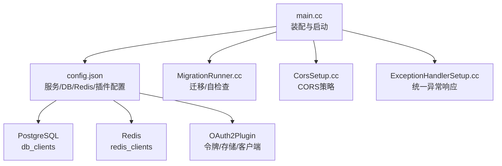
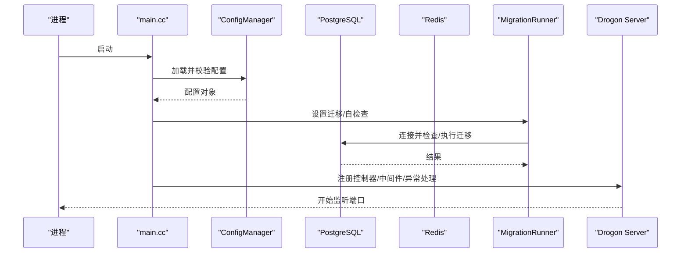
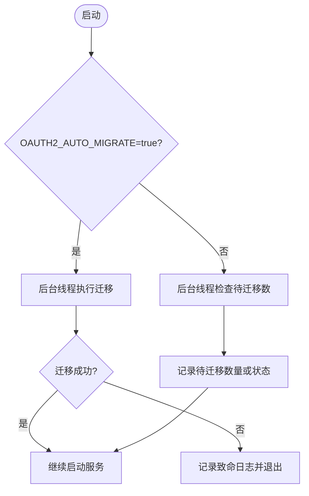
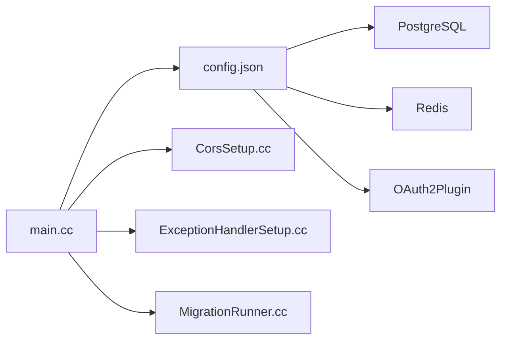

# 常见问题排查

<cite>
**本文引用的文件**
- [apps/server/src/main.cc](file://apps/server/src/main.cc)
- [apps/server/config/config.json](file://apps/server/config/config.json)
- [deploy/env/server.env.example](file://deploy/env/server.env.example)
- [apps/server/src/bootstrap/MigrationRunner.cc](file://apps/server/src/bootstrap/MigrationRunner.cc)
- [apps/server/src/bootstrap/CorsSetup.cc](file://apps/server/src/bootstrap/CorsSetup.cc)
- [apps/server/src/bootstrap/ExceptionHandlerSetup.cc](file://apps/server/src/bootstrap/ExceptionHandlerSetup.cc)
</cite>

## 目录
1. [简介](#简介)
2. [项目结构](#项目结构)
3. [核心组件](#核心组件)
4. [架构总览](#架构总览)
5. [详细组件分析](#详细组件分析)
6. [依赖关系分析](#依赖关系分析)
7. [性能注意事项](#性能注意事项)
8. [故障排查指南](#故障排查指南)
9. [结论](#结论)
10. [附录](#附录)

## 简介
本指南面向运维与开发人员，聚焦AuthForge服务启动失败、数据库连接错误、认证相关问题（OAuth2/JWT/会话）、以及网络配置（CORS/SSL/反向代理）等常见问题的定位与解决。文档基于仓库中的实际代码与配置，提供分步骤的诊断流程、日志线索与修复建议，帮助快速恢复服务可用性。

## 项目结构
- 应用入口位于 apps/server/src/main.cc，负责加载配置、注册控制器、设置跨域与安全头、异常处理、OpenAPI文档初始化、迁移检查与启动HTTP服务。
- 配置文件位于 apps/server/config/config.json，包含监听端口、数据库与Redis客户端、插件（OAuth2Plugin）、自定义CORS与外部认证等。
- 环境变量覆盖示例位于 deploy/env/server.env.example，支持通过环境变量覆盖配置项（优先级高于config.json）。
- 迁移与自检查逻辑在 apps/server/src/bootstrap/MigrationRunner.cc，支持自动迁移开关与仅迁移模式。
- CORS策略在 apps/server/src/bootstrap/CorsSetup.cc，采用严格白名单匹配。
- 全局异常处理在 apps/server/src/bootstrap/ExceptionHandlerSetup.cc，区分OAuth2协议端点与应用端点的错误响应格式。

图表来源
- [apps/server/src/main.cc:97-238](file://apps/server/src/main.cc#L97-L238)
- [apps/server/config/config.json:1-212](file://apps/server/config/config.json#L1-L212)
- [apps/server/src/bootstrap/MigrationRunner.cc:53-165](file://apps/server/src/bootstrap/MigrationRunner.cc#L53-L165)
- [apps/server/src/bootstrap/CorsSetup.cc:8-80](file://apps/server/src/bootstrap/CorsSetup.cc#L8-L80)
- [apps/server/src/bootstrap/ExceptionHandlerSetup.cc:13-64](file://apps/server/src/bootstrap/ExceptionHandlerSetup.cc#L13-L64)

章节来源
- [apps/server/src/main.cc:97-238](file://apps/server/src/main.cc#L97-L238)
- [apps/server/config/config.json:1-212](file://apps/server/config/config.json#L1-L212)
- [deploy/env/server.env.example:1-70](file://deploy/env/server.env.example#L1-L70)

## 核心组件
- 启动装配：读取并校验配置，创建日志目录，注册控制器，设置CORS与安全头，注入异常处理器，初始化OpenAPI，执行迁移或自检查，最终启动Drogon事件循环。
- 配置管理：支持从config.json与环境变量合并，关键路径包括监听端口、数据库与Redis客户端、OAuth2插件参数、CORS白名单、前端URL等。
- 迁移机制：支持自动迁移（需显式开启）与仅迁移模式；生产环境推荐通过Job运行迁移，服务启动时进行自检查告警。
- CORS策略：严格白名单匹配，拒绝未授权预检请求，并在响应中注入必要的跨域头。
- 异常处理：对OAuth2协议端点返回RFC 6749兼容的错误体；其他应用端点返回统一的Error Envelope，并保留CORS头。

章节来源
- [apps/server/src/main.cc:97-238](file://apps/server/src/main.cc#L97-L238)
- [apps/server/config/config.json:1-212](file://apps/server/config/config.json#L1-L212)
- [apps/server/src/bootstrap/MigrationRunner.cc:53-165](file://apps/server/src/bootstrap/MigrationRunner.cc#L53-L165)
- [apps/server/src/bootstrap/CorsSetup.cc:8-80](file://apps/server/src/bootstrap/CorsSetup.cc#L8-L80)
- [apps/server/src/bootstrap/ExceptionHandlerSetup.cc:13-64](file://apps/server/src/bootstrap/ExceptionHandlerSetup.cc#L13-L64)

## 架构总览
服务启动流程概览如下：

图表来源
- [apps/server/src/main.cc:97-238](file://apps/server/src/main.cc#L97-L238)
- [apps/server/src/bootstrap/MigrationRunner.cc:53-165](file://apps/server/src/bootstrap/MigrationRunner.cc#L53-L165)

## 详细组件分析

### 启动与配置加载
- 入口函数会尝试多个相对路径查找config.json，若找不到则提前退出。
- 使用配置管理器加载并校验配置，失败时记录致命日志并退出。
- 根据配置创建日志目录，便于后续问题追踪。
- 启动前打印数据库主机、端口与Redis主机信息，便于快速核对。

章节来源
- [apps/server/src/main.cc:118-149](file://apps/server/src/main.cc#L118-L149)
- [apps/server/src/main.cc:76-95](file://apps/server/src/main.cc#L76-L95)
- [apps/server/src/main.cc:42-73](file://apps/server/src/main.cc#L42-L73)

### 迁移与自检查
- 自动迁移默认关闭，需设置环境变量开启；生产环境建议使用Job执行迁移。
- 仅迁移模式用于Helm Hook，独立构建数据库客户端执行迁移，不进入HTTP服务。
- 非自动迁移模式下，服务启动后后台线程检查待迁移数量并记录日志。

图表来源
- [apps/server/src/bootstrap/MigrationRunner.cc:53-128](file://apps/server/src/bootstrap/MigrationRunner.cc#L53-L128)
- [apps/server/src/bootstrap/MigrationRunner.cc:130-165](file://apps/server/src/bootstrap/MigrationRunner.cc#L130-L165)

章节来源
- [apps/server/src/bootstrap/MigrationRunner.cc:53-165](file://apps/server/src/bootstrap/MigrationRunner.cc#L53-L165)

### CORS策略
- 预检请求（OPTIONS）严格匹配白名单，未授权直接返回403。
- 正常响应中为允许的Origin注入Access-Control-Allow-*头，并允许携带凭证。
- 白名单来源于custom_config.cors.allow_origins，不支持通配符，避免CSRF风险。

章节来源
- [apps/server/src/bootstrap/CorsSetup.cc:8-80](file://apps/server/src/bootstrap/CorsSetup.cc#L8-L80)
- [apps/server/config/config.json:172-190](file://apps/server/config/config.json#L172-L190)

### 异常处理
- 全局异常处理器将异常路径分为两类：
  - OAuth2协议端点：返回RFC 6749兼容的错误体（如server_error），并保留CORS头。
  - 其他应用端点：返回统一的Error Envelope（INTERNAL_ERROR），并保留CORS头。
- 该设计确保协议合规性与应用一致性。

章节来源
- [apps/server/src/bootstrap/ExceptionHandlerSetup.cc:13-64](file://apps/server/src/bootstrap/ExceptionHandlerSetup.cc#L13-L64)

## 依赖关系分析
- main.cc依赖配置管理、控制器注册、CORS与安全头设置、异常处理、OpenAPI初始化、迁移模块。
- 配置驱动数据库与Redis连接池、OAuth2插件行为、CORS白名单、前端URL与重定向URI。
- 迁移模块依赖数据库客户端与SchemaManager，支持自动迁移与自检查。

图表来源
- [apps/server/src/main.cc:97-238](file://apps/server/src/main.cc#L97-L238)
- [apps/server/config/config.json:1-212](file://apps/server/config/config.json#L1-L212)
- [apps/server/src/bootstrap/MigrationRunner.cc:53-165](file://apps/server/src/bootstrap/MigrationRunner.cc#L53-L165)

章节来源
- [apps/server/src/main.cc:97-238](file://apps/server/src/main.cc#L97-L238)
- [apps/server/config/config.json:1-212](file://apps/server/config/config.json#L1-L212)

## 性能注意事项
- 数据库连接池大小与超时影响并发能力与稳定性，应根据负载调整db_clients.number_of_connections与timeout。
- Redis连接池同样需要合理配置，避免缓存与令牌刷新成为瓶颈。
- 启用压缩（gzip/brotli）可提升静态资源传输效率，但会增加CPU开销，需权衡。
- 日志级别在生产环境建议降低至INFO或WARN，减少I/O压力。

[本节为通用指导，不直接分析具体文件]

## 故障排查指南

### 一、服务启动失败的诊断方法
- 端口冲突
  - 现象：服务无法绑定监听端口，启动即退出。
  - 定位：查看启动日志是否出现端口占用相关错误；确认config.json.listeners.port与系统已占用端口冲突。
  - 解决：修改监听端口或释放被占用端口；可通过环境变量OAUTH2_LISTEN_PORT覆盖。
  - 参考：
    - [apps/server/config/config.json:1-8](file://apps/server/config/config.json#L1-L8)
    - [deploy/env/server.env.example:34-36](file://deploy/env/server.env.example#L34-L36)

- 配置文件错误
  - 现象：启动时立即退出，提示配置加载或校验失败。
  - 定位：检查config.json是否存在且可读；确认JSON语法正确；核对必需字段（如db_clients、redis_clients、plugins）。
  - 解决：修正JSON格式与必填字段；必要时使用环境变量覆盖敏感项。
  - 参考：
    - [apps/server/src/main.cc:118-149](file://apps/server/src/main.cc#L118-L149)
    - [apps/server/src/main.cc:76-95](file://apps/server/src/main.cc#L76-L95)

- 依赖服务连接失败
  - 现象：启动后无法访问数据库或Redis，导致功能不可用或启动失败。
  - 定位：检查db_clients与redis_clients的host/port/密码；确认网络可达与服务状态。
  - 解决：修正连接参数；确保防火墙/安全组放行；验证服务健康。
  - 参考：
    - [apps/server/config/config.json:9-40](file://apps/server/config/config.json#L9-L40)
    - [deploy/env/server.env.example:22-33](file://deploy/env/server.env.example#L22-L33)

章节来源
- [apps/server/config/config.json:1-40](file://apps/server/config/config.json#L1-L40)
- [deploy/env/server.env.example:22-36](file://deploy/env/server.env.example#L22-L36)
- [apps/server/src/main.cc:118-149](file://apps/server/src/main.cc#L118-L149)

### 二、数据库连接错误的排查流程
- PostgreSQL连接参数验证
  - 检查项：host、port、dbname、user、passwd、statement_timeout等。
  - 工具：使用libpq命令行或客户端工具直连测试；核对环境变量覆盖值。
  - 参考：
    - [apps/server/config/config.json:9-27](file://apps/server/config/config.json#L9-L27)
    - [deploy/env/server.env.example:22-28](file://deploy/env/server.env.example#L22-L28)

- 权限配置检查
  - 检查项：数据库用户是否有读写权限；schema是否存在；迁移表是否存在。
  - 工具：登录数据库执行查询与DDL权限测试；查看迁移状态。
  - 参考：
    - [apps/server/src/bootstrap/MigrationRunner.cc:95-128](file://apps/server/src/bootstrap/MigrationRunner.cc#L95-L128)

- 网络连通性测试
  - 检查项：端口可达性、防火墙规则、容器网络隔离。
  - 工具：telnet/nc/curl测试端口；检查Docker/K8s网络策略。
  - 参考：
    - [apps/server/config/config.json:9-27](file://apps/server/config/config.json#L9-L27)

- 迁移相关问题
  - 现象：服务启动后提示有待迁移或未应用迁移。
  - 定位：查看自检查日志；确认是否开启自动迁移；检查migrations目录是否可访问。
  - 解决：运行迁移Job或开启自动迁移；确保migrations目录路径正确。
  - 参考：
    - [apps/server/src/bootstrap/MigrationRunner.cc:53-128](file://apps/server/src/bootstrap/MigrationRunner.cc#L53-L128)
    - [apps/server/src/bootstrap/MigrationRunner.cc:130-165](file://apps/server/src/bootstrap/MigrationRunner.cc#L130-L165)

章节来源
- [apps/server/config/config.json:9-27](file://apps/server/config/config.json#L9-L27)
- [deploy/env/server.env.example:22-28](file://deploy/env/server.env.example#L22-L28)
- [apps/server/src/bootstrap/MigrationRunner.cc:53-165](file://apps/server/src/bootstrap/MigrationRunner.cc#L53-L165)

### 三、认证相关问题的诊断方法
- OAuth2客户端配置错误
  - 现象：授权码流或设备码流失败，回调地址不匹配或scope不被允许。
  - 定位：检查OAuth2Plugin.clients配置中的client_type、secret、redirect_uri、allowed_scopes；核对前端重定向URI。
  - 解决：修正客户端配置；确保redirect_uri与前端一致；添加必要scope。
  - 参考：
    - [apps/server/config/config.json:141-170](file://apps/server/config/config.json#L141-L170)
    - [deploy/env/server.env.example:40-44](file://deploy/env/server.env.example#L40-L44)

- JWT令牌验证失败
  - 现象：访问受保护资源时报鉴权失败或令牌无效。
  - 定位：检查JWT签名密钥配置（OAUTH2_JWT_KEY_PATH或OAUTH2_SIGNING_KEY）；确认签发者与令牌有效期；核对客户端使用的算法与密钥版本。
  - 解决：生成并部署正确的RSA私钥；更新客户端配置；避免重启导致临时密钥失效（开发环境）。
  - 参考：
    - [deploy/env/server.env.example:13-21](file://deploy/env/server.env.example#L13-L21)

- 会话管理问题
  - 现象：登录后会话丢失或跨站请求被拒绝。
  - 定位：检查app.enable_session、session_timeout、session_same_site、session_cookie_key；确认CORS与前端URL配置。
  - 解决：调整会话超时与SameSite策略；确保前端URL与CORS白名单包含真实域名；必要时启用HTTPS以增强安全性。
  - 参考：
    - [apps/server/config/config.json:41-48](file://apps/server/config/config.json#L41-L48)
    - [apps/server/config/config.json:172-194](file://apps/server/config/config.json#L172-L194)

章节来源
- [apps/server/config/config.json:41-48](file://apps/server/config/config.json#L41-L48)
- [apps/server/config/config.json:141-170](file://apps/server/config/config.json#L141-L170)
- [apps/server/config/config.json:172-194](file://apps/server/config/config.json#L172-L194)
- [deploy/env/server.env.example:13-21](file://deploy/env/server.env.example#L13-L21)
- [deploy/env/server.env.example:40-44](file://deploy/env/server.env.example#L40-L44)

### 四、网络配置问题的解决方案
- CORS设置
  - 现象：浏览器控制台报跨域错误或预检请求被拒绝。
  - 定位：检查custom_config.cors.allow_origins是否包含请求Origin；确认前端URL与重定向URI一致。
  - 解决：添加或修正允许的Origin；避免使用通配符；确保预检请求返回正确头。
  - 参考：
    - [apps/server/src/bootstrap/CorsSetup.cc:8-80](file://apps/server/src/bootstrap/CorsSetup.cc#L8-L80)
    - [apps/server/config/config.json:172-190](file://apps/server/config/config.json#L172-L190)

- SSL证书配置
  - 现象：HTTPS访问失败或证书不受信任。
  - 定位：检查listeners.https与证书路径；确认反向代理是否正确转发SNI与Host头。
  - 解决：部署有效证书；配置Nginx/Traefik等反向代理；确保域名解析与端口开放。
  - 参考：
    - [apps/server/config/config.json:1-8](file://apps/server/config/config.json#L1-L8)

- 反向代理配置
  - 现象：通过域名访问时出现404或鉴权失败。
  - 定位：检查代理的路径重写、Header透传（如X-Forwarded-For、Host）、WebSocket支持（如需）。
  - 解决：修正代理规则；确保Issuer与Redirect URI与公网域名一致；启用HTTPS并强制跳转。
  - 参考：
    - [deploy/env/server.env.example:5-11](file://deploy/env/server.env.example#L5-L11)

章节来源
- [apps/server/src/bootstrap/CorsSetup.cc:8-80](file://apps/server/src/bootstrap/CorsSetup.cc#L8-L80)
- [apps/server/config/config.json:1-8](file://apps/server/config/config.json#L1-L8)
- [deploy/env/server.env.example:5-11](file://deploy/env/server.env.example#L5-L11)

### 五、错误日志示例与对应解决步骤
- 配置加载失败
  - 日志线索：配置加载或校验失败，进程退出。
  - 解决：检查config.json语法与必填字段；使用环境变量覆盖；确保配置文件路径可访问。
  - 参考：
    - [apps/server/src/main.cc:76-95](file://apps/server/src/main.cc#L76-L95)

- 迁移失败
  - 日志线索：迁移目录未找到或迁移执行失败，进程终止。
  - 解决：确认migrations目录存在；修复SQL脚本；重新运行迁移Job。
  - 参考：
    - [apps/server/src/bootstrap/MigrationRunner.cc:53-92](file://apps/server/src/bootstrap/MigrationRunner.cc#L53-L92)
    - [apps/server/src/bootstrap/MigrationRunner.cc:130-165](file://apps/server/src/bootstrap/MigrationRunner.cc#L130-L165)

- 未捕获异常
  - 日志线索：未处理异常路径，返回统一错误信封或OAuth2协议错误。
  - 解决：根据路径判断是否为协议端点；检查业务逻辑与输入校验；完善异常处理。
  - 参考：
    - [apps/server/src/bootstrap/ExceptionHandlerSetup.cc:13-64](file://apps/server/src/bootstrap/ExceptionHandlerSetup.cc#L13-L64)

章节来源
- [apps/server/src/main.cc:76-95](file://apps/server/src/main.cc#L76-L95)
- [apps/server/src/bootstrap/MigrationRunner.cc:53-165](file://apps/server/src/bootstrap/MigrationRunner.cc#L53-L165)
- [apps/server/src/bootstrap/ExceptionHandlerSetup.cc:13-64](file://apps/server/src/bootstrap/ExceptionHandlerSetup.cc#L13-L64)

## 结论
通过本指南，您可以系统性地定位并解决AuthForge在服务启动、数据库连接、认证流程与网络配置方面的常见问题。建议在生产环境中：
- 使用环境变量管理敏感配置，避免硬编码。
- 通过Job执行数据库迁移，服务启动时进行自检查。
- 严格配置CORS白名单与HTTPS，确保协议合规与网络安全。
- 关注日志输出，结合配置与网络拓扑快速定位问题。

[本节为总结性内容，不直接分析具体文件]

## 附录
- 常用环境变量清单与说明请参考示例文件。
- 如需进一步调试，可在开发环境提高日志级别并集中收集日志。

[本节为补充信息，不直接分析具体文件]