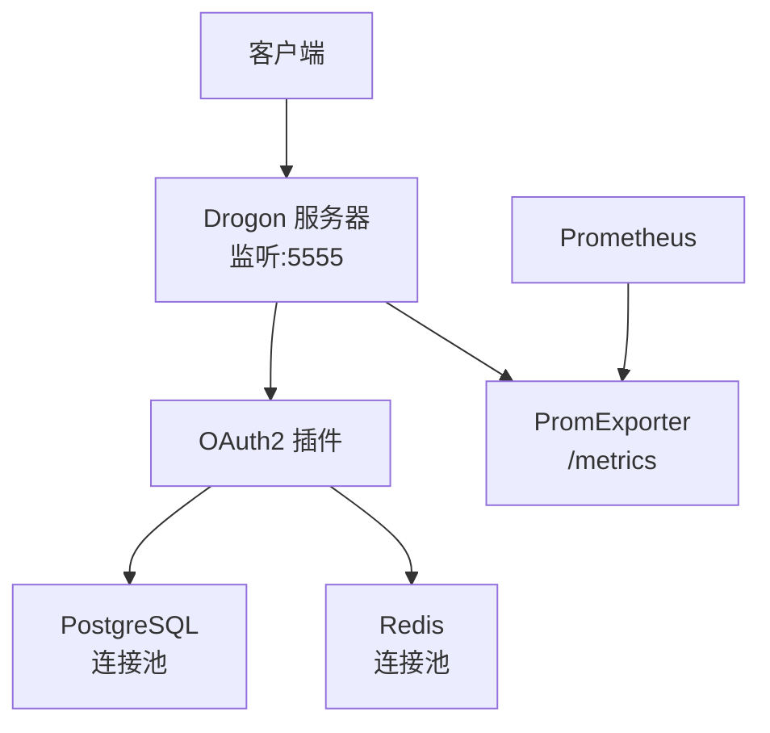
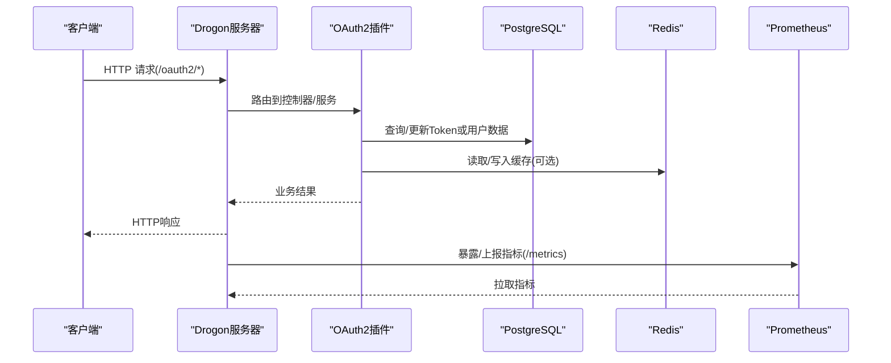
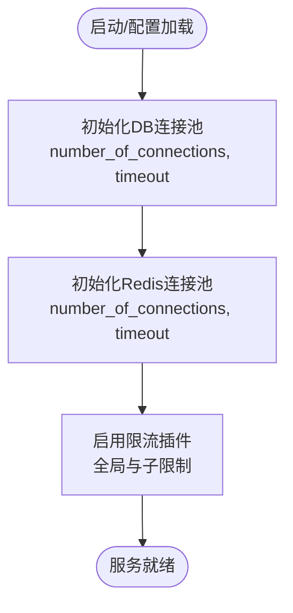
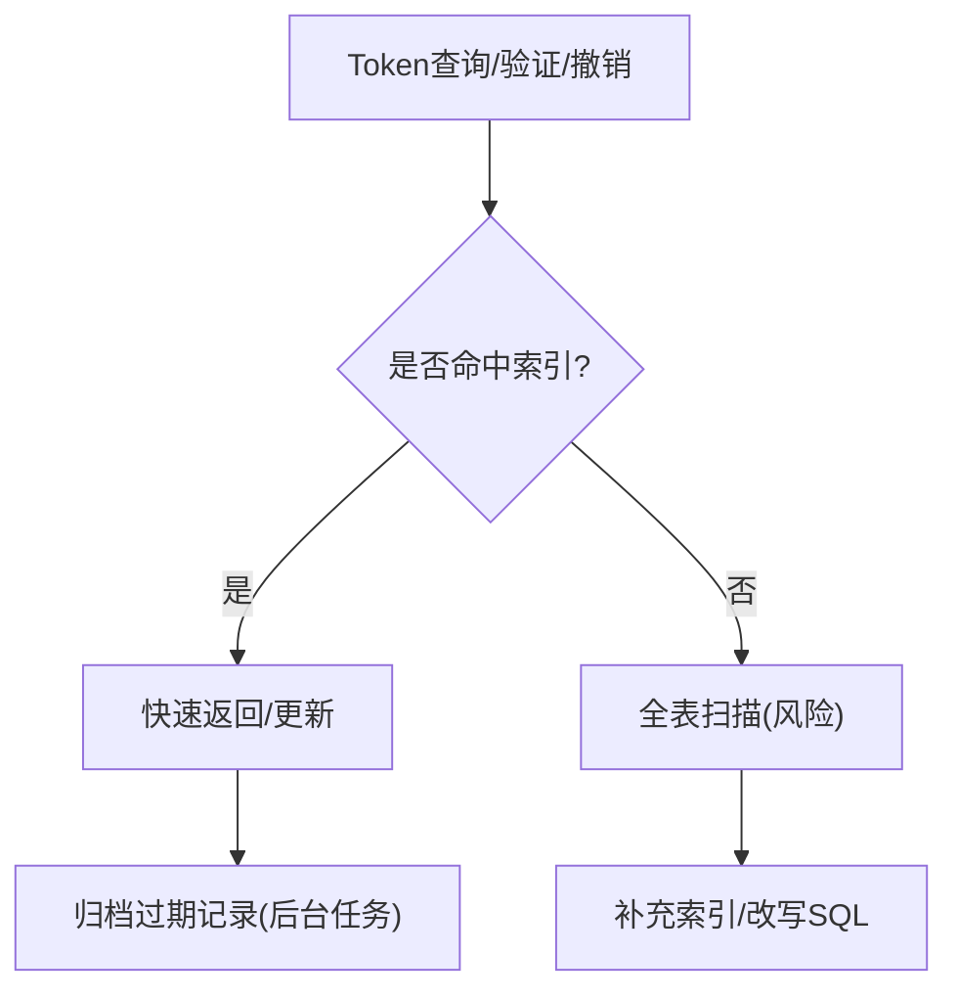
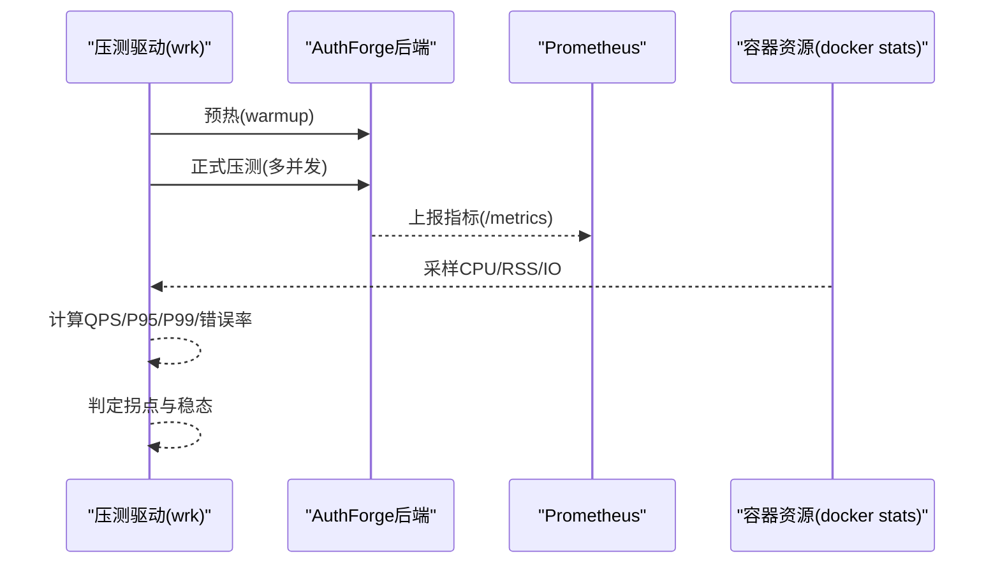
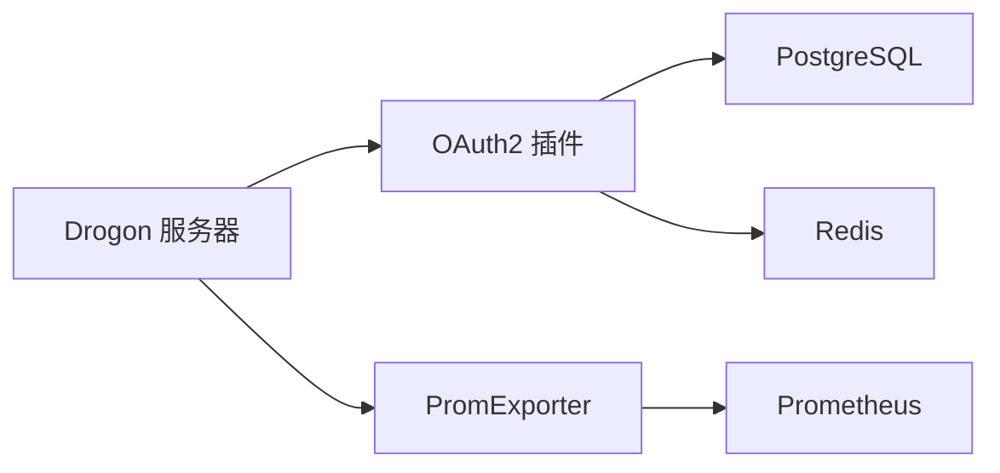

# 性能问题排查

<cite>
**本文引用的文件**
- [config.json](file://apps/server/config/config.json)
- [config.prod.json](file://apps/server/config/config.prod.json)
- [observability.md](file://docs/backend/observability.md)
- [docker-deployment.md](file://docs/backend/docker-deployment.md)
- [prometheus.yml](file://deploy/observability/prometheus.yml)
- [benchmark-facility-design.md](file://docs/productization-evolution/benchmark-facility-design.md)
- [2026-05-11-p1-P1_TECHNICAL_DESIGN.md](file://docs/history/design/superpowers/specs/2026-05-11-p1-P1_TECHNICAL_DESIGN.md)
- [2026-05-11-p1-phase2-controllers-design.md](file://docs/history/design/superpowers/specs/2026-05-11-p1-phase2-controllers-design.md)
- [PostgresRepositoryBase.h](file://libs/storage-postgres/include/authforge/storage/postgres/PostgresRepositoryBase.h)
- [V016__token_partitioning_prep.sql](file://apps/server/migrations/V016__token_partitioning_prep.sql)
- [PerformanceBenchmark.cc](file://tests/performance/benchmark/PerformanceBenchmark.cc)
- [DbLeakVerificationTest.cc](file://tests/security/injection/DbLeakVerificationTest.cc)
</cite>

## 目录
1. [简介](#简介)
2. [项目结构](#项目结构)
3. [核心组件](#核心组件)
4. [架构总览](#架构总览)
5. [详细组件分析](#详细组件分析)
6. [依赖关系分析](#依赖关系分析)
7. [性能考量](#性能考量)
8. [故障排查指南](#故障排查指南)
9. [结论](#结论)
10. [附录](#附录)

## 简介
本指南面向AuthForge在上线与高并发场景下的性能问题排查与调优，覆盖监控指标设置与解读、瓶颈定位工具与方法、连接池/缓存/数据库索引优化策略、基准测试实施与结果分析、以及分布式环境下的延迟与网络开销分析。文档内容严格基于仓库中的配置、设计文档与测试实现，帮助团队快速定位并解决性能问题，提升系统吞吐与稳定性。

## 项目结构
- 服务端配置与可观测性：
  - 应用监听端口、数据库与Redis连接池、Prometheus Exporter插件均在配置文件中声明。
  - 生产配置包含限流插件（Hodor）与更严格的日志级别。
- 可观测性与压测：
  - 提供Prometheus抓取配置与面板建议；设计了完整的HTTP级基准设施（wrk + Prometheus + docker stats）。
- 数据库与索引：
  - 针对高频Token查询的复合索引与归档函数，降低热点表扫描成本。
- 性能测试与回归：
  - 单元测试中包含性能基准与连接泄漏验证用例，确保关键路径性能与资源安全。

图表来源
- [config.json:1-40](file://apps/server/config/config.json#L1-L40)
- [config.prod.json:1-40](file://apps/server/config/config.prod.json#L1-L40)
- [prometheus.yml:1-8](file://deploy/observability/prometheus.yml#L1-L8)

章节来源
- [config.json:1-40](file://apps/server/config/config.json#L1-L40)
- [config.prod.json:1-40](file://apps/server/config/config.prod.json#L1-L40)
- [prometheus.yml:1-8](file://deploy/observability/prometheus.yml#L1-L8)

## 核心组件
- 可观测性指标（Prometheus）：
  - 请求总量、登录失败、Introspection/Revocation 请求与错误、关键步骤耗时直方图、活跃Token估算等。
  - 通过 `/metrics` 暴露，供Prometheus采集。
- 连接池与限流：
  - PostgreSQL与Redis连接池大小、超时、自动批处理等参数可调。
  - 生产环境启用Hodor限流，保护敏感端点（如登录、令牌交换、注册）。
- 数据库索引与归档：
  - 为Token表建立复合索引，支持按用户/客户端/有效性的高频查询；提供过期归档函数减少热表体积。
- 基准测试与稳态判定：
  - 使用wrk进行阶梯加压，结合Prometheus与容器资源采样，定义稳态容量与拐点判定规则。

章节来源
- [observability.md:1-30](file://docs/backend/observability.md#L1-L30)
- [config.json:9-40](file://apps/server/config/config.json#L9-L40)
- [config.prod.json:9-40](file://apps/server/config/config.prod.json#L9-L40)
- [V016__token_partitioning_prep.sql:1-35](file://apps/server/migrations/V016__token_partitioning_prep.sql#L1-L35)
- [benchmark-facility-design.md:213-247](file://docs/productization-evolution/benchmark-facility-design.md#L213-L247)

## 架构总览
下图展示从请求进入、鉴权与存储访问到指标采集的整体流程，体现关键性能节点（网络、鉴权、DB/Redis、指标导出）。

图表来源
- [config.json:133-170](file://apps/server/config/config.json#L133-L170)
- [config.prod.json:133-218](file://apps/server/config/config.prod.json#L133-L218)
- [observability.md:1-30](file://docs/backend/observability.md#L1-L30)
- [prometheus.yml:1-8](file://deploy/observability/prometheus.yml#L1-L8)

## 详细组件分析

### 监控指标与阈值
- 指标清单与用途：
  - 请求总量与错误率：用于识别异常流量与错误集中点。
  - Introspection/Revocation 请求与错误：评估令牌校验与撤销的性能与可靠性。
  - 关键步骤耗时直方图：用于计算P99/P95延迟，定位慢路径。
  - 活跃Token估算：观察负载趋势与缓存命中率变化。
- 告警阈值建议：
  - 单客户端每分钟请求数超过阈值、认证失败率升高、令牌查询超时率上升时触发告警。

章节来源
- [observability.md:1-30](file://docs/backend/observability.md#L1-L30)
- [2026-05-11-p1-phase2-controllers-design.md:394-446](file://docs/history/design/superpowers/specs/2026-05-11-p1-phase2-controllers-design.md#L394-L446)

### 连接池与限流配置
- 数据库连接池：
  - 开发/测试默认连接数较高，生产默认较低，需根据并发与后端能力调整。
  - 超时与语句超时控制避免长事务阻塞。
- Redis连接池：
  - 连接数与超时影响缓存命中与整体延迟。
- 限流（Hodor）：
  - 对登录、令牌交换、注册等敏感端点进行细粒度限流，防止滥用与雪崩。

图表来源
- [config.json:9-40](file://apps/server/config/config.json#L9-L40)
- [config.prod.json:9-40](file://apps/server/config/config.prod.json#L9-L40)
- [config.prod.json:142-188](file://apps/server/config/config.prod.json#L142-L188)

章节来源
- [config.json:9-40](file://apps/server/config/config.json#L9-L40)
- [config.prod.json:9-40](file://apps/server/config/config.prod.json#L9-L40)
- [config.prod.json:142-188](file://apps/server/config/config.prod.json#L142-L188)

### 数据库查询优化与索引
- 复合索引：
  - 针对活跃Token查找、用户/客户端维度的查询建立复合索引，显著降低扫描成本。
- 归档函数：
  - 将过期且作废的Token归档至历史表，保持主表轻量，提升查询性能。
- ORM与读库分离：
  - 基础仓储类维护主/从客户端指针，便于读写分离与连接管理。

图表来源
- [V016__token_partitioning_prep.sql:1-35](file://apps/server/migrations/V016__token_partitioning_prep.sql#L1-L35)
- [PostgresRepositoryBase.h:48-72](file://libs/storage-postgres/include/authforge/storage/postgres/PostgresRepositoryBase.h#L48-L72)

章节来源
- [V016__token_partitioning_prep.sql:1-35](file://apps/server/migrations/V016__token_partitioning_prep.sql#L1-L35)
- [PostgresRepositoryBase.h:48-72](file://libs/storage-postgres/include/authforge/storage/postgres/PostgresRepositoryBase.h#L48-L72)

### 缓存策略与失效
- 缓存装饰器：
  - 对读多写少、可安全缓存的仓储采用per-repository缓存装饰，避免整接口缓存带来的失效复杂度。
- 实时性要求：
  - Introspection结果不缓存以满足实时性；客户端认证可短期缓存以减少DB压力。
- 缓存命中率目标：
  - 正常负载下达到较高命中率，未命中额外延迟可控。

章节来源
- [2026-05-11-p1-phase2-controllers-design.md:394-446](file://docs/history/design/superpowers/specs/2026-05-11-p1-phase2-controllers-design.md#L394-L446)
- [2026-05-11-p1-P1_TECHNICAL_DESIGN.md:616-660](file://docs/history/design/superpowers/specs/2026-05-11-p1-P1_TECHNICAL_DESIGN.md#L616-L660)

### 基准测试与结果分析
- 压测方法：
  - 使用wrk进行阶梯式加压，每档前warmup，测量QPS与P50/P95/P99延迟，同时采集Prometheus指标与容器资源。
- 稳态判定：
  - 错误率低于阈值的最高档位作为稳态容量；连续两档QPS增幅小于阈值且P99陡升视为拐点。
- 冷启动测试：
  - 单独测量冷启动时间与RSS峰值，区分含迁移与预跑迁移两种模式。
- 结果输出：
  - 生成JSON与总结报告，记录环境元数据与重复性离散度。

图表来源
- [benchmark-facility-design.md:213-247](file://docs/productization-evolution/benchmark-facility-design.md#L213-L247)
- [observability.md:1-30](file://docs/backend/observability.md#L1-L30)

章节来源
- [benchmark-facility-design.md:213-247](file://docs/productization-evolution/benchmark-facility-design.md#L213-L247)
- [2026-05-11-p1-P1_TECHNICAL_DESIGN.md:616-660](file://docs/history/design/superpowers/specs/2026-05-11-p1-P1_TECHNICAL_DESIGN.md#L616-L660)

### 分布式环境下的延迟与网络开销
- 微服务间调用：
  - 通过Prometheus指标与结构化日志关联请求ID，追踪跨服务调用链路与耗时分布。
- 网络开销分析：
  - 使用容器网络与Prometheus抓取同一内网，避免公网抖动；必要时在Nginx/Traefik层统计转发耗时。
- 限流与降级：
  - 在高并发下通过限流保护后端，必要时对非关键路径降级以保障核心功能可用。

章节来源
- [observability.md:31-100](file://docs/backend/observability.md#L31-L100)
- [docker-deployment.md:139-202](file://docs/backend/docker-deployment.md#L139-L202)

## 依赖关系分析
- 组件耦合：
  - 服务器框架（Drogon）承载控制器与插件；OAuth2插件依赖存储层（PostgreSQL/Redis）；PromExporter暴露指标。
- 外部依赖：
  - PostgreSQL与Redis作为持久化与缓存；Prometheus作为指标采集器。
- 潜在循环依赖：
  - 存储层与插件之间通过接口解耦，避免直接循环引用。

图表来源
- [config.json:133-170](file://apps/server/config/config.json#L133-L170)
- [config.prod.json:133-218](file://apps/server/config/config.prod.json#L133-L218)
- [prometheus.yml:1-8](file://deploy/observability/prometheus.yml#L1-L8)

章节来源
- [config.json:133-170](file://apps/server/config/config.json#L133-L170)
- [config.prod.json:133-218](file://apps/server/config/config.prod.json#L133-L218)
- [prometheus.yml:1-8](file://deploy/observability/prometheus.yml#L1-L8)

## 性能考量
- 关键性能目标：
  - Token操作延迟、数据库查询目标、负载处理能力、缓存命中率与Redis操作延迟均有明确目标。
- 资源观测：
  - 压测期间同步采集应用指标、容器资源与后端依赖状态，判断瓶颈位置（server vs DB/Cache）。
- 冷启动与稳态：
  - 冷启动单独测量，稳态容量以错误率门槛为准，避免噪声干扰。

章节来源
- [2026-05-11-p1-P1_TECHNICAL_DESIGN.md:616-660](file://docs/history/design/superpowers/specs/2026-05-11-p1-P1_TECHNICAL_DESIGN.md#L616-L660)
- [benchmark-facility-design.md:238-247](file://docs/productization-evolution/benchmark-facility-design.md#L238-L247)

## 故障排查指南
- 常见症状与定位：
  - 连接池耗尽：检查数据库连接数与超时配置，确认是否存在连接泄漏。
  - 高延迟：查看Prometheus直方图与Grafana面板，定位慢路径（DB/Redis/网络）。
  - 错误率上升：关注登录失败、Introspection/Revocation错误计数，结合限流与账户锁定策略。
- 工具与命令：
  - 使用Prometheus查询指标与Grafana面板；使用容器资源采样观察CPU/RSS/IO。
  - 通过脚本与测试用例验证连接池行为与性能基线。
- 回归与验证：
  - 运行性能基准与连接泄漏验证用例，确保修复有效且不引入退化。

章节来源
- [DbLeakVerificationTest.cc:79-118](file://tests/security/injection/DbLeakVerificationTest.cc#L79-L118)
- [PerformanceBenchmark.cc:1-77](file://tests/performance/benchmark/PerformanceBenchmark.cc#L1-L77)
- [observability.md:1-30](file://docs/backend/observability.md#L1-L30)

## 结论
通过完善的监控指标、合理的连接池与缓存策略、数据库索引优化与系统的基准测试，AuthForge能够在高并发场景下保持稳定与高性能。建议在生产环境中持续采集与分析指标，结合压测与回归测试，逐步优化并验证变更效果。

## 附录
- 生产部署建议：
  - 屏蔽对外暴露的 `/metrics` 端点，仅允许Prometheus内网访问。
  - 调整数据库连接池大小与超时，匹配实际并发与后端能力。
- 参考文档：
  - 可观测性设计与面板示例；基准设施设计与实施步骤。

章节来源
- [docker-deployment.md:139-202](file://docs/backend/docker-deployment.md#L139-L202)
- [benchmark-facility-design.md:213-247](file://docs/productization-evolution/benchmark-facility-design.md#L213-L247)