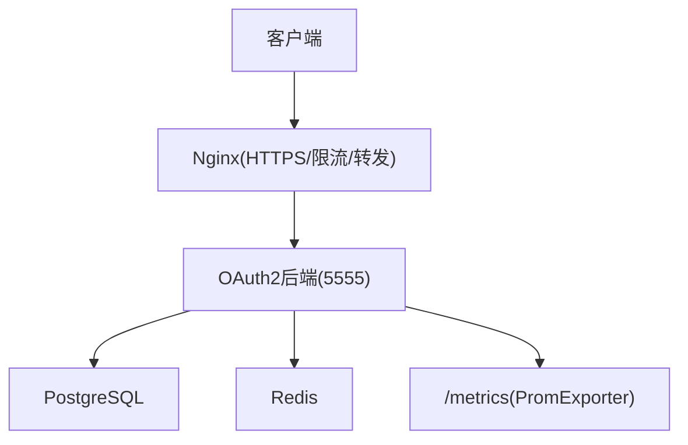
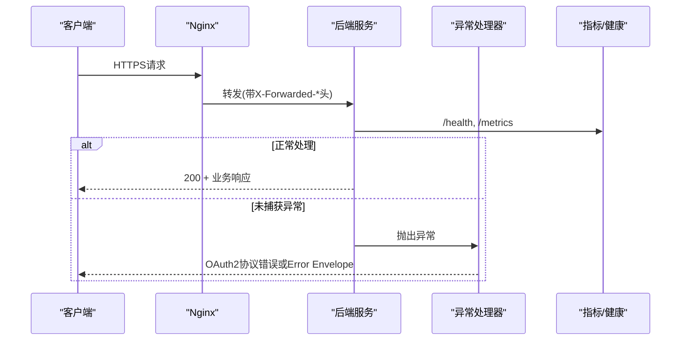
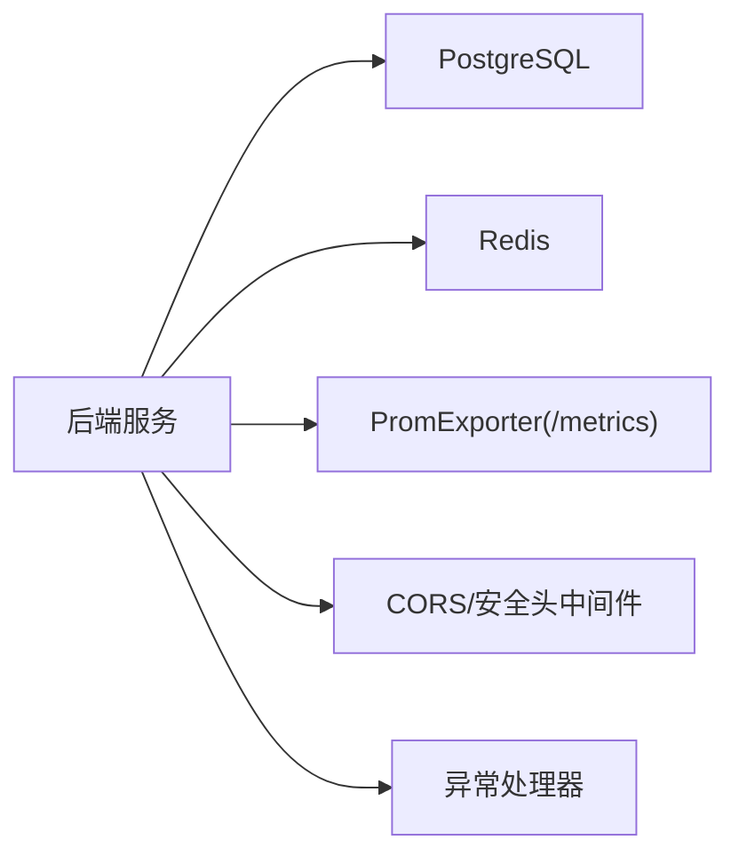

# 故障排查指南

<cite>
**本文引用的文件**
- [ExceptionHandlerSetup.cc](file://apps/server/src/bootstrap/ExceptionHandlerSetup.cc)
- [CorsSetup.cc](file://apps/server/src/bootstrap/CorsSetup.cc)
- [SecurityHeaders.cc](file://apps/server/src/bootstrap/SecurityHeaders.cc)
- [config.json](file://apps/server/config/config.json)
- [config.dev.json](file://apps/server/config/config.dev.json)
- [config.prod.json](file://apps/server/config/config.prod.json)
- [nginx.conf](file://deploy/nginx/nginx.conf)
- [prometheus.yml](file://deploy/observability/prometheus.yml)
- [account-lockout.md](file://docs/ops/account-lockout.md)
- [reset-account-lockout.sh](file://scripts/backend/reset-account-lockout.sh)
- [V013__account_lockout.sql](file://apps/server/migrations/V013__account_lockout.sql)
- [IUserRepository.h](file://libs/identity/include/authforge/identity/IUserRepository.h)
- [AuthService.cc](file://libs/identity/src/AuthService.cc)
- [Metrics.cc](file://libs/drogon/src/observability/Metrics.cc)
- [HealthEndpointHttpTest.cc](file://tests/integration/controllers/HealthEndpointHttpTest.cc)
- [docker-deployment.md](file://docs/backend/docker-deployment.md)
</cite>

## 目录
1. [简介](#简介)
2. [项目结构](#项目结构)
3. [核心组件](#核心组件)
4. [架构总览](#架构总览)
5. [详细组件分析](#详细组件分析)
6. [依赖关系分析](#依赖关系分析)
7. [性能注意事项](#性能注意事项)
8. [故障排查指南](#故障排查指南)
9. [结论](#结论)
10. [附录](#附录)

## 简介
本指南面向运维与开发人员，提供AuthForge在启动、数据库连接、认证流程、账户锁定、网络（CORS/SSL/代理）、性能监控与容量规划等方面的系统化故障排查方法。文档基于仓库中的实际实现与配置，给出可操作的步骤、关键日志定位技巧与优化建议。

## 项目结构
- 后端服务：Drogon应用，监听端口由配置文件定义，默认5555；通过插件暴露Prometheus指标端点。
- 存储层：PostgreSQL与Redis，连接池大小、超时等参数在配置中集中管理。
- 安全与网络：CORS白名单严格匹配；Nginx作为反向代理负责TLS终止、限流与转发头设置。
- 可观测性：结构化日志与Prometheus指标，健康检查端点用于存活与就绪探测。

图表来源
- [nginx.conf:58-115](file://deploy/nginx/nginx.conf#L58-L115)
- [config.json:1-40](file://apps/server/config/config.json#L1-L40)
- [prometheus.yml:1-8](file://deploy/observability/prometheus.yml#L1-L8)

章节来源
- [config.json:1-40](file://apps/server/config/config.json#L1-L40)
- [nginx.conf:58-115](file://deploy/nginx/nginx.conf#L58-L115)
- [prometheus.yml:1-8](file://deploy/observability/prometheus.yml#L1-L8)

## 核心组件
- 异常处理：全局异常处理器区分OAuth2协议路径与应用路径，统一错误信封并注入CORS头。
- CORS策略：仅允许精确匹配的Origin，预检失败返回403。
- 安全响应头：为HTML页面设置严格CSP，HTTPS时启用HSTS。
- 配置中心：监听地址、数据库/Redis连接池、日志级别、插件等。
- 可观测性：Prometheus指标导出器，健康检查端点。

章节来源
- [ExceptionHandlerSetup.cc:13-63](file://apps/server/src/bootstrap/ExceptionHandlerSetup.cc#L13-L63)
- [CorsSetup.cc:8-80](file://apps/server/src/bootstrap/CorsSetup.cc#L8-L80)
- [SecurityHeaders.cc:8-60](file://apps/server/src/bootstrap/SecurityHeaders.cc#L8-L60)
- [config.json:102-131](file://apps/server/config/config.json#L102-L131)
- [config.json:133-170](file://apps/server/config/config.json#L133-L170)

## 架构总览

图表来源
- [ExceptionHandlerSetup.cc:13-63](file://apps/server/src/bootstrap/ExceptionHandlerSetup.cc#L13-L63)
- [nginx.conf:58-115](file://deploy/nginx/nginx.conf#L58-L115)

## 详细组件分析

### 异常处理与错误信封
- 全局异常处理器根据请求路径判断是否为OAuth2协议端点，分别发送RFC 6749错误或统一Error Envelope，并保证CORS头注入。
- 适用于快速定位“未捕获异常”导致的500或协议错误。

章节来源
- [ExceptionHandlerSetup.cc:13-63](file://apps/server/src/bootstrap/ExceptionHandlerSetup.cc#L13-L63)

### CORS与安全头
- CORS采用严格白名单模式，OPTIONS预检不匹配即返回403。
- 对HTML响应附加严格CSP，HTTPS场景下添加HSTS。

章节来源
- [CorsSetup.cc:8-80](file://apps/server/src/bootstrap/CorsSetup.cc#L8-L80)
- [SecurityHeaders.cc:8-60](file://apps/server/src/bootstrap/SecurityHeaders.cc#L8-L60)

### 配置与运行参数
- 监听端口、数据库/Redis连接池大小、超时、日志级别、插件等均在配置文件中集中管理。
- 开发/生产环境存在不同配置，注意切换。

章节来源
- [config.json:1-40](file://apps/server/config/config.json#L1-L40)
- [config.json:102-131](file://apps/server/config/config.json#L102-L131)
- [config.json:133-170](file://apps/server/config/config.json#L133-L170)
- [config.dev.json:1-40](file://apps/server/config/config.dev.json#L1-L40)
- [config.prod.json:1-40](file://apps/server/config/config.prod.json#L1-L40)

### 账号锁定机制
- 用户多次登录失败会触发渐进式锁定，字段包括失败次数、锁定截止时间、最近失败时间。
- 提供脚本重置锁定状态，支持指定用户或全部用户。

章节来源
- [V013__account_lockout.sql:1-6](file://apps/server/migrations/V013__account_lockout.sql#L1-L6)
- [account-lockout.md:1-238](file://docs/ops/account-lockout.md#L1-L238)
- [reset-account-lockout.sh:1-36](file://scripts/backend/reset-account-lockout.sh#L1-L36)
- [IUserRepository.h:87-128](file://libs/identity/include/authforge/identity/IUserRepository.h#L87-L128)
- [AuthService.cc:205-237](file://libs/identity/src/AuthService.cc#L205-L237)

### 健康检查与可观测性
- 健康检查端点包含liveness与readiness，便于编排与健康探针。
- Prometheus指标通过Exporters暴露，便于采集与告警。

章节来源
- [HealthEndpointHttpTest.cc:1-32](file://tests/integration/controllers/HealthEndpointHttpTest.cc#L1-L32)
- [prometheus.yml:1-8](file://deploy/observability/prometheus.yml#L1-L8)
- [Metrics.cc:1-36](file://libs/drogon/src/observability/Metrics.cc#L1-L36)
- [docker-deployment.md:139-202](file://docs/backend/docker-deployment.md#L139-L202)

## 依赖关系分析

图表来源
- [config.json:9-40](file://apps/server/config/config.json#L9-L40)
- [config.json:133-170](file://apps/server/config/config.json#L133-L170)
- [ExceptionHandlerSetup.cc:13-63](file://apps/server/src/bootstrap/ExceptionHandlerSetup.cc#L13-L63)
- [CorsSetup.cc:8-80](file://apps/server/src/bootstrap/CorsSetup.cc#L8-L80)

章节来源
- [config.json:9-40](file://apps/server/config/config.json#L9-L40)
- [config.json:133-170](file://apps/server/config/config.json#L133-L170)

## 性能注意事项
- 连接池与超时：根据并发调整数据库/Redis连接池大小与超时，避免连接耗尽导致请求堆积。
- 指标采集：确保Prometheus正确抓取后端指标，关注QPS、错误率、延迟分布与活跃Token数。
- 缓存命中率：在高并发下保持高缓存命中率，降低DB压力。
- 反向代理限流：Nginx对敏感接口进行限流，防止滥用。

章节来源
- [config.json:9-40](file://apps/server/config/config.json#L9-L40)
- [prometheus.yml:1-8](file://deploy/observability/prometheus.yml#L1-L8)
- [Metrics.cc:1-36](file://libs/drogon/src/observability/Metrics.cc#L1-L36)
- [nginx.conf:58-115](file://deploy/nginx/nginx.conf#L58-L115)

## 故障排查指南

### 一、服务启动失败
可能原因与排查步骤
- 监听端口冲突：确认端口未被占用，必要时修改监听配置。
- 插件加载失败：检查PromExporter与OAuth2Plugin配置是否正确。
- 环境变量覆盖：生产环境通过环境变量覆盖数据库/Redis密码，确认已正确传入。
- 健康检查：使用健康端点验证服务是否真正可用。

操作要点
- 查看监听端口与插件配置。
- 检查日志级别与输出路径，定位启动阶段异常。
- 使用健康端点进行快速验证。

章节来源
- [config.json:1-40](file://apps/server/config/config.json#L1-L40)
- [config.json:133-170](file://apps/server/config/config.json#L133-L170)
- [config.prod.json:1-40](file://apps/server/config/config.prod.json#L1-L40)
- [HealthEndpointHttpTest.cc:1-32](file://tests/integration/controllers/HealthEndpointHttpTest.cc#L1-L32)

### 二、数据库连接错误
常见症状
- 启动时报连接失败、查询超时或连接池耗尽。
- 健康检查ready端点返回不可用。

排查步骤
- 核对数据库主机、端口、库名、用户名、密码是否与配置一致。
- 检查连接池大小与超时设置是否合理。
- 使用健康检查与工具命令验证数据库可达性与权限。
- 观察日志中的SQL执行时间与错误信息。

优化建议
- 适当增大连接池与statement_timeout，结合压测确定最佳值。
- 在生产环境中将数据库与Redis部署到独立容器或服务，减少网络抖动影响。

章节来源
- [config.json:9-40](file://apps/server/config/config.json#L9-L40)
- [config.dev.json:9-40](file://apps/server/config/config.dev.json#L9-L40)
- [config.prod.json:9-40](file://apps/server/config/config.prod.json#L9-L40)
- [docker-deployment.md:139-202](file://docs/backend/docker-deployment.md#L139-L202)

### 三、认证失败
可能原因
- 密码错误、账户被锁定、MFA校验失败、外部身份源配置不正确。
- 注册重复用户名/邮箱、设备码无效、令牌无效等。

排查步骤
- 查看登录失败计数与锁定状态，必要时重置锁定。
- 检查MFA配置与验证码。
- 检查外部第三方登录的client_id/secret与回调地址。
- 关注错误码与错误信封，定位具体失败原因。

优化建议
- 对高频失败路径增加告警与限流。
- 对外部身份源配置进行定期校验与自动发现。

章节来源
- [account-lockout.md:1-238](file://docs/ops/account-lockout.md#L1-L238)
- [IUserRepository.h:87-128](file://libs/identity/include/authforge/identity/IUserRepository.h#L87-L128)
- [AuthService.cc:205-237](file://libs/identity/src/AuthService.cc#L205-L237)

### 四、错误日志分析技巧
- 日志级别：根据问题阶段调整日志级别（DEBUG/INFO/WARN/ERROR），生产建议INFO+WARN。
- 关键错误识别：
  - 未捕获异常：全局异常处理器会记录路径与异常信息。
  - 数据库异常：关注DB_QUERY_ERROR与语句超时。
  - 认证失败：关注登录失败计数与锁定事件。
- 分析方法：
  - 按Request ID追踪一次请求的全链路日志。
  - 结合Prometheus指标（QPS、错误率、延迟）定位瓶颈。
  - 使用健康端点与Nginx访问日志交叉验证。

章节来源
- [ExceptionHandlerSetup.cc:13-63](file://apps/server/src/bootstrap/ExceptionHandlerSetup.cc#L13-L63)
- [config.json:102-131](file://apps/server/config/config.json#L102-L131)
- [Metrics.cc:1-36](file://libs/drogon/src/observability/Metrics.cc#L1-L36)

### 五、性能问题定位与优化
- 监控指标：
  - QPS与错误率：oauth2_requests_total、oauth2_login_failures_total。
  - 延迟分布：oauth2_latency_seconds。
  - 活跃Token：oauth2_active_tokens。
- 瓶颈分析：
  - 数据库慢查询：关注statement_timeout与连接池使用率。
  - Redis热点键：关注缓存命中率与读写延迟。
  - 前端代理限流：观察Nginx限流命中情况。
- 优化建议：
  - 调整连接池大小与超时。
  - 增加缓存命中率，减少DB压力。
  - 针对敏感接口实施更严格的限流与熔断。

章节来源
- [prometheus.yml:1-8](file://deploy/observability/prometheus.yml#L1-L8)
- [Metrics.cc:1-36](file://libs/drogon/src/observability/Metrics.cc#L1-L36)
- [nginx.conf:58-115](file://deploy/nginx/nginx.conf#L58-L115)

### 六、账户锁定机制与解锁流程
工作原理
- 多次登录失败后，系统记录失败次数并设置锁定截止时间，达到阈值后拒绝登录。
- 成功登录后重置失败计数。

自动解锁
- 到达locked_until时间后自动解锁。

手动解锁
- 使用脚本重置单个用户或所有用户的锁定状态。
- 直接SQL更新users表中的failed_login_count与locked_until。

章节来源
- [V013__account_lockout.sql:1-6](file://apps/server/migrations/V013__account_lockout.sql#L1-L6)
- [account-lockout.md:1-238](file://docs/ops/account-lockout.md#L1-L238)
- [reset-account-lockout.sh:1-36](file://scripts/backend/reset-account-lockout.sh#L1-L36)
- [IUserRepository.h:87-128](file://libs/identity/include/authforge/identity/IUserRepository.h#L87-L128)
- [AuthService.cc:205-237](file://libs/identity/src/AuthService.cc#L205-L237)

### 七、网络问题排查（CORS、SSL、代理）
CORS
- 严格白名单匹配，预检失败返回403。
- 检查Origin是否在allow_origins列表中。

SSL证书
- Nginx负责TLS终止，确保证书路径与域名匹配。
- HSTS仅在HTTPS时生效，需确保X-Forwarded-Proto正确传递。

代理配置
- Nginx转发时需设置Host、X-Real-IP、X-Forwarded-For、X-Forwarded-Proto。
- 限制/metrics端点仅内网访问。

章节来源
- [CorsSetup.cc:8-80](file://apps/server/src/bootstrap/CorsSetup.cc#L8-L80)
- [SecurityHeaders.cc:8-60](file://apps/server/src/bootstrap/SecurityHeaders.cc#L8-L60)
- [nginx.conf:58-115](file://deploy/nginx/nginx.conf#L58-L115)

### 八、系统资源监控与容量规划
- 资源监控：
  - 使用Prometheus采集后端指标，结合Grafana展示QPS、错误率、延迟。
  - 监控数据库与Redis的连接数、内存与磁盘使用。
- 容量规划：
  - 根据压测结果设定连接池大小与线程数。
  - 预估峰值QPS与突发流量，预留缓冲。
  - 对关键接口实施限流与降级策略。

章节来源
- [prometheus.yml:1-8](file://deploy/observability/prometheus.yml#L1-L8)
- [docker-deployment.md:139-202](file://docs/backend/docker-deployment.md#L139-L202)

## 结论
通过统一的异常处理、严格的CORS策略、完善的健康检查与可观测性体系，AuthForge提供了可靠的故障定位与恢复能力。结合合理的配置调优与容量规划，可有效提升系统的稳定性与性能。建议在生产环境中持续监控关键指标，及时告警与扩容，确保服务SLA。

## 附录
- 常用命令
  - 健康检查：curl http://localhost:5555/health/live
  - 指标抓取：curl http://localhost:5555/metrics
  - 数据库连通性：pg_isready -U <user> -d <db>
  - Redis连通性：redis-cli -a <password> ping
- 参考文档
  - 账号锁定机制说明与操作手册
  - Docker部署与监控配置

章节来源
- [HealthEndpointHttpTest.cc:1-32](file://tests/integration/controllers/HealthEndpointHttpTest.cc#L1-L32)
- [prometheus.yml:1-8](file://deploy/observability/prometheus.yml#L1-L8)
- [account-lockout.md:1-238](file://docs/ops/account-lockout.md#L1-L238)
- [docker-deployment.md:139-202](file://docs/backend/docker-deployment.md#L139-L202)