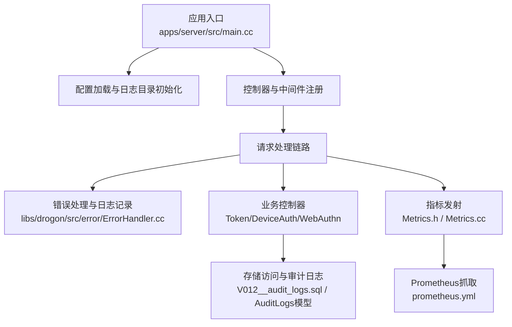
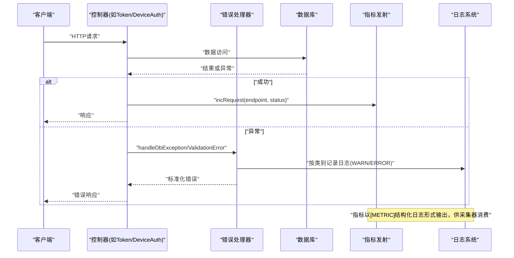
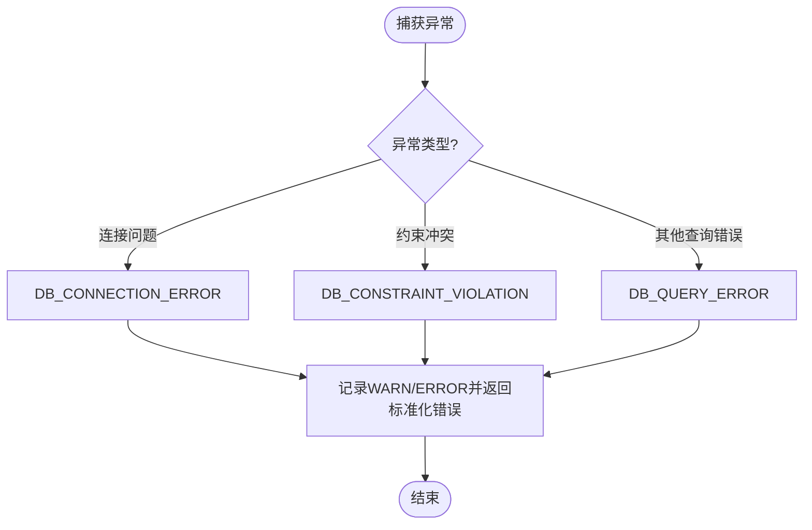
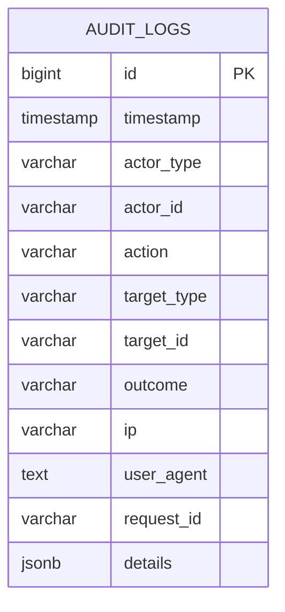
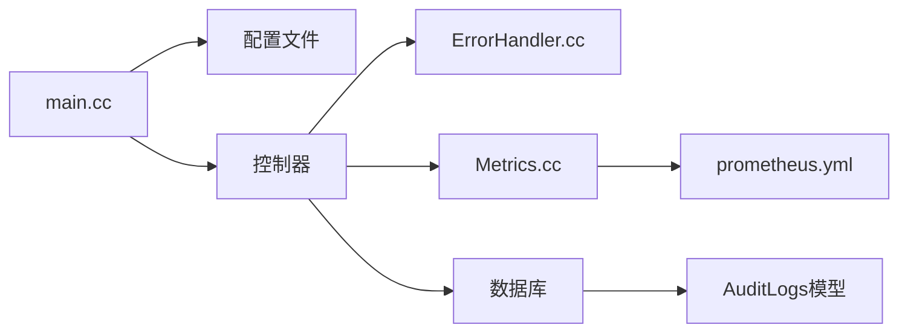

# 日志分析指南

<cite>
**本文引用的文件**
- [apps/server/src/main.cc](file://apps/server/src/main.cc)
- [apps/server/config/config.prod.json](file://apps/server/config/config.prod.json)
- [apps/server/config/config.dev.json](file://apps/server/config/config.dev.json)
- [docs/backend/observability.md](file://docs/backend/observability.md)
- [libs/common/include/authforge/common/ports/ILogger.h](file://libs/common/include/authforge/common/ports/ILogger.h)
- [libs/drogon/src/error/ErrorHandler.cc](file://libs/drogon/src/error/ErrorHandler.cc)
- [libs/drogon/src/controllers/TokenEndpointController.cc](file://libs/drogon/src/controllers/TokenEndpointController.cc)
- [libs/drogon/src/controllers/DeviceAuthController.cc](file://libs/drogon/src/controllers/DeviceAuthController.cc)
- [libs/drogon/src/controllers/WebAuthnController.cc](file://libs/drogon/src/controllers/WebAuthnController.cc)
- [libs/storage-postgres/src/models/AuditLogs.cc](file://libs/storage-postgres/src/models/AuditLogs.cc)
- [apps/server/migrations/V012__audit_logs.sql](file://apps/server/migrations/V012__audit_logs.sql)
- [libs/drogon/include/authforge/drogon/observability/Metrics.h](file://libs/drogon/include/authforge/drogon/observability/Metrics.h)
- [libs/drogon/src/observability/Metrics.cc](file://libs/drogon/src/observability/Metrics.cc)
- [deploy/observability/prometheus.yml](file://deploy/observability/prometheus.yml)
</cite>

## 目录
1. [简介](#简介)
2. [项目结构](#项目结构)
3. [核心组件](#核心组件)
4. [架构总览](#架构总览)
5. [详细组件分析](#详细组件分析)
6. [依赖关系分析](#依赖关系分析)
7. [性能考量](#性能考量)
8. [故障排查指南](#故障排查指南)
9. [结论](#结论)
10. [附录](#附录)

## 简介
本指南面向运维与SRE工程师，系统化说明 AuthForge 的日志级别配置与管理、关键错误日志识别方法、日志分析方法论（时间序列分析、错误模式识别、性能瓶颈定位）、结构化日志解析（含JSON审计日志），以及日志聚合与监控工具（Prometheus/Grafana Loki等）的使用。文档结合代码与配置，提供可操作的排障步骤与最佳实践。

## 项目结构
- 应用入口负责加载配置、创建日志目录、注册控制器与中间件、启动服务。日志级别由配置文件统一控制。
- 可观测性文档定义了结构化日志格式、审计日志标记、上下文RequestId注入方式，以及指标暴露端点。
- 存储层包含审计日志表结构，便于持久化安全事件。
- 错误处理模块将异常转换为标准错误码并记录日志，同时为数据库异常分类。

**图示来源**
- [apps/server/src/main.cc:97-238](file://apps/server/src/main.cc#L97-L238)
- [docs/backend/observability.md:32-91](file://docs/backend/observability.md#L32-L91)
- [apps/server/migrations/V012__audit_logs.sql:1-22](file://apps/server/migrations/V012__audit_logs.sql#L1-L22)
- [libs/drogon/include/authforge/drogon/observability/Metrics.h:1-34](file://libs/drogon/include/authforge/drogon/observability/Metrics.h#L1-L34)
- [libs/drogon/src/observability/Metrics.cc:1-36](file://libs/drogon/src/observability/Metrics.cc#L1-L36)
- [deploy/observability/prometheus.yml:1-8](file://deploy/observability/prometheus.yml#L1-L8)

**章节来源**
- [apps/server/src/main.cc:97-238](file://apps/server/src/main.cc#L97-L238)
- [docs/backend/observability.md:32-91](file://docs/backend/observability.md#L32-L91)

## 核心组件
- 日志级别与输出：系统采用六级日志（trace < debug < info < warn < error < fatal），生产默认INFO，开发默认DEBUG；可通过配置动态调整。
- 结构化日志：审计日志带[AUDIT]标记，上下文日志自动附带RequestId，便于关联追踪。
- 错误处理：统一将异常转为标准错误码，按类别选择日志级别，并保留内部细节。
- 指标与监控：通过PromExporter暴露指标，支持Grafana面板展示QPS、错误率、延迟分布等。

**章节来源**
- [docs/backend/observability.md:64-91](file://docs/backend/observability.md#L64-L91)
- [libs/drogon/src/error/ErrorHandler.cc:16-43](file://libs/drogon/src/error/ErrorHandler.cc#L16-L43)
- [libs/drogon/include/authforge/drogon/observability/Metrics.h:1-34](file://libs/drogon/include/authforge/drogon/observability/Metrics.h#L1-L34)

## 架构总览
下图展示了从请求进入、控制器处理、错误处理到指标发射与日志落盘的整体流程，体现日志与指标的耦合点。

**图示来源**
- [libs/drogon/src/controllers/TokenEndpointController.cc:1286-1309](file://libs/drogon/src/controllers/TokenEndpointController.cc#L1286-L1309)
- [libs/drogon/src/controllers/DeviceAuthController.cc:351-389](file://libs/drogon/src/controllers/DeviceAuthController.cc#L351-L389)
- [libs/drogon/src/error/ErrorHandler.cc:52-81](file://libs/drogon/src/error/ErrorHandler.cc#L52-L81)
- [libs/drogon/src/observability/Metrics.cc:19-35](file://libs/drogon/src/observability/Metrics.cc#L19-L35)

## 详细组件分析

### 日志级别配置与管理
- 配置位置：生产环境默认INFO，开发环境默认DEBUG；可通过app.log.log_level动态调整。
- 日志目录：启动时根据配置创建日志目录，失败时记录错误。
- 建议：生产保持INFO及以上，按需开启DEBUG/TRACE用于问题复现；避免在生产长期开启高粒度日志。

**章节来源**
- [apps/server/config/config.prod.json:101-109](file://apps/server/config/config.prod.json#L101-L109)
- [apps/server/config/config.dev.json:101-109](file://apps/server/config/config.dev.json#L101-L109)
- [apps/server/src/main.cc:42-73](file://apps/server/src/main.cc#L42-L73)
- [docs/backend/observability.md:64-91](file://docs/backend/observability.md#L64-L91)

### 关键错误日志识别
- 认证失败：AUTHENTICATION类错误通常记录为ERROR，包含错误码与消息，可用于统计登录失败趋势。
- 授权拒绝：AUTHORIZATION类错误记录为ERROR，常用于权限不足或访问被拒场景。
- 数据库异常：handleDbException将底层异常映射为DB_CONNECTION_ERROR、DB_CONSTRAINT_VIOLATION、DB_QUERY_ERROR三类，便于快速定位。
- 网络超时/限流：Hodor限流返回VALIDATION_RATE_LIMITED，配合指标oauth2_requests_total与oauth2_login_failures_total观察峰值与拒绝率。

**图示来源**
- [libs/drogon/src/error/ErrorHandler.cc:52-81](file://libs/drogon/src/error/ErrorHandler.cc#L52-L81)

**章节来源**
- [libs/drogon/src/error/ErrorHandler.cc:16-43](file://libs/drogon/src/error/ErrorHandler.cc#L16-L43)
- [libs/drogon/src/controllers/DeviceAuthController.cc:351-389](file://libs/drogon/src/controllers/DeviceAuthController.cc#L351-L389)
- [libs/drogon/src/controllers/WebAuthnController.cc:693-706](file://libs/drogon/src/controllers/WebAuthnController.cc#L693-L706)

### 日志分析方法论
- 时间序列分析：使用PromQL对oauth2_requests_total、oauth2_login_failures_total进行rate计算，观察QPS与错误率变化；对oauth2_latency_seconds使用histogram_quantile评估P99/P95延迟。
- 错误模式识别：基于错误码（如DB_CONNECTION_ERROR、VALIDATION_DEVICE_CODE_INVALID、VALIDATION_RATE_LIMITED）进行聚类，结合RequestId关联请求链路。
- 性能瓶颈定位：通过指标中的operation与storage标签，定位慢操作与存储后端瓶颈；结合审计日志与上下文日志定位具体调用路径。

**章节来源**
- [docs/backend/observability.md:1-30](file://docs/backend/observability.md#L1-L30)
- [libs/drogon/include/authforge/drogon/observability/Metrics.h:1-34](file://libs/drogon/include/authforge/drogon/observability/Metrics.h#L1-L34)

### 结构化日志解析与处理
- 审计日志：[AUDIT]标记的安全事件，包含Action、User、Client、Success、IP等字段，适合入库后做合规审计与回溯。
- 上下文日志：所有日志自动附带RequestId，便于跨服务追踪。
- JSON审计模型：AuditLogs表提供timestamp、actor_type、action、outcome、ip、user_agent、request_id、details(JSONB)等字段，便于结构化查询与分析。

**图示来源**
- [apps/server/migrations/V012__audit_logs.sql:1-22](file://apps/server/migrations/V012__audit_logs.sql#L1-L22)
- [libs/storage-postgres/src/models/AuditLogs.cc:409-456](file://libs/storage-postgres/src/models/AuditLogs.cc#L409-L456)

**章节来源**
- [docs/backend/observability.md:32-56](file://docs/backend/observability.md#L32-L56)
- [apps/server/migrations/V012__audit_logs.sql:1-22](file://apps/server/migrations/V012__audit_logs.sql#L1-L22)
- [libs/storage-postgres/src/models/AuditLogs.cc:409-456](file://libs/storage-postgres/src/models/AuditLogs.cc#L409-L456)

### 日志聚合与监控工具
- Prometheus抓取：通过PromExporter插件暴露/metrics端点，prometheus.yml配置抓取目标。
- Grafana面板：建议构建QPS与错误率、P99延迟、活跃Token等面板，辅助实时监控。
- 日志采集：可将[METRIC]与[AUDIT]结构化日志接入ELK/Loki，实现集中检索与告警。

**章节来源**
- [deploy/observability/prometheus.yml:1-8](file://deploy/observability/prometheus.yml#L1-L8)
- [docs/backend/observability.md:1-30](file://docs/backend/observability.md#L1-L30)

## 依赖关系分析
- 入口main.cc负责装配与启动，读取配置并创建日志目录。
- 控制器依赖错误处理器进行异常转换与日志记录。
- 指标发射模块以结构化日志形式输出指标，供Prometheus抓取。
- 审计日志模型与迁移脚本支撑持久化安全事件。

**图示来源**
- [apps/server/src/main.cc:97-238](file://apps/server/src/main.cc#L97-L238)
- [libs/drogon/src/error/ErrorHandler.cc:16-43](file://libs/drogon/src/error/ErrorHandler.cc#L16-L43)
- [libs/drogon/src/observability/Metrics.cc:19-35](file://libs/drogon/src/observability/Metrics.cc#L19-L35)
- [apps/server/migrations/V012__audit_logs.sql:1-22](file://apps/server/migrations/V012__audit_logs.sql#L1-L22)
- [deploy/observability/prometheus.yml:1-8](file://deploy/observability/prometheus.yml#L1-L8)

**章节来源**
- [apps/server/src/main.cc:97-238](file://apps/server/src/main.cc#L97-L238)
- [libs/drogon/src/error/ErrorHandler.cc:16-43](file://libs/drogon/src/error/ErrorHandler.cc#L16-L43)
- [libs/drogon/src/observability/Metrics.cc:19-35](file://libs/drogon/src/observability/Metrics.cc#L19-L35)

## 性能考量
- 日志级别：生产默认INFO，避免过多输出影响性能；仅在定位问题时临时提升级别。
- 指标发射：当前为日志-based实现，无共享可变状态，线程安全；未来若引入计数器需保证原子性或借助PromExporter。
- 存储写入：审计日志写入应关注批量与索引优化，避免高频写入成为瓶颈。

**章节来源**
- [docs/backend/observability.md:64-91](file://docs/backend/observability.md#L64-L91)
- [libs/drogon/include/authforge/drogon/observability/Metrics.h:1-34](file://libs/drogon/include/authforge/drogon/observability/Metrics.h#L1-L34)

## 故障排查指南
- 认证失败：查看AUTHENTICATION类错误日志，结合oauth2_login_failures_total指标定位原因（如密码错误、MFA失败）。
- 授权拒绝：检查AUTHORIZATION类错误日志，确认RBAC规则与用户角色。
- 数据库异常：依据DB_CONNECTION_ERROR、DB_CONSTRAINT_VIOLATION、DB_QUERY_ERROR分类，检查连接池、语句超时与约束冲突。
- 网络超时/限流：观察Hodor限流日志与指标，必要时调整容量与子限制。
- 审计回溯：通过AuditLogs表查询特定Actor与Action，结合RequestId关联请求链路。

**章节来源**
- [libs/drogon/src/error/ErrorHandler.cc:16-43](file://libs/drogon/src/error/ErrorHandler.cc#L16-L43)
- [libs/drogon/src/controllers/DeviceAuthController.cc:351-389](file://libs/drogon/src/controllers/DeviceAuthController.cc#L351-L389)
- [apps/server/migrations/V012__audit_logs.sql:1-22](file://apps/server/migrations/V012__audit_logs.sql#L1-L22)

## 结论
AuthForge提供了完善的日志与指标体系：统一的日志级别、结构化审计日志、上下文RequestId、标准化的错误处理与指标发射。通过合理配置与监控，运维人员可以快速识别与定位认证失败、授权拒绝、数据库异常与网络超时等问题，并结合时间序列分析与错误模式识别提升排障效率。

## 附录
- 配置示例：生产与开发环境的日志级别与导出器配置差异明显，部署时需确保匹配。
- 监控面板：建议构建QPS与错误率、P99延迟、活跃Token等面板，持续跟踪系统健康度。
- 审计查询：利用AuditLogs表的JSONB字段与索引，高效检索安全事件。

**章节来源**
- [apps/server/config/config.prod.json:101-109](file://apps/server/config/config.prod.json#L101-L109)
- [apps/server/config/config.dev.json:101-109](file://apps/server/config/config.dev.json#L101-L109)
- [docs/backend/observability.md:1-30](file://docs/backend/observability.md#L1-L30)