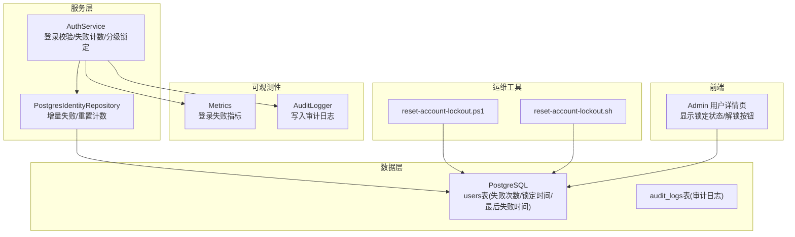
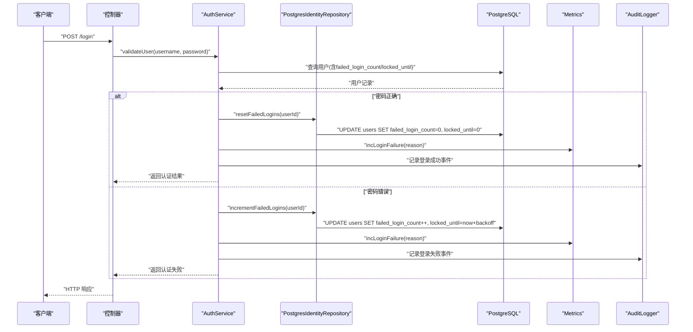
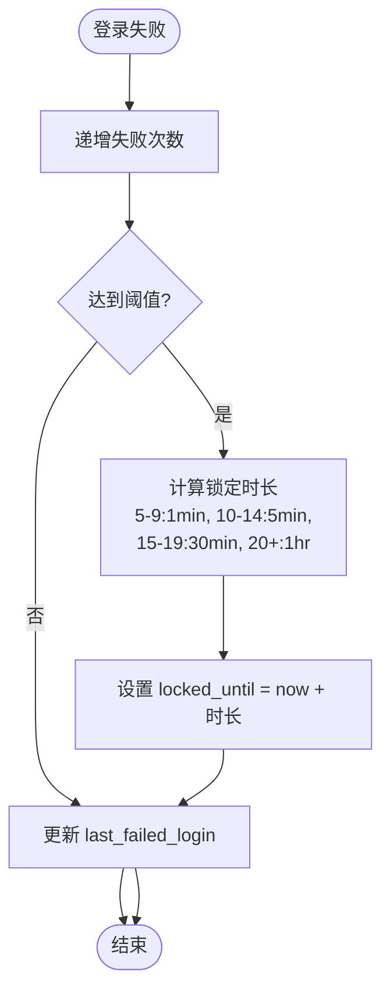
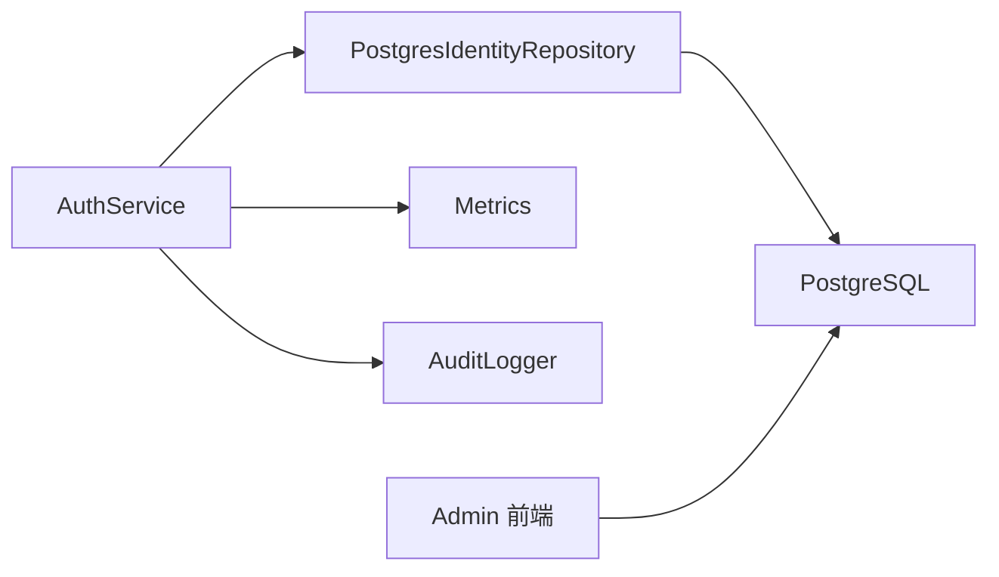

# 账户锁定管理

<cite>
**本文引用的文件**
- [AuthService.cc](file://libs/drogon/src/AuthService.cc)
- [V013__account_lockout.sql](file://apps/server/migrations/V013__account_lockout.sql)
- [PostgresIdentityRepository.cc](file://libs/storage-postgres/src/PostgresIdentityRepository.cc)
- [reset-account-lockout.ps1](file://scripts/backend/reset-account-lockout.ps1)
- [reset-account-lockout.sh](file://scripts/backend/reset-account-lockout.sh)
- [account-lockout.md](file://docs/ops/account-lockout.md)
- [Metrics.cc](file://libs/drogon/src/observability/Metrics.cc)
- [AuditLogger.cc](file://libs/drogon/src/observability/AuditLogger.cc)
- [V012__audit_logs.sql](file://apps/server/migrations/V012__audit_logs.sql)
- [UserDetailPage.vue](file://frontends/admin/src/pages/users/UserDetailPage.vue)
- [LoginEnforcementTest.cc](file://tests/integration/auth/LoginEnforcementTest.cc)
</cite>

## 目录
1. [简介](#简介)
2. [项目结构](#项目结构)
3. [核心组件](#核心组件)
4. [架构总览](#架构总览)
5. [详细组件分析](#详细组件分析)
6. [依赖关系分析](#依赖关系分析)
7. [性能考虑](#性能考虑)
8. [故障排查指南](#故障排查指南)
9. [结论](#结论)
10. [附录](#附录)

## 简介
本指南面向生产运维与开发团队，系统化说明 AuthForge 的账户锁定机制：触发条件、分级锁定策略、自动解锁、监控查询、审计告警、手动解锁流程以及生产最佳实践。目标是帮助读者快速定位问题、安全地恢复服务并持续优化防护策略。

## 项目结构
账户锁定功能涉及数据库迁移、认证服务逻辑、存储实现、运维脚本、可观测性（指标与审计日志）以及前端展示等模块。整体结构如下：

图表来源
- [AuthService.cc:80-173](file://libs/drogon/src/AuthService.cc#L80-L173)
- [PostgresIdentityRepository.cc:352-391](file://libs/storage-postgres/src/PostgresIdentityRepository.cc#L352-L391)
- [V013__account_lockout.sql:1-6](file://apps/server/migrations/V013__account_lockout.sql#L1-L6)
- [V012__audit_logs.sql:1-22](file://apps/server/migrations/V012__audit_logs.sql#L1-L22)
- [Metrics.cc:37-40](file://libs/drogon/src/observability/Metrics.cc#L37-L40)
- [AuditLogger.cc:70-93](file://libs/drogon/src/observability/AuditLogger.cc#L70-L93)
- [reset-account-lockout.ps1:49-115](file://scripts/backend/reset-account-lockout.ps1#L49-L115)
- [reset-account-lockout.sh:15-32](file://scripts/backend/reset-account-lockout.sh#L15-L32)
- [UserDetailPage.vue:193-220](file://frontends/admin/src/pages/users/UserDetailPage.vue#L193-L220)

章节来源
- [V013__account_lockout.sql:1-6](file://apps/server/migrations/V013__account_lockout.sql#L1-L6)
- [account-lockout.md:1-238](file://docs/ops/account-lockout.md#L1-L238)

## 核心组件
- 数据库字段与迁移
  - users 表新增 failed_login_count、locked_until、last_failed_login 三个字段用于记录失败次数、锁定截止时间与最后一次失败时间。
- 认证服务（AuthService）
  - 成功登录时：若存在失败计数则清零并清除锁定；同时支持密码哈希升级。
  - 失败登录时：递增失败次数，按阈值计算锁定时长并更新 last_failed_login。
- 存储实现（PostgresIdentityRepository）
  - 提供 resetFailedLogins 与 incrementFailedLogins，实现统一的失败计数与锁定策略。
- 可观测性
  - Metrics 输出登录失败指标；AuditLogger 将安全事件写入 audit_logs。
- 运维脚本
  - 提供 Windows/Linux 两种脚本，支持重置单个或全部用户的锁定状态。
- 前端展示
  - Admin 用户详情页展示失败次数、锁定状态与剩余时间，并提供解锁入口。

章节来源
- [AuthService.cc:80-173](file://libs/drogon/src/AuthService.cc#L80-L173)
- [PostgresIdentityRepository.cc:352-391](file://libs/storage-postgres/src/PostgresIdentityRepository.cc#L352-L391)
- [Metrics.cc:37-40](file://libs/drogon/src/observability/Metrics.cc#L37-L40)
- [AuditLogger.cc:70-93](file://libs/drogon/src/observability/AuditLogger.cc#L70-L93)
- [reset-account-lockout.ps1:49-115](file://scripts/backend/reset-account-lockout.ps1#L49-L115)
- [reset-account-lockout.sh:15-32](file://scripts/backend/reset-account-lockout.sh#L15-L32)
- [UserDetailPage.vue:193-220](file://frontends/admin/src/pages/users/UserDetailPage.vue#L193-L220)

## 架构总览
账户锁定在登录验证路径中生效，核心流程包括：读取用户信息、校验密码、根据结果更新失败计数与锁定时间、输出指标与审计日志。

图表来源
- [AuthService.cc:80-173](file://libs/drogon/src/AuthService.cc#L80-L173)
- [PostgresIdentityRepository.cc:352-391](file://libs/storage-postgres/src/PostgresIdentityRepository.cc#L352-L391)
- [Metrics.cc:37-40](file://libs/drogon/src/observability/Metrics.cc#L37-L40)
- [AuditLogger.cc:70-93](file://libs/drogon/src/observability/AuditLogger.cc#L70-L93)

## 详细组件分析

### 账户锁定算法与分级策略
- 触发条件
  - 每次登录失败都会增加 failed_login_count，并设置 last_failed_login。
- 分级锁定规则（渐进式退避）
  - 5-9 次失败：锁定 1 分钟
  - 10-14 次失败：锁定 5 分钟
  - 15-19 次失败：锁定 30 分钟
  - 20 次及以上：锁定 1 小时
- 自动解锁
  - 当当前时间超过 locked_until 时，账户视为已解锁；下一次登录尝试会基于当前失败计数重新评估是否再次锁定。
- 成功登录重置
  - 成功登录后，若存在失败计数则清零并清除锁定，避免历史失败影响后续体验。

图表来源
- [AuthService.cc:145-173](file://libs/drogon/src/AuthService.cc#L145-L173)
- [PostgresIdentityRepository.cc:372-391](file://libs/storage-postgres/src/PostgresIdentityRepository.cc#L372-L391)

章节来源
- [AuthService.cc:80-173](file://libs/drogon/src/AuthService.cc#L80-L173)
- [PostgresIdentityRepository.cc:352-391](file://libs/storage-postgres/src/PostgresIdentityRepository.cc#L352-L391)
- [account-lockout.md:7-16](file://docs/ops/account-lockout.md#L7-L16)

### 监控与查询方法
- SQL 查询
  - 查看当前锁定状态与剩余时间：
    - SELECT username, failed_login_count, locked_until, CASE WHEN locked_until > EXTRACT(EPOCH FROM NOW()) THEN 'LOCKED' ELSE 'UNLOCKED' END as status, CASE WHEN locked_until > EXTRACT(EPOCH FROM NOW()) THEN TO_TIMESTAMP(locked_until) - NOW() ELSE INTERVAL '0' END as remaining_time FROM users ORDER BY username;
  - 查找最近被锁定的账号：
    - SELECT username, failed_login_count, TO_TIMESTAMP(locked_until) as locked_until_time, TO_TIMESTAMP(last_failed_login) as last_failed_time FROM users WHERE locked_until > EXTRACT(EPOCH FROM NOW()) ORDER BY locked_until DESC;
- 指标与日志
  - 指标：oauth2_login_failures_total reason=...
  - 审计日志：通过 audit_logs 表记录 action/outcome/ip/user_agent/request_id/details 等。
- 前端展示
  - Admin 用户详情页显示失败次数、锁定状态与剩余时间，并提供“解锁账户”按钮。

章节来源
- [account-lockout.md:105-124](file://docs/ops/account-lockout.md#L105-L124)
- [account-lockout.md:191-223](file://docs/ops/account-lockout.md#L191-L223)
- [Metrics.cc:37-40](file://libs/drogon/src/observability/Metrics.cc#L37-L40)
- [V012__audit_logs.sql:1-22](file://apps/server/migrations/V012__audit_logs.sql#L1-L22)
- [UserDetailPage.vue:193-220](file://frontends/admin/src/pages/users/UserDetailPage.vue#L193-L220)

### 账户解锁操作流程
- 自动等待
  - 等待 locked_until 过期后自动解锁；期间登录仍会被拒绝。
- 手动解锁脚本
  - Windows: scripts/backend/reset-account-lockout.ps1
  - Linux/macOS: scripts/backend/reset-account-lockout.sh
  - 支持重置特定用户或全部用户，并在执行后显示当前状态。
- 管理员干预
  - 通过 Admin 用户详情页的“解锁账户”按钮进行解锁（需后端接口配合）。
- 直接 SQL 操作
  - UPDATE users SET failed_login_count = 0, locked_until = 0 WHERE username='目标用户';

章节来源
- [reset-account-lockout.ps1:49-115](file://scripts/backend/reset-account-lockout.ps1#L49-L115)
- [reset-account-lockout.sh:15-32](file://scripts/backend/reset-account-lockout.sh#L15-L32)
- [account-lockout.md:33-103](file://docs/ops/account-lockout.md#L33-L103)
- [UserDetailPage.vue:193-220](file://frontends/admin/src/pages/users/UserDetailPage.vue#L193-L220)

### 审计与告警配置
- 审计日志
  - 使用 audit_logs 表记录登录成功/失败、令牌签发等关键动作，包含 actor、target、outcome、ip、user_agent、request_id、details。
- 监控指标
  - 登录失败指标 oauth2_login_failures_total 附带 reason，便于聚合统计。
- 告警建议
  - 对关键账号（如 admin）锁定进行定时检查并触发告警。
  - 将日志接入集中式系统（ELK/Grafana Loki）进行分析与告警。

章节来源
- [V012__audit_logs.sql:1-22](file://apps/server/migrations/V012__audit_logs.sql#L1-L22)
- [Metrics.cc:37-40](file://libs/drogon/src/observability/Metrics.cc#L37-L40)
- [account-lockout.md:203-223](file://docs/ops/account-lockout.md#L203-L223)

### 生产环境最佳实践
- 安全策略
  - 保持锁定机制开启，不要禁用；确保失败计数与锁定时间合理配置。
- 批量解锁
  - 使用脚本批量重置所有用户锁定状态，或在维护窗口内执行 SQL。
- 异常处理
  - 数据库更新失败时记录警告日志；重试或降级策略应保证不影响主流程。
- 防枚举
  - 锁定与密码错误的响应保持一致，避免泄露锁定状态。

章节来源
- [account-lockout.md:225-231](file://docs/ops/account-lockout.md#L225-L231)
- [LoginEnforcementTest.cc:149-182](file://tests/integration/auth/LoginEnforcementTest.cc#L149-L182)

## 依赖关系分析
- 组件耦合
  - AuthService 依赖 PostgresIdentityRepository 完成失败计数与锁定更新；两者均依赖 PostgreSQL。
  - 可观测性模块（Metrics、AuditLogger）独立于业务逻辑，仅消费事件。
- 外部依赖
  - PostgreSQL 提供持久化；Admin 前端通过 API 获取用户状态。
- 潜在循环依赖
  - 无直接循环依赖；各模块职责清晰。

图表来源
- [AuthService.cc:80-173](file://libs/drogon/src/AuthService.cc#L80-L173)
- [PostgresIdentityRepository.cc:352-391](file://libs/storage-postgres/src/PostgresIdentityRepository.cc#L352-L391)
- [Metrics.cc:37-40](file://libs/drogon/src/observability/Metrics.cc#L37-L40)
- [AuditLogger.cc:70-93](file://libs/drogon/src/observability/AuditLogger.cc#L70-L93)
- [UserDetailPage.vue:193-220](file://frontends/admin/src/pages/users/UserDetailPage.vue#L193-L220)

章节来源
- [AuthService.cc:80-173](file://libs/drogon/src/AuthService.cc#L80-L173)
- [PostgresIdentityRepository.cc:352-391](file://libs/storage-postgres/src/PostgresIdentityRepository.cc#L352-L391)

## 性能考虑
- 数据库写入频率
  - 每次失败都会更新 users 表，建议在高峰期关注写放大；必要时引入缓存层或批处理。
- 索引与查询
  - 对 users 表的 username、locked_until、last_failed_login 建立合适索引以提升查询效率。
- 指标与日志开销
  - 指标与审计日志为异步写入，注意磁盘与网络带宽；在生产环境中启用采样或限流。

[本节为通用指导，不直接分析具体文件]

## 故障排查指南
- 常见问题
  - 测试脚本重复执行导致锁定：使用重置脚本清理。
  - 数据库连接失败：检查环境变量与 psql 可用性。
  - 锁定未生效：确认迁移已执行且字段存在。
- 诊断步骤
  - 查询 users 表确认 failed_login_count 与 locked_until。
  - 检查 metrics 与 audit_logs 是否有相关事件。
  - 使用 Admin 前端查看用户锁定状态。
- 恢复流程
  - 优先使用脚本重置；必要时直接 SQL 操作。
  - 对关键账号锁定设置告警，及时通知。

章节来源
- [account-lockout.md:20-103](file://docs/ops/account-lockout.md#L20-L103)
- [reset-account-lockout.ps1:49-115](file://scripts/backend/reset-account-lockout.ps1#L49-L115)
- [reset-account-lockout.sh:15-32](file://scripts/backend/reset-account-lockout.sh#L15-L32)
- [LoginEnforcementTest.cc:149-182](file://tests/integration/auth/LoginEnforcementTest.cc#L149-L182)

## 结论
AuthForge 的账户锁定机制通过渐进式退避有效抵御暴力破解攻击，结合指标与审计日志提供完整的可观测性。生产环境中应严格遵循安全策略，合理使用脚本与前端工具进行解锁与管理，并建立告警与恢复流程以保障服务稳定性。

[本节为总结，不直接分析具体文件]

## 附录
- 相关文件清单
  - 数据库迁移：V013__account_lockout.sql、V012__audit_logs.sql
  - 服务实现：AuthService.cc、PostgresIdentityRepository.cc
  - 可观测性：Metrics.cc、AuditLogger.cc
  - 运维脚本：reset-account-lockout.ps1、reset-account-lockout.sh
  - 前端展示：UserDetailPage.vue
  - 文档：account-lockout.md
  - 测试：LoginEnforcementTest.cc

[本节为清单，不直接分析具体文件]