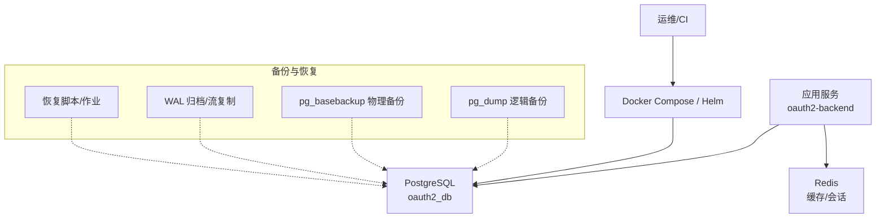
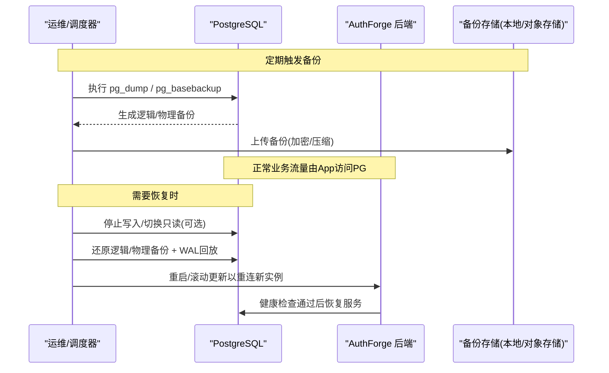
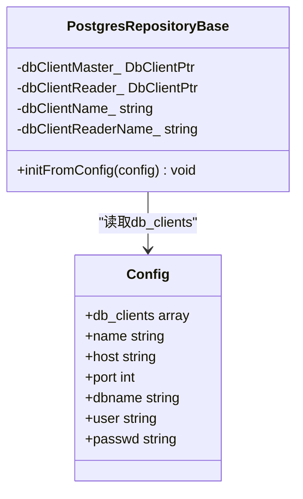

# 备份与恢复

<cite>
**本文引用的文件**
- [apps/server/config/config.json](file://apps/server/config/config.json)
- [deploy/docker/docker-compose.yml](file://deploy/docker/docker-compose.yml)
- [deploy/helm/authforge/templates/postgresql.yaml](file://deploy/helm/authforge/templates/postgresql.yaml)
- [deploy/helm/authforge/values.yaml](file://deploy/helm/authforge/values.yaml)
- [scripts/backend/setup-database.sh](file://scripts/backend/setup-database.sh)
- [scripts/backend/setup_database.bat](file://scripts/backend/setup_database.bat)
- [libs/storage-postgres/include/authforge/storage/postgres/PostgresRepositoryBase.h](file://libs/storage-postgres/include/authforge/storage/postgres/PostgresRepositoryBase.h)
- [libs/storage-postgres/src/PostgresRepositoryBase.cc](file://libs/storage-postgres/src/PostgresRepositoryBase.cc)
- [apps/server/src/bootstrap/MigrationRunner.h](file://apps/server/src/bootstrap/MigrationRunner.h)
- [.claude/skills/db-reset/SKILL.md](file://.claude/skills/db-reset/SKILL.md)
</cite>

## 目录
1. [简介](#简介)
2. [项目结构](#项目结构)
3. [核心组件](#核心组件)
4. [架构总览](#架构总览)
5. [详细组件分析](#详细组件分析)
6. [依赖关系分析](#依赖关系分析)
7. [性能考虑](#性能考虑)
8. [故障排查指南](#故障排查指南)
9. [结论](#结论)
10. [附录](#附录)

## 简介
本指南面向AuthForge项目的PostgreSQL数据库，提供生产可用的备份与恢复方案。内容涵盖：
- 全量备份、增量备份（基于WAL）与事务日志备份的配置与实践
- pg_dump与pg_basebackup工具的使用要点
- 自动化备份脚本与定时任务编排建议
- 数据恢复流程与验证方法
- 灾难恢复计划（RTO/RPO目标、故障转移、业务连续性）
- 备份存储策略、加密传输与异地容灾配置

说明：仓库未内置专用备份脚本或WAL归档配置；本指南结合现有部署工件（Docker Compose、Helm Chart、应用配置）给出可落地的实施方案与最佳实践。

## 项目结构
与备份恢复相关的工程要素包括：
- 应用对PostgreSQL的连接配置与读写分离能力
- Docker Compose中PostgreSQL容器卷挂载与健康检查
- Helm Chart中对PostgreSQL的持久化与探针定义
- 迁移与初始化脚本（用于恢复后的重建与校验）

图表来源
- [deploy/docker/docker-compose.yml:67-90](file://deploy/docker/docker-compose.yml#L67-L90)
- [deploy/helm/authforge/templates/postgresql.yaml:40-82](file://deploy/helm/authforge/templates/postgresql.yaml#L40-L82)

章节来源
- [deploy/docker/docker-compose.yml:30-90](file://deploy/docker/docker-compose.yml#L30-L90)
- [deploy/helm/authforge/templates/postgresql.yaml:40-82](file://deploy/helm/authforge/templates/postgresql.yaml#L40-L82)

## 核心组件
- 数据库连接与读写分离
  - 应用通过配置文件声明db_clients，支持主库写入与只读副本读取
  - PostgresRepositoryBase从配置中解析主/读客户端名称并获取DbClient实例
- 迁移与初始化
  - 启动时执行迁移自检或迁移Job，确保Schema一致
  - 开发/测试环境可通过脚本重置数据库并重新应用迁移和种子数据

章节来源
- [apps/server/config/config.json:9-27](file://apps/server/config/config.json#L9-L27)
- [libs/storage-postgres/include/authforge/storage/postgres/PostgresRepositoryBase.h:48-72](file://libs/storage-postgres/include/authforge/storage/postgres/PostgresRepositoryBase.h#L48-L72)
- [libs/storage-postgres/src/PostgresRepositoryBase.cc:7-29](file://libs/storage-postgres/src/PostgresRepositoryBase.cc#L7-L29)
- [apps/server/src/bootstrap/MigrationRunner.h:31-43](file://apps/server/src/bootstrap/MigrationRunner.h#L31-L43)
- [.claude/skills/db-reset/SKILL.md:25-65](file://.claude/skills/db-reset/SKILL.md#L25-L65)

## 架构总览
下图展示备份与恢复在系统中的位置及与应用的交互关系。

图表来源
- [deploy/docker/docker-compose.yml:67-90](file://deploy/docker/docker-compose.yml#L67-L90)
- [deploy/helm/authforge/templates/postgresql.yaml:40-82](file://deploy/helm/authforge/templates/postgresql.yaml#L40-L82)

## 详细组件分析

### 备份策略与工具选择
- 全量逻辑备份（推荐用于跨版本/跨平台迁移、细粒度恢复）
  - 使用pg_dump导出指定数据库或全集群
  - 适合按库/按表级恢复，便于审计与比对
- 全量物理备份（推荐用于快速恢复、大规模数据）
  - 使用pg_basebackup获取一致性物理快照
  - 配合WAL归档可实现时间点恢复(PITR)
- 增量/事务日志备份
  - 启用WAL归档(wal_level=replica/archive)，将WAL持续归档到对象存储
  - 结合pg_basebackup实现PITR，将RPO控制在WAL归档周期内

实施要点
- 备份窗口：避开业务高峰；必要时短暂锁定或切换到只读副本
- 并发与吞吐：根据磁盘I/O与网络带宽调整pg_dump并行度与pg_basebackup参数
- 完整性校验：备份后校验文件大小、md5/sha校验、尝试在隔离环境演练恢复

章节来源
- [deploy/docker/docker-compose.yml:67-90](file://deploy/docker/docker-compose.yml#L67-L90)
- [deploy/helm/authforge/templates/postgresql.yaml:40-82](file://deploy/helm/authforge/templates/postgresql.yaml#L40-L82)

### 自动化备份脚本与定时任务
- 逻辑备份（pg_dump）
  - 每日全量+每小时增量（基于时间戳或WAL）
  - 输出命名包含时间戳与类型标识，便于保留策略管理
- 物理备份（pg_basebackup）
  - 周期性执行，配合WAL归档实现PITR
- 定时任务
  - Linux/macOS：crontab或systemd timer
  - Windows：任务计划程序
  - Kubernetes：CronJob或外部调度器（如Argo Workflows）
- 安全与合规
  - 使用最小权限账号执行备份
  - 传输层TLS加密，静态数据加密存储
  - 记录审计日志与告警

章节来源
- [scripts/backend/setup-database.sh:1-36](file://scripts/backend/setup-database.sh#L1-L36)
- [scripts/backend/setup_database.bat:1-36](file://scripts/backend/setup_database.bat#L1-L36)

### 数据恢复流程与验证
- 逻辑恢复（pg_restore/psql）
  - 适用于单表/单对象恢复或跨版本迁移
  - 步骤：创建空库→导入结构→导入数据→校验计数与关键指标
- 物理恢复（PITR）
  - 步骤：准备新实例→恢复基础备份→配置recovery.conf/standby模式→回放WAL至目标时间点→提升为主库
- 验证方法
  - 运行迁移自检（MigrationRunner::setupSchemaSelfCheck）
  - 抽样查询关键表行数、最近写入时间、索引统计
  - 执行冒烟用例或集成测试

章节来源
- [apps/server/src/bootstrap/MigrationRunner.h:31-43](file://apps/server/src/bootstrap/MigrationRunner.h#L31-L43)
- [.claude/skills/db-reset/SKILL.md:25-65](file://.claude/skills/db-reset/SKILL.md#L25-L65)

### 灾难恢复计划（RTO/RPO、故障转移、业务连续性）
- RPO（最大可容忍数据丢失）
  - 逻辑备份：通常小时级
  - 物理备份+WAL归档：分钟级甚至秒级（取决于归档频率）
- RTO（最大可容忍停机时间）
  - 逻辑恢复：分钟~小时（视数据量）
  - 物理恢复+PITR：分钟级（预置备用节点可更快）
- 故障转移流程
  - 监控发现异常→切换流量到新主库→回滚变更→验证→对外恢复
- 业务连续性保障
  - 多可用区部署、跨地域WAL归档
  - 定期演练恢复与切换，更新SOP与联系人清单

[本节为概念性指导，不直接分析具体文件]

### 备份存储策略、加密传输与异地容灾
- 存储策略
  - 保留周期：全量保留N天/周/月，WAL保留至最新
  - 分层存储：热（本地SSD）、温（对象存储标准）、冷（归档存储）
- 加密与传输
  - 传输：TLS/SSH隧道
  - 静态：服务端加密（云盘/对象存储KMS）
- 异地容灾
  - 跨地域WAL归档与只读副本
  - 定期跨区域复制全量备份

[本节为通用实践，不直接分析具体文件]

## 依赖关系分析
- 应用对数据库的依赖
  - 通过db_clients配置连接PostgreSQL，支持主从读写分离
  - PostgresRepositoryBase负责解析配置并获取DbClient
- 部署对PostgreSQL的依赖
  - Docker Compose/Helm定义PostgreSQL容器、卷挂载、健康检查
  - Helm Chart暴露externalDatabase与in-chart PostgreSQL两种模式

图表来源
- [libs/storage-postgres/include/authforge/storage/postgres/PostgresRepositoryBase.h:48-72](file://libs/storage-postgres/include/authforge/storage/postgres/PostgresRepositoryBase.h#L48-L72)
- [apps/server/config/config.json:9-27](file://apps/server/config/config.json#L9-L27)

章节来源
- [libs/storage-postgres/src/PostgresRepositoryBase.cc:7-29](file://libs/storage-postgres/src/PostgresRepositoryBase.cc#L7-L29)
- [apps/server/config/config.json:9-27](file://apps/server/config/config.json#L9-L27)

## 性能考虑
- 备份期间对数据库的影响
  - pg_dump会占用CPU/IO，建议低峰期执行；必要时限制并发
  - pg_basebackup会产生WAL压力，需评估磁盘与网络带宽
- 恢复性能优化
  - 逻辑恢复：关闭索引/约束后导入再重建
  - 物理恢复：预热缓存、顺序回放WAL
- 监控与告警
  - 监控备份时长、失败率、存储空间使用率
  - 设置阈值告警与重试机制

[本节为通用指导，不直接分析具体文件]

## 故障排查指南
- 常见错误
  - 连接失败：检查db_clients配置、网络连通、端口与凭据
  - 权限不足：确认备份/恢复账号具备足够权限
  - 空间不足：清理旧备份或扩容存储
- 定位方法
  - 查看应用日志与数据库日志
  - 使用pg_isready检测数据库就绪状态
  - 核对迁移脚本执行结果与Schema版本
- 参考脚本与技能
  - 数据库初始化/重置脚本可用于环境重建与验证
  - 迁移自检可在升级前后确保Schema一致

章节来源
- [scripts/backend/setup-database.sh:1-36](file://scripts/backend/setup-database.sh#L1-L36)
- [scripts/backend/setup_database.bat:1-36](file://scripts/backend/setup_database.bat#L1-L36)
- [apps/server/src/bootstrap/MigrationRunner.h:31-43](file://apps/server/src/bootstrap/MigrationRunner.h#L31-L43)
- [.claude/skills/db-reset/SKILL.md:25-65](file://.claude/skills/db-reset/SKILL.md#L25-L65)

## 结论
- AuthForge在生产环境中应建立“逻辑备份+物理备份+WAL归档”的组合策略，兼顾灵活性与恢复速度
- 通过自动化脚本与定时任务实现稳定可靠的备份流水线，并纳入监控与告警
- 明确RTO/RPO目标，设计故障转移与异地容灾方案，定期演练以确保有效性
- 利用现有部署工件（Docker Compose/Helm）与迁移机制，构建一致的恢复流程与验证手段

[本节为总结性内容，不直接分析具体文件]

## 附录
- 常用命令参考（示例路径，非代码片段）
  - 逻辑备份：pg_dump 导出数据库
  - 逻辑恢复：pg_restore/psql 导入数据
  - 物理备份：pg_basebackup 获取基础备份
  - WAL归档：配置wal_level与archive_command，持续归档WAL
- 相关工件位置
  - 应用配置：apps/server/config/config.json
  - 容器编排：deploy/docker/docker-compose.yml
  - Helm模板：deploy/helm/authforge/templates/postgresql.yaml
  - 初始化脚本：scripts/backend/setup-database.sh、scripts/backend/setup_database.bat

章节来源
- [apps/server/config/config.json:9-27](file://apps/server/config/config.json#L9-L27)
- [deploy/docker/docker-compose.yml:67-90](file://deploy/docker/docker-compose.yml#L67-L90)
- [deploy/helm/authforge/templates/postgresql.yaml:40-82](file://deploy/helm/authforge/templates/postgresql.yaml#L40-L82)
- [scripts/backend/setup-database.sh:1-36](file://scripts/backend/setup-database.sh#L1-L36)
- [scripts/backend/setup_database.bat:1-36](file://scripts/backend/setup_database.bat#L1-L36)