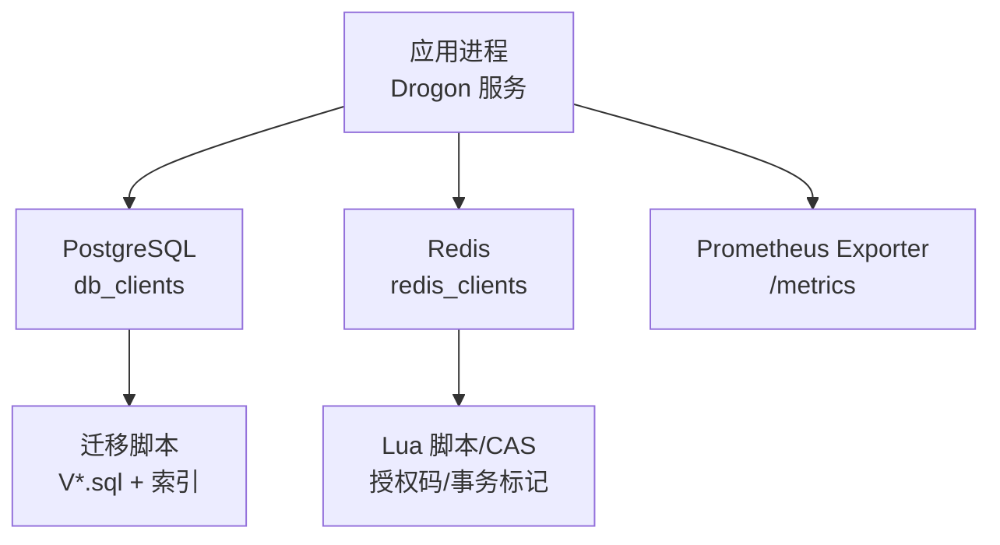
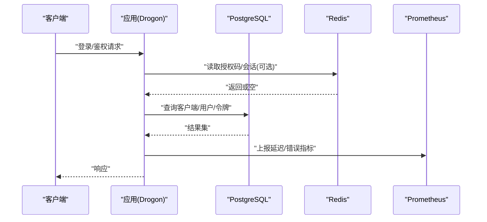
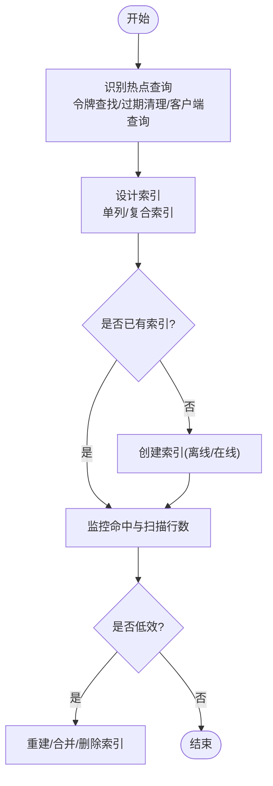
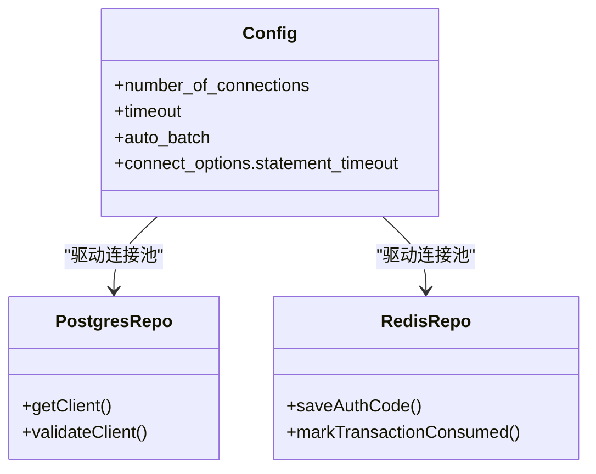
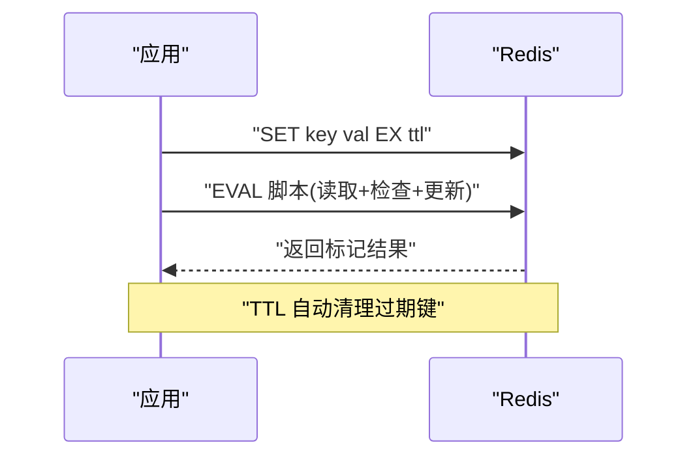
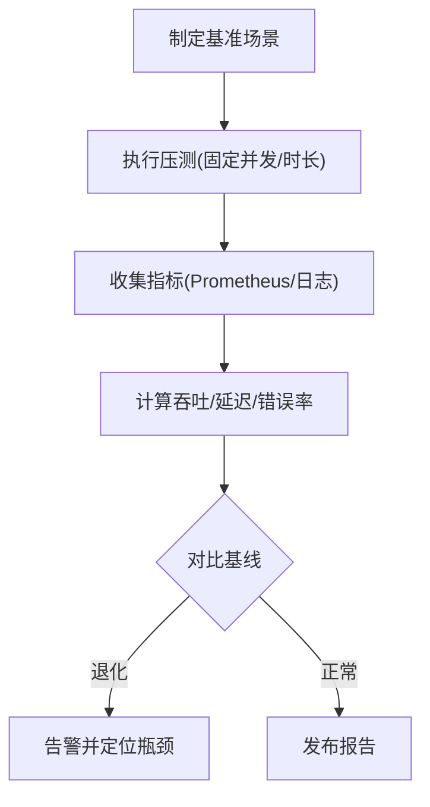
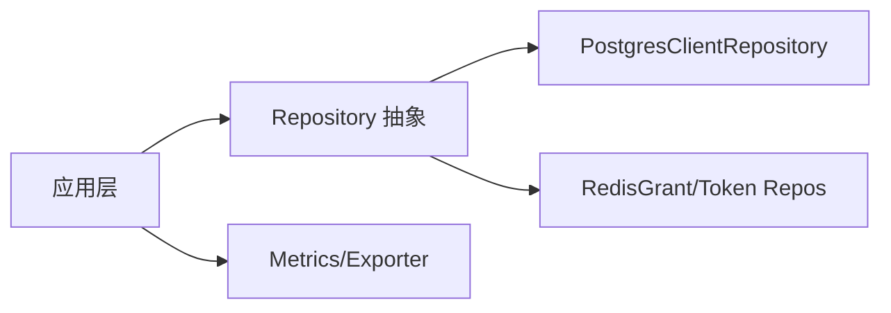

# 性能优化

<cite>
**本文引用的文件**
- [apps/server/config/config.json](file://apps/server/config/config.json)
- [apps/server/config/config.prod.json](file://apps/server/config/config.prod.json)
- [apps/server/config/config.dev.json](file://apps/server/config/config.dev.json)
- [apps/server/migrations/V003__oauth2_core_indexes.sql](file://apps/server/migrations/V003__oauth2_core_indexes.sql)
- [libs/storage-postgres/src/PostgresClientRepository.cc](file://libs/storage-postgres/src/PostgresClientRepository.cc)
- [libs/storage-redis/include/authforge/storage/redis/RedisGrantRepository.h](file://libs/storage-redis/include/authforge/storage/redis/RedisGrantRepository.h)
- [libs/storage-redis/include/authforge/storage/redis/RedisTokenRepository.h](file://libs/storage-redis/include/authforge/storage/redis/RedisTokenRepository.h)
- [libs/storage-redis/src/RedisGrantRepository.cc](file://libs/storage-redis/src/RedisGrantRepository.cc)
- [libs/drogon/src/plugin/OAuth2Plugin.cc](file://libs/drogon/src/plugin/OAuth2Plugin.cc)
- [deploy/helm/authforge/values.yaml](file://deploy/helm/authforge/values.yaml)
- [docs/backend/observability.md](file://docs/backend/observability.md)
- [tests/performance/benchmark/PerformanceBenchmark.cc](file://tests/performance/benchmark/PerformanceBenchmark.cc)
- [docs/history/design/superpowers/specs/2026-05-11-p1-P1_TECHNICAL_DESIGN.md](file://docs/history/design/superpowers/specs/2026-05-11-p1-P1_TECHNICAL_DESIGN.md)
- [docs/productization-evolution/benchmark-facility-design.md](file://docs/productization-evolution/benchmark-facility-design.md)
- [scripts/backend/setup_database.bat](file://scripts/backend/setup_database.bat)
</cite>

## 目录
1. [简介](#简介)
2. [项目结构](#项目结构)
3. [核心组件](#核心组件)
4. [架构总览](#架构总览)
5. [详细组件分析](#详细组件分析)
6. [依赖关系分析](#依赖关系分析)
7. [性能注意事项](#性能注意事项)
8. [故障排查指南](#故障排查指南)
9. [结论](#结论)
10. [附录](#附录)

## 简介
本指南面向生产与高并发场景下的 AuthForge 数据库性能优化，覆盖索引策略、查询优化、存储与容量管理、连接池调优、缓存策略（Redis）、监控指标与基准测试方法。内容基于仓库中的迁移脚本、配置、存储实现与可观测性文档进行系统化总结，并提供可操作的实践建议。

## 项目结构
- 数据库与缓存：PostgreSQL 作为主存储，Redis 作为授权码、会话与部分令牌相关数据的缓存层；通过 Drogon 的 db_clients 与 redis_clients 配置连接池。
- 存储实现：PostgresClientRepository 负责客户端与鉴权相关数据访问；RedisGrantRepository/RedisTokenRepository 提供 Redis 侧能力（含 Lua CAS）。
- 配置与环境：config.json / config.prod.json / config.dev.json 定义连接数、超时、批处理等关键参数；Helm values 提供容器化部署的资源与外部依赖配置。
- 索引与迁移：V003__oauth2_core_indexes.sql 为 OAuth2 核心表建立常用查询所需索引。
- 可观测性与基准：observability.md 暴露 Prometheus 指标；benchmark-facility-design.md 与 tests/performance/benchmark 提供基准方法与回归基线思路。

**图表来源**
- [apps/server/config/config.json:9-39](file://apps/server/config/config.json#L9-L39)
- [apps/server/migrations/V003__oauth2_core_indexes.sql:1-9](file://apps/server/migrations/V003__oauth2_core_indexes.sql#L1-L9)
- [libs/storage-redis/src/RedisGrantRepository.cc:442-467](file://libs/storage-redis/src/RedisGrantRepository.cc#L442-L467)
- [docs/backend/observability.md:1-30](file://docs/backend/observability.md#L1-L30)

**章节来源**
- [apps/server/config/config.json:9-39](file://apps/server/config/config.json#L9-L39)
- [apps/server/config/config.prod.json:9-39](file://apps/server/config/config.prod.json#L9-L39)
- [apps/server/config/config.dev.json:9-39](file://apps/server/config/config.dev.json#L9-L39)
- [deploy/helm/authforge/values.yaml:97-136](file://deploy/helm/authforge/values.yaml#L97-L136)

## 核心组件
- 数据库连接池与超时：通过 db_clients.number_of_connections、timeout、connect_options.statement_timeout 控制连接复用与语句级超时。
- 读路径与懒加载：PostgresClientRepository 在首次调用时懒初始化读写客户端，降低启动开销并支持只读副本读取。
- Redis 缓存与原子操作：RedisGrantRepository 使用 Lua 脚本实现“读取-检查-更新”的原子标记，避免竞态条件。
- 插件装配：OAuth2Plugin 根据 storage_type 选择 Postgres/Redis 组合，并在 Redis 模式下给出功能限制说明。

**章节来源**
- [apps/server/config/config.json:9-26](file://apps/server/config/config.json#L9-L26)
- [libs/storage-postgres/src/PostgresClientRepository.cc:29-49](file://libs/storage-postgres/src/PostgresClientRepository.cc#L29-L49)
- [libs/storage-redis/src/RedisGrantRepository.cc:442-467](file://libs/storage-redis/src/RedisGrantRepository.cc#L442-L467)
- [libs/drogon/src/plugin/OAuth2Plugin.cc:262-286](file://libs/drogon/src/plugin/OAuth2Plugin.cc#L262-L286)

## 架构总览
下图展示请求从应用到存储与缓存的关键路径，以及指标采集点。

**图表来源**
- [libs/storage-postgres/src/PostgresClientRepository.cc:29-134](file://libs/storage-postgres/src/PostgresClientRepository.cc#L29-L134)
- [libs/storage-redis/src/RedisGrantRepository.cc:442-467](file://libs/storage-redis/src/RedisGrantRepository.cc#L442-L467)
- [docs/backend/observability.md:1-30](file://docs/backend/observability.md#L1-L30)

## 详细组件分析

### 索引优化策略
- 热点查询识别
  - 令牌校验与查找：access_tokens.token、refresh_tokens.token 是高频精确匹配键。
  - 过期清理与批量扫描：expires_at、revoked 联合过滤用于过期判定与回收。
  - 客户端维度查询：client_id 常用于按应用聚合统计与限流。
- 索引设计原则
  - 优先为等值查询列建单列索引（token、client_id）。
  - 对范围/过滤复合条件采用复合索引（如 revoked + expires_at）以覆盖常见 WHERE 子句。
  - 保持索引选择性，避免过度索引导致写放大。
- 索引维护计划
  - 上线前：确保 V003 索引已执行。
  - 运行期：定期 ANALYZE 统计信息；观察 pg_stat_user_indexes 命中率；对低效索引进行合并或重建。
  - 变更流程：新增索引需评估写入影响，分阶段灰度并回滚预案。

**图表来源**
- [apps/server/migrations/V003__oauth2_core_indexes.sql:1-9](file://apps/server/migrations/V003__oauth2_core_indexes.sql#L1-L9)

**章节来源**
- [apps/server/migrations/V003__oauth2_core_indexes.sql:1-9](file://apps/server/migrations/V003__oauth2_core_indexes.sql#L1-L9)

### 查询优化技术
- 慢查询分析
  - 结合 EXPLAIN/EXPLAIN ANALYZE 定位全表扫描与低效连接。
  - 关注 statement_timeout 与长事务，避免阻塞。
- 执行计划优化
  - 利用索引覆盖减少回表；必要时调整统计信息。
  - 将多步逻辑拆分为多次小事务，降低锁竞争。
- SQL 调优技巧
  - 仅选取必要字段；避免 SELECT *。
  - 使用参数化查询与 ORM Mapper，减少注入风险与解析成本。
  - 批量写入替代循环插入，降低网络往返。

**章节来源**
- [libs/storage-postgres/src/PostgresClientRepository.cc:29-134](file://libs/storage-postgres/src/PostgresClientRepository.cc#L29-L134)
- [apps/server/config/config.json:20-25](file://apps/server/config/config.json#L20-L25)

### 存储空间管理与分区策略
- 表空间规划
  - 将热表（令牌、授权码）与冷表（审计日志）分离至不同表空间，便于独立扩容与备份策略。
- 分区策略
  - 按时间对大表（如 oauth2_access_tokens、oauth2_refresh_tokens）进行范围分区，提升过期清理效率与查询局部性。
  - 配合定时任务 detach 旧分区，归档至低成本存储。
- 容量监控
  - 监控表大小增长速率、索引膨胀率、死元组比例；设置阈值告警。
  - 结合 pg_stat_statements 与 pg_stat_user_tables 评估热点对象。

**章节来源**
- [docs/history/design/superpowers/specs/2026-05-11-p1-P1_TECHNICAL_DESIGN.md:616-630](file://docs/history/design/superpowers/specs/2026-05-11-p1-P1_TECHNICAL_DESIGN.md#L616-L630)

### 连接池配置优化
- 连接数调优
  - number_of_connections 应结合线程数与后端最大连接数设定；生产环境建议保守起步，逐步压测上调。
  - 开发/测试环境可降低连接数以节省资源。
- 超时设置
  - timeout 控制连接空闲/获取超时；statement_timeout 保护数据库免受长查询拖垮。
  - 针对慢查询路径单独缩短超时，快速失败。
- 资源限制
  - 启用 auto_batch 减少往返；合理设置 keepalive/pipelining。
  - 在 Helm 中为 Pod 设置 CPU/Memory 限制，防止资源争用。

**图表来源**
- [apps/server/config/config.json:9-39](file://apps/server/config/config.json#L9-L39)
- [apps/server/config/config.prod.json:9-39](file://apps/server/config/config.prod.json#L9-L39)
- [libs/storage-postgres/src/PostgresClientRepository.cc:29-134](file://libs/storage-postgres/src/PostgresClientRepository.cc#L29-L134)
- [libs/storage-redis/src/RedisGrantRepository.cc:442-467](file://libs/storage-redis/src/RedisGrantRepository.cc#L442-L467)

**章节来源**
- [apps/server/config/config.json:9-39](file://apps/server/config/config.json#L9-L39)
- [apps/server/config/config.prod.json:9-39](file://apps/server/config/config.prod.json#L9-L39)
- [deploy/helm/authforge/values.yaml:48-54](file://deploy/helm/authforge/values.yaml#L48-L54)

### 缓存策略优化（Redis）
- 缓存配置
  - redis_clients.number_of_connections、timeout 与 db 隔离；生产建议与 DB 同域部署以降低网络抖动。
- 失效策略
  - 授权码/交易状态使用 TTL 自动过期；标记消费采用 Lua CAS 保证一致性。
  - 令牌相关数据遵循强一致需求，不盲目缓存；必要时仅缓存否定结果或短命热点。
- 内存管理
  - 设置 maxmemory 与淘汰策略（如 volatile-ttl），避免 OOM；监控 key 数量与内存占用。
  - 对大 value 进行压缩或拆分，减少单次 IO。

**图表来源**
- [libs/storage-redis/src/RedisGrantRepository.cc:442-467](file://libs/storage-redis/src/RedisGrantRepository.cc#L442-L467)
- [libs/storage-redis/include/authforge/storage/redis/RedisGrantRepository.h:28-58](file://libs/storage-redis/include/authforge/storage/redis/RedisGrantRepository.h#L28-L58)
- [libs/storage-redis/include/authforge/storage/redis/RedisTokenRepository.h:28-50](file://libs/storage-redis/include/authforge/storage/redis/RedisTokenRepository.h#L28-L50)

**章节来源**
- [libs/storage-redis/src/RedisGrantRepository.cc:442-467](file://libs/storage-redis/src/RedisGrantRepository.cc#L442-L467)
- [libs/storage-redis/include/authforge/storage/redis/RedisGrantRepository.h:28-58](file://libs/storage-redis/include/authforge/storage/redis/RedisGrantRepository.h#L28-L58)
- [libs/storage-redis/include/authforge/storage/redis/RedisTokenRepository.h:28-50](file://libs/storage-redis/include/authforge/storage/redis/RedisTokenRepository.h#L28-L50)

### 性能监控指标与基准测试
- 监控指标
  - 请求总量、登录失败、Introspection/Revocation 请求与错误、延迟直方图、活跃 Token 估算。
  - 通过 PromExporter 暴露 /metrics，Grafana 构建面板观察 QPS、错误率与 P99 延迟。
- 基准测试
  - 进程内微基准：Subject 生成/解析性能，统计平均与 P95 延迟。
  - 端到端基准：S1 discovery、S2 client_credentials 等场景，固定并发与时长，对比基线。
  - 重复性与误差：每场景连跑 3 次取中位数，离散度 >10% 需排查环境抖动。

**图表来源**
- [docs/backend/observability.md:1-30](file://docs/backend/observability.md#L1-L30)
- [tests/performance/benchmark/PerformanceBenchmark.cc:11-53](file://tests/performance/benchmark/PerformanceBenchmark.cc#L11-L53)
- [docs/productization-evolution/benchmark-facility-design.md:258-382](file://docs/productization-evolution/benchmark-facility-design.md#L258-L382)

**章节来源**
- [docs/backend/observability.md:1-30](file://docs/backend/observability.md#L1-L30)
- [tests/performance/benchmark/PerformanceBenchmark.cc:11-53](file://tests/performance/benchmark/PerformanceBenchmark.cc#L11-L53)
- [docs/productization-evolution/benchmark-facility-design.md:258-382](file://docs/productization-evolution/benchmark-facility-design.md#L258-L382)

## 依赖关系分析
- 应用层依赖 Drogon 框架提供的 db_clients/redis_clients 连接池能力。
- 存储层通过 Repository 抽象解耦具体实现（Postgres/Redis/Memory），便于替换与扩展。
- 可观测性通过统一 Metrics 发射器输出标准指标，供外部系统采集。

**图表来源**
- [libs/storage-postgres/src/PostgresClientRepository.cc:29-134](file://libs/storage-postgres/src/PostgresClientRepository.cc#L29-L134)
- [libs/storage-redis/src/RedisGrantRepository.cc:442-467](file://libs/storage-redis/src/RedisGrantRepository.cc#L442-L467)
- [docs/backend/observability.md:1-30](file://docs/backend/observability.md#L1-L30)

**章节来源**
- [libs/storage-postgres/src/PostgresClientRepository.cc:29-134](file://libs/storage-postgres/src/PostgresClientRepository.cc#L29-L134)
- [libs/storage-redis/src/RedisGrantRepository.cc:442-467](file://libs/storage-redis/src/RedisGrantRepository.cc#L442-L467)
- [docs/backend/observability.md:1-30](file://docs/backend/observability.md#L1-L30)

## 性能注意事项
- 连接池与超时
  - 生产环境建议开启 auto_batch，合理设置 statement_timeout，避免长事务拖垮数据库。
  - 根据压测结果逐步上调 number_of_connections，避免连接耗尽。
- 索引与查询
  - 确保核心表具备必要索引；对复合条件使用复合索引；定期 ANALYZE。
  - 使用 ORM Mapper 的参数化查询，减少解析与注入风险。
- 缓存与一致性
  - 授权码/交易状态使用 TTL + Lua CAS；令牌相关数据谨慎缓存，必要时仅缓存否定结果。
  - 监控 Redis 内存与淘汰策略，避免 OOM。
- 监控与基准
  - 持续采集 Prometheus 指标，建立 Grafana 面板；定期执行基准回归，发现退化及时告警。

[本节为通用指导，无需特定文件引用]

## 故障排查指南
- 连接泄漏与耗尽
  - 现象：连接数持续增长、出现连接耗尽错误、数据库连接数异常升高。
  - 排查：检查连接池配置与异常路径是否正确释放；通过集成测试验证连接复用。
- 慢查询与超时
  - 现象：接口延迟升高、statement_timeout 触发。
  - 排查：EXPLAIN 分析执行计划；核对索引是否命中；缩短超时快速失败。
- 缓存不一致
  - 现象：授权码被重复消费、交易状态异常。
  - 排查：确认 Lua 脚本原子性；检查 TTL 与键命名规范；增加日志与指标。

**章节来源**
- [scripts/backend/setup_database.bat:18-36](file://scripts/backend/setup_database.bat#L18-L36)
- [libs/storage-redis/src/RedisGrantRepository.cc:442-467](file://libs/storage-redis/src/RedisGrantRepository.cc#L442-L467)
- [apps/server/config/config.json:20-25](file://apps/server/config/config.json#L20-L25)

## 结论
通过对索引、查询、存储、连接池、缓存与监控的系统化优化，AuthForge 在高并发与大规模数据场景下可获得稳定且可预期的性能表现。建议以基准测试为抓手，持续迭代索引与配置，结合监控指标进行容量规划与问题定位。

## 附录
- 常用命令与脚本
  - 数据库初始化与迁移：参考 setup_database 脚本与 CI 中的迁移步骤。
  - 指标采集：访问 /metrics 或通过日志采集端抓取结构化指标。
- 参考目标
  - 数据库查询目标与缓存性能目标见技术设计文档。

**章节来源**
- [scripts/backend/setup_database.bat:18-36](file://scripts/backend/setup_database.bat#L18-L36)
- [docs/history/design/superpowers/specs/2026-05-11-p1-P1_TECHNICAL_DESIGN.md:616-630](file://docs/history/design/superpowers/specs/2026-05-11-p1-P1_TECHNICAL_DESIGN.md#L616-L630)
- [docs/backend/observability.md:1-30](file://docs/backend/observability.md#L1-L30)