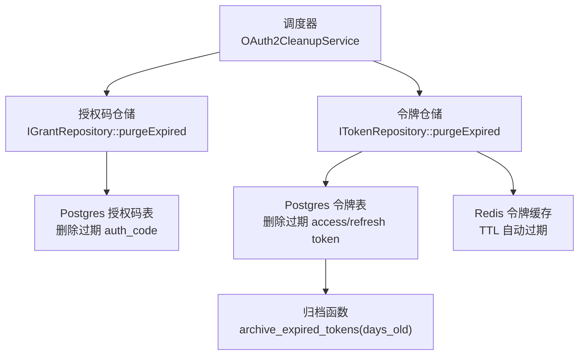
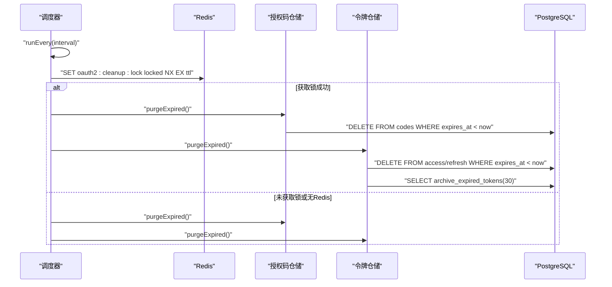
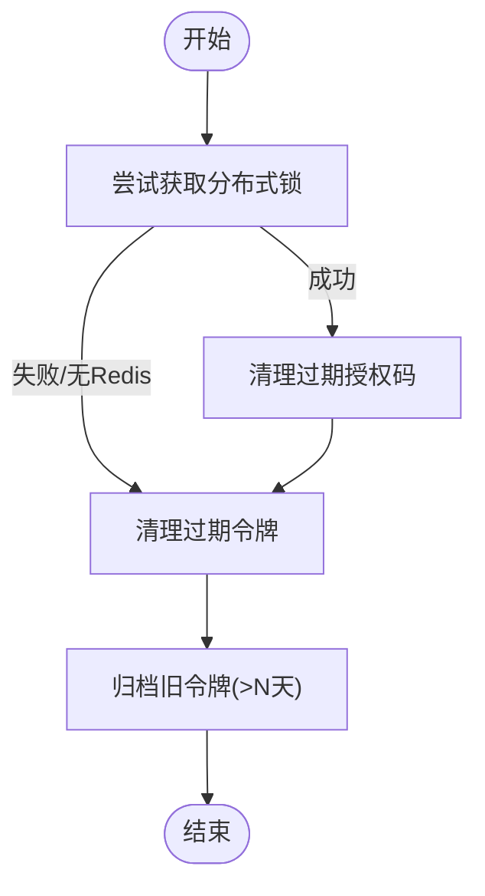
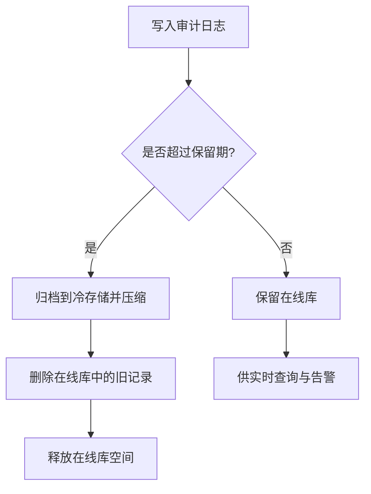
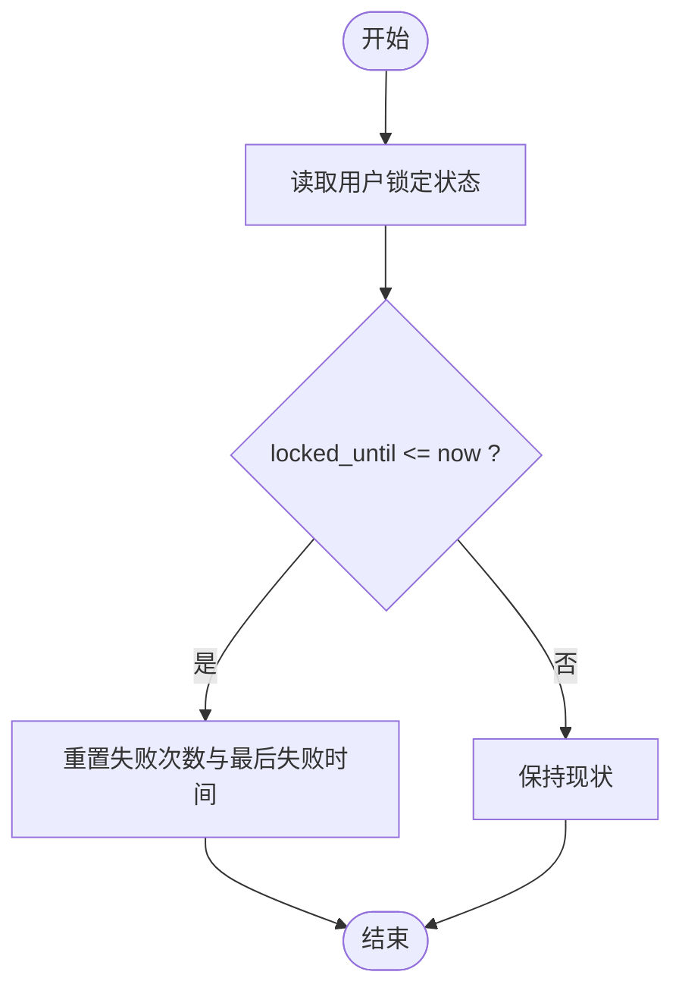
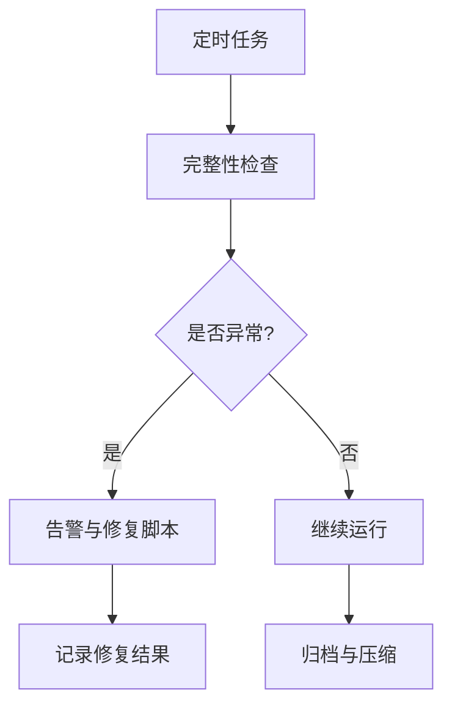
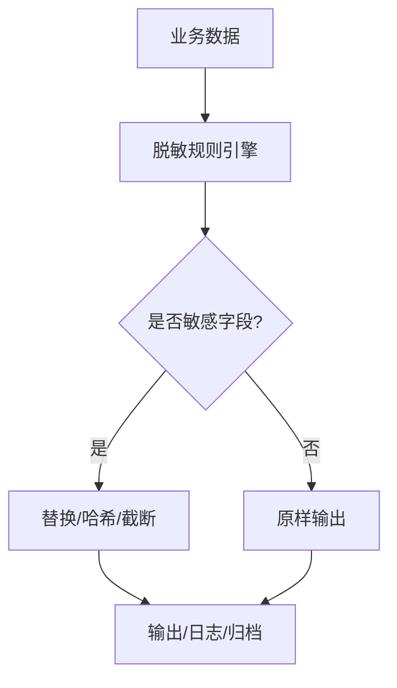
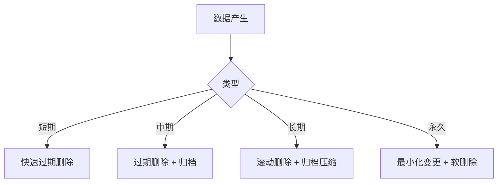
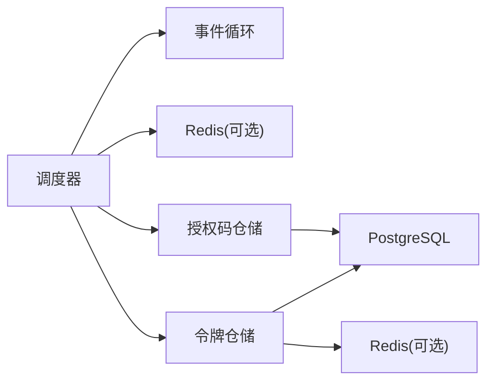

# 数据清理与维护

<cite>
**本文引用的文件**
- [OAuth2CleanupService.cc](file://libs/drogon/src/plugin/OAuth2CleanupService.cc)
- [PostgresTokenRepository.cc](file://libs/storage-postgres/src/PostgresTokenRepository.cc)
- [PostgresGrantRepository.cc](file://libs/storage-postgres/src/PostgresGrantRepository.cc)
- [RedisTokenRepository.cc](file://libs/storage-redis/src/RedisTokenRepository.cc)
- [MemoryGrantRepository.cc](file://libs/storage-memory/src/MemoryGrantRepository.cc)
- [config.json](file://apps/server/config/config.json)
- [V016__token_partitioning_prep.sql](file://apps/server/migrations/V016__token_partitioning_prep.sql)
- [V012__audit_logs.sql](file://apps/server/migrations/V012__audit_logs.sql)
- [V013__account_lockout.sql](file://apps/server/migrations/V013__account_lockout.sql)
- [V011__mfa_support.sql](file://apps/server/migrations/V011__mfa_support.sql)
- [Users.cc](file://libs/storage-postgres/src/models/Users.cc)
- [data-persistence.md](file://docs/backend/data-persistence.md)
</cite>

## 目录
1. [简介](#简介)
2. [项目结构](#项目结构)
3. [核心组件](#核心组件)
4. [架构总览](#架构总览)
5. [详细组件分析](#详细组件分析)
6. [依赖关系分析](#依赖关系分析)
7. [性能考量](#性能考量)
8. [故障排查指南](#故障排查指南)
9. [结论](#结论)
10. [附录](#附录)

## 简介
本指南面向运维与平台工程团队，提供 AuthForge 的数据清理与维护专业实践。内容覆盖：
- 过期数据清理策略：失效令牌、过期会话、临时验证码的自动清理机制
- 审计日志归档与压缩方案：日志轮转策略与存储空间优化
- 用户账户锁定状态清理与 MFA 绑定信息维护
- 数据完整性检查工具与定期维护任务配置
- 数据脱敏与隐私保护的数据处理流程
- 各类数据类型的数据生命周期管理策略

## 项目结构
本项目将“清理”职责从单一存储层解耦为按仓储（Repository）拆分，并由统一的调度服务周期性触发。关键路径如下：
- 调度器：OAuth2CleanupService 周期执行清理
- 授权码清理：IGrantRepository::purgeExpired（内存/Postgres 实现）
- 令牌清理：ITokenRepository::purgeExpired（Postgres/Redis 实现）
- 数据库侧归档：PostgreSQL 函数 archive_expired_tokens
- 配置项：cleanup_interval_seconds 控制清理频率

**图表来源**
- [OAuth2CleanupService.cc:26-55](file://libs/drogon/src/plugin/OAuth2CleanupService.cc#L26-L55)
- [PostgresGrantRepository.cc:317-347](file://libs/storage-postgres/src/PostgresGrantRepository.cc#L317-L347)
- [PostgresTokenRepository.cc:749-794](file://libs/storage-postgres/src/PostgresTokenRepository.cc#L749-L794)
- [RedisTokenRepository.cc:386-428](file://libs/storage-redis/src/RedisTokenRepository.cc#L386-L428)
- [V016__token_partitioning_prep.sql:21-35](file://apps/server/migrations/V016__token_partitioning_prep.sql#L21-L35)

**章节来源**
- [OAuth2CleanupService.cc:26-55](file://libs/drogon/src/plugin/OAuth2CleanupService.cc#L26-L55)
- [data-persistence.md:174-189](file://docs/backend/data-persistence.md#L174-L189)
- [config.json:160-169](file://apps/server/config/config.json#L160-L169)

## 核心组件
- 清理调度器（OAuth2CleanupService）
  - 使用事件循环定时器 runEvery 周期性触发
  - 通过 Redis SET NX EX 分布式锁避免多实例重复执行
  - 失败降级：无 Redis 时直接执行清理
  - 调用 IGrantRepository::purgeExpired 与 ITokenRepository::purgeExpired
- 授权码清理（IGrantRepository）
  - Postgres：删除 expires_at < now 的授权码
  - Memory：遍历并删除过期的授权码
- 令牌清理（ITokenRepository）
  - Postgres：删除过期 access/refresh token，并调用归档函数
  - Redis：基于 TTL 自动过期，purgeExpired 为幂等空操作
- 数据库归档（PostgreSQL）
  - 创建访问令牌归档表与函数 archive_expired_tokens(days_old)
  - 支持将过期且满足保留期的记录迁移至归档表

**章节来源**
- [OAuth2CleanupService.cc:93-195](file://libs/drogon/src/plugin/OAuth2CleanupService.cc#L93-L195)
- [PostgresGrantRepository.cc:317-347](file://libs/storage-postgres/src/PostgresGrantRepository.cc#L317-L347)
- [MemoryGrantRepository.cc:169-196](file://libs/storage-memory/src/MemoryGrantRepository.cc#L169-L196)
- [PostgresTokenRepository.cc:749-794](file://libs/storage-postgres/src/PostgresTokenRepository.cc#L749-L794)
- [RedisTokenRepository.cc:418-428](file://libs/storage-redis/src/RedisTokenRepository.cc#L418-L428)
- [V016__token_partitioning_prep.sql:21-35](file://apps/server/migrations/V016__token_partitioning_prep.sql#L21-L35)

## 架构总览
清理任务在应用启动后由插件初始化并启动，按配置间隔运行。每次运行尝试获取分布式锁；若成功则执行清理，否则跳过。清理过程对每个仓储独立调用 purgeExpired，保证高可用与可观测性。

**图表来源**
- [OAuth2CleanupService.cc:93-195](file://libs/drogon/src/plugin/OAuth2CleanupService.cc#L93-L195)
- [PostgresGrantRepository.cc:317-347](file://libs/storage-postgres/src/PostgresGrantRepository.cc#L317-L347)
- [PostgresTokenRepository.cc:749-794](file://libs/storage-postgres/src/PostgresTokenRepository.cc#L749-L794)
- [V016__token_partitioning_prep.sql:21-35](file://apps/server/migrations/V016__token_partitioning_prep.sql#L21-L35)

## 详细组件分析

### 过期数据清理策略
- 失效令牌（Access/Refresh Token）
  - Postgres：按 expires_at < now 删除，并调用归档函数迁移旧记录
  - Redis：基于 SETEX 设置 TTL，无需主动删除
- 过期会话（Authorization Code）
  - Postgres/Memory：按 expires_at < now 删除授权码
- 临时验证码（Email Verification / Password Reset）
  - 建议纳入统一清理策略：按 expires_at < now 删除，并在归档阶段一并处理

**图表来源**
- [OAuth2CleanupService.cc:93-195](file://libs/drogon/src/plugin/OAuth2CleanupService.cc#L93-L195)
- [PostgresGrantRepository.cc:317-347](file://libs/storage-postgres/src/PostgresGrantRepository.cc#L317-L347)
- [PostgresTokenRepository.cc:749-794](file://libs/storage-postgres/src/PostgresTokenRepository.cc#L749-L794)
- [RedisTokenRepository.cc:418-428](file://libs/storage-redis/src/RedisTokenRepository.cc#L418-L428)

**章节来源**
- [PostgresTokenRepository.cc:749-794](file://libs/storage-postgres/src/PostgresTokenRepository.cc#L749-L794)
- [PostgresGrantRepository.cc:317-347](file://libs/storage-postgres/src/PostgresGrantRepository.cc#L317-L347)
- [RedisTokenRepository.cc:386-428](file://libs/storage-redis/src/RedisTokenRepository.cc#L386-L428)
- [MemoryGrantRepository.cc:169-196](file://libs/storage-memory/src/MemoryGrantRepository.cc#L169-L196)

### 审计日志归档与压缩方案
- 审计日志表结构
  - 包含时间戳、行为主体、目标、结果、IP、User-Agent、请求ID、详情等字段，便于检索与分析
- 日志轮转策略
  - 建议在清理任务中追加：删除超过保留期（如 90 天）的审计日志
  - 归档到冷存储前进行压缩（例如 gzip），以降低长期存储成本
- 索引优化
  - 已创建 timestamp、actor、action、outcome 等索引，提升查询效率

**图表来源**
- [V012__audit_logs.sql:1-22](file://apps/server/migrations/V012__audit_logs.sql#L1-L22)

**章节来源**
- [V012__audit_logs.sql:1-22](file://apps/server/migrations/V012__audit_logs.sql#L1-L22)

### 用户账户锁定状态清理与 MFA 绑定信息维护
- 账户锁定
  - 字段：failed_login_count、locked_until、last_failed_login
  - 清理策略：当当前时间超过 locked_until 时，重置 failed_login_count 并清空 last_failed_login
- MFA 绑定信息
  - 字段：mfa_enabled、mfa_secret、mfa_backup_codes、mfa_pending_client_id、mfa_pending_redirect_uri
  - 维护策略：MFA 验证成功后清除 pending 绑定；若清理失败，记录错误但不影响主流程

**图表来源**
- [V013__account_lockout.sql:1-7](file://apps/server/migrations/V013__account_lockout.sql#L1-L7)
- [V011__mfa_support.sql:1-7](file://apps/server/migrations/V011__mfa_support.sql#L1-L7)
- [Users.cc:2315-2354](file://libs/storage-postgres/src/models/Users.cc#L2315-L2354)

**章节来源**
- [V013__account_lockout.sql:1-7](file://apps/server/migrations/V013__account_lockout.sql#L1-L7)
- [V011__mfa_support.sql:1-7](file://apps/server/migrations/V011__mfa_support.sql#L1-L7)
- [Users.cc:2315-2354](file://libs/storage-postgres/src/models/Users.cc#L2315-L2354)

### 数据完整性检查工具与定期维护任务配置
- 定期检查建议
  - 校验令牌表与归档表的一致性（行数对比、外键约束）
  - 校验审计日志的时间范围与缺失值比例
  - 校验 MFA 绑定字段一致性（pending 字段应在验证成功后清零）
- 定期维护任务
  - 清理调度器：cleanup_interval_seconds 默认 3600 秒，可按负载调整
  - 归档任务：archive_expired_tokens(days_old) 默认 30 天，可根据合规要求调整
  - 审计日志清理：建议 90 天滚动删除

**图表来源**
- [config.json:160-169](file://apps/server/config/config.json#L160-L169)
- [V016__token_partitioning_prep.sql:21-35](file://apps/server/migrations/V016__token_partitioning_prep.sql#L21-L35)

**章节来源**
- [config.json:160-169](file://apps/server/config/config.json#L160-L169)
- [V016__token_partitioning_prep.sql:21-35](file://apps/server/migrations/V016__token_partitioning_prep.sql#L21-L35)

### 数据脱敏与隐私保护的数据处理流程
- 脱敏原则
  - 对外暴露的标识使用 public_sub（UUID），避免内部 ID 泄露
  - 审计日志中的敏感字段（如密码、密钥）不记录或脱敏
- 处理流程
  - 生成/返回响应前进行字段级脱敏
  - 日志输出前过滤敏感字段
  - 归档与导出前再次脱敏

[此图为概念流程图，不直接映射具体代码文件]

### 数据生命周期管理策略
- 短期数据（分钟~小时）
  - 授权码、邮箱验证令牌、设备码：expires_at < now 即删
- 中期数据（天~周）
  - Access/Refresh Token：过期删除，超保留期归档
- 长期数据（月~年）
  - 审计日志：保留 90 天后归档并压缩
- 永久数据
  - 用户基础信息与组织信息：仅软删除或标记停用，保留必要历史

[此图为概念流程图，不直接映射具体代码文件]

## 依赖关系分析
- 调度器依赖
  - 事件循环（Drogon）用于定时任务
  - Redis 用于分布式锁（可选）
  - 仓储接口（IGrantRepository、ITokenRepository）
- 仓储依赖
  - Postgres：ORM Mapper 与 SQL 函数
  - Redis：TTL 机制
  - Memory：内存集合与互斥锁
- 配置依赖
  - cleanup_interval_seconds 控制清理频率
  - 令牌 TTL 配置影响清理阈值

**图表来源**
- [OAuth2CleanupService.cc:26-55](file://libs/drogon/src/plugin/OAuth2CleanupService.cc#L26-L55)
- [PostgresGrantRepository.cc:317-347](file://libs/storage-postgres/src/PostgresGrantRepository.cc#L317-L347)
- [PostgresTokenRepository.cc:749-794](file://libs/storage-postgres/src/PostgresTokenRepository.cc#L749-L794)
- [RedisTokenRepository.cc:418-428](file://libs/storage-redis/src/RedisTokenRepository.cc#L418-L428)

**章节来源**
- [OAuth2CleanupService.cc:26-55](file://libs/drogon/src/plugin/OAuth2CleanupService.cc#L26-L55)
- [config.json:160-169](file://apps/server/config/config.json#L160-L169)

## 性能考量
- 清理频率
  - 默认每小时一次，生产环境可根据 QPS 与数据增长速率调整
- 分布式锁
  - 使用 Redis SET NX EX 避免多实例重复执行，锁 TTL 为清理间隔的 80%
- 数据库索引
  - 复合索引加速活跃令牌查询与清理
- 归档策略
  - 归档函数批量移动旧记录，减少在线表膨胀
- 内存与网络
  - Redis 模式利用 TTL 降低 CPU 与 IO 压力
  - Memory 模式适合开发测试，生产建议使用持久化存储

[本节提供通用指导，不直接分析具体文件]

## 故障排查指南
- 清理未执行
  - 检查事件循环是否可用
  - 检查 Redis 连接与锁获取情况
  - 查看日志中“Event loop not available”“Cleanup lock not acquired”等提示
- 清理失败
  - 检查数据库连接与权限
  - 检查归档函数是否存在
  - 查看异常日志中的 DrogonDbException 信息
- 审计日志过多
  - 确认保留期策略是否生效
  - 检查归档与压缩任务是否正常
- 账户锁定异常
  - 检查 locked_until 与当前时间比较逻辑
  - 确认清理任务是否重置了失败计数

**章节来源**
- [OAuth2CleanupService.cc:93-195](file://libs/drogon/src/plugin/OAuth2CleanupService.cc#L93-L195)
- [PostgresTokenRepository.cc:749-794](file://libs/storage-postgres/src/PostgresTokenRepository.cc#L749-L794)
- [PostgresGrantRepository.cc:317-347](file://libs/storage-postgres/src/PostgresGrantRepository.cc#L317-L347)

## 结论
AuthForge 的清理与维护体系以调度器为核心，结合仓储接口的细粒度清理与数据库归档能力，实现了高效、可靠、可扩展的数据生命周期管理。通过合理的配置与监控，可在保障安全与合规的前提下，持续优化存储成本与系统性能。

## 附录
- 配置项说明
  - cleanup_interval_seconds：清理任务间隔（秒），默认 3600
  - 令牌 TTL：auth_code_ttl、access_token_ttl、refresh_token_ttl
- 迁移脚本
  - V011：MFA 支持
  - V012：审计日志
  - V013：账户锁定
  - V016：令牌表优化与归档函数

**章节来源**
- [config.json:160-169](file://apps/server/config/config.json#L160-L169)
- [V011__mfa_support.sql:1-7](file://apps/server/migrations/V011__mfa_support.sql#L1-L7)
- [V012__audit_logs.sql:1-22](file://apps/server/migrations/V012__audit_logs.sql#L1-L22)
- [V013__account_lockout.sql:1-7](file://apps/server/migrations/V013__account_lockout.sql#L1-L7)
- [V016__token_partitioning_prep.sql:21-35](file://apps/server/migrations/V016__token_partitioning_prep.sql#L21-L35)