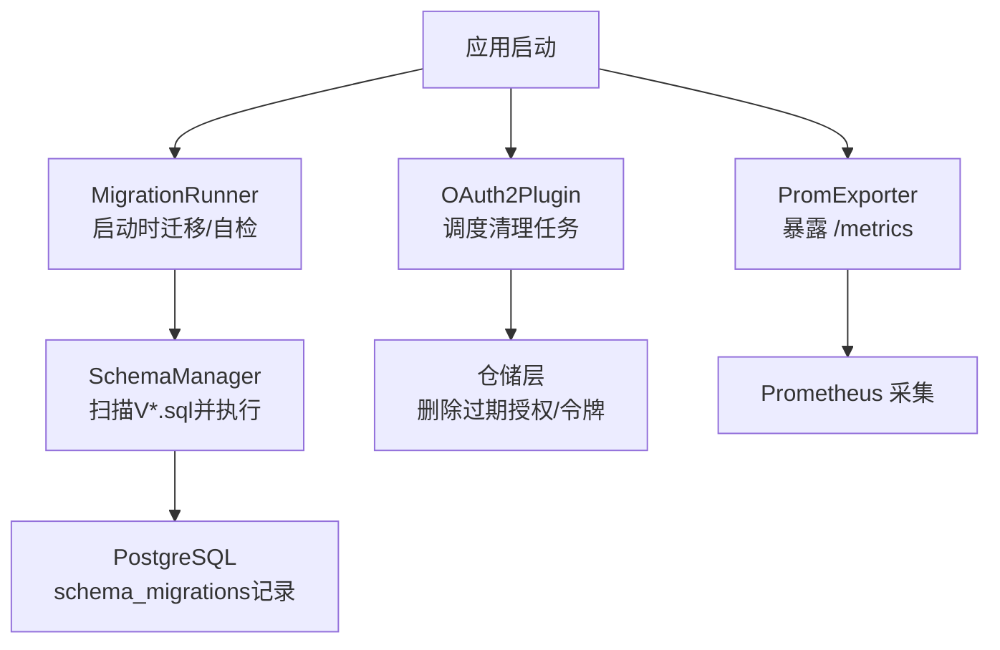
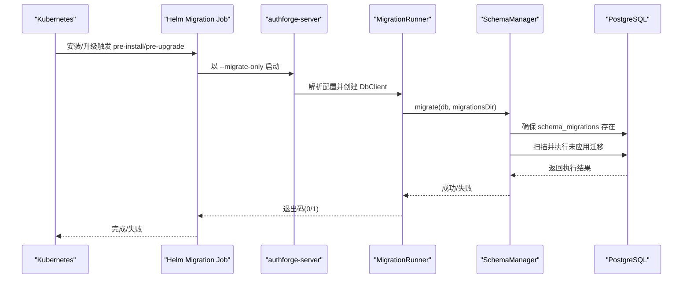
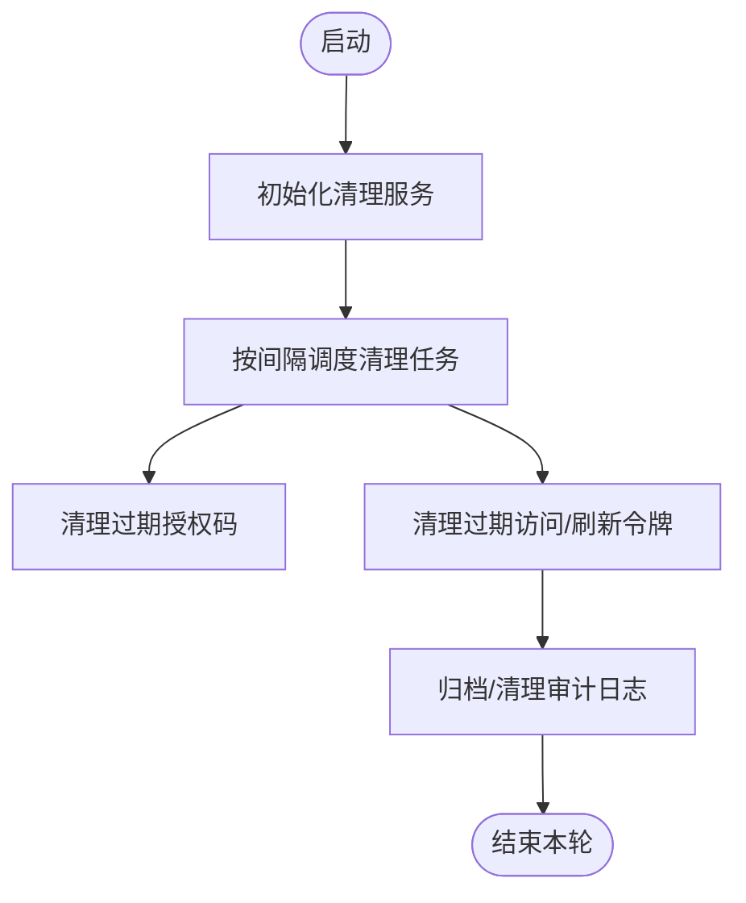
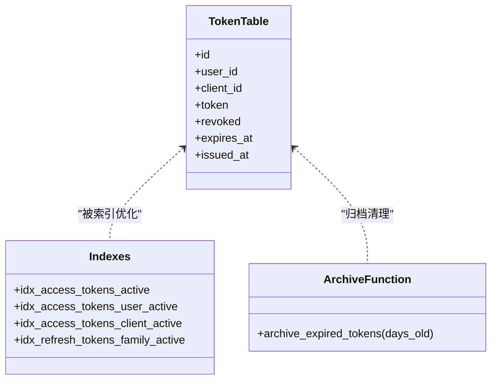
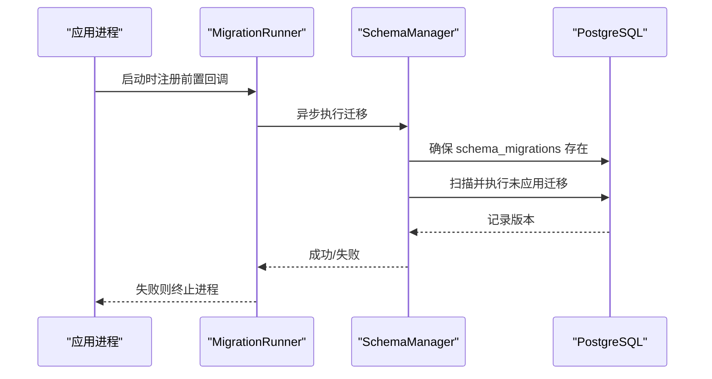
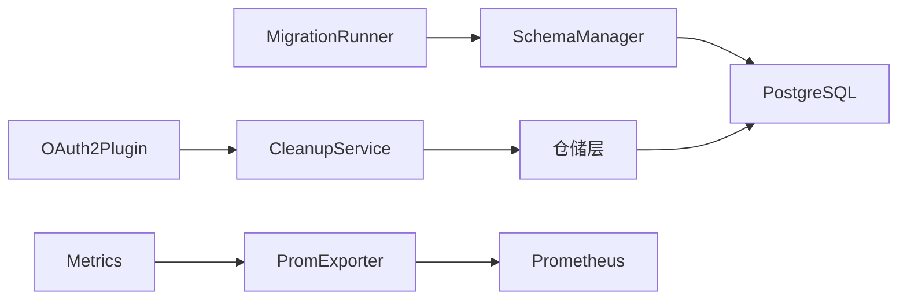

# 数据维护

<cite>
**本文引用的文件**
- [apps/server/src/bootstrap/MigrationRunner.cc](file://apps/server/src/bootstrap/MigrationRunner.cc)
- [apps/server/src/bootstrap/MigrationRunner.h](file://apps/server/src/bootstrap/MigrationRunner.h)
- [apps/server/src/SchemaManager.cc](file://apps/server/src/SchemaManager.cc)
- [apps/server/src/SchemaManager.h](file://apps/server/src/SchemaManager.h)
- [apps/server/migrations/V012__audit_logs.sql](file://apps/server/migrations/V012__audit_logs.sql)
- [apps/server/migrations/V016__token_partitioning_prep.sql](file://apps/server/migrations/V016__token_partitioning_prep.sql)
- [apps/server/config/config.json](file://apps/server/config/config.json)
- [deploy/helm/authforge/templates/migration-job.yaml](file://deploy/helm/authforge/templates/migration-job.yaml)
- [libs/storage-postgres/include/authforge/storage/postgres/PostgresRepositoryBase.h](file://libs/storage-postgres/include/authforge/storage/postgres/PostgresRepositoryBase.h)
- [libs/drogon/include/authforge/drogon/observability/Metrics.h](file://libs/drogon/include/authforge/drogon/observability/Metrics.h)
- [libs/drogon/src/observability/Metrics.cc](file://libs/drogon/src/observability/Metrics.cc)
- [docs/backend/observability.md](file://docs/backend/observability.md)
- [scripts/backend/setup_database.bat](file://scripts/backend/setup_database.bat)
- [.claude/skills/db-reset/SKILL.md](file://.claude/skills/db-reset/SKILL.md)
</cite>

## 目录
1. [简介](#简介)
2. [项目结构](#项目结构)
3. [核心组件](#核心组件)
4. [架构总览](#架构总览)
5. [详细组件分析](#详细组件分析)
6. [依赖关系分析](#依赖关系分析)
7. [性能考虑](#性能考虑)
8. [故障排查指南](#故障排查指南)
9. [结论](#结论)
10. [附录](#附录)

## 简介
本指南面向生产与运维人员，围绕 AuthForge 的数据维护主题，系统阐述数据库备份与恢复策略、数据清理与维护任务、数据库性能优化、版本迁移管理、数据完整性检查与修复工具，以及灾难恢复与业务连续性保障方案。文档严格基于仓库中的实现与配置，提供可操作的步骤与最佳实践建议。

## 项目结构
AuthForge 的数据库相关能力主要分布在以下位置：
- 迁移执行与自检：应用启动时自动扫描并执行未应用的迁移脚本，并提供“仅迁移”模式用于独立运行迁移任务。
- 迁移脚本：按版本号组织在 migrations 目录，包含表结构、索引、归档函数等。
- 配置：数据库连接池、Redis 客户端、清理间隔等通过配置文件集中管理。
- Helm 部署：通过 Job 在部署前执行迁移，确保 schema 与应用版本一致。
- 监控与指标：内置 Prometheus 指标导出，便于观测数据库与请求行为。

图表来源
- [apps/server/src/bootstrap/MigrationRunner.cc:73-128](file://apps/server/src/bootstrap/MigrationRunner.cc#L73-L128)
- [apps/server/src/SchemaManager.cc:175-233](file://apps/server/src/SchemaManager.cc#L175-L233)
- [apps/server/config/config.json:133-170](file://apps/server/config/config.json#L133-L170)
- [deploy/helm/authforge/templates/migration-job.yaml:42-85](file://deploy/helm/authforge/templates/migration-job.yaml#L42-L85)

章节来源
- [apps/server/src/bootstrap/MigrationRunner.cc:73-167](file://apps/server/src/bootstrap/MigrationRunner.cc#L73-L167)
- [apps/server/src/SchemaManager.cc:175-254](file://apps/server/src/SchemaManager.cc#L175-L254)
- [apps/server/config/config.json:9-27](file://apps/server/config/config.json#L9-L27)
- [deploy/helm/authforge/templates/migration-job.yaml:1-85](file://deploy/helm/authforge/templates/migration-job.yaml#L1-L85)

## 核心组件
- 迁移管理器（SchemaManager）：负责发现、排序、执行未应用的迁移脚本，并在 schema_migrations 表中记录已应用版本。
- 迁移运行器（MigrationRunner）：在应用启动时异步执行迁移或进行自检；支持“仅迁移”模式供外部 Job 调用。
- 清理服务（OAuth2CleanupService）：周期性清理过期授权码、访问令牌、刷新令牌等，可通过配置调整间隔。
- 监控指标（Metrics + PromExporter）：暴露标准 Prometheus 指标，便于观测请求量、失败率、延迟等。

章节来源
- [apps/server/src/SchemaManager.h:10-42](file://apps/server/src/SchemaManager.h#L10-L42)
- [apps/server/src/bootstrap/MigrationRunner.h:31-45](file://apps/server/src/bootstrap/MigrationRunner.h#L31-L45)
- [apps/server/config/config.json:133-170](file://apps/server/config/config.json#L133-L170)
- [docs/backend/observability.md:1-30](file://docs/backend/observability.md#L1-L30)

## 架构总览
下图展示了从应用启动到迁移执行、清理任务调度与指标导出的整体流程。

图表来源
- [deploy/helm/authforge/templates/migration-job.yaml:42-85](file://deploy/helm/authforge/templates/migration-job.yaml#L42-L85)
- [apps/server/src/bootstrap/MigrationRunner.cc:130-167](file://apps/server/src/bootstrap/MigrationRunner.cc#L130-L167)
- [apps/server/src/SchemaManager.cc:175-233](file://apps/server/src/SchemaManager.cc#L175-L233)

## 详细组件分析

### 数据库备份与恢复策略
- 全量备份
  - 使用 PostgreSQL 原生工具（如 pg_dump）对目标数据库进行逻辑全量备份。建议在低峰期执行，并结合事务一致性选项保证备份一致性。
  - 将备份文件落盘至对象存储或异地存储，保留多份历史副本以满足 RPO/RTO 要求。
- 增量备份
  - 启用 WAL 归档与流复制，结合时间点恢复（PITR）实现细粒度增量恢复能力。
  - 定期校验归档日志可用性与恢复演练，确保在真实灾难时可快速回滚到指定时间点。
- 定时备份任务
  - 通过操作系统级计划任务（cron/systemd timer）或容器编排平台（CronJob）定期触发备份脚本。
  - 备份脚本应包含：连接参数读取、备份执行、压缩上传、失败告警、旧备份清理等步骤。
- 恢复流程
  - 先停止写入流量，选择合适的全量备份与 WAL 归档点，执行恢复并验证数据一致性。
  - 恢复后逐步放开读流量，确认关键接口正常后再开放写流量。

说明：以上为通用操作规范，具体命令与参数需根据实际环境（PG版本、网络、权限）调整。

章节来源
- [scripts/backend/setup_database.bat:17-36](file://scripts/backend/setup_database.bat#L17-L36)
- [.claude/skills/db-reset/SKILL.md:25-65](file://.claude/skills/db-reset/SKILL.md#L25-L65)

### 数据清理与维护任务
- 过期数据清理
  - 清理服务由插件初始化并周期触发，默认间隔可从配置项中获取。
  - 清理范围包括：过期的授权码、访问令牌、刷新令牌等。
- 会话清理
  - 若使用 Redis 作为会话存储，可配合 TTL 与过期策略自动清理；必要时可编写定时任务批量清理无效会话。
- 审计日志归档
  - 审计日志表已定义并建立必要索引，可按时间窗口归档冷数据至历史库或对象存储。
  - 建议设置保留策略（如 90 天），并通过清理任务删除超期记录，控制表膨胀。

图表来源
- [apps/server/config/config.json:133-170](file://apps/server/config/config.json#L133-L170)
- [apps/server/migrations/V012__audit_logs.sql:1-23](file://apps/server/migrations/V012__audit_logs.sql#L1-L23)

章节来源
- [apps/server/config/config.json:133-170](file://apps/server/config/config.json#L133-L170)
- [apps/server/migrations/V012__audit_logs.sql:1-23](file://apps/server/migrations/V012__audit_logs.sql#L1-L23)

### 数据库性能优化
- 索引优化
  - 针对高频查询路径添加复合索引，例如按用户/客户端维度过滤活跃令牌、按家族ID查询刷新令牌等。
  - 利用部分索引减少索引体积，提高查询效率。
- 查询优化
  - 避免 N+1 查询，尽量使用 JOIN 或批量查询。
  - 合理设置语句超时，防止长事务阻塞资源。
- 存储空间管理
  - 对大表实施分区（如按月分区），并将过期数据归档至历史表或冷存储。
  - 定期统计信息更新与 VACUUM，保持查询计划最优。

图表来源
- [apps/server/migrations/V016__token_partitioning_prep.sql:1-35](file://apps/server/migrations/V016__token_partitioning_prep.sql#L1-L35)

章节来源
- [apps/server/migrations/V016__token_partitioning_prep.sql:1-35](file://apps/server/migrations/V016__token_partitioning_prep.sql#L1-L35)
- [apps/server/config/config.json:9-27](file://apps/server/config/config.json#L9-L27)

### 版本迁移管理
- 迁移脚本执行
  - 应用启动时自动扫描 migrations 目录并按版本号顺序执行未应用的脚本。
  - 支持“仅迁移”模式，供 Kubernetes Job 在部署前单独执行。
- 回滚策略
  - 迁移设计为向前兼容（同一主版本内），因此回滚应用版本无需降级 schema。
  - 若确需回滚，应在迁移脚本中提供 DOWN 段，并在评估风险后谨慎执行。
- 数据一致性保证
  - 迁移过程中记录已应用版本，失败时中断并告警，避免半迁移状态。
  - 滚动升级时，旧实例会检测到待迁移数量并输出错误日志，提示运行迁移 Job。

图表来源
- [apps/server/src/bootstrap/MigrationRunner.cc:73-93](file://apps/server/src/bootstrap/MigrationRunner.cc#L73-L93)
- [apps/server/src/SchemaManager.cc:175-233](file://apps/server/src/SchemaManager.cc#L175-L233)
- [deploy/helm/authforge/templates/migration-job.yaml:1-12](file://deploy/helm/authforge/templates/migration-job.yaml#L1-L12)

章节来源
- [apps/server/src/bootstrap/MigrationRunner.cc:73-167](file://apps/server/src/bootstrap/MigrationRunner.cc#L73-L167)
- [apps/server/src/SchemaManager.cc:175-254](file://apps/server/src/SchemaManager.cc#L175-L254)
- [deploy/helm/authforge/templates/migration-job.yaml:1-85](file://deploy/helm/authforge/templates/migration-job.yaml#L1-L85)

### 数据完整性检查与修复工具
- 完整性检查
  - 启动自检：检测磁盘上待迁移数量，若大于零则输出错误日志，提示运行迁移 Job。
  - 表结构与索引检查：核对关键表是否存在、索引是否齐全。
- 修复工具
  - 提供“仅迁移”模式，通过独立进程执行迁移，适用于 CI/CD 或运维脚本。
  - 提供数据库重置技能，用于开发/测试环境快速重建 schema 与种子数据。

章节来源
- [apps/server/src/bootstrap/MigrationRunner.cc:95-128](file://apps/server/src/bootstrap/MigrationRunner.cc#L95-L128)
- [apps/server/src/bootstrap/MigrationRunner.cc:130-167](file://apps/server/src/bootstrap/MigrationRunner.cc#L130-L167)
- [.claude/skills/db-reset/SKILL.md:25-65](file://.claude/skills/db-reset/SKILL.md#L25-L65)

### 灾难恢复与业务连续性保障
- 备份策略
  - 全量备份 + WAL 归档，满足 RPO/RTO 要求。
  - 备份文件异地保存，定期演练恢复。
- 高可用与容灾
  - 使用主从复制与自动故障转移，缩短停机时间。
  - 通过 Helm Hook 在部署前执行迁移，确保 schema 与应用版本一致。
- 监控与告警
  - 暴露 Prometheus 指标，监控请求量、失败率、延迟等。
  - 对迁移失败、数据库连接异常、清理任务失败等事件设置告警。

章节来源
- [deploy/helm/authforge/templates/migration-job.yaml:1-85](file://deploy/helm/authforge/templates/migration-job.yaml#L1-L85)
- [docs/backend/observability.md:1-30](file://docs/backend/observability.md#L1-L30)
- [libs/drogon/include/authforge/drogon/observability/Metrics.h:8-34](file://libs/drogon/include/authforge/drogon/observability/Metrics.h#L8-L34)
- [libs/drogon/src/observability/Metrics.cc:1-36](file://libs/drogon/src/observability/Metrics.cc#L1-L36)

## 依赖关系分析
- 迁移执行链路
  - MigrationRunner 在应用启动时注册前置回调，异步调用 SchemaManager 执行迁移。
  - SchemaManager 依赖 Drogon ORM 的 DbClient，读写 schema_migrations 表。
- 清理任务链路
  - OAuth2Plugin 初始化时创建清理服务，按配置间隔调度清理任务。
  - 清理任务通过仓储层接口删除过期数据。
- 监控链路
  - Metrics 模块通过结构化日志输出指标，PromExporter 暴露 /metrics 端点供 Prometheus 抓取。

图表来源
- [apps/server/src/bootstrap/MigrationRunner.cc:73-128](file://apps/server/src/bootstrap/MigrationRunner.cc#L73-L128)
- [apps/server/src/SchemaManager.cc:175-233](file://apps/server/src/SchemaManager.cc#L175-L233)
- [apps/server/config/config.json:133-170](file://apps/server/config/config.json#L133-L170)
- [libs/drogon/src/observability/Metrics.cc:1-36](file://libs/drogon/src/observability/Metrics.cc#L1-L36)

章节来源
- [apps/server/src/bootstrap/MigrationRunner.cc:73-167](file://apps/server/src/bootstrap/MigrationRunner.cc#L73-L167)
- [apps/server/src/SchemaManager.cc:175-254](file://apps/server/src/SchemaManager.cc#L175-L254)
- [apps/server/config/config.json:133-170](file://apps/server/config/config.json#L133-L170)
- [libs/drogon/src/observability/Metrics.cc:1-36](file://libs/drogon/src/observability/Metrics.cc#L1-L36)

## 性能考虑
- 连接池与超时
  - 合理设置数据库连接池大小与语句超时，避免资源耗尽与长事务阻塞。
- 索引与查询
  - 针对高频查询路径添加复合索引与部分索引，减少扫描范围。
  - 避免在热点路径上进行复杂计算或多次往返数据库。
- 存储与归档
  - 对大表实施分区与归档，降低热表体积，提升查询性能。
  - 定期维护（VACUUM、ANALYZE）以保持统计信息准确。

章节来源
- [apps/server/config/config.json:9-27](file://apps/server/config/config.json#L9-L27)
- [apps/server/migrations/V016__token_partitioning_prep.sql:1-35](file://apps/server/migrations/V016__token_partitioning_prep.sql#L1-L35)

## 故障排查指南
- 迁移失败
  - 检查迁移脚本语法与幂等性，确认 schema_migrations 表状态。
  - 使用“仅迁移”模式定位问题，查看日志输出。
- 清理任务不生效
  - 核对清理间隔配置是否正确，检查仓储层接口是否可用。
- 监控指标缺失
  - 确认 PromExporter 插件已启用，/metrics 端点可达。
  - 检查 Prometheus 抓取配置与网络连通性。

章节来源
- [apps/server/src/bootstrap/MigrationRunner.cc:130-167](file://apps/server/src/bootstrap/MigrationRunner.cc#L130-L167)
- [apps/server/config/config.json:133-170](file://apps/server/config/config.json#L133-L170)
- [docs/backend/observability.md:1-30](file://docs/backend/observability.md#L1-L30)

## 结论
AuthForge 提供了完善的迁移管理与清理机制，结合 Prometheus 指标可实现可观测性。在生产环境中，建议配套实施全量与增量备份、WAL 归档、索引优化与分区归档、以及严格的迁移与回滚策略，以确保数据安全与业务连续性。

## 附录
- 数据库连接与凭据
  - 通过环境变量或配置文件注入数据库与 Redis 连接信息。
- 本地初始化
  - 可使用提供的脚本与技能快速初始化数据库与种子数据。

章节来源
- [scripts/backend/setup_database.bat:17-36](file://scripts/backend/setup_database.bat#L17-L36)
- [.claude/skills/db-reset/SKILL.md:25-65](file://.claude/skills/db-reset/SKILL.md#L25-L65)