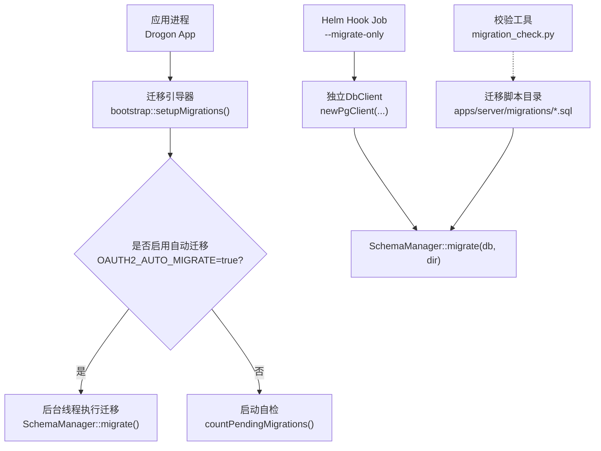
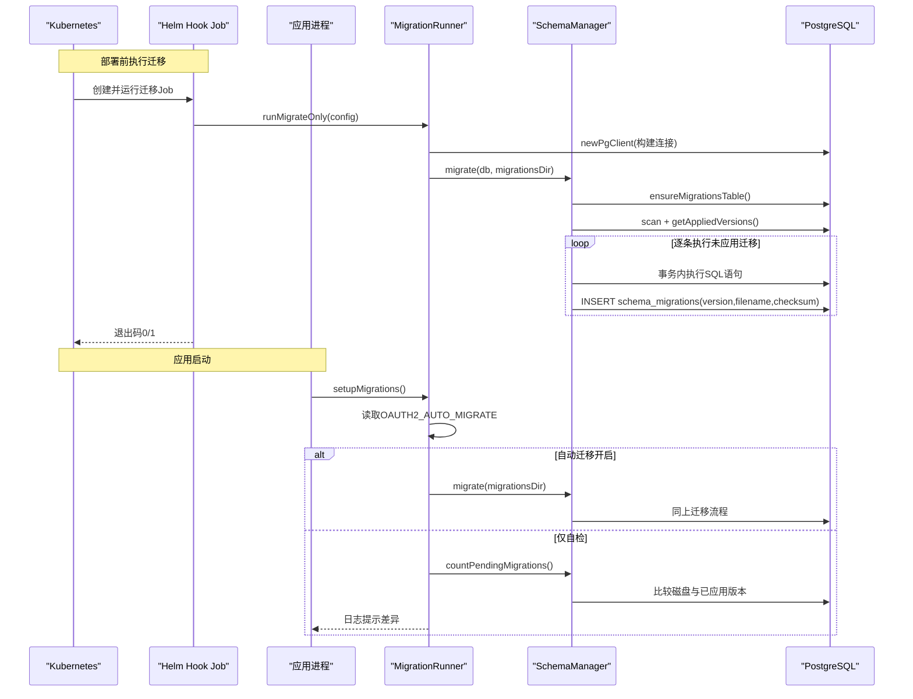
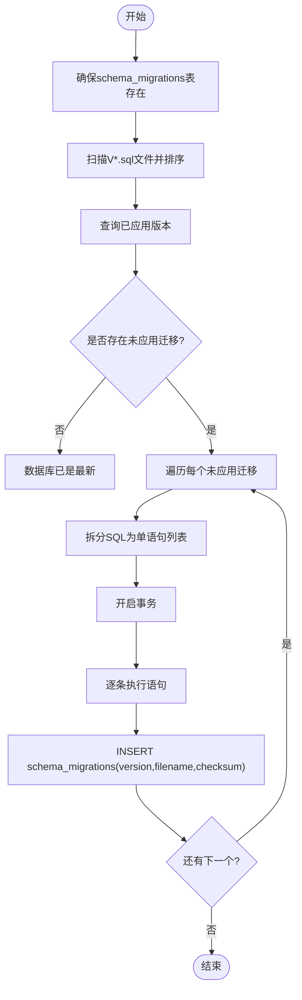
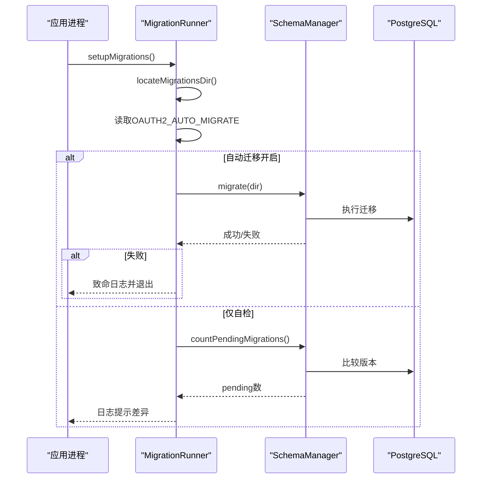
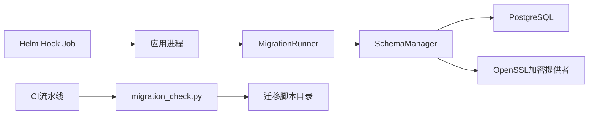

# 版本迁移管理

<cite>
**本文引用的文件**
- [SchemaManager.h](file://apps/server/src/SchemaManager.h)
- [SchemaManager.cc](file://apps/server/src/SchemaManager.cc)
- [MigrationRunner.h](file://apps/server/src/bootstrap/MigrationRunner.h)
- [MigrationRunner.cc](file://apps/server/src/bootstrap/MigrationRunner.cc)
- [V001__schema_migrations.sql](file://apps/server/migrations/V001__schema_migrations.sql)
- [V017__multi_tenant.sql](file://apps/server/migrations/V017__multi_tenant.sql)
- [V022__mfa_pending_client_binding.sql](file://apps/server/migrations/V022__mfa_pending_client_binding.sql)
- [config.json](file://apps/server/config/config.json)
- [migration_check.py](file://tools/migration-check/migration_check.py)
- [migration-job.yaml](file://deploy/helm/authforge/templates/migration-job.yaml)
</cite>

## 目录
1. [简介](#简介)
2. [项目结构](#项目结构)
3. [核心组件](#核心组件)
4. [架构总览](#架构总览)
5. [详细组件分析](#详细组件分析)
6. [依赖关系分析](#依赖关系分析)
7. [性能考量](#性能考量)
8. [故障排查指南](#故障排查指南)
9. [结论](#结论)
10. [附录](#附录)

## 简介
本指南面向AuthForge的数据库版本迁移管理，围绕SchemaManager的工作原理、迁移脚本执行流程、编写规范（命名约定、版本控制与依赖管理）、回滚策略与数据一致性保证（事务处理与错误恢复）、迁移测试与验证工具、生产环境最佳实践（灰度发布、零停机迁移、回滚预案），以及多租户环境下的迁移策略与数据隔离进行系统化说明。目标是帮助开发者安全、可靠地演进数据库Schema，并在生产环境中实现可观测、可回滚、可审计的变更流程。

## 项目结构
- 迁移执行器：位于应用服务进程内，负责启动时扫描并执行未应用的迁移脚本。
- 迁移编排：通过Helm Hook Job在部署前独立运行迁移任务，确保应用流量不受影响。
- 校验工具：静态检查迁移脚本的命名、顺序、幂等性、破坏性语句与基线一致性。
- 配置与连接：通过配置文件提供PostgreSQL连接信息，支持连接超时与语句超时等参数。

图示来源
- [MigrationRunner.cc:53-93](file://apps/server/src/bootstrap/MigrationRunner.cc#L53-L93)
- [MigrationRunner.cc:95-128](file://apps/server/src/bootstrap/MigrationRunner.cc#L95-L128)
- [MigrationRunner.cc:130-165](file://apps/server/src/bootstrap/MigrationRunner.cc#L130-L165)
- [SchemaManager.cc:175-233](file://apps/server/src/SchemaManager.cc#L175-L233)
- [SchemaManager.cc:295-333](file://apps/server/src/SchemaManager.cc#L295-L333)
- [migration-job.yaml:42-85](file://deploy/helm/authforge/templates/migration-job.yaml#L42-L85)

章节来源
- [MigrationRunner.h:23-43](file://apps/server/src/bootstrap/MigrationRunner.h#L23-L43)
- [MigrationRunner.cc:17-49](file://apps/server/src/bootstrap/MigrationRunner.cc#L17-L49)
- [config.json:9-27](file://apps/server/config/config.json#L9-L27)

## 核心组件
- SchemaManager：负责发现、解析、拆分和执行迁移脚本；维护schema_migrations记录表；计算并记录SHA-256校验和；提供待迁移数量统计能力。
- MigrationRunner：定位迁移脚本目录；根据环境变量决定是否自动迁移或仅做自检；提供独立的“仅迁移”模式供Helm Hook使用。
- Helm Hook Job：以Job形式在部署前执行迁移，具备独立配置与密钥挂载，失败时由Kubernetes重试与超时控制。
- 迁移校验工具：对迁移脚本进行命名、顺序、幂等性、破坏性语句与基线一致性检查，保障CI阶段的质量门禁。

章节来源
- [SchemaManager.h:10-96](file://apps/server/src/SchemaManager.h#L10-L96)
- [SchemaManager.cc:14-162](file://apps/server/src/SchemaManager.cc#L14-L162)
- [SchemaManager.cc:175-233](file://apps/server/src/SchemaManager.cc#L175-L233)
- [SchemaManager.cc:274-351](file://apps/server/src/SchemaManager.cc#L274-L351)
- [SchemaManager.cc:353-423](file://apps/server/src/SchemaManager.cc#L353-L423)
- [MigrationRunner.cc:53-165](file://apps/server/src/bootstrap/MigrationRunner.cc#L53-L165)
- [migration_check.py:17-52](file://tools/migration-check/migration_check.py#L17-L52)

## 架构总览
下图展示了从应用启动到迁移执行的完整时序，包括自动迁移与自检两种路径，以及Helm Hook的独立迁移流程。

图示来源
- [MigrationRunner.cc:53-93](file://apps/server/src/bootstrap/MigrationRunner.cc#L53-L93)
- [MigrationRunner.cc:95-128](file://apps/server/src/bootstrap/MigrationRunner.cc#L95-L128)
- [MigrationRunner.cc:130-165](file://apps/server/src/bootstrap/MigrationRunner.cc#L130-L165)
- [SchemaManager.cc:175-233](file://apps/server/src/SchemaManager.cc#L175-L233)
- [SchemaManager.cc:235-272](file://apps/server/src/SchemaManager.cc#L235-L272)
- [SchemaManager.cc:274-351](file://apps/server/src/SchemaManager.cc#L274-L351)
- [SchemaManager.cc:353-423](file://apps/server/src/SchemaManager.cc#L353-L423)
- [migration-job.yaml:42-85](file://deploy/helm/authforge/templates/migration-job.yaml#L42-L85)

## 详细组件分析

### SchemaManager：工作原理与执行流程
- 迁移表管理：确保schema_migrations存在，包含version、filename、checksum、applied_at字段。
- 文件扫描：按V{NNN}__描述.sql正则匹配，提取版本号并按数值排序。
- 版本比对：查询已应用版本集合，过滤出未应用迁移。
- SQL拆分：将多语句SQL按顶级分号拆分，忽略注释、字符串与美元引用体，避免误切分。
- 事务执行：每个迁移在一个事务中执行所有语句，成功后记录version/filename/checksum。
- 校验和：使用统一加密提供者计算SHA-256，跨平台一致。

图示来源
- [SchemaManager.cc:175-233](file://apps/server/src/SchemaManager.cc#L175-L233)
- [SchemaManager.cc:274-351](file://apps/server/src/SchemaManager.cc#L274-L351)
- [SchemaManager.cc:353-423](file://apps/server/src/SchemaManager.cc#L353-L423)

章节来源
- [SchemaManager.h:10-96](file://apps/server/src/SchemaManager.h#L10-L96)
- [SchemaManager.cc:14-162](file://apps/server/src/SchemaManager.cc#L14-L162)
- [SchemaManager.cc:175-233](file://apps/server/src/SchemaManager.cc#L175-L233)
- [SchemaManager.cc:235-272](file://apps/server/src/SchemaManager.cc#L235-L272)
- [SchemaManager.cc:274-351](file://apps/server/src/SchemaManager.cc#L274-L351)
- [SchemaManager.cc:353-423](file://apps/server/src/SchemaManager.cc#L353-L423)

### MigrationRunner：启动引导与自检
- 自动迁移：当环境变量OAUTH2_AUTO_MIGRATE=true时，在应用启动后于后台线程执行迁移；若失败则终止进程，避免半迁移状态上线。
- 自检模式：默认关闭自动迁移，改为在启动时比较磁盘迁移与已应用版本，输出ERROR日志提示差异，不中断滚动升级中的旧副本。
- 仅迁移模式：通过命令行参数--migrate-only，使用独立DbClient同步执行迁移，返回进程退出码供Kubernetes判断成功与否。

图示来源
- [MigrationRunner.cc:53-93](file://apps/server/src/bootstrap/MigrationRunner.cc#L53-L93)
- [MigrationRunner.cc:95-128](file://apps/server/src/bootstrap/MigrationRunner.cc#L95-L128)
- [SchemaManager.cc:235-272](file://apps/server/src/SchemaManager.cc#L235-L272)

章节来源
- [MigrationRunner.h:23-43](file://apps/server/src/bootstrap/MigrationRunner.h#L23-L43)
- [MigrationRunner.cc:17-49](file://apps/server/src/bootstrap/MigrationRunner.cc#L17-L49)
- [MigrationRunner.cc:53-165](file://apps/server/src/bootstrap/MigrationRunner.cc#L53-L165)

### 迁移脚本编写规范
- 命名约定：必须匹配V{三位数字}__snake_case.sql，例如V001__schema_migrations.sql、V017__multi_tenant.sql、V022__mfa_pending_client_binding.sql。
- 版本控制：版本号必须唯一且连续从V001开始，禁止跳号与重复；工具会强制检查序列完整性。
- 幂等性要求：
  - CREATE TABLE / CREATE INDEX需带IF NOT EXISTS。
  - ADD COLUMN需带IF NOT EXISTS。
  - INSERT需带ON CONFLICT处理冲突。
  - CREATE FUNCTION需使用OR REPLACE。
  - ADD CONSTRAINT需先DROP CONSTRAINT IF EXISTS同名约束。
- 非破坏性原则：禁止DROP TABLE、DROP COLUMN、TRUNCATE、DROP SCHEMA、DROP DATABASE及顶层DELETE FROM；允许删除约束与NOT NULL修改。
- 不可变性：已应用迁移内容视为不可变；任何修改需新增更高版本迁移；工具通过baseline.json校验SHA-256一致性。

章节来源
- [V001__schema_migrations.sql:1-10](file://apps/server/migrations/V001__schema_migrations.sql#L1-L10)
- [V017__multi_tenant.sql:1-23](file://apps/server/migrations/V017__multi_tenant.sql#L1-L23)
- [V022__mfa_pending_client_binding.sql:1-9](file://apps/server/migrations/V022__mfa_pending_client_binding.sql#L1-L9)
- [migration_check.py:17-52](file://tools/migration-check/migration_check.py#L17-L52)
- [migration_check.py:134-200](file://tools/migration-check/migration_check.py#L134-L200)
- [migration_check.py:203-234](file://tools/migration-check/migration_check.py#L203-L234)

### 回滚策略与数据一致性保证
- 向前兼容：迁移设计遵循向前兼容原则，禁止破坏性语句；因此回滚只需回退应用版本，无需降级Schema。
- 事务边界：每个迁移在一个事务中执行全部语句，任一语句失败则整体回滚，不会记录该版本，保证原子性。
- 错误恢复：迁移失败立即停止后续迁移；自动迁移模式下应用进程终止，防止半迁移状态上线；自检模式下仅记录错误日志，不影响滚动升级。
- 校验与基线：通过baseline.json锁定迁移内容，防止篡改；CI阶段强制校验，减少人为失误。

章节来源
- [SchemaManager.cc:353-423](file://apps/server/src/SchemaManager.cc#L353-L423)
- [MigrationRunner.cc:77-93](file://apps/server/src/bootstrap/MigrationRunner.cc#L77-L93)
- [migration_check.py:203-234](file://tools/migration-check/migration_check.py#L203-L234)

### 迁移测试方法与验证工具
- 静态校验：使用migration_check.py对迁移脚本进行命名、顺序、幂等性、破坏性语句与基线一致性检查，作为CI质量门禁。
- 单元测试：SchemaManager暴露splitSqlStatements用于直接测试SQL拆分逻辑，确保注释、字符串、美元引用体不被误切分。
- 集成测试：可通过Helm Hook Job或应用自检模式验证迁移结果；结合数据库查询确认schema_migrations记录与目标对象存在。
- 基线更新：新增或调整迁移后，使用工具的--update-baseline生成新的baseline.json并提交，确保后续CI通过。

章节来源
- [SchemaManager.h:51-62](file://apps/server/src/SchemaManager.h#L51-L62)
- [SchemaManager.cc:14-162](file://apps/server/src/SchemaManager.cc#L14-L162)
- [migration_check.py:237-281](file://tools/migration-check/migration_check.py#L237-L281)

### 生产环境迁移最佳实践
- 灰度发布：优先在预发环境验证迁移；逐步放量至部分节点，观察自检日志与业务指标。
- 零停机迁移：采用Helm Hook Job在部署前执行迁移；应用启动仅做自检，避免阻塞流量；保持向前兼容，确保新旧版本共存。
- 回滚预案：由于迁移不可破坏且不可变，回滚仅需回退应用版本；若出现异常，快速回滚并保留迁移Job日志以供审计。
- 资源与超时：为迁移Job设置backoffLimit与activeDeadlineSeconds，避免长时间挂起；连接与语句超时通过配置控制。

章节来源
- [migration-job.yaml:1-12](file://deploy/helm/authforge/templates/migration-job.yaml#L1-L12)
- [migration-job.yaml:42-85](file://deploy/helm/authforge/templates/migration-job.yaml#L42-L85)
- [config.json:9-27](file://apps/server/config/config.json#L9-L27)

### 多租户环境下的迁移策略与数据隔离
- 组织级扩展：迁移脚本可为多租户引入组织维度字段与索引，如organizations表与users/oauth2_clients的org_id关联。
- 向后兼容：新增列应允许为空，逐步填充数据后再考虑约束收紧；避免一次性破坏现有查询。
- 索引优化：为新租户访问路径添加合适索引，提升查询性能。
- 隔离策略：在应用层基于org_id进行数据隔离；迁移仅关注Schema演进，不改变业务隔离逻辑。

章节来源
- [V017__multi_tenant.sql:1-23](file://apps/server/migrations/V017__multi_tenant.sql#L1-L23)

## 依赖关系分析
- 应用进程依赖MigrationRunner进行启动期迁移引导。
- MigrationRunner依赖SchemaManager执行具体迁移逻辑。
- SchemaManager依赖PostgreSQL驱动与OpenSSL加密提供者进行SQL执行与校验和计算。
- Helm Hook Job依赖镜像与配置注入，调用应用进程的--migrate-only入口。
- CI依赖migration_check.py进行静态校验。

图示来源
- [MigrationRunner.cc:53-165](file://apps/server/src/bootstrap/MigrationRunner.cc#L53-L165)
- [SchemaManager.cc:175-233](file://apps/server/src/SchemaManager.cc#L175-L233)
- [SchemaManager.cc:413-423](file://apps/server/src/SchemaManager.cc#L413-L423)
- [migration_check.py:237-281](file://tools/migration-check/migration_check.py#L237-L281)
- [migration-job.yaml:42-85](file://deploy/helm/authforge/templates/migration-job.yaml#L42-L85)

章节来源
- [MigrationRunner.h:23-43](file://apps/server/src/bootstrap/MigrationRunner.h#L23-L43)
- [SchemaManager.h:10-96](file://apps/server/src/SchemaManager.h#L10-L96)
- [migration_check.py:17-52](file://tools/migration-check/migration_check.py#L17-L52)

## 性能考量
- 语句拆分：迁移文件可能包含多条语句，需在事务内逐条执行；合理拆分避免长事务锁竞争。
- 连接池与超时：配置db_clients的连接数与超时，避免迁移期间耗尽连接或长时间阻塞。
- 索引与查询：为高频访问列添加索引，但注意迁移期间的索引重建成本。
- 自检开销：自检仅在启动时执行一次，开销较小；避免频繁触发。

[本节为通用指导，不直接分析具体文件]

## 故障排查指南
- 迁移目录未找到：检查相对路径探测逻辑与环境变量；确认容器镜像中迁移脚本路径正确。
- 自动迁移失败：查看日志中的致命错误；确认数据库连接与权限；必要时切换到仅迁移模式手动执行。
- 自检告警：当存在未应用迁移时，应用会记录ERROR日志；应尽快执行迁移Job。
- 校验失败：根据migration_check.py输出的规则编号定位问题；修复后重新运行校验。
- 基线不一致：若baseline.json与实际文件不一致，需评估变更并更新基线。

章节来源
- [MigrationRunner.cc:53-93](file://apps/server/src/bootstrap/MigrationRunner.cc#L53-L93)
- [MigrationRunner.cc:95-128](file://apps/server/src/bootstrap/MigrationRunner.cc#L95-L128)
- [migration_check.py:237-281](file://tools/migration-check/migration_check.py#L237-L281)

## 结论
AuthForge的数据库版本迁移体系以SchemaManager为核心，结合MigrationRunner的启动引导与Helm Hook的独立执行，实现了安全、可观测、可回滚的迁移流程。严格的命名与内容规范、事务化执行与校验基线，确保了迁移的幂等性与不可变性。生产环境推荐采用Helm Hook前置迁移与应用自检的组合策略，配合灰度发布与回滚预案，达成零停机与高可靠性。在多租户场景下，迁移应注重向后兼容与索引优化，确保业务平滑演进。

## 附录
- 常用命令
  - 运行迁移校验：python tools/migration-check/migration_check.py [--root <repo-root>] [--migrations-dir <dir>] [--baseline <file>] [--update-baseline]
  - 仅迁移模式：./authforge-server --migrate-only
- 关键配置项
  - db_clients：PostgreSQL连接信息，含host/port/dbname/user/passwd/timeout等。
  - OAUTH2_AUTO_MIGRATE：控制是否自动迁移；生产建议关闭，改用Helm Hook。

章节来源
- [config.json:9-27](file://apps/server/config/config.json#L9-L27)
- [migration_check.py:237-281](file://tools/migration-check/migration_check.py#L237-L281)
- [MigrationRunner.cc:130-165](file://apps/server/src/bootstrap/MigrationRunner.cc#L130-L165)