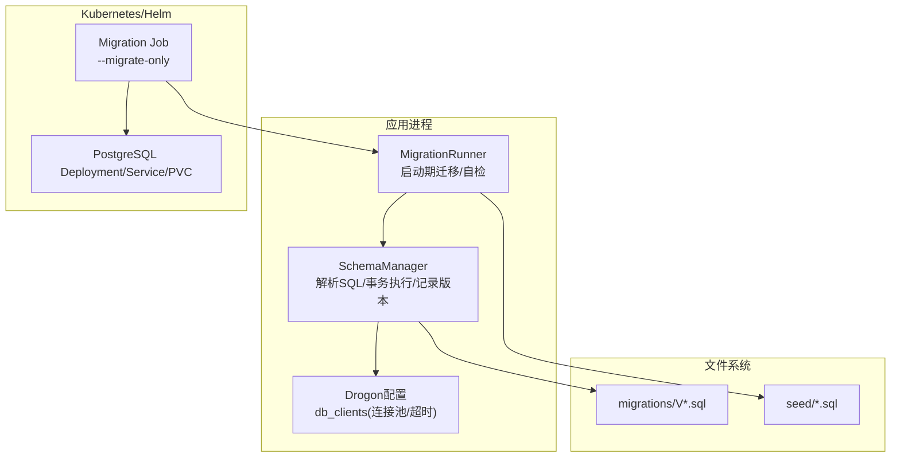
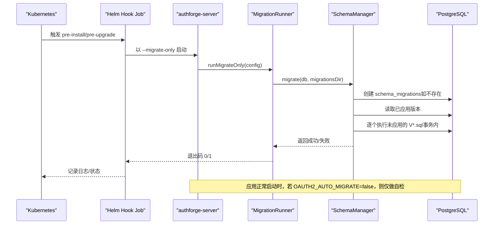
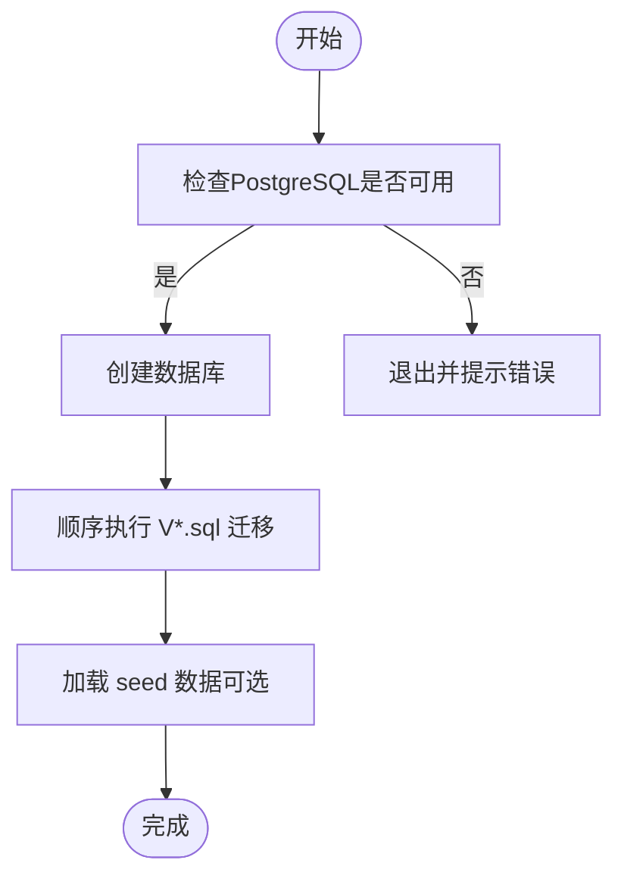
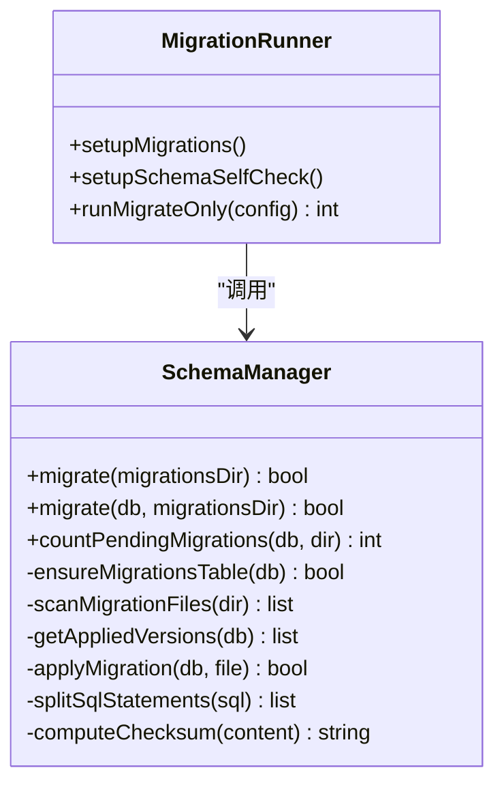
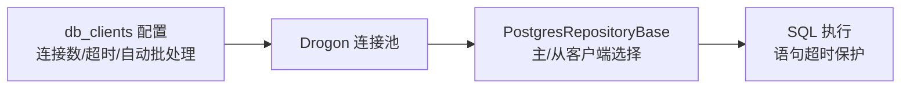
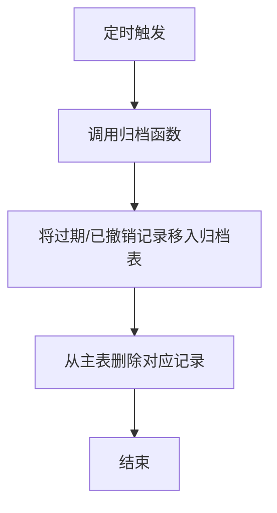
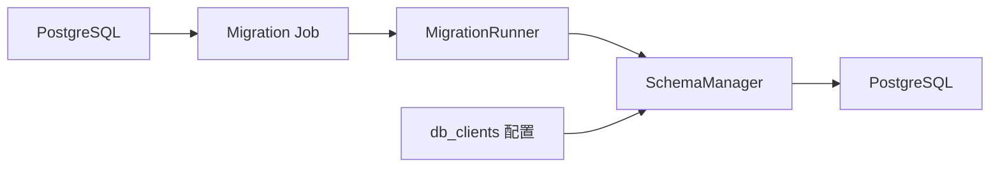

# 数据库维护

<cite>
**本文引用的文件**
- [apps/server/src/bootstrap/MigrationRunner.cc](file://apps/server/src/bootstrap/MigrationRunner.cc)
- [apps/server/src/SchemaManager.cc](file://apps/server/src/SchemaManager.cc)
- [apps/server/src/SchemaManager.h](file://apps/server/src/SchemaManager.h)
- [apps/server/config/config.json](file://apps/server/config/config.json)
- [apps/server/config/config.dev.json](file://apps/server/config/config.dev.json)
- [scripts/backend/setup-database.sh](file://scripts/backend/setup-database.sh)
- [scripts/backend/docker-postgres-start.sh](file://scripts/backend/docker-postgres-start.sh)
- [deploy/helm/authforge/templates/postgresql.yaml](file://deploy/helm/authforge/templates/postgresql.yaml)
- [deploy/helm/authforge/templates/migration-job.yaml](file://deploy/helm/authforge/templates/migration-job.yaml)
- [deploy/helm/authforge/values.yaml](file://deploy/helm/authforge/values.yaml)
- [libs/storage-postgres/src/PostgresRepositoryBase.cc](file://libs/storage-postgres/src/PostgresRepositoryBase.cc)
- [apps/server/migrations/V001__schema_migrations.sql](file://apps/server/migrations/V001__schema_migrations.sql)
- [apps/server/migrations/V016__token_partitioning_prep.sql](file://apps/server/migrations/V016__token_partitioning_prep.sql)
</cite>

## 目录
1. [简介](#简介)
2. [项目结构](#项目结构)
3. [核心组件](#核心组件)
4. [架构总览](#架构总览)
5. [详细组件分析](#详细组件分析)
6. [依赖关系分析](#依赖关系分析)
7. [性能考虑](#性能考虑)
8. [故障排查指南](#故障排查指南)
9. [结论](#结论)
10. [附录](#附录)

## 简介
本手册面向AuthForge的数据库运维人员，覆盖PostgreSQL安装与配置、数据库初始化、迁移管理、备份与恢复策略、性能优化、数据清理与归档，以及常见问题排查。内容基于仓库中实际的迁移脚本、启动器、Helm部署模板与配置文件整理而成，确保可操作、可追溯。

## 项目结构
与数据库维护直接相关的代码与资源分布如下：
- 迁移执行与自检：MigrationRunner、SchemaManager
- 数据库连接与池化：Drogon db_clients 配置
- Helm部署：内置PostgreSQL、迁移Job、外部数据库接入
- 本地初始化脚本：setup-database.sh、docker-postgres-start.sh
- 迁移脚本集：migrations/V*.sql（含版本追踪表、索引、归档函数等）

图表来源
- [apps/server/src/bootstrap/MigrationRunner.cc:53-165](file://apps/server/src/bootstrap/MigrationRunner.cc#L53-L165)
- [apps/server/src/SchemaManager.cc:164-423](file://apps/server/src/SchemaManager.cc#L164-L423)
- [deploy/helm/authforge/templates/migration-job.yaml:42-85](file://deploy/helm/authforge/templates/migration-job.yaml#L42-L85)
- [deploy/helm/authforge/templates/postgresql.yaml:6-103](file://deploy/helm/authforge/templates/postgresql.yaml#L6-L103)
- [apps/server/config/config.json:9-26](file://apps/server/config/config.json#L9-L26)

章节来源
- [apps/server/src/bootstrap/MigrationRunner.cc:53-165](file://apps/server/src/bootstrap/MigrationRunner.cc#L53-L165)
- [apps/server/src/SchemaManager.cc:164-423](file://apps/server/src/SchemaManager.cc#L164-L423)
- [deploy/helm/authforge/templates/migration-job.yaml:42-85](file://deploy/helm/authforge/templates/migration-job.yaml#L42-L85)
- [deploy/helm/authforge/templates/postgresql.yaml:6-103](file://deploy/helm/authforge/templates/postgresql.yaml#L6-L103)
- [apps/server/config/config.json:9-26](file://apps/server/config/config.json#L9-L26)

## 核心组件
- 迁移运行器（MigrationRunner）
  - 负责在应用启动时检测并执行迁移，或仅进行“待迁移数量”自检；支持独立的“仅迁移”模式（--migrate-only）。
- 模式管理器（SchemaManager）
  - 扫描V*.sql迁移文件，按版本号顺序执行，使用事务保证原子性，并在schema_migrations表中记录已应用版本及校验和。
- 数据库连接与池化（Drogon db_clients）
  - 通过配置文件定义PostgreSQL连接参数、连接池大小、语句超时等。
- Helm部署
  - 提供内置PostgreSQL（开发/演示）与外部数据库接入；通过Job在部署前执行迁移。

章节来源
- [apps/server/src/bootstrap/MigrationRunner.cc:53-165](file://apps/server/src/bootstrap/MigrationRunner.cc#L53-L165)
- [apps/server/src/SchemaManager.cc:164-423](file://apps/server/src/SchemaManager.cc#L164-L423)
- [apps/server/config/config.json:9-26](file://apps/server/config/config.json#L9-L26)
- [deploy/helm/authforge/templates/migration-job.yaml:42-85](file://deploy/helm/authforge/templates/migration-job.yaml#L42-L85)

## 架构总览
下图展示了从Helm部署到数据库迁移执行的端到端流程，包括自动迁移开关、自检与独立迁移Job。

图表来源
- [deploy/helm/authforge/templates/migration-job.yaml:42-85](file://deploy/helm/authforge/templates/migration-job.yaml#L42-L85)
- [apps/server/src/bootstrap/MigrationRunner.cc:130-165](file://apps/server/src/bootstrap/MigrationRunner.cc#L130-L165)
- [apps/server/src/SchemaManager.cc:164-233](file://apps/server/src/SchemaManager.cc#L164-L233)

## 详细组件分析

### 数据库初始化流程（PostgreSQL安装配置、创建库与用户权限）
- 本地快速启动PostgreSQL
  - 使用脚本拉起容器并等待就绪，便于本地开发与测试。
- 创建数据库、应用迁移与种子数据
  - 脚本会删除并重建目标库，然后顺序执行所有V*.sql迁移，再加载seed数据。
- Helm环境中的PostgreSQL
  - 可通过values启用内置PostgreSQL（带PVC持久化），或通过externalDatabase指向托管实例。
- 权限说明
  - 默认使用配置的数据库用户访问目标库；如需重置权限，可使用提供的示例命令。

图表来源
- [scripts/backend/docker-postgres-start.sh:1-44](file://scripts/backend/docker-postgres-start.sh#L1-L44)
- [scripts/backend/setup-database.sh:1-66](file://scripts/backend/setup-database.sh#L1-L66)
- [deploy/helm/authforge/templates/postgresql.yaml:6-103](file://deploy/helm/authforge/templates/postgresql.yaml#L6-L103)

章节来源
- [scripts/backend/docker-postgres-start.sh:1-44](file://scripts/backend/docker-postgres-start.sh#L1-L44)
- [scripts/backend/setup-database.sh:1-66](file://scripts/backend/setup-database.sh#L1-L66)
- [deploy/helm/authforge/templates/postgresql.yaml:6-103](file://deploy/helm/authforge/templates/postgresql.yaml#L6-L103)

### 数据备份与恢复策略
- 全量备份
  - 建议使用pg_dump对目标数据库进行逻辑全量备份，保留对象定义与数据。
- 增量备份
  - 建议结合PostgreSQL WAL归档与时间点恢复（PITR）实现增量能力；在生产环境中配合托管服务或自建流复制方案。
- 定时备份任务
  - 建议在操作系统层或Kubernetes CronJob中调度pg_dump，按日/周策略保留多份快照，并定期验证恢复可用性。
- 恢复流程
  - 先创建空库，再通过psql或pg_restore导入；注意字符集、时区与扩展一致性。

说明：仓库未包含专用备份脚本，以上为通用实践建议，可与现有Helm/CI集成。

[本节为通用指导，不直接引用具体文件]

### 数据库迁移管理（版本控制、回滚、一致性检查）
- 版本控制
  - 迁移文件命名遵循V{NNN}__描述.sql，由SchemaManager按版本号排序执行。
  - 首次执行会创建schema_migrations表用于记录已应用版本、文件名与校验和。
- 执行模式
  - 应用启动时：若环境变量OAUTH2_AUTO_MIGRATE=true，则在后台线程执行迁移；否则仅进行“待迁移数量”自检。
  - 独立迁移：通过--migrate-only模式，构建独立DbClient执行迁移，适合Helm Hook Job。
- 回滚策略
  - 设计为向前兼容：同一主版本的迁移具备向前兼容性，因此Helm rollback仅回滚应用版本，无需回退数据库结构。
- 一致性检查
  - 启动自检会统计磁盘上未应用的迁移数量并记录日志；生产建议以迁移Job先行执行，应用只做自检。

图表来源
- [apps/server/src/bootstrap/MigrationRunner.cc:53-165](file://apps/server/src/bootstrap/MigrationRunner.cc#L53-L165)
- [apps/server/src/SchemaManager.cc:14-423](file://apps/server/src/SchemaManager.cc#L14-L423)
- [apps/server/src/SchemaManager.h:10-42](file://apps/server/src/SchemaManager.h#L10-L42)

章节来源
- [apps/server/src/bootstrap/MigrationRunner.cc:53-165](file://apps/server/src/bootstrap/MigrationRunner.cc#L53-L165)
- [apps/server/src/SchemaManager.cc:164-423](file://apps/server/src/SchemaManager.cc#L164-L423)
- [apps/server/src/SchemaManager.h:10-42](file://apps/server/src/SchemaManager.h#L10-L42)
- [deploy/helm/authforge/templates/migration-job.yaml:1-12](file://deploy/helm/authforge/templates/migration-job.yaml#L1-L12)

### 性能优化指导（索引、查询调优、连接池）
- 连接池与超时
  - 通过db_clients配置number_of_connections设置连接池大小；statement_timeout限制单条语句执行时间，避免长事务阻塞。
  - 开发/生产配置存在差异，可按负载调整。
- 读写分离基础
  - 存储层支持配置主库与只读库名称，便于后续扩展读放大场景。
- 索引与查询
  - 迁移中包含针对核心表的索引优化脚本，建议在新功能上线前评估查询计划与索引命中情况。
- 批处理与批量写入
  - 迁移执行将SQL拆分为语句级执行，整体包裹在一个事务中，确保原子性；业务侧可借鉴此模式减少往返开销。

图表来源
- [apps/server/config/config.json:9-26](file://apps/server/config/config.json#L9-L26)
- [apps/server/config/config.dev.json:9-26](file://apps/server/config/config.dev.json#L9-L26)
- [libs/storage-postgres/src/PostgresRepositoryBase.cc:7-29](file://libs/storage-postgres/src/PostgresRepositoryBase.cc#L7-L29)

章节来源
- [apps/server/config/config.json:9-26](file://apps/server/config/config.json#L9-L26)
- [apps/server/config/config.dev.json:9-26](file://apps/server/config/config.dev.json#L9-L26)
- [libs/storage-postgres/src/PostgresRepositoryBase.cc:7-29](file://libs/storage-postgres/src/PostgresRepositoryBase.cc#L7-L29)

### 数据清理与归档策略
- 过期令牌归档
  - 迁移脚本提供归档函数，可将过期或被撤销的访问令牌移动到归档表，并从主表删除，降低热点表体积。
- 周期性清理
  - 建议通过外部调度（CronJob/系统cron）定期调用归档函数，控制主表规模与查询性能。

图表来源
- [apps/server/migrations/V016__token_partitioning_prep.sql:32-50](file://apps/server/migrations/V016__token_partitioning_prep.sql#L32-L50)

章节来源
- [apps/server/migrations/V016__token_partitioning_prep.sql:32-50](file://apps/server/migrations/V016__token_partitioning_prep.sql#L32-L50)

## 依赖关系分析
- 启动期依赖
  - MigrationRunner依赖SchemaManager执行迁移；SchemaManager依赖Drogon DbClient与migrations目录。
- 部署期依赖
  - Helm迁移Job依赖镜像与配置/密钥；PostgreSQL通过Deployment/Service暴露端口，支持PVC持久化。
- 运行时依赖
  - 应用通过db_clients获取连接池；存储层根据配置选择主/从客户端。

图表来源
- [apps/server/src/bootstrap/MigrationRunner.cc:53-165](file://apps/server/src/bootstrap/MigrationRunner.cc#L53-L165)
- [apps/server/src/SchemaManager.cc:164-423](file://apps/server/src/SchemaManager.cc#L164-L423)
- [deploy/helm/authforge/templates/migration-job.yaml:42-85](file://deploy/helm/authforge/templates/migration-job.yaml#L42-L85)
- [deploy/helm/authforge/templates/postgresql.yaml:6-103](file://deploy/helm/authforge/templates/postgresql.yaml#L6-L103)
- [apps/server/config/config.json:9-26](file://apps/server/config/config.json#L9-L26)

章节来源
- [apps/server/src/bootstrap/MigrationRunner.cc:53-165](file://apps/server/src/bootstrap/MigrationRunner.cc#L53-L165)
- [apps/server/src/SchemaManager.cc:164-423](file://apps/server/src/SchemaManager.cc#L164-L423)
- [deploy/helm/authforge/templates/migration-job.yaml:42-85](file://deploy/helm/authforge/templates/migration-job.yaml#L42-L85)
- [deploy/helm/authforge/templates/postgresql.yaml:6-103](file://deploy/helm/authforge/templates/postgresql.yaml#L6-L103)
- [apps/server/config/config.json:9-26](file://apps/server/config/config.json#L9-L26)

## 性能考虑
- 连接池容量
  - number_of_connections需根据并发请求与数据库承载能力评估；过大可能导致连接争用，过小导致排队。
- 语句超时
  - statement_timeout应设置为合理值，避免慢查询占用连接；结合监控观察慢查询日志。
- 索引与查询计划
  - 关注核心查询路径的索引命中；必要时新增或调整索引，避免过度索引影响写入性能。
- 读写分离
  - 利用PostgresRepositoryBase的主/从客户端配置，将读多写少的查询路由至只读副本。
- 批处理
  - 迁移执行采用事务包裹多条语句；业务侧可参考该模式减少网络往返与锁竞争。

[本节为通用指导，不直接引用具体文件]

## 故障排查指南
- 迁移目录未找到
  - 现象：启动日志提示未找到migrations目录，跳过迁移。
  - 处理：确认部署镜像或工作目录包含migrations/V*.sql。
- 自动迁移关闭
  - 现象：OAUTH2_AUTO_MIGRATE未开启，应用仅自检并记录待迁移数量。
  - 处理：生产环境建议通过Helm迁移Job执行迁移，保持应用仅自检。
- 迁移失败
  - 现象：某版本迁移执行失败，事务回滚，版本未记录。
  - 处理：修复SQL后重新执行迁移Job；查看Job日志定位具体语句。
- 数据库不可达
  - 现象：无法建立DbClient或连接池耗尽。
  - 处理：检查网络、认证、防火墙；适当增大连接池或降低并发。
- 权限不足
  - 现象：创建库/执行DDL失败。
  - 处理：授予相应权限或将数据库所有者切换至应用用户。
- 连接泄漏
  - 现象：连接数持续增长，出现连接耗尽错误。
  - 处理：检查异常路径是否释放连接；通过监控与测试验证连接池行为。

章节来源
- [apps/server/src/bootstrap/MigrationRunner.cc:53-128](file://apps/server/src/bootstrap/MigrationRunner.cc#L53-L128)
- [apps/server/src/SchemaManager.cc:164-423](file://apps/server/src/SchemaManager.cc#L164-L423)
- [scripts/backend/setup-database.sh:1-66](file://scripts/backend/setup-database.sh#L1-L66)

## 结论
AuthForge的数据库维护围绕“版本化迁移+事务原子执行+启动自检/独立迁移Job”的模式展开。生产环境推荐：
- 使用Helm迁移Job在部署前执行迁移，应用仅做自检；
- 通过连接池与语句超时保障稳定性；
- 结合WAL与pg_dump实现全量与增量备份；
- 定期归档过期数据，控制表规模；
- 持续监控慢查询与连接池指标，按需优化索引与配置。

[本节为总结性内容，不直接引用具体文件]

## 附录
- 关键配置项
  - db_clients：host/port/dbname/user/passwd/number_of_connections/connect_options.statement_timeout
  - OAUTH2_AUTO_MIGRATE：是否允许应用启动时自动迁移
  - Helm values：postgresql.enabled/externalDatabase.*/migration.*
- 常用命令
  - 本地启动PostgreSQL并等待就绪：使用docker-postgres-start.sh
  - 初始化数据库并执行迁移与种子数据：使用setup-database.sh
  - 仅执行迁移：运行应用并传入--migrate-only（Helm Job已内置）

章节来源
- [apps/server/config/config.json:9-26](file://apps/server/config/config.json#L9-L26)
- [deploy/helm/authforge/values.yaml:76-119](file://deploy/helm/authforge/values.yaml#L76-L119)
- [scripts/backend/docker-postgres-start.sh:1-44](file://scripts/backend/docker-postgres-start.sh#L1-L44)
- [scripts/backend/setup-database.sh:1-66](file://scripts/backend/setup-database.sh#L1-L66)
- [deploy/helm/authforge/templates/migration-job.yaml:42-85](file://deploy/helm/authforge/templates/migration-job.yaml#L42-L85)