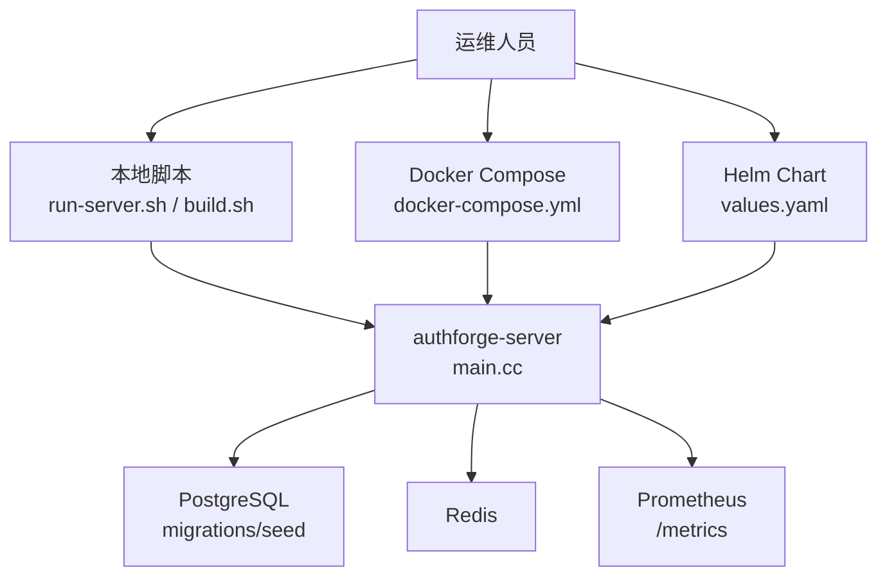
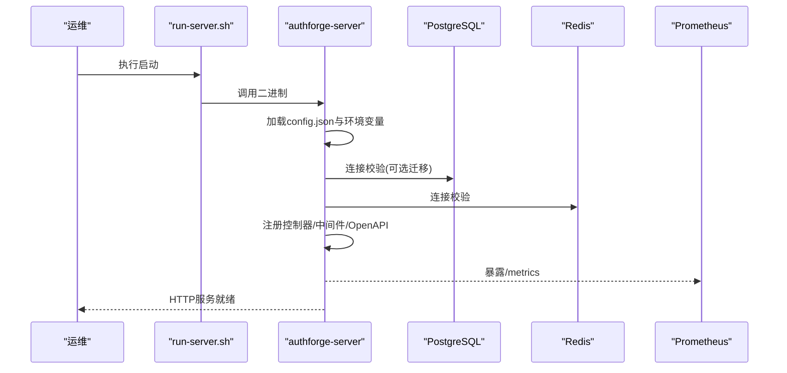
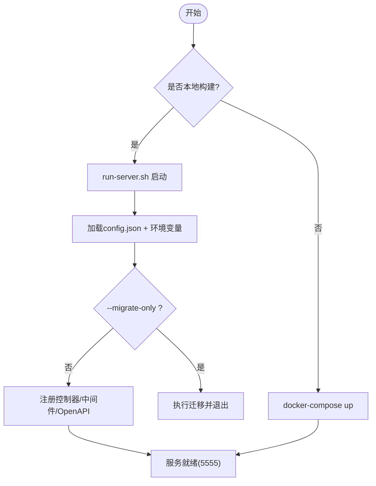
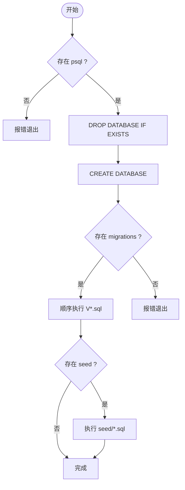
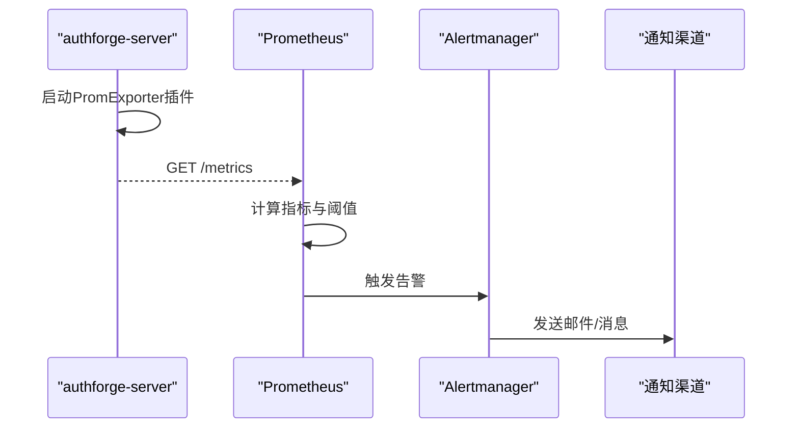
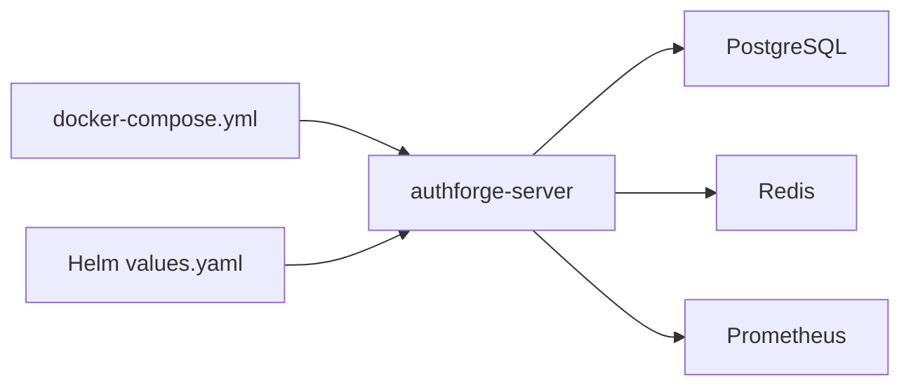

# 日常运维操作

<cite>
**本文引用的文件**
- [scripts/backend/run-server.sh](file://scripts/backend/run-server.sh)
- [scripts/backend/build.sh](file://scripts/backend/build.sh)
- [scripts/backend/setup-database.sh](file://scripts/backend/setup-database.sh)
- [scripts/backend/env_common.sh](file://scripts/backend/env_common.sh)
- [scripts/backend/reset-admin-password.sh](file://scripts/backend/reset-admin-password.sh)
- [scripts/backend/reset-account-lockout.sh](file://scripts/backend/reset-account-lockout.sh)
- [apps/server/config/config.json](file://apps/server/config/config.json)
- [apps/server/src/main.cc](file://apps/server/src/main.cc)
- [deploy/docker/docker-compose.yml](file://deploy/docker/docker-compose.yml)
- [deploy/docker/Dockerfile](file://deploy/docker/Dockerfile)
- [deploy/observability/prometheus.yml](file://deploy/observability/prometheus.yml)
- [deploy/helm/authforge/values.yaml](file://deploy/helm/authforge/values.yaml)
- [docs/backend/configuration-guide.md](file://docs/backend/configuration-guide.md)
- [docs/backend/observability.md](file://docs/backend/observability.md)
</cite>

## 目录
1. [简介](#简介)
2. [项目结构](#项目结构)
3. [核心组件](#核心组件)
4. [架构总览](#架构总览)
5. [详细组件分析](#详细组件分析)
6. [依赖关系分析](#依赖关系分析)
7. [性能注意事项](#性能注意事项)
8. [故障排查指南](#故障排查指南)
9. [结论](#结论)
10. [附录](#附录)

## 简介
本手册面向AuthForge的日常运维，覆盖服务启停（单实例与多实例）、数据库维护（备份、恢复、清理、索引优化）、日志管理（轮转、归档与分析）、监控告警（Prometheus指标、告警规则与通知）、账户管理与密码重置、自动化脚本与故障恢复流程。内容基于仓库内脚本、配置与文档整理而成，确保可执行性与一致性。

## 项目结构
- 后端服务：Drogon应用，通过配置文件加载监听端口、数据库、Redis、插件等；启动时支持仅迁移模式。
- 部署编排：提供docker-compose一键拉起后端、前端、PostgreSQL、Redis与Prometheus；Helm Chart用于Kubernetes部署。
- 运维脚本：构建、运行、数据库初始化、管理员密码重置、账户锁定复位等。
- 可观测性：内置Prometheus Exporter插件暴露/metrics；结构化日志便于采集分析。

**图示来源**
- [apps/server/src/main.cc:97-238](file://apps/server/src/main.cc#L97-L238)
- [deploy/docker/docker-compose.yml:30-65](file://deploy/docker/docker-compose.yml#L30-L65)
- [deploy/observability/prometheus.yml:1-8](file://deploy/observability/prometheus.yml#L1-L8)

**章节来源**
- [apps/server/src/main.cc:97-238](file://apps/server/src/main.cc#L97-L238)
- [deploy/docker/docker-compose.yml:1-127](file://deploy/docker/docker-compose.yml#L1-L127)
- [deploy/helm/authforge/values.yaml:1-145](file://deploy/helm/authforge/values.yaml#L1-L145)

## 核心组件
- 服务进程：authforge-server，读取config.json并注入环境变量，注册控制器、中间件、OpenAPI、迁移，最后启动HTTP服务。
- 配置中心：config.json定义监听器、数据库客户端、Redis客户端、应用参数、插件（PromExporter、OAuth2Plugin）等。
- 数据库：PostgreSQL，使用migrations进行版本化演进，seed提供初始数据。
- 缓存：Redis，用于会话、令牌家族等场景。
- 监控：PromExporter插件暴露/metrics；Prometheus抓取。

**章节来源**
- [apps/server/config/config.json:1-212](file://apps/server/config/config.json#L1-L212)
- [apps/server/src/main.cc:118-238](file://apps/server/src/main.cc#L118-L238)
- [docs/backend/observability.md:1-100](file://docs/backend/observability.md#L1-L100)

## 架构总览
下图展示从启动到对外服务的完整链路，包括配置加载、迁移执行、控制器注册、指标导出与外部依赖。

**图示来源**
- [scripts/backend/run-server.sh:1-45](file://scripts/backend/run-server.sh#L1-L45)
- [apps/server/src/main.cc:118-238](file://apps/server/src/main.cc#L118-L238)
- [deploy/observability/prometheus.yml:1-8](file://deploy/observability/prometheus.yml#L1-L8)

## 详细组件分析

### 服务启动与停止（单实例与多实例）
- 单实例本地启动
  - 构建：使用build.sh选择Debug/Release或启用Sanitizer，自动处理Conan依赖与CMake预设。
  - 运行：run-server.sh解析预设路径并exec启动二进制；默认在当前工作目录查找config.json。
  - 仅迁移：传入--migrate-only可同步执行待迁移后退出，适合Helm Hook Job。
- Docker多实例
  - docker-compose.yml编排后端、前端、PostgreSQL、Redis、Prometheus；通过环境变量注入敏感信息，挂载配置与SQL目录。
  - 容器镜像由Dockerfile构建，后端目标backend-runtime复制二进制与必要资源，暴露5555端口。
- Helm部署
  - values.yaml定义副本数、环境模式、外部数据库/Redis、迁移Job、Ingress等；生产建议关闭autoMigrate并在Hook中执行迁移。

**图示来源**
- [scripts/backend/build.sh:1-168](file://scripts/backend/build.sh#L1-L168)
- [scripts/backend/run-server.sh:1-45](file://scripts/backend/run-server.sh#L1-L45)
- [apps/server/src/main.cc:97-238](file://apps/server/src/main.cc#L97-L238)
- [deploy/docker/docker-compose.yml:30-65](file://deploy/docker/docker-compose.yml#L30-L65)
- [deploy/docker/Dockerfile:48-71](file://deploy/docker/Dockerfile#L48-L71)

**章节来源**
- [scripts/backend/build.sh:1-168](file://scripts/backend/build.sh#L1-L168)
- [scripts/backend/run-server.sh:1-45](file://scripts/backend/run-server.sh#L1-L45)
- [apps/server/src/main.cc:97-238](file://apps/server/src/main.cc#L97-L238)
- [deploy/docker/docker-compose.yml:1-127](file://deploy/docker/docker-compose.yml#L1-L127)
- [deploy/docker/Dockerfile:1-99](file://deploy/docker/Dockerfile#L1-L99)
- [deploy/helm/authforge/values.yaml:18-32](file://deploy/helm/authforge/values.yaml#L18-L32)

### 数据库维护任务
- 初始化与迁移
  - setup-database.sh：检查psql，删除并重建数据库，按序执行V*.sql迁移，再执行seed数据。
  - 运行时迁移：当OAUTH2_AUTO_MIGRATE=true时，服务启动会执行迁移（Docker Compose示例已开启）。
- 备份与恢复
  - 备份：使用pg_dump对oauth2_db进行逻辑备份（需安装postgresql-client）。
  - 恢复：使用psql将备份导入新库，或通过setup-database.sh重建。
- 清理与索引优化
  - 清理：根据业务策略定期清理过期token、刷新令牌族、审计日志等（参考相关表结构）。
  - 索引优化：在低峰期执行ANALYZE/REINDEX；必要时评估缺失索引并添加。
- 安全注意
  - 避免在生产环境直接DROP DATABASE；优先采用备份+恢复流程。
  - 谨慎执行seed，防止覆盖生产数据。

**图示来源**
- [scripts/backend/setup-database.sh:1-66](file://scripts/backend/setup-database.sh#L1-L66)

**章节来源**
- [scripts/backend/setup-database.sh:1-66](file://scripts/backend/setup-database.sh#L1-L66)
- [deploy/docker/docker-compose.yml:67-85](file://deploy/docker/docker-compose.yml#L67-L85)
- [docs/backend/configuration-guide.md:29-58](file://docs/backend/configuration-guide.md#L29-L58)

### 日志管理策略
- 日志配置
  - config.json的app.log段控制日志级别、路径、文件大小限制与最大保留数量。
  - main.cc会在启动时根据配置创建日志目录。
- 轮转与归档
  - 通过log_size_limit与max_files实现本地轮转；结合系统工具（如logrotate）或日志采集器进行归档。
- 分析与审计
  - 结构化日志包含RequestId，便于追踪；关键操作输出[AUDIT]标记，便于集中分析。
  - 建议将日志接入ELK/Splunk等系统进行检索与可视化。

**章节来源**
- [apps/server/config/config.json:102-110](file://apps/server/config/config.json#L102-L110)
- [apps/server/src/main.cc:42-73](file://apps/server/src/main.cc#L42-L73)
- [docs/backend/observability.md:32-99](file://docs/backend/observability.md#L32-L99)

### 监控告警配置
- Prometheus指标
  - 通过PromExporter插件暴露/metrics；docker-compose已集成Prometheus并抓取后端5555端口。
  - 指标包括请求总数、登录失败、延迟直方图等，详见可观测性文档。
- 告警规则与通知
  - 建议在Prometheus中配置规则（如错误率突增、P99延迟升高），并通过Alertmanager发送通知（邮件/企业微信等）。
- 健康检查
  - /health/live为最轻量的存活探针；/health/ready探测数据库与Redis状态。

**图示来源**
- [apps/server/config/config.json:133-140](file://apps/server/config/config.json#L133-L140)
- [deploy/observability/prometheus.yml:1-8](file://deploy/observability/prometheus.yml#L1-L8)
- [docs/backend/observability.md:1-31](file://docs/backend/observability.md#L1-L31)

**章节来源**
- [apps/server/config/config.json:133-140](file://apps/server/config/config.json#L133-L140)
- [deploy/observability/prometheus.yml:1-8](file://deploy/observability/prometheus.yml#L1-L8)
- [docs/backend/observability.md:1-31](file://docs/backend/observability.md#L1-L31)

### 账户管理与密码重置
- 管理员密码重置
  - reset-admin-password.sh：将admin用户密码哈希与盐重置为开发默认值，同时清零失败次数与锁定时间；执行后会打印当前状态供核对。
- 账户锁定处理
  - reset-account-lockout.sh：支持指定用户名或全部用户，重置failed_login_count与locked_until。
- 安全提示
  - 上述脚本适用于开发与测试环境；生产环境应通过受控流程与审计记录执行。

**章节来源**
- [scripts/backend/reset-admin-password.sh:1-37](file://scripts/backend/reset-admin-password.sh#L1-L37)
- [scripts/backend/reset-account-lockout.sh:1-36](file://scripts/backend/reset-account-lockout.sh#L1-L36)

### 自动化运维脚本与故障恢复
- 构建与运行
  - build.sh：统一构建入口，支持调试/发布/ sanitizer模式，自动处理Conan与CMake预设。
  - run-server.sh：定位二进制并启动；支持--debug/--release切换。
- 数据库准备
  - setup-database.sh：一键建库、迁移与种子数据。
- 环境检测与路径
  - env_common.sh：统一路径解析、CMake预设解析、Compose与Dockerfile路径导出。
- 故障恢复流程
  - 服务不可用：检查端口占用、日志目录权限、数据库/Redis连通性；必要时重启服务。
  - 数据库异常：回滚至最近可用备份，重新执行迁移；确认索引与统计信息更新。
  - 指标缺失：确认PromExporter插件启用、/metrics可达、Prometheus抓取配置正确。

**章节来源**
- [scripts/backend/build.sh:1-168](file://scripts/backend/build.sh#L1-L168)
- [scripts/backend/run-server.sh:1-45](file://scripts/backend/run-server.sh#L1-L45)
- [scripts/backend/setup-database.sh:1-66](file://scripts/backend/setup-database.sh#L1-L66)
- [scripts/backend/env_common.sh:1-83](file://scripts/backend/env_common.sh#L1-L83)

## 依赖关系分析
- 服务依赖
  - PostgreSQL：存储用户、令牌、审计等核心数据；支持迁移与种子数据。
  - Redis：会话与令牌家族等缓存。
  - Prometheus：拉取/metrics指标。
- 部署依赖
  - Docker Compose：编排多服务，卷持久化PG与Redis数据。
  - Helm：Kubernetes部署，支持外部数据库/Redis与迁移Job。

**图示来源**
- [deploy/docker/docker-compose.yml:30-114](file://deploy/docker/docker-compose.yml#L30-L114)
- [deploy/helm/authforge/values.yaml:97-136](file://deploy/helm/authforge/values.yaml#L97-L136)

**章节来源**
- [deploy/docker/docker-compose.yml:1-127](file://deploy/docker/docker-compose.yml#L1-L127)
- [deploy/helm/authforge/values.yaml:1-145](file://deploy/helm/authforge/values.yaml#L1-L145)

## 性能注意事项
- 连接池与超时
  - 调整db_clients与redis_clients的连接数与超时，避免资源耗尽。
- 压缩与静态资源
  - 启用gzip/brotli与静态资源缓存，降低带宽与提升首屏速度。
- 日志级别
  - 生产默认INFO，按需动态调整；避免trace/debug长期开启影响吞吐。
- 迁移与锁
  - 大表变更在低峰期执行，避免长事务阻塞。

[本节为通用指导，不直接分析具体文件]

## 故障排查指南
- 启动失败
  - 检查config.json是否存在且可读；确认环境变量覆盖是否正确；查看日志目录权限。
  - 若启用--migrate-only，确认迁移脚本无语法错误。
- 数据库连接失败
  - 验证主机、端口、用户名、密码；检查防火墙与安全组；使用psql连通性测试。
- 指标未采集
  - 确认PromExporter插件已启用；/metrics端点可达；Prometheus抓取目标正确。
- 账户被锁定
  - 使用reset-account-lockout.sh重置失败计数与锁定时间；核查登录失败原因。

**章节来源**
- [apps/server/src/main.cc:118-135](file://apps/server/src/main.cc#L118-L135)
- [scripts/backend/setup-database.sh:16-39](file://scripts/backend/setup-database.sh#L16-L39)
- [deploy/observability/prometheus.yml:4-8](file://deploy/observability/prometheus.yml#L4-L8)
- [scripts/backend/reset-account-lockout.sh:15-32](file://scripts/backend/reset-account-lockout.sh#L15-L32)

## 结论
AuthForge提供了完善的本地与容器化部署能力、标准化的数据库迁移机制、结构化的日志与指标体系，以及便捷的运维脚本。遵循本手册的流程，可高效完成服务启停、数据库维护、日志与监控配置、账户管理与故障恢复，保障系统稳定运行。

## 附录
- 常用命令速查
  - 构建：./scripts/backend/build.sh --release
  - 启动：./scripts/backend/run-server.sh
  - 数据库初始化：./scripts/backend/setup-database.sh
  - 管理员密码重置：./scripts/backend/reset-admin-password.sh
  - 解锁账户：./scripts/backend/reset-account-lockout.sh <username>
  - Docker编排：docker-compose -f deploy/docker/docker-compose.yml up -d
  - 查看指标：curl http://localhost:9090/targets 与 http://localhost:5555/metrics

[本节为补充说明，不直接分析具体文件]