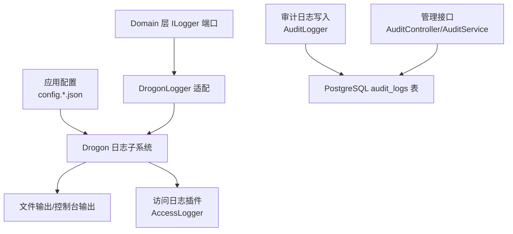
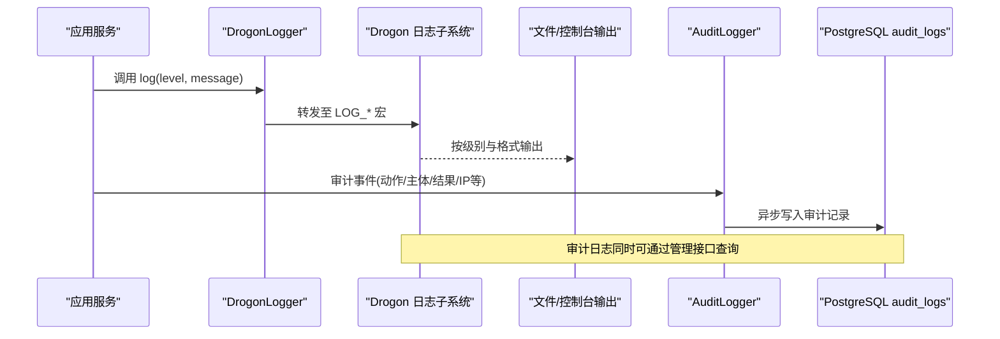
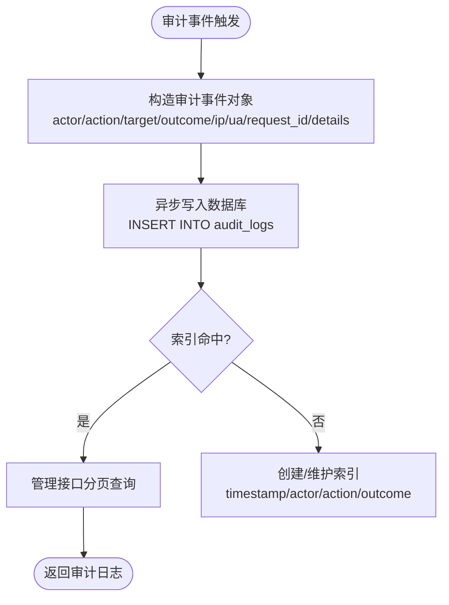
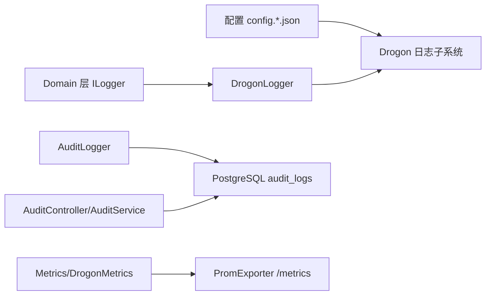

# 日志管理

<cite>
**本文引用的文件**
- [apps/server/config/config.json](file://apps/server/config/config.json)
- [apps/server/config/config.prod.json](file://apps/server/config/config.prod.json)
- [apps/server/config/config.dev.json](file://apps/server/config/config.dev.json)
- [apps/server/config/config.ci.json](file://apps/server/config/config.ci.json)
- [docs/backend/observability.md](file://docs/backend/observability.md)
- [libs/common/include/authforge/common/ports/ILogger.h](file://libs/common/include/authforge/common/ports/ILogger.h)
- [libs/drogon/src/adapters/DrogonLogger.cc](file://libs/drogon/src/adapters/DrogonLogger.cc)
- [libs/drogon/src/observability/AuditLogger.cc](file://libs/drogon/src/observability/AuditLogger.cc)
- [libs/storage-postgres/migrations/V012__audit_logs.sql](file://apps/server/migrations/V012__audit_logs.sql)
- [libs/drogon/src/admin/AuditService.cc](file://libs/drogon/src/admin/AuditService.cc)
- [libs/drogon/src/controllers/AuditController.cc](file://libs/drogon/src/controllers/AuditController.cc)
- [libs/drogon/src/observability/Metrics.cc](file://libs/drogon/src/observability/Metrics.cc)
- [libs/drogon/src/adapters/DrogonMetrics.cc](file://libs/drogon/src/adapters/DrogonMetrics.cc)
</cite>

## 目录
1. [简介](#简介)
2. [项目结构](#项目结构)
3. [核心组件](#核心组件)
4. [架构总览](#架构总览)
5. [详细组件分析](#详细组件分析)
6. [依赖关系分析](#依赖关系分析)
7. [性能考虑](#性能考虑)
8. [故障排查指南](#故障排查指南)
9. [结论](#结论)
10. [附录](#附录)

## 简介
本指南面向AuthForge的日志管理与可观测性实践，覆盖日志级别与格式、输出目标与轮转策略、结构化日志（含审计日志）的使用与最佳实践、日志分析工具与ELK集成方案、错误日志监控告警配置以及性能优化建议。内容基于仓库中的配置文件、实现代码与文档整理而成，确保可操作性与一致性。

## 项目结构
与日志相关的配置集中在应用配置文件中，日志实现与审计能力分布在Drogon适配器层与存储层，审计数据持久化在PostgreSQL中，并通过管理接口对外暴露。

图表来源
- [apps/server/config/config.json:102-110](file://apps/server/config/config.json#L102-L110)
- [apps/server/config/config.prod.json:101-109](file://apps/server/config/config.prod.json#L101-L109)
- [libs/drogon/src/adapters/DrogonLogger.cc:9-32](file://libs/drogon/src/adapters/DrogonLogger.cc#L9-L32)
- [libs/drogon/src/observability/AuditLogger.cc:39-77](file://libs/drogon/src/observability/AuditLogger.cc#L39-L77)
- [apps/server/migrations/V012__audit_logs.sql:4-22](file://apps/server/migrations/V012__audit_logs.sql#L4-L22)
- [libs/drogon/src/controllers/AuditController.cc:11-44](file://libs/drogon/src/controllers/AuditController.cc#L11-L44)
- [libs/drogon/src/admin/AuditService.cc:1-55](file://libs/drogon/src/admin/AuditService.cc#L1-L55)

章节来源
- [apps/server/config/config.json:102-110](file://apps/server/config/config.json#L102-L110)
- [apps/server/config/config.prod.json:101-109](file://apps/server/config/config.prod.json#L101-L109)
- [docs/backend/observability.md:32-100](file://docs/backend/observability.md#L32-L100)

## 核心组件
- 日志级别与格式化：通过应用配置的 app.log 子段控制；支持使用 spdlog、路径、基础文件名、大小限制、最大文件数、显示本地时间等。
- 访问日志：通过 Drogon 内置 AccessLogger 插件进行 HTTP 访问日志记录，可在开发配置中启用并设置独立文件与轮转参数。
- 结构化日志：系统采用上下文感知的结构化日志，关键安全操作输出带 [AUDIT] 标记的审计日志，便于 Splunk/ELK 收集分析。
- 审计日志持久化：审计事件异步写入 PostgreSQL 的 audit_logs 表，并提供分页查询与管理面板统计。
- 指标与告警：Prometheus Exporter 暴露 /metrics 端点；同时以 [METRIC] 结构化日志形式输出指标，便于日志采集侧消费。

章节来源
- [apps/server/config/config.json:102-110](file://apps/server/config/config.json#L102-L110)
- [apps/server/config/config.dev.json:101-151](file://apps/server/config/config.dev.json#L101-L151)
- [docs/backend/observability.md:32-100](file://docs/backend/observability.md#L32-L100)
- [libs/drogon/src/observability/AuditLogger.cc:39-77](file://libs/drogon/src/observability/AuditLogger.cc#L39-L77)
- [apps/server/migrations/V012__audit_logs.sql:4-22](file://apps/server/migrations/V012__audit_logs.sql#L4-L22)
- [libs/drogon/src/observability/Metrics.cc:73-88](file://libs/drogon/src/observability/Metrics.cc#L73-L88)
- [libs/drogon/src/adapters/DrogonMetrics.cc:12-30](file://libs/drogon/src/adapters/DrogonMetrics.cc#L12-L30)

## 架构总览
下图展示了从业务调用到日志落盘与审计持久化的完整链路，包括日志级别过滤、结构化输出、访问日志与审计日志分流。

图表来源
- [libs/drogon/src/adapters/DrogonLogger.cc:9-32](file://libs/drogon/src/adapters/DrogonLogger.cc#L9-L32)
- [libs/drogon/src/observability/AuditLogger.cc:39-77](file://libs/drogon/src/observability/AuditLogger.cc#L39-L77)
- [apps/server/migrations/V012__audit_logs.sql:4-22](file://apps/server/migrations/V012__audit_logs.sql#L4-L22)

## 详细组件分析

### 日志配置选项
- 日志级别
  - 统一六级：trace < debug < info < warn < error < fatal。生产默认 INFO，开发默认 DEBUG。
  - 动态调整：修改 app.log.log_level 字段即可生效。
- 输出目标与格式
  - use_spdlog：是否启用 spdlog 后端。
  - log_path：日志目录（为空时可能输出到控制台或默认位置）。
  - logfile_base_name：日志文件基础名（生产环境示例为 oauth2_prod）。
  - log_size_limit：单文件大小限制（字节）。
  - max_files：保留的最大文件数（生产示例为 10）。
  - display_local_time：是否显示本地时间。
- 访问日志
  - 通过 drogon::plugin::AccessLogger 插件配置独立 access.log 及轮转参数（如 log_size_limit、log_index）。

章节来源
- [docs/backend/observability.md:64-91](file://docs/backend/observability.md#L64-L91)
- [apps/server/config/config.json:102-110](file://apps/server/config/config.json#L102-L110)
- [apps/server/config/config.prod.json:101-109](file://apps/server/config/config.prod.json#L101-L109)
- [apps/server/config/config.dev.json:101-151](file://apps/server/config/config.dev.json#L101-L151)

### 日志轮转策略
- 文件大小限制：通过 log_size_limit 控制单文件上限，避免单文件过大影响检索与备份。
- 保留策略：通过 max_files 控制历史文件数量，自动清理超出数量的旧文件。
- 自动清理机制：由底层日志库根据上述配置执行轮转与清理，无需额外脚本。
- 访问日志轮转：AccessLogger 插件支持独立的 log_file 与 log_size_limit，可按需配置。

章节来源
- [apps/server/config/config.json:102-110](file://apps/server/config/config.json#L102-L110)
- [apps/server/config/config.prod.json:101-109](file://apps/server/config/config.prod.json#L101-L109)
- [apps/server/config/config.dev.json:142-151](file://apps/server/config/config.dev.json#L142-L151)

### 结构化日志与审计日志
- 结构化日志
  - 请求级上下文：所有日志自动附带 RequestId，便于分布式追踪关联。
  - 指标日志：[METRIC] 前缀的结构化指标行，供 PromExporter 或日志采集器消费。
- 审计日志
  - 关键安全操作输出 [AUDIT] 标记，包含 Action、User、Client、Success、IP 等关键字段。
  - 异步写入 PostgreSQL audit_logs 表，提供索引与分页查询。
  - 管理接口提供审计日志列表与仪表盘统计。

图表来源
- [libs/drogon/src/observability/AuditLogger.cc:39-77](file://libs/drogon/src/observability/AuditLogger.cc#L39-L77)
- [apps/server/migrations/V012__audit_logs.sql:4-22](file://apps/server/migrations/V012__audit_logs.sql#L4-L22)
- [libs/drogon/src/admin/AuditService.cc:1-55](file://libs/drogon/src/admin/AuditService.cc#L1-L55)

章节来源
- [docs/backend/observability.md:32-56](file://docs/backend/observability.md#L32-L56)
- [libs/drogon/src/observability/Metrics.cc:73-88](file://libs/drogon/src/observability/Metrics.cc#L73-L88)
- [libs/drogon/src/adapters/DrogonMetrics.cc:12-30](file://libs/drogon/src/adapters/DrogonMetrics.cc#L12-L30)
- [libs/drogon/src/controllers/AuditController.cc:11-44](file://libs/drogon/src/controllers/AuditController.cc#L11-L44)

### 日志级别与代码约定
- Domain 层不得直接使用 Drogon 的 LOG_* 宏，必须通过 ILogger 端口，以便单元测试替换 FakeLogger 捕获断言。
- Adapter/基础设施层可直接使用 LOG_* 宏。
- 六级映射：LogLevel::Trace→LOG_TRACE，Debug→LOG_DEBUG，Info→LOG_INFO，Warn→LOG_WARN，Error→LOG_ERROR，Fatal→LOG_FATAL。

章节来源
- [libs/common/include/authforge/common/ports/ILogger.h:29-53](file://libs/common/include/authforge/common/ports/ILogger.h#L29-L53)
- [libs/drogon/src/adapters/DrogonLogger.cc:9-32](file://libs/drogon/src/adapters/DrogonLogger.cc#L9-L32)
- [docs/backend/observability.md:93-98](file://docs/backend/observability.md#L93-L98)

## 依赖关系分析
- 配置驱动：app.log.* 与 plugins.AccessLogger.* 决定日志行为与输出目标。
- 适配器解耦：Domain 层通过 ILogger 抽象，Adapter 层实现 DrogonLogger，屏蔽具体日志框架差异。
- 审计与存储：AuditLogger 将审计事件写入 PostgreSQL，AuditController/AuditService 提供查询与统计。
- 指标与采集：Metrics 与 DrogonMetrics 以结构化日志形式输出指标，PromExporter 暴露 /metrics 端点。

图表来源
- [apps/server/config/config.json:102-110](file://apps/server/config/config.json#L102-L110)
- [libs/drogon/src/adapters/DrogonLogger.cc:9-32](file://libs/drogon/src/adapters/DrogonLogger.cc#L9-L32)
- [libs/drogon/src/observability/AuditLogger.cc:39-77](file://libs/drogon/src/observability/AuditLogger.cc#L39-L77)
- [apps/server/migrations/V012__audit_logs.sql:4-22](file://apps/server/migrations/V012__audit_logs.sql#L4-L22)
- [libs/drogon/src/observability/Metrics.cc:73-88](file://libs/drogon/src/observability/Metrics.cc#L73-L88)
- [libs/drogon/src/adapters/DrogonMetrics.cc:12-30](file://libs/drogon/src/adapters/DrogonMetrics.cc#L12-L30)

章节来源
- [apps/server/config/config.json:102-110](file://apps/server/config/config.json#L102-L110)
- [libs/drogon/src/adapters/DrogonLogger.cc:9-32](file://libs/drogon/src/adapters/DrogonLogger.cc#L9-L32)
- [libs/drogon/src/observability/AuditLogger.cc:39-77](file://libs/drogon/src/observability/AuditLogger.cc#L39-L77)
- [apps/server/migrations/V012__audit_logs.sql:4-22](file://apps/server/migrations/V012__audit_logs.sql#L4-L22)
- [libs/drogon/src/observability/Metrics.cc:73-88](file://libs/drogon/src/observability/Metrics.cc#L73-L88)
- [libs/drogon/src/adapters/DrogonMetrics.cc:12-30](file://libs/drogon/src/adapters/DrogonMetrics.cc#L12-L30)

## 性能考虑
- 日志级别调优
  - 生产默认 INFO，减少 IO 压力；仅在定位问题时临时提升为 DEBUG/TRACE。
  - 避免在热路径输出 trace/debug 级别日志。
- 轮转与保留
  - 合理设置 log_size_limit 与 max_files，平衡检索效率与磁盘占用。
  - 定期归档与压缩历史日志文件。
- 结构化与异步
  - 审计日志异步写入，降低主流程延迟。
  - 使用结构化字段（Action/User/Client/IP等）便于高效检索与聚合。
- 指标与采集
  - 利用 [METRIC] 结构化日志与 /metrics 端点双通道，提高可观测性与容错。
  - 结合 Prometheus/Grafana 建立 QPS、错误率、P99 延迟等看板。

[本节为通用指导，不直接分析具体文件]

## 故障排查指南
- 无法输出日志
  - 检查 app.log.log_level 是否高于当前级别。
  - 确认 log_path 存在且可写；logfile_base_name 是否正确。
- 日志未轮转
  - 核对 log_size_limit 与 max_files 配置；确认底层日志库已启用轮转。
- 审计日志缺失
  - 检查数据库连接与 audit_logs 表是否存在；确认 AuditLogger 异步写入成功。
  - 通过管理接口查询审计日志列表，验证数据可见性。
- 指标不可用
  - 确认 PromExporter 插件已启用且 /metrics 端点可达。
  - 检查 [METRIC] 结构化日志是否被采集器抓取。

章节来源
- [apps/server/config/config.json:102-110](file://apps/server/config/config.json#L102-L110)
- [apps/server/config/config.prod.json:101-109](file://apps/server/config/config.prod.json#L101-L109)
- [libs/drogon/src/observability/AuditLogger.cc:39-77](file://libs/drogon/src/observability/AuditLogger.cc#L39-L77)
- [apps/server/migrations/V012__audit_logs.sql:4-22](file://apps/server/migrations/V012__audit_logs.sql#L4-L22)
- [libs/drogon/src/observability/Metrics.cc:73-88](file://libs/drogon/src/observability/Metrics.cc#L73-L88)

## 结论
AuthForge 的日志体系以配置驱动、适配器解耦、结构化输出为核心，结合审计日志持久化与指标采集，形成完整的可观测性闭环。通过合理的日志级别、轮转策略与工具链集成，可实现高效的排障、合规审计与性能优化。

[本节为总结性内容，不直接分析具体文件]

## 附录

### 日志配置清单（来自仓库配置）
- 应用日志
  - use_spdlog：true/false
  - log_path：日志目录
  - logfile_base_name：日志基础名
  - log_size_limit：单文件大小（字节）
  - max_files：保留文件数
  - log_level：TRACE/DEBUG/INFO/WARN/ERROR/FATAL
  - display_local_time：是否显示本地时间
- 访问日志（AccessLogger 插件）
  - use_spdlog：true/false
  - log_path：访问日志目录
  - log_format：访问日志格式
  - log_file：访问日志文件名
  - log_size_limit：访问日志文件大小限制
  - log_index：访问日志索引

章节来源
- [apps/server/config/config.json:102-110](file://apps/server/config/config.json#L102-L110)
- [apps/server/config/config.prod.json:101-109](file://apps/server/config/config.prod.json#L101-L109)
- [apps/server/config/config.dev.json:101-151](file://apps/server/config/config.dev.json#L101-L151)

### 结构化日志与审计日志最佳实践
- 使用 RequestId 关联请求链路，便于跨服务追踪。
- 对关键安全操作输出 [AUDIT] 审计日志，包含必要上下文字段。
- 指标以 [METRIC] 结构化日志输出，配合 PromExporter 与日志采集器。
- 在 Domain 层通过 ILogger 抽象，保持测试友好与实现解耦。

章节来源
- [docs/backend/observability.md:32-56](file://docs/backend/observability.md#L32-L56)
- [libs/drogon/src/observability/AuditLogger.cc:39-77](file://libs/drogon/src/observability/AuditLogger.cc#L39-L77)
- [libs/drogon/src/adapters/DrogonMetrics.cc:12-30](file://libs/drogon/src/adapters/DrogonMetrics.cc#L12-L30)
- [libs/common/include/authforge/common/ports/ILogger.h:29-53](file://libs/common/include/authforge/common/ports/ILogger.h#L29-L53)

### 日志分析工具与 ELK 集成建议
- 命令行工具
  - grep：快速筛选关键字（如 AUDIT、ERROR、[METRIC]）。
  - awk：提取字段与聚合统计（如按 Action、Outcome 分组计数）。
- ELK/Loki 集成
  - 使用日志采集器抓取应用日志与访问日志。
  - 解析结构化字段（Action、User、Client、IP 等）建立索引。
  - 构建告警规则：当 ERROR/FATAL 频率超过阈值或特定审计事件出现时触发告警。
  - 结合 Prometheus 指标与 Grafana 看板，实现端到端可观测性。

[本节为通用指导，不直接分析具体文件]