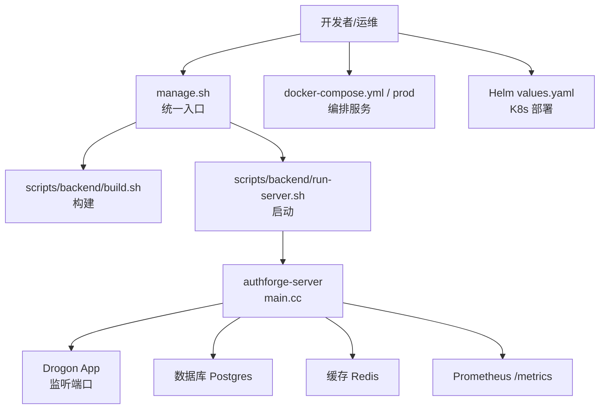
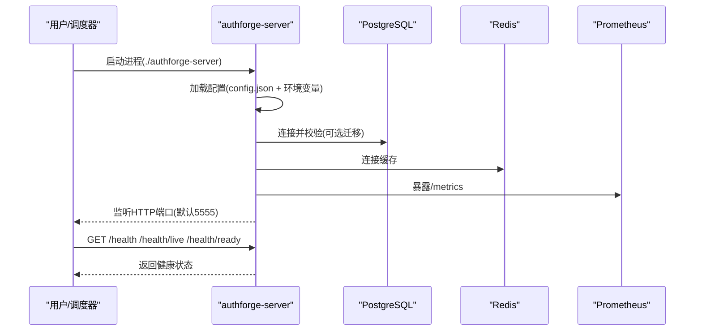
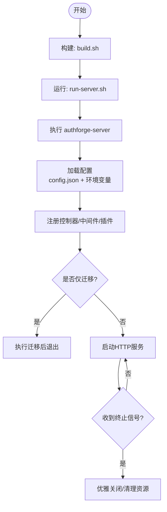
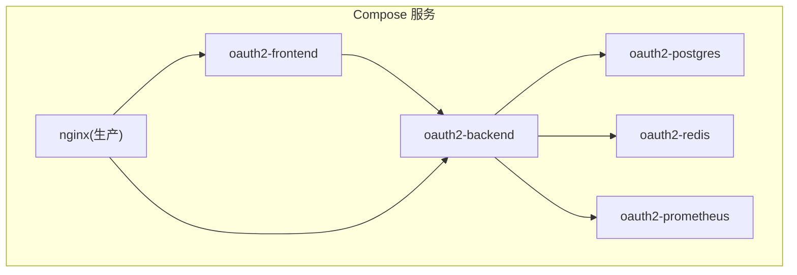
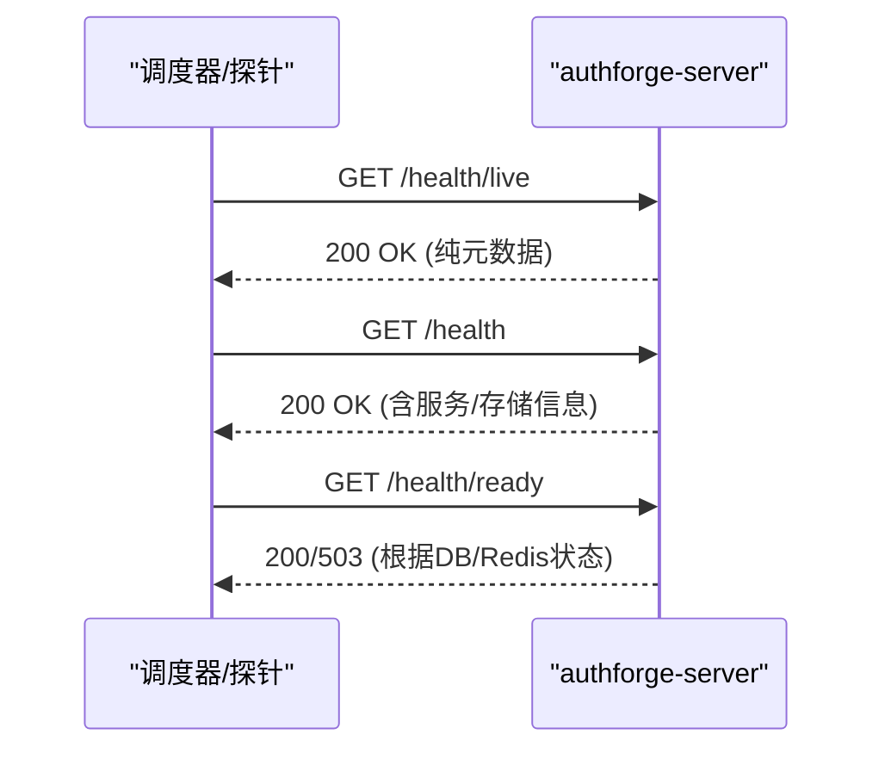
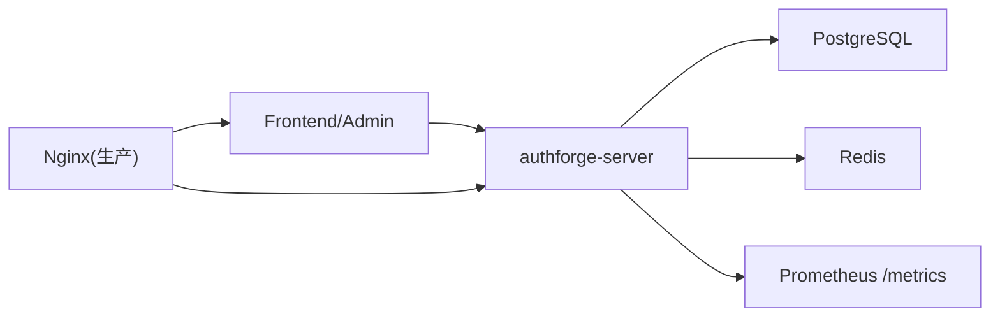

# 服务管理

<cite>
**本文引用的文件**
- [apps/server/src/main.cc](file://apps/server/src/main.cc)
- [scripts/backend/run-server.sh](file://scripts/backend/run-server.sh)
- [scripts/backend/build.sh](file://scripts/backend/build.sh)
- [manage.sh](file://manage.sh)
- [deploy/docker/Dockerfile](file://deploy/docker/Dockerfile)
- [deploy/docker/docker-compose.yml](file://deploy/docker/docker-compose.yml)
- [deploy/docker/docker-compose.prod.yml](file://deploy/docker/docker-compose.prod.yml)
- [deploy/env/server.env.example](file://deploy/env/server.env.example)
- [apps/server/config/config.json](file://apps/server/config/config.json)
- [apps/server/config/config.prod.json](file://apps/server/config/config.prod.json)
- [deploy/helm/authforge/values.yaml](file://deploy/helm/authforge/values.yaml)
- [tests/integration/controllers/HealthEndpointHttpTest.cc](file://tests/integration/controllers/HealthEndpointHttpTest.cc)
</cite>

## 目录
1. [简介](#简介)
2. [项目结构](#项目结构)
3. [核心组件](#核心组件)
4. [架构总览](#架构总览)
5. [详细组件分析](#详细组件分析)
6. [依赖关系分析](#依赖关系分析)
7. [性能与可观测性](#性能与可观测性)
8. [故障诊断指南](#故障诊断指南)
9. [结论](#结论)
10. [附录：常用命令速查](#附录常用命令速查)

## 简介
本指南面向运维与平台工程团队，提供 AuthForge 服务的启动、停止、配置、容器化编排与健康检查的完整操作手册。内容覆盖：
- 单实例与多实例部署的启动方式（本地二进制、Docker Compose、Helm）
- Docker 容器化部署的服务管理与编排
- 环境变量与配置文件的管理策略与优先级
- 健康检查端点的使用方法与常见故障排查
- 优雅关闭、重启与资源清理的最佳实践

## 项目结构
AuthForge 后端服务基于 Drogon 框架，入口为 C++ 程序；构建与运行通过脚本统一管理；容器化使用统一 Dockerfile 多阶段构建；编排支持 docker-compose 与 Helm。

图表来源
- [manage.sh:1-142](file://manage.sh#L1-L142)
- [scripts/backend/build.sh:1-168](file://scripts/backend/build.sh#L1-L168)
- [scripts/backend/run-server.sh:1-45](file://scripts/backend/run-server.sh#L1-L45)
- [apps/server/src/main.cc:97-239](file://apps/server/src/main.cc#L97-L239)
- [deploy/docker/docker-compose.yml:1-127](file://deploy/docker/docker-compose.yml#L1-L127)
- [deploy/docker/docker-compose.prod.yml:1-221](file://deploy/docker/docker-compose.prod.yml#L1-L221)
- [deploy/helm/authforge/values.yaml:1-145](file://deploy/helm/authforge/values.yaml#L1-L145)

章节来源
- [manage.sh:1-142](file://manage.sh#L1-L142)
- [scripts/backend/build.sh:1-168](file://scripts/backend/build.sh#L1-L168)
- [scripts/backend/run-server.sh:1-45](file://scripts/backend/run-server.sh#L1-L45)
- [apps/server/src/main.cc:97-239](file://apps/server/src/main.cc#L97-L239)
- [deploy/docker/docker-compose.yml:1-127](file://deploy/docker/docker-compose.yml#L1-L127)
- [deploy/docker/docker-compose.prod.yml:1-221](file://deploy/docker/docker-compose.prod.yml#L1-L221)
- [deploy/helm/authforge/values.yaml:1-145](file://deploy/helm/authforge/values.yaml#L1-L145)

## 核心组件
- 服务入口与启动流程：C++ 主程序负责加载配置、注册控制器、初始化中间件、执行迁移（可选）、启动 HTTP 服务器。
- 构建与运行脚本：统一构建与运行入口，屏蔽平台差异。
- 容器镜像：统一 Dockerfile 提供开发、构建与运行时目标。
- 编排：docker-compose 用于本地/测试环境；Helm 用于 Kubernetes 生产环境。
- 配置与环境变量：config.json 与 .env 共同决定运行时行为，具备明确优先级。
- 健康检查：内置 /health、/health/live、/health/ready 等端点，配合容器 healthcheck 实现自动探测。

章节来源
- [apps/server/src/main.cc:97-239](file://apps/server/src/main.cc#L97-L239)
- [scripts/backend/run-server.sh:1-45](file://scripts/backend/run-server.sh#L1-L45)
- [deploy/docker/Dockerfile:1-99](file://deploy/docker/Dockerfile#L1-L99)
- [deploy/docker/docker-compose.yml:1-127](file://deploy/docker/docker-compose.yml#L1-L127)
- [deploy/docker/docker-compose.prod.yml:1-221](file://deploy/docker/docker-compose.prod.yml#L1-L221)
- [deploy/env/server.env.example:1-70](file://deploy/env/server.env.example#L1-L70)
- [apps/server/config/config.json:1-212](file://apps/server/config/config.json#L1-L212)
- [apps/server/config/config.prod.json:1-264](file://apps/server/config/config.prod.json#L1-L264)

## 架构总览
下图展示从进程启动到对外暴露 API 的关键路径，以及外部依赖（Postgres、Redis、Prometheus）。

图表来源
- [apps/server/src/main.cc:97-239](file://apps/server/src/main.cc#L97-L239)
- [apps/server/config/config.json:1-212](file://apps/server/config/config.json#L1-L212)
- [apps/server/config/config.prod.json:1-264](file://apps/server/config/config.prod.json#L1-L264)
- [deploy/docker/docker-compose.prod.yml:132-137](file://deploy/docker/docker-compose.prod.yml#L132-L137)

## 详细组件分析

### 启动与停止流程（本地二进制）
- 构建产物：通过构建脚本生成二进制，输出至预设目录。
- 启动方式：运行脚本定位并执行二进制；支持 Debug/Release 模式切换。
- 停止方式：直接终止进程或发送信号；服务配置启用处理终止信号以实现优雅关闭。

图表来源
- [scripts/backend/build.sh:1-168](file://scripts/backend/build.sh#L1-L168)
- [scripts/backend/run-server.sh:1-45](file://scripts/backend/run-server.sh#L1-L45)
- [apps/server/src/main.cc:97-239](file://apps/server/src/main.cc#L97-L239)
- [apps/server/config/config.json:102-113](file://apps/server/config/config.json#L102-L113)
- [apps/server/config/config.prod.json:101-113](file://apps/server/config/config.prod.json#L101-L113)

章节来源
- [scripts/backend/build.sh:1-168](file://scripts/backend/build.sh#L1-L168)
- [scripts/backend/run-server.sh:1-45](file://scripts/backend/run-server.sh#L1-L45)
- [apps/server/src/main.cc:97-239](file://apps/server/src/main.cc#L97-L239)

### 单实例与多实例部署
- 单实例：本地运行二进制或通过 docker-compose 启动单个后端容器。
- 多实例：在 Kubernetes 中通过 Helm 设置 replicaCount > 1；或使用反向代理将多个后端实例暴露给前端。
- 会话与无状态：服务端会话由配置控制；若需水平扩展，建议将会话存储于 Redis（已配置），确保无状态扩展。

章节来源
- [deploy/helm/authforge/values.yaml:18-54](file://deploy/helm/authforge/values.yaml#L18-L54)
- [apps/server/config/config.json:41-48](file://apps/server/config/config.json#L41-L48)
- [apps/server/config/config.prod.json:41-48](file://apps/server/config/config.prod.json#L41-L48)

### Docker 容器化部署与服务编排
- 统一镜像：Dockerfile 提供 backend-dev、backend-builder、backend-runtime、frontend-builder、frontend-runtime 等多阶段目标。
- 开发编排：docker-compose.yml 包含后端、前端、管理台、Postgres、Redis、Prometheus。
- 生产编排：docker-compose.prod.yml 引入 Nginx 反向代理、只暴露内部端口、健康检查、迁移 Job。
- 关键命令：
  - 启动全栈：使用 manage.sh 的 docker-up 或直接 docker compose up -d
  - 停止全栈：docker compose down
  - 仅迁移：使用 migrate profile 运行一次性迁移任务

图表来源
- [deploy/docker/docker-compose.yml:1-127](file://deploy/docker/docker-compose.yml#L1-L127)
- [deploy/docker/docker-compose.prod.yml:1-221](file://deploy/docker/docker-compose.prod.yml#L1-L221)
- [deploy/docker/Dockerfile:1-99](file://deploy/docker/Dockerfile#L1-L99)

章节来源
- [deploy/docker/Dockerfile:1-99](file://deploy/docker/Dockerfile#L1-L99)
- [deploy/docker/docker-compose.yml:1-127](file://deploy/docker/docker-compose.yml#L1-L127)
- [deploy/docker/docker-compose.prod.yml:1-221](file://deploy/docker/docker-compose.prod.yml#L1-L221)
- [manage.sh:119-126](file://manage.sh#L119-L126)

### Helm/Kubernetes 部署
- 镜像与副本数：通过 values.yaml 配置镜像版本、副本数量与资源限制。
- 敏感信息：通过 Secret 注入密码与密钥，避免明文写入配置。
- 迁移：使用 Hook Job 执行 schema 迁移，应用启动时仅做自检查。
- Ingress：可按需启用 Ingress 暴露服务。

章节来源
- [deploy/helm/authforge/values.yaml:1-145](file://deploy/helm/authforge/values.yaml#L1-L145)

### 配置管理与环境变量
- 配置文件：config.json 与 config.prod.json 定义监听、数据库、Redis、日志、插件等。
- 环境变量：server.env.example 列出所有可覆盖的环境变量，优先级高于配置文件。
- 生产安全：生产环境要求 HTTPS Issuer、非默认密码；JWT 密钥可通过文件或内联键提供。
- 推荐做法：
  - 使用 .env 或 Secret 管理敏感项
  - 通过环境变量覆盖配置，避免修改静态配置文件
  - 开启详细验证错误仅在开发环境

章节来源
- [apps/server/config/config.json:1-212](file://apps/server/config/config.json#L1-L212)
- [apps/server/config/config.prod.json:1-264](file://apps/server/config/config.prod.json#L1-L264)
- [deploy/env/server.env.example:1-70](file://deploy/env/server.env.example#L1-L70)
- [deploy/docker/docker-compose.prod.yml:94-137](file://deploy/docker/docker-compose.prod.yml#L94-L137)

### 健康检查端点与监控
- 健康端点：
  - /health：返回服务基本信息与存储类型
  - /health/live：最轻量存活检查，始终返回成功
  - /health/ready：检查数据库与缓存可用性
- 容器健康检查：生产编排中配置 curl 调用 /health 进行健康探测
- 指标暴露：/metrics 暴露 Prometheus 指标

图表来源
- [tests/integration/controllers/HealthEndpointHttpTest.cc:1-32](file://tests/integration/controllers/HealthEndpointHttpTest.cc#L1-L32)
- [deploy/docker/docker-compose.prod.yml:132-137](file://deploy/docker/docker-compose.prod.yml#L132-L137)

章节来源
- [tests/integration/controllers/HealthEndpointHttpTest.cc:1-32](file://tests/integration/controllers/HealthEndpointHttpTest.cc#L1-L32)
- [deploy/docker/docker-compose.prod.yml:132-137](file://deploy/docker/docker-compose.prod.yml#L132-L137)

### 服务重启、优雅关闭与资源清理最佳实践
- 优雅关闭：
  - 配置启用处理终止信号，确保请求完成后再退出
  - 在生产环境中通过容器管理器发送 SIGTERM 触发优雅关闭
- 重启策略：
  - 使用容器编排的 restart: always 或 K8s 的 RestartPolicy
  - 滚动更新时先下线旧实例再启动新实例
- 资源清理：
  - 定期清理日志轮转与临时文件
  - 使用迁移 Job 而非应用启动时迁移，避免阻塞启动
  - 对 Redis/PG 的连接池与超时进行合理配置

章节来源
- [apps/server/config/config.json:102-113](file://apps/server/config/config.json#L102-L113)
- [apps/server/config/config.prod.json:101-113](file://apps/server/config/config.prod.json#L101-L113)
- [deploy/docker/docker-compose.prod.yml:141-169](file://deploy/docker/docker-compose.prod.yml#L141-L169)

## 依赖关系分析
- 运行时依赖：PostgreSQL（持久化）、Redis（缓存与会话）、Prometheus（指标）
- 构建依赖：Conan 包管理器、CMake、Drogon 工具链
- 编排依赖：Docker Compose、Nginx（生产）、Helm（K8s）

图表来源
- [apps/server/config/config.json:9-40](file://apps/server/config/config.json#L9-L40)
- [apps/server/config/config.prod.json:9-40](file://apps/server/config/config.prod.json#L9-L40)
- [deploy/docker/docker-compose.yml:30-103](file://deploy/docker/docker-compose.yml#L30-L103)
- [deploy/docker/docker-compose.prod.yml:74-139](file://deploy/docker/docker-compose.prod.yml#L74-L139)

章节来源
- [apps/server/config/config.json:9-40](file://apps/server/config/config.json#L9-L40)
- [apps/server/config/config.prod.json:9-40](file://apps/server/config/config.prod.json#L9-L40)
- [deploy/docker/docker-compose.yml:30-103](file://deploy/docker/docker-compose.yml#L30-L103)
- [deploy/docker/docker-compose.prod.yml:74-139](file://deploy/docker/docker-compose.prod.yml#L74-L139)

## 性能与可观测性
- 线程与连接：通过配置调整线程数、连接池大小与超时
- 压缩与缓存：启用 gzip/brotli、静态资源缓存
- 限流：生产配置启用 Hodor 限流插件，保护敏感接口
- 指标：/metrics 暴露 Prometheus 指标，便于监控告警

章节来源
- [apps/server/config/config.json:41-131](file://apps/server/config/config.json#L41-L131)
- [apps/server/config/config.prod.json:41-131](file://apps/server/config/config.prod.json#L41-L131)
- [apps/server/config/config.prod.json:142-188](file://apps/server/config/config.prod.json#L142-L188)

## 故障诊断指南
- 启动失败：
  - 检查配置文件路径与权限
  - 检查数据库与 Redis 连通性与认证
  - 查看日志目录与日志级别
- 健康检查失败：
  - 使用 /health/live 确认进程存活
  - 使用 /health/ready 检查依赖可用性
- 容器健康：
  - 查看编排中的 healthcheck 配置
  - 使用 docker logs 或 kubectl logs 获取日志
- 迁移问题：
  - 使用 migrate profile 单独执行迁移
  - 确认数据库版本与迁移脚本一致

章节来源
- [apps/server/src/main.cc:118-136](file://apps/server/src/main.cc#L118-L136)
- [deploy/docker/docker-compose.prod.yml:132-137](file://deploy/docker/docker-compose.prod.yml#L132-L137)
- [deploy/docker/docker-compose.prod.yml:141-169](file://deploy/docker/docker-compose.prod.yml#L141-L169)

## 结论
AuthForge 提供了完善的启动、配置、容器化与编排能力。通过统一的脚本与配置体系，可在本地、容器与 Kubernetes 环境中快速部署与运维。结合健康检查与指标暴露，可实现可靠的监控与自动化运维。遵循最佳实践（环境变量优先、敏感信息入密、滚动更新、优雅关闭）可显著提升稳定性与可维护性。

## 附录：常用命令速查
- 构建后端：./manage.sh build-backend [--debug]
- 运行后端：./manage.sh run-backend [--debug]
- 启动全栈：./manage.sh docker-up
- 停止全栈：./manage.sh docker-down
- 仅迁移：docker compose -f deploy/docker/docker-compose.prod.yml --profile migrate run --rm migrate
- 健康检查：curl http://localhost:5555/health /health/live /health/ready
- 指标抓取：curl http://localhost:9090/metrics

章节来源
- [manage.sh:62-126](file://manage.sh#L62-L126)
- [deploy/docker/docker-compose.prod.yml:141-169](file://deploy/docker/docker-compose.prod.yml#L141-L169)
- [deploy/docker/docker-compose.prod.yml:132-137](file://deploy/docker/docker-compose.prod.yml#L132-L137)