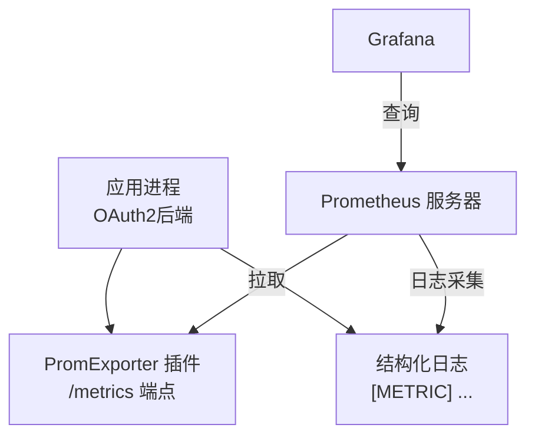
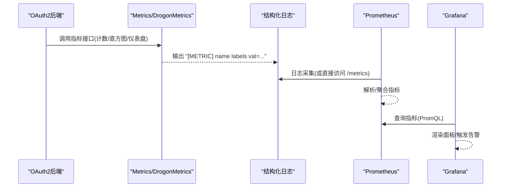
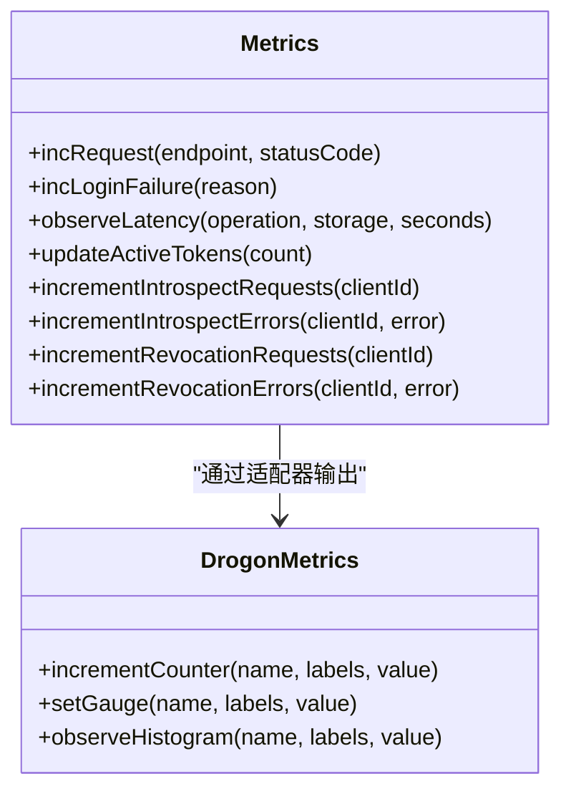

# 监控告警

<cite>
**本文引用的文件**
- [prometheus.yml](file://deploy/observability/prometheus.yml)
- [observability.md](file://docs/backend/observability.md)
- [Metrics.h](file://libs/drogon/include/authforge/drogon/observability/Metrics.h)
- [Metrics.cc](file://libs/drogon/src/observability/Metrics.cc)
- [DrogonMetrics.h](file://libs/drogon/include/authforge/drogon/adapters/DrogonMetrics.h)
- [DrogonMetrics.cc](file://libs/drogon/src/adapters/DrogonMetrics.cc)
- [config.json](file://apps/server/config/config.json)
- [config.prod.json](file://apps/server/config/config.prod.json)
- [HealthEndpointHttpTest.cc](file://tests/integration/controllers/HealthEndpointHttpTest.cc)
</cite>

## 目录
1. [简介](#简介)
2. [项目结构](#项目结构)
3. [核心组件](#核心组件)
4. [架构总览](#架构总览)
5. [详细组件分析](#详细组件分析)
6. [依赖关系分析](#依赖关系分析)
7. [性能考虑](#性能考虑)
8. [故障排查指南](#故障排查指南)
9. [结论](#结论)
10. [附录](#附录)

## 简介
本指南面向生产与运维团队，说明如何在 AuthForge 中启用并配置 Prometheus 指标采集、Grafana 可视化与告警通知，并提供性能监控最佳实践与故障排查方法。系统通过 Drogon 的 PromExporter 插件暴露 /metrics 端点，业务指标以结构化日志形式输出（[METRIC] 前缀），由日志采集器或 PromExporter 读取后统一纳入 Prometheus 时序数据库；Grafana 基于这些指标构建仪表板与告警规则。

## 项目结构
- 指标采集配置位于 deploy/observability/prometheus.yml，定义抓取间隔与目标服务。
- 服务端通过 apps/server/config/*.json 中的 plugins 开启 drogon::plugin::PromExporter，并在 /metrics 暴露指标。
- 指标发射在 libs/drogon 层完成：
  - 高层接口与线程安全契约在 Metrics.h。
  - 具体实现将指标写入结构化日志（LOG_INFO）以便被外部采集。
  - 通用适配器 DrogonMetrics 提供统一的 incrementCounter/setGauge/observeHistogram 能力。
- 健康检查端点由测试覆盖，便于编排与就绪探测。

图表来源
- [prometheus.yml:1-8](file://deploy/observability/prometheus.yml#L1-L8)
- [config.json:133-140](file://apps/server/config/config.json#L133-L140)
- [config.prod.json:133-140](file://apps/server/config/config.prod.json#L133-L140)
- [Metrics.cc:19-35](file://libs/drogon/src/observability/Metrics.cc#L19-L35)
- [DrogonMetrics.cc:33-78](file://libs/drogon/src/adapters/DrogonMetrics.cc#L33-L78)

章节来源
- [prometheus.yml:1-8](file://deploy/observability/prometheus.yml#L1-L8)
- [config.json:133-140](file://apps/server/config/config.json#L133-L140)
- [config.prod.json:133-140](file://apps/server/config/config.prod.json#L133-L140)
- [observability.md:5-30](file://docs/backend/observability.md#L5-L30)

## 核心组件
- 指标定义与发射
  - 计数器：请求总量、登录失败、Introspect/Revocation 请求与错误等。
  - 直方图：关键步骤耗时（含存储后端维度）。
  - 仪表盘：活跃 Token 估算值。
  - 线程安全：并发 IO 线程调用需保证线程安全，当前实现为无共享状态的日志输出。
- 适配器与端口
  - IMetrics 抽象了通用指标发射接口，便于替换实现或注入测试替身。
  - DrogonMetrics 将通用接口映射到结构化日志输出，保持向后兼容。
- 可观测性文档
  - 指标清单、面板建议、日志级别约定与动态调整方式。

章节来源
- [Metrics.h:8-59](file://libs/drogon/include/authforge/drogon/observability/Metrics.h#L8-L59)
- [Metrics.cc:19-35](file://libs/drogon/src/observability/Metrics.cc#L19-L35)
- [DrogonMetrics.h:30-52](file://libs/drogon/include/authforge/drogon/adapters/DrogonMetrics.h#L30-L52)
- [DrogonMetrics.cc:33-78](file://libs/drogon/src/adapters/DrogonMetrics.cc#L33-L78)
- [observability.md:9-30](file://docs/backend/observability.md#L9-L30)

## 架构总览
下图展示了从业务代码到 Prometheus/Grafana 的完整链路：业务调用指标接口 → 适配器输出结构化日志 → 日志采集/PromExporter 暴露指标 → Prometheus 存储 → Grafana 查询与告警。

图表来源
- [Metrics.cc:19-35](file://libs/drogon/src/observability/Metrics.cc#L19-L35)
- [DrogonMetrics.cc:33-78](file://libs/drogon/src/adapters/DrogonMetrics.cc#L33-L78)
- [prometheus.yml:1-8](file://deploy/observability/prometheus.yml#L1-L8)

## 详细组件分析

### Prometheus 指标收集配置
- 抓取间隔与目标
  - 全局抓取间隔：15 秒。
  - 抓取任务：oauth2-backend，目标地址 oauth2-backend:5555。
- 服务端暴露 /metrics
  - 通过 Drogon 插件 drogon::plugin::PromExporter 启用，路径为 /metrics。
  - 开发/默认配置与生产配置均包含该插件条目。
- 存储策略
  - 由 Prometheus 侧决定（保留期、压缩、分片等），仓库未内置相关配置。

章节来源
- [prometheus.yml:1-8](file://deploy/observability/prometheus.yml#L1-L8)
- [config.json:133-140](file://apps/server/config/config.json#L133-L140)
- [config.prod.json:133-140](file://apps/server/config/config.prod.json#L133-L140)

### 自定义指标定义与发射
- 已定义的指标类别
  - 计数器：请求总数、登录失败、Introspect/Revocation 请求与错误。
  - 直方图：关键操作耗时（operation/storage 标签）。
  - 仪表盘：活跃 Token 数量。
- 发射机制
  - 通过 Metrics 静态方法与 DrogonMetrics 适配器统一输出结构化日志，便于日志采集器解析。
  - 所有输出遵循 [METRIC] 前缀 + key=value 格式，确保与现有采集端兼容。

图表来源
- [Metrics.h:25-59](file://libs/drogon/include/authforge/drogon/observability/Metrics.h#L25-L59)
- [DrogonMetrics.h:30-52](file://libs/drogon/include/authforge/drogon/adapters/DrogonMetrics.h#L30-L52)
- [DrogonMetrics.cc:33-78](file://libs/drogon/src/adapters/DrogonMetrics.cc#L33-L78)

章节来源
- [observability.md:9-30](file://docs/backend/observability.md#L9-L30)
- [Metrics.h:8-59](file://libs/drogon/include/authforge/drogon/observability/Metrics.h#L8-L59)
- [Metrics.cc:19-35](file://libs/drogon/src/observability/Metrics.cc#L19-L35)
- [DrogonMetrics.cc:33-78](file://libs/drogon/src/adapters/DrogonMetrics.cc#L33-L78)

### Grafana 仪表板与告警规则
- 推荐面板
  - QPS 与错误率：rate(oauth2_requests_total[1m]) vs rate(oauth2_login_failures_total[1m])。
  - P99 延迟：histogram_quantile(0.99, rate(oauth2_latency_seconds_bucket[1m]))。
  - 业务趋势：活跃 Token 数量变化。
- 告警规则建议
  - 登录失败率突增：rate(oauth2_login_failures_total[5m]) > 阈值。
  - 高延迟：histogram_quantile(0.99, rate(oauth2_latency_seconds_bucket[5m])) > 阈值。
  - 错误率升高：rate(oauth2_introspect_errors_total[5m]) 或 revocation errors 超过阈值。
- 数据源
  - 使用 Prometheus 作为数据源，按上述 PromQL 查询。

章节来源
- [observability.md:24-30](file://docs/backend/observability.md#L24-L30)

### 告警通知机制
- 仓库未内置邮件/Webhook/第三方通知的具体实现。
- 建议在 Prometheus Alertmanager 或 Grafana 告警通道中配置：
  - 邮件：SMTP 服务器与收件人列表。
  - Webhook：企业微信/钉钉/飞书/Slack 等 webhook 地址。
  - 其他渠道：PagerDuty、OpsGenie 等。
- 结合上述告警规则，将事件路由至对应通知渠道。

章节来源
- [observability.md:24-30](file://docs/backend/observability.md#L24-L30)

### 性能监控最佳实践
- 关键指标
  - 请求量与错误率：oauth2_requests_total、oauth2_login_failures_total。
  - 延迟分布：oauth2_latency_seconds（关注 P95/P99）。
  - 业务容量：oauth2_active_tokens。
- 阈值设置建议
  - 登录失败率：5 分钟内速率超过基线 N% 即告警。
  - P99 延迟：超过 SLA 目标（如 200ms）持续一段时间告警。
  - 错误率：Introspect/Revocation 错误率突增时告警。
- 采样与粒度
  - 抓取间隔 15s 适合大多数场景；若需更细粒度，可在 Prometheus 侧调整。
  - 直方图桶大小应覆盖预期延迟范围，避免过粗或过密。

章节来源
- [observability.md:9-30](file://docs/backend/observability.md#L9-L30)

## 依赖关系分析
- 组件耦合
  - 业务代码通过 Metrics 接口发射指标，不直接依赖底层实现。
  - DrogonMetrics 将通用接口映射到结构化日志，降低对特定导出器的耦合。
- 外部依赖
  - Drogon PromExporter 插件用于暴露 /metrics。
  - Prometheus 负责拉取与存储；Grafana 负责展示与告警。
- 潜在循环依赖
  - 当前设计为单向：业务 → 指标 → 日志/导出器 → Prometheus → Grafana，无循环。

图表来源
- [Metrics.h:25-59](file://libs/drogon/include/authforge/drogon/observability/Metrics.h#L25-L59)
- [DrogonMetrics.cc:33-78](file://libs/drogon/src/adapters/DrogonMetrics.cc#L33-L78)
- [prometheus.yml:1-8](file://deploy/observability/prometheus.yml#L1-L8)

章节来源
- [Metrics.h:25-59](file://libs/drogon/include/authforge/drogon/observability/Metrics.h#L25-L59)
- [DrogonMetrics.cc:33-78](file://libs/drogon/src/adapters/DrogonMetrics.cc#L33-L78)
- [prometheus.yml:1-8](file://deploy/observability/prometheus.yml#L1-L8)

## 性能考虑
- 指标开销
  - 当前指标以日志形式输出，避免进程内共享状态带来的锁竞争。
  - 在高吞吐场景下，注意日志采集端的吞吐能力与磁盘 I/O。
- 直方图桶设计
  - 合理设置 bucket 边界，覆盖典型延迟区间，避免过多空桶。
- 抓取频率
  - 15s 抓取间隔平衡了精度与资源消耗；可按需调整。
- 存储与保留
  - 根据数据量与合规要求，在 Prometheus 侧配置保留期与压缩策略。

## 故障排查指南
- 常见问题
  - /metrics 不可达：确认 PromExporter 插件已启用且路径正确。
  - 指标缺失：检查业务是否调用了相应指标接口；确认日志采集器能捕获 [METRIC] 行。
  - 延迟异常：查看 oauth2_latency_seconds 的 P95/P99 分布，定位慢操作。
  - 错误率上升：检查 oauth2_introspect_errors_total/oauth2_revocation_errors_total 的错误标签。
- 健康检查
  - 使用 /health/live 与 /health/ready 进行存活与就绪探测；测试用例覆盖了不同环境下的响应形态。
- 日志级别
  - 生产默认 INFO，可按需动态调整为 DEBUG/TRACE 以辅助定位问题。

章节来源
- [HealthEndpointHttpTest.cc:1-93](file://tests/integration/controllers/HealthEndpointHttpTest.cc#L1-L93)
- [observability.md:58-99](file://docs/backend/observability.md#L58-L99)

## 结论
AuthForge 提供了清晰的指标发射与采集链路：业务通过统一接口输出结构化指标日志，Prometheus 负责存储，Grafana 负责可视化与告警。通过合理的指标定义、阈值与告警通道配置，可实现对 OAuth2 服务的全面可观测性与快速排障。建议在生产环境中完善日志采集与告警通知，并结合健康检查与压测结果持续优化阈值与采集策略。

## 附录
- 快速验证
  - 启动服务后访问 /metrics，确认返回指标内容。
  - 在 Prometheus 中添加抓取目标，验证指标可见。
  - 在 Grafana 创建面板，使用 observability.md 提供的 PromQL 示例。
- 扩展方向
  - 接入更多业务指标（如客户端维度、租户维度）。
  - 引入分布式追踪 ID，关联请求链路。
  - 在 Alertmanager 中细化路由与抑制规则。